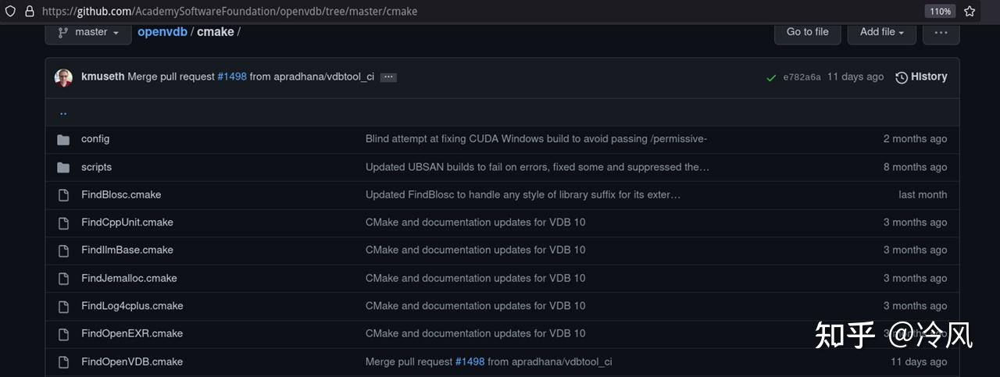
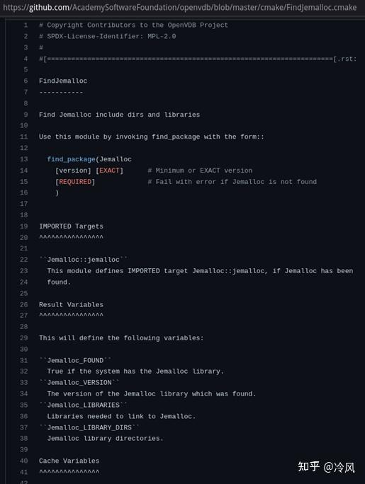
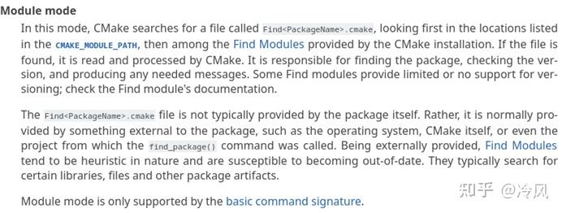
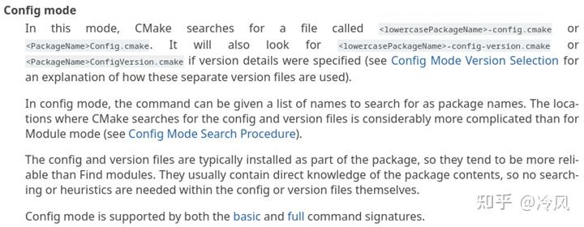

###### datetime:2023/04/17 11:28

###### author:nzb

# find_package的用法

CMake模块化项目管理：第三方库/依赖性配置

用 find_package 寻找系统中安装的第三方库并链接他们。

## find_package 语法

常用参数列表一览：

```text
find_package(<PackageName> [version] [EXACT] [QUIET] [CONFIG] [MODULE]
             [REQUIRED] [[COMPONENTS] [components...]]
             [OPTIONAL_COMPONENTS components...]
)
```

## find_package 命令用法举例

- `find_package(OpenCV)`

查找名为 OpenCV 的包，找不到不报错，事后可以通过 ${OpenCV_FOUND} 查询是否找到。

- `find_package(OpenCV QUIET)`

查找名为 OpenCV 的包，找不到不报错，也不打印任何信息。

- `find_package(OpenCV REQUIRED)` # 最常见用法

查找名为 OpenCV 的包，找不到就报错（并终止 cmake 进程，不再继续往下执行）。

- `find_package(OpenCV REQUIRED COMPONENTS core videoio)`

查找名为 OpenCV 的包，找不到就报错，且必须具有 OpenCV::core 和 OpenCV::videoio 这两个组件，如果没有这两个组件也会报错。

- `find_package(OpenCV REQUIRED OPTIONAL_COMPONENTS core videoio)`

查找名为 OpenCV 的包，找不到就报错，可具有 `OpenCV::core` 和 `OpenCV::videoio` 这两个组件，没有这两组件不会报错，通过 `${OpenCV_core_FOUND}` 查询是否找到 `core`
组件。

## find_package 说是找“包(package)”，到底是在找什么？

### 寻找包配置文件

`find_package(OpenCV)` 实际上是在找一个名为 `OpenCVConfig.cmake` 的文件。

> 注：出于历史兼容性考虑，除了 `OpenCVConfig.cmake` 以外 `OpenCV-config.cmake` 这个文件名也会被 CMake 识别到。

同理，`find_package(Qt5)` 则是会去找名为 `Qt5Config.cmake` 的文件。

这些形如 `包名 + Config.cmake` 的文件，我称之为包配置文件。

`Qt5Config.cmake` 是在安装 `Qt5` 时，随 `libQt5Core.so` 等实际的库文件，一起装到系统中去的。

以 `Arch Linux` 系统为例：

- **包配置文件位于** `/usr/lib/cmake/Qt5/Qt5Config.cmake`。
- **实际的动态库文件位于** `/usr/lib/libQt5Core.so`。

以 Ubuntu 22.04 系统为例：

- **包配置文件位于** `/usr/lib/x86_64-linux-gnu/cmake/Qt5/Qt5Config.cmake`
- **实际的动态库文件位于** `/usr/lib/x86_64-linux-gnu/libQt5Core.so`

### 包配置文件包含什么？

因此 `find_package` 并**不是直接去找具体的动态库文件和头文件**（例如`libQt5Core.so`）。而是去找**包配置文件**（例如`Qt5Config.cmake`）， 这个**配置文件里包含了包的具体信息**
，包括**动态库文件的位置，头文件的目录，链接时需要开启的编译选项**等等。

而且某些库都具有多个子动态库，例如 `Qt` 就有 `libQt5Core.so`、`libQt5Widgets.so`、`libQt5Network.so`。 因此 CMake 要求所有第三方库作者**
统一包装成一个** `Qt5Config.cmake` 文件包含所有相关信息（类似于 nodejs 的 package.json），比你单独的一个个去找动态库文件要灵活的多。

> 在`XXXConfig.cmake`文件中，库的路径都是**相对路径**，比如说`../../libXXX.so`，而**不是绝对路径**`/usr/lib/libXXX.so...`
> 这样做可以让CMake更容易找到对应的动态库，因为不一定每个人的系统库都是安装在`/usr/lib/...`下！比如Arch Linux和Ubuntu的库安装路径就不一样！因此相对路径会更加方便。

### 包配置文件怎么来的？

包配置文件由第三方库的作者（Qt的开发团队）提供，在这个库安装时（Qt的**安装程序**或`apt install`等）会自动放到 `/usr/lib/cmake/XXX/XXXConfig.cmake` 这个路径（其中XXX是包名），供
CMake 用户找到并了解该包的具体信息。
`/usr/lib/cmake` 这个位置是 CMake 和第三方库作者约定俗成的，由第三方库的安装程序负责把包配置文件放到这里。如果第三方库的作者比较懒，没提供 CMake 支持（由安装程序提供`XXXConfig.cmake`
），那么得用另外的一套方法（`FindXXX.cmake`），稍后细谈。

### Windows 系统下的搜索路径

```text
<prefix>/
<prefix>/cmake/
<prefix>/<name>*/
<prefix>/<name>*/cmake/
<prefix>/<name>*/(lib/<arch>|lib*|share)/cmake/<name>*/
<prefix>/<name>*/(lib/<arch>|lib*|share)/<name>*/
<prefix>/<name>*/(lib/<arch>|lib*|share)/<name>*/cmake/
```

其中：

- `<prefix> `是变量 `${CMAKE_PREFIX_PATH}`，Windows 平台默认为 `C:/Program Files`。
- `<name> `是你在 `find_package(<name> REQUIRED)` 命令中指定的包名。
- `<arch>` 是系统的架构名。

### Unix 类系统下的搜索路径

```text
<prefix>/(lib/<arch>|lib*|share)/cmake/<name>*/
<prefix>/(lib/<arch>|lib*|share)/<name>*/
<prefix>/(lib/<arch>|lib*|share)/<name>*/cmake/
<prefix>/<name>*/(lib/<arch>|lib*|share)/cmake/<name>*/
<prefix>/<name>*/(lib/<arch>|lib*|share)/<name>*/
<prefix>/<name>*/(lib/<arch>|lib*|share)/<name>*/cmake/
```

其中：

- `<prefix>` 是变量 `${CMAKE_PREFIX_PATH}`，Unix 平台默认为 `/usr`。
- `<name>` 是你在 `find_package(<name> REQUIRED)` 命令中指定的包名。
- `<arch>` 是系统的架构，例如 `x86_64-linux-gnu` 或 `i386-linux-gnu`。
    - （用于伺候 Ubuntu 喜欢把库文件套娃在 `/usr/lib/x86_64-linux-gnu` 目录下）

### 举例说明 find_package 搜索路径

例如你是 64 位的 Linux 系统，`find_package(Qt5 REQUIRED)` 会依次搜索：

```text
/usr/lib/cmake/Qt5/Qt5Config.cmake
/usr/lib/x86_64-linux-gnu/cmake/Qt5/Qt5Config.cmake
/usr/share/cmake/Qt5/Qt5Config.cmake
/usr/lib/Qt5/Qt5Config.cmake
/usr/lib/x86_64-linux-gnu/Qt5/Qt5Config.cmake
/usr/share/Qt5/Qt5Config.cmake
/usr/Qt5/lib/cmake/Qt5/Qt5Config.cmake
/usr/Qt5/lib/x86_64-linux-gnu/cmake/Qt5/Qt5Config.cmake
/usr/Qt5/share/cmake/Qt5/Qt5Config.cmake
/usr/Qt5/lib/Qt5/Qt5Config.cmake
/usr/Qt5/lib/x86_64-linux-gnu/Qt5/Qt5Config.cmake
/usr/Qt5/share/Qt5/Qt5Config.cmake
```

例如你是 64 位的 Windows 系统，`find_package(Qt5 REQUIRED)` 会依次搜索：

```text
C:/Program Files/Qt5Config.cmake
C:/Program Files/cmake/Qt5Config.cmake
C:/Program Files/Qt5/Qt5Config.cmake
C:/Program Files/Qt5/cmake/Qt5Config.cmake
C:/Program Files/Qt5/lib/cmake/Qt5/Qt5Config.cmake
C:/Program Files/Qt5/lib/x86_64-windows-gnu/cmake/Qt5/Qt5Config.cmake
C:/Program Files/Qt5/share/cmake/Qt5/Qt5Config.cmake
C:/Program Files/Qt5/lib/Qt5/Qt5Config.cmake
C:/Program Files/Qt5/lib/x86_64-windows-gnu/Qt5/Qt5Config.cmake
C:/Program Files/Qt5/share/Qt5/Qt5Config.cmake
```

还有一点，`<name>` 可以有额外后缀，且不分大小写（无论 Linux 还是 Windows），例如在Windows系统中：

```text
C:/Program Files/Qt5/cmake/Qt5Config.cmake
C:/Program Files/Qt5.12.1/cmake/Qt5Config.cmake
C:/Program Files/qt5dnmd/cmake/Qt5Config.cmake
```

都是可以被 `find_package(Qt5 REQUIRED)` 搜索到的。

在 Linux 系统中：

```text
/usr/lib/cmake/OpenCV/OpenCVConfig.cmake
/usr/lib/cmake/opencv4/OpenCVConfig.cmake
```

都是可以被 `find_package(OpenCV REQUIRED)` 搜索到的。

## 安装在非标准路径的库如何处理？

以 Qt5 为例，如果你安装在下列标准路径，find_package 能够自动找到。

- Windows：`C:/Program Files/Qt5.12.1/lib/cmake/Qt5/Qt5Config.cmake`。
- Linux：`/usr/lib/cmake/Qt5/Qt5Config.cmake`。

但是假如我的库不是装在这些标准路径，而是我自定义的路径，怎么办？ 而且即使你不自定义安装路径，Windows 版的 Qt **默认安装**就会安装到：

```text
C:/Qt5.12.1/msvc2017_64/lib/cmake/Qt5/Qt5Config.cmake。
```

何况我们同学有的还喜欢装到 D 盘去，Windows 是非标准路径的重灾区，他就没有一个统一的 /usr/lib 目录。然而你一旦把库安装到非标准路径，find_package 是找不到的。

这时你**需要手动指定一个变量**告诉他在哪儿，可以是普通变量 `${Qt5_DIR}`，也可以是环境变量 `$ENV{Qt5_DIR}`，两个中只要设置了任何一个 `find_package` 都可以识别到。
变量一般通过命令行 `-DQt5_DIR=”C:/Program Files/Qt5.12.1/lib/cmake/Qt5”` 设置。

### 举例，Windows 系统，Qt5

例如我把 `Qt5` 安装到了 `D:/Qt5.12.1`。 首先找到他里面的 `Qt5Config.cmake` 文件所在位置（可以用文件管理器的“搜索”功能或者everything）。

假如你找到该文件的位置是 `D:/Qt5.12.1/msvc2017/lib/cmake/Qt5/Qt5Config.cmake`，那么请你设置变量 `Qt5_DIR`
为 `D:/Qt5.12.1/msvc2017/lib/cmake/Qt5`。有三种设置方法：

- **单次有效**。在 `configure` 阶段，可以从命令行设置（注意要加引号）： `cmake -B build -DQt5_DIR=”D:/Qt5.12.1/msvc2017/lib/cmake/Qt5”`
- **全局启用**。右键“我的电脑”->“管理”->“高级”添加一个环境变量 `Qt5_DIR` 值为 `D:/Qt5.12.1/msvc2017/lib/cmake/Qt5`，然后重启 `Visual Studio`。
  这样以后你每次构建任何项目，`find_package` 都能自动找到这个路径的 `Qt5` 包了。
- **单项目有效**。直接在你自己项目的 `CMakeLists.txt` 最开头写一行（注意要加引号）： `set(Qt5_DIR ”D:/Qt5.12.1/msvc2017/lib/cmake/Qt5”)` # **
  一定要加在最前面**！

### 举例，Linux 系统，Qt5

例如我把 `Qt5` 安装到了 `/opt/Qt5.12.1`。 首先找到他里面的 `Qt5Config.cmake` 文件所在位置（可以用文件管理器的“搜索”功能）。
假如你找到该文件的位置是 `/opt/Qt5.12.1/lib/cmake/Qt5/Qt5Config.cmake`，那么请你设置变量 `Qt5_DIR` 为 `/opt/Qt5.12.1/lib/cmake/Qt5`。有三种设置方法：

- **单次有效**。在 `configure` 阶段，可以从命令行设置： `cmake -B build -DQt5_DIR=”/opt/Qt5.12.1/lib/cmake/Qt5”`
- **全局启用**。修改你的 `~/.bashrc` 文件添加环境变量： `export Qt5_DIR=”/opt/Qt5.12.1/lib/cmake/Qt5”`，然后重启终端。这样以后你每次构建任何项目，`find_package`
  都能自动找到这个路径的 `Qt5` 包了。
- **单项目有效**。直接在你自己项目的 `CMakeLists.txt` 最开头写一行： `set(Qt5_DIR ”/opt/Qt5.12.1/lib/cmake/Qt5”)` # **一定要加在最前面**！

### 三种方案利弊分析

- **单次有效（通过命令行）最安全，高度推荐。**
- **全局有效**（添加环境变量）**可能影响以后其他项目**。 比如你的 A 项目依赖 Qt5.12.1，你设置了环境变量 `Qt5_DIR=/opt/Qt5.12.1`，后来又搞了个 B 项目依赖 `Qt5.10.3`
  ，但是你忘了你设置过全局的环境变量指向 5.12.1 了，导致版本冲突。
- `单项目有效`（写死在 CMakeLists.txt）虽然方便了你，但是你的 CMakeLists.txt 拿到别人电脑上就冲突了 （例如你通过 GitHub 开源的），可能你 `set(Qt5_DIR D:/Qt5)`，而人家却需要
  `set(Qt5_DIR E:/Qt5)` 。

所以“单次有效”虽然劳驾您的高抬贵手每次命令行打一下 `-DQt5_DIR=”D:/Qt5”`，但人家也打一下 `-DQt5_DIR=”E:/Qt5”`，就没有冲突，各美其美，美美与共，赋能多元化社会，下沉团队合作发力面。

实际上只要你不删 build，不需要每次都 `-DQt5_DIR` 一下，CMake 具有“记忆”功能。

- `cmake -B build -DQt5_DIR=D:/Qt5` # 只需要第一次指定好
- `cmake -B build` # 以后第二次运行可以省略！
- `rm -rf build` # 只有清理了 build 以后，
- `cmake -B build -DQt5_DIR=D:/Qt5` # 才需要重新指定。

## 科普：类似 Qt 这种亲 Unix 软件，在 Windows 下的目录组织格式

例如你安装 Qt 时设置安装路径为 `D:/Qt5.12.1`。 则你会看到他下面有几个子目录：

- `D:/Qt5.12.1/msvc2017_64`（由VS2017编译64位版本）
- `D:/Qt5.12.1/mingw_64`（由MinGW编译64位版本）

这几个目录里又分别包含：

- `D:/Qt5.12.1/msvc2017_64/include/qt/QtCore/qstring.h`（实际的头文件，属于 `Qt5::Core`）
- `D:/Qt5.12.1/msvc2017_64/bin/Qt5Core.dll`（实际的动态库文件，对应 `Qt5::Core`）
- `D:/Qt5.12.1/msvc2017_64/lib/Qt5Core.lib`（实际的静态库文件，对应 `Qt5::Core`）
- `D:/Qt5.12.1/msvc2017_64/lib/cmake/Qt5/Qt5Config.cmake`（包配置文件）

可以看到尽管是 Windows 版的 Qt，他内部仍然是在模仿 Linux 下 `/usr` 的目录组织格式。

注意这里的 `Qt5Core.dll `位于 `bin` 目录，而不是 `lib` 目录，这是为什么呢？

因为 Windows 要求 exe 和 dll 位于同一目录，否则 exe 在运行时就会找不到 dll。 为了符合 Linux 分离 bin 和 lib 的组织格式，又要伺候 Windows 的沙雕同目录规则，
**我们通常把 dll动态库文件视为“可执行文件”和 exe 一起放到 bin 目录**， 而**静态库**则没有运行时必须同目录的限制，所以可以**照常放到 lib 目录**。

## 科普：类似 Qt 这种亲 Unix 软件，在 Linux 下的目录组织格式

Linux 用户**从源码安装 Qt** 这种库时，会有一个 `--prefix` 选项，**指定安装的根路径**。 默认的 `--prefix` 是 `/usr`，这个路径由全部软件共享，Qt 会把他的文件安装到以下目录：

- `/usr/include/qt/QtCore/qstring.h`（实际的头文件，对应 `Qt5::Core`）
- `/usr/lib/libQt5Core.so`（实际的动态库文件，对应 `Qt5::Core`）
- `/usr/lib/libQt5Core.a`（实际的静态库文件，对应 `Qt5::Core`）
- `/usr/lib/cmake/Qt5/Qt5Config.cmake`（包配置文件，用于 `find_package`）

假如你指定 `--prefix=/usr/local`，这个路径通常是用户自己手动装的软件，那么就会变成： `/usr/local/lib/cmake/Qt5/Qt5Config.cmake`

假如你指定 `--prefix=/opt/myqtroot`，那么就会变成：`/opt/myqtroot/lib/cmake/Qt5/Qt5Config.cmake`
伺候这种非常规安装，就需要设置变量 `-DQt5_DIR=/opt/myqtroot/lib/cmake/Qt5` 了。

## 科普：亲 Unix 软件从源码安装的通用套路

- 通过Makefile 构建系统：
    - `./configure --prefix=/usr --with-some-options` # 生成 Makefile（这个 configure 脚本由 Autoconf 生成）
    - `make -j 8` # 8 核心编译，生成 `libtest.so`
    - `sudo make install` # 安装，拷贝到 `/usr/lib/libtest.so`

- 通过CMake 构建系统：
    - `cmake -B build -DCMAKE_INSTALL_PREFIX=/usr -DWITH_SOME_OPTIONS=ON` # 生成 `Makefile cmake --build`
    - `build --parallel 8` # 8 核心编译，生成 `libtest.so`
    - `sudo cmake --build build --target install` # 安装，拷贝到 `/usr/lib/libtest.so`

注：如果 `-DCMAKE_INSTALL_PREFIX=/usr/local` 则会拷贝到 `/usr/local/lib/libtest.so`

## 如果第三方库发懒，没有提供 Config 文件怎么办？

绝大多数常用 C++ 库都提供了 CMake 支持（即使他们本身不一定是用 CMake 构建的）：

- /usr/lib/cmake/Boost-1.80.0/BoostConfig.cmake
- /usr/lib/cmake/opencv4/OpenCVConfig.cmake
- /usr/lib/cmake/Qt5/Qt5Config.cmake

这些 Config 文件都是由第三方库负责安装到 `/usr/lib/cmake`。

### 通过CMake官方提供的 FindXXX.cmake

但是，也有少数不听话的库，官方不提供 CMake 支持，即安装时不自带 Config 文件。恼人的是，这些不听话的库有些**竟然是非常热门的库**！例如 Python，CUDA，Jemalloc。

- 为了不影响 CMake 用户体验，CMake 发明了 Find 文件（`FindXXX.cmake`），你不支持我是吧？我支持你！Find 文件会`在 CMake 安装时`自动安装到` /usr/share/cmake/Modules`
  。
- 包搜索文件（`FindXXX.cmake`）可以在不知道包具体位置信息的情况下搜索他们（在 `/usr/lib` 等**默认路径搜索**）。

这些都是 CMake `自带`的包搜索文件：

- `/usr/share/cmake/Modules/FindCUDAToolkit.cmake`
- `/usr/share/cmake/Modules/FindPython.cmake`

### 通过热心网友提供的 FindXXX.cmake

那么如果有个不太热门的第三方库没提供包配置文件，CMake 也没提供包搜索文件，我们该如何找到他？这就需要**自己提供包搜索文件**了！别担心，你不用自己写，
**GitHub** 上有很多志士仁人已经写过了对应的包搜索文件，你搜一下 FindXXX.cmake 就能找到了。

举例：[FindJemalloc.cmake](https://link.zhihu.com/?target=https%3A//github.com/AcademySoftwareFoundation/openvdb/blob/master/cmake/FindJemalloc.cmake)





- `ConfigXXX.cmake` 文件通常风格比较统一，都是 `XXX::xxx` 这种格式。
- 但是不同的 Find 文件，特别是这种网上志士仁人自己编写的文件，**风格可能千差万别**（没办法，毕竟不是官方的支持嘛），很多都还是古代 CMake 的用法，例如 ${XXX_LIBRARIES}。
    - 关于具体使用的细节可以打开 `FindXXX.cmake` 文件查看，
    - 文件的前半部分一般是注释，会讲解如何使用。

现在我们就知道该如何解决这个问题了：

- 下载这个文件，放到 `cmake/FindXXX.cmake`。
- 然后在 `CMakeLists.txt` 文件的最前方写一行： `set(CMAKE_MODULE_PATH “${CMAKE_CURRENT_LIST_DIR}/cmake;${CMAKE_MODULE_PATH}”)`

这样做之后， `find_package(XXX)` 就会用你下载的这个 `FindXXX.cmake` 去找包了。

## 现代 vs 古代：用法上完全不同！

- OpenCVConfig.cmake（现代）


- FindCURL.cmake（古代）


- 可以看得到古代CMake不如现代CMake的用法来得统一
- 比如说`target_link_libraries(curltest ${CURL_LIBRARY})`和`target_include_directories(clib PRIVATE ${CURL_INCLUDE_DIR})`
  就需要自己去看官方文档， 然后才知道里面到底返回了什么变量，CURL在这里返回的变量中就有`CURL_LIBRARY`和`CURL_INCLUDE_DIR`
- 远远不如现代CMake的`target_link_libraries(main PUBLIC OpenCV::core)`来得统一。

### 现代和古代的区别

不管是 Find 类还是 Config 类，一定要打开相应的 cmake 文件看看注释，才能确定他是古代风格还是现代风格。

- 古代 CMake 的命名规范高度不统一，有的是 `${XXX_LIBRARIES}`，有的又是 `${XXX_LIBRARY}` ，非常沙雕，需要看相应 cmake 文件的注释，才能确定具体是怎么命名的。
- 现代 CMake 就好多了，统一用 `包名::组件名` 的格式。但是具体的组件名，还是要查看 cmake 文件中的注释才能确定。例如 `CURL::libcurl OpenCV::core Qt5::core TBB::tbb` 等。

古代（仅用于伺候很老的库）：

```text
find_package(XXX)
if (NOT XXX_FOUND)
  message(FATAL_ERROR “XXX not found”)
endif()
target_include_directories(yourapp ${XXX_INCLUDE_DIRS})
target_link_libraries(yourapp ${XXX_LIBRARIES})
```

现代（推荐）：

```text
find_package(XXX REQUIRED COMPONENTS xxx)
target_link_libraries(yourapp XXX::xxx)
```

大多都的库能同时兼容现代和古代

- 大多现代的 Find/Config 文件，都同时兼容现代和古代的用法。
- 特别古老的 Find 文件，则只能用古代的用法。
- 例如下图是 `FindCURL.cmake` 的注释，可以看到 `IMPORTED Targets` 章节是在介绍现代的用法，而 `Result Variables` 章节是在介绍古代的用法，我们尽量用现代的那种就行。


## 官方文档：find_package 的两种模式

其实上面我们已经讲过了，就是Module模式和Config模式两种。





### 指定使用哪种模式

- 只使用Module模式：
    - `find_package(TBB MODULE REQUIRED)`
    - 只会寻找 `FindTBB.cmake`，搜索路径：
        - `${CMAKE_MODULE_PATH}`（默认为 `/usr/share/cmake/Modules`）

- 只使用Config模式：
    - `find_package(TBB CONFIG REQUIRED)`
    - 只会寻找 `TBBConfig.cmake`，搜索路径：
      `${CMAKE_PREFIX_PATH}/lib/cmake/TBB`（默认为 `/usr/lib/cmake/TBB`）
      `${TBB_DIR}` 或 `$ENV{TBB_DIR}`

- 不指定使用模式：
    - `find_package(TBB REQUIRED)`
    - 不指定则两者都会尝试，先尝试`FindTBB.cmake`，再尝试`TBBConfig.cmake`。

### 关于 vcpkg 的坑

- 刚刚说了有些懒惰第三方库，比如 Jemalloc，他不提供 Config 文件，需要我们自己手写个（或抄别人开源项目里的） Find 文件，用起来很不方便。
- 但是 vcpkg 会为所有第三方库，即使是懒惰的 Jemalloc，都配备一个 Config 文件方便你使用 find_package 导入。所以用 vcpkg
  时，尽量用 `find_package(XXX CONFIG REQUIRED)` 避免被 CMake 自带的 Find 文件误导找到别的地方的库（并非 vcpkg 安装的那个）。
- 另外注意 vcpkg 需要的 `CMAKE_TOOLCHAIN_FILE` 如果你用 set 设置，必须在 project 命令前面，并且修改这个变量后要删除 build 目录重新 `cmake -B build`
  一遍才能生效（否则会在旧的环境里找，找不到 vcpkg 装的库）。

## 科普：语义版本号（semantic versioning）系统

软件行业记录版本迭代普遍采用的是一套所谓的**语义版本号系统**，英文简称 semver。

通常他的格式是三个用点分隔开来的十进制数字：`<major>.<minor>.<patch>`，例如：1.2.0，0.6.8，18.11.0

- `major` 称为主版本号，出现功能重大变更，以至于和旧 API 不兼容的时候会增加该号。
- `minor` 称为次版本号，功能有所变更或增加，但依然和旧的 API 兼容时会增加该号。
- `patch` 称为补丁版号，功能没有改变，只是修复了一些 bug 就重新发布时会增加该号。

也有的软件不拘一格（例如 zeno），索性用发布的日期作为版本号的三个数字，例如 2022.11.2。不论采用哪种编号方案，都是几个用点分开的数字，并且数字越大越新，且优先比较靠前面的数字。

因此为了通用，CMake 支持最多四个点分开的版本号：`<major>.<minor>.<patch>.<tweak>`。并且如果你写 0.6.8 他会**自动帮你把多余的 tweak 等于 0**
，也就是说 `0.6.8 == 0.6.8.0，1.2 == 1.2.0 == 1.2.0.0`。

比较版本号时，可以用 `if (${XXX_VERSION} VERSION_LESS 3.1.0)` 判断大小。

### find_package 命令指定版本

- `find_package(OpenCV REQUIRED)`
    - 查找名为 OpenCV 的包，不限版本，事后可以通过 `${OpenCV_VERSION}` 查询找到的版本。


- `find_package(OpenCV 2.0.1 REQUIRED)`
    - 查找版本在 2.0.1 以上的 OpenCV 包（version >= 2.0.1）。
- `find_package(OpenCV 2.0.1 EXACT REQUIRED)`
    - 查找版本刚好为 2.0.1 的 OpenCV 包（version == 2.0.1）。

如果没写全，则没写的部分默认为 0。例如下列三者等价：

- `find_package(OpenCV 2 REQUIRED)`
- `find_package(OpenCV 2.0 REQUIRED)`
- `find_package(OpenCV 2.0.0 REQUIRED)`

## 总结

安装 TBB：

```shell
cd tbb
./configure --prefix=/opt/tbbinstalldir
make -j 8
sudo make install
```

在你的项目里使用 TBB：

```shell
cd yourapp
cmake -B build -DTBB_DIR=/opt/tbbinstalldir/lib/cmake/TBB
cmake --build build --parallel 8
```

CMakeLists.txt 这样写：

```shell
project(yourapp)
add_executable(yourapp yourmain.cpp)
find_package(TBB CONFIG REQUIRED COMPONENTS tbb)
target_link_libraries(yourapp PUBLIC TBB::tbb)
```

## 古代 CMake 常见问题

- 1、`target_link_libraries(yourapp ${XXX_LIBRARIES})`
- 2、 `target_include_directories(yourapp ${XXX_INCLUDE_DIRS})`


- Q: 我明明链接了 XXX 库，编译时却报错“找不到头文件 XXX.h”怎么办？
- A: 你漏了上面的 2。


- Q: 我明明编译都通过了，链接却报错“undefined symbol：XXXfunc”怎么办？
- A: 你漏了上面的 1。

打印检查一下这两个变量是不是空的：`message(“!!!!!!” ${XXX_INCLUDE_DIRS})`

如果为空说明你变量名打错了，CMake 特色就是**找不到变量不报错**，而是**视为空字符串**。

去看一下 `FindXXX.cmake` 里的注释（那就是文档），确定一下到底是什么名字。

## 少见的 add_subdirectory 邪教

大部分第三方库都需要提前安装好，然后再 find_package 找到他，然后才能链接。 也有少数第三方库为了方便，还支持作为子项目加到你的项目中来，这种就不需要 :: 语法。

标准方法：

```text
find_package(spdlog REQUIRED)
target_link_libraries(yourapp PUBLIC spdlog::spdlog)
```

邪教方法：

```shell
add_subdirectory(spdlog)  # 需要下载好他们的源码放到你的根目录下
target_link_libraries(yourapp PUBLIC spdlog)
```


