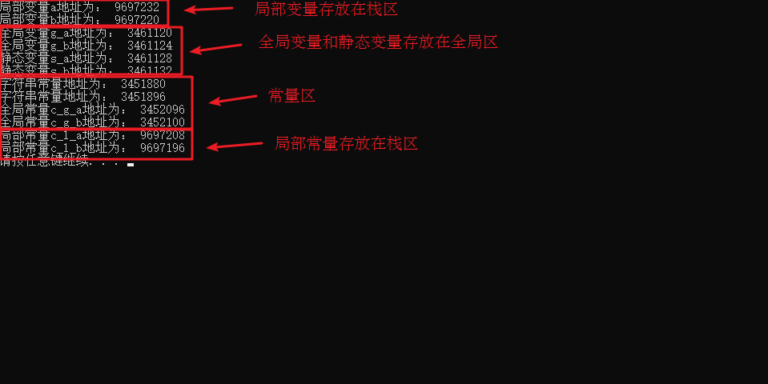

###### datetime:2022/10/18 10:04

###### author:nzb

# 9、内存分区模型

C++程序在执行时，将内存大方向划分为**4个区域**

- 代码区：存放函数体的二进制代码，由操作系统进行管理的
- 全局区：存放全局变量和静态变量以及常量
- 栈区：由编译器自动分配释放, 存放函数的参数值,局部变量等
- 堆区：由程序员分配和释放,若程序员不释放,程序结束时由操作系统回收

**内存四区意义：**

不同区域存放的数据，赋予不同的生命周期, 给我们更大的灵活编程

### 9.1 程序运行前

在程序编译后，生成了exe可执行程序，**未执行该程序前**分为两个区域

- 代码区

    - 存放 CPU 执行的机器指令

    - 代码区是**共享**的，共享的目的是对于频繁被执行的程序，只需要在内存中有一份代码即可

    - 代码区是**只读**的，使其只读的原因是防止程序意外地修改了它的指令

- 全局区

    - 全局变量和静态变量存放在此.

    - 全局区还包含了常量区, 字符串常量和其他常量也存放在此.

    - 该区域的数据在程序结束后由操作系统释放

示例

```c++
//全局变量
int g_a = 10;
int g_b = 10;

//全局常量
const int c_g_a = 10;
const int c_g_b = 10;

int main() {

	//局部变量
	int a = 10;
	int b = 10;

	//打印地址
	cout << "局部变量a地址为： " << (int)&a << endl;
	cout << "局部变量b地址为： " << (int)&b << endl;

	cout << "全局变量g_a地址为： " <<  (int)&g_a << endl;
	cout << "全局变量g_b地址为： " <<  (int)&g_b << endl;

	//静态变量
	static int s_a = 10;
	static int s_b = 10;

	cout << "静态变量s_a地址为： " << (int)&s_a << endl;
	cout << "静态变量s_b地址为： " << (int)&s_b << endl;

	cout << "字符串常量地址为： " << (int)&"hello world" << endl;
	cout << "字符串常量地址为： " << (int)&"hello world1" << endl;

	cout << "全局常量c_g_a地址为： " << (int)&c_g_a << endl;
	cout << "全局常量c_g_b地址为： " << (int)&c_g_b << endl;

	const int c_l_a = 10;
	const int c_l_b = 10;
	cout << "局部常量c_l_a地址为： " << (int)&c_l_a << endl;
	cout << "局部常量c_l_b地址为： " << (int)&c_l_b << endl;

	system("pause");

	return 0;
}
```

打印结果：



- 总结：
    * C++中在程序运行前分为代码区和全局区
    * 代码区特点是共享和只读
    * 全局区中存放全局变量、常量、静态变量
    * 常量区中存放 const修饰的全局常量 和 字符串常量

### 9.2 程序运行后

- 栈区

    - 由编译器自动分配释放, 存放函数的参数值（形参），局部变量等
    - 注意事项：**不要返回局部变量的地址**，栈区开辟的数据由编译器自动释放

示例

```c++
int * func()
{
	int a = 10; // 局部变量 存放在栈区，栈区的数据在函数执行完后自动释放
	return &a; // 返回局部变量的地址
}

int main() {

	int * p = func();

	cout << *p << endl;  // 第一次可以打印正确的数字，是因为编译器做了保留
	cout << *p << endl;  // 第二次数据不再保留了

	system("pause");

	return 0;
}
```

- 堆区
    - 由程序员分配释放,若程序员不释放,程序结束时由操作系统回收
    - 在C++中主要利用`new`在堆区开辟内存

示例

```c++
int * func()
{
    // 利用`new`在堆区开辟内存
    // 指针 本质也是局部变量，放在栈上，指针保存的数据是放在堆区
	int * a = new int(10);
	return a;
}

int main() {

	int *p = func();

	cout << *p << endl;
	cout << *p << endl;
    
	system("pause");

	return 0;
}
```

- 总结
    - 堆区数据由程序员管理开辟和释放
    - 堆区数据利用new关键字进行开辟内存

### 9.3 new操作符

C++中利用`new`操作符在堆区开辟数据

堆区开辟的数据，由程序员手动开辟，手动释放，释放利用操作符`delete`

- 语法：` new 数据类型`，利用new创建的数据，会返回该数据对应的类型的指针

- 示例1： 基本语法

```c++
int * func()
{
	int * a = new int(10);
	return a;
}

int main() {

	int * p = func();

	cout << *p << endl;
	cout << *p << endl;

	//利用delete释放堆区数据
	delete p;

	//cout << *p << endl; //报错，释放的空间不可访问

	system("pause");

	return 0;
}
```

- 示例2：开辟数组

```c++
//堆区开辟数组
int main() {

	int * arr = new int[10];

	for (int i = 0; i < 10; i++)
	{
		arr[i] = i + 100;
	}

	for (int i = 0; i < 10; i++)
	{
		cout << arr[i] << endl;
	}
	//释放数组 delete 后加 []
	delete[] arr;

	system("pause");

	return 0;
}

```


