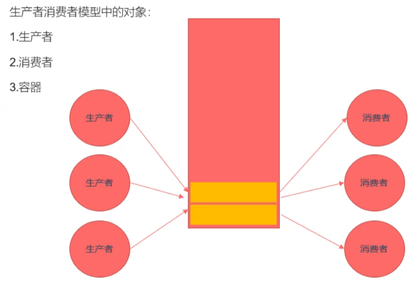

###### datetime:2023/03/10 14:09

###### author:nzb

# 线程同步

- 线程的主要优势在于，能够通过全局变量来共享信息。不过，这种便捷的共享是有代价 的：必须确保多个线程不会同时修改同一变量，或者某一线程不会读取正在由其他线程 修改的变量。
- 临界区是指访问某一共享资源的代码片段，并且这段代码的执行应为原子操作，也就是 同时访问同一共享资源的其他线程不应中断该片段的执行。
- 线程同步：即当有一个线程在对内存进行操作时，其他线程都不可以对这个内存地址进 行操作，直到该线程完成操作，其他线程才能对该内存地址进行操作，而其他线程则处 于等待状态。
- 线程同步方法
    - 互斥锁
    - 读写锁
    - 条件变量
    - 信号量

```c++
/*
    使用多线程实现买票的案例。
    有3个窗口，一共是100张票。
*/

#include <stdio.h>
#include <pthread.h>
#include <unistd.h>

// 全局变量，所有的线程都共享这一份资源。
int tickets = 100;

void * sellticket(void * arg) {
    // 卖票
    while(tickets > 0) {
        usleep(6000);
        printf("%ld 正在卖第 %d 张门票\n", pthread_self(), tickets);
        tickets--;
    }
    return NULL;
}

int main() {

    // 创建3个子线程
    pthread_t tid1, tid2, tid3;
    pthread_create(&tid1, NULL, sellticket, NULL);
    pthread_create(&tid2, NULL, sellticket, NULL);
    pthread_create(&tid3, NULL, sellticket, NULL);

    // 回收子线程的资源,阻塞
    pthread_join(tid1, NULL);
    pthread_join(tid2, NULL);
    pthread_join(tid3, NULL);

    // 设置线程分离。
    // pthread_detach(tid1);
    // pthread_detach(tid2);
    // pthread_detach(tid3);

    pthread_exit(NULL); // 退出主线程

    return 0;
}
```

- **注意**：分离后`join`，会报错。
- `usleep(3000)`：3000微秒。

### 互斥锁

- 为避免线程更新共享变量时出现问题，可以使用互斥量(mutex是mutual exclusion 的缩写)来确保同时仅有一个线程可以访问某项共享资源。可以使用互斥量来保证对任意共 享资源的原子访问。
- 互斥量有两种状态：已锁定(locked)和未锁定(unlocked) 0任何时候，至多只有一 个线程可以锁定该互斥量。试图对已经锁定的某一互斥量再次加锁，将可能阻塞线程或者报 错失败，具体取决于加锁时使用的方法。
- 一旦线程锁定互斥量，随即成为该互斥量的所有者.只有所有者才能给互斥量解锁。一般情 况下，对每一共享资源(可能由多个相关变量组成)会使用不同的互斥量，每一线程在访问 同一资源时将采用如下协议：
    - 针对共享资源锁定互斥量
    - 访问共享资源
    - 对互斥量解锁
- 如果多个线程试图执行这一块代码（一个临界区），事实上只有一个线程能够持有该互斥 量（其他线程将遭到阻塞），即同时只有一个线程能够进入这段代码区域。

#### 相关函数

- 互斥量的类型 `pthread_mutex_t`
- `int pthread_mutex_init(pthread_mutex_t *restrict mutex, const pthread_mutex_attr_t *restrict attr);`
    - 初始化互斥量
    - 参数 ：
        - mutex：需要初始化的互斥量变量
        - attr：互斥量相关的属性，NULL
    - restrict：C语言的修饰符，被修饰的指针，不能由另外的一个指针进行操作。
        - `pthread_mutex_t *restrict mutex = xxx;`
        - `pthread_mutex_t * mutex1 = mutex;`

- `int pthread_mutex_destroy(pthread_mutex_t *mutex);`
    - 释放互斥量的资源

- `int pthread_mutex_lock(pthread_mutex_t *mutex);`
    - 加锁，阻塞的，如果有一个线程加锁了，那么其他的线程只能阻塞等待

- `int pthread_mutex_trylock(pthread_mutex_t *mutex);`
    - 尝试加锁，如果加锁失败，不会阻塞，会直接返回。

- `int pthread_mutex_unlock(pthread_mutex_t *mutex);`
    - 解锁

```c++
#include <stdio.h>
#include <pthread.h>
#include <unistd.h>

// 全局变量，所有的线程都共享这一份资源。
int tickets = 1000;

// 创建一个互斥量
pthread_mutex_t mutex;

void * sellticket(void * arg) {

    // 卖票
    while(1) {

        // 加锁
        pthread_mutex_lock(&mutex);

        if(tickets > 0) {
            usleep(6000);
            printf("%ld 正在卖第 %d 张门票\n", pthread_self(), tickets);
            tickets--;
        }else {
            // 解锁
            pthread_mutex_unlock(&mutex);
            break;
        }

        // 解锁
        pthread_mutex_unlock(&mutex);
    }


    return NULL;
}

int main() {

    // 初始化互斥量
    pthread_mutex_init(&mutex, NULL);

    // 创建3个子线程
    pthread_t tid1, tid2, tid3;
    pthread_create(&tid1, NULL, sellticket, NULL);
    pthread_create(&tid2, NULL, sellticket, NULL);
    pthread_create(&tid3, NULL, sellticket, NULL);

    // 回收子线程的资源,阻塞
    pthread_join(tid1, NULL);
    pthread_join(tid2, NULL);
    pthread_join(tid3, NULL);

    pthread_exit(NULL); // 退出主线程

    // 释放互斥量资源
    pthread_mutex_destroy(&mutex);

    return 0;
}
```

### 死锁

- 有时，一个线程需要同时访问两个或更多不同的共享资源，而每个资源又都由不同的互 斥量管理。当超过一个线程加锁同一组互斥量时，就有可能发生死锁。
- 两个或两个以上的进程在执行过程中，因争夺共享资源而造成的一种互相等待的现象, 若无外力作用，它们都将无法推进下去。此时称系统处于死锁状态或系统产生了死锁。
- 死锁的几种场景
    - 忘记释放锁
    - 重复加锁
    - 多线程多锁，抢占锁资源


`deadlock.c`

```c++
#include <stdio.h>
#include <pthread.h>
#include <unistd.h>

// 全局变量，所有的线程都共享这一份资源。
int tickets = 1000;

// 创建一个互斥量
pthread_mutex_t mutex;

void * sellticket(void * arg) {

    // 卖票
    while(1) {

        // 加锁
        pthread_mutex_lock(&mutex);
        pthread_mutex_lock(&mutex);

        if(tickets > 0) {
            usleep(6000);
            printf("%ld 正在卖第 %d 张门票\n", pthread_self(), tickets);
            tickets--;
        }else {
            // 解锁
            pthread_mutex_unlock(&mutex);
            break;
        }

        // 解锁
        pthread_mutex_unlock(&mutex);
        pthread_mutex_unlock(&mutex);
    }

    return NULL;
}

int main() {

    // 初始化互斥量
    pthread_mutex_init(&mutex, NULL);

    // 创建3个子线程
    pthread_t tid1, tid2, tid3;
    pthread_create(&tid1, NULL, sellticket, NULL);
    pthread_create(&tid2, NULL, sellticket, NULL);
    pthread_create(&tid3, NULL, sellticket, NULL);

    // 回收子线程的资源,阻塞
    pthread_join(tid1, NULL);
    pthread_join(tid2, NULL);
    pthread_join(tid3, NULL);

    pthread_exit(NULL); // 退出主线程

    // 释放互斥量资源
    pthread_mutex_destroy(&mutex);

    return 0;
}
```

`deadlock1.c(多线程多锁造成的死锁场景)`

```c++
#include <stdio.h>
#include <pthread.h>
#include <unistd.h>

// 创建2个互斥量
pthread_mutex_t mutex1, mutex2;

void * workA(void * arg) {

    pthread_mutex_lock(&mutex1);
    sleep(1);
    pthread_mutex_lock(&mutex2);

    printf("workA....\n");

    pthread_mutex_unlock(&mutex2);
    pthread_mutex_unlock(&mutex1);
    return NULL;
}


void * workB(void * arg) {
    pthread_mutex_lock(&mutex2);
    sleep(1);
    pthread_mutex_lock(&mutex1);

    printf("workB....\n");

    pthread_mutex_unlock(&mutex1);
    pthread_mutex_unlock(&mutex2);

    return NULL;
}

int main() {

    // 初始化互斥量
    pthread_mutex_init(&mutex1, NULL);
    pthread_mutex_init(&mutex2, NULL);

    // 创建2个子线程
    pthread_t tid1, tid2;
    pthread_create(&tid1, NULL, workA, NULL);
    pthread_create(&tid2, NULL, workB, NULL);

    // 回收子线程资源
    pthread_join(tid1, NULL);
    pthread_join(tid2, NULL);

    // 释放互斥量资源
    pthread_mutex_destroy(&mutex1);
    pthread_mutex_destroy(&mutex2);

    return 0;
}
```

### 读写锁

- 当有一个线程已经持有互斥锁时，互斥锁将所有试图进入临界区的线程都阻塞住。但是考 虑一种情形，当前持有互斥锁的线程只是要读访问共享资源，而同时有其它几个线程也想
  读取这个共享资源，但是由于互斥锁的排它性，所有其它线程都无法获取锁，也就无法读 访问共享资源了，但是实际上多个线程同时读访问共享资源并不会导致问题。
- 在对数据的读写操作中，更多的是读操作，写操作较少，例如对数据库数据的读写应用。 为了满足当前能够允许多个读出，但只允许一个写入的需求，线程提供了读写锁来实现。
- 读写锁的特点
    - 如果有其它线程读数据，则允许其它线程执行读操作，但不允许写操作。
    - 如果有其它线程写数据，则其它线程都不允许读、写操作。
    - 写是独占的，写的优先级高。

#### 相关函数

- 读写锁的类型 `pthread_rwlock_t`
- `int pthread_rwlock_init(pthread_rwlock_t *restrict rwlock, const pthread_rwlockattr_t *restrict attr);`
- `int pthread_rwlock_destroy(pthread_rwlock_t *rwlock);`
- `int pthread_rwlock_rdlock(pthread_rwlock_t *rwlock);`
- `int pthread_rwlock_tryrdlock(pthread_rwlock_t *rwlock);`
- `int pthread_rwlock_wrlock(pthread_rwlock_t *rwlock);`
- `int pthread_rwlock_trywrlock(pthread_rwlock_t *rwlock);`
- `int pthread_rwlock_unlock(pthread_rwlock_t *rwlock);`

```c++
/*
    案例：8个线程操作同一个全局变量。
    3个线程不定时写这个全局变量，5个线程不定时的读这个全局变量
*/

#include <stdio.h>
#include <pthread.h>
#include <unistd.h>

// 创建一个共享数据
int num = 1;
// pthread_mutex_t mutex;
pthread_rwlock_t rwlock;

void * writeNum(void * arg) {

    while(1) {
        pthread_rwlock_wrlock(&rwlock);
        num++;
        printf("++write, tid : %ld, num : %d\n", pthread_self(), num);
        pthread_rwlock_unlock(&rwlock);
        usleep(100);
    }

    return NULL;
}

void * readNum(void * arg) {

    while(1) {
        pthread_rwlock_rdlock(&rwlock);
        printf("===read, tid : %ld, num : %d\n", pthread_self(), num);
        pthread_rwlock_unlock(&rwlock);
        usleep(100);
    }

    return NULL;
}

int main() {

   pthread_rwlock_init(&rwlock, NULL);

    // 创建3个写线程，5个读线程
    pthread_t wtids[3], rtids[5];
    for(int i = 0; i < 3; i++) {
        pthread_create(&wtids[i], NULL, writeNum, NULL);
    }

    for(int i = 0; i < 5; i++) {
        pthread_create(&rtids[i], NULL, readNum, NULL);
    }

    // 设置线程分离
    for(int i = 0; i < 3; i++) {
       pthread_detach(wtids[i]);
    }

    for(int i = 0; i < 5; i++) {
         pthread_detach(rtids[i]);
    }

    pthread_exit(NULL);

    pthread_rwlock_destroy(&rwlock);

    return 0;
}
```

### 生产者和消费者模型

该模型采用链表结构实现。



```c++
/*
    生产者消费者模型（粗略的版本）
*/
#include <stdio.h>
#include <pthread.h>
#include <stdlib.h>
#include <unistd.h>

// 创建一个互斥量
pthread_mutex_t mutex;

struct Node{
    int num;
    struct Node *next;
};

// 头结点
struct Node * head = NULL;

void * producer(void * arg) {

    // 不断的创建新的节点，添加到链表中
    while(1) {
        pthread_mutex_lock(&mutex);
        struct Node * newNode = (struct Node *)malloc(sizeof(struct Node));
        newNode->next = head;
        head = newNode;
        newNode->num = rand() % 1000;
        printf("add node, num : %d, tid : %ld\n", newNode->num, pthread_self());
        pthread_mutex_unlock(&mutex);
        usleep(100);
    }

    return NULL;
}

void * customer(void * arg) {

    while(1) {
        pthread_mutex_lock(&mutex);
        // 保存头结点的指针
        struct Node * tmp = head;

        // 判断是否有数据
        if(head != NULL) {
            // 有数据
            head = head->next;
            printf("del node, num : %d, tid : %ld\n", tmp->num, pthread_self());
            free(tmp);
            pthread_mutex_unlock(&mutex);
            usleep(100);
        } else {
            // 没有数据
            pthread_mutex_unlock(&mutex);
        }
    }
    return  NULL;
}

int main() {

    pthread_mutex_init(&mutex, NULL);

    // 创建5个生产者线程，和5个消费者线程
    pthread_t ptids[5], ctids[5];

    for(int i = 0; i < 5; i++) {
        pthread_create(&ptids[i], NULL, producer, NULL);
        pthread_create(&ctids[i], NULL, customer, NULL);
    }

    for(int i = 0; i < 5; i++) {
        pthread_detach(ptids[i]);
        pthread_detach(ctids[i]);
    }

    while(1) {
        sleep(10);
    }

    pthread_mutex_destroy(&mutex);

    pthread_exit(NULL);

    return 0;
}
```

### 条件变量

- 条件变量的类型 `pthread_cond_t`
- `int pthread_cond_init(pthread_cond_t *restrict cond, const pthread_condattr_t *restrict attr);`
- `int pthread_cond_destroy(pthread_cond_t *cond);`
- `int pthread_cond_wait(pthread_cond_t *restrict cond, pthread_mutex_t *restrict mutex);`
    - 等待，调用了该函数，线程会阻塞，内部流程如下
      - 释放了互斥锁
      - 等待条件
      - 条件被触发
      - 给互斥锁加锁
      - 其中：条件被触发和给互斥锁加锁是原子操作
- `int pthread_cond_timedwait(pthread_cond_t *restrict cond, pthread_mutex_t *restrict mutex, const struct timespec *restrict abstime);`
    - 等待多长时间，调用了这个函数，线程会阻塞，直到指定的时间结束。
- `int pthread_cond_signal(pthread_cond_t *cond);`
    - 唤醒一个或者多个等待的线程
- `int pthread_cond_broadcast(pthread_cond_t *cond);`
    - 唤醒所有的等待的线程
- **注意**：解决线程同步的方法有互斥锁和读写锁，条件变量不是锁，条件变量不用来解决线程同步的问题。

```c++
#include <stdio.h>
#include <pthread.h>
#include <stdlib.h>
#include <unistd.h>

// 创建一个互斥量
pthread_mutex_t mutex;
// 创建条件变量
pthread_cond_t cond;

struct Node{
    int num;
    struct Node *next;
};

// 头结点
struct Node * head = NULL;

void * producer(void * arg) {

    // 不断的创建新的节点，添加到链表中
    while(1) {
        pthread_mutex_lock(&mutex);
        struct Node * newNode = (struct Node *)malloc(sizeof(struct Node));
        newNode->next = head;
        head = newNode;
        newNode->num = rand() % 1000;
        printf("add node, num : %d, tid : %ld\n", newNode->num, pthread_self());

        // 只要生产了一个，就通知消费者消费
        pthread_cond_signal(&cond);

        pthread_mutex_unlock(&mutex);
        usleep(100);
    }

    return NULL;
}

void * customer(void * arg) {

    while(1) {
        pthread_mutex_lock(&mutex);
        // 保存头结点的指针
        struct Node * tmp = head;
        // 判断是否有数据
        if(head != NULL) {
            // 有数据
            head = head->next;
            printf("del node, num : %d, tid : %ld\n", tmp->num, pthread_self());
            free(tmp);
            pthread_mutex_unlock(&mutex);
            usleep(100);
        } else {
            // 没有数据，需要等待
            // 当这个函数调用阻塞的时候，会对互斥锁进行解锁，当不阻塞的，继续向下执行，会重新加锁。
            pthread_cond_wait(&cond, &mutex);
            pthread_mutex_unlock(&mutex);
        }
    }
    return  NULL;
}

int main() {

    pthread_mutex_init(&mutex, NULL);
    pthread_cond_init(&cond, NULL);

    // 创建5个生产者线程，和5个消费者线程
    pthread_t ptids[5], ctids[5];

    for(int i = 0; i < 5; i++) {
        pthread_create(&ptids[i], NULL, producer, NULL);
        pthread_create(&ctids[i], NULL, customer, NULL);
    }

    for(int i = 0; i < 5; i++) {
        pthread_detach(ptids[i]);
        pthread_detach(ctids[i]);
    }

    while(1) {
        sleep(10);
    }

    pthread_mutex_destroy(&mutex);
    pthread_cond_destroy(&cond);

    pthread_exit(NULL);

    return 0;
}
```

### 信号量（信号灯）

- 信号量的类型 `sem_t`
- `int sem_init(sem_t *sem, int pshared, unsigned int value);`
    - 初始化信号量
    - 参数：
        - sem : 信号量变量的地址
        - pshared : 0 用在线程间 ，非0 用在进程间
        - value : 信号量中的值

- `int sem_destroy(sem_t *sem);`
    - 释放资源

- `int sem_wait(sem_t *sem);`
    - 对信号量加锁，调用一次对信号量的值-1，如果值为0，就阻塞

- `int sem_trywait(sem_t *sem);`

- `int sem_timedwait(sem_t *sem, const struct timespec *abs_timeout);`
- `int sem_post(sem_t *sem);`
    - 对信号量解锁，调用一次对信号量的值+1

- `int sem_getvalue(sem_t *sem, int *sval);`

- **注意**：单独使用信号量不能让线程安全，需要配合使用互斥锁才能保证线程的安全。

```c++
/*
    sem_t psem;
    sem_t csem;
    init(psem, 0, 8);
    init(csem, 0, 0);

    producer() {
        sem_wait(&psem);
        sem_post(&csem)
    }

    customer() {
        sem_wait(&csem);
        sem_post(&psem)
    }

*/

#include <stdio.h>
#include <pthread.h>
#include <stdlib.h>
#include <unistd.h>
#include <semaphore.h>

// 创建一个互斥量
pthread_mutex_t mutex;
// 创建两个信号量
sem_t psem;
sem_t csem;

struct Node{
    int num;
    struct Node *next;
};

// 头结点
struct Node * head = NULL;

void * producer(void * arg) {

    // 不断的创建新的节点，添加到链表中
    while(1) {
        sem_wait(&psem);
        pthread_mutex_lock(&mutex);
        struct Node * newNode = (struct Node *)malloc(sizeof(struct Node));
        newNode->next = head;
        head = newNode;
        newNode->num = rand() % 1000;
        printf("add node, num : %d, tid : %ld\n", newNode->num, pthread_self());
        pthread_mutex_unlock(&mutex);
        sem_post(&csem);
    }

    return NULL;
}

void * customer(void * arg) {

    while(1) {
        sem_wait(&csem);
        pthread_mutex_lock(&mutex);
        // 保存头结点的指针
        struct Node * tmp = head;
        head = head->next;
        printf("del node, num : %d, tid : %ld\n", tmp->num, pthread_self());
        free(tmp);
        pthread_mutex_unlock(&mutex);
        sem_post(&psem);

    }
    return  NULL;
}

int main() {

    pthread_mutex_init(&mutex, NULL);
    sem_init(&psem, 0, 8);
    sem_init(&csem, 0, 0);

    // 创建5个生产者线程，和5个消费者线程
    pthread_t ptids[5], ctids[5];

    for(int i = 0; i < 5; i++) {
        pthread_create(&ptids[i], NULL, producer, NULL);
        pthread_create(&ctids[i], NULL, customer, NULL);
    }

    for(int i = 0; i < 5; i++) {
        pthread_detach(ptids[i]);
        pthread_detach(ctids[i]);
    }

    while(1) {
        sleep(10);
    }

    pthread_mutex_destroy(&mutex);

    pthread_exit(NULL);

    return 0;
}
```
