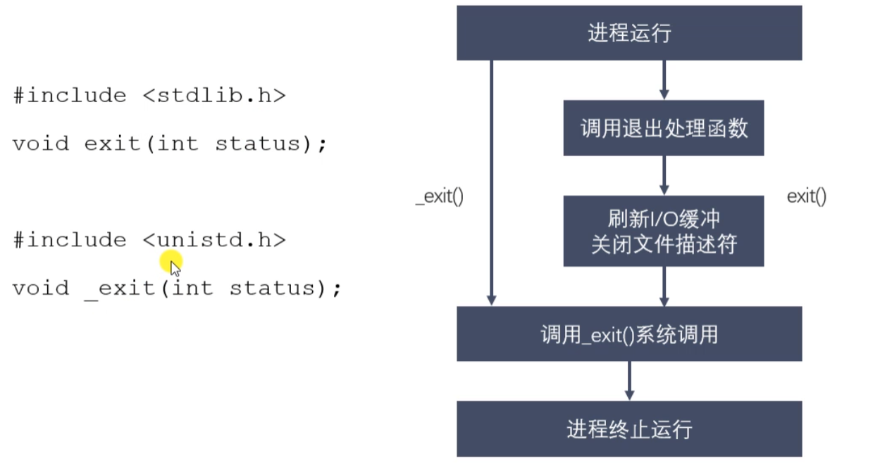

###### datetime:2023/01/06 14:30

###### author:nzb

# 孤儿进程和僵尸进程

## 进程退出



## 孤儿进程

- 父进程运行结束，但子进程还在运行(未运行结束)，这样的子进程就称为孤儿进程 (Orphan Process)。
- 每当出现一个孤儿进程的时候，内核就把孤儿进程的父进程设置为 init 而 init 进程会循环地wait()它的已经退出的子进程。这样，当一个孤儿进程凄凉地结束 了其生命周期的时候，init进程就会代表党和政府出面处理它的一切善后工作。
- 因此孤儿进程并不会有什么危害。

## 僵尸进程

- 每个进程结束之后，都会释放自己地址空间中的用户区数据，内核区的PCB没有办 法自己释放掉，需要父进程去释放。
- 进程终止时，父进程尚未回收，子进程残留资源(PCB)存放于内核中，变成僵尸 (Zombie)进程。
- 僵尸进程不能被`kill -9`杀死。
- 这样就会导致一个问题，如果父进程不调用`wait()`或`waitpid()`
  的话，那么保留的那段信息就不会释放，其进程号就会一直被占用，但是系统所能使用的进程号是有限的，如果大量的产生僵尸进程，将因为没有可用的进程号而导致系统不能产生新 的进程，此即为僵尸进程的危害，应当避免。

exit函数

```c++
/*
#include <stdlib.h>
void exit(int status);

#include <unistd.h>
void _exit(int status);

status参数：是进程退出时的一个状态信息。父进程回收子进程资源的时候可以获取到。
*/
#include <stdio.h>
#include <stdlib.h>
#include <unistd.h>

int main() {

    printf("hello\n");
    printf("world");

    // exit(0);
    _exit(0);

    return 0;
}
```

孤儿进程

```c++
#include <sys/types.h>
#include <unistd.h>
#include <stdio.h>

int main() {

    // 创建子进程
    pid_t pid = fork();

    // 判断是父进程还是子进程
    if(pid > 0) {

        printf("i am parent process, pid : %d, ppid : %d\n", getpid(), getppid());

    } else if(pid == 0) {
        sleep(1);
        // 当前是子进程
        printf("i am child process, pid : %d, ppid : %d\n", getpid(),getppid());
    }

    // for循环
    for(int i = 0; i < 3; i++) {
        printf("i : %d , pid : %d\n", i , getpid());
    }

    return 0;
}
```

僵尸进程

```c++
#include <sys/types.h>
#include <unistd.h>
#include <stdio.h>

int main() {

    // 创建子进程
    pid_t pid = fork();

    // 判断是父进程还是子进程
    if(pid > 0) {
        // 父进程死循环，子进程先退出，产生僵尸进程
        while(1) {
            printf("i am parent process, pid : %d, ppid : %d\n", getpid(), getppid());
            sleep(1);
        }

    } else if(pid == 0) {
        // 当前是子进程
        printf("i am child process, pid : %d, ppid : %d\n", getpid(),getppid());

    }

    // for循环
    for(int i = 0; i < 3; i++) {
        printf("i : %d , pid : %d\n", i , getpid());
    }

    return 0;
}
```

## wait函数

### 进程回收

- 在每个进程退出的时候，内核释放该进程所有的资源、包括打开的文件、占用的内存等。但是仍然为其保留一定的信息，这些信息主要指进程控制块PCB的信息（包括进程号、退出状态、运行时间等）。
- 父进程可以通过调用`wait`或`waitpid`得到它的退出状态同时彻底清除掉这个进程。
- `wait()`和`waitpid()`函数的功能一样，区别在于，`wait()`函数会阻塞，`waitpid()`可以不设置阻塞，`waitpid()`还可以指定等待哪个子进程结束。
- 注意：一次`wait()`或`waitpid()`调用只能清理一个子进程，清理多个子进程应使用循环。

### 退出信息相关宏函数

- `WIFEXITED(status)`: 非0,进程正常退出
- `WEXITSTATUS (status)`: 如果上宏为真，获取进程退出的状态(exit的参数)
  

- `WIFSIGNALED (status)`: 非0,进程异常终止
- `WTERMSIG (status)`: 如果上宏为真，获取使进程终止的信号编号


- `WIFSTOPPED (status)`: 非0,进程处于暂停状态
- `WSTOPSIG(status)`: 如果上宏为真，获取使进程暂停的信号的编号
- `WIFCONTINUED (status)`: 非0,进程暂停后已经继续运行

```c++
#include <sys/types.h>
#include <sys/wait.h>
pid_t wait(int Iwstatus);
  功能：等待任意一个子进程结束，如果任意一个子进程结束了 次函数会回收子进程
  参数：int *wstatus
    进程退出时的状态信息.传入的是一个int类型的地址，传出参数。
  返回值：
    成功：返回被回收的子进程的id
    失败：-1 （所有的子进程都结束，调用函数失败）
调川wait函数的进程会被挂起（阳塞），直到它的一个子进程退出
如果没有子进程了，画数立刻返Ml，返回-1：如果子进程都已经结束了,也会立即返回。
```

## waitpid函数

```c++
#include <sys/types.h>
#include <sys/wait.h>
pid_t waitpid(pid_t pid, int *wstatus, int options);
  功能：回收指定位程号的子进程. 可以设置是否阻塞。
  参数：
    pid:
      pid > 0：某个子进程的pid
      pid = 0：回收当前进程组的所有子进程
      pid = -1：回收所有的子进程.相当于wait()
      pid < -1：某个进程组的组id的绝对值，回收指定进程组中的子进程
    options：设置阻塞或者非阻塞
      0：阻塞
      WNOHANG：非阻塞
  返网值：
    > 0：返回子进程的id
    = 0： options=WNOHANG,表示还有子进程
    = -1：错误，或者没有子进程了
```

```c++
/*
    #include <sys/types.h>
    #include <sys/wait.h>
    pid_t waitpid(pid_t pid, int *wstatus, int options);
        功能：回收指定进程号的子进程，可以设置是否阻塞。
        参数：
            - pid:
                pid > 0 : 某个子进程的pid
                pid = 0 : 回收当前进程组的所有子进程
                pid = -1 : 回收所有的子进程，相当于 wait()  （最常用）
                pid < -1 : 某个进程组的组id的绝对值，回收指定进程组中的子进程
            - options：设置阻塞或者非阻塞
                0 : 阻塞
                WNOHANG : 非阻塞
            - 返回值：
                > 0 : 返回子进程的id
                = 0 : options=WNOHANG, 表示还有子进程活着
                = -1 ：错误，或者没有子进程了
*/
#include <sys/types.h>
#include <sys/wait.h>
#include <stdio.h>
#include <unistd.h>
#include <stdlib.h>

int main() {

    // 有一个父进程，创建5个子进程（兄弟）
    pid_t pid;

    // 创建5个子进程
    for(int i = 0; i < 5; i++) {
        pid = fork();
        if(pid == 0) {
            break;
        }
    }

    if(pid > 0) {
        // 父进程
        while(1) {
            printf("parent, pid = %d\n", getpid());
            sleep(1);

            int st;
            // int ret = waitpid(-1, &st, 0);
            int ret = waitpid(-1, &st, WNOHANG);

            if(ret == -1) {
                break;
            } else if(ret == 0) {
                // 说明还有子进程存在
                continue;
            } else if(ret > 0) {

                if(WIFEXITED(st)) {
                    // 是不是正常退出
                    printf("退出的状态码：%d\n", WEXITSTATUS(st));
                }
                if(WIFSIGNALED(st)) {
                    // 是不是异常终止
                    printf("被哪个信号干掉了：%d\n", WTERMSIG(st));
                }

                printf("child die, pid = %d\n", ret);
            }

        }

    } else if (pid == 0){
        // 子进程
         while(1) {
            printf("child, pid = %d\n",getpid());
            sleep(1);
         }
        exit(0);
    }

    return 0;
}
```