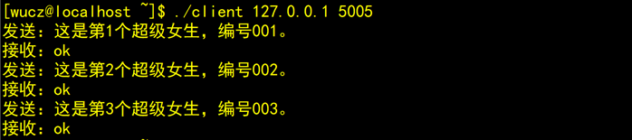
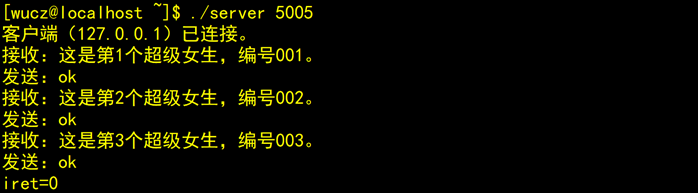

###### datetime:2022/12/19 16:45

###### author:nzb

# socket

## 网络通信socket

socket就是插座（中文翻译成套接字有点莫名其妙），运行在计算机中的两个程序通过socket建立起一个通道，数据在通道中传输。


socket把复杂的TCP/IP协议族隐藏了起来，对程序员来说，只要用好socket相关的函数，就可以完成网络通信。

## 二、socket的分类

socket提供了流（stream）和数据报（datagram）两种通信机制，即流socket和数据报socket。

流socket基于TCP协议，是一个有序、可靠、双向字节流的通道，传输数据不会丢失、不会重复、顺序也不会错乱。就像两个人在打电话，接通后就在线了，您一句我一句的聊天。

数据报socket基于UDP协议，不需要建立和维持连接，可能会丢失或错乱。UDP不是一个可靠的协议，对数据的长度有限制，但是它的速度比较高。就像短信功能，一个人向另一个人发短信，对方不一定能收到。

在实际开发中，数据报socket的应用场景极少，本教程只介绍流socket。

## 三、客户/服务端模式

在TCP/IP网络应用中，两个程序之间通信模式是客户/服务端模式（client/server），客户/服务端也叫作客户/服务器，各人习惯。

### 1、服务端的工作流程

- 1）创建服务端的socket。
- 2）把服务端用于通信的地址和端口绑定到socket上。
- 3）把socket设置为监听模式。
- 4）接受客户端的连接。
- 5）与客户端通信，接收客户端发过来的报文后，回复处理结果。
- 6）不断的重复第5）步，直到客户端断开连接。
- 7）关闭socket，释放资源。

服务端示例（server.cpp）

```c++
#include <stdio.h>
#include <string.h>
#include <unistd.h>
#include <stdlib.h>
#include <netdb.h>
#include <sys/types.h>
#include <sys/socket.h>
#include <arpa/inet.h>

int main(int argc, char *argv[]) {
    if (argc != 2) {
        printf("Using:./server port\nExample:./server 5005\n\n");
        return -1;
    }

    int listenfd;
    // 第1步：创建服务端的socket。
    if ((listenfd = socket(AF_INET, SOCK_STREAM, 0)) == -1) {
        perror("socket");
        return -1;
    }
    printf("fd=%d\n", listenfd);
    // 第2步：把服务端用于通信的地址和端口绑定到socket上。
    struct sockaddr_in servaddr;    // 服务端地址信息的数据结构。
    memset(&servaddr, 0, sizeof(servaddr));
    servaddr.sin_family = AF_INET;  // 协议族，在socket编程中只能是AF_INET。
    servaddr.sin_addr.s_addr = htonl(INADDR_ANY);          // 任意ip地址。
    //servaddr.sin_addr.s_addr = inet_addr("172.17.0.2"); // 指定ip地址。
    servaddr.sin_port = htons(atoi(argv[1]));  // 指定通信端口。
    if (bind(listenfd, (struct sockaddr *) &servaddr, sizeof(servaddr)) != 0) {
        perror("bind");
        close(listenfd);
        return -1;
    }

    // 第3步：把socket设置为监听模式。
    if (listen(listenfd, 3) != 0) {
        perror("listen");
        close(listenfd);
        return -1;
    }

    // 第4步：接受客户端的连接。
    int clientfd;                  // 客户端的socket。
    int socklen = sizeof(struct sockaddr_in); // struct sockaddr_in的大小
    struct sockaddr_in clientaddr;  // 客户端的地址信息。
    // 从已准备好的连接队列中获取一个请求，如果队列为空，accept函数将阻塞等待
    clientfd = accept(listenfd, (struct sockaddr *) &clientaddr, (socklen_t * ) & socklen);
    printf("客户端（%s）已连接,socket=%d.\n", inet_ntoa(clientaddr.sin_addr), clientfd);

    // 第5步：与客户端通信，接收客户端发过来的报文后，回复ok。
    char buffer[1024];
    while (1) {
        int iret;
        memset(buffer, 0, sizeof(buffer));
        if ((iret = recv(clientfd, buffer, sizeof(buffer), 0)) <= 0) // 接收客户端的请求报文。
        {
            printf("iret=%d\n", iret);
            break;
        }
        printf("接收：%s\n", buffer);

        strcpy(buffer, "ok");
        if ((iret = send(clientfd, buffer, strlen(buffer), 0)) <= 0) // 向客户端发送响应结果。
        {
            perror("send");
            break;
        }
        printf("发送：%s\n", buffer);
    }

    // 第6步：关闭socket，释放资源。
    close(listenfd);
    close(clientfd);
}

```

### 2、客户端的工作流程

- 1）创建客户端的socket。
- 2）向服务器发起连接请求。
- 3）与服务端通信，发送一个报文后等待回复，然后再发下一个报文。
- 4）不断的重复第3）步，直到全部的数据被发送完。
- 5）第4步：关闭socket，释放资源。

客户端示例（client.cpp）

```c++
#include <stdio.h>
#include <string.h>
#include <unistd.h>
#include <stdlib.h>
#include <netdb.h>
#include <sys/types.h>
#include <sys/socket.h>
#include <arpa/inet.h>

int main(int argc, char *argv[]) {
    if (argc != 3) {
        printf("Using:./client ip port\nExample:./client 127.0.0.1 5005\n\n");
        return -1;
    }

    // 第1步：创建客户端的socket。
    int sockfd;
    if ((sockfd = socket(AF_INET, SOCK_STREAM, 0)) == -1) {
        perror("socket");
        return -1;
    }

    // 第2步：向服务器发起连接请求。
    struct hostent *h;
    if ((h = gethostbyname(argv[1])) == 0)   // 指定服务端的ip地址。
    {
        printf("gethostbyname failed.\n");
        close(sockfd);
        return -1;
    }
    struct sockaddr_in servaddr;
    memset(&servaddr, 0, sizeof(servaddr));
    servaddr.sin_family = AF_INET;
    servaddr.sin_port = htons(atoi(argv[2])); // 指定服务端的通信端口。
    memcpy(&servaddr.sin_addr, h->h_addr, h->h_length);
    if (connect(sockfd, (struct sockaddr *) &servaddr, sizeof(servaddr)) != 0)  // 向服务端发起连接清求。
    {
        perror("connect");
        close(sockfd);
        return -1;
    }

    char buffer[1024];

    // 第3步：与服务端通信，发送一个报文后等待回复，然后再发下一个报文。
    for (int ii = 0; ii < 3; ii++) {
        int iret;
        memset(buffer, 0, sizeof(buffer));
        sprintf(buffer, "这是第%d个超级女生，编号%03d。", ii + 1, ii + 1);
        if ((iret = send(sockfd, buffer, strlen(buffer), 0)) <= 0) // 向服务端发送请求报文。
        {
            perror("send");
            break;
        }
        printf("发送：%s\n", buffer);

        memset(buffer, 0, sizeof(buffer));
        if ((iret = recv(sockfd, buffer, sizeof(buffer), 0)) <= 0) // 接收服务端的回应报文。
        {
            printf("iret=%d\n", iret);
            break;
        }
        printf("接收：%s\n", buffer);
    }

    // 第4步：关闭socket，释放资源。
    close(sockfd);
}
```

在运行程序之前，必须保证服务器的防火墙已经开通了网络访问策略（云服务器还需要登录云控制平台开通访问策略）。

先启动服务端程序server，服务端启动后，进入等待客户端连接状态，然后启动客户端。

客户端的输出如下：



服务端的输出如下：



## 四、注意事项

### 1、socket文件描述符

在UNIX系统中，一切输入输出设备皆文件，socket()函数的返回值其本质是一个文件描述符，是一个整数。

### 2、服务端程序绑定地址

如果服务器有多个网卡，多个IP地址，socket通信可以指定用其中一个地址来进行通信，也可以任意ip地址。

- 1）指定ip地址的代码

```text
m_servaddr.sin_addr.s_addr = inet_addr("192.168.149.129");  // 指定ip地址
```

- 2）任意ip地址的代码

```text
m_servaddr.sin_addr.s_addr = htonl(INADDR_ANY);  // 本主机的任意ip地址
```

在实际开发中，采用任意ip地址的方式比较多。

### 3、服务端程序绑定的通信端口

```text
m_servaddr.sin_port = htons(5000);  // 通信端口
```

### 4、客户端程序指定服务端的ip地址

```text
struct hostent* h;
if ( (h = gethostbyname("118.89.50.198")) == 0 )   // 指定服务端的ip地址。
{ printf("gethostbyname failed.\n"); close(sockfd); return -1; }
```

### 5、客户端程序指定服务端的通信端口

```text
servaddr.sin_port = htons(5000);
```

### 6、send函数

send函数用于把数据通过socket发送给对端。不论是客户端还是服务端，应用程序都用send函数来向TCP连接的另一端发送数据。

函数声明：`ssize_t send(int sockfd, const void *buf, size_t len, int flags);`

- sockfd为已建立好连接的socket。
- buf为需要发送的数据的内存地址，可以是C语言基本数据类型变量的地址，也可以数组、结构体、字符串，内存中有什么就发送什么。
- len需要发送的数据的长度，为buf中有效数据的长度。
- flags填0, 其他数值意义不大。
- 函数返回已发送的字符数。出错时返回-1，错误信息errno被标记。
- 注意，就算是网络断开，或socket已被对端关闭，send函数不会立即报错，要过几秒才会报错。 如果send函数返回的错误（<=0），表示通信链路已不可用。

### 7、recv函数

recv函数用于接收对端socket发送过来的数据。

recv函数用于接收对端通过socket发送过来的数据。不论是客户端还是服务端，应用程序都用recv函数接收来自TCP连接的另一端发送过来数据。

函数声明：`ssize_t recv(int sockfd, void *buf, size_t len, int flags);`

- sockfd为已建立好连接的socket。
- buf为用于接收数据的内存地址，可以是C语言基本数据类型变量的地址，也可以数组、结构体、字符串，只要是一块内存就行了。
- len需要接收数据的长度，不能超过buf的大小，否则内存溢出。
- flags填0, 其他数值意义不大。
- 函数返回已接收的字符数。出错时返回-1，失败时不会设置errno的值。
- 如果socket的对端没有发送数据，recv函数就会等待，如果对端发送了数据，函数返回接收到的字符数。出错时返回-1。如果socket被对端关闭，返回值为0。
- 如果recv函数返回的错误（<=0），表示通信通道已不可用。

### 8、服务端有两个socket

对服务端来说，有两个socket，一个是用于监听的socket，还有一个就是客户端连接成功后，由accept函数创建的用于与客户端收发报文的socket。

### 9、程序退出时先关闭socket

socket是系统资源，操作系统打开的socket数量是有限的，在程序退出之前必须关闭已打开的socket，就像关闭文件指针一样，就像delete已分配的内存一样，极其重要。

值得注意的是，关闭socket的代码不能只在main函数的最后，那是程序运行的理想状态，还应该在main函数的每个return之前关闭。


