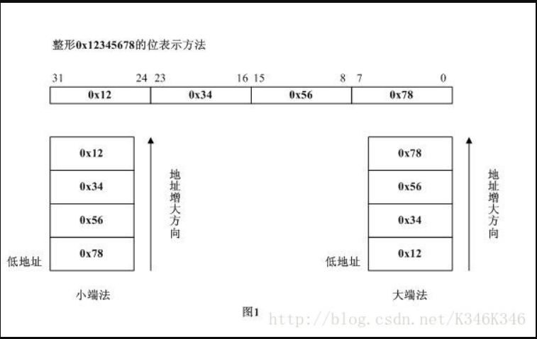

###### datetime:2022/12/19 19:31

###### author:nzb

# 网络字节序与主机字节序

## 1.网络字节序与主机字节序

在Linux网络编程中，经常碰到网络字节序与主机字节序的相互转换。说到网络字节序与主机字节序需要清晰了解以下几个概念。

字节序，顾名思义，指字节在内存中存储的顺序。比如一个int32_t类型的数值占用4个字节，这4个字节在内存中的排列顺序就是字节序。字节序有两种：

- （1）小端字节序（Little endinan），数值低位存储在内存的低地址，高位存储在内存的高地址；
- （2）大端字节序（Big endian），数值高位存储在内存的低地址，低位存储在内存的高地址。

下面以32位位宽数值0x12345678为例，小端字节序与大端字节序具体的存储区别如下所示：



- **主机字节序**，即CPU存储数据时采用的字节顺序。不同的CPU设计时采用的字节序是不同的，谈到字节序的问题，必然牵涉到两大CPU派系。
  那就是Motorola的PowerPC系列CPU和Intel的x86与x86_64（该指令集由AMD率先设计推出）系列CPU。 PowerPC系列采用大端字节序（big
  endian）方式存储数据，而x86与x86_64系列则采用小端字节序（little endian）方式存储数据。 平常大多数PC与服务器如果使用的是Intel与AMD CPU，一般都是小端字节序（little endian）

- **网络字节序**，是TCP/IP中规定好的一种数据表示格式，它与具体的CPU类型、操作系统等无关，从而可以保证数据在不同主机之间传输时能够被正确解释。 网络字节顺序采用大端字节序（big endian）排序方式。

如何具体判断本机的主机字节序呢？参考如下代码：

```c++
//@ret：返回0小端字节序，返回1大端字节序
int dGetHostByteOrder()
{
	uint32_t a = 0x12345678;  
	uint8_t *p = (uint8_t *)(&a);  
	if(*p==0x78)
	{
		return 0
	}
	else
	{
		return 1;
	}
}
```

## 2.网络字节序与主机字节序的相互转换

### 2.1常用系统调用

Linux socket网络编程中，经常会使用下面四个C标准库函数进行字节序间的转换。

```c++
#include <arpa/inet.h>

uint32_t htonl(uint32_t hostlong);		//把uint32_t类型(4字节)从主机序转换到网络序, host to network long
uint16_t htons(uint16_t hostshort);		//把uint16_t类型(2字节)从主机序转换到网络序，host to network short
uint32_t ntohl(uint32_t netlong);		//把uint32_t类型从网络序转换到主机序
uint16_t ntohs(uint16_t netshort);		//把uint16_t类型从网络序转换到主机序
```

### 2.2 64位数值的转换

现在如果需要对64位类型数据进行主机字节序与网络字节序的转换，没有现成系统API可用，可以通过下面两种方法进行转换：

#### 2.2.1使用移位

```c++
//主机序转网络序
unsigned long long htonll(unsigned long long val)
{
	if(__BYTE_ORDER == __LITTLE_ENDIAN)  
    {
         return (((unsigned long long )htonl((int)((val << 32) >> 32))) << 32) | (unsigned int)htonl((int)(val >> 32));  
    }  
    else if (__BYTE_ORDER == __BIG_ENDIAN)  
    {  
         return val;  
    }  
}  

//网络序转主机序
unsigned long long ntohll(unsigned long long val)  
{  
    if (__BYTE_ORDER == __LITTLE_ENDIAN)
    {
        return (((unsigned long long )ntohl((int)((val << 32) >> 32))) << 32) | (unsigned int)ntohl((int)(val >> 32));  
    }  
    else if (__BYTE_ORDER == __BIG_ENDIAN)  
    {  
        return val;  
    }
 }
```

#### 2.2.2使用联合体union

根据联合体的特性：联合中所有成员引用的是内存中相同的位置，其长度为最长成员的长度。

```c++
typedef struct {  
    unsigned int u32_h;  
    unsigned int u32_l;  
}Int64_t;  
  
typedef union {  
    unsigned long long u64;  
    Int64_t st64;  
}Convert64_t;

//主机序转网络序
unsigned long long htonll(unsigned long long val)
{  
	if (__BYTE_ORDER == __LITTLE_ENDIAN)
	{
		Convert64_t box_in, box_out;  
  
		box_in.u64 = val;  
		box_out.st64.u32_h = htonl(box_in.st64.u32_l);  
		box_out.st64.u32_l = htonl(box_in.st64.u32_h);  
		return box_out.u64;
	}
	else if (__BYTE_ORDER == __BIG_ENDIAN)  
    {  
        return val;
    }
}

//网络序转主机序
unsigned long long ntohll(unsigned long long val)  
{
    if (__BYTE_ORDER == __LITTLE_ENDIAN)
    {
		Convert64_t box_in, box_out;  
  
		box_in.u64 = val;  
		box_out.st64.u32_h = ntohl(box_in.st64.u32_l);  
		box_out.st64.u32_l = ntohl(box_in.st64.u32_h);  
		return box_out.u64;
	}
	else if(__BYTE_ORDER == __BIG_ENDIAN)
	{
		return val;
	}
}
```

#### 2.2.3使用编译器内置函数

```c++
#ifdef WIN32
#define ntohll(x)     _byteswap_uint64 (x)
#define htonll(x)     _byteswap_uint64 (x)
#else
#if __BYTE_ORDER == __BIG_ENDIAN
#define ntohll(x)       (x)
#define htonll(x)       (x)
#else 
#if __BYTE_ORDER == __LITTLE_ENDIAN
#define ntohll(x)     __bswap_64 (x)
#define htonll(x)     __bswap_64 (x)
#endif 
#endif  
#endif
```