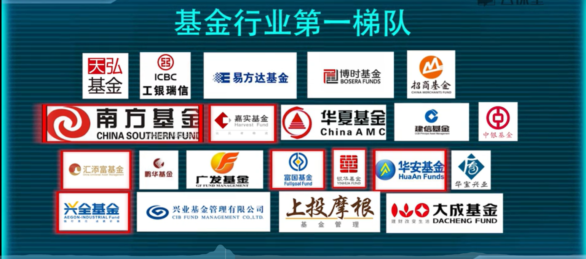
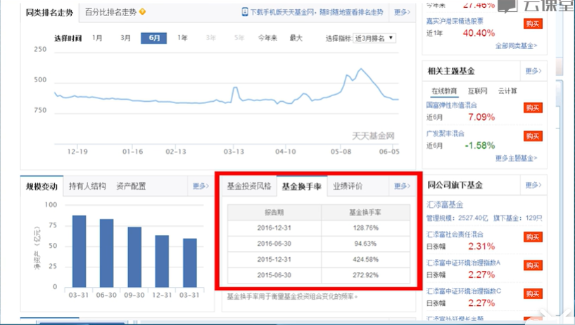
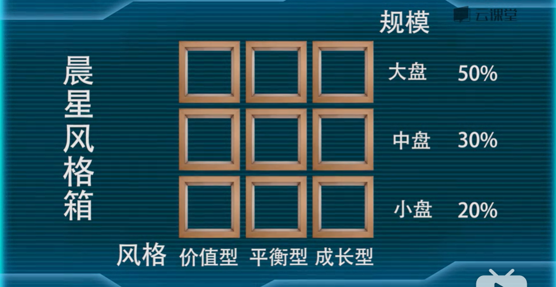
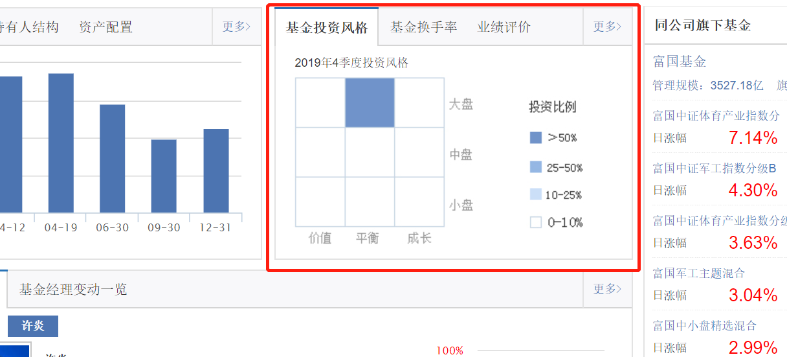
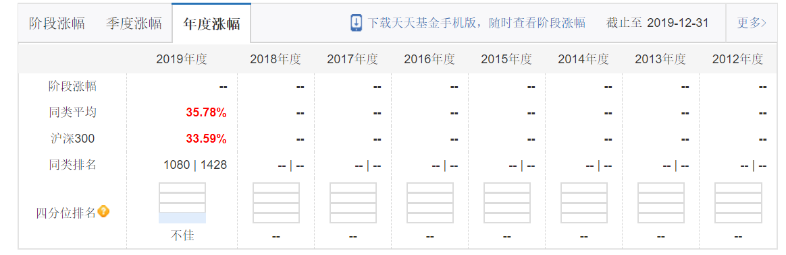
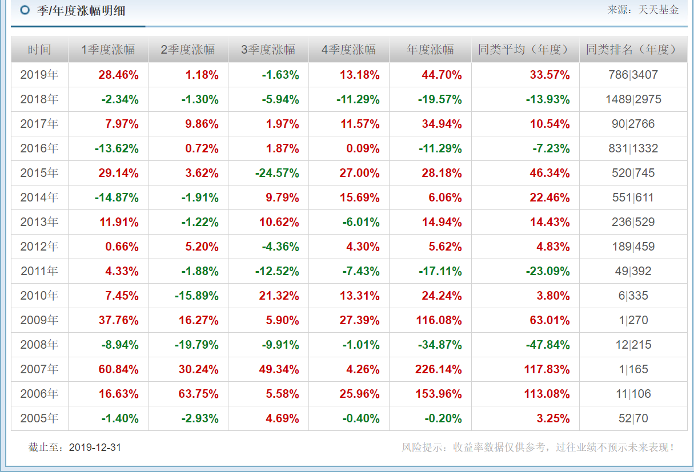
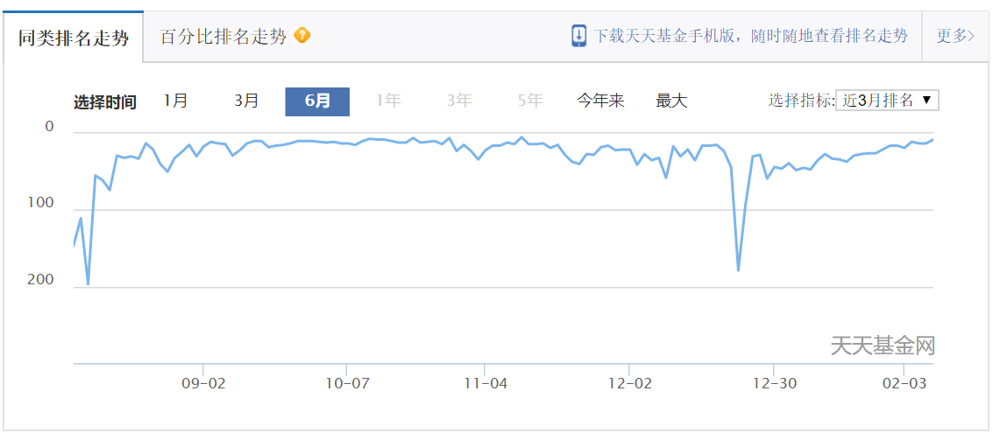

###### datetime:2019/5/16 16:13
###### author:nzb

- 股票型基金是基金中风险最高的基金，货基和债基是低风险的。

- 股票型基金持仓不低于80%。

## 主动型股票型基金挑选技巧（股票型基金不推荐主动性，推荐指数基金）

- 拼爹-基金公司

- 拼人-基金经理

    - 基金经理的基本背景：年龄(至少35以上)、学历(经济学、金融学、理学、管理学等)、履历(管理时间越长越好)
    
    - 基金经理的操盘风格：短线、长线；晨星投资风格箱
    
        - 换手率在50%-200%属于正常，担心超过200%，500%、1000%的。
    
          
         
        - 晨星风格箱
        
          
          
          
          
- 拼业绩：基金过往业绩，基金业绩考量因素：

    - 成立时间足够久：选择成立时间三年以上，最好五年以上的
    
    - 基金业绩够稳定：过去5年中，每年的业绩回报都能始终稳定在同类基金的前20%排名内的基金
      
      
      
      
      
      

- [晨星网数星星选基金](http://cn.morningstar.com/main/default.aspx)

- 拼规模

    - 投资中小盘基金：适合挑选10-20亿规模
    - 投资大盘股基金：适合挑选30-100亿规模
    - 超过100亿或不到2亿甚至只有三五千万：不碰
    
- 拼成本
    
    - 考虑管理费小于或等于1.5%的股票型基金
    - 申购费：一般1.5%，天天基金网，蚂蚁财富等0.15%
    - 赎回费：最高0.5%，有些基金具有持有政策
    - 总结：挑选赎回费阶梯征收的基金
    
