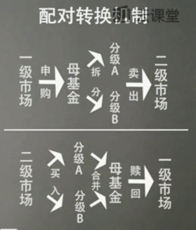

###### datetime:2019/5/16 16:13
###### author:nzb

# 分级基金(杠杆基金)

## 基础信息

 - 一倍正向杠杆：基准净值上涨1元，收益2元。
 - 两倍正向杠杆：基准基准上涨1元，收益4元。
 - 一倍反向杠杆：基金基准下跌1元，收益1元。
 - 分级约定收益 = 一年期定期存款基准利率 + 1.5%~5%
 - 分级A:分级B = 5:5 
    - 初始杠杆率：2 
    - 计算方法：母基金份额/分级B：10/5=2(2倍)
- 不建议碰债券型分级基金。
- 场内基金规模低于2亿份一律不要碰。
- 为什么需要学习分级基金：
    - 分级基金存有赚钱机会
    - 分级基金会王者归来
    - 为未来杠杆投资打下基础

  
- 母基金净值 = 分级A净值*分级A占比 + 分级B净值*分级B占比
- 分级基金给分级A的利息不是现金而是母基金的份额
- 分级A定期折算基准日
    - 分级基金正式成立的日期
    - 每年12月到1月之间选择一天，一般是12月1日或12月15日或一月元旦节之后的第一个交易日。

## 分级A实战攻略

- 永续分级A ≈ 永续债券 或者叫无期债券
- 建议投资永续分级A
- 隐含收益率 = 约定收益率/分级A的加个 - (分级A的净值 - 1)  
- 可在[集思录](https://www.jisilu.cn/data/sfnew/#funda)网找到现成数据
：首页 -> 分级基金  -> A类 -> 修正收益率
- 修正收益率才是选择分级A的王道，这是针对一般的永续型分级A。不适用有期限的分级A。
- 加息周期(央行处于加息周期时)：约定收益率较低(如：3%、3.2%)的分级A  -> 折价回归 -> 修正收益率提高 ----->优先考虑投资
- 加息周期(央行处于加息周期时)：约定收益率较高(如：4%、4.5%)的分级A  -> 溢价回归 -> 修正收益率降低
- 降息反之
- 定期折算对分级A的影响：
    - T日：定折基准日：母基金暂停申赎 配对转换暂停
    - T+1日：分级A暂停交易：母基金暂停申赎
    - T+2日：分级A 上午10:30恢复交易

## 分级B实战攻略

- 杠杆是把双刃剑，不建议投资，分级B适合激进型投资者。

- 初始杠杆：分级A:分级B = 5:5 
    - 初始杠杆率：2 
    - 计算方法：母基金份额/分级B：10/5=2(2倍)

- 净值杠杆：分级B净值/母基金净值的涨幅=母基金总净值/B份额总净值
    =(母基金份数×母基金净值)/(B份额份数×B份额净值)
    =(母基金净值/B份额净值)×份额杠杆(初始杠杆)
    
- 价格杠杆(集思录可查看)：母基金总净值/B份额总市值
    =(母基金份数×母基金净值)/(B份额份数×B份额价格)
    =(母基金净值/B份额价格)×份额杠杆

- 分级B因为有分级A的融资成本，股市不涨不跌，依然会不断亏钱。

- 除权除息处理：把基金的净值相对降下来
    - 除权就是送股票
    - 除息就是送现金

- 定期折算不会影响分级B，而不定期折算会影响分级A、分级B和母基金。

- 不定期折算：只有在满足规定条件时才会触发的折算。[可在集思录上查看上下折阈值](https://www.jisilu.cn/data/sfnew/#fundm)
    - 向上折算：简称上折：分级A、分级B份额不变，母基金、分级A 、分级B净值回归1元，净值超出1元的部分转换成母基金
    - 向下折算：简称下折：对分级A持有人利益的保护，对分级B持有人利益的巨大潜在伤害。
    - 触发上下折标准：
        - 触发上折要看母基金净值
        - 触发下折要看分级B净值

- [下折母基金需跌](https://www.jisilu.cn/data/sfnew/#fundb)在15%以内一律不要碰。

- 不定期折算对分级A、B的影响：
    - T日：定折基准日：母基金暂停申赎 配对转换暂停
    - T+1日：分级A、B暂停交易：母基金暂停申赎
    - T+2日：分级A、B 上午10:30恢复交易

- 深成指分级A的投资：
    - 深成指A价格 > 1元 -----> 千万别买
    - 0.8 < 深成指A价格 < 1元 -----> 合理水平
    - 深成指A价格 < 0.8元 -----> 具备投资价值
    - 深成指A价格 < 0.75元 -----> 风险不高 

- 可定投的奇葩分级B：深成指B和H股B
    - 深成指B价格 < 0.5元 -----> 考虑定投
    - 深成指B价格 < 0.4元 -----> 放心定投
    - 深成指B价格 < 0.3元 -----> 加码定投

## 分级套利

- 分级A定折套利(难)
    - 市场预期导致利差空间缩小
    - 定折完成后分级A下降速度快

- 分级B上折套利(机会渺茫)

- 分级A和分级B的下折套利(折价率不够高不要轻易尝试套利)

- 拆分合并套利(常见)

