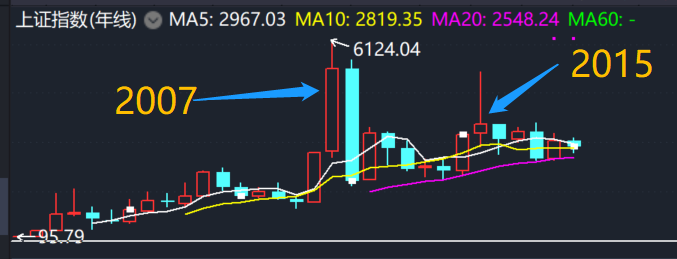

###### datetime:2019/5/16 16:13
###### author:nzb

# 看懂股票行情

- 以华泰证券软件为例

## k线

- K线(阴阳线)
    - 开盘价、收盘价、单日最低价、单日最高价
    - 柱子的顶和底对应开盘价和收盘价，谁高谁在上面
    - 阴线：开盘价高于收盘价，下跌，用实心柱子表示(绿色或蓝色)
    - 阳线：收盘价高于开盘价，上涨，用空心柱子表示(红色)
    - 上影线：最高点表示单日最高价，无上影线：光头
    - 下影线：最低点表示单日最低价，无下影线：光脚
    - 十字星：开盘价和收盘价比较接近，
        - 上下影线都很长：大十字星，
        - 上下影线都很短：小十字星
        - 只有下影线，没有上影线：T型光头十字星
        - 只有上影线，没有下影线：倒T型光头十字星
    - 一字线
    - 向下跳空缺口：除权的影响，通过k线的复权功能防止k线图失真
    
- 涨跌幅波动
    - 小幅波动：涨跌幅0~1.5%
    - 中幅波动：涨跌幅1.5%~5%
    - 大幅波动：涨跌幅5%~10%

- 以上证指数的年k线为例：

    
    - 2007年：柱子很长很高大，说明这一年全年都涨得不错
    - 2005年：柱子很短，而上影线特别长，说明这一年年中的时候股市疯涨了一阵子，但是后来跌下来，对应2015的股灾。
    - 2008年：全年从头跌到尾，超级大熊市

- 复权
    - 向前复权：保持现有价格不变，将以前的价格折算相应缩减
    - 向后复权：保持先前的价格不变，将除权后的价格增加修复回去，这个用的比较多

## 移动平均线(均线，MA)

- MA + 数字：表示多少日均线
    - MA20=20日均线：包含了当天收盘价在内的20个交易日的平均值
    - 日均线指标：MA5、MA10
    - 季均线指标：MA30、MA60
    - 年均线指标：MA120、MA250、MA500
    - 也可以自定义均线

-  短期均线超越中长期均线叫金叉，向上的趋势
-  中长期均线超越短期均线叫死叉，向下的趋势

## 成交量柱形图

- 在k线和均线下部分

- MAVOL开头的线是成交量均线，后面跟的数字表示几日的平均线

## 如何查看某个股票或基金的K线图

- 直接打卡软件在键盘上敲出股票代码或名字首字母，弹出搜索框，选中双击
- 上下键对K线图放大缩小
- 左右键可以显示十字坐标线，鼠标空白处点一下也可以
- 长期查看可右击空白处，添加自选股
- F10可快速查看股票公司或基金概况
- F3、F4可快速查看上证指数和深证成指这两个大盘指数的情况

