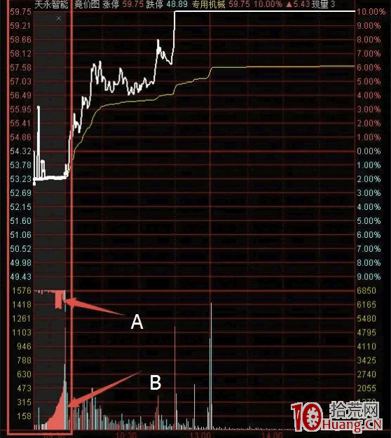
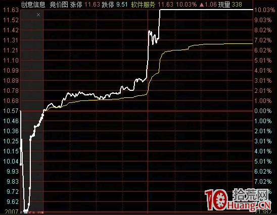

###### datetime:2022/1/23 12:49
###### author:nzb

# 看盘系列-早盘

**集合竞价**决定了一个股票当天的定位。在这个里面有很多学问。但是我看很多朋友对集合竞价的了解并不多，甚至能基本的规则都没有弄清楚。所以今天特意写一篇文章来解释下这个事情。

##一、竞价规则

首先我们要了解几个时间节点：

- 9点15之前，你下的单子是在券商的服务器排队。

- 9点15-9点20 之间，9点15的时候券商的所有单子集中开闸，去上交所或深交所排队。然后在这个阶段会进行价格撮合。这个阶段你可以撤单。

- 9点20-9点25 之间，这个时间段只能下单不能撤单，所以这个时候下的单子都是真实的下单。最终会在9：25撮合成最终的开盘价。竞价仍然是按照价格优先，时间优先的原则进行。

- 9点25-9点30之间，这时间可以下单，但是不会做处理，这些单子都会在9:30的时候一次性处理。

- 9点30-15点之间，这阶段为连续竞价阶段。当然深交所的规则是在14点57—15点，也就是收盘前最后3分钟进行结合竞价。

通过上面几个基本的规则，我们就能明白几件事情。

- 1、你连夜挂单想抢先成交，你要买的话就必须挂涨停价，要卖的话就必须挂跌停价。你不要什么头天晚上下单，但是挂个5%的价格。你这个价格还赶不上第二天9:19别人下的涨停价的单子快。

- 2、那么要想抢先成交，需要在头天什么时候挂单呢?这个每个券商都不同，有的是前一天下午4点就可以挂了。有的要晚上12点才能挂。具体时间你需要咨询你的券商。

- 3、这个时候有人就问了。我12点挂的单子，那肯定比不上4点下单的人。这个问题是不尽然的。他4点挂的单，和你12点挂的单，其实都是在你们券商服务器里面排队。并不是在交易所的服务器里排队。要等到9:15的时候所有券商开闸把单子放到交易所排队。所以券商服务器到交易所服务器的速度决定了谁才是真正的排在前面的。既然是同一时间开闸，为什么有的快，有的慢。那是因为有的券商服务器离交易所服务器的物理距离近。有的券商就把服务器放在交易所附近的写字楼里。比如所马路对面，隔壁什么的。这也就能争取到那0.0001秒的时间。目前看，华鑫证券的通道是比较快的。所以大家也能经常在未开板新股或一字板的龙虎榜中看到华鑫证券的名字。

- 4、所以有些主力为了吸引眼球会在9:20之前用大单顶个高的价格出来，然后在9:20之前10多秒撤单。如果你看到高开就去追，但是他撤了你没来得及，就会成交了。还有些主力为了测试上方的抛压，会试探用以个单子挂涨停价，看会不会有抛盘出来。然后在9:20之前撤单。这个都是套路。总之记住9:20之前的下单都不是最终的。

## 二、竞价图形的含义

以上是规则。那么集合竞价的图形和结果我们怎么去判断呢。

软件默认是看不到集合竞价图形的，你需要按 键盘上的 “ / ” 键，多按几次，就可以切换出来了。

图形的下半区是成交量，分为AB 两种，A为下单但未匹配的量，B为下单匹配的量。也就是可以成交的成交量，如果买的一方占优势，就显示为红色，如果是卖的一方占优势就显示为绿色。

## 三、竞价结果的判断

**竞价后产生的开盘价有3种形式，红盘开，平盘开，绿盘开。**

比如说前一天涨停，第二天高开，则表示前一天打板的没有被闷杀，说明该股赚钱效应不错。如果是绿开，则说明头天打板是亏钱的。今天开盘就要谨慎。

然后要看竞价分时图的曲线，有些个股是低开，但是分时图最后几分钟的趋势是往上的。比如说创意信息3月8日是假阳线(收盘价比开盘价高，但是还是绿盘)，3月9日集合竞价开始平开，然后跌停，然后崽来起，最后阶段缓慢爬升。最终开盘价10.54，但是最终开盘就是往上走的，所以不要一味只看是绿盘还是红盘。更重要的是看趋势。其实那种缓慢爬升的比一笔拉升的趋势更可靠。

另外就是要看集合成交量，如果**高开放大量，是要小心的。大幅低开但是没量，也不用太担心**。

## 总结

- 9.20 之前，大量卖盘，瞬间把股价打压很低，随后9.20前几秒，这些大量卖单被取消
    - 主力试探承接
        - 出货：为未来出货确认有多少承接盘
            - 承接多，今天就可以立即出货
            - 承接少，那就缓慢打压股价出货
    - 诱空：促使散户赶快出货
- 9.00 一开始，大幅拉升，大量买单，9.20 买单纷纷撤单
    - 主力试探抛盘
        - 拉升：为未来拉升确认有多少抛盘
            - 抛盘多：采取缓慢拉升的策略
            - 抛盘少：今天（最近）选择立即拉升
    - 诱多：利用假拉升引诱追涨买入，然后撤掉自己的单子

- 开盘
    - 高开（涨停直接开盘，说明市场对股价的上升认可度高）
        - 股价上升初期高开：说明主力完成了建仓，想把股价拉出建仓的区域
        - 震荡阶段高开：可能是利好消息的刺激
        - 股价上涨末期高开：可能是吸引散户进场，诱多行为，**需注意**
    - 平开
    - 低开（跌停开盘）：可能主力决心跑路了，没有人愿意将股票以极低的价格卖出，看相关信息减仓观察