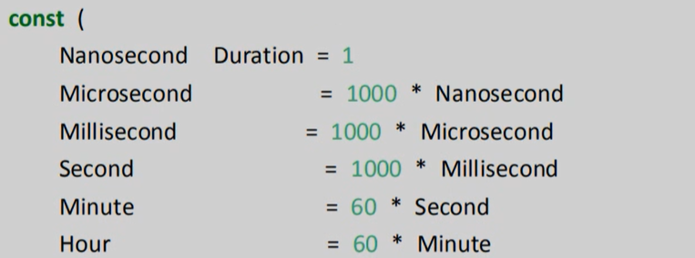

###### datetime:2020/10/26 16:57
###### author:nzb

# Go中的日期函数

## time包

时间和日期是我们编程中经常会用到的，在golang中time包提供了时间的显示和测量用的函数。

## 1、time.Now获取当前时间

```go
timeObj := time.Now()
year := timeObj.Year()
month := timeObj.Month()
day := timeObj.Day()
fmt.Printf("%d-%02d-%02d \n", year, month, day)
```
> %02d 2 表示宽度，如果整数不够 2 列就补上 0

## 2、格式化日期

时间类型有一个自带的方法 Format进行格式化

需要注意的是Go语言中格式化时间模板不是长久的 Y-m-d H:M:S

而是使用Go的诞生时间 2006年1月2日 15点04分 （记忆口诀：2006 1 2 3 4 5）

```go
/**
		时间类型有一个自带的方法 Format进行格式化
		需要注意的是Go语言中格式化时间模板不是长久的 Y-m-d H:M:S
		而是使用Go的诞生时间 2006年1月2日 15点04分 （记忆口诀：2006 1 2 3 4 5）
	 */
timeObj2 := time.Now()
// 24小时值  （15表示二十四小时）
fmt.Println(timeObj2.Format("2006-01-02 15:04:05"))
// 12小时制
fmt.Println(timeObj2.Format("2006-01-02 03:04:05"))
```

## 3、获取当前时间戳

时间戳是自1070年1月1日（08:00:00GMT）至当前时间的总毫秒数。它也被称为Unix时间戳

- 10位数的时间戳是以 秒 为单位；
- 13位数的时间戳是以 毫秒 为单位；
- 19位数的时间戳是以 纳秒 为单位；

```go
/**
	获取当前时间戳
	 */
timeObj3 := time.Now()
// 获取秒时间戳
unixTime := timeObj3.Unix()
// 获取纳秒时间戳
unixNaTime := timeObj3.UnixNano()
```
```go 
package main

import (
	"time"
	"fmt"
)

func main() {
	fmt.Printf("时间戳（秒）：%v;\n", time.Now().Unix())
	fmt.Printf("时间戳（纳秒）：%v;\n",time.Now().UnixNano())
	fmt.Printf("时间戳（毫秒）：%v;\n",time.Now().UnixNano() / 1e6)
	fmt.Printf("时间戳（纳秒转换为秒）：%v;\n",time.Now().UnixNano() / 1e9)
}
//输出
时间戳（秒）：1530027865;
时间戳（纳秒）：1530027865231834600;
时间戳（毫秒）：1530027865231;
时间戳（纳秒转换为秒）：1530027865;
```

## 4、时间戳转日期字符串

通过将时间戳我们可以转换成日期字符串

```go
// 时间戳转换年月日时分秒（一个参数是秒，另一个参数是毫秒）
var timeObj4 = time.Unix(1595289901, 0)
var timeStr = timeObj4.Format("2006-01-02 15:04:05")
fmt.Println(timeStr)
```

## 5、日期字符串转换成时间戳

```go
// 日期字符串转换成时间戳
var timeStr2 = "2020-07-21 08:10:05";
var tmp = "2006-01-02 15:04:05"
timeObj5, _ := time.ParseInLocation(tmp, timeStr2, time.Local)
fmt.Println(timeObj5.Unix())
```

## 6、时间间隔

time.Duration是time包定义的一个类型，它代表两个时间点之间经过的时间，以纳秒为单位。time.Duration表示一段时间间隔，可表示的最大长度段大约290年。

time包中定义的时间间隔类型的常量如下：



## 7、时间操作函数

我们在日常的编码过程中可能会遇到要求时间+时间间隔的需求，Go语言的时间对象有提供Add方法如下

```go
func (t Time) Add(d Duration)Time
```

例如

```go
// 时间相加
now := time.Now()
// 当前时间加1个小时后
later := now.Add(time.Hour)
fmt.Println(later)
```

同理的方法还有：时间差、判断相等

## 8、定时器

方式1：使用time.NewTicker（时间间隔）来设置定时器

```go
// 定时器, 定义一个1秒间隔的定时器
ticker := time.NewTicker(time.Second)
n := 0
for i := range ticker.C {
    fmt.Println(i)
    n++
    if n>5 {
        // 终止定时器
        ticker.Stop()
        return
    }
}
```

方式2：time.Sleep(time.Second)来实现定时器

```go
for  {
    time.Sleep(time.Second)
    fmt.Println("一秒后")
}
```


