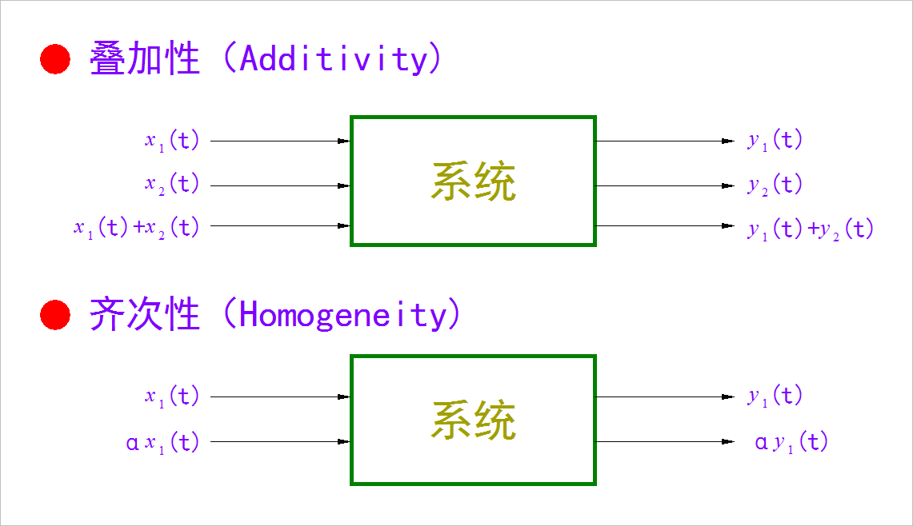
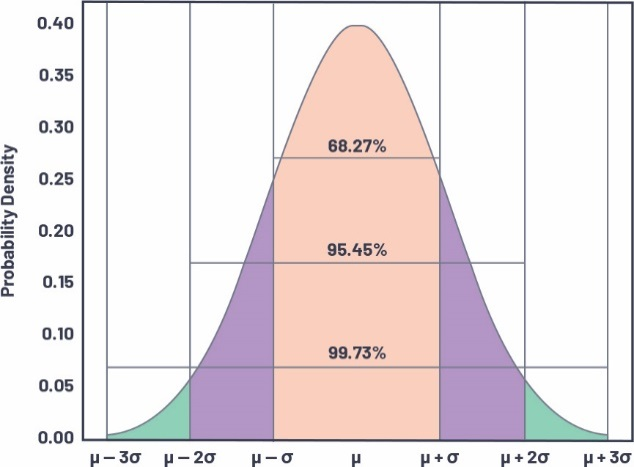
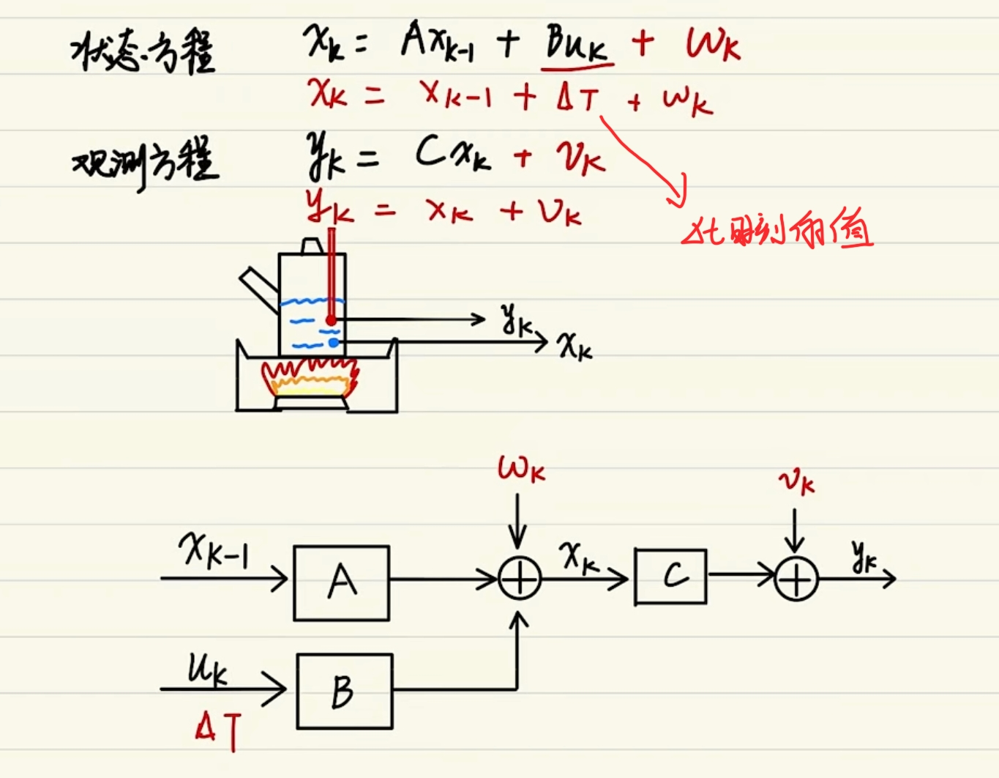
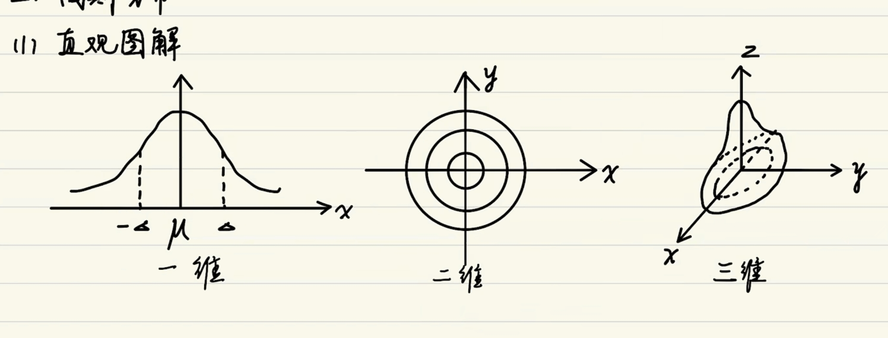
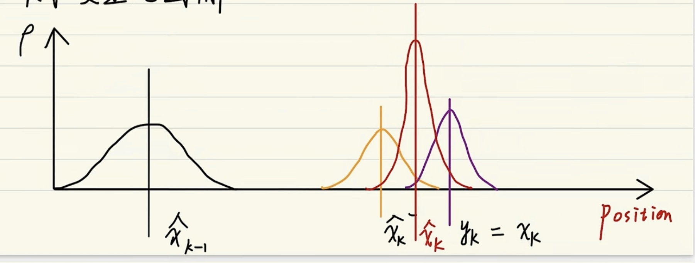

###### datetime:2024/6/16 16:07
###### author:nzb

# Kalman Filtering(卡尔曼滤波)

## 入门

> `^`表示估计值

- 引入

- 适用系统：线性高斯系统
    - 线性：满足**叠加性**和**齐次性**
 
    
        
    - 高斯：噪声满足高斯分布(正态分布)
        - `μ`：均值
        - `σ`：方差
    
    
- 宏观意义：滤波即加权
    - 理想状态：信号 * 1 + 噪声 * 0
    - 低通滤波：低频信号 * 1 + 高频信号 * 0
        - 因为大多情况下高频信号一般为噪声
    - 卡尔曼滤波：估计值 * (权重)  + 观测值 * (权重)

## 进阶

- 状态空间表达式(跟卡尔曼滤波方程相似)

    - 状态方程
 
        $$ x_{k} = A_{x_{k-1} } + Bu_{k} + W_{k} $$
    
        - $$ x_{k} $$：当前状态的当前值 
        - $$ A $$：状态转移矩阵，即当前状态上一刻的值乘上某种关系作用到 $$ x_{k} $$
        - $$ x_{k-1} $$： 上一时刻该状态的值
        - $$ B $$： 控制矩阵，即输入乘上某种关系作用到 $$ x_{k} $$
        - $$ u_{k} $$： 输入，给到 $$ x_{k} $$ 的输入
        - $$ W_{k} $$： 过程噪声
    
    - 观测方程
        
        $$ y_{k} = Cx_{k} + V_{k} $$
        
        - $$ y_{k} $$： 要观察的量
        - $$ C $$： $$ x_{k} $$ 乘上某种关系得到你要观察的值
        - $$ x_{k} $$： 状态量
        - $$ V_{k} $$： 观测噪声
    
    - 示例
    
    
    
    举个例子看一下，这个是火炉对水加温，
    那么这个蓝色的点呢就是水温的状态，这个红色是温度计，那么温度计是一个传感器，
    输出是一个yk，就是水温的值，那么很明显，这个时候这个C就是1。
    然后这边有一个误差，温度计也有误差，所以它输出的是观测方程下红色的那个方程，
    然后这边水温假设它是一个线性变化的，那么这个时候b乘uk就相当于得塔，每一时刻会增加多少度的温度，
    然后我们在这边的过程噪声也可以考虑进去，因为除了火炉对水加热之外，
    还有外面的环境，会影响它，所以它的过程温度并不是那么理想，然后这个要加一个过程噪声，
    然后这边是一个当前的水的温度值，温度值的话是基于之前的水温的，那么这个时候A只要取一个单位矩阵就好了。
    所以这个为状态方程下红色的方程，那么用一个方框图来表示如上图所示。

    
- 高斯分布

    - 直观图解
    
        
    
    - 参数分析
        
        - 高斯白噪声：$$ W_{k} $$ 和 $$ V_{k} $$
            - $$ W_{k} \in N(0;Q_{k}) $$；过程噪声，符合正态分布，均值为0，方差为 $$ Q_{k} $$ 
            - $$ V_{k} \in N(0;R_{k}) $$：观测噪声，符合正态分布，均值为0，方差为 $$ R_{k} $$
            - 示例：解释 $$ V_{k} $$ 和 $$ R_{k} $$ 定义
                - `GPS`检测到一辆车的`position`，开了`1000m`，但是`GPS`还是有精度误差的，所以为`1000 ± δ m`
                - `δ`就为噪声(误差)，则 $$ V_{k} = \delta m $$ 
                - `δ`符合正态分布，方差为 `1m`噪声(假设)，所以 $$ R_{k} = 1 m $$
            - 示例：解释 $$ W_{k} $$ 和 $$ Q_{k} $$ 定义
                - 假设有一个滑板，假设速度为 `5m/s`，由于风的作用，所以变成了 `5m/s ± δ m/s`
                - `δ`就为噪声(误差)，则 $$ W_{k} = \delta m/s $$
                - 假设`δ`符合正态分布，方差为 `1m/s`噪声(假设)，所以 $$ \delta \in (0,1),所以 Q_{k} = 1m/s $$ 
        - 方差
            
            - 一维方差
                - 过程和观测方差：$$ Q_{k} $$ 和 $$ R_{k} $$
                - 状态(估计值)方差：$$ \hat{\phantom{\;;}x_{t}^{-}} $$，一个值，该状态也符合正态分布
            - 二维协方差$$ cov(x,y) $$
                - $$ \hat{\phantom{\;;}x_{t}^{-}} = \begin{bmatrix}\hat{\phantom{\;;}x_{t1}^{-}} \\ \hat{\phantom{\;;}x_{t2}^{-}}\end{bmatrix}\begin{matrix}\to W_{k1}\\\to W_{k2}\end{matrix} $$
                - $$ cov(\hat{\phantom{\;}x_{t1}^{-}}, \hat{\phantom{\;}x_{t2}^{-}}) = \begin{bmatrix}  cov(x_{1}, x_{1})& cov(x_{1}, x_{2})\\  cov(x_{2}, x_{1})& cov(x_{2}, x_{2}) \end{bmatrix} $$
            - 多维协方差矩阵`C`
                - $$ C = \begin{bmatrix}cov(x_{1}, x_{1})  & cov(x_{1}, x_{2}) & ... & cov(x_{1}, x_{n})\\cov(x_{2}, x_{1})  & cov(x_{2}, x_{2}) & ... & cov(x_{2}, x_{n})\\\vdots   & \vdots & \ddots & \vdots\\cov(x_{n}, x_{1})  & cov(x_{n}, x_{2}) & ... & cov(x_{n}, x_{n})\\\end{bmatrix} $$              
    
- 超参数：`Q、R`，相当于调`PID`
    - `Q`：过程噪声方差
    - `R`：观测噪声方差
    - 主要就是调这两个参数

- 卡尔曼直观图解

- `x`轴为位置，`y`轴为概率密度
- $$ \hat{\phantom{\;;;}x_{k-1}} $$ ：无横杆，表示最优估计值，也叫修正值，后验估计值，卡尔曼滤波输出的值
- $$ \hat{\phantom{\;;;;}x_{k}^{-}} $$ ：先验估值值，基于最优估计值得出的
- $$ y_{k} $$ ：观测值，相当于直接等于`x_{k}`，传感器直接测量出来的值
- $$ \hat{\phantom{\;;;;}x_{k}} $$ ：当前时刻的最优估计值，明显方差更小，因为滤波次数过多，方差变小，趋于稳定
    - 当前的最优估计值是由：先验估计值 和 当前的观测值取公有的部分得到一个最优的值

## 放弃

- 卡尔曼公式理解

$$ \hat{\phantom{\;;}x_{t}^{-}} = \hat{\phantom{\;;}{F}x_{t-1}} + Bu_{t-1} $$

- 调节超参数

- 卡尔曼滤波的使用

## 精通

- 卡尔曼滤波公式回顾

- 机器人应用举例

