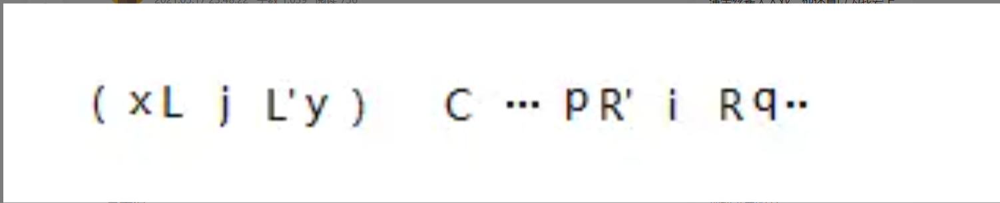

###### datetime:2024/2/24 16:49
###### author:nzb

# 字符串匹配算法

## KMP算法

字符串str1和str2，str1是否包含str2，如果包含返回str2在str1中开始的位置。如何做到时间复杂度O(N)完成？

- 问题引入：首先我们来看一个例子，现在有两个字符串A和B，问你在str1中是否有str2，为了方便叙述，我们先给定两个字符串的值
    - A="abcaabababaa"
    - B="abab"
    
### 暴力解法

- 首先我们能想到规定头指针，并依次向后比较的暴力方法
- 从主串s的第一个字符开始，与模式串m的第一个字符比较，若相等，则继续逐个比较后序字符；
- 否则从主串下一个字符起，重新和模式串的第一个字符开始比较
- 在暴力匹配中，每趟匹配失败都是模式后移一位再从头开始比较，这种频繁的重复比较相当于模式串在不断地进行自我比较，这是低效的根源。

### KMP算法

在讲KMP算法之前我们需要先介绍**最长前缀和后缀匹配长度**

- 1、前缀和后缀最长匹配长度
    - 前缀：指除了最后一个字符以外，字符串所有头部子串(以头部字符开始)
    - 后缀：指除了第一个字符(当前字符)以外，字符串所有尾部子串(以尾部字符结束)
    - 下面以字符**abbabbk**为例进行说明`k`字符为例：
        - 长度为1时：前缀：`a`, 后缀：`b`, 最长匹配长度为0
        - 长度为2时：前缀：`ab`, 后缀：`bb`, 最长匹配长度为0
        - 长度为3时：前缀：`abb`, 后缀：`abb`, 最长匹配长度为3
        - 长度为4时：前缀：`abba`, 后缀：`babb`, 最长匹配长度为0
        - 长度为5时：前缀：`abbab`, 后缀：`bbabb`, 最长匹配长度为0
        - 长度为6时：就是整个子串，不考虑
        - 所以`k`字符的最长前缀和后缀匹配长度为3
- 2、next数组

    - 基于前缀和后缀最长匹配长度的计算，我们需要算出m字符串每一个字符之前对应的信息，将这些信息用数组`next[]`存储起来
以`aabaabs`为例：`next[]={-1, 0, 1, 0, 1, 2, 3}`  
    - 元素还有另外一层作用就是要调到元素的索引，比如长度为3，索引是0~2，下一个元素索引就是3
    - 人为规定，第一个元素长度为-1，第二个元素长度为0

- 3、KMP算法
图解：


当`str1`和`str2`匹配到第11位时出现了不相等的情况，此时**`str1`的`i`指针不动，`str2`的`j`指针指向该字符对应最长匹配长度的下一位即`j=5`**


再将此时`i`和`j`指向的字符进行比较

我们可以将该过程理解为将`str2`往右移`i-j`位，str2在`j`之前的字符已经匹配，不用再进行比较。

该过程的实质是：
- 1、将`str2`推到`j`位置开头，并从可能不相等的位置往下走
- 2、`str1`从`0`开始到`j`之前不存在任何一个位置能配出`str2`，注意是整个`str2`
    - 为啥不存在呢，跟`next`数组含义有关，利用反证法证明

    ```text
    str1 = i ............... k ........... | j........... x
    str2 = 0 ..匹配长度....|................| ....匹配长度.. y
    
    假设 j~x 是最长前缀和后缀匹配长度
    假设中间任意一个位置k，能配出整个str2，注意是整个
    那么从k出发到x之前这一段，必须跟str2等量的区域(或前缀)一样才行，为什么，因为从str1和str2一路相等，到x和y位置才不等的
    那就说明k~x之前的字符串等于str2的等量的前缀，那就找到了一个更长的匹配长度，跟next数据冲突了   
    ```

只要理解了这两个实质，该算法就基本上理解了。

- 示例

```text
index  0123456 78 9 10 11 12 13 14 15 16
str1 = abbsabb tc a b  b  s  a  b  b  e
str2 = abbsabb tc a b  b  s  a  b  b  w
```
- 比对到16，e != w
- 继续，此时str2 最长前缀为7，str2 回退到位置 7，str1位置还是16，相当于从str1的位置9和str2开始比对，此时，e != t
- 继续，此时str2 最长前缀为3，str2 回退到位置 3，str1位置还是16，相当于从str1的位置13和str2开始比对，此时，e != s
- 继续，此时str2 最长前缀为0，str2 回退到位置 0，str1位置还是16，相当于从str1的位置16和str2开始比对，此时，e != a
- 此时不能往前退了，str1位置加1，从17位置开始和str2开头开始比对


### 代码
```python

def kmp(str1, str2):
    if not str1 or not str2 or len(str1) < len(str2):
        return -1
    idx1 = 0
    idx2 = 0
    next_arr = get_next_array(str2)
    while idx1 < len(str1) and idx2 < len(str2):
        if str1[idx1] == str2[idx2]:
            idx1 += 1
            idx2 += 1
        elif next_arr[idx2] == -1:  # == idx==0 表示str2已经来到头位置，不能再往前跳了
            idx1 += 1
        else:
            idx2 = next_arr[idx2]
    # i1越界或i2越界
    return idx1 - idx2 if idx2 == len(str2) else -1


def get_next_array(str_data):
    """
    求第i位的最长匹配长度，获取到i-1的最长匹配长度，然后拿i-1位置字符和next[i-1]位置作比较，如果相等，则i的最长长度是i-1的最长长度+1
    如果不一样，再从next[i-1]往前跳最长匹配长度
          0  3     8            i-1  i
    str = abbstabb ec abbstabb   ?
    i-1 位置长度为8（e字符）

    看e跟?是否相等
        相等 8+1，
        不等再往前跳，e字符长度3（s字符）
    看s跟?是否相等
        相等 3+1，
        不等再往前跳，s字符长度0（a字符）
    看a跟?是否相等
        相等 1，
        不等往前跳不了了，则为0
    :param str_data:
    :return:
    """
    if len(str_data) == 1:
        return [-1]

    next_arr = [-1, 0]
    idx = 2  # next数组的位置
    cn = 0  # 需要和i-1作比较的位置
    while idx < len(str_data):
        if str_data[idx - 1] == str_data[cn]:
            cn += 1
            next_arr[idx] = cn
            idx += 1  # 计算下一个字符的最长匹配长度
        # 和 i-1位置匹配不上，当前跳到cn位置
        elif cn > 0:
            cn = next_arr[cn]
        else:
            next_arr[idx] = 0
    return next_arr
```

### 时间复杂度

- 暴力解法的时间复杂度为：`O(m*n)`，其中m为`str2`的长度，n为`str1`的长度
- `KMP`算法的时间复杂度为：`O(m+n)`，其中m为计算`next`数组的时间复杂度，n为`KMP`进行匹配时的时间复杂度

## Manacher 算法

又称“马拉车算法”，主要用于求解最长回文子串的长度

### 经典最长回文子串长度求法

从字符串的每个字符开始，向左右两边扩，算出以每个字符为中心的回文子串的长度，然后取最大值。


但是用这种方法只能算出奇回文子串的长度，无法算出偶回文子串的长度，如下图所示，这是一个长度为 4 的回文串，但用上面的方法没办法算出它的长度，因为上面的方法是以一个字符为中心算长度，但是偶回文子串的中心并不是一个字符。


为了可以计算出偶回文子串的长度，我们可以对字符串做一些变化，把 “abba” 变成 “#a#b#b#a#” ，然后按照上面的方面再计算一次，就可以算出来了，最大值除以 2 向下取整就是最长回文串的长度。


这里是在原字符串的每个字符前后加了特殊符号 “#”，但其实这个特殊符号加什么都行，只是为了方便，就算原字符串中本来就有 “#” 也不会有影响，因为我们可以发现在比较的时候原字符只会与原字符进行比较，特殊字符只与特殊字符比较。

整个过程的时间复杂度为 `O(N^2)`，例子`#1#1#1#1#1#1#1#1#`，遍历走一遍，然后比较走到某一端

### Manacher 算法

与 `KMP` 有点类似，就是对经典的算法做一个加速

#### 几个重要的概念

以字符串`#a#b#b#a#b#b#a#`为例

**回文半径**：从中心字符到回文子串结束的距离，如回文子串 `#a#` 的回文半径就是 2，`#a#b#b#a#` 的回文半径是5

回文半径数组 `pArr`：与 `KMP` 的 `next` 数组有点类似，回文半径数组存放的是每个字符对应回文子串的半径

最右回文右边界 `R`：之前所有的回文子串的最右的边界


最右回文右边界的中心 `C`：即最右回文有边界对应的回文串的中心位置


#### Manacher算法流程

主要是计算回文半径数组 `pArr`，分为两种情况

- 1）下一个字符的位置 `i` 不在 `R` 里，这种情况 `R` 直接暴力往右扩，且以这个字符为中心的回文子串的长度至少为 `1`

- 2）下一个字符的位置 `i` 在 `R` 里，找到 `i` 相对于 `C` 的对称点 `j`，这时又分为三种情况，记 `R` 相对于 `C` 的字符为 `L`，`[L...j...C...i...R]`即为以 `C` 为中心最长回文子串
    - ① `j` 为中心的整个回文子串（下面称 `j` 回文子串）在 `[L......R]` 里，那么 `i` 为中心的回文子串（下面称 `i` 回文子串）半径与以 `j` 回文子串半径相等
    - ② `j` 回文子串部分在 `[L......R]`里，那么 `i` 回文子串半径为 `R - i`
    - ③ `j` 回文子串的左边界正好等于 `L`，那么 `i` 回文子串半径至少为 `R - i`，然后继续往外扩


- 证明，主要证 `2）`部分，前面2中不用试就知道答案，第3种情况需要去试才知道会不会更长
    - ①如示例：`[L..x(..j..)y..C..p(..i..)q..R]`，`j` 左右的小括号区域（下面称为 `j` 区域）代表 `j` 回文子串 ，因为 `L` 到 `R` 是以 `C` 为中心的最长回文子串，所以 `i` 左右的小括号区域
    （下面称为 `i` 区域）与 `j` 区域一定是互相逆序的，又因为 `j` 区域是回文子串，所以 `i` 区域也是回文子串。那么如何确定它是最大呢？
    我们假设 `x` 是以 `j` 回文子串前一个字符，`y` 是后一个字符，`p`、`q`同理分别为以 `i` 回文子串前一个和后一个字符，我们假设刚才的回文子串不是最大，
    那么`p` 和 `q` 必是相等的，按照回文串的性质，`p`和`y`相等(因为`L~R`关于`C`对称)，`q`和`x` 相等，则`x` 和 `y` 一定是相等的，但是 `j` 回文子串是不包括 `x` 和 `y` 的，
    也就是说 `x` 和 `y` 不可能相等，即 `p` 和 `q` 不可能相等，假设不成立，所以 `i` 回文子串半径一定与 `j` 回文子串半径相等。
    
    
    
    - ② `j` 回文子串不全在 `[L...R]` 里，部分超出，如示例：`..(x[L..j..L'y)..C..pR'..i..R]q..`，找到 `L` 相对于 `j` 的对称点 `L'` ，由回文串的性质可知，`[L..j..L']` 一定是回文子串，
    所以与之对应 `[R'..i..R]` 也是回文串，所以 `i` 回文子串的半径最小是 `R - i`。**那有没有可能更大呢？不可能**。 `x` 是 `L` 的前一个字符，
    `y` 是 `L'` 的后一个字符，`p` 是 `R'` 的前一个字符，`q` 是 `R` 后一个字符。`i` 回文子串半径要想更大，就需要 `p` 和 `q` 相等，
    我们现在已知 `x` 和 `y` 都属于 `j` 回文子串，所以 `x` 和 `y` 相等，`y` 和 `p` 相等，即 `x` 和 `p` 相等，因为以 `C` 为中心的最长回文子串的左右边界是 `L` 和 `R`，
    所以 `x` 和 `q` 是不可能相等的，结合起来就是 `p` 不可能等于 `q`，所以 `i` 的回文子串半径最大为 `R - i`。

    
    
    - ③ `j` 回文子串的左边界正好等于 `L`，如示例：`[(L..j...)..C.p(...i..R)]q`，首先我们可以肯定 `i` 回文子串至少是 `R - i`，至于能不能继续扩大，就需要看 `p` 能不能等于 `q`，
    从图中可以看出，与前面两种情况不同，`p` 等不等于 `q`，并不会破坏 `j` 回文子串和以 `C` 为中心的回文子串，所以 `p` 是可以等于 `q` 的，如果 `p` 等于 `q`，
    那么 `R` 往右扩， `i` 回文子串半径 `+1`，直到不能继续向右为止。

    

#### 时间复杂度`O(n)`

具体分析过程，可以看[左神的视频讲解](https://links.jianshu.com/go?to=https%3A%2F%2Fwww.bilibili.com%2Fvideo%2FBV16K4y157vm%3Fp%3D12%26t%3D1616)

```python
def manacher(str_data):
    if not str_data:
        return 0
    # 用特殊字符拼接
    str_new = "#" + "#".join(list(str_data)) + "#"
    p_arr = [1] * len(str_new)  # 回文半径数组
    c = -1  # 中心
    r = -1  # 回文右边界的再往右一个位置 最右的有效区是R-1位置
    max_val = float("-inf")  # 扩出来的最大值
    for i in range(len(str_new)):  # 每个位置都求回文半径
        # p_arr[i] 表示至少的回文区域，就是我们不用验证就知道有多少的区域
        # 2 * c - i 就是 j 的位置，也就是i关于 c 对称的位置，则 p_arr[2*c-i]就是j和i的回文半径
        """
        * 同时满足上面的两类情况
        * 1）如果 R < i，即 i 不在 R 里，那么半径至少为 1(不用验证)
        * 2）如果 R > i，即 i 在 R 里，那么
        *      为什么取两者的较小值呢？
        *      首先三种情况：
        *          如果 j 回文子串完全在 C 回文子串里，那么 i 回文子串半径就是 p_arr[2 * C - i]，因为包含所以 R - i >= p_arr[2 * C - i]，即至少不用验证 min(p_arr[j], R - i)，选 p_arr[2 * C - i]
        *          如果 j 回文子串在部分在 C 回文子串里，那么 i 回文子串半径就是 R - i，因为C的回文到R，所以 R - i <= p_arr[2 * C - i]，即至少不用验证 min(p_arr[j], R - i)，选 R-i
        *          如果 j 回文子串左边界正好等于 C 回文子串的左边界，那么 i 回文子串半径至少为 R - i，跟第二种情况一样，所以至少不用验证 min(p_arr[j], R - i)，选 R-i
        *      所以直接写成了 min(p_arr[2 * c - i], r - i)

        """
        p_arr[i] = min(p_arr[2 * c - i], r - i) if r > i else 1
        """
        主要针对 R < i 和 j 回文子串左边界正好等于 C 回文子串的左边界这两种情况，回文子串需要扩充
        idx = 0123456
        str = #a#b#a#
        arr = 1214121
        arr[i]存放了当前位置的最少的回文半径,char[i + arr[i]]char[i - arr[i]分别是当前字符的回文子串的后一个和前一个字符，相等则 arr[i]++，否则break

        虽然上面 j 回文子串完全在 C 回文子串里和 j 回文子串在部分在 C 回文子串里时，arr[i] 已经是确定值，不需要再扩充，
        但为了代码方便，减少 if else 使用，直接全部扩充，不需要的扩充的仅需进行一次判断就 break了，对代码整体时间复杂度影响不大
        """
        while i + p_arr[i] < len(str_new) and i - p_arr[i] > -1:
            if str_new[i + p_arr[i]] == str_new[i - p_arr[i]]:
                p_arr[i] += 1
            else:
                break

        if (i + p_arr[i]) > r:
            r = i + p_arr[i]
            c = i
        max_val = max(max_val, p_arr[i])
    # max 中包括是 # 字符的半径，max - 1正好是原回文串的长度
    # #1#2#1#，回文半径2#1#，长度是4，除去拼接的#实际是121，长度为3
    # #a#b#b#a#，回文半径#b#a#，长度5，除去拼接的#实际是abba，长度为4
    return max_val - 1


print(manacher("121"))
print(manacher("abba"))
```

### 注意，manacher能解决回文串的问题，但不仅于此，回文半径数组的信息能帮你解决好多回文问题，解决回文字符串只是它的一种形式


