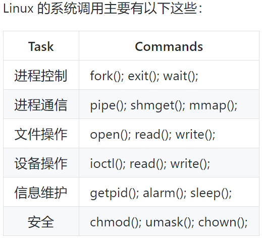
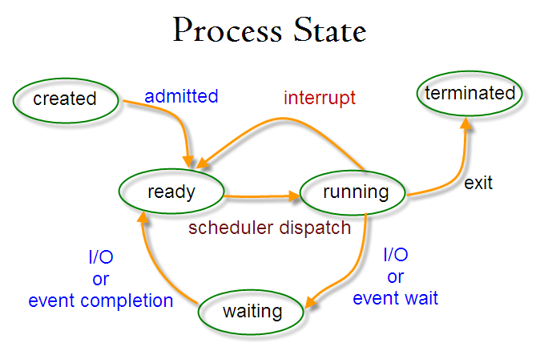

###### datetime:2022-03-08 17:19

###### author:nzb

# 技术面试必备基础知识

> [传送门](https://github.com/CyC2018/CS-Notes)

## 操作系统

### [计算机操作系统](https://github.com/CyC2018/CS-Notes/blob/master/notes/%E8%AE%A1%E7%AE%97%E6%9C%BA%E6%93%8D%E4%BD%9C%E7%B3%BB%E7%BB%9F%20-%20%E7%9B%AE%E5%BD%95.md)

#### [概述](https://github.com/CyC2018/CS-Notes/blob/master/notes/%E8%AE%A1%E7%AE%97%E6%9C%BA%E6%93%8D%E4%BD%9C%E7%B3%BB%E7%BB%9F%20-%20%E6%A6%82%E8%BF%B0.md)

* [基本特征](https://github.com/CyC2018/CS-Notes/blob/master/notes/%E8%AE%A1%E7%AE%97%E6%9C%BA%E6%93%8D%E4%BD%9C%E7%B3%BB%E7%BB%9F%20-%20%E6%A6%82%E8%BF%B0.md#%E5%9F%BA%E6%9C%AC%E7%89%B9%E5%BE%81)

    * [1\. 并发](https://github.com/CyC2018/CS-Notes/blob/master/notes/%E8%AE%A1%E7%AE%97%E6%9C%BA%E6%93%8D%E4%BD%9C%E7%B3%BB%E7%BB%9F%20-%20%E6%A6%82%E8%BF%B0.md#1-%E5%B9%B6%E5%8F%91)

        * 并发是指宏观上在一段时间内能同时运行多个程序，而并行则指同一时刻能运行多个指令。

        * 并行需要硬件支持，如多流水线、多核处理器或者分布式计算系统。

        * 操作系统通过引入进程和线程，使得程序能够并发运行。

    * [2\. 共享](https://github.com/CyC2018/CS-Notes/blob/master/notes/%E8%AE%A1%E7%AE%97%E6%9C%BA%E6%93%8D%E4%BD%9C%E7%B3%BB%E7%BB%9F%20-%20%E6%A6%82%E8%BF%B0.md#2-%E5%85%B1%E4%BA%AB)

        * 共享是指系统中的资源可以被多个并发进程共同使用。

        * 有两种共享方式：互斥共享和同时共享。

        * 互斥共享的资源称为临界资源，例如打印机等，在同一时刻只允许一个进程访问，需要用同步机制来实现互斥访问。

    * [3\. 虚拟](https://github.com/CyC2018/CS-Notes/blob/master/notes/%E8%AE%A1%E7%AE%97%E6%9C%BA%E6%93%8D%E4%BD%9C%E7%B3%BB%E7%BB%9F%20-%20%E6%A6%82%E8%BF%B0.md#3-%E8%99%9A%E6%8B%9F)

        * 虚拟技术把一个物理实体转换为多个逻辑实体。

        * 主要有两种虚拟技术：时（时间）分复用技术和空（空间）分复用技术。

        * 多个进程能在同一个处理器上并发执行使用了时分复用技术，让每个进程轮流占用处理器，每次只执行一小个时间片并快速切换。

        *
      虚拟内存使用了空分复用技术，它将物理内存抽象为地址空间，每个进程都有各自的地址空间。地址空间的页被映射到物理内存，地址空间的页并不需要全部在物理内存中，当使用到一个没有在物理内存的页时，执行页面置换算法，将该页置换到内存中。

    * [4\. 异步](https://github.com/CyC2018/CS-Notes/blob/master/notes/%E8%AE%A1%E7%AE%97%E6%9C%BA%E6%93%8D%E4%BD%9C%E7%B3%BB%E7%BB%9F%20-%20%E6%A6%82%E8%BF%B0.md#4-%E5%BC%82%E6%AD%A5)

        * 异步指进程不是一次性执行完毕，而是走走停停，以不可知的速度向前推进。

* [基本功能](https://github.com/CyC2018/CS-Notes/blob/master/notes/%E8%AE%A1%E7%AE%97%E6%9C%BA%E6%93%8D%E4%BD%9C%E7%B3%BB%E7%BB%9F%20-%20%E6%A6%82%E8%BF%B0.md#%E5%9F%BA%E6%9C%AC%E5%8A%9F%E8%83%BD)

    * [1\. 进程管理](https://github.com/CyC2018/CS-Notes/blob/master/notes/%E8%AE%A1%E7%AE%97%E6%9C%BA%E6%93%8D%E4%BD%9C%E7%B3%BB%E7%BB%9F%20-%20%E6%A6%82%E8%BF%B0.md#1-%E8%BF%9B%E7%A8%8B%E7%AE%A1%E7%90%86)

    * [2\. 内存管理](https://github.com/CyC2018/CS-Notes/blob/master/notes/%E8%AE%A1%E7%AE%97%E6%9C%BA%E6%93%8D%E4%BD%9C%E7%B3%BB%E7%BB%9F%20-%20%E6%A6%82%E8%BF%B0.md#2-%E5%86%85%E5%AD%98%E7%AE%A1%E7%90%86)

    * [3\. 文件管理](https://github.com/CyC2018/CS-Notes/blob/master/notes/%E8%AE%A1%E7%AE%97%E6%9C%BA%E6%93%8D%E4%BD%9C%E7%B3%BB%E7%BB%9F%20-%20%E6%A6%82%E8%BF%B0.md#3-%E6%96%87%E4%BB%B6%E7%AE%A1%E7%90%86)

    * [4\. 设备管理](https://github.com/CyC2018/CS-Notes/blob/master/notes/%E8%AE%A1%E7%AE%97%E6%9C%BA%E6%93%8D%E4%BD%9C%E7%B3%BB%E7%BB%9F%20-%20%E6%A6%82%E8%BF%B0.md#4-%E8%AE%BE%E5%A4%87%E7%AE%A1%E7%90%86)

* [系统调用](https://github.com/CyC2018/CS-Notes/blob/master/notes/%E8%AE%A1%E7%AE%97%E6%9C%BA%E6%93%8D%E4%BD%9C%E7%B3%BB%E7%BB%9F%20-%20%E6%A6%82%E8%BF%B0.md#%E7%B3%BB%E7%BB%9F%E8%B0%83%E7%94%A8)

    * 如果一个进程在用户态需要使用内核态的功能，就进行系统调用从而陷入内核，由操作系统代为完成。

    * 

* [宏内核和微内核](https://github.com/CyC2018/CS-Notes/blob/master/notes/%E8%AE%A1%E7%AE%97%E6%9C%BA%E6%93%8D%E4%BD%9C%E7%B3%BB%E7%BB%9F%20-%20%E6%A6%82%E8%BF%B0.md#%E5%AE%8F%E5%86%85%E6%A0%B8%E5%92%8C%E5%BE%AE%E5%86%85%E6%A0%B8)

    * [1\. 宏内核](https://github.com/CyC2018/CS-Notes/blob/master/notes/%E8%AE%A1%E7%AE%97%E6%9C%BA%E6%93%8D%E4%BD%9C%E7%B3%BB%E7%BB%9F%20-%20%E6%A6%82%E8%BF%B0.md#1-%E5%AE%8F%E5%86%85%E6%A0%B8)

    * [2\. 微内核](https://github.com/CyC2018/CS-Notes/blob/master/notes/%E8%AE%A1%E7%AE%97%E6%9C%BA%E6%93%8D%E4%BD%9C%E7%B3%BB%E7%BB%9F%20-%20%E6%A6%82%E8%BF%B0.md#2-%E5%BE%AE%E5%86%85%E6%A0%B8)

* [中断分类](https://github.com/CyC2018/CS-Notes/blob/master/notes/%E8%AE%A1%E7%AE%97%E6%9C%BA%E6%93%8D%E4%BD%9C%E7%B3%BB%E7%BB%9F%20-%20%E6%A6%82%E8%BF%B0.md#%E4%B8%AD%E6%96%AD%E5%88%86%E7%B1%BB)

    * 1\. 外中断

        * 由 CPU 执行指令以外的事件引起，如 I/O 完成中断，表示设备输入/输出处理已经完成，处理器能够发送下一个输入/输出请求。此外还有时钟中断、控制台中断（Ctril + c）等。

    * 2\. 异常

        * 由 CPU 执行指令的内部事件引起，如非法操作码、地址越界、算术溢出等。

    * 3\. 陷入

        * 在用户程序中使用系统调用。

#### [进程管理](https://github.com/CyC2018/CS-Notes/blob/master/notes/%E8%AE%A1%E7%AE%97%E6%9C%BA%E6%93%8D%E4%BD%9C%E7%B3%BB%E7%BB%9F%20-%20%E8%BF%9B%E7%A8%8B%E7%AE%A1%E7%90%86.md)

* [进程与线程](https://github.com/CyC2018/CS-Notes/blob/master/notes/%E8%AE%A1%E7%AE%97%E6%9C%BA%E6%93%8D%E4%BD%9C%E7%B3%BB%E7%BB%9F%20-%20%E8%BF%9B%E7%A8%8B%E7%AE%A1%E7%90%86.md#%E8%BF%9B%E7%A8%8B%E4%B8%8E%E7%BA%BF%E7%A8%8B)

    * [1\. 进程](https://github.com/CyC2018/CS-Notes/blob/master/notes/%E8%AE%A1%E7%AE%97%E6%9C%BA%E6%93%8D%E4%BD%9C%E7%B3%BB%E7%BB%9F%20-%20%E8%BF%9B%E7%A8%8B%E7%AE%A1%E7%90%86.md#1-%E8%BF%9B%E7%A8%8B)
      `进程是资源分配的基本单位。`

    * [2\. 线程](https://github.com/CyC2018/CS-Notes/blob/master/notes/%E8%AE%A1%E7%AE%97%E6%9C%BA%E6%93%8D%E4%BD%9C%E7%B3%BB%E7%BB%9F%20-%20%E8%BF%9B%E7%A8%8B%E7%AE%A1%E7%90%86.md#2-%E7%BA%BF%E7%A8%8B)
      `线程是独立调度的基本单位。一个进程中可以有多个线程，它们共享进程资源。`

    * [3\. 区别](https://github.com/CyC2018/CS-Notes/blob/master/notes/%E8%AE%A1%E7%AE%97%E6%9C%BA%E6%93%8D%E4%BD%9C%E7%B3%BB%E7%BB%9F%20-%20%E8%BF%9B%E7%A8%8B%E7%AE%A1%E7%90%86.md#3-%E5%8C%BA%E5%88%AB)

        * Ⅰ 拥有资源

            * 进程是资源分配的基本单位，但是线程不拥有资源，线程可以访问隶属进程的资源。

        * Ⅱ 调度

            * 线程是独立调度的基本单位，在同一进程中，线程的切换不会引起进程切换，从一个进程中的线程切换到另一个进程中的线程时，会引起进程切换。

        * Ⅲ 系统开销

            * 由于创建或撤销进程时，系统都要为之分配或回收资源，如内存空间、I/O 设备等，所付出的开销远大于创建或撤销线程时的开销。类似地，在进行进程切换时，涉及当前执行进程 CPU 环境的保存及新调度进程 CPU
              环境的设置，而线程切换时只需保存和设置少量寄存器内容，开销很小。

        * Ⅳ 通信方面

            * 线程间可以通过直接读写同一进程中的数据进行通信，但是进程通信需要借助 IPC。

* [进程状态的切换](https://github.com/CyC2018/CS-Notes/blob/master/notes/%E8%AE%A1%E7%AE%97%E6%9C%BA%E6%93%8D%E4%BD%9C%E7%B3%BB%E7%BB%9F%20-%20%E8%BF%9B%E7%A8%8B%E7%AE%A1%E7%90%86.md#%E8%BF%9B%E7%A8%8B%E7%8A%B6%E6%80%81%E7%9A%84%E5%88%87%E6%8D%A2)

    * 

        * 就绪状态（ready）：等待被调度

        * 运行状态（running）

        * 阻塞状态（waiting）：等待资源

    * 应该注意以下内容：

        * 只有就绪态和运行态可以相互转换，其它的都是单向转换。就绪状态的进程通过调度算法从而获得 CPU 时间，转为运行状态；而运行状态的进程，在分配给它的 CPU 时间片用完之后就会转为就绪状态，等待下一次调度。

        * 阻塞状态是缺少需要的资源从而由运行状态转换而来，但是该资源不包括 CPU 时间，缺少 CPU 时间会从运行态转换为就绪态。

* [进程调度算法](https://github.com/CyC2018/CS-Notes/blob/master/notes/%E8%AE%A1%E7%AE%97%E6%9C%BA%E6%93%8D%E4%BD%9C%E7%B3%BB%E7%BB%9F%20-%20%E8%BF%9B%E7%A8%8B%E7%AE%A1%E7%90%86.md#%E8%BF%9B%E7%A8%8B%E8%B0%83%E5%BA%A6%E7%AE%97%E6%B3%95)

    * [1\. 批处理系统](https://github.com/CyC2018/CS-Notes/blob/master/notes/%E8%AE%A1%E7%AE%97%E6%9C%BA%E6%93%8D%E4%BD%9C%E7%B3%BB%E7%BB%9F%20-%20%E8%BF%9B%E7%A8%8B%E7%AE%A1%E7%90%86.md#1-%E6%89%B9%E5%A4%84%E7%90%86%E7%B3%BB%E7%BB%9F)

      `没有太多的用户操作`

        * **1.1 先来先服务 first-come first-serverd（FCFS）**

            * 非抢占式的调度算法，按照请求的顺序进行调度。

            * 有利于长作业，但不利于短作业，因为短作业必须一直等待前面的长作业执行完毕才能执行，而长作业又需要执行很长时间，造成了短作业等待时间过长。

        * **1.2 短作业优先 shortest job first（SJF）**

            * 非抢占式的调度算法，按估计运行时间最短的顺序进行调度。

            * 长作业有可能会饿死，处于一直等待短作业执行完毕的状态。因为如果一直有短作业到来，那么长作业永远得不到调度。

        * **1.3 最短剩余时间优先 shortest remaining time next（SRTN）**

            * 最短作业优先的抢占式版本，按剩余运行时间的顺序进行调度。 当一个新的作业到达时，其整个运行时间与当前进程的剩余时间作比较。如果新的进程需要的时间更少，则挂起当前进程，运行新的进程。否则新的进程等待。

    * [2\. 交互式系统](https://github.com/CyC2018/CS-Notes/blob/master/notes/%E8%AE%A1%E7%AE%97%E6%9C%BA%E6%93%8D%E4%BD%9C%E7%B3%BB%E7%BB%9F%20-%20%E8%BF%9B%E7%A8%8B%E7%AE%A1%E7%90%86.md#2-%E4%BA%A4%E4%BA%92%E5%BC%8F%E7%B3%BB%E7%BB%9F)

      `有大量的用户交互操作`

        * **2.1 时间片轮转**

            * 将所有就绪进程按 FCFS 的原则排成一个队列，每次调度时，把 CPU
              时间分配给队首进程，该进程可以执行一个时间片。当时间片用完时，由计时器发出时钟中断，调度程序便停止该进程的执行，并将它送往就绪队列的末尾，同时继续把 CPU 时间分配给队首的进程。

            * 时间片轮转算法的效率和时间片的大小有很大关系：

                * 因为进程切换都要保存进程的信息并且载入新进程的信息，如果时间片太小，会导致进程切换得太频繁，在进程切换上就会花过多时间。

                * 而如果时间片过长，那么实时性就不能得到保证。

        * **2.2 优先级调度**

            * 为每个进程分配一个优先级，按优先级进行调度。

            * 为了防止低优先级的进程永远等不到调度，可以随着时间的推移增加等待进程的优先级。

        * **2.3 多级反馈队列**

            * 可以将这种调度算法看成是时间片轮转调度算法和优先级调度算法的结合。

    * [3\. 实时系统](https://github.com/CyC2018/CS-Notes/blob/master/notes/%E8%AE%A1%E7%AE%97%E6%9C%BA%E6%93%8D%E4%BD%9C%E7%B3%BB%E7%BB%9F%20-%20%E8%BF%9B%E7%A8%8B%E7%AE%A1%E7%90%86.md#3-%E5%AE%9E%E6%97%B6%E7%B3%BB%E7%BB%9F)

        * 实时系统要求一个请求在一个确定时间内得到响应。

        * 分为硬实时和软实时，前者必须满足绝对的截止时间，后者可以容忍一定的超时。

* [进程同步](https://github.com/CyC2018/CS-Notes/blob/master/notes/%E8%AE%A1%E7%AE%97%E6%9C%BA%E6%93%8D%E4%BD%9C%E7%B3%BB%E7%BB%9F%20-%20%E8%BF%9B%E7%A8%8B%E7%AE%A1%E7%90%86.md#%E8%BF%9B%E7%A8%8B%E5%90%8C%E6%AD%A5)

    * [1\. 临界区](https://github.com/CyC2018/CS-Notes/blob/master/notes/%E8%AE%A1%E7%AE%97%E6%9C%BA%E6%93%8D%E4%BD%9C%E7%B3%BB%E7%BB%9F%20-%20%E8%BF%9B%E7%A8%8B%E7%AE%A1%E7%90%86.md#1-%E4%B8%B4%E7%95%8C%E5%8C%BA)
      `对临界资源进行访问的那段代码称为临界区。`

    * [2\. 同步与互斥](https://github.com/CyC2018/CS-Notes/blob/master/notes/%E8%AE%A1%E7%AE%97%E6%9C%BA%E6%93%8D%E4%BD%9C%E7%B3%BB%E7%BB%9F%20-%20%E8%BF%9B%E7%A8%8B%E7%AE%A1%E7%90%86.md#2-%E5%90%8C%E6%AD%A5%E4%B8%8E%E4%BA%92%E6%96%A5)

        * 同步：多个进程因为合作产生的直接制约关系，使得进程有一定的先后执行关系。

        * 互斥：多个进程在同一时刻只有一个进程能进入临界区。

    * [3\. 信号量](https://github.com/CyC2018/CS-Notes/blob/master/notes/%E8%AE%A1%E7%AE%97%E6%9C%BA%E6%93%8D%E4%BD%9C%E7%B3%BB%E7%BB%9F%20-%20%E8%BF%9B%E7%A8%8B%E7%AE%A1%E7%90%86.md#3-%E4%BF%A1%E5%8F%B7%E9%87%8F)

    * [4\. 管程](https://github.com/CyC2018/CS-Notes/blob/master/notes/%E8%AE%A1%E7%AE%97%E6%9C%BA%E6%93%8D%E4%BD%9C%E7%B3%BB%E7%BB%9F%20-%20%E8%BF%9B%E7%A8%8B%E7%AE%A1%E7%90%86.md#4-%E7%AE%A1%E7%A8%8B)

* [经典同步问题](https://github.com/CyC2018/CS-Notes/blob/master/notes/%E8%AE%A1%E7%AE%97%E6%9C%BA%E6%93%8D%E4%BD%9C%E7%B3%BB%E7%BB%9F%20-%20%E8%BF%9B%E7%A8%8B%E7%AE%A1%E7%90%86.md#%E7%BB%8F%E5%85%B8%E5%90%8C%E6%AD%A5%E9%97%AE%E9%A2%98)

    * [1\. 哲学家进餐问题](https://github.com/CyC2018/CS-Notes/blob/master/notes/%E8%AE%A1%E7%AE%97%E6%9C%BA%E6%93%8D%E4%BD%9C%E7%B3%BB%E7%BB%9F%20-%20%E8%BF%9B%E7%A8%8B%E7%AE%A1%E7%90%86.md#1-%E5%93%B2%E5%AD%A6%E5%AE%B6%E8%BF%9B%E9%A4%90%E9%97%AE%E9%A2%98)

    * [2\. 读者-写者问题](https://github.com/CyC2018/CS-Notes/blob/master/notes/%E8%AE%A1%E7%AE%97%E6%9C%BA%E6%93%8D%E4%BD%9C%E7%B3%BB%E7%BB%9F%20-%20%E8%BF%9B%E7%A8%8B%E7%AE%A1%E7%90%86.md#2-%E8%AF%BB%E8%80%85-%E5%86%99%E8%80%85%E9%97%AE%E9%A2%98)

* [进程通信](https://github.com/CyC2018/CS-Notes/blob/master/notes/%E8%AE%A1%E7%AE%97%E6%9C%BA%E6%93%8D%E4%BD%9C%E7%B3%BB%E7%BB%9F%20-%20%E8%BF%9B%E7%A8%8B%E7%AE%A1%E7%90%86.md#%E8%BF%9B%E7%A8%8B%E9%80%9A%E4%BF%A1)

  进程同步与进程通信很容易混淆，它们的区别在于： 进程同步：控制多个进程按一定顺序执行； 进程通信：进程间传输信息。
  进程通信是一种手段，而进程同步是一种目的。也可以说，为了能够达到进程同步的目的，需要让进程进行通信，传输一些进程同步所需要的信息。

    * [1\. 管道](https://github.com/CyC2018/CS-Notes/blob/master/notes/%E8%AE%A1%E7%AE%97%E6%9C%BA%E6%93%8D%E4%BD%9C%E7%B3%BB%E7%BB%9F%20-%20%E8%BF%9B%E7%A8%8B%E7%AE%A1%E7%90%86.md#1-%E7%AE%A1%E9%81%93)

        * 管道是通过调用 pipe 函数创建的，fd[0] 用于读，fd[1] 用于写。

        * 它具有以下限制：

            * 只支持半双工通信（单向交替传输）；

            * 只能在父子进程或者兄弟进程中使用。

    * [2\. FIFO](https://github.com/CyC2018/CS-Notes/blob/master/notes/%E8%AE%A1%E7%AE%97%E6%9C%BA%E6%93%8D%E4%BD%9C%E7%B3%BB%E7%BB%9F%20-%20%E8%BF%9B%E7%A8%8B%E7%AE%A1%E7%90%86.md#2-fifo)
      `命名管道，去除了管道只能在父子进程中使用的限制。常用于客户-服务器应用程序中，FIFO 用作汇聚点，在客户进程和服务器进程之间传递数据。`

    * [3\. 消息队列](https://github.com/CyC2018/CS-Notes/blob/master/notes/%E8%AE%A1%E7%AE%97%E6%9C%BA%E6%93%8D%E4%BD%9C%E7%B3%BB%E7%BB%9F%20-%20%E8%BF%9B%E7%A8%8B%E7%AE%A1%E7%90%86.md#3-%E6%B6%88%E6%81%AF%E9%98%9F%E5%88%97)

        * 相比于 FIFO，消息队列具有以下优点：

            * 可独立于读写进程存在，从而避免了 FIFO 中同步管道的打开和关闭时可能产生的困难；

            * 避免了 FIFO 的同步阻塞问题，不需要进程自己提供同步方法；

            * 读进程可以根据消息类型有选择地接收消息，而不像 FIFO 那样只能默认地接收。

    * [4\. 信号量](https://github.com/CyC2018/CS-Notes/blob/master/notes/%E8%AE%A1%E7%AE%97%E6%9C%BA%E6%93%8D%E4%BD%9C%E7%B3%BB%E7%BB%9F%20-%20%E8%BF%9B%E7%A8%8B%E7%AE%A1%E7%90%86.md#4-%E4%BF%A1%E5%8F%B7%E9%87%8F)
      `一个计数器，用于为多个进程提供对共享数据对象的访问。`

    * [5\. 共享存储](https://github.com/CyC2018/CS-Notes/blob/master/notes/%E8%AE%A1%E7%AE%97%E6%9C%BA%E6%93%8D%E4%BD%9C%E7%B3%BB%E7%BB%9F%20-%20%E8%BF%9B%E7%A8%8B%E7%AE%A1%E7%90%86.md#5-%E5%85%B1%E4%BA%AB%E5%AD%98%E5%82%A8)

        * 允许多个进程共享一个给定的存储区。因为数据不需要在进程之间复制，所以这是最快的一种 IPC。

        * 需要使用信号量用来同步对共享存储的访问。

        * 多个进程可以将同一个文件映射到它们的地址空间从而实现共享内存。另外 XSI 共享内存不是使用文件，而是使用内存的匿名段。

    * [6\. 套接字](https://github.com/CyC2018/CS-Notes/blob/master/notes/%E8%AE%A1%E7%AE%97%E6%9C%BA%E6%93%8D%E4%BD%9C%E7%B3%BB%E7%BB%9F%20-%20%E8%BF%9B%E7%A8%8B%E7%AE%A1%E7%90%86.md#6-%E5%A5%97%E6%8E%A5%E5%AD%97)
      `用于不同机器间的进程通信`

#### [死锁](https://github.com/CyC2018/CS-Notes/blob/master/notes/%E8%AE%A1%E7%AE%97%E6%9C%BA%E6%93%8D%E4%BD%9C%E7%B3%BB%E7%BB%9F%20-%20%E6%AD%BB%E9%94%81.md)

* [必要条件](https://github.com/CyC2018/CS-Notes/blob/master/notes/%E8%AE%A1%E7%AE%97%E6%9C%BA%E6%93%8D%E4%BD%9C%E7%B3%BB%E7%BB%9F%20-%20%E6%AD%BB%E9%94%81.md#%E5%BF%85%E8%A6%81%E6%9D%A1%E4%BB%B6)

    * 互斥：每个资源要么已经分配给了一个进程，要么就是可用的。

    * 占有和等待：已经得到了某个资源的进程可以再请求新的资源。

    * 不可抢占：已经分配给一个进程的资源不能强制性地被抢占，它只能被占有它的进程显式地释放。

    * 环路等待：有两个或者两个以上的进程组成一条环路，该环路中的每个进程都在等待下一个进程所占有的资源。

* [处理方法](https://github.com/CyC2018/CS-Notes/blob/master/notes/%E8%AE%A1%E7%AE%97%E6%9C%BA%E6%93%8D%E4%BD%9C%E7%B3%BB%E7%BB%9F%20-%20%E6%AD%BB%E9%94%81.md#%E5%A4%84%E7%90%86%E6%96%B9%E6%B3%95)

    * [鸵鸟策略](https://github.com/CyC2018/CS-Notes/blob/master/notes/%E8%AE%A1%E7%AE%97%E6%9C%BA%E6%93%8D%E4%BD%9C%E7%B3%BB%E7%BB%9F%20-%20%E6%AD%BB%E9%94%81.md#%E9%B8%B5%E9%B8%9F%E7%AD%96%E7%95%A5)

        * 因为解决死锁问题的代价很高，因此鸵鸟策略这种不采取任务措施的方案会获得更高的性能。

        * 当发生死锁时不会对用户造成多大影响，或发生死锁的概率很低，可以采用鸵鸟策略。

        * 大多数操作系统，包括 Unix，Linux 和 Windows，处理死锁问题的办法仅仅是忽略它。

    * [死锁检测与死锁恢复](https://github.com/CyC2018/CS-Notes/blob/master/notes/%E8%AE%A1%E7%AE%97%E6%9C%BA%E6%93%8D%E4%BD%9C%E7%B3%BB%E7%BB%9F%20-%20%E6%AD%BB%E9%94%81.md#%E6%AD%BB%E9%94%81%E6%A3%80%E6%B5%8B%E4%B8%8E%E6%AD%BB%E9%94%81%E6%81%A2%E5%A4%8D)

      `不试图阻止死锁，而是当检测到死锁发生时，采取措施进行恢复。`

        * [1\. 每种类型一个资源的死锁检测](https://github.com/CyC2018/CS-Notes/blob/master/notes/%E8%AE%A1%E7%AE%97%E6%9C%BA%E6%93%8D%E4%BD%9C%E7%B3%BB%E7%BB%9F%20-%20%E6%AD%BB%E9%94%81.md#1-%E6%AF%8F%E7%A7%8D%E7%B1%BB%E5%9E%8B%E4%B8%80%E4%B8%AA%E8%B5%84%E6%BA%90%E7%9A%84%E6%AD%BB%E9%94%81%E6%A3%80%E6%B5%8B)

        * [2\. 每种类型多个资源的死锁检测](https://github.com/CyC2018/CS-Notes/blob/master/notes/%E8%AE%A1%E7%AE%97%E6%9C%BA%E6%93%8D%E4%BD%9C%E7%B3%BB%E7%BB%9F%20-%20%E6%AD%BB%E9%94%81.md#2-%E6%AF%8F%E7%A7%8D%E7%B1%BB%E5%9E%8B%E5%A4%9A%E4%B8%AA%E8%B5%84%E6%BA%90%E7%9A%84%E6%AD%BB%E9%94%81%E6%A3%80%E6%B5%8B)

        * [3\. 死锁恢复](https://github.com/CyC2018/CS-Notes/blob/master/notes/%E8%AE%A1%E7%AE%97%E6%9C%BA%E6%93%8D%E4%BD%9C%E7%B3%BB%E7%BB%9F%20-%20%E6%AD%BB%E9%94%81.md#3-%E6%AD%BB%E9%94%81%E6%81%A2%E5%A4%8D)

            * 利用抢占恢复

            * 利用回滚恢复

            * 通过杀死进程恢复

* [死锁预防](https://github.com/CyC2018/CS-Notes/blob/master/notes/%E8%AE%A1%E7%AE%97%E6%9C%BA%E6%93%8D%E4%BD%9C%E7%B3%BB%E7%BB%9F%20-%20%E6%AD%BB%E9%94%81.md#%E6%AD%BB%E9%94%81%E9%A2%84%E9%98%B2)

  `在程序运行之前预防发生死锁。`

    * [1\. 破坏互斥条件](https://github.com/CyC2018/CS-Notes/blob/master/notes/%E8%AE%A1%E7%AE%97%E6%9C%BA%E6%93%8D%E4%BD%9C%E7%B3%BB%E7%BB%9F%20-%20%E6%AD%BB%E9%94%81.md#1-%E7%A0%B4%E5%9D%8F%E4%BA%92%E6%96%A5%E6%9D%A1%E4%BB%B6)

      `例如假脱机打印机技术允许若干个进程同时输出，唯一真正请求物理打印机的进程是打印机守护进程。`

    * [2\. 破坏占有和等待条件](https://github.com/CyC2018/CS-Notes/blob/master/notes/%E8%AE%A1%E7%AE%97%E6%9C%BA%E6%93%8D%E4%BD%9C%E7%B3%BB%E7%BB%9F%20-%20%E6%AD%BB%E9%94%81.md#2-%E7%A0%B4%E5%9D%8F%E5%8D%A0%E6%9C%89%E5%92%8C%E7%AD%89%E5%BE%85%E6%9D%A1%E4%BB%B6)

      `一种实现方式是规定所有进程在开始执行前请求所需要的全部资源。`

    * [3\. 破坏不可抢占条件](https://github.com/CyC2018/CS-Notes/blob/master/notes/%E8%AE%A1%E7%AE%97%E6%9C%BA%E6%93%8D%E4%BD%9C%E7%B3%BB%E7%BB%9F%20-%20%E6%AD%BB%E9%94%81.md#3-%E7%A0%B4%E5%9D%8F%E4%B8%8D%E5%8F%AF%E6%8A%A2%E5%8D%A0%E6%9D%A1%E4%BB%B6)

    * [4\. 破坏环路等待](https://github.com/CyC2018/CS-Notes/blob/master/notes/%E8%AE%A1%E7%AE%97%E6%9C%BA%E6%93%8D%E4%BD%9C%E7%B3%BB%E7%BB%9F%20-%20%E6%AD%BB%E9%94%81.md#4-%E7%A0%B4%E5%9D%8F%E7%8E%AF%E8%B7%AF%E7%AD%89%E5%BE%85)

      `给资源统一编号，进程只能按编号顺序来请求资源。`

* [死锁避免](https://github.com/CyC2018/CS-Notes/blob/master/notes/%E8%AE%A1%E7%AE%97%E6%9C%BA%E6%93%8D%E4%BD%9C%E7%B3%BB%E7%BB%9F%20-%20%E6%AD%BB%E9%94%81.md#%E6%AD%BB%E9%94%81%E9%81%BF%E5%85%8D)

    * [1\. 安全状态](https://github.com/CyC2018/CS-Notes/blob/master/notes/%E8%AE%A1%E7%AE%97%E6%9C%BA%E6%93%8D%E4%BD%9C%E7%B3%BB%E7%BB%9F%20-%20%E6%AD%BB%E9%94%81.md#1-%E5%AE%89%E5%85%A8%E7%8A%B6%E6%80%81)

    * [2\. 单个资源的银行家算法](https://github.com/CyC2018/CS-Notes/blob/master/notes/%E8%AE%A1%E7%AE%97%E6%9C%BA%E6%93%8D%E4%BD%9C%E7%B3%BB%E7%BB%9F%20-%20%E6%AD%BB%E9%94%81.md#2-%E5%8D%95%E4%B8%AA%E8%B5%84%E6%BA%90%E7%9A%84%E9%93%B6%E8%A1%8C%E5%AE%B6%E7%AE%97%E6%B3%95)

    * [3\. 多个资源的银行家算法](https://github.com/CyC2018/CS-Notes/blob/master/notes/%E8%AE%A1%E7%AE%97%E6%9C%BA%E6%93%8D%E4%BD%9C%E7%B3%BB%E7%BB%9F%20-%20%E6%AD%BB%E9%94%81.md#3-%E5%A4%9A%E4%B8%AA%E8%B5%84%E6%BA%90%E7%9A%84%E9%93%B6%E8%A1%8C%E5%AE%B6%E7%AE%97%E6%B3%95)

#### [内存管理](https://github.com/CyC2018/CS-Notes/blob/master/notes/%E8%AE%A1%E7%AE%97%E6%9C%BA%E6%93%8D%E4%BD%9C%E7%B3%BB%E7%BB%9F%20-%20%E5%86%85%E5%AD%98%E7%AE%A1%E7%90%86.md)

* [虚拟内存](https://github.com/CyC2018/CS-Notes/blob/master/notes/%E8%AE%A1%E7%AE%97%E6%9C%BA%E6%93%8D%E4%BD%9C%E7%B3%BB%E7%BB%9F%20-%20%E5%86%85%E5%AD%98%E7%AE%A1%E7%90%86.md#%E8%99%9A%E6%8B%9F%E5%86%85%E5%AD%98)

  `虚拟内存的目的是为了让物理内存扩充成更大的逻辑内存，从而让程序获得更多的可用内存。`

* [分页系统地址映射](https://github.com/CyC2018/CS-Notes/blob/master/notes/%E8%AE%A1%E7%AE%97%E6%9C%BA%E6%93%8D%E4%BD%9C%E7%B3%BB%E7%BB%9F%20-%20%E5%86%85%E5%AD%98%E7%AE%A1%E7%90%86.md#%E5%88%86%E9%A1%B5%E7%B3%BB%E7%BB%9F%E5%9C%B0%E5%9D%80%E6%98%A0%E5%B0%84)

    * 内存管理单元（MMU）管理着地址空间和物理内存的转换，其中的页表（Page table）存储着页（程序地址空间）和页框（物理内存空间）的映射表。

    * 一个虚拟地址分成两个部分，一部分存储页面号，一部分存储偏移量。

* [页面置换算法](https://github.com/CyC2018/CS-Notes/blob/master/notes/%E8%AE%A1%E7%AE%97%E6%9C%BA%E6%93%8D%E4%BD%9C%E7%B3%BB%E7%BB%9F%20-%20%E5%86%85%E5%AD%98%E7%AE%A1%E7%90%86.md#%E9%A1%B5%E9%9D%A2%E7%BD%AE%E6%8D%A2%E7%AE%97%E6%B3%95)

  `页面置换算法和缓存淘汰策略类似，可以将内存看成磁盘的缓存。`

    * [1\. 最佳](https://github.com/CyC2018/CS-Notes/blob/master/notes/%E8%AE%A1%E7%AE%97%E6%9C%BA%E6%93%8D%E4%BD%9C%E7%B3%BB%E7%BB%9F%20-%20%E5%86%85%E5%AD%98%E7%AE%A1%E7%90%86.md#1-%E6%9C%80%E4%BD%B3)

      `OPT, Optimal replacement algorithm`

        * 所选择被换出的页面将是最长时间内不再被访问，通常可以保证获得最低的缺页率。

        * 是一种理论上的算法，因为无法知道一个页面多长时间不再被访问。

    * [2\. 最近最久未使用](https://github.com/CyC2018/CS-Notes/blob/master/notes/%E8%AE%A1%E7%AE%97%E6%9C%BA%E6%93%8D%E4%BD%9C%E7%B3%BB%E7%BB%9F%20-%20%E5%86%85%E5%AD%98%E7%AE%A1%E7%90%86.md#2-%E6%9C%80%E8%BF%91%E6%9C%80%E4%B9%85%E6%9C%AA%E4%BD%BF%E7%94%A8)

      `LRU, Least Recently Used`

        * 在内存中维护一个所有页面的链表。当一个页面被访问时，将这个页面移到链表表头。这样就能保证链表表尾的页面是最近最久未访问的。

        * 因为每次访问都需要更新链表，因此这种方式实现的 LRU 代价很高。

    * [3\. 最近未使用](https://github.com/CyC2018/CS-Notes/blob/master/notes/%E8%AE%A1%E7%AE%97%E6%9C%BA%E6%93%8D%E4%BD%9C%E7%B3%BB%E7%BB%9F%20-%20%E5%86%85%E5%AD%98%E7%AE%A1%E7%90%86.md#3-%E6%9C%80%E8%BF%91%E6%9C%AA%E4%BD%BF%E7%94%A8)

      `NRU, Not Recently Used`

        * 每个页面都有两个状态位：R 与 M，当页面被访问时设置页面的 R=1，当页面被修改时设置 M=1。其中 R 位会定时被清零。可以将页面分成以下四类：

            - R=0，M=0
            - R=0，M=1
            - R=1，M=0
            - R=1，M=1

        * 当发生缺页中断时，NRU 算法随机地从类编号最小的非空类中挑选一个页面将它换出。

        * NRU 优先换出已经被修改的脏页面（R=0，M=1），而不是被频繁使用的干净页面（R=1，M=0）。

    * [4\. 先进先出](https://github.com/CyC2018/CS-Notes/blob/master/notes/%E8%AE%A1%E7%AE%97%E6%9C%BA%E6%93%8D%E4%BD%9C%E7%B3%BB%E7%BB%9F%20-%20%E5%86%85%E5%AD%98%E7%AE%A1%E7%90%86.md#4-%E5%85%88%E8%BF%9B%E5%85%88%E5%87%BA)

      `FIFO, First In First Out`

        * 选择换出的页面是最先进入的页面。

        * 该算法会将那些经常被访问的页面换出，导致缺页率升高。

    * [5\. 第二次机会算法](https://github.com/CyC2018/CS-Notes/blob/master/notes/%E8%AE%A1%E7%AE%97%E6%9C%BA%E6%93%8D%E4%BD%9C%E7%B3%BB%E7%BB%9F%20-%20%E5%86%85%E5%AD%98%E7%AE%A1%E7%90%86.md#5-%E7%AC%AC%E4%BA%8C%E6%AC%A1%E6%9C%BA%E4%BC%9A%E7%AE%97%E6%B3%95)

      `FIFO 改进版`

        * 当页面被访问 (读或写) 时设置该页面的 R 位为 1。需要替换的时候，检查最老页面的 R 位。如果 R 位是 0，那么这个页面既老又没有被使用，可以立刻置换掉；如果是 1，就将 R 位清
          0，并把该页面放到链表的尾端，修改它的装入时间使它就像刚装入的一样，然后继续从链表的头部开始搜索。

    * [6\. 时钟](https://github.com/CyC2018/CS-Notes/blob/master/notes/%E8%AE%A1%E7%AE%97%E6%9C%BA%E6%93%8D%E4%BD%9C%E7%B3%BB%E7%BB%9F%20-%20%E5%86%85%E5%AD%98%E7%AE%A1%E7%90%86.md#6-%E6%97%B6%E9%92%9F)

        * 第二次机会算法需要在链表中移动页面，降低了效率。时钟算法使用环形链表将页面连接起来，再使用一个指针指向最老的页面。

* [分段](https://github.com/CyC2018/CS-Notes/blob/master/notes/%E8%AE%A1%E7%AE%97%E6%9C%BA%E6%93%8D%E4%BD%9C%E7%B3%BB%E7%BB%9F%20-%20%E5%86%85%E5%AD%98%E7%AE%A1%E7%90%86.md#%E5%88%86%E6%AE%B5)

* [段页式](https://github.com/CyC2018/CS-Notes/blob/master/notes/%E8%AE%A1%E7%AE%97%E6%9C%BA%E6%93%8D%E4%BD%9C%E7%B3%BB%E7%BB%9F%20-%20%E5%86%85%E5%AD%98%E7%AE%A1%E7%90%86.md#%E6%AE%B5%E9%A1%B5%E5%BC%8F)

* [分页与分段的比较](https://github.com/CyC2018/CS-Notes/blob/master/notes/%E8%AE%A1%E7%AE%97%E6%9C%BA%E6%93%8D%E4%BD%9C%E7%B3%BB%E7%BB%9F%20-%20%E5%86%85%E5%AD%98%E7%AE%A1%E7%90%86.md#%E5%88%86%E9%A1%B5%E4%B8%8E%E5%88%86%E6%AE%B5%E7%9A%84%E6%AF%94%E8%BE%83)

#### [设备管理](https://github.com/CyC2018/CS-Notes/blob/master/notes/%E8%AE%A1%E7%AE%97%E6%9C%BA%E6%93%8D%E4%BD%9C%E7%B3%BB%E7%BB%9F%20-%20%E8%AE%BE%E5%A4%87%E7%AE%A1%E7%90%86.md)

* [磁盘结构](https://github.com/CyC2018/CS-Notes/blob/master/notes/%E8%AE%A1%E7%AE%97%E6%9C%BA%E6%93%8D%E4%BD%9C%E7%B3%BB%E7%BB%9F%20-%20%E8%AE%BE%E5%A4%87%E7%AE%A1%E7%90%86.md#%E7%A3%81%E7%9B%98%E7%BB%93%E6%9E%84)

    * 盘面（Platter）：一个磁盘有多个盘面；

    * 磁道（Track）：盘面上的圆形带状区域，一个盘面可以有多个磁道；

    * 扇区（Track Sector）：磁道上的一个弧段，一个磁道可以有多个扇区，它是最小的物理储存单位，目前主要有 512 bytes 与 4 K 两种大小；

    * 磁头（Head）：与盘面非常接近，能够将盘面上的磁场转换为电信号（读），或者将电信号转换为盘面的磁场（写）；

    * 制动手臂（Actuator arm）：用于在磁道之间移动磁头；

    * 主轴（Spindle）：使整个盘面转动。

    * 

* [磁盘调度算法](https://github.com/CyC2018/CS-Notes/blob/master/notes/%E8%AE%A1%E7%AE%97%E6%9C%BA%E6%93%8D%E4%BD%9C%E7%B3%BB%E7%BB%9F%20-%20%E8%AE%BE%E5%A4%87%E7%AE%A1%E7%90%86.md#%E7%A3%81%E7%9B%98%E8%B0%83%E5%BA%A6%E7%AE%97%E6%B3%95)

    * 读写一个磁盘块的时数据影响因素有：

        * 旋转时间（主轴转动盘面，使得磁头移动到适当的扇区上）

        * 寻道时间（制动手臂移动，使得磁头移动到适当的磁道上）

        * 实际的数据传输时间

    * 其中，寻道时间最长，因此磁盘调度的主要目标是使磁盘的平均寻道时间最短。

    * [1\. 先来先服务](https://github.com/CyC2018/CS-Notes/blob/master/notes/%E8%AE%A1%E7%AE%97%E6%9C%BA%E6%93%8D%E4%BD%9C%E7%B3%BB%E7%BB%9F%20-%20%E8%AE%BE%E5%A4%87%E7%AE%A1%E7%90%86.md#1-%E5%85%88%E6%9D%A5%E5%85%88%E6%9C%8D%E5%8A%A1)

      `FCFS, First Come First Served`

        * 优点是公平和简单。缺点也很明显，因为未对寻道做任何优化，使平均寻道时间可能较长。

    * [2\. 最短寻道时间优先](https://github.com/CyC2018/CS-Notes/blob/master/notes/%E8%AE%A1%E7%AE%97%E6%9C%BA%E6%93%8D%E4%BD%9C%E7%B3%BB%E7%BB%9F%20-%20%E8%AE%BE%E5%A4%87%E7%AE%A1%E7%90%86.md#2-%E6%9C%80%E7%9F%AD%E5%AF%BB%E9%81%93%E6%97%B6%E9%97%B4%E4%BC%98%E5%85%88)

      `SSTF, Shortest Seek Time First`

        *
      优先调度与当前磁头所在磁道距离最近的磁道。虽然平均寻道时间比较低，但是不够公平。如果新到达的磁道请求总是比一个在等待的磁道请求近，那么在等待的磁道请求会一直等待下去，也就是出现饥饿现象。具体来说，两端的磁道请求更容易出现饥饿现象。

    * [3\. 电梯算法](https://github.com/CyC2018/CS-Notes/blob/master/notes/%E8%AE%A1%E7%AE%97%E6%9C%BA%E6%93%8D%E4%BD%9C%E7%B3%BB%E7%BB%9F%20-%20%E8%AE%BE%E5%A4%87%E7%AE%A1%E7%90%86.md#3-%E7%94%B5%E6%A2%AF%E7%AE%97%E6%B3%95)

        * 电梯算法（扫描算法）和电梯的运行过程类似，总是按一个方向来进行磁盘调度，直到该方向上没有未完成的磁盘请求，然后改变方向。

#### [链接](https://github.com/CyC2018/CS-Notes/blob/master/notes/%E8%AE%A1%E7%AE%97%E6%9C%BA%E6%93%8D%E4%BD%9C%E7%B3%BB%E7%BB%9F%20-%20%E9%93%BE%E6%8E%A5.md)

### [Linux](https://github.com/CyC2018/CS-Notes/blob/master/notes/Linux.md)
