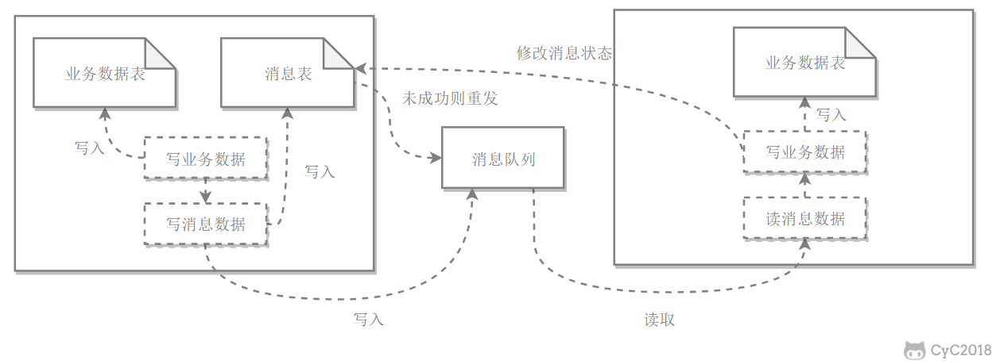

###### datetime:2022-03-08 17:19

###### author:nzb

# 技术面试必备基础知识

> [传送门](https://github.com/CyC2018/CS-Notes)

## 系统设计

### [系统设计基础](https://github.com/CyC2018/CS-Notes/blob/master/notes/%E7%B3%BB%E7%BB%9F%E8%AE%BE%E8%AE%A1%E5%9F%BA%E7%A1%80.md)

* [一、性能](https://github.com/CyC2018/CS-Notes/blob/master/notes/%E7%B3%BB%E7%BB%9F%E8%AE%BE%E8%AE%A1%E5%9F%BA%E7%A1%80.md#%E4%B8%80%E6%80%A7%E8%83%BD)

    * 性能指标

        * 1\. 响应时间

          `指某个请求从发出到接收到响应消耗的时间。`

        * 2\. 吞吐量

          `系统在单位时间内可以处理的请求数量，通常使用每秒的请求数来衡量。`

        * 3\. 并发用户数

          `指系统能同时处理的并发用户请求数量。`

    * 性能优化

        * 1\. 集群

          `将多台服务器组成集群，使用负载均衡将请求转发到集群中，避免单一服务器的负载压力过大导致性能降低。`

        * 2\. 缓存

            * 缓存能够提高性能的原因如下：

                * 缓存数据通常位于内存等介质中，这种介质对于读操作特别快；

                * 缓存数据可以位于靠近用户的地理位置上；

                * 可以将计算结果进行缓存，从而避免重复计算。

        * 3\. 异步

          `某些流程可以将操作转换为消息，将消息发送到消息队列之后立即返回，之后这个操作会被异步处理。`

* [二、伸缩性](https://github.com/CyC2018/CS-Notes/blob/master/notes/%E7%B3%BB%E7%BB%9F%E8%AE%BE%E8%AE%A1%E5%9F%BA%E7%A1%80.md#%E4%BA%8C%E4%BC%B8%E7%BC%A9%E6%80%A7)

  `指不断向集群中添加服务器来缓解不断上升的用户并发访问压力和不断增长的数据存储需求。`

    * 伸缩性与性能

        * 如果系统存在性能问题，那么单个用户的请求总是很慢的；

        * 如果系统存在伸缩性问题，那么单个用户的请求可能会很快，但是在并发数很高的情况下系统会很慢。

    * 实现伸缩性

        * 应用服务器只要不具有状态，那么就可以很容易地通过负载均衡器向集群中添加新的服务器。

        * 关系型数据库的伸缩性通过 Sharding 来实现，将数据按一定的规则分布到不同的节点上，从而解决单台存储服务器的存储空间限制。

        * 对于非关系型数据库，它们天生就是为海量数据而诞生，对伸缩性的支持特别好。

* [三、扩展性](https://github.com/CyC2018/CS-Notes/blob/master/notes/%E7%B3%BB%E7%BB%9F%E8%AE%BE%E8%AE%A1%E5%9F%BA%E7%A1%80.md#%E4%B8%89%E6%89%A9%E5%B1%95%E6%80%A7)

    * 指的是添加新功能时对现有系统的其它应用无影响，这就要求不同应用具备低耦合的特点。

    * 实现可扩展主要有两种方式：

        * 使用消息队列进行解耦，应用之间通过消息传递进行通信；

        * 使用分布式服务将业务和可复用的服务分离开来，业务使用分布式服务框架调用可复用的服务。新增的产品可以通过调用可复用的服务来实现业务逻辑，对其它产品没有影响。

* [四、可用性](https://github.com/CyC2018/CS-Notes/blob/master/notes/%E7%B3%BB%E7%BB%9F%E8%AE%BE%E8%AE%A1%E5%9F%BA%E7%A1%80.md#%E5%9B%9B%E5%8F%AF%E7%94%A8%E6%80%A7)

    * 冗余

        * 保证高可用的主要手段是使用冗余，当某个服务器故障时就请求其它服务器。

        * 应用服务器的冗余比较容易实现，只要保证应用服务器不具有状态，那么某个应用服务器故障时，负载均衡器将该应用服务器原先的用户请求转发到另一个应用服务器上，不会对用户有任何影响。

        * 存储服务器的冗余需要使用主从复制来实现，当主服务器故障时，需要提升从服务器为主服务器，这个过程称为切换。

    * 监控

        * 对 CPU、内存、磁盘、网络等系统负载信息进行监控，当某个信息达到一定阈值时通知运维人员，从而在系统发生故障之前及时发现问题。

    * 服务降级

        * 服务降级是系统为了应对大量的请求，主动关闭部分功能，从而保证核心功能可用。

* [五、安全性](https://github.com/CyC2018/CS-Notes/blob/master/notes/%E7%B3%BB%E7%BB%9F%E8%AE%BE%E8%AE%A1%E5%9F%BA%E7%A1%80.md#%E4%BA%94%E5%AE%89%E5%85%A8%E6%80%A7)

  `要求系统在应对各种攻击手段时能够有可靠的应对措施。`

### [分布式](https://github.com/CyC2018/CS-Notes/blob/master/notes/%E5%88%86%E5%B8%83%E5%BC%8F.md)

* [一、分布式锁](https://github.com/CyC2018/CS-Notes/blob/master/notes/%E5%88%86%E5%B8%83%E5%BC%8F.md#%E4%B8%80%E5%88%86%E5%B8%83%E5%BC%8F%E9%94%81)

    - 在单机场景下，可以使用语言的内置锁来实现进程同步。但是在分布式场景下，需要同步的进程可能位于不同的节点上，那么就需要使用分布式锁。
        - 阻塞锁通常使用互斥量来实现：
            - 互斥量为 0 表示有其它进程在使用锁，此时处于锁定状态；
            - 互斥量为 1 表示未锁定状态。
        - 1 和 0 可以用一个整型值表示，也可以用某个数据是否存在表示。

    * [数据库的唯一索引](https://github.com/CyC2018/CS-Notes/blob/master/notes/%E5%88%86%E5%B8%83%E5%BC%8F.md#%E6%95%B0%E6%8D%AE%E5%BA%93%E7%9A%84%E5%94%AF%E4%B8%80%E7%B4%A2%E5%BC%95)

        * 获得锁时向表中插入一条记录，释放锁时删除这条记录。唯一索引可以保证该记录只被插入一次，那么就可以用这个记录是否存在来判断是否处于锁定状态。

        * 存在以下几个问题：

            * 锁没有失效时间，解锁失败的话其它进程无法再获得该锁；

            * 只能是非阻塞锁，插入失败直接就报错了，无法重试；

            * 不可重入，已经获得锁的进程也必须重新获取锁。

    * [Redis 的 SETNX 指令](https://github.com/CyC2018/CS-Notes/blob/master/notes/%E5%88%86%E5%B8%83%E5%BC%8F.md#redis-%E7%9A%84-setnx-%E6%8C%87%E4%BB%A4)

        * 使用 SETNX（set if not exist）指令插入一个键值对，如果 Key 已经存在，那么会返回 False，否则插入成功并返回 True。

        * SETNX 指令和数据库的唯一索引类似，保证了只存在一个 Key 的键值对，那么可以用一个 Key 的键值对是否存在来判断是否存于锁定状态。

        * EXPIRE 指令可以为一个键值对设置一个过期时间，从而避免了数据库唯一索引实现方式中释放锁失败的问题。

    * [Redis 的 RedLock 算法](https://github.com/CyC2018/CS-Notes/blob/master/notes/%E5%88%86%E5%B8%83%E5%BC%8F.md#redis-%E7%9A%84-redlock-%E7%AE%97%E6%B3%95)

        * 使用了多个 Redis 实例来实现分布式锁，这是为了保证在发生单点故障时仍然可用。

            * 尝试从 N 个互相独立 Redis 实例获取锁；

            * 计算获取锁消耗的时间，只有时间小于锁的过期时间，并且从大多数（N / 2 + 1）实例上获取了锁，才认为获取锁成功；

            * 如果获取锁失败，就到每个实例上释放锁。

    * [Zookeeper 的有序节点](https://github.com/CyC2018/CS-Notes/blob/master/notes/%E5%88%86%E5%B8%83%E5%BC%8F.md#zookeeper-%E7%9A%84%E6%9C%89%E5%BA%8F%E8%8A%82%E7%82%B9)

        * 1\. Zookeeper 抽象模型

          `Zookeeper 提供了一种树形结构的命名空间，/app1/p_1 节点的父节点为 /app1。`

        * 2\. 节点类型

            * 永久节点：不会因为会话结束或者超时而消失；

            * 临时节点：如果会话结束或者超时就会消失；

            * 有序节点：会在节点名的后面加一个数字后缀，并且是有序的，例如生成的有序节点为 /lock/node-0000000000，它的下一个有序节点则为 /lock/node-0000000001，以此类推。

        * 3\. 监听器

          `为一个节点注册监听器，在节点状态发生改变时，会给客户端发送消息。`

        * 4\. 分布式锁实现

            * 创建一个锁目录 /lock；

            * 当一个客户端需要获取锁时，在 /lock 下创建临时的且有序的子节点；

            * 客户端获取 /lock 下的子节点列表，判断自己创建的子节点是否为当前子节点列表中序号最小的子节点，如果是则认为获得锁；否则监听自己的前一个子节点，获得子节点的变更通知后重复此步骤直至获得锁；

            * 执行业务代码，完成后，删除对应的子节点。

        * 5\. 会话超时

          `如果一个已经获得锁的会话超时了，因为创建的是临时节点，所以该会话对应的临时节点会被删除，其它会话就可以获得锁了。可以看到，这种实现方式不会出现数据库的唯一索引实现方式释放锁失败的问题。`

        * 6\. 羊群效应

          `一个节点未获得锁，只需要监听自己的前一个子节点，这是因为如果监听所有的子节点，那么任意一个子节点状态改变，其它所有子节点都会收到通知（羊群效应，一只羊动起来，其它羊也会一哄而上），而我们只希望它的后一个子节点收到通知。`

* [二、分布式事务](https://github.com/CyC2018/CS-Notes/blob/master/notes/%E5%88%86%E5%B8%83%E5%BC%8F.md#%E4%BA%8C%E5%88%86%E5%B8%83%E5%BC%8F%E4%BA%8B%E5%8A%A1)

    * 指事务的操作位于不同的节点上，需要保证事务的 ACID 特性。

    * 分布式锁和分布式事务区别：

        * 锁问题的关键在于进程操作的互斥关系，例如多个进程同时修改账户的余额，如果没有互斥关系则会导致该账户的余额不正确。

        * 而事务问题的关键则在于事务涉及的一系列操作需要满足 ACID 特性，例如要满足原子性操作则需要这些操作要么都执行，要么都不执行。例如在下单场景下，库存和订单如果不在同一个节点上，就涉及分布式事务。

    * [2PC](https://github.com/CyC2018/CS-Notes/blob/master/notes/%E5%88%86%E5%B8%83%E5%BC%8F.md#2pc)

      `两阶段提交（Two-phase Commit，2PC），通过引入协调者（Coordinator）来协调参与者的行为，并最终决定这些参与者是否要真正执行事务。`

        * 1\. 运行过程

            * 1.1 准备阶段

                * 协调者询问参与者事务是否执行成功，参与者发回事务执行结果。询问可以看成一种投票，需要参与者都同意才能执行。

            * 1.2 提交阶段

                * 如果事务在每个参与者上都执行成功，事务协调者发送通知让参与者提交事务；否则，协调者发送通知让参与者回滚事务。

                * 需要注意的是，在准备阶段，参与者执行了事务，但是还未提交。只有在提交阶段接收到协调者发来的通知后，才进行提交或者回滚。

        * 2\. 存在的问题

            * 2.1 同步阻塞

              `所有事务参与者在等待其它参与者响应的时候都处于同步阻塞等待状态，无法进行其它操作。`

            * 2.2 单点问题

              `协调者在 2PC 中起到非常大的作用，发生故障将会造成很大影响。特别是在提交阶段发生故障，所有参与者会一直同步阻塞等待，无法完成其它操作。`

            * 2.3 数据不一致

              `在提交阶段，如果协调者只发送了部分 Commit 消息，此时网络发生异常，那么只有部分参与者接收到 Commit 消息，也就是说只有部分参与者提交了事务，使得系统数据不一致。`

            * 2.4 太过保守

              `任意一个节点失败就会导致整个事务失败，没有完善的容错机制。`

    * [本地消息表](https://github.com/CyC2018/CS-Notes/blob/master/notes/%E5%88%86%E5%B8%83%E5%BC%8F.md#%E6%9C%AC%E5%9C%B0%E6%B6%88%E6%81%AF%E8%A1%A8)

        * 本地消息表与业务数据表处于同一个数据库中，这样就能利用本地事务来保证在对这两个表的操作满足事务特性，并且使用了消息队列来保证最终一致性。

            * 在分布式事务操作的一方完成写业务数据的操作之后向本地消息表发送一个消息，本地事务能保证这个消息一定会被写入本地消息表中。

            * 之后将本地消息表中的消息转发到消息队列中，如果转发成功则将消息从本地消息表中删除，否则继续重新转发。

            * 在分布式事务操作的另一方从消息队列中读取一个消息，并执行消息中的操作。

        * 

* [三、CAP](https://github.com/CyC2018/CS-Notes/blob/master/notes/%E5%88%86%E5%B8%83%E5%BC%8F.md#%E4%B8%89cap)

  `分布式系统不可能同时满足一致性（C：Consistency）、可用性（A：Availability）和分区容忍性（P：Partition Tolerance），最多只能同时满足其中两项。`

    * [一致性](https://github.com/CyC2018/CS-Notes/blob/master/notes/%E5%88%86%E5%B8%83%E5%BC%8F.md#%E4%B8%80%E8%87%B4%E6%80%A7)

      `一致性指的是多个数据副本是否能保持一致的特性，在一致性的条件下，系统在执行数据更新操作之后能够从一致性状态转移到另一个一致性状态。 对系统的一个数据更新成功之后，如果所有用户都能够读取到最新的值，该系统就被认为具有强一致性。`

    * [可用性](https://github.com/CyC2018/CS-Notes/blob/master/notes/%E5%88%86%E5%B8%83%E5%BC%8F.md#%E5%8F%AF%E7%94%A8%E6%80%A7)

      `可用性指分布式系统在面对各种异常时可以提供正常服务的能力，可以用系统可用时间占总时间的比值来衡量，4 个 9 的可用性表示系统 99.99% 的时间是可用的。 在可用性条件下，要求系统提供的服务一直处于可用的状态，对于用户的每一个操作请求总是能够在有限的时间内返回结果。`

    * [分区容忍性](https://github.com/CyC2018/CS-Notes/blob/master/notes/%E5%88%86%E5%B8%83%E5%BC%8F.md#%E5%88%86%E5%8C%BA%E5%AE%B9%E5%BF%8D%E6%80%A7)

      `网络分区指分布式系统中的节点被划分为多个区域，每个区域内部可以通信，但是区域之间无法通信。 在分区容忍性条件下，分布式系统在遇到任何网络分区故障的时候，仍然需要能对外提供一致性和可用性的服务，除非是整个网络环境都发生了故障。`

    * [权衡](https://github.com/CyC2018/CS-Notes/blob/master/notes/%E5%88%86%E5%B8%83%E5%BC%8F.md#%E6%9D%83%E8%A1%A1)

        * 在分布式系统中，分区容忍性必不可少，因为需要总是假设网络是不可靠的。因此，CAP 理论实际上是要在可用性和一致性之间做权衡。

        * 可用性和一致性往往是冲突的，很难使它们同时满足。在多个节点之间进行数据同步时，

            * 为了保证一致性（CP），不能访问未同步完成的节点，也就失去了部分可用性；

            * 为了保证可用性（AP），允许读取所有节点的数据，但是数据可能不一致。

* [四、BASE](https://github.com/CyC2018/CS-Notes/blob/master/notes/%E5%88%86%E5%B8%83%E5%BC%8F.md#%E5%9B%9Bbase)

    * BASE 是基本可用（Basically Available）、软状态（Soft State）和最终一致性（Eventually Consistent）三个短语的缩写。

    * BASE 理论是对 CAP 中一致性和可用性权衡的结果，它的核心思想是：即使无法做到强一致性，但每个应用都可以根据自身业务特点，采用适当的方式来使系统达到最终一致性。

    * [基本可用](https://github.com/CyC2018/CS-Notes/blob/master/notes/%E5%88%86%E5%B8%83%E5%BC%8F.md#%E5%9F%BA%E6%9C%AC%E5%8F%AF%E7%94%A8)

      `指分布式系统在出现故障的时候，保证核心可用，允许损失部分可用性。 例如，电商在做促销时，为了保证购物系统的稳定性，部分消费者可能会被引导到一个降级的页面。`

    * [软状态](https://github.com/CyC2018/CS-Notes/blob/master/notes/%E5%88%86%E5%B8%83%E5%BC%8F.md#%E8%BD%AF%E7%8A%B6%E6%80%81)

      `指允许系统中的数据存在中间状态，并认为该中间状态不会影响系统整体可用性，即允许系统不同节点的数据副本之间进行同步的过程存在时延。`

    * [最终一致性](https://github.com/CyC2018/CS-Notes/blob/master/notes/%E5%88%86%E5%B8%83%E5%BC%8F.md#%E6%9C%80%E7%BB%88%E4%B8%80%E8%87%B4%E6%80%A7)

        * 最终一致性强调的是系统中所有的数据副本，在经过一段时间的同步后，最终能达到一致的状态。

        * ACID 要求强一致性，通常运用在传统的数据库系统上。而 BASE 要求最终一致性，通过牺牲强一致性来达到可用性，通常运用在大型分布式系统中。

        * 在实际的分布式场景中，不同业务单元和组件对一致性的要求是不同的，因此 ACID 和 BASE 往往会结合在一起使用。

* [五、Paxos](https://github.com/CyC2018/CS-Notes/blob/master/notes/%E5%88%86%E5%B8%83%E5%BC%8F.md#%E4%BA%94paxos)

    * 用于达成共识性问题，即对多个节点产生的值，该算法能保证只选出唯一一个值。

    * 主要有三类节点：

        * 提议者（Proposer）：提议一个值；

        * 接受者（Acceptor）：对每个提议进行投票；

        * 告知者（Learner）：被告知投票的结果，不参与投票过程。

    * [执行过程](https://github.com/CyC2018/CS-Notes/blob/master/notes/%E5%88%86%E5%B8%83%E5%BC%8F.md#%E6%89%A7%E8%A1%8C%E8%BF%87%E7%A8%8B)

      `规定一个提议包含两个字段：[n, v]，其中 n 为序号（具有唯一性），v 为提议值。`

        * 1\. Prepare 阶段

        * 2\. Accept 阶段

        * 3\. Learn 阶段

    * [约束条件](https://github.com/CyC2018/CS-Notes/blob/master/notes/%E5%88%86%E5%B8%83%E5%BC%8F.md#%E7%BA%A6%E6%9D%9F%E6%9D%A1%E4%BB%B6)

        * 1\. 正确性

            * 指只有一个提议值会生效。

            * 因为 Paxos 协议要求每个生效的提议被多数 Acceptor 接收，并且 Acceptor 不会接受两个不同的提议，因此可以保证正确性。

        * 2\. 可终止性

            * 指最后总会有一个提议生效。

            * Paxos 协议能够让 Proposer 发送的提议朝着能被大多数 Acceptor 接受的那个提议靠拢，因此能够保证可终止性。

* [六、Raft](https://github.com/CyC2018/CS-Notes/blob/master/notes/%E5%88%86%E5%B8%83%E5%BC%8F.md#%E5%85%ADraft)

  `Raft 也是分布式一致性协议，主要是用来竞选主节点。`

    * [单个 Candidate 的竞选](https://github.com/CyC2018/CS-Notes/blob/master/notes/%E5%88%86%E5%B8%83%E5%BC%8F.md#%E5%8D%95%E4%B8%AA-candidate-%E7%9A%84%E7%AB%9E%E9%80%89)

    * [多个 Candidate 竞选](https://github.com/CyC2018/CS-Notes/blob/master/notes/%E5%88%86%E5%B8%83%E5%BC%8F.md#%E5%A4%9A%E4%B8%AA-candidate-%E7%AB%9E%E9%80%89)

    * [数据同步](https://github.com/CyC2018/CS-Notes/blob/master/notes/%E5%88%86%E5%B8%83%E5%BC%8F.md#%E6%95%B0%E6%8D%AE%E5%90%8C%E6%AD%A5)

### [集群](https://github.com/CyC2018/CS-Notes/blob/master/notes/%E9%9B%86%E7%BE%A4.md)

* [一、负载均衡](https://github.com/CyC2018/CS-Notes/blob/master/notes/%E9%9B%86%E7%BE%A4.md#%E4%B8%80%E8%B4%9F%E8%BD%BD%E5%9D%87%E8%A1%A1)

    * 集群中的应用服务器（节点）通常被设计成无状态，用户可以请求任何一个节点。

    * 负载均衡器会根据集群中每个节点的负载情况，将用户请求转发到合适的节点上。

    * 负载均衡器可以用来实现高可用以及伸缩性：

        * 高可用：当某个节点故障时，负载均衡器会将用户请求转发到另外的节点上，从而保证所有服务持续可用

        * 伸缩性：根据系统整体负载情况，可以很容易地添加或移除节点

    * 负载均衡器运行过程包含两个部分：

        * 根据负载均衡算法得到转发的节点

        * 进行转发

    * [负载均衡算法](https://github.com/CyC2018/CS-Notes/blob/master/notes/%E9%9B%86%E7%BE%A4.md#%E8%B4%9F%E8%BD%BD%E5%9D%87%E8%A1%A1%E7%AE%97%E6%B3%95)

        * 1\. 轮询（Round Robin）

          `轮询算法把每个请求轮流发送到每个服务器上。该算法比较适合每个服务器的性能差不多的场景。`

        * 2\. 加权轮询（Weighted Round Robbin）

          `加权轮询是在轮询的基础上，根据服务器的性能差异，为服务器赋予一定的权值，性能高的服务器分配更高的权值。`

        * 3\. 最少连接（least Connections）

          `由于每个请求的连接时间不一样，使用轮询或者加权轮询算法的话，可能会让一台服务器当前连接数过大，而另一台服务器的连接过小，造成负载不均衡。 最少连接算法就是将请求发送给当前最少连接数的服务器上。`

        * 4\. 加权最少连接（Weighted Least Connection）

          `在最少连接的基础上，根据服务器的性能为每台服务器分配权重，再根据权重计算出每台服务器能处理的连接数。`

        * 5\. 随机算法（Random）

          `把请求随机发送到服务器上。 和轮询算法类似，该算法比较适合服务器性能差不多的场景。`

        * 6\. 源地址哈希法 (IP Hash)

            * 源地址哈希通过对客户端 IP 计算哈希值之后，再对服务器数量取模得到目标服务器的序号。

            * 可以保证同一 IP 的客户端的请求会转发到同一台服务器上，用来实现会话粘滞（Sticky Session）

    * [转发实现](https://github.com/CyC2018/CS-Notes/blob/master/notes/%E9%9B%86%E7%BE%A4.md#%E8%BD%AC%E5%8F%91%E5%AE%9E%E7%8E%B0)

        * 1\. HTTP 重定向

            * HTTP 重定向负载均衡服务器使用某种负载均衡算法计算得到服务器的 IP 地址之后，将该地址写入 HTTP 重定向报文中，状态码为 302。客户端收到重定向报文之后，需要重新向服务器发起请求。

            * 缺点：

                * 需要两次请求，因此访问延迟比较高；

                * HTTP 负载均衡器处理能力有限，会限制集群的规模。

            * 该负载均衡转发的缺点比较明显，实际场景中很少使用它。

        * 2\. DNS 域名解析

            * 在 DNS 解析域名的同时使用负载均衡算法计算服务器 IP 地址。

            * 优点：

                * DNS 能够根据地理位置进行域名解析，返回离用户最近的服务器 IP 地址。

            * 缺点：

                * 由于 DNS 具有多级结构，每一级的域名记录都可能被缓存，当下线一台服务器需要修改 DNS 记录时，需要过很长一段时间才能生效。

            * 大型网站基本使用了 DNS 做为第一级负载均衡手段，然后在内部使用其它方式做第二级负载均衡。也就是说，域名解析的结果为内部的负载均衡服务器 IP 地址。

        * 3\. 反向代理服务器

            * 反向代理服务器位于源服务器前面，用户的请求需要先经过反向代理服务器才能到达源服务器。反向代理可以用来进行缓存、日志记录等，同时也可以用来做为负载均衡服务器。

            * 在这种负载均衡转发方式下，客户端不直接请求源服务器，因此源服务器不需要外部 IP 地址，而反向代理需要配置内部和外部两套 IP 地址。

            * 优点：

                * 与其它功能集成在一起，部署简单。

            * 缺点：

                * 所有请求和响应都需要经过反向代理服务器，它可能会成为性能瓶颈。

        * 4\. 网络层

            * 在操作系统内核进程获取网络数据包，根据负载均衡算法计算源服务器的 IP 地址，并修改请求数据包的目的 IP 地址，最后进行转发。

            * 源服务器返回的响应也需要经过负载均衡服务器，通常是让负载均衡服务器同时作为集群的网关服务器来实现。

            * 优点：

                * 在内核进程中进行处理，性能比较高。

            * 缺点：

                * 和反向代理一样，所有的请求和响应都经过负载均衡服务器，会成为性能瓶颈。

        * 5\. 链路层

            * 在链路层根据负载均衡算法计算源服务器的 MAC 地址，并修改请求数据包的目的 MAC 地址，并进行转发。

            * 通过配置源服务器的虚拟 IP 地址和负载均衡服务器的 IP 地址一致，从而不需要修改 IP 地址就可以进行转发。也正因为 IP
              地址一样，所以源服务器的响应不需要转发回负载均衡服务器，可以直接转发给客户端，避免了负载均衡服务器的成为瓶颈。

            * 这是一种三角传输模式，被称为直接路由。对于提供下载和视频服务的网站来说，直接路由避免了大量的网络传输数据经过负载均衡服务器。

            * 这是目前大型网站使用最广负载均衡转发方式，在 Linux 平台可以使用的负载均衡服务器为 LVS（Linux Virtual Server）。

* [二、集群下的 Session 管理](https://github.com/CyC2018/CS-Notes/blob/master/notes/%E9%9B%86%E7%BE%A4.md#%E4%BA%8C%E9%9B%86%E7%BE%A4%E4%B8%8B%E7%9A%84-session-%E7%AE%A1%E7%90%86)

  `一个用户的 Session 信息如果存储在一个服务器上，那么当负载均衡器把用户的下一个请求转发到另一个服务器，由于服务器没有用户的 Session 信息，那么该用户就需要重新进行登录等操作。`

    * [Sticky Session](https://github.com/CyC2018/CS-Notes/blob/master/notes/%E9%9B%86%E7%BE%A4.md#sticky-session)

        * 需要配置负载均衡器，使得一个用户的所有请求都路由到同一个服务器，这样就可以把用户的 Session 存放在该服务器中。

        * 缺点：

            * 当服务器宕机时，将丢失该服务器上的所有 Session。

    * [Session Replication](https://github.com/CyC2018/CS-Notes/blob/master/notes/%E9%9B%86%E7%BE%A4.md#session-replication)

        * 在服务器之间进行 Session 同步操作，每个服务器都有所有用户的 Session 信息，因此用户可以向任何一个服务器进行请求。

        * 缺点：

            * 占用过多内存；

            * 同步过程占用网络带宽以及服务器处理器时间。

    * [Session Server](https://github.com/CyC2018/CS-Notes/blob/master/notes/%E9%9B%86%E7%BE%A4.md#session-server)

        * 使用一个单独的服务器存储 Session 数据，可以使用传统的 MySQL，也使用 Redis 或者 Memcached 这种内存型数据库。

        * 优点：

            * 为了使得大型网站具有伸缩性，集群中的应用服务器通常需要保持无状态，那么应用服务器不能存储用户的会话信息。Session Server 将用户的会话信息单独进行存储，从而保证了应用服务器的无状态。

        * 缺点：

            * 需要去实现存取 Session 的代码。

### [攻击技术](https://github.com/CyC2018/CS-Notes/blob/master/notes/%E6%94%BB%E5%87%BB%E6%8A%80%E6%9C%AF.md)

* [一、跨站脚本攻击](https://github.com/CyC2018/CS-Notes/blob/master/notes/%E6%94%BB%E5%87%BB%E6%8A%80%E6%9C%AF.md#%E4%B8%80%E8%B7%A8%E7%AB%99%E8%84%9A%E6%9C%AC%E6%94%BB%E5%87%BB)

  `跨站脚本攻击（Cross-Site Scripting, XSS），可以将代码注入到用户浏览的网页上，这种代码包括 HTML 和 JavaScript。`

    * 危害

        * 窃取用户的 Cookie

        * 伪造虚假的输入表单骗取个人信息

        * 显示伪造的文章或者图片

    * 防范手段

        * 1\. 设置 Cookie 为 HttpOnly

          `设置了 HttpOnly 的 Cookie 可以防止 JavaScript 脚本调用，就无法通过 document.cookie 获取用户 Cookie 信息。`

        * 2\. 过滤特殊字符

          `例如将 < 转义为 &lt;，将 > 转义为 &gt;，从而避免 HTML 和 Jascript 代码的运行。`

* [二、跨站请求伪造](https://github.com/CyC2018/CS-Notes/blob/master/notes/%E6%94%BB%E5%87%BB%E6%8A%80%E6%9C%AF.md#%E4%BA%8C%E8%B7%A8%E7%AB%99%E8%AF%B7%E6%B1%82%E4%BC%AA%E9%80%A0)

  `跨站请求伪造（Cross-site request forgery，CSRF），是攻击者通过一些技术手段欺骗用户的浏览器去访问一个自己曾经认证过的网站并执行一些操作（如发邮件，发消息，甚至财产操作如转账和购买商品）。由于浏览器曾经认证过，所以被访问的网站会认为是真正的用户操作而去执行。 XSS 利用的是用户对指定网站的信任，CSRF 利用的是网站对用户浏览器的信任。`

    * 防范手段

        * 1\. 检查 Referer 首部字段

            * Referer 首部字段位于 HTTP 报文中，用于标识请求来源的地址。检查这个首部字段并要求请求来源的地址在同一个域名下，可以极大的防止 CSRF 攻击。

            * 这种办法简单易行，工作量低，仅需要在关键访问处增加一步校验。但这种办法也有其局限性，因其完全依赖浏览器发送正确的 Referer 字段。虽然 HTTP
              协议对此字段的内容有明确的规定，但并无法保证来访的浏览器的具体实现，亦无法保证浏览器没有安全漏洞影响到此字段。并且也存在攻击者攻击某些浏览器，篡改其 Referer 字段的可能。

        * 2\. 添加校验 Token

          `在访问敏感数据请求时，要求用户浏览器提供不保存在 Cookie 中，并且攻击者无法伪造的数据作为校验。例如服务器生成随机数并附加在表单中，并要求客户端传回这个随机数。`

        * 3\. 输入验证码

          `因为 CSRF 攻击是在用户无意识的情况下发生的，所以要求用户输入验证码可以让用户知道自己正在做的操作。`

* [三、SQL 注入攻击](https://github.com/CyC2018/CS-Notes/blob/master/notes/%E6%94%BB%E5%87%BB%E6%8A%80%E6%9C%AF.md#%E4%B8%89sql-%E6%B3%A8%E5%85%A5%E6%94%BB%E5%87%BB)

  `服务器上的数据库运行非法的 SQL 语句，主要通过拼接来完成。`

    * 防范手段

        * 1\. 对传入的参数进行编码转义

        * 2\. 单引号转换

          `将传入的参数中的单引号转换为连续两个单引号，PHP 中的 Magic quote 可以完成这个功能。`

* [四、拒绝服务攻击](https://github.com/CyC2018/CS-Notes/blob/master/notes/%E6%94%BB%E5%87%BB%E6%8A%80%E6%9C%AF.md#%E5%9B%9B%E6%8B%92%E7%BB%9D%E6%9C%8D%E5%8A%A1%E6%94%BB%E5%87%BB)

    * 拒绝服务攻击（denial-of-service attack，DoS），亦称洪水攻击，其目的在于使目标电脑的网络或系统资源耗尽，使服务暂时中断或停止，导致其正常用户无法访问。

    * 分布式拒绝服务攻击（distributed denial-of-service attack，DDoS），指攻击者使用两个或以上被攻陷的电脑作为“僵尸”向特定的目标发动“拒绝服务”式攻击。

### [缓存](https://github.com/CyC2018/CS-Notes/blob/master/notes/%E7%BC%93%E5%AD%98.md)

* [一、缓存特征](https://github.com/CyC2018/CS-Notes/blob/master/notes/%E7%BC%93%E5%AD%98.md#%E4%B8%80%E7%BC%93%E5%AD%98%E7%89%B9%E5%BE%81)

    * 命中率

        * 当某个请求能够通过访问缓存而得到响应时，称为缓存命中。

        * 缓存命中率越高，缓存的利用率也就越高。

    * 最大空间

        * 缓存通常位于内存中，内存的空间通常比磁盘空间小的多，因此缓存的最大空间不可能非常大。

        * 当缓存存放的数据量超过最大空间时，就需要淘汰部分数据来存放新到达的数据。

    * 淘汰策略

        * FIFO（First In First Out）：先进先出策略，在实时性的场景下，需要经常访问最新的数据，那么就可以使用 FIFO，使得最先进入的数据（最晚的数据）被淘汰。

        * LRU（Least Recently Used）：最近最久未使用策略，优先淘汰最久未使用的数据，也就是上次被访问时间距离现在最久的数据。该策略可以保证内存中的数据都是热点数据，也就是经常被访问的数据，从而保证缓存命中率。

        * LFU（Least Frequently Used）：最不经常使用策略，优先淘汰一段时间内使用次数最少的数据。

* [二、缓存位置](https://github.com/CyC2018/CS-Notes/blob/master/notes/%E7%BC%93%E5%AD%98.md#%E4%BA%8C%E7%BC%93%E5%AD%98%E4%BD%8D%E7%BD%AE)

    * 浏览器

      `当 HTTP 响应允许进行缓存时，浏览器会将 HTML、CSS、JavaScript、图片等静态资源进行缓存。`

    * ISP

      `网络服务提供商（ISP）是网络访问的第一跳，通过将数据缓存在 ISP 中能够大大提高用户的访问速度。`

    * 反向代理

      `反向代理位于服务器之前，请求与响应都需要经过反向代理。通过将数据缓存在反向代理，在用户请求反向代理时就可以直接使用缓存进行响应。`

    * 本地缓存

      `使用 Guava Cache 将数据缓存在服务器本地内存中，服务器代码可以直接读取本地内存中的缓存，速度非常快。`

    * 分布式缓存

        * 使用 Redis、Memcache 等分布式缓存将数据缓存在分布式缓存系统中。

        * 相对于本地缓存来说，分布式缓存单独部署，可以根据需求分配硬件资源。不仅如此，服务器集群都可以访问分布式缓存，而本地缓存需要在服务器集群之间进行同步，实现难度和性能开销上都非常大。

    * 数据库缓存

      `MySQL 等数据库管理系统具有自己的查询缓存机制来提高查询效率。`

    * CPU 多级缓存

      `CPU 为了解决运算速度与主存 IO 速度不匹配的问题，引入了多级缓存结构，同时使用 MESI 等缓存一致性协议来解决多核 CPU 缓存数据一致性的问题。`

* [三、CDN](https://github.com/CyC2018/CS-Notes/blob/master/notes/%E7%BC%93%E5%AD%98.md#%E4%B8%89cdn)

    * 内容分发网络（Content distribution network，CDN）是一种互连的网络系统，它利用更靠近用户的服务器从而更快更可靠地将 HTML、CSS、JavaScript、音乐、图片、视频等静态资源分发给用户。

    * CDN 主要有以下优点：

        * 更快地将数据分发给用户；

        * 通过部署多台服务器，从而提高系统整体的带宽性能；

        * 多台服务器可以看成是一种冗余机制，从而具有高可用性。

* [四、缓存问题](https://github.com/CyC2018/CS-Notes/blob/master/notes/%E7%BC%93%E5%AD%98.md#%E5%9B%9B%E7%BC%93%E5%AD%98%E9%97%AE%E9%A2%98)

    * 缓存穿透

        * 指的是对某个一定不存在的数据进行请求，该请求将会穿透缓存到达数据库。

        * 解决方案：

            * 对这些不存在的数据缓存一个空数据；

            * 对这类请求进行过滤。

    * 缓存雪崩

        * 指的是由于数据没有被加载到缓存中，或者缓存数据在同一时间大面积失效（过期），又或者缓存服务器宕机，导致大量的请求都到达数据库。

        * 在有缓存的系统中，系统非常依赖于缓存，缓存分担了很大一部分的数据请求。当发生缓存雪崩时，数据库无法处理这么大的请求，导致数据库崩溃。

        * 解决方案：

            * 为了防止缓存在同一时间大面积过期导致的缓存雪崩，可以通过观察用户行为，合理设置缓存过期时间来实现；

              `分散设置缓存时间`

            * 为了防止缓存服务器宕机出现的缓存雪崩，可以使用分布式缓存，分布式缓存中每一个节点只缓存部分的数据，当某个节点宕机时可以保证其它节点的缓存仍然可用。

              `使用分布式缓存`

            * 也可以进行缓存预热，避免在系统刚启动不久由于还未将大量数据进行缓存而导致缓存雪崩。

              `缓存预热`

    * 缓存一致性

        * 缓存一致性要求数据更新的同时缓存数据也能够实时更新。

        * 解决方案：

            * 在数据更新的同时立即去更新缓存；

            * 在读缓存之前先判断缓存是否是最新的，如果不是最新的先进行更新。

        * 要保证缓存一致性需要付出很大的代价，缓存数据最好是那些对一致性要求不高的数据，允许缓存数据存在一些脏数据。

    * 缓存 “无底洞” 现象

        * 指的是为了满足业务要求添加了大量缓存节点，但是性能不但没有好转反而下降了的现象。

        * 产生原因

            * 缓存系统通常采用 hash 函数将 key
              映射到对应的缓存节点，随着缓存节点数目的增加，键值分布到更多的节点上，导致客户端一次批量操作会涉及多次网络操作，这意味着批量操作的耗时会随着节点数目的增加而不断增大。此外，网络连接数变多，对节点的性能也有一定影响。

        * 解决方案：

            * 优化批量数据操作命令；

            * 减少网络通信次数；

            * 降低接入成本，使用长连接 / 连接池，NIO 等。

* [五、数据分布](https://github.com/CyC2018/CS-Notes/blob/master/notes/%E7%BC%93%E5%AD%98.md#%E4%BA%94%E6%95%B0%E6%8D%AE%E5%88%86%E5%B8%83)

    * 哈希分布

        * 哈希分布就是将数据计算哈希值之后，按照哈希值分配到不同的节点上。例如有 N 个节点，数据的主键为 key，则将该数据分配的节点序号为：hash(key)%N。

        * 传统的哈希分布算法存在一个问题：当节点数量变化时，也就是 N 值变化，那么几乎所有的数据都需要重新分布，将导致大量的数据迁移。

    * 顺序分布

        * 将数据划分为多个连续的部分，按数据的 ID 或者时间分布到不同节点上。例如 User 表的 ID 范围为 1 ~ 7000，使用顺序分布可以将其划分成多个子表，对应的主键范围为 1 ~ 1000，1001 ~
          2000，...，6001 ~ 7000。

        * 顺序分布相比于哈希分布的主要优点如下：

            * 能保持数据原有的顺序；

            * 并且能够准确控制每台服务器存储的数据量，从而使得存储空间的利用率最大。

* [六、一致性哈希](https://github.com/CyC2018/CS-Notes/blob/master/notes/%E7%BC%93%E5%AD%98.md#%E5%85%AD%E4%B8%80%E8%87%B4%E6%80%A7%E5%93%88%E5%B8%8C)

  `Distributed Hash Table（DHT） 是一种哈希分布方式，其目的是为了克服传统哈希分布在服务器节点数量变化时大量数据迁移的问题。`

* [七、LRU](https://github.com/CyC2018/CS-Notes/blob/master/notes/%E7%BC%93%E5%AD%98.md#%E4%B8%83lru)

### [消息队列](https://github.com/CyC2018/CS-Notes/blob/master/notes/%E6%B6%88%E6%81%AF%E9%98%9F%E5%88%97.md)

* [一、消息模型](https://github.com/CyC2018/CS-Notes/blob/master/notes/%E6%B6%88%E6%81%AF%E9%98%9F%E5%88%97.md#%E4%B8%80%E6%B6%88%E6%81%AF%E6%A8%A1%E5%9E%8B)

    * [点对点](https://github.com/CyC2018/CS-Notes/blob/master/notes/%E6%B6%88%E6%81%AF%E9%98%9F%E5%88%97.md#%E7%82%B9%E5%AF%B9%E7%82%B9)

      `消息生产者向消息队列中发送了一个消息之后，只能被一个消费者消费一次。`

    * [发布/订阅](https://github.com/CyC2018/CS-Notes/blob/master/notes/%E6%B6%88%E6%81%AF%E9%98%9F%E5%88%97.md#%E5%8F%91%E5%B8%83%E8%AE%A2%E9%98%85)

      `消息生产者向频道发送一个消息之后，多个消费者可以从该频道订阅到这条消息并消费。`

        * 发布与订阅模式和观察者模式有以下不同：

            * 观察者模式中，观察者和主题都知道对方的存在；而在发布与订阅模式中，生产者与消费者不知道对方的存在，它们之间通过频道进行通信。

            * 观察者模式是同步的，当事件触发时，主题会调用观察者的方法，然后等待方法返回；而发布与订阅模式是异步的，生产者向频道发送一个消息之后，就不需要关心消费者何时去订阅这个消息，可以立即返回。

* [二、使用场景](https://github.com/CyC2018/CS-Notes/blob/master/notes/%E6%B6%88%E6%81%AF%E9%98%9F%E5%88%97.md#%E4%BA%8C%E4%BD%BF%E7%94%A8%E5%9C%BA%E6%99%AF)

    * [异步处理](https://github.com/CyC2018/CS-Notes/blob/master/notes/%E6%B6%88%E6%81%AF%E9%98%9F%E5%88%97.md#%E5%BC%82%E6%AD%A5%E5%A4%84%E7%90%86)

        * 发送者将消息发送给消息队列之后，不需要同步等待消息接收者处理完毕，而是立即返回进行其它操作。消息接收者从消息队列中订阅消息之后异步处理。

        * 例如在注册流程中通常需要发送验证邮件来确保注册用户身份的合法性，可以使用消息队列使发送验证邮件的操作异步处理，用户在填写完注册信息之后就可以完成注册，而将发送验证邮件这一消息发送到消息队列中。

        * 只有在业务流程允许异步处理的情况下才能这么做，例如上面的注册流程中，如果要求用户对验证邮件进行点击之后才能完成注册的话，就不能再使用消息队列。

    * [流量削锋](https://github.com/CyC2018/CS-Notes/blob/master/notes/%E6%B6%88%E6%81%AF%E9%98%9F%E5%88%97.md#%E6%B5%81%E9%87%8F%E5%89%8A%E9%94%8B)

        * 在高并发的场景下，如果短时间有大量的请求到达会压垮服务器。

        * 可以将请求发送到消息队列中，服务器按照其处理能力从消息队列中订阅消息进行处理。

    * [应用解耦](https://github.com/CyC2018/CS-Notes/blob/master/notes/%E6%B6%88%E6%81%AF%E9%98%9F%E5%88%97.md#%E5%BA%94%E7%94%A8%E8%A7%A3%E8%80%A6)

        * 如果模块之间不直接进行调用，模块之间耦合度就会很低，那么修改一个模块或者新增一个模块对其它模块的影响会很小，从而实现可扩展性。

        * 通过使用消息队列，一个模块只需要向消息队列中发送消息，其它模块可以选择性地从消息队列中订阅消息从而完成调用。

* [三、可靠性](https://github.com/CyC2018/CS-Notes/blob/master/notes/%E6%B6%88%E6%81%AF%E9%98%9F%E5%88%97.md#%E4%B8%89%E5%8F%AF%E9%9D%A0%E6%80%A7)

    * [发送端的可靠性](https://github.com/CyC2018/CS-Notes/blob/master/notes/%E6%B6%88%E6%81%AF%E9%98%9F%E5%88%97.md#%E5%8F%91%E9%80%81%E7%AB%AF%E7%9A%84%E5%8F%AF%E9%9D%A0%E6%80%A7)

        * 发送端完成操作后一定能将消息成功发送到消息队列中。

        * 实现方法：在本地数据库建一张消息表，将消息数据与业务数据保存在同一数据库实例里，这样就可以利用本地数据库的事务机制。事务提交成功后，将消息表中的消息转移到消息队列中，若转移消息成功则删除消息表中的数据，否则继续重传。

    * [接收端的可靠性](https://github.com/CyC2018/CS-Notes/blob/master/notes/%E6%B6%88%E6%81%AF%E9%98%9F%E5%88%97.md#%E6%8E%A5%E6%94%B6%E7%AB%AF%E7%9A%84%E5%8F%AF%E9%9D%A0%E6%80%A7)

        * 接收端能够从消息队列成功消费一次消息。

        * 两种实现方法：

            * 保证接收端处理消息的业务逻辑具有幂等性：只要具有幂等性，那么消费多少次消息，最后处理的结果都是一样的。

            * 保证消息具有唯一编号，并使用一张日志表来记录已经消费的消息编号。
