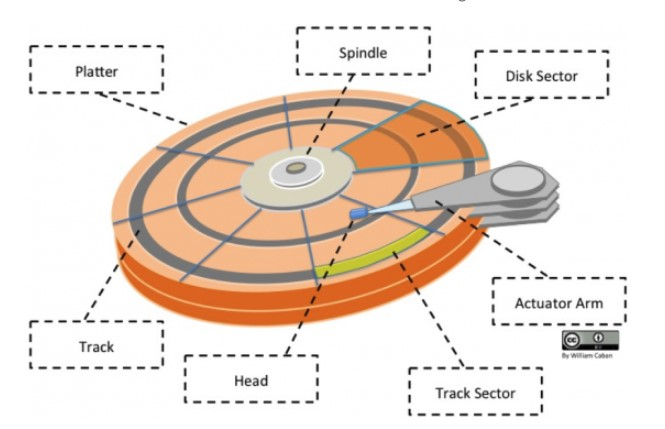
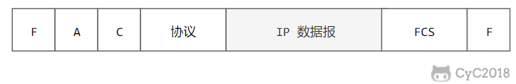
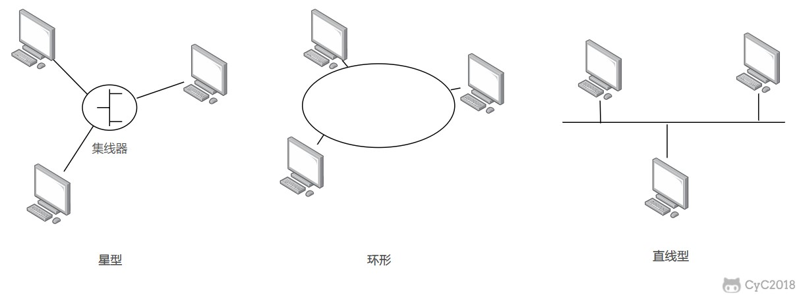
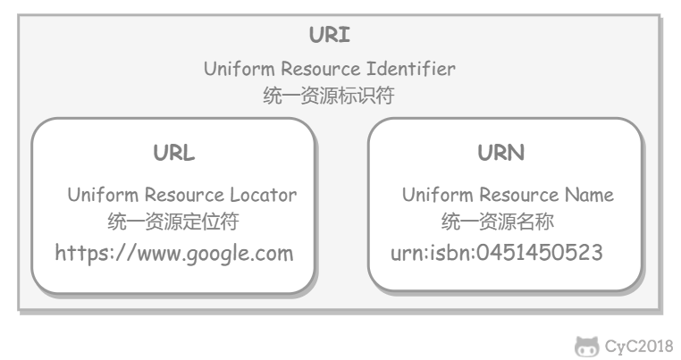
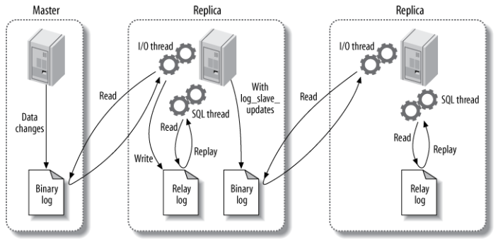
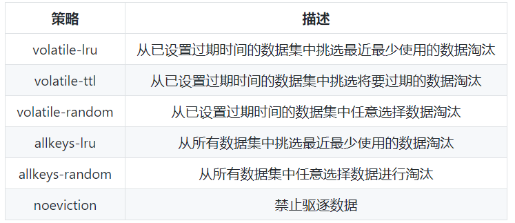

###### datetime:2022-03-08 17:19

###### author:nzb

# 技术面试必备基础知识

> [传送门](https://github.com/CyC2018/CS-Notes)

## 操作系统

### [计算机操作系统](https://github.com/CyC2018/CS-Notes/blob/master/notes/%E8%AE%A1%E7%AE%97%E6%9C%BA%E6%93%8D%E4%BD%9C%E7%B3%BB%E7%BB%9F%20-%20%E7%9B%AE%E5%BD%95.md)

#### [概述](https://github.com/CyC2018/CS-Notes/blob/master/notes/%E8%AE%A1%E7%AE%97%E6%9C%BA%E6%93%8D%E4%BD%9C%E7%B3%BB%E7%BB%9F%20-%20%E6%A6%82%E8%BF%B0.md)

* [基本特征](https://github.com/CyC2018/CS-Notes/blob/master/notes/%E8%AE%A1%E7%AE%97%E6%9C%BA%E6%93%8D%E4%BD%9C%E7%B3%BB%E7%BB%9F%20-%20%E6%A6%82%E8%BF%B0.md#%E5%9F%BA%E6%9C%AC%E7%89%B9%E5%BE%81)

    * [1\. 并发](https://github.com/CyC2018/CS-Notes/blob/master/notes/%E8%AE%A1%E7%AE%97%E6%9C%BA%E6%93%8D%E4%BD%9C%E7%B3%BB%E7%BB%9F%20-%20%E6%A6%82%E8%BF%B0.md#1-%E5%B9%B6%E5%8F%91)

        * 并发是指宏观上在一段时间内能同时运行多个程序，而并行则指同一时刻能运行多个指令。

        * 并行需要硬件支持，如多流水线、多核处理器或者分布式计算系统。

        * 操作系统通过引入进程和线程，使得程序能够并发运行。

    * [2\. 共享](https://github.com/CyC2018/CS-Notes/blob/master/notes/%E8%AE%A1%E7%AE%97%E6%9C%BA%E6%93%8D%E4%BD%9C%E7%B3%BB%E7%BB%9F%20-%20%E6%A6%82%E8%BF%B0.md#2-%E5%85%B1%E4%BA%AB)

        * 共享是指系统中的资源可以被多个并发进程共同使用。

        * 有两种共享方式：互斥共享和同时共享。

        * 互斥共享的资源称为临界资源，例如打印机等，在同一时刻只允许一个进程访问，需要用同步机制来实现互斥访问。

    * [3\. 虚拟](https://github.com/CyC2018/CS-Notes/blob/master/notes/%E8%AE%A1%E7%AE%97%E6%9C%BA%E6%93%8D%E4%BD%9C%E7%B3%BB%E7%BB%9F%20-%20%E6%A6%82%E8%BF%B0.md#3-%E8%99%9A%E6%8B%9F)

        * 虚拟技术把一个物理实体转换为多个逻辑实体。

        * 主要有两种虚拟技术：时（时间）分复用技术和空（空间）分复用技术。

        * 多个进程能在同一个处理器上并发执行使用了时分复用技术，让每个进程轮流占用处理器，每次只执行一小个时间片并快速切换。

        *
      虚拟内存使用了空分复用技术，它将物理内存抽象为地址空间，每个进程都有各自的地址空间。地址空间的页被映射到物理内存，地址空间的页并不需要全部在物理内存中，当使用到一个没有在物理内存的页时，执行页面置换算法，将该页置换到内存中。

    * [4\. 异步](https://github.com/CyC2018/CS-Notes/blob/master/notes/%E8%AE%A1%E7%AE%97%E6%9C%BA%E6%93%8D%E4%BD%9C%E7%B3%BB%E7%BB%9F%20-%20%E6%A6%82%E8%BF%B0.md#4-%E5%BC%82%E6%AD%A5)

        * 异步指进程不是一次性执行完毕，而是走走停停，以不可知的速度向前推进。

* [基本功能](https://github.com/CyC2018/CS-Notes/blob/master/notes/%E8%AE%A1%E7%AE%97%E6%9C%BA%E6%93%8D%E4%BD%9C%E7%B3%BB%E7%BB%9F%20-%20%E6%A6%82%E8%BF%B0.md#%E5%9F%BA%E6%9C%AC%E5%8A%9F%E8%83%BD)

    * [1\. 进程管理](https://github.com/CyC2018/CS-Notes/blob/master/notes/%E8%AE%A1%E7%AE%97%E6%9C%BA%E6%93%8D%E4%BD%9C%E7%B3%BB%E7%BB%9F%20-%20%E6%A6%82%E8%BF%B0.md#1-%E8%BF%9B%E7%A8%8B%E7%AE%A1%E7%90%86)

    * [2\. 内存管理](https://github.com/CyC2018/CS-Notes/blob/master/notes/%E8%AE%A1%E7%AE%97%E6%9C%BA%E6%93%8D%E4%BD%9C%E7%B3%BB%E7%BB%9F%20-%20%E6%A6%82%E8%BF%B0.md#2-%E5%86%85%E5%AD%98%E7%AE%A1%E7%90%86)

    * [3\. 文件管理](https://github.com/CyC2018/CS-Notes/blob/master/notes/%E8%AE%A1%E7%AE%97%E6%9C%BA%E6%93%8D%E4%BD%9C%E7%B3%BB%E7%BB%9F%20-%20%E6%A6%82%E8%BF%B0.md#3-%E6%96%87%E4%BB%B6%E7%AE%A1%E7%90%86)

    * [4\. 设备管理](https://github.com/CyC2018/CS-Notes/blob/master/notes/%E8%AE%A1%E7%AE%97%E6%9C%BA%E6%93%8D%E4%BD%9C%E7%B3%BB%E7%BB%9F%20-%20%E6%A6%82%E8%BF%B0.md#4-%E8%AE%BE%E5%A4%87%E7%AE%A1%E7%90%86)

* [系统调用](https://github.com/CyC2018/CS-Notes/blob/master/notes/%E8%AE%A1%E7%AE%97%E6%9C%BA%E6%93%8D%E4%BD%9C%E7%B3%BB%E7%BB%9F%20-%20%E6%A6%82%E8%BF%B0.md#%E7%B3%BB%E7%BB%9F%E8%B0%83%E7%94%A8)

    * 如果一个进程在用户态需要使用内核态的功能，就进行系统调用从而陷入内核，由操作系统代为完成。

    * 

* [宏内核和微内核](https://github.com/CyC2018/CS-Notes/blob/master/notes/%E8%AE%A1%E7%AE%97%E6%9C%BA%E6%93%8D%E4%BD%9C%E7%B3%BB%E7%BB%9F%20-%20%E6%A6%82%E8%BF%B0.md#%E5%AE%8F%E5%86%85%E6%A0%B8%E5%92%8C%E5%BE%AE%E5%86%85%E6%A0%B8)

    * [1\. 宏内核](https://github.com/CyC2018/CS-Notes/blob/master/notes/%E8%AE%A1%E7%AE%97%E6%9C%BA%E6%93%8D%E4%BD%9C%E7%B3%BB%E7%BB%9F%20-%20%E6%A6%82%E8%BF%B0.md#1-%E5%AE%8F%E5%86%85%E6%A0%B8)

    * [2\. 微内核](https://github.com/CyC2018/CS-Notes/blob/master/notes/%E8%AE%A1%E7%AE%97%E6%9C%BA%E6%93%8D%E4%BD%9C%E7%B3%BB%E7%BB%9F%20-%20%E6%A6%82%E8%BF%B0.md#2-%E5%BE%AE%E5%86%85%E6%A0%B8)

* [中断分类](https://github.com/CyC2018/CS-Notes/blob/master/notes/%E8%AE%A1%E7%AE%97%E6%9C%BA%E6%93%8D%E4%BD%9C%E7%B3%BB%E7%BB%9F%20-%20%E6%A6%82%E8%BF%B0.md#%E4%B8%AD%E6%96%AD%E5%88%86%E7%B1%BB)

    * 1\. 外中断

        * 由 CPU 执行指令以外的事件引起，如 I/O 完成中断，表示设备输入/输出处理已经完成，处理器能够发送下一个输入/输出请求。此外还有时钟中断、控制台中断（Ctril + c）等。

    * 2\. 异常

        * 由 CPU 执行指令的内部事件引起，如非法操作码、地址越界、算术溢出等。

    * 3\. 陷入

        * 在用户程序中使用系统调用。

#### [进程管理](https://github.com/CyC2018/CS-Notes/blob/master/notes/%E8%AE%A1%E7%AE%97%E6%9C%BA%E6%93%8D%E4%BD%9C%E7%B3%BB%E7%BB%9F%20-%20%E8%BF%9B%E7%A8%8B%E7%AE%A1%E7%90%86.md)

* [进程与线程](https://github.com/CyC2018/CS-Notes/blob/master/notes/%E8%AE%A1%E7%AE%97%E6%9C%BA%E6%93%8D%E4%BD%9C%E7%B3%BB%E7%BB%9F%20-%20%E8%BF%9B%E7%A8%8B%E7%AE%A1%E7%90%86.md#%E8%BF%9B%E7%A8%8B%E4%B8%8E%E7%BA%BF%E7%A8%8B)

    * [1\. 进程](https://github.com/CyC2018/CS-Notes/blob/master/notes/%E8%AE%A1%E7%AE%97%E6%9C%BA%E6%93%8D%E4%BD%9C%E7%B3%BB%E7%BB%9F%20-%20%E8%BF%9B%E7%A8%8B%E7%AE%A1%E7%90%86.md#1-%E8%BF%9B%E7%A8%8B)
      `进程是资源分配的基本单位。`

    * [2\. 线程](https://github.com/CyC2018/CS-Notes/blob/master/notes/%E8%AE%A1%E7%AE%97%E6%9C%BA%E6%93%8D%E4%BD%9C%E7%B3%BB%E7%BB%9F%20-%20%E8%BF%9B%E7%A8%8B%E7%AE%A1%E7%90%86.md#2-%E7%BA%BF%E7%A8%8B)
      `线程是独立调度的基本单位。一个进程中可以有多个线程，它们共享进程资源。`

    * [3\. 区别](https://github.com/CyC2018/CS-Notes/blob/master/notes/%E8%AE%A1%E7%AE%97%E6%9C%BA%E6%93%8D%E4%BD%9C%E7%B3%BB%E7%BB%9F%20-%20%E8%BF%9B%E7%A8%8B%E7%AE%A1%E7%90%86.md#3-%E5%8C%BA%E5%88%AB)

        * Ⅰ 拥有资源

            * 进程是资源分配的基本单位，但是线程不拥有资源，线程可以访问隶属进程的资源。

        * Ⅱ 调度

            * 线程是独立调度的基本单位，在同一进程中，线程的切换不会引起进程切换，从一个进程中的线程切换到另一个进程中的线程时，会引起进程切换。

        * Ⅲ 系统开销

            * 由于创建或撤销进程时，系统都要为之分配或回收资源，如内存空间、I/O 设备等，所付出的开销远大于创建或撤销线程时的开销。类似地，在进行进程切换时，涉及当前执行进程 CPU 环境的保存及新调度进程 CPU
              环境的设置，而线程切换时只需保存和设置少量寄存器内容，开销很小。

        * Ⅳ 通信方面

            * 线程间可以通过直接读写同一进程中的数据进行通信，但是进程通信需要借助 IPC。

* [进程状态的切换](https://github.com/CyC2018/CS-Notes/blob/master/notes/%E8%AE%A1%E7%AE%97%E6%9C%BA%E6%93%8D%E4%BD%9C%E7%B3%BB%E7%BB%9F%20-%20%E8%BF%9B%E7%A8%8B%E7%AE%A1%E7%90%86.md#%E8%BF%9B%E7%A8%8B%E7%8A%B6%E6%80%81%E7%9A%84%E5%88%87%E6%8D%A2)

    * 

        * 就绪状态（ready）：等待被调度

        * 运行状态（running）

        * 阻塞状态（waiting）：等待资源

    * 应该注意以下内容：

        * 只有就绪态和运行态可以相互转换，其它的都是单向转换。就绪状态的进程通过调度算法从而获得 CPU 时间，转为运行状态；而运行状态的进程，在分配给它的 CPU 时间片用完之后就会转为就绪状态，等待下一次调度。

        * 阻塞状态是缺少需要的资源从而由运行状态转换而来，但是该资源不包括 CPU 时间，缺少 CPU 时间会从运行态转换为就绪态。

* [进程调度算法](https://github.com/CyC2018/CS-Notes/blob/master/notes/%E8%AE%A1%E7%AE%97%E6%9C%BA%E6%93%8D%E4%BD%9C%E7%B3%BB%E7%BB%9F%20-%20%E8%BF%9B%E7%A8%8B%E7%AE%A1%E7%90%86.md#%E8%BF%9B%E7%A8%8B%E8%B0%83%E5%BA%A6%E7%AE%97%E6%B3%95)

    * [1\. 批处理系统](https://github.com/CyC2018/CS-Notes/blob/master/notes/%E8%AE%A1%E7%AE%97%E6%9C%BA%E6%93%8D%E4%BD%9C%E7%B3%BB%E7%BB%9F%20-%20%E8%BF%9B%E7%A8%8B%E7%AE%A1%E7%90%86.md#1-%E6%89%B9%E5%A4%84%E7%90%86%E7%B3%BB%E7%BB%9F)

      `没有太多的用户操作`

        * **1.1 先来先服务 first-come first-serverd（FCFS）**

            * 非抢占式的调度算法，按照请求的顺序进行调度。

            * 有利于长作业，但不利于短作业，因为短作业必须一直等待前面的长作业执行完毕才能执行，而长作业又需要执行很长时间，造成了短作业等待时间过长。

        * **1.2 短作业优先 shortest job first（SJF）**

            * 非抢占式的调度算法，按估计运行时间最短的顺序进行调度。

            * 长作业有可能会饿死，处于一直等待短作业执行完毕的状态。因为如果一直有短作业到来，那么长作业永远得不到调度。

        * **1.3 最短剩余时间优先 shortest remaining time next（SRTN）**

            * 最短作业优先的抢占式版本，按剩余运行时间的顺序进行调度。 当一个新的作业到达时，其整个运行时间与当前进程的剩余时间作比较。如果新的进程需要的时间更少，则挂起当前进程，运行新的进程。否则新的进程等待。

    * [2\. 交互式系统](https://github.com/CyC2018/CS-Notes/blob/master/notes/%E8%AE%A1%E7%AE%97%E6%9C%BA%E6%93%8D%E4%BD%9C%E7%B3%BB%E7%BB%9F%20-%20%E8%BF%9B%E7%A8%8B%E7%AE%A1%E7%90%86.md#2-%E4%BA%A4%E4%BA%92%E5%BC%8F%E7%B3%BB%E7%BB%9F)

      `有大量的用户交互操作`

        * **2.1 时间片轮转**

            * 将所有就绪进程按 FCFS 的原则排成一个队列，每次调度时，把 CPU
              时间分配给队首进程，该进程可以执行一个时间片。当时间片用完时，由计时器发出时钟中断，调度程序便停止该进程的执行，并将它送往就绪队列的末尾，同时继续把 CPU 时间分配给队首的进程。

            * 时间片轮转算法的效率和时间片的大小有很大关系：

                * 因为进程切换都要保存进程的信息并且载入新进程的信息，如果时间片太小，会导致进程切换得太频繁，在进程切换上就会花过多时间。

                * 而如果时间片过长，那么实时性就不能得到保证。

        * **2.2 优先级调度**

            * 为每个进程分配一个优先级，按优先级进行调度。

            * 为了防止低优先级的进程永远等不到调度，可以随着时间的推移增加等待进程的优先级。

        * **2.3 多级反馈队列**

            * 可以将这种调度算法看成是时间片轮转调度算法和优先级调度算法的结合。

    * [3\. 实时系统](https://github.com/CyC2018/CS-Notes/blob/master/notes/%E8%AE%A1%E7%AE%97%E6%9C%BA%E6%93%8D%E4%BD%9C%E7%B3%BB%E7%BB%9F%20-%20%E8%BF%9B%E7%A8%8B%E7%AE%A1%E7%90%86.md#3-%E5%AE%9E%E6%97%B6%E7%B3%BB%E7%BB%9F)

        * 实时系统要求一个请求在一个确定时间内得到响应。

        * 分为硬实时和软实时，前者必须满足绝对的截止时间，后者可以容忍一定的超时。

* [进程同步](https://github.com/CyC2018/CS-Notes/blob/master/notes/%E8%AE%A1%E7%AE%97%E6%9C%BA%E6%93%8D%E4%BD%9C%E7%B3%BB%E7%BB%9F%20-%20%E8%BF%9B%E7%A8%8B%E7%AE%A1%E7%90%86.md#%E8%BF%9B%E7%A8%8B%E5%90%8C%E6%AD%A5)

    * [1\. 临界区](https://github.com/CyC2018/CS-Notes/blob/master/notes/%E8%AE%A1%E7%AE%97%E6%9C%BA%E6%93%8D%E4%BD%9C%E7%B3%BB%E7%BB%9F%20-%20%E8%BF%9B%E7%A8%8B%E7%AE%A1%E7%90%86.md#1-%E4%B8%B4%E7%95%8C%E5%8C%BA)
      `对临界资源进行访问的那段代码称为临界区。`

    * [2\. 同步与互斥](https://github.com/CyC2018/CS-Notes/blob/master/notes/%E8%AE%A1%E7%AE%97%E6%9C%BA%E6%93%8D%E4%BD%9C%E7%B3%BB%E7%BB%9F%20-%20%E8%BF%9B%E7%A8%8B%E7%AE%A1%E7%90%86.md#2-%E5%90%8C%E6%AD%A5%E4%B8%8E%E4%BA%92%E6%96%A5)

        * 同步：多个进程因为合作产生的直接制约关系，使得进程有一定的先后执行关系。

        * 互斥：多个进程在同一时刻只有一个进程能进入临界区。

    * [3\. 信号量](https://github.com/CyC2018/CS-Notes/blob/master/notes/%E8%AE%A1%E7%AE%97%E6%9C%BA%E6%93%8D%E4%BD%9C%E7%B3%BB%E7%BB%9F%20-%20%E8%BF%9B%E7%A8%8B%E7%AE%A1%E7%90%86.md#3-%E4%BF%A1%E5%8F%B7%E9%87%8F)

    * [4\. 管程](https://github.com/CyC2018/CS-Notes/blob/master/notes/%E8%AE%A1%E7%AE%97%E6%9C%BA%E6%93%8D%E4%BD%9C%E7%B3%BB%E7%BB%9F%20-%20%E8%BF%9B%E7%A8%8B%E7%AE%A1%E7%90%86.md#4-%E7%AE%A1%E7%A8%8B)

* [经典同步问题](https://github.com/CyC2018/CS-Notes/blob/master/notes/%E8%AE%A1%E7%AE%97%E6%9C%BA%E6%93%8D%E4%BD%9C%E7%B3%BB%E7%BB%9F%20-%20%E8%BF%9B%E7%A8%8B%E7%AE%A1%E7%90%86.md#%E7%BB%8F%E5%85%B8%E5%90%8C%E6%AD%A5%E9%97%AE%E9%A2%98)

    * [1\. 哲学家进餐问题](https://github.com/CyC2018/CS-Notes/blob/master/notes/%E8%AE%A1%E7%AE%97%E6%9C%BA%E6%93%8D%E4%BD%9C%E7%B3%BB%E7%BB%9F%20-%20%E8%BF%9B%E7%A8%8B%E7%AE%A1%E7%90%86.md#1-%E5%93%B2%E5%AD%A6%E5%AE%B6%E8%BF%9B%E9%A4%90%E9%97%AE%E9%A2%98)

    * [2\. 读者-写者问题](https://github.com/CyC2018/CS-Notes/blob/master/notes/%E8%AE%A1%E7%AE%97%E6%9C%BA%E6%93%8D%E4%BD%9C%E7%B3%BB%E7%BB%9F%20-%20%E8%BF%9B%E7%A8%8B%E7%AE%A1%E7%90%86.md#2-%E8%AF%BB%E8%80%85-%E5%86%99%E8%80%85%E9%97%AE%E9%A2%98)

* [进程通信](https://github.com/CyC2018/CS-Notes/blob/master/notes/%E8%AE%A1%E7%AE%97%E6%9C%BA%E6%93%8D%E4%BD%9C%E7%B3%BB%E7%BB%9F%20-%20%E8%BF%9B%E7%A8%8B%E7%AE%A1%E7%90%86.md#%E8%BF%9B%E7%A8%8B%E9%80%9A%E4%BF%A1)

  进程同步与进程通信很容易混淆，它们的区别在于： 进程同步：控制多个进程按一定顺序执行； 进程通信：进程间传输信息。
  进程通信是一种手段，而进程同步是一种目的。也可以说，为了能够达到进程同步的目的，需要让进程进行通信，传输一些进程同步所需要的信息。

    * [1\. 管道](https://github.com/CyC2018/CS-Notes/blob/master/notes/%E8%AE%A1%E7%AE%97%E6%9C%BA%E6%93%8D%E4%BD%9C%E7%B3%BB%E7%BB%9F%20-%20%E8%BF%9B%E7%A8%8B%E7%AE%A1%E7%90%86.md#1-%E7%AE%A1%E9%81%93)

        * 管道是通过调用 pipe 函数创建的，fd[0] 用于读，fd[1] 用于写。

        * 它具有以下限制：

            * 只支持半双工通信（单向交替传输）；

            * 只能在父子进程或者兄弟进程中使用。

    * [2\. FIFO](https://github.com/CyC2018/CS-Notes/blob/master/notes/%E8%AE%A1%E7%AE%97%E6%9C%BA%E6%93%8D%E4%BD%9C%E7%B3%BB%E7%BB%9F%20-%20%E8%BF%9B%E7%A8%8B%E7%AE%A1%E7%90%86.md#2-fifo)
      `命名管道，去除了管道只能在父子进程中使用的限制。常用于客户-服务器应用程序中，FIFO 用作汇聚点，在客户进程和服务器进程之间传递数据。`

    * [3\. 消息队列](https://github.com/CyC2018/CS-Notes/blob/master/notes/%E8%AE%A1%E7%AE%97%E6%9C%BA%E6%93%8D%E4%BD%9C%E7%B3%BB%E7%BB%9F%20-%20%E8%BF%9B%E7%A8%8B%E7%AE%A1%E7%90%86.md#3-%E6%B6%88%E6%81%AF%E9%98%9F%E5%88%97)

        * 相比于 FIFO，消息队列具有以下优点：

            * 可独立于读写进程存在，从而避免了 FIFO 中同步管道的打开和关闭时可能产生的困难；

            * 避免了 FIFO 的同步阻塞问题，不需要进程自己提供同步方法；

            * 读进程可以根据消息类型有选择地接收消息，而不像 FIFO 那样只能默认地接收。

    * [4\. 信号量](https://github.com/CyC2018/CS-Notes/blob/master/notes/%E8%AE%A1%E7%AE%97%E6%9C%BA%E6%93%8D%E4%BD%9C%E7%B3%BB%E7%BB%9F%20-%20%E8%BF%9B%E7%A8%8B%E7%AE%A1%E7%90%86.md#4-%E4%BF%A1%E5%8F%B7%E9%87%8F)
      `一个计数器，用于为多个进程提供对共享数据对象的访问。`

    * [5\. 共享存储](https://github.com/CyC2018/CS-Notes/blob/master/notes/%E8%AE%A1%E7%AE%97%E6%9C%BA%E6%93%8D%E4%BD%9C%E7%B3%BB%E7%BB%9F%20-%20%E8%BF%9B%E7%A8%8B%E7%AE%A1%E7%90%86.md#5-%E5%85%B1%E4%BA%AB%E5%AD%98%E5%82%A8)

        * 允许多个进程共享一个给定的存储区。因为数据不需要在进程之间复制，所以这是最快的一种 IPC。

        * 需要使用信号量用来同步对共享存储的访问。

        * 多个进程可以将同一个文件映射到它们的地址空间从而实现共享内存。另外 XSI 共享内存不是使用文件，而是使用内存的匿名段。

    * [6\. 套接字](https://github.com/CyC2018/CS-Notes/blob/master/notes/%E8%AE%A1%E7%AE%97%E6%9C%BA%E6%93%8D%E4%BD%9C%E7%B3%BB%E7%BB%9F%20-%20%E8%BF%9B%E7%A8%8B%E7%AE%A1%E7%90%86.md#6-%E5%A5%97%E6%8E%A5%E5%AD%97)
      `用于不同机器间的进程通信`

#### [死锁](https://github.com/CyC2018/CS-Notes/blob/master/notes/%E8%AE%A1%E7%AE%97%E6%9C%BA%E6%93%8D%E4%BD%9C%E7%B3%BB%E7%BB%9F%20-%20%E6%AD%BB%E9%94%81.md)

* [必要条件](https://github.com/CyC2018/CS-Notes/blob/master/notes/%E8%AE%A1%E7%AE%97%E6%9C%BA%E6%93%8D%E4%BD%9C%E7%B3%BB%E7%BB%9F%20-%20%E6%AD%BB%E9%94%81.md#%E5%BF%85%E8%A6%81%E6%9D%A1%E4%BB%B6)

    * 互斥：每个资源要么已经分配给了一个进程，要么就是可用的。

    * 占有和等待：已经得到了某个资源的进程可以再请求新的资源。

    * 不可抢占：已经分配给一个进程的资源不能强制性地被抢占，它只能被占有它的进程显式地释放。

    * 环路等待：有两个或者两个以上的进程组成一条环路，该环路中的每个进程都在等待下一个进程所占有的资源。

* [处理方法](https://github.com/CyC2018/CS-Notes/blob/master/notes/%E8%AE%A1%E7%AE%97%E6%9C%BA%E6%93%8D%E4%BD%9C%E7%B3%BB%E7%BB%9F%20-%20%E6%AD%BB%E9%94%81.md#%E5%A4%84%E7%90%86%E6%96%B9%E6%B3%95)

    * [鸵鸟策略](https://github.com/CyC2018/CS-Notes/blob/master/notes/%E8%AE%A1%E7%AE%97%E6%9C%BA%E6%93%8D%E4%BD%9C%E7%B3%BB%E7%BB%9F%20-%20%E6%AD%BB%E9%94%81.md#%E9%B8%B5%E9%B8%9F%E7%AD%96%E7%95%A5)

        * 因为解决死锁问题的代价很高，因此鸵鸟策略这种不采取任务措施的方案会获得更高的性能。

        * 当发生死锁时不会对用户造成多大影响，或发生死锁的概率很低，可以采用鸵鸟策略。

        * 大多数操作系统，包括 Unix，Linux 和 Windows，处理死锁问题的办法仅仅是忽略它。

    * [死锁检测与死锁恢复](https://github.com/CyC2018/CS-Notes/blob/master/notes/%E8%AE%A1%E7%AE%97%E6%9C%BA%E6%93%8D%E4%BD%9C%E7%B3%BB%E7%BB%9F%20-%20%E6%AD%BB%E9%94%81.md#%E6%AD%BB%E9%94%81%E6%A3%80%E6%B5%8B%E4%B8%8E%E6%AD%BB%E9%94%81%E6%81%A2%E5%A4%8D)

      `不试图阻止死锁，而是当检测到死锁发生时，采取措施进行恢复。`

        * [1\. 每种类型一个资源的死锁检测](https://github.com/CyC2018/CS-Notes/blob/master/notes/%E8%AE%A1%E7%AE%97%E6%9C%BA%E6%93%8D%E4%BD%9C%E7%B3%BB%E7%BB%9F%20-%20%E6%AD%BB%E9%94%81.md#1-%E6%AF%8F%E7%A7%8D%E7%B1%BB%E5%9E%8B%E4%B8%80%E4%B8%AA%E8%B5%84%E6%BA%90%E7%9A%84%E6%AD%BB%E9%94%81%E6%A3%80%E6%B5%8B)

        * [2\. 每种类型多个资源的死锁检测](https://github.com/CyC2018/CS-Notes/blob/master/notes/%E8%AE%A1%E7%AE%97%E6%9C%BA%E6%93%8D%E4%BD%9C%E7%B3%BB%E7%BB%9F%20-%20%E6%AD%BB%E9%94%81.md#2-%E6%AF%8F%E7%A7%8D%E7%B1%BB%E5%9E%8B%E5%A4%9A%E4%B8%AA%E8%B5%84%E6%BA%90%E7%9A%84%E6%AD%BB%E9%94%81%E6%A3%80%E6%B5%8B)

        * [3\. 死锁恢复](https://github.com/CyC2018/CS-Notes/blob/master/notes/%E8%AE%A1%E7%AE%97%E6%9C%BA%E6%93%8D%E4%BD%9C%E7%B3%BB%E7%BB%9F%20-%20%E6%AD%BB%E9%94%81.md#3-%E6%AD%BB%E9%94%81%E6%81%A2%E5%A4%8D)

            * 利用抢占恢复

            * 利用回滚恢复

            * 通过杀死进程恢复

* [死锁预防](https://github.com/CyC2018/CS-Notes/blob/master/notes/%E8%AE%A1%E7%AE%97%E6%9C%BA%E6%93%8D%E4%BD%9C%E7%B3%BB%E7%BB%9F%20-%20%E6%AD%BB%E9%94%81.md#%E6%AD%BB%E9%94%81%E9%A2%84%E9%98%B2)

  `在程序运行之前预防发生死锁。`

    * [1\. 破坏互斥条件](https://github.com/CyC2018/CS-Notes/blob/master/notes/%E8%AE%A1%E7%AE%97%E6%9C%BA%E6%93%8D%E4%BD%9C%E7%B3%BB%E7%BB%9F%20-%20%E6%AD%BB%E9%94%81.md#1-%E7%A0%B4%E5%9D%8F%E4%BA%92%E6%96%A5%E6%9D%A1%E4%BB%B6)

      `例如假脱机打印机技术允许若干个进程同时输出，唯一真正请求物理打印机的进程是打印机守护进程。`

    * [2\. 破坏占有和等待条件](https://github.com/CyC2018/CS-Notes/blob/master/notes/%E8%AE%A1%E7%AE%97%E6%9C%BA%E6%93%8D%E4%BD%9C%E7%B3%BB%E7%BB%9F%20-%20%E6%AD%BB%E9%94%81.md#2-%E7%A0%B4%E5%9D%8F%E5%8D%A0%E6%9C%89%E5%92%8C%E7%AD%89%E5%BE%85%E6%9D%A1%E4%BB%B6)

      `一种实现方式是规定所有进程在开始执行前请求所需要的全部资源。`

    * [3\. 破坏不可抢占条件](https://github.com/CyC2018/CS-Notes/blob/master/notes/%E8%AE%A1%E7%AE%97%E6%9C%BA%E6%93%8D%E4%BD%9C%E7%B3%BB%E7%BB%9F%20-%20%E6%AD%BB%E9%94%81.md#3-%E7%A0%B4%E5%9D%8F%E4%B8%8D%E5%8F%AF%E6%8A%A2%E5%8D%A0%E6%9D%A1%E4%BB%B6)

    * [4\. 破坏环路等待](https://github.com/CyC2018/CS-Notes/blob/master/notes/%E8%AE%A1%E7%AE%97%E6%9C%BA%E6%93%8D%E4%BD%9C%E7%B3%BB%E7%BB%9F%20-%20%E6%AD%BB%E9%94%81.md#4-%E7%A0%B4%E5%9D%8F%E7%8E%AF%E8%B7%AF%E7%AD%89%E5%BE%85)

      `给资源统一编号，进程只能按编号顺序来请求资源。`

* [死锁避免](https://github.com/CyC2018/CS-Notes/blob/master/notes/%E8%AE%A1%E7%AE%97%E6%9C%BA%E6%93%8D%E4%BD%9C%E7%B3%BB%E7%BB%9F%20-%20%E6%AD%BB%E9%94%81.md#%E6%AD%BB%E9%94%81%E9%81%BF%E5%85%8D)

    * [1\. 安全状态](https://github.com/CyC2018/CS-Notes/blob/master/notes/%E8%AE%A1%E7%AE%97%E6%9C%BA%E6%93%8D%E4%BD%9C%E7%B3%BB%E7%BB%9F%20-%20%E6%AD%BB%E9%94%81.md#1-%E5%AE%89%E5%85%A8%E7%8A%B6%E6%80%81)

    * [2\. 单个资源的银行家算法](https://github.com/CyC2018/CS-Notes/blob/master/notes/%E8%AE%A1%E7%AE%97%E6%9C%BA%E6%93%8D%E4%BD%9C%E7%B3%BB%E7%BB%9F%20-%20%E6%AD%BB%E9%94%81.md#2-%E5%8D%95%E4%B8%AA%E8%B5%84%E6%BA%90%E7%9A%84%E9%93%B6%E8%A1%8C%E5%AE%B6%E7%AE%97%E6%B3%95)

    * [3\. 多个资源的银行家算法](https://github.com/CyC2018/CS-Notes/blob/master/notes/%E8%AE%A1%E7%AE%97%E6%9C%BA%E6%93%8D%E4%BD%9C%E7%B3%BB%E7%BB%9F%20-%20%E6%AD%BB%E9%94%81.md#3-%E5%A4%9A%E4%B8%AA%E8%B5%84%E6%BA%90%E7%9A%84%E9%93%B6%E8%A1%8C%E5%AE%B6%E7%AE%97%E6%B3%95)

#### [内存管理](https://github.com/CyC2018/CS-Notes/blob/master/notes/%E8%AE%A1%E7%AE%97%E6%9C%BA%E6%93%8D%E4%BD%9C%E7%B3%BB%E7%BB%9F%20-%20%E5%86%85%E5%AD%98%E7%AE%A1%E7%90%86.md)

* [虚拟内存](https://github.com/CyC2018/CS-Notes/blob/master/notes/%E8%AE%A1%E7%AE%97%E6%9C%BA%E6%93%8D%E4%BD%9C%E7%B3%BB%E7%BB%9F%20-%20%E5%86%85%E5%AD%98%E7%AE%A1%E7%90%86.md#%E8%99%9A%E6%8B%9F%E5%86%85%E5%AD%98)

  `虚拟内存的目的是为了让物理内存扩充成更大的逻辑内存，从而让程序获得更多的可用内存。`

* [分页系统地址映射](https://github.com/CyC2018/CS-Notes/blob/master/notes/%E8%AE%A1%E7%AE%97%E6%9C%BA%E6%93%8D%E4%BD%9C%E7%B3%BB%E7%BB%9F%20-%20%E5%86%85%E5%AD%98%E7%AE%A1%E7%90%86.md#%E5%88%86%E9%A1%B5%E7%B3%BB%E7%BB%9F%E5%9C%B0%E5%9D%80%E6%98%A0%E5%B0%84)

    * 内存管理单元（MMU）管理着地址空间和物理内存的转换，其中的页表（Page table）存储着页（程序地址空间）和页框（物理内存空间）的映射表。

    * 一个虚拟地址分成两个部分，一部分存储页面号，一部分存储偏移量。

* [页面置换算法](https://github.com/CyC2018/CS-Notes/blob/master/notes/%E8%AE%A1%E7%AE%97%E6%9C%BA%E6%93%8D%E4%BD%9C%E7%B3%BB%E7%BB%9F%20-%20%E5%86%85%E5%AD%98%E7%AE%A1%E7%90%86.md#%E9%A1%B5%E9%9D%A2%E7%BD%AE%E6%8D%A2%E7%AE%97%E6%B3%95)

  `页面置换算法和缓存淘汰策略类似，可以将内存看成磁盘的缓存。`

    * [1\. 最佳](https://github.com/CyC2018/CS-Notes/blob/master/notes/%E8%AE%A1%E7%AE%97%E6%9C%BA%E6%93%8D%E4%BD%9C%E7%B3%BB%E7%BB%9F%20-%20%E5%86%85%E5%AD%98%E7%AE%A1%E7%90%86.md#1-%E6%9C%80%E4%BD%B3)

      `OPT, Optimal replacement algorithm`

        * 所选择被换出的页面将是最长时间内不再被访问，通常可以保证获得最低的缺页率。

        * 是一种理论上的算法，因为无法知道一个页面多长时间不再被访问。

    * [2\. 最近最久未使用](https://github.com/CyC2018/CS-Notes/blob/master/notes/%E8%AE%A1%E7%AE%97%E6%9C%BA%E6%93%8D%E4%BD%9C%E7%B3%BB%E7%BB%9F%20-%20%E5%86%85%E5%AD%98%E7%AE%A1%E7%90%86.md#2-%E6%9C%80%E8%BF%91%E6%9C%80%E4%B9%85%E6%9C%AA%E4%BD%BF%E7%94%A8)

      `LRU, Least Recently Used`

        * 在内存中维护一个所有页面的链表。当一个页面被访问时，将这个页面移到链表表头。这样就能保证链表表尾的页面是最近最久未访问的。

        * 因为每次访问都需要更新链表，因此这种方式实现的 LRU 代价很高。

    * [3\. 最近未使用](https://github.com/CyC2018/CS-Notes/blob/master/notes/%E8%AE%A1%E7%AE%97%E6%9C%BA%E6%93%8D%E4%BD%9C%E7%B3%BB%E7%BB%9F%20-%20%E5%86%85%E5%AD%98%E7%AE%A1%E7%90%86.md#3-%E6%9C%80%E8%BF%91%E6%9C%AA%E4%BD%BF%E7%94%A8)

      `NRU, Not Recently Used`

        * 每个页面都有两个状态位：R 与 M，当页面被访问时设置页面的 R=1，当页面被修改时设置 M=1。其中 R 位会定时被清零。可以将页面分成以下四类：

            - R=0，M=0
            - R=0，M=1
            - R=1，M=0
            - R=1，M=1

        * 当发生缺页中断时，NRU 算法随机地从类编号最小的非空类中挑选一个页面将它换出。

        * NRU 优先换出已经被修改的脏页面（R=0，M=1），而不是被频繁使用的干净页面（R=1，M=0）。

    * [4\. 先进先出](https://github.com/CyC2018/CS-Notes/blob/master/notes/%E8%AE%A1%E7%AE%97%E6%9C%BA%E6%93%8D%E4%BD%9C%E7%B3%BB%E7%BB%9F%20-%20%E5%86%85%E5%AD%98%E7%AE%A1%E7%90%86.md#4-%E5%85%88%E8%BF%9B%E5%85%88%E5%87%BA)

      `FIFO, First In First Out`

        * 选择换出的页面是最先进入的页面。

        * 该算法会将那些经常被访问的页面换出，导致缺页率升高。

    * [5\. 第二次机会算法](https://github.com/CyC2018/CS-Notes/blob/master/notes/%E8%AE%A1%E7%AE%97%E6%9C%BA%E6%93%8D%E4%BD%9C%E7%B3%BB%E7%BB%9F%20-%20%E5%86%85%E5%AD%98%E7%AE%A1%E7%90%86.md#5-%E7%AC%AC%E4%BA%8C%E6%AC%A1%E6%9C%BA%E4%BC%9A%E7%AE%97%E6%B3%95)

      `FIFO 改进版`

        * 当页面被访问 (读或写) 时设置该页面的 R 位为 1。需要替换的时候，检查最老页面的 R 位。如果 R 位是 0，那么这个页面既老又没有被使用，可以立刻置换掉；如果是 1，就将 R 位清
          0，并把该页面放到链表的尾端，修改它的装入时间使它就像刚装入的一样，然后继续从链表的头部开始搜索。

    * [6\. 时钟](https://github.com/CyC2018/CS-Notes/blob/master/notes/%E8%AE%A1%E7%AE%97%E6%9C%BA%E6%93%8D%E4%BD%9C%E7%B3%BB%E7%BB%9F%20-%20%E5%86%85%E5%AD%98%E7%AE%A1%E7%90%86.md#6-%E6%97%B6%E9%92%9F)

        * 第二次机会算法需要在链表中移动页面，降低了效率。时钟算法使用环形链表将页面连接起来，再使用一个指针指向最老的页面。

* [分段](https://github.com/CyC2018/CS-Notes/blob/master/notes/%E8%AE%A1%E7%AE%97%E6%9C%BA%E6%93%8D%E4%BD%9C%E7%B3%BB%E7%BB%9F%20-%20%E5%86%85%E5%AD%98%E7%AE%A1%E7%90%86.md#%E5%88%86%E6%AE%B5)

* [段页式](https://github.com/CyC2018/CS-Notes/blob/master/notes/%E8%AE%A1%E7%AE%97%E6%9C%BA%E6%93%8D%E4%BD%9C%E7%B3%BB%E7%BB%9F%20-%20%E5%86%85%E5%AD%98%E7%AE%A1%E7%90%86.md#%E6%AE%B5%E9%A1%B5%E5%BC%8F)

* [分页与分段的比较](https://github.com/CyC2018/CS-Notes/blob/master/notes/%E8%AE%A1%E7%AE%97%E6%9C%BA%E6%93%8D%E4%BD%9C%E7%B3%BB%E7%BB%9F%20-%20%E5%86%85%E5%AD%98%E7%AE%A1%E7%90%86.md#%E5%88%86%E9%A1%B5%E4%B8%8E%E5%88%86%E6%AE%B5%E7%9A%84%E6%AF%94%E8%BE%83)

#### [设备管理](https://github.com/CyC2018/CS-Notes/blob/master/notes/%E8%AE%A1%E7%AE%97%E6%9C%BA%E6%93%8D%E4%BD%9C%E7%B3%BB%E7%BB%9F%20-%20%E8%AE%BE%E5%A4%87%E7%AE%A1%E7%90%86.md)

* [磁盘结构](https://github.com/CyC2018/CS-Notes/blob/master/notes/%E8%AE%A1%E7%AE%97%E6%9C%BA%E6%93%8D%E4%BD%9C%E7%B3%BB%E7%BB%9F%20-%20%E8%AE%BE%E5%A4%87%E7%AE%A1%E7%90%86.md#%E7%A3%81%E7%9B%98%E7%BB%93%E6%9E%84)

    * 盘面（Platter）：一个磁盘有多个盘面；

    * 磁道（Track）：盘面上的圆形带状区域，一个盘面可以有多个磁道；

    * 扇区（Track Sector）：磁道上的一个弧段，一个磁道可以有多个扇区，它是最小的物理储存单位，目前主要有 512 bytes 与 4 K 两种大小；

    * 磁头（Head）：与盘面非常接近，能够将盘面上的磁场转换为电信号（读），或者将电信号转换为盘面的磁场（写）；

    * 制动手臂（Actuator arm）：用于在磁道之间移动磁头；

    * 主轴（Spindle）：使整个盘面转动。

    * 

* [磁盘调度算法](https://github.com/CyC2018/CS-Notes/blob/master/notes/%E8%AE%A1%E7%AE%97%E6%9C%BA%E6%93%8D%E4%BD%9C%E7%B3%BB%E7%BB%9F%20-%20%E8%AE%BE%E5%A4%87%E7%AE%A1%E7%90%86.md#%E7%A3%81%E7%9B%98%E8%B0%83%E5%BA%A6%E7%AE%97%E6%B3%95)

    * 读写一个磁盘块的时数据影响因素有：

        * 旋转时间（主轴转动盘面，使得磁头移动到适当的扇区上）

        * 寻道时间（制动手臂移动，使得磁头移动到适当的磁道上）

        * 实际的数据传输时间

    * 其中，寻道时间最长，因此磁盘调度的主要目标是使磁盘的平均寻道时间最短。

    * [1\. 先来先服务](https://github.com/CyC2018/CS-Notes/blob/master/notes/%E8%AE%A1%E7%AE%97%E6%9C%BA%E6%93%8D%E4%BD%9C%E7%B3%BB%E7%BB%9F%20-%20%E8%AE%BE%E5%A4%87%E7%AE%A1%E7%90%86.md#1-%E5%85%88%E6%9D%A5%E5%85%88%E6%9C%8D%E5%8A%A1)

      `FCFS, First Come First Served`

        * 优点是公平和简单。缺点也很明显，因为未对寻道做任何优化，使平均寻道时间可能较长。

    * [2\. 最短寻道时间优先](https://github.com/CyC2018/CS-Notes/blob/master/notes/%E8%AE%A1%E7%AE%97%E6%9C%BA%E6%93%8D%E4%BD%9C%E7%B3%BB%E7%BB%9F%20-%20%E8%AE%BE%E5%A4%87%E7%AE%A1%E7%90%86.md#2-%E6%9C%80%E7%9F%AD%E5%AF%BB%E9%81%93%E6%97%B6%E9%97%B4%E4%BC%98%E5%85%88)

      `SSTF, Shortest Seek Time First`

        *
      优先调度与当前磁头所在磁道距离最近的磁道。虽然平均寻道时间比较低，但是不够公平。如果新到达的磁道请求总是比一个在等待的磁道请求近，那么在等待的磁道请求会一直等待下去，也就是出现饥饿现象。具体来说，两端的磁道请求更容易出现饥饿现象。

    * [3\. 电梯算法](https://github.com/CyC2018/CS-Notes/blob/master/notes/%E8%AE%A1%E7%AE%97%E6%9C%BA%E6%93%8D%E4%BD%9C%E7%B3%BB%E7%BB%9F%20-%20%E8%AE%BE%E5%A4%87%E7%AE%A1%E7%90%86.md#3-%E7%94%B5%E6%A2%AF%E7%AE%97%E6%B3%95)

        * 电梯算法（扫描算法）和电梯的运行过程类似，总是按一个方向来进行磁盘调度，直到该方向上没有未完成的磁盘请求，然后改变方向。

#### [链接](https://github.com/CyC2018/CS-Notes/blob/master/notes/%E8%AE%A1%E7%AE%97%E6%9C%BA%E6%93%8D%E4%BD%9C%E7%B3%BB%E7%BB%9F%20-%20%E9%93%BE%E6%8E%A5.md)

### [Linux](https://github.com/CyC2018/CS-Notes/blob/master/notes/Linux.md)

## 网络

### [计算机网络](https://github.com/CyC2018/CS-Notes/blob/master/notes/%E8%AE%A1%E7%AE%97%E6%9C%BA%E7%BD%91%E7%BB%9C%20-%20%E7%9B%AE%E5%BD%95.md)

* [概述](https://github.com/CyC2018/CS-Notes/blob/master/notes/%E8%AE%A1%E7%AE%97%E6%9C%BA%E7%BD%91%E7%BB%9C%20-%20%E6%A6%82%E8%BF%B0.md)

    * [网络的网络](https://github.com/CyC2018/CS-Notes/blob/master/notes/%E8%AE%A1%E7%AE%97%E6%9C%BA%E7%BD%91%E7%BB%9C%20-%20%E6%A6%82%E8%BF%B0.md#%E7%BD%91%E7%BB%9C%E7%9A%84%E7%BD%91%E7%BB%9C)

    * [ISP](https://github.com/CyC2018/CS-Notes/blob/master/notes/%E8%AE%A1%E7%AE%97%E6%9C%BA%E7%BD%91%E7%BB%9C%20-%20%E6%A6%82%E8%BF%B0.md#isp)
      `互联网服务提供商 ISP`

    * [主机之间的通信方式](https://github.com/CyC2018/CS-Notes/blob/master/notes/%E8%AE%A1%E7%AE%97%E6%9C%BA%E7%BD%91%E7%BB%9C%20-%20%E6%A6%82%E8%BF%B0.md#%E4%B8%BB%E6%9C%BA%E4%B9%8B%E9%97%B4%E7%9A%84%E9%80%9A%E4%BF%A1%E6%96%B9%E5%BC%8F)

        * 客户-服务器（C/S）：客户是服务的请求方，服务器是服务的提供方

        * 对等（P2P）：不区分客户和服务器

    * [电路交换与分组交换](https://github.com/CyC2018/CS-Notes/blob/master/notes/%E8%AE%A1%E7%AE%97%E6%9C%BA%E7%BD%91%E7%BB%9C%20-%20%E6%A6%82%E8%BF%B0.md#%E7%94%B5%E8%B7%AF%E4%BA%A4%E6%8D%A2%E4%B8%8E%E5%88%86%E7%BB%84%E4%BA%A4%E6%8D%A2)

        * [1\. 电路交换](https://github.com/CyC2018/CS-Notes/blob/master/notes/%E8%AE%A1%E7%AE%97%E6%9C%BA%E7%BD%91%E7%BB%9C%20-%20%E6%A6%82%E8%BF%B0.md#1-%E7%94%B5%E8%B7%AF%E4%BA%A4%E6%8D%A2)

          `用于电话通信系统，两个用户要通信之前需要建立一条专用的物理链路，并且在整个通信过程中始终占用该链路。由于通信的过程中不可能一直在使用传输线路，因此电路交换对线路的利用率很低，往往不到 10%。`

        * [2\. 分组交换](https://github.com/CyC2018/CS-Notes/blob/master/notes/%E8%AE%A1%E7%AE%97%E6%9C%BA%E7%BD%91%E7%BB%9C%20-%20%E6%A6%82%E8%BF%B0.md#2-%E5%88%86%E7%BB%84%E4%BA%A4%E6%8D%A2)

          `每个分组都有首部和尾部，包含了源地址和目的地址等控制信息，在同一个传输线路上同时传输多个分组互相不会影响，因此在同一条传输线路上允许同时传输多个分组，也就是说分组交换不需要占用传输线路。`

    * [时延](https://github.com/CyC2018/CS-Notes/blob/master/notes/%E8%AE%A1%E7%AE%97%E6%9C%BA%E7%BD%91%E7%BB%9C%20-%20%E6%A6%82%E8%BF%B0.md#%E6%97%B6%E5%BB%B6)

      `总时延 = 排队时延 + 处理时延 + 传输时延 + 传播时延`

        * [1\. 排队时延](https://github.com/CyC2018/CS-Notes/blob/master/notes/%E8%AE%A1%E7%AE%97%E6%9C%BA%E7%BD%91%E7%BB%9C%20-%20%E6%A6%82%E8%BF%B0.md#1-%E6%8E%92%E9%98%9F%E6%97%B6%E5%BB%B6)

          `分组在路由器的输入队列和输出队列中排队等待的时间，取决于网络当前的通信量。`

        * [2\. 处理时延](https://github.com/CyC2018/CS-Notes/blob/master/notes/%E8%AE%A1%E7%AE%97%E6%9C%BA%E7%BD%91%E7%BB%9C%20-%20%E6%A6%82%E8%BF%B0.md#2-%E5%A4%84%E7%90%86%E6%97%B6%E5%BB%B6)

          `主机或路由器收到分组时进行处理所需要的时间，例如分析首部、从分组中提取数据、进行差错检验或查找适当的路由等。`

        * [3\. 传输时延](https://github.com/CyC2018/CS-Notes/blob/master/notes/%E8%AE%A1%E7%AE%97%E6%9C%BA%E7%BD%91%E7%BB%9C%20-%20%E6%A6%82%E8%BF%B0.md#3-%E4%BC%A0%E8%BE%93%E6%97%B6%E5%BB%B6)

          `主机或路由器传输数据帧所需要的时间。`

        * [4\. 传播时延](https://github.com/CyC2018/CS-Notes/blob/master/notes/%E8%AE%A1%E7%AE%97%E6%9C%BA%E7%BD%91%E7%BB%9C%20-%20%E6%A6%82%E8%BF%B0.md#4-%E4%BC%A0%E6%92%AD%E6%97%B6%E5%BB%B6)

          `电磁波在信道中传播所需要花费的时间，电磁波传播的速度接近光速。`

    * [计算机网络体系结构](https://github.com/CyC2018/CS-Notes/blob/master/notes/%E8%AE%A1%E7%AE%97%E6%9C%BA%E7%BD%91%E7%BB%9C%20-%20%E6%A6%82%E8%BF%B0.md#%E8%AE%A1%E7%AE%97%E6%9C%BA%E7%BD%91%E7%BB%9C%E4%BD%93%E7%B3%BB%E7%BB%93%E6%9E%84)

        * 
        * [1\. 五层协议](https://github.com/CyC2018/CS-Notes/blob/master/notes/%E8%AE%A1%E7%AE%97%E6%9C%BA%E7%BD%91%E7%BB%9C%20-%20%E6%A6%82%E8%BF%B0.md#1-%E4%BA%94%E5%B1%82%E5%8D%8F%E8%AE%AE)

            * **应用层** ：为特定应用程序提供数据传输服务，例如 HTTP、DNS 等协议。**数据单位为报文**。

            * **传输层** ：运输层包括两种协议：传输控制协议 TCP，提供面向连接、可靠的数据传输服务，**数据单位为报文段**；用户数据报协议 UDP，提供无连接、尽最大努力的数据传输服务，**数据单位为用户数据报**
              。TCP 主要提供完整性服务，UDP 主要提供及时性服务。

            * **网络层** ：为主机提供数据传输服务。而传输层协议是为主机中的进程提供数据传输服务。**网络层把传输层传递下来的报文段或者用户数据报封装成分组**。

            * **数据链路层** ：网络层针对的还是主机之间的数据传输服务，而主机之间可以有很多链路，链路层协议就是为同一链路的主机提供数据传输服务。**数据链路层把网络层传下来的分组封装成帧**。

            * **物理层** ：考虑的是怎样在传输媒体上传输数据比特流，而不是指具体的传输媒体。物理层的作用是尽可能屏蔽传输媒体和通信手段的差异，使数据链路层感觉不到这些差异。

        * [2\. OSI](https://github.com/CyC2018/CS-Notes/blob/master/notes/%E8%AE%A1%E7%AE%97%E6%9C%BA%E7%BD%91%E7%BB%9C%20-%20%E6%A6%82%E8%BF%B0.md#2-osi)

            * 其中表示层和会话层用途如下：

                * **表示层** ：数据压缩、加密以及数据描述，这使得应用程序不必关心在各台主机中数据内部格式不同的问题。

                * **会话层** ：建立及管理会话。

            * 五层协议没有表示层和会话层，而是将这些功能留给应用程序开发者处理。

        * [3\. TCP/IP](https://github.com/CyC2018/CS-Notes/blob/master/notes/%E8%AE%A1%E7%AE%97%E6%9C%BA%E7%BD%91%E7%BB%9C%20-%20%E6%A6%82%E8%BF%B0.md#3-tcpip)

            * 它只有四层，相当于五层协议中数据链路层和物理层合并为网络接口层。

            * TCP/IP 体系结构不严格遵循 OSI 分层概念，应用层可能会直接使用 IP 层或者网络接口层。

                * 

        * [4\. 数据在各层之间的传递过程](https://github.com/CyC2018/CS-Notes/blob/master/notes/%E8%AE%A1%E7%AE%97%E6%9C%BA%E7%BD%91%E7%BB%9C%20-%20%E6%A6%82%E8%BF%B0.md#4-%E6%95%B0%E6%8D%AE%E5%9C%A8%E5%90%84%E5%B1%82%E4%B9%8B%E9%97%B4%E7%9A%84%E4%BC%A0%E9%80%92%E8%BF%87%E7%A8%8B)

            * 在向下的过程中，需要添加下层协议所需要的首部或者尾部，而在向上的过程中不断拆开首部和尾部。

            * 路由器只有下面三层协议，因为路由器位于网络核心中，不需要为进程或者应用程序提供服务，因此也就不需要传输层和应用层。

* [物理层](https://github.com/CyC2018/CS-Notes/blob/master/notes/%E8%AE%A1%E7%AE%97%E6%9C%BA%E7%BD%91%E7%BB%9C%20-%20%E7%89%A9%E7%90%86%E5%B1%82.md)

    * 通信方式

        * 根据信息在传输线上的传送方向，分为以下三种通信方式：

        * 单工通信：单向传输

        * 半双工通信：双向交替传输

        * 全双工通信：双向同时传输

    * 带通调制

        * 模拟信号是连续的信号，数字信号是离散的信号。带通调制把数字信号转换为模拟信号。

* [链路层](https://github.com/CyC2018/CS-Notes/blob/master/notes/%E8%AE%A1%E7%AE%97%E6%9C%BA%E7%BD%91%E7%BB%9C%20-%20%E9%93%BE%E8%B7%AF%E5%B1%82.md)
    - 包含协议
        - CSMA/CD 协议
        - PPP 协议

    * [基本问题](https://github.com/CyC2018/CS-Notes/blob/master/notes/%E8%AE%A1%E7%AE%97%E6%9C%BA%E7%BD%91%E7%BB%9C%20-%20%E9%93%BE%E8%B7%AF%E5%B1%82.md#%E5%9F%BA%E6%9C%AC%E9%97%AE%E9%A2%98)

        * [1\. 封装成帧](https://github.com/CyC2018/CS-Notes/blob/master/notes/%E8%AE%A1%E7%AE%97%E6%9C%BA%E7%BD%91%E7%BB%9C%20-%20%E9%93%BE%E8%B7%AF%E5%B1%82.md#1-%E5%B0%81%E8%A3%85%E6%88%90%E5%B8%A7)

          `将网络层传下来的分组添加首部和尾部，用于标记帧的开始和结束。`

        * [2\. 透明传输](https://github.com/CyC2018/CS-Notes/blob/master/notes/%E8%AE%A1%E7%AE%97%E6%9C%BA%E7%BD%91%E7%BB%9C%20-%20%E9%93%BE%E8%B7%AF%E5%B1%82.md#2-%E9%80%8F%E6%98%8E%E4%BC%A0%E8%BE%93)

          `透明表示一个实际存在的事物看起来好像不存在一样。 透明传输的内容是转义字符，用户察觉不到转义字符的存在。`

        * [3\. 差错检测](https://github.com/CyC2018/CS-Notes/blob/master/notes/%E8%AE%A1%E7%AE%97%E6%9C%BA%E7%BD%91%E7%BB%9C%20-%20%E9%93%BE%E8%B7%AF%E5%B1%82.md#3-%E5%B7%AE%E9%94%99%E6%A3%80%E6%B5%8B)

          `目前数据链路层广泛使用了循环冗余检验（CRC）来检查比特差错。`

    * [信道分类](https://github.com/CyC2018/CS-Notes/blob/master/notes/%E8%AE%A1%E7%AE%97%E6%9C%BA%E7%BD%91%E7%BB%9C%20-%20%E9%93%BE%E8%B7%AF%E5%B1%82.md#%E4%BF%A1%E9%81%93%E5%88%86%E7%B1%BB)

        * [1\. 广播信道](https://github.com/CyC2018/CS-Notes/blob/master/notes/%E8%AE%A1%E7%AE%97%E6%9C%BA%E7%BD%91%E7%BB%9C%20-%20%E9%93%BE%E8%B7%AF%E5%B1%82.md#1-%E5%B9%BF%E6%92%AD%E4%BF%A1%E9%81%93)

            * 一对多通信，一个节点发送的数据能够被广播信道上所有的节点接收到。

            * 所有的节点都在同一个广播信道上发送数据，因此需要有专门的控制方法进行协调，避免发生冲突（冲突也叫碰撞）。

            * 主要有两种控制方法进行协调，**一个是使用信道复用技术，一是使用 CSMA/CD 协议**。

                * [信道复用技术](https://github.com/CyC2018/CS-Notes/blob/master/notes/%E8%AE%A1%E7%AE%97%E6%9C%BA%E7%BD%91%E7%BB%9C%20-%20%E9%93%BE%E8%B7%AF%E5%B1%82.md#%E4%BF%A1%E9%81%93%E5%A4%8D%E7%94%A8%E6%8A%80%E6%9C%AF)

                    * [1\. 频分复用](https://github.com/CyC2018/CS-Notes/blob/master/notes/%E8%AE%A1%E7%AE%97%E6%9C%BA%E7%BD%91%E7%BB%9C%20-%20%E9%93%BE%E8%B7%AF%E5%B1%82.md#1-%E9%A2%91%E5%88%86%E5%A4%8D%E7%94%A8)

                      `频分复用的所有主机在相同的时间占用不同的频率带宽资源。 会一直占用一部分信道资源，利用率都不高。`

                    * [2\. 时分复用](https://github.com/CyC2018/CS-Notes/blob/master/notes/%E8%AE%A1%E7%AE%97%E6%9C%BA%E7%BD%91%E7%BB%9C%20-%20%E9%93%BE%E8%B7%AF%E5%B1%82.md#2-%E6%97%B6%E5%88%86%E5%A4%8D%E7%94%A8)

                      `时分复用的所有主机在不同的时间占用相同的频率带宽资源。 会一直占用一部分信道资源，利用率都不高。`

                    * [3\. 统计时分复用](https://github.com/CyC2018/CS-Notes/blob/master/notes/%E8%AE%A1%E7%AE%97%E6%9C%BA%E7%BD%91%E7%BB%9C%20-%20%E9%93%BE%E8%B7%AF%E5%B1%82.md#3-%E7%BB%9F%E8%AE%A1%E6%97%B6%E5%88%86%E5%A4%8D%E7%94%A8)

                      `是对时分复用的一种改进，不固定每个用户在时分复用帧中的位置，只要有数据集集中起来组成统计时分复用帧然后发送。`

                    * [4\. 波分复用](https://github.com/CyC2018/CS-Notes/blob/master/notes/%E8%AE%A1%E7%AE%97%E6%9C%BA%E7%BD%91%E7%BB%9C%20-%20%E9%93%BE%E8%B7%AF%E5%B1%82.md#4-%E6%B3%A2%E5%88%86%E5%A4%8D%E7%94%A8)

                      `光的频分复用。由于光的频率很高，因此习惯上用波长而不是频率来表示所使用的光载波。`

                    * [5\. 码分复用](https://github.com/CyC2018/CS-Notes/blob/master/notes/%E8%AE%A1%E7%AE%97%E6%9C%BA%E7%BD%91%E7%BB%9C%20-%20%E9%93%BE%E8%B7%AF%E5%B1%82.md#5-%E7%A0%81%E5%88%86%E5%A4%8D%E7%94%A8)

                * [CSMA/CD 协议](https://github.com/CyC2018/CS-Notes/blob/master/notes/%E8%AE%A1%E7%AE%97%E6%9C%BA%E7%BD%91%E7%BB%9C%20-%20%E9%93%BE%E8%B7%AF%E5%B1%82.md#csmacd-%E5%8D%8F%E8%AE%AE)
                  `多点接入、载波监听、碰撞检测`

                    * **多点接入** ：说明这是总线型网络，许多主机以多点的方式连接到总线上。

                    * **载波监听** ：每个主机都必须不停地监听信道。在发送前，如果监听到信道正在使用，就必须等待。

                    * **碰撞检测** ：在发送中，如果监听到信道已有其它主机正在发送数据，就表示发生了碰撞。虽然每个主机在发送数据之前都已经监听到信道为空闲，但是由于电磁波的传播时延的存在，还是有可能会发生碰撞。

        * [2\. 点对点信道](https://github.com/CyC2018/CS-Notes/blob/master/notes/%E8%AE%A1%E7%AE%97%E6%9C%BA%E7%BD%91%E7%BB%9C%20-%20%E9%93%BE%E8%B7%AF%E5%B1%82.md#2-%E7%82%B9%E5%AF%B9%E7%82%B9%E4%BF%A1%E9%81%93)

          `一对一通信。 因为不会发生碰撞，因此也比较简单，使用 PPP 协议进行控制。`

            * [PPP 协议](https://github.com/CyC2018/CS-Notes/blob/master/notes/%E8%AE%A1%E7%AE%97%E6%9C%BA%E7%BD%91%E7%BB%9C%20-%20%E9%93%BE%E8%B7%AF%E5%B1%82.md#ppp-%E5%8D%8F%E8%AE%AE)

              `PPP 协议是用户计算机和 ISP 进行通信时所使用的数据链路层协议。`

                * PPP 的帧格式

                    * 
                    * F 字段为帧的定界符

                    * A 和 C 字段暂时没有意义

                    * FCS 字段是使用 CRC 的检验序列

                    * 信息部分的长度不超过 1500

    * [MAC 地址](https://github.com/CyC2018/CS-Notes/blob/master/notes/%E8%AE%A1%E7%AE%97%E6%9C%BA%E7%BD%91%E7%BB%9C%20-%20%E9%93%BE%E8%B7%AF%E5%B1%82.md#mac-%E5%9C%B0%E5%9D%80)

      `MAC 地址是链路层地址，长度为 6 字节（48 位），用于唯一标识网络适配器（网卡）。 一台主机拥有多少个网络适配器就有多少个 MAC 地址。例如笔记本电脑普遍存在无线网络适配器和有线网络适配器，因此就有两个 MAC 地址。`

    * [局域网](https://github.com/CyC2018/CS-Notes/blob/master/notes/%E8%AE%A1%E7%AE%97%E6%9C%BA%E7%BD%91%E7%BB%9C%20-%20%E9%93%BE%E8%B7%AF%E5%B1%82.md#%E5%B1%80%E5%9F%9F%E7%BD%91)

      `局域网是一种典型的广播信道，主要特点是网络为一个单位所拥有，且地理范围和站点数目均有限。`

        * 主要有以太网、令牌环网、FDDI 和 ATM 等局域网技术，目前以太网占领着有线局域网市场。

        * 可以按照网络拓扑结构对局域网进行分类：

            * 

    * [以太网](https://github.com/CyC2018/CS-Notes/blob/master/notes/%E8%AE%A1%E7%AE%97%E6%9C%BA%E7%BD%91%E7%BB%9C%20-%20%E9%93%BE%E8%B7%AF%E5%B1%82.md#%E4%BB%A5%E5%A4%AA%E7%BD%91)

        * 以太网是一种星型拓扑结构局域网。 早期使用集线器进行连接，如果集线器同时收到两个不同接口的帧，那么就发生了碰撞。

        * 目前以太网使用交换机替代了集线器，交换机是一种链路层设备，它不会发生碰撞，能根据 MAC 地址进行存储转发。

        * 以太网帧格式：

            * 

            * **类型** ：标记上层使用的协议；

            * **数据** ：长度在 46-1500 之间，如果太小则需要填充；

            * **FCS** ：帧检验序列，使用的是 CRC 检验方法；

    * [交换机](https://github.com/CyC2018/CS-Notes/blob/master/notes/%E8%AE%A1%E7%AE%97%E6%9C%BA%E7%BD%91%E7%BB%9C%20-%20%E9%93%BE%E8%B7%AF%E5%B1%82.md#%E4%BA%A4%E6%8D%A2%E6%9C%BA)

      `交换机具有自学习能力，学习的是交换表的内容，交换表中存储着 MAC 地址到接口的映射。`

    * [虚拟局域网](https://github.com/CyC2018/CS-Notes/blob/master/notes/%E8%AE%A1%E7%AE%97%E6%9C%BA%E7%BD%91%E7%BB%9C%20-%20%E9%93%BE%E8%B7%AF%E5%B1%82.md#%E8%99%9A%E6%8B%9F%E5%B1%80%E5%9F%9F%E7%BD%91)

      `虚拟局域网可以建立与物理位置无关的逻辑组，只有在同一个虚拟局域网中的成员才会收到链路层广播信息。`

* [网络层](https://github.com/CyC2018/CS-Notes/blob/master/notes/%E8%AE%A1%E7%AE%97%E6%9C%BA%E7%BD%91%E7%BB%9C%20-%20%E7%BD%91%E7%BB%9C%E5%B1%82.md)
    - 包含协议
        - IP 协议
        - ARP 地址解析协议
        - ICMP 网际控制报文协议
        - IGMP 网际组管理协议
        - RIP、OSPF 内部网关协议
        - BGP 外部网关协议

    * [概述](https://github.com/CyC2018/CS-Notes/blob/master/notes/%E8%AE%A1%E7%AE%97%E6%9C%BA%E7%BD%91%E7%BB%9C%20-%20%E7%BD%91%E7%BB%9C%E5%B1%82.md#%E6%A6%82%E8%BF%B0)

      `使用 IP 协议，可以把异构的物理网络连接起来，使得在网络层看起来好像是一个统一的网络。`

        * 与 IP 协议配套使用的还有三个协议：

            * 地址解析协议 ARP（Address Resolution Protocol）

            * 网际控制报文协议 ICMP（Internet Control Message Protocol）

            * 网际组管理协议 IGMP（Internet Group Management Protocol）

    * [IP 数据报格式](https://github.com/CyC2018/CS-Notes/blob/master/notes/%E8%AE%A1%E7%AE%97%E6%9C%BA%E7%BD%91%E7%BB%9C%20-%20%E7%BD%91%E7%BB%9C%E5%B1%82.md#ip-%E6%95%B0%E6%8D%AE%E6%8A%A5%E6%A0%BC%E5%BC%8F)

        * 

        * **版本** : 有 4（IPv4）和 6（IPv6）两个值；

        * **首部长度** : 占 4 位，因此最大值为 15。值为 1 表示的是 1 个 32 位字的长度，也就是 4 字节。因为固定部分长度为 20 字节，因此该值最小为 5。如果可选字段的长度不是 4
          字节的整数倍，就用尾部的填充部分来填充。

        * **区分服务** : 用来获得更好的服务，一般情况下不使用。

        * **总长度** : 包括首部长度和数据部分长度。

        * **生存时间** ：TTL，它的存在是为了防止无法交付的数据报在互联网中不断兜圈子。以路由器跳数为单位，当 TTL 为 0 时就丢弃数据报。

        * **协议** ：指出携带的数据应该上交给哪个协议进行处理，例如 ICMP、TCP、UDP 等。

        * **首部检验和** ：因为数据报每经过一个路由器，都要重新计算检验和，因此检验和不包含数据部分可以减少计算的工作量。

        * **标识** : 在数据报长度过长从而发生分片的情况下，相同数据报的不同分片具有相同的标识符。

        * **片偏移** : 和标识符一起，用于发生分片的情况。片偏移的单位为 8 字节。

            * 

    * [IP 地址编址方式](https://github.com/CyC2018/CS-Notes/blob/master/notes/%E8%AE%A1%E7%AE%97%E6%9C%BA%E7%BD%91%E7%BB%9C%20-%20%E7%BD%91%E7%BB%9C%E5%B1%82.md#ip-%E5%9C%B0%E5%9D%80%E7%BC%96%E5%9D%80%E6%96%B9%E5%BC%8F)

        * [1\. 分类](https://github.com/CyC2018/CS-Notes/blob/master/notes/%E8%AE%A1%E7%AE%97%E6%9C%BA%E7%BD%91%E7%BB%9C%20-%20%E7%BD%91%E7%BB%9C%E5%B1%82.md#1-%E5%88%86%E7%B1%BB)

            * 由两部分组成，网络号和主机号，其中不同分类具有不同的网络号长度，并且是固定的。

            * IP 地址 ::= {< 网络号 >, < 主机号 >}

            * 

        * [2\. 子网划分](https://github.com/CyC2018/CS-Notes/blob/master/notes/%E8%AE%A1%E7%AE%97%E6%9C%BA%E7%BD%91%E7%BB%9C%20-%20%E7%BD%91%E7%BB%9C%E5%B1%82.md#2-%E5%AD%90%E7%BD%91%E5%88%92%E5%88%86)

            * 通过在主机号字段中拿一部分作为子网号，把两级 IP 地址划分为三级 IP 地址。

            * IP 地址 ::= {< 网络号 >, < 子网号 >, < 主机号 >}

            * 要使用子网，必须配置子网掩码。一个 B 类地址的默认子网掩码为 255.255.0.0，如果 B 类地址的子网占两个比特，那么子网掩码为 11111111 11111111 11000000
              00000000，也就是 255.255.192.0。

            * 注意，外部网络看不到子网的存在。

        * [3\. 无分类](https://github.com/CyC2018/CS-Notes/blob/master/notes/%E8%AE%A1%E7%AE%97%E6%9C%BA%E7%BD%91%E7%BB%9C%20-%20%E7%BD%91%E7%BB%9C%E5%B1%82.md#3-%E6%97%A0%E5%88%86%E7%B1%BB)

    * [地址解析协议 ARP](https://github.com/CyC2018/CS-Notes/blob/master/notes/%E8%AE%A1%E7%AE%97%E6%9C%BA%E7%BD%91%E7%BB%9C%20-%20%E7%BD%91%E7%BB%9C%E5%B1%82.md#%E5%9C%B0%E5%9D%80%E8%A7%A3%E6%9E%90%E5%8D%8F%E8%AE%AE-arp)

      `ARP 实现由 IP 地址得到 MAC 地址。`

    * [网际控制报文协议 ICMP](https://github.com/CyC2018/CS-Notes/blob/master/notes/%E8%AE%A1%E7%AE%97%E6%9C%BA%E7%BD%91%E7%BB%9C%20-%20%E7%BD%91%E7%BB%9C%E5%B1%82.md#%E7%BD%91%E9%99%85%E6%8E%A7%E5%88%B6%E6%8A%A5%E6%96%87%E5%8D%8F%E8%AE%AE-icmp)

      `ICMP 是为了更有效地转发 IP 数据报和提高交付成功的机会。它封装在 IP 数据报中，但是不属于高层协议。 ICMP 报文分为差错报告报文和询问报文。`

        * [1\. Ping](https://github.com/CyC2018/CS-Notes/blob/master/notes/%E8%AE%A1%E7%AE%97%E6%9C%BA%E7%BD%91%E7%BB%9C%20-%20%E7%BD%91%E7%BB%9C%E5%B1%82.md#1-ping)

          `主要用来测试两台主机之间的连通性。 Ping 会根据时间和成功响应的次数估算出数据包往返时间以及丢包率。`

        * [2\. Traceroute](https://github.com/CyC2018/CS-Notes/blob/master/notes/%E8%AE%A1%E7%AE%97%E6%9C%BA%E7%BD%91%E7%BB%9C%20-%20%E7%BD%91%E7%BB%9C%E5%B1%82.md#2-traceroute)

          `用来跟踪一个分组从源点到终点的路径`

    * [虚拟专用网 VPN](https://github.com/CyC2018/CS-Notes/blob/master/notes/%E8%AE%A1%E7%AE%97%E6%9C%BA%E7%BD%91%E7%BB%9C%20-%20%E7%BD%91%E7%BB%9C%E5%B1%82.md#%E8%99%9A%E6%8B%9F%E4%B8%93%E7%94%A8%E7%BD%91-vpn)

      `一个机构并不需要把所有的主机接入到外部的互联网中，机构内的计算机可以使用仅在本机构有效的 IP 地址（专用地址）。`

        * 有三个专用地址块：

            * 10.0.0.0 ~ 10.255.255.255

            * 172.16.0.0 ~ 172.31.255.255

            * 192.168.0.0 ~ 192.168.255.255

    * [网络地址转换 NAT](https://github.com/CyC2018/CS-Notes/blob/master/notes/%E8%AE%A1%E7%AE%97%E6%9C%BA%E7%BD%91%E7%BB%9C%20-%20%E7%BD%91%E7%BB%9C%E5%B1%82.md#%E7%BD%91%E7%BB%9C%E5%9C%B0%E5%9D%80%E8%BD%AC%E6%8D%A2-nat)

    * [路由器的结构](https://github.com/CyC2018/CS-Notes/blob/master/notes/%E8%AE%A1%E7%AE%97%E6%9C%BA%E7%BD%91%E7%BB%9C%20-%20%E7%BD%91%E7%BB%9C%E5%B1%82.md#%E8%B7%AF%E7%94%B1%E5%99%A8%E7%9A%84%E7%BB%93%E6%9E%84)

        * 路由器从功能上可以划分为

            * 路由选择

            * 分组转发。

                * 分组转发结构由三个部分组成

                    * 交换结构

                    * 一组输入端口

                    * 一组输出端口。

        * [路由器分组转发流程](https://github.com/CyC2018/CS-Notes/blob/master/notes/%E8%AE%A1%E7%AE%97%E6%9C%BA%E7%BD%91%E7%BB%9C%20-%20%E7%BD%91%E7%BB%9C%E5%B1%82.md#%E8%B7%AF%E7%94%B1%E5%99%A8%E5%88%86%E7%BB%84%E8%BD%AC%E5%8F%91%E6%B5%81%E7%A8%8B)

        * [路由选择协议](https://github.com/CyC2018/CS-Notes/blob/master/notes/%E8%AE%A1%E7%AE%97%E6%9C%BA%E7%BD%91%E7%BB%9C%20-%20%E7%BD%91%E7%BB%9C%E5%B1%82.md#%E8%B7%AF%E7%94%B1%E9%80%89%E6%8B%A9%E5%8D%8F%E8%AE%AE)

            * 可以把路由选择协议划分为两大类：

                * 自治系统内部的路由选择：RIP 和 OSPF

                * 自治系统间的路由选择：BGP

            * [1\. 内部网关协议 RIP](https://github.com/CyC2018/CS-Notes/blob/master/notes/%E8%AE%A1%E7%AE%97%E6%9C%BA%E7%BD%91%E7%BB%9C%20-%20%E7%BD%91%E7%BB%9C%E5%B1%82.md#1-%E5%86%85%E9%83%A8%E7%BD%91%E5%85%B3%E5%8D%8F%E8%AE%AE-rip)

              `RIP 是一种基于距离向量的路由选择协议。距离是指跳数，直接相连的路由器跳数为 1。跳数最多为 15，超过 15 表示不可达。 RIP 协议实现简单，开销小。但是 RIP 能使用的最大距离为 15，限制了网络的规模。并且当网络出现故障时，要经过比较长的时间才能将此消息传送到所有路由器。`

            * [2\. 内部网关协议 OSPF](https://github.com/CyC2018/CS-Notes/blob/master/notes/%E8%AE%A1%E7%AE%97%E6%9C%BA%E7%BD%91%E7%BB%9C%20-%20%E7%BD%91%E7%BB%9C%E5%B1%82.md#2-%E5%86%85%E9%83%A8%E7%BD%91%E5%85%B3%E5%8D%8F%E8%AE%AE-ospf)

              `开放最短路径优先 OSPF，是为了克服 RIP 的缺点而开发出来的。`

            * [3\. 外部网关协议 BGP](https://github.com/CyC2018/CS-Notes/blob/master/notes/%E8%AE%A1%E7%AE%97%E6%9C%BA%E7%BD%91%E7%BB%9C%20-%20%E7%BD%91%E7%BB%9C%E5%B1%82.md#3-%E5%A4%96%E9%83%A8%E7%BD%91%E5%85%B3%E5%8D%8F%E8%AE%AE-bgp)

              `边界网关协议`

* [传输层](https://github.com/CyC2018/CS-Notes/blob/master/notes/%E8%AE%A1%E7%AE%97%E6%9C%BA%E7%BD%91%E7%BB%9C%20-%20%E4%BC%A0%E8%BE%93%E5%B1%82.md)
    - 包含协议
        - TCP 传输控制协议
        - UDP 用户数据报协议`

    * [UDP 和 TCP 的特点](https://github.com/CyC2018/CS-Notes/blob/master/notes/%E8%AE%A1%E7%AE%97%E6%9C%BA%E7%BD%91%E7%BB%9C%20-%20%E4%BC%A0%E8%BE%93%E5%B1%82.md#udp-%E5%92%8C-tcp-%E7%9A%84%E7%89%B9%E7%82%B9)

        * 用户数据报协议 UDP（User Datagram Protocol）是无连接的，尽最大可能交付，没有拥塞控制，面向报文（对于应用程序传下来的报文不合并也不拆分，只是添加 UDP
          首部），支持一对一、一对多、多对一和多对多的交互通信。

        * 传输控制协议 TCP（Transmission Control
          Protocol）是面向连接的，提供可靠交付，有流量控制，拥塞控制，提供全双工通信，面向字节流（把应用层传下来的报文看成字节流，把字节流组织成大小不等的数据块），每一条 TCP 连接只能是点对点的（一对一）。

    * [UDP 首部格式](https://github.com/CyC2018/CS-Notes/blob/master/notes/%E8%AE%A1%E7%AE%97%E6%9C%BA%E7%BD%91%E7%BB%9C%20-%20%E4%BC%A0%E8%BE%93%E5%B1%82.md#udp-%E9%A6%96%E9%83%A8%E6%A0%BC%E5%BC%8F)

      `首部字段只有 8 个字节，包括源端口、目的端口、长度、检验和。12 字节的伪首部是为了计算检验和临时添加的。`

    * [TCP 首部格式](https://github.com/CyC2018/CS-Notes/blob/master/notes/%E8%AE%A1%E7%AE%97%E6%9C%BA%E7%BD%91%E7%BB%9C%20-%20%E4%BC%A0%E8%BE%93%E5%B1%82.md#tcp-%E9%A6%96%E9%83%A8%E6%A0%BC%E5%BC%8F)

        * **序号** ：用于对字节流进行编号，例如序号为 301，表示第一个字节的编号为 301，如果携带的数据长度为 100 字节，那么下一个报文段的序号应为 401。

        * **确认号** ：期望收到的下一个报文段的序号。例如 B 正确收到 A 发送来的一个报文段，序号为 501，携带的数据长度为 200 字节，因此 B 期望下一个报文段的序号为 701，B 发送给 A
          的确认报文段中确认号就为 701。

        * **数据偏移** ：指的是数据部分距离报文段起始处的偏移量，实际上指的是首部的长度。

        * **确认 ACK** ：当 ACK=1 时确认号字段有效，否则无效。TCP 规定，在连接建立后所有传送的报文段都必须把 ACK 置 1。

        * **同步 SYN** ：在连接建立时用来同步序号。当 SYN=1，ACK=0 时表示这是一个连接请求报文段。若对方同意建立连接，则响应报文中 SYN=1，ACK=1。

        * **终止 FIN** ：用来释放一个连接，当 FIN=1 时，表示此报文段的发送方的数据已发送完毕，并要求释放连接。

        * **窗口** ：窗口值作为接收方让发送方设置其发送窗口的依据。之所以要有这个限制，是因为接收方的数据缓存空间是有限的。

    * [TCP 的三次握手](https://github.com/CyC2018/CS-Notes/blob/master/notes/%E8%AE%A1%E7%AE%97%E6%9C%BA%E7%BD%91%E7%BB%9C%20-%20%E4%BC%A0%E8%BE%93%E5%B1%82.md#tcp-%E7%9A%84%E4%B8%89%E6%AC%A1%E6%8F%A1%E6%89%8B)

        * 假设 A 为客户端，B 为服务器端。

        * 首先 B 处于 LISTEN（监听）状态，等待客户的连接请求。

        * A 向 B 发送连接请求报文，SYN=1，ACK=0，选择一个初始的序号 x。

        * B 收到连接请求报文，如果同意建立连接，则向 A 发送连接确认报文，SYN=1，ACK=1，确认号为 x+1，同时也选择一个初始的序号 y。

        * A 收到 B 的连接确认报文后，还要向 B 发出确认，确认号为 y+1，序号为 x+1。

        * B 收到 A 的确认后，连接建立。

    * [TCP 的四次挥手](https://github.com/CyC2018/CS-Notes/blob/master/notes/%E8%AE%A1%E7%AE%97%E6%9C%BA%E7%BD%91%E7%BB%9C%20-%20%E4%BC%A0%E8%BE%93%E5%B1%82.md#tcp-%E7%9A%84%E5%9B%9B%E6%AC%A1%E6%8C%A5%E6%89%8B)

        * 以下描述不讨论序号和确认号，因为序号和确认号的规则比较简单。并且不讨论 ACK，因为 ACK 在连接建立之后都为 1。

            * A 发送连接释放报文，FIN=1。

            * B 收到之后发出确认，此时 TCP 属于半关闭状态，B 能向 A 发送数据但是 A 不能向 B 发送数据。

            * 当 B 不再需要连接时，发送连接释放报文，FIN=1。

            * A 收到后发出确认，进入 TIME-WAIT 状态，等待 2 MSL（最大报文存活时间）后释放连接。

            * B 收到 A 的确认后释放连接。

    * [TCP 可靠传输](https://github.com/CyC2018/CS-Notes/blob/master/notes/%E8%AE%A1%E7%AE%97%E6%9C%BA%E7%BD%91%E7%BB%9C%20-%20%E4%BC%A0%E8%BE%93%E5%B1%82.md#tcp-%E5%8F%AF%E9%9D%A0%E4%BC%A0%E8%BE%93)

      `TCP 使用超时重传来实现可靠传输：如果一个已经发送的报文段在超时时间内没有收到确认，那么就重传这个报文段。`

    * [TCP 滑动窗口](https://github.com/CyC2018/CS-Notes/blob/master/notes/%E8%AE%A1%E7%AE%97%E6%9C%BA%E7%BD%91%E7%BB%9C%20-%20%E4%BC%A0%E8%BE%93%E5%B1%82.md#tcp-%E6%BB%91%E5%8A%A8%E7%AA%97%E5%8F%A3)

      `窗口是缓存的一部分，用来暂时存放字节流。`

    * [TCP 流量控制](https://github.com/CyC2018/CS-Notes/blob/master/notes/%E8%AE%A1%E7%AE%97%E6%9C%BA%E7%BD%91%E7%BB%9C%20-%20%E4%BC%A0%E8%BE%93%E5%B1%82.md#tcp-%E6%B5%81%E9%87%8F%E6%8E%A7%E5%88%B6)

      `流量控制是为了控制发送方发送速率，保证接收方来得及接收。 接收方发送的确认报文中的窗口字段可以用来控制发送方窗口大小，从而影响发送方的发送速率。将窗口字段设置为 0，则发送方不能发送数据。`

    * [TCP 拥塞控制](https://github.com/CyC2018/CS-Notes/blob/master/notes/%E8%AE%A1%E7%AE%97%E6%9C%BA%E7%BD%91%E7%BB%9C%20-%20%E4%BC%A0%E8%BE%93%E5%B1%82.md#tcp-%E6%8B%A5%E5%A1%9E%E6%8E%A7%E5%88%B6)

      `如果网络出现拥塞，分组将会丢失，此时发送方会继续重传，从而导致网络拥塞程度更高。因此当出现拥塞时，应当控制发送方的速率。这一点和流量控制很像，但是出发点不同。流量控制是为了让接收方能来得及接收，而拥塞控制是为了降低整个网络的拥塞程度。 发送方需要维护一个叫做拥塞窗口（cwnd）的状态变量，注意拥塞窗口与发送方窗口的区别：拥塞窗口只是一个状态变量，实际决定发送方能发送多少数据的是发送方窗口。`

        * [1\. 慢开始与拥塞避免](https://github.com/CyC2018/CS-Notes/blob/master/notes/%E8%AE%A1%E7%AE%97%E6%9C%BA%E7%BD%91%E7%BB%9C%20-%20%E4%BC%A0%E8%BE%93%E5%B1%82.md#1-%E6%85%A2%E5%BC%80%E5%A7%8B%E4%B8%8E%E6%8B%A5%E5%A1%9E%E9%81%BF%E5%85%8D)

        * [2\. 快重传与快恢复](https://github.com/CyC2018/CS-Notes/blob/master/notes/%E8%AE%A1%E7%AE%97%E6%9C%BA%E7%BD%91%E7%BB%9C%20-%20%E4%BC%A0%E8%BE%93%E5%B1%82.md#2-%E5%BF%AB%E9%87%8D%E4%BC%A0%E4%B8%8E%E5%BF%AB%E6%81%A2%E5%A4%8D)

* [应用层](https://github.com/CyC2018/CS-Notes/blob/master/notes/%E8%AE%A1%E7%AE%97%E6%9C%BA%E7%BD%91%E7%BB%9C%20-%20%E5%BA%94%E7%94%A8%E5%B1%82.md)
    - 包含协议
        - FTP 文本传输协议
        - HTTP 超文本传输协议
        - DHCP 动态主机配置协议
        - TELNET 远程登录协议
        - SMTP 邮件发送协议
        - POP3、IMAP 邮件读取协议`

    * [域名系统](https://github.com/CyC2018/CS-Notes/blob/master/notes/%E8%AE%A1%E7%AE%97%E6%9C%BA%E7%BD%91%E7%BB%9C%20-%20%E5%BA%94%E7%94%A8%E5%B1%82.md#%E5%9F%9F%E5%90%8D%E7%B3%BB%E7%BB%9F)

      `DNS 是一个分布式数据库，提供了主机名和 IP 地址之间相互转换的服务。 这里的分布式数据库是指，每个站点只保留它自己的那部分数据。 域名具有层次结构，从上到下依次为：根域名、顶级域名、二级域名。`

    * [文件传送协议](https://github.com/CyC2018/CS-Notes/blob/master/notes/%E8%AE%A1%E7%AE%97%E6%9C%BA%E7%BD%91%E7%BB%9C%20-%20%E5%BA%94%E7%94%A8%E5%B1%82.md#%E6%96%87%E4%BB%B6%E4%BC%A0%E9%80%81%E5%8D%8F%E8%AE%AE)

        * FTP 使用 TCP 进行连接，它需要两个连接来传送一个文件：

            * 控制连接：服务器打开端口号 21 等待客户端的连接，客户端主动建立连接后，使用这个连接将客户端的命令传送给服务器，并传回服务器的应答。

            * 数据连接：用来传送一个文件数据。

        * 根据数据连接是否是服务器端主动建立，FTP 有主动和被动两种模式：

            * 主动模式：服务器端主动建立数据连接，其中服务器端的端口号为 20，客户端的端口号随机，但是必须大于 1024，因为 0~1023 是熟知端口号。

            * 被动模式：客户端主动建立数据连接，其中客户端的端口号由客户端自己指定，服务器端的端口号随机。

    * [动态主机配置协议](https://github.com/CyC2018/CS-Notes/blob/master/notes/%E8%AE%A1%E7%AE%97%E6%9C%BA%E7%BD%91%E7%BB%9C%20-%20%E5%BA%94%E7%94%A8%E5%B1%82.md#%E5%8A%A8%E6%80%81%E4%B8%BB%E6%9C%BA%E9%85%8D%E7%BD%AE%E5%8D%8F%E8%AE%AE)

        * DHCP (Dynamic Host Configuration Protocol) 提供了即插即用的连网方式，用户不再需要手动配置 IP 地址等信息。

        * DHCP 配置的内容不仅是 IP 地址，还包括子网掩码、网关 IP 地址。

    * [远程登录协议](https://github.com/CyC2018/CS-Notes/blob/master/notes/%E8%AE%A1%E7%AE%97%E6%9C%BA%E7%BD%91%E7%BB%9C%20-%20%E5%BA%94%E7%94%A8%E5%B1%82.md#%E8%BF%9C%E7%A8%8B%E7%99%BB%E5%BD%95%E5%8D%8F%E8%AE%AE)

      `TELNET 用于登录到远程主机上，并且远程主机上的输出也会返回。 TELNET 可以适应许多计算机和操作系统的差异，例如不同操作系统系统的换行符定义。`

    * [电子邮件协议](https://github.com/CyC2018/CS-Notes/blob/master/notes/%E8%AE%A1%E7%AE%97%E6%9C%BA%E7%BD%91%E7%BB%9C%20-%20%E5%BA%94%E7%94%A8%E5%B1%82.md#%E7%94%B5%E5%AD%90%E9%82%AE%E4%BB%B6%E5%8D%8F%E8%AE%AE)

      `一个电子邮件系统由三部分组成：用户代理、邮件服务器以及邮件协议。 邮件协议包含发送协议和读取协议，发送协议常用 SMTP，读取协议常用 POP3 和 IMAP。`

        * [1\. SMTP](https://github.com/CyC2018/CS-Notes/blob/master/notes/%E8%AE%A1%E7%AE%97%E6%9C%BA%E7%BD%91%E7%BB%9C%20-%20%E5%BA%94%E7%94%A8%E5%B1%82.md#1-smtp)

        * [2\. POP3](https://github.com/CyC2018/CS-Notes/blob/master/notes/%E8%AE%A1%E7%AE%97%E6%9C%BA%E7%BD%91%E7%BB%9C%20-%20%E5%BA%94%E7%94%A8%E5%B1%82.md#2-pop3)

        * [3\. IMAP](https://github.com/CyC2018/CS-Notes/blob/master/notes/%E8%AE%A1%E7%AE%97%E6%9C%BA%E7%BD%91%E7%BB%9C%20-%20%E5%BA%94%E7%94%A8%E5%B1%82.md#3-imap)

    * [常用端口](https://github.com/CyC2018/CS-Notes/blob/master/notes/%E8%AE%A1%E7%AE%97%E6%9C%BA%E7%BD%91%E7%BB%9C%20-%20%E5%BA%94%E7%94%A8%E5%B1%82.md#%E5%B8%B8%E7%94%A8%E7%AB%AF%E5%8F%A3)

        * 

    * [Web 页面请求过程](https://github.com/CyC2018/CS-Notes/blob/master/notes/%E8%AE%A1%E7%AE%97%E6%9C%BA%E7%BD%91%E7%BB%9C%20-%20%E5%BA%94%E7%94%A8%E5%B1%82.md#web-%E9%A1%B5%E9%9D%A2%E8%AF%B7%E6%B1%82%E8%BF%87%E7%A8%8B)

        * [1\. DHCP 配置主机信息](https://github.com/CyC2018/CS-Notes/blob/master/notes/%E8%AE%A1%E7%AE%97%E6%9C%BA%E7%BD%91%E7%BB%9C%20-%20%E5%BA%94%E7%94%A8%E5%B1%82.md#1-dhcp-%E9%85%8D%E7%BD%AE%E4%B8%BB%E6%9C%BA%E4%BF%A1%E6%81%AF)

        * [2\. ARP 解析 MAC 地址](https://github.com/CyC2018/CS-Notes/blob/master/notes/%E8%AE%A1%E7%AE%97%E6%9C%BA%E7%BD%91%E7%BB%9C%20-%20%E5%BA%94%E7%94%A8%E5%B1%82.md#2-arp-%E8%A7%A3%E6%9E%90-mac-%E5%9C%B0%E5%9D%80)

        * [3\. DNS 解析域名](https://github.com/CyC2018/CS-Notes/blob/master/notes/%E8%AE%A1%E7%AE%97%E6%9C%BA%E7%BD%91%E7%BB%9C%20-%20%E5%BA%94%E7%94%A8%E5%B1%82.md#3-dns-%E8%A7%A3%E6%9E%90%E5%9F%9F%E5%90%8D)

        * [4\. HTTP 请求页面](https://github.com/CyC2018/CS-Notes/blob/master/notes/%E8%AE%A1%E7%AE%97%E6%9C%BA%E7%BD%91%E7%BB%9C%20-%20%E5%BA%94%E7%94%A8%E5%B1%82.md#4-http-%E8%AF%B7%E6%B1%82%E9%A1%B5%E9%9D%A2)

### [HTTP](https://github.com/CyC2018/CS-Notes/blob/master/notes/HTTP.md)

* [一 、基础概念](https://github.com/CyC2018/CS-Notes/blob/master/notes/HTTP.md#%E4%B8%80-%E5%9F%BA%E7%A1%80%E6%A6%82%E5%BF%B5)

    * [请求和响应报文](https://github.com/CyC2018/CS-Notes/blob/master/notes/HTTP.md#%E8%AF%B7%E6%B1%82%E5%92%8C%E5%93%8D%E5%BA%94%E6%8A%A5%E6%96%87)

    * [URL](https://github.com/CyC2018/CS-Notes/blob/master/notes/HTTP.md#url)

      `统一资源定位符`

        * 

* [二、HTTP 方法](https://github.com/CyC2018/CS-Notes/blob/master/notes/HTTP.md#%E4%BA%8Chttp-%E6%96%B9%E6%B3%95)

    * [GET](https://github.com/CyC2018/CS-Notes/blob/master/notes/HTTP.md#get)

      `获取资源`

    * [HEAD](https://github.com/CyC2018/CS-Notes/blob/master/notes/HTTP.md#head)

      `获取报文首部`

    * [POST](https://github.com/CyC2018/CS-Notes/blob/master/notes/HTTP.md#post)

      `传输实体主体`

    * [PUT](https://github.com/CyC2018/CS-Notes/blob/master/notes/HTTP.md#put)

      `上传文件`

    * [PATCH](https://github.com/CyC2018/CS-Notes/blob/master/notes/HTTP.md#patch)

      `对资源进行部分修改`

    * [DELETE](https://github.com/CyC2018/CS-Notes/blob/master/notes/HTTP.md#delete)

      `删除文件`

    * [OPTIONS](https://github.com/CyC2018/CS-Notes/blob/master/notes/HTTP.md#options)

      `查询支持的方法`

    * [CONNECT](https://github.com/CyC2018/CS-Notes/blob/master/notes/HTTP.md#connect)

      `要求在与代理服务器通信时建立隧道`

    * [TRACE](https://github.com/CyC2018/CS-Notes/blob/master/notes/HTTP.md#trace)

      `追踪路径`

* [三、HTTP 状态码](https://github.com/CyC2018/CS-Notes/blob/master/notes/HTTP.md#%E4%B8%89http-%E7%8A%B6%E6%80%81%E7%A0%81)

    * [1XX 信息](https://github.com/CyC2018/CS-Notes/blob/master/notes/HTTP.md#1xx-%E4%BF%A1%E6%81%AF)

    * [2XX 成功](https://github.com/CyC2018/CS-Notes/blob/master/notes/HTTP.md#2xx-%E6%88%90%E5%8A%9F)

    * [3XX 重定向](https://github.com/CyC2018/CS-Notes/blob/master/notes/HTTP.md#3xx-%E9%87%8D%E5%AE%9A%E5%90%91)

    * [4XX 客户端错误](https://github.com/CyC2018/CS-Notes/blob/master/notes/HTTP.md#4xx-%E5%AE%A2%E6%88%B7%E7%AB%AF%E9%94%99%E8%AF%AF)

    * [5XX 服务器错误](https://github.com/CyC2018/CS-Notes/blob/master/notes/HTTP.md#5xx-%E6%9C%8D%E5%8A%A1%E5%99%A8%E9%94%99%E8%AF%AF)

* [四、HTTP 首部](https://github.com/CyC2018/CS-Notes/blob/master/notes/HTTP.md#%E5%9B%9Bhttp-%E9%A6%96%E9%83%A8)

  `有 4 种类型的首部字段：通用首部字段、请求首部字段、响应首部字段和实体首部字段。`

    * [通用首部字段](https://github.com/CyC2018/CS-Notes/blob/master/notes/HTTP.md#%E9%80%9A%E7%94%A8%E9%A6%96%E9%83%A8%E5%AD%97%E6%AE%B5)

      `e.g：Date 创建报文的日期时间`

    * [请求首部字段](https://github.com/CyC2018/CS-Notes/blob/master/notes/HTTP.md#%E8%AF%B7%E6%B1%82%E9%A6%96%E9%83%A8%E5%AD%97%E6%AE%B5)

      `e.g： Accept 用户代理可处理的媒体类型 Authorization Web 认证信息 User-Agent HTTP 客户端程序的信息`

    * [响应首部字段](https://github.com/CyC2018/CS-Notes/blob/master/notes/HTTP.md#%E5%93%8D%E5%BA%94%E9%A6%96%E9%83%A8%E5%AD%97%E6%AE%B5)

      `e.g：Location 令客户端重定向至指定 URI`

    * [实体首部字段](https://github.com/CyC2018/CS-Notes/blob/master/notes/HTTP.md#%E5%AE%9E%E4%BD%93%E9%A6%96%E9%83%A8%E5%AD%97%E6%AE%B5)

      `e.g： Content-Type 实体主体的媒体类型 Allow 资源可支持的 HTTP 方法`

* [五、具体应用](https://github.com/CyC2018/CS-Notes/blob/master/notes/HTTP.md#%E4%BA%94%E5%85%B7%E4%BD%93%E5%BA%94%E7%94%A8)

    * [连接管理](https://github.com/CyC2018/CS-Notes/blob/master/notes/HTTP.md#%E8%BF%9E%E6%8E%A5%E7%AE%A1%E7%90%86)

        * 1\. 短连接与长连接

          `从 HTTP/1.1 开始默认是长连接的，如果要断开连接，需要由客户端或者服务器端提出断开，使用 Connection : close； 在 HTTP/1.1 之前默认是短连接的，如果需要使用长连接，则使用 Connection :
          Keep-Alive。`

        * 2\. 流水线

          `在同一条长连接上连续发出请求，而不用等待响应返回，这样可以减少延迟。`

    * [Cookie](https://github.com/CyC2018/CS-Notes/blob/master/notes/HTTP.md#cookie)

    * [缓存](https://github.com/CyC2018/CS-Notes/blob/master/notes/HTTP.md#%E7%BC%93%E5%AD%98)

    * [内容协商](https://github.com/CyC2018/CS-Notes/blob/master/notes/HTTP.md#%E5%86%85%E5%AE%B9%E5%8D%8F%E5%95%86)

    * [内容编码](https://github.com/CyC2018/CS-Notes/blob/master/notes/HTTP.md#%E5%86%85%E5%AE%B9%E7%BC%96%E7%A0%81)

    * [范围请求](https://github.com/CyC2018/CS-Notes/blob/master/notes/HTTP.md#%E8%8C%83%E5%9B%B4%E8%AF%B7%E6%B1%82)

    * [分块传输编码](https://github.com/CyC2018/CS-Notes/blob/master/notes/HTTP.md#%E5%88%86%E5%9D%97%E4%BC%A0%E8%BE%93%E7%BC%96%E7%A0%81)

    * [多部分对象集合](https://github.com/CyC2018/CS-Notes/blob/master/notes/HTTP.md#%E5%A4%9A%E9%83%A8%E5%88%86%E5%AF%B9%E8%B1%A1%E9%9B%86%E5%90%88)

    * [虚拟主机](https://github.com/CyC2018/CS-Notes/blob/master/notes/HTTP.md#%E8%99%9A%E6%8B%9F%E4%B8%BB%E6%9C%BA)

    * [通信数据转发](https://github.com/CyC2018/CS-Notes/blob/master/notes/HTTP.md#%E9%80%9A%E4%BF%A1%E6%95%B0%E6%8D%AE%E8%BD%AC%E5%8F%91)

        * 1\. 代理

            * 使用代理的主要目的是：

                * 缓存

                * 负载均衡

                * 网络访问控制

                * 访问日志记录

        * 2\. 网关

        * 3\. 隧道

* [六、HTTPS](https://github.com/CyC2018/CS-Notes/blob/master/notes/HTTP.md#%E5%85%ADhttps)

  `HTTPS 并不是新协议，而是让 HTTP 先和 SSL（Secure Sockets Layer）通信，再由 SSL 和 TCP 通信，也就是说 HTTPS 使用了隧道进行通信。 通过使用 SSL，HTTPS 具有了加密（防窃听）、认证（防伪装）和完整性保护（防篡改）。`

    * [加密](https://github.com/CyC2018/CS-Notes/blob/master/notes/HTTP.md#%E5%8A%A0%E5%AF%86)

        * 1\. 对称密钥加密

            * 对称密钥加密（Symmetric-Key Encryption），加密和解密使用同一密钥。

            * 优点：运算速度快；

            * 缺点：无法安全地将密钥传输给通信方。

        * 2.非对称密钥加密

            * 非对称密钥加密，又称公开密钥加密（Public-Key Encryption），加密和解密使用不同的密钥。

            * 优点：可以更安全地将公开密钥传输给通信发送方；

            * 缺点：运算速度慢。

        * 3\. HTTPS 采用的加密方式

            * HTTPS 采用混合的加密机制，正是利用了上面提到的方案：

                * 使用非对称密钥加密方式，传输对称密钥加密方式所需要的 Secret Key，从而保证安全性;

                * 获取到 Secret Key 后，再使用对称密钥加密方式进行通信，从而保证效率。（下图中的 Session Key 就是 Secret Key）

    * [认证](https://github.com/CyC2018/CS-Notes/blob/master/notes/HTTP.md#%E8%AE%A4%E8%AF%81)

      `数字证书认证机构（CA，Certificate Authority）是客户端与服务器双方都可信赖的第三方机构。`

    * [完整性保护](https://github.com/CyC2018/CS-Notes/blob/master/notes/HTTP.md#%E5%AE%8C%E6%95%B4%E6%80%A7%E4%BF%9D%E6%8A%A4)

    * [HTTPS 的缺点](https://github.com/CyC2018/CS-Notes/blob/master/notes/HTTP.md#https-%E7%9A%84%E7%BC%BA%E7%82%B9)

        * 因为需要进行加密解密等过程，因此速度会更慢；

        * 需要支付证书授权的高额费用。

* [七、HTTP/2.0](https://github.com/CyC2018/CS-Notes/blob/master/notes/HTTP.md#%E4%B8%83http20)

    * [HTTP/1.x 缺陷](https://github.com/CyC2018/CS-Notes/blob/master/notes/HTTP.md#http1x-%E7%BC%BA%E9%99%B7)

    * [二进制分帧层](https://github.com/CyC2018/CS-Notes/blob/master/notes/HTTP.md#%E4%BA%8C%E8%BF%9B%E5%88%B6%E5%88%86%E5%B8%A7%E5%B1%82)

    * [服务端推送](https://github.com/CyC2018/CS-Notes/blob/master/notes/HTTP.md#%E6%9C%8D%E5%8A%A1%E7%AB%AF%E6%8E%A8%E9%80%81)

      `HTTP/2.0 在客户端请求一个资源时，会把相关的资源一起发送给客户端，客户端就不需要再次发起请求了。例如客户端请求 page.html 页面，服务端就把 script.js 和 style.css 等与之相关的资源一起发给客户端。`

    * [首部压缩](https://github.com/CyC2018/CS-Notes/blob/master/notes/HTTP.md#%E9%A6%96%E9%83%A8%E5%8E%8B%E7%BC%A9)

* [八、HTTP/1.1 新特性](https://github.com/CyC2018/CS-Notes/blob/master/notes/HTTP.md#%E5%85%ABhttp11-%E6%96%B0%E7%89%B9%E6%80%A7)

* [九、GET 和 POST 比较](https://github.com/CyC2018/CS-Notes/blob/master/notes/HTTP.md#%E4%B9%9Dget-%E5%92%8C-post-%E6%AF%94%E8%BE%83)

    * [作用](https://github.com/CyC2018/CS-Notes/blob/master/notes/HTTP.md#%E4%BD%9C%E7%94%A8)

      `GET 用于获取资源，而 POST 用于传输实体主体。`

    * [参数](https://github.com/CyC2018/CS-Notes/blob/master/notes/HTTP.md#%E5%8F%82%E6%95%B0)

      `GET 和 POST 的请求都能使用额外的参数，但是 GET 的参数是以查询字符串出现在 URL 中，而 POST 的参数存储在实体主体中。不能因为 POST 参数存储在实体主体中就认为它的安全性更高，因为照样可以通过一些抓包工具（Fiddler）查看。 因为 URL 只支持 ASCII 码，因此 GET 的参数中如果存在中文等字符就需要先进行编码。例如 中文 会转换为 %E4%B8%AD%E6%96%87，而空格会转换为 %20。POST 参数支持标准字符集。`

    * [安全](https://github.com/CyC2018/CS-Notes/blob/master/notes/HTTP.md#%E5%AE%89%E5%85%A8)

        * 安全的 HTTP 方法不会改变服务器状态，也就是说它只是可读的。

        * **GET 方法是安全的，而 POST 却不是**，因为 POST 的目的是传送实体主体内容，这个内容可能是用户上传的表单数据，上传成功之后，服务器可能把这个数据存储到数据库中，因此状态也就发生了改变。

        * 安全的方法除了 GET 之外还有：HEAD、OPTIONS。

        * 不安全的方法除了 POST 之外还有 PUT、DELETE。

    * [幂等性](https://github.com/CyC2018/CS-Notes/blob/master/notes/HTTP.md#%E5%B9%82%E7%AD%89%E6%80%A7)

        * 幂等的 HTTP 方法，同样的请求被执行一次与连续执行多次的效果是一样的，服务器的状态也是一样的。

        * 所有的安全方法也都是幂等的。

        * 在正确实现的条件下，GET，HEAD，PUT 和 DELETE 等方法都是幂等的，而 POST 方法不是。

    * [可缓存](https://github.com/CyC2018/CS-Notes/blob/master/notes/HTTP.md#%E5%8F%AF%E7%BC%93%E5%AD%98)

    * [XMLHttpRequest](https://github.com/CyC2018/CS-Notes/blob/master/notes/HTTP.md#xmlhttprequest)

      `XMLHttpRequest 是一个 API，它为客户端提供了在客户端和服务器之间传输数据的功能。它提供了一个通过 URL 来获取数据的简单方式，并且不会使整个页面刷新。这使得网页只更新一部分页面而不会打扰到用户。XMLHttpRequest 在 AJAX 中被大量使用。`

        * 在使用 XMLHttpRequest 的 POST 方法时，浏览器会先发送 Header 再发送 Data。但并不是所有浏览器会这么做，例如火狐就不会。

        * 而 GET 方法 Header 和 Data 会一起发送。

### [Socket](https://github.com/CyC2018/CS-Notes/blob/master/notes/Socket.md)

* [一、I/O 模型](https://github.com/CyC2018/CS-Notes/blob/master/notes/Socket.md#%E4%B8%80io-%E6%A8%A1%E5%9E%8B)

  `一个输入操作通常包括两个阶段： 1、等待数据准备好 2、从内核向进程复制数据`

    * [阻塞式 I/O](https://github.com/CyC2018/CS-Notes/blob/master/notes/Socket.md#%E9%98%BB%E5%A1%9E%E5%BC%8F-io)

      `应用进程被阻塞，直到数据从内核缓冲区复制到应用进程缓冲区中才返回 CPU 利用率会比较高`

    * [非阻塞式 I/O](https://github.com/CyC2018/CS-Notes/blob/master/notes/Socket.md#%E9%9D%9E%E9%98%BB%E5%A1%9E%E5%BC%8F-io)

      `应用进程执行系统调用之后，内核返回一个错误码。应用进程可以继续执行，但是需要不断的执行系统调用来获知 I/O 是否完成，这种方式称为轮询（polling） CPU 利用率比较低`

    * [I/O 复用](https://github.com/CyC2018/CS-Notes/blob/master/notes/Socket.md#io-%E5%A4%8D%E7%94%A8)

      `使用 select 或者 poll 等待数据，并且可以等待多个套接字中的任何一个变为可读。这一过程会被阻塞，当某一个套接字可读时返回，之后再使用 recvfrom 把数据从内核复制到进程中 它可以让单个进程具有处理多个 I/O 事件的能力。又被称为 Event Driven I/O，即事件驱动 I/O`

    * [信号驱动 I/O](https://github.com/CyC2018/CS-Notes/blob/master/notes/Socket.md#%E4%BF%A1%E5%8F%B7%E9%A9%B1%E5%8A%A8-io)

      `应用进程使用 sigaction 系统调用，内核立即返回，应用进程可以继续执行，也就是说等待数据阶段应用进程是非阻塞的。内核在数据到达时向应用进程发送 SIGIO 信号，应用进程收到之后在信号处理程序中调用 recvfrom 将数据从内核复制到应用进程中 相比于非阻塞式 I/O 的轮询方式，信号驱动 I/O 的 CPU 利用率更高`

    * [异步 I/O](https://github.com/CyC2018/CS-Notes/blob/master/notes/Socket.md#%E5%BC%82%E6%AD%A5-io)

      `应用进程执行 aio_read 系统调用会立即返回，应用进程可以继续执行，不会被阻塞，内核会在所有操作完成之后向应用进程发送信号 异步 I/O 与信号驱动 I/O 的区别在于，异步 I/O 的信号是通知应用进程 I/O 完成，而信号驱动 I/O 的信号是通知应用进程可以开始 I/O`

    * [五大 I/O 模型比较](https://github.com/CyC2018/CS-Notes/blob/master/notes/Socket.md#%E4%BA%94%E5%A4%A7-io-%E6%A8%A1%E5%9E%8B%E6%AF%94%E8%BE%83)

        * 同步 I/O：将数据从内核缓冲区复制到应用进程缓冲区的阶段（第二阶段），应用进程会阻塞。

        * 异步 I/O：第二阶段应用进程不会阻塞。

        * 同步 I/O 包括阻塞式 I/O、非阻塞式 I/O、I/O 复用和信号驱动 I/O ，它们的主要区别在第一个阶段。

        * 非阻塞式 I/O 、信号驱动 I/O 和异步 I/O 在第一阶段不会阻塞。

        * 

* [二、I/O 复用](https://github.com/CyC2018/CS-Notes/blob/master/notes/Socket.md#%E4%BA%8Cio-%E5%A4%8D%E7%94%A8)

  `select/poll/epoll 都是 I/O 多路复用的具体实现，select 出现的最早，之后是 poll，再是 epoll。`

    * [select](https://github.com/CyC2018/CS-Notes/blob/master/notes/Socket.md#select)

      `select 允许应用程序监视一组文件描述符，等待一个或者多个描述符成为就绪状态，从而完成 I/O 操作。`

    * [poll](https://github.com/CyC2018/CS-Notes/blob/master/notes/Socket.md#poll)

      `poll 的功能与 select 类似，也是等待一组描述符中的一个成为就绪状态。`

    * [比较](https://github.com/CyC2018/CS-Notes/blob/master/notes/Socket.md#%E6%AF%94%E8%BE%83)

        * 1\. 功能

            * select 和 poll 的功能基本相同，不过在一些实现细节上有所不同。

            * select 会修改描述符，而 poll 不会；

            * select 的描述符类型使用数组实现，FD_SETSIZE 大小默认为 1024，因此默认只能监听少于 1024 个描述符。如果要监听更多描述符的话，需要修改 FD_SETSIZE 之后重新编译；而 poll
              没有描述符数量的限制；

            * poll 提供了更多的事件类型，并且对描述符的重复利用上比 select 高。

            * 如果一个线程对某个描述符调用了 select 或者 poll，另一个线程关闭了该描述符，会导致调用结果不确定。

        * 2\. 速度

            * select 和 poll 速度都比较慢，每次调用都需要将全部描述符从应用进程缓冲区复制到内核缓冲区。

        * 3\. 可移植性

            * 几乎所有的系统都支持 select，但是只有比较新的系统支持 poll。

    * [epoll](https://github.com/CyC2018/CS-Notes/blob/master/notes/Socket.md#epoll)

      `epoll_ctl() 用于向内核注册新的描述符或者是改变某个文件描述符的状态。已注册的描述符在内核中会被维护在一棵红黑树上，通过回调函数内核会将 I/O 准备好的描述符加入到一个链表中管理，进程调用 epoll_wait()
      便可以得到事件完成的描述符。`

    * [工作模式](https://github.com/CyC2018/CS-Notes/blob/master/notes/Socket.md#%E5%B7%A5%E4%BD%9C%E6%A8%A1%E5%BC%8F)

        * epoll 的描述符事件有两种触发模式：LT（level trigger）和 ET（edge trigger）。

        * 1\. LT 模式

            * 当 epoll_wait() 检测到描述符事件到达时，将此事件通知进程，进程可以不立即处理该事件，下次调用 epoll_wait() 会再次通知进程。是默认的一种模式，并且同时支持 Blocking 和
              No-Blocking。

        * 2\. ET 模式

            * 和 LT 模式不同的是，通知之后进程必须立即处理事件，下次再调用 epoll_wait() 时不会再得到事件到达的通知。

            * 很大程度上减少了 epoll 事件被重复触发的次数，因此效率要比 LT 模式高。只支持 No-Blocking，以避免由于一个文件句柄的阻塞读/阻塞写操作把处理多个文件描述符的任务饿死。

    * [应用场景](https://github.com/CyC2018/CS-Notes/blob/master/notes/Socket.md#%E5%BA%94%E7%94%A8%E5%9C%BA%E6%99%AF)

        * 很容易产生一种错觉认为只要用 epoll 就可以了，select 和 poll 都已经过时了，其实它们都有各自的使用场景。

        * 1\. select 应用场景

            * select 的 timeout 参数精度为微秒，而 poll 和 epoll 为毫秒，因此 select 更加适用于实时性要求比较高的场景，比如核反应堆的控制。

            * select 可移植性更好，几乎被所有主流平台所支持。

        * 2\. poll 应用场景

            * poll 没有最大描述符数量的限制，如果平台支持并且对实时性要求不高，应该使用 poll 而不是 select。

        * 3\. epoll 应用场景

            * 只需要运行在 Linux 平台上，有大量的描述符需要同时轮询，并且这些连接最好是长连接。

            * 需要同时监控小于 1000 个描述符，就没有必要使用 epoll，因为这个应用场景下并不能体现 epoll 的优势。

            * 需要监控的描述符状态变化多，而且都是非常短暂的，也没有必要使用 epoll。因为 epoll 中的所有描述符都存储在内核中，造成每次需要对描述符的状态改变都需要通过 epoll_ctl()
              进行系统调用，频繁系统调用降低效率。并且 epoll 的描述符存储在内核，不容易调试。

* [通俗举例](https://www.zhihu.com/question/32163005)

## 数据库

### [数据库系统原理](https://github.com/CyC2018/CS-Notes/blob/master/notes/%E6%95%B0%E6%8D%AE%E5%BA%93%E7%B3%BB%E7%BB%9F%E5%8E%9F%E7%90%86.md)

* [一、事务](https://github.com/CyC2018/CS-Notes/blob/master/notes/%E6%95%B0%E6%8D%AE%E5%BA%93%E7%B3%BB%E7%BB%9F%E5%8E%9F%E7%90%86.md#%E4%B8%80%E4%BA%8B%E5%8A%A1)

    * [概念](https://github.com/CyC2018/CS-Notes/blob/master/notes/%E6%95%B0%E6%8D%AE%E5%BA%93%E7%B3%BB%E7%BB%9F%E5%8E%9F%E7%90%86.md#%E6%A6%82%E5%BF%B5)

      `满足 ACID 特性的一组操作，可以通过 Commit 提交一个事务，也可以使用 Rollback 进行回滚。`

    * [ACID](https://github.com/CyC2018/CS-Notes/blob/master/notes/%E6%95%B0%E6%8D%AE%E5%BA%93%E7%B3%BB%E7%BB%9F%E5%8E%9F%E7%90%86.md#acid)

        * 1\. 原子性（Atomicity）

        * 2\. 一致性（Consistency）

        * 3\. 隔离性（Isolation）

        * 4\. 持久性（Durability）

    * [AUTOCOMMIT](https://github.com/CyC2018/CS-Notes/blob/master/notes/%E6%95%B0%E6%8D%AE%E5%BA%93%E7%B3%BB%E7%BB%9F%E5%8E%9F%E7%90%86.md#autocommit)

      `MySQL 默认采用自动提交模式。也就是说，如果不显式使用START TRANSACTION语句来开始一个事务，那么每个查询操作都会被当做一个事务并自动提交。`

* [二、并发一致性问题](https://github.com/CyC2018/CS-Notes/blob/master/notes/%E6%95%B0%E6%8D%AE%E5%BA%93%E7%B3%BB%E7%BB%9F%E5%8E%9F%E7%90%86.md#%E4%BA%8C%E5%B9%B6%E5%8F%91%E4%B8%80%E8%87%B4%E6%80%A7%E9%97%AE%E9%A2%98)

    * [丢失修改](https://github.com/CyC2018/CS-Notes/blob/master/notes/%E6%95%B0%E6%8D%AE%E5%BA%93%E7%B3%BB%E7%BB%9F%E5%8E%9F%E7%90%86.md#%E4%B8%A2%E5%A4%B1%E4%BF%AE%E6%94%B9)

    * [读脏数据](https://github.com/CyC2018/CS-Notes/blob/master/notes/%E6%95%B0%E6%8D%AE%E5%BA%93%E7%B3%BB%E7%BB%9F%E5%8E%9F%E7%90%86.md#%E8%AF%BB%E8%84%8F%E6%95%B0%E6%8D%AE)

    * [不可重复读](https://github.com/CyC2018/CS-Notes/blob/master/notes/%E6%95%B0%E6%8D%AE%E5%BA%93%E7%B3%BB%E7%BB%9F%E5%8E%9F%E7%90%86.md#%E4%B8%8D%E5%8F%AF%E9%87%8D%E5%A4%8D%E8%AF%BB)

    * [幻影读](https://github.com/CyC2018/CS-Notes/blob/master/notes/%E6%95%B0%E6%8D%AE%E5%BA%93%E7%B3%BB%E7%BB%9F%E5%8E%9F%E7%90%86.md#%E5%B9%BB%E5%BD%B1%E8%AF%BB)

* [三、封锁](https://github.com/CyC2018/CS-Notes/blob/master/notes/%E6%95%B0%E6%8D%AE%E5%BA%93%E7%B3%BB%E7%BB%9F%E5%8E%9F%E7%90%86.md#%E4%B8%89%E5%B0%81%E9%94%81)

    * [封锁粒度](https://github.com/CyC2018/CS-Notes/blob/master/notes/%E6%95%B0%E6%8D%AE%E5%BA%93%E7%B3%BB%E7%BB%9F%E5%8E%9F%E7%90%86.md#%E5%B0%81%E9%94%81%E7%B2%92%E5%BA%A6)

        * MySQL 中提供了两种封锁粒度：行级锁以及表级锁。

        * 应该尽量只锁定需要修改的那部分数据，而不是所有的资源。锁定的数据量越少，发生锁争用的可能就越小，系统的并发程度就越高。

        * 但是加锁需要消耗资源，锁的各种操作（包括获取锁、释放锁、以及检查锁状态）都会增加系统开销。因此封锁粒度越小，系统开销就越大。

        * 在选择封锁粒度时，需要在锁开销和并发程度之间做一个权衡。

    * [封锁类型](https://github.com/CyC2018/CS-Notes/blob/master/notes/%E6%95%B0%E6%8D%AE%E5%BA%93%E7%B3%BB%E7%BB%9F%E5%8E%9F%E7%90%86.md#%E5%B0%81%E9%94%81%E7%B1%BB%E5%9E%8B)

        * 1\. 读写锁

            * 互斥锁（Exclusive），简写为 X 锁，又称写锁。

            * 共享锁（Shared），简写为 S 锁，又称读锁。

            * 有以下两个规定：

                * 一个事务对数据对象 A 加了 X 锁，就可以对 A 进行读取和更新。加锁期间其它事务不能对 A 加任何锁。

                * 一个事务对数据对象 A 加了 S 锁，可以对 A 进行读取操作，但是不能进行更新操作。加锁期间其它事务能对 A 加 S 锁，但是不能加 X 锁。

        * 2\. 意向锁

    * [封锁协议](https://github.com/CyC2018/CS-Notes/blob/master/notes/%E6%95%B0%E6%8D%AE%E5%BA%93%E7%B3%BB%E7%BB%9F%E5%8E%9F%E7%90%86.md#%E5%B0%81%E9%94%81%E5%8D%8F%E8%AE%AE)

        * 1\. 三级封锁协议

            * 一级封锁协议

              `事务 T 要修改数据 A 时必须加 X 锁，直到 T 结束才释放锁。 解决丢失修改问题。 因为不能同时有两个事务对同一个数据进行修改，那么事务的修改就不会被覆盖。`

            * 二级封锁协议

              `在一级的基础上，要求读取数据 A 时必须加 S 锁，读取完马上释放 S 锁。 解决读脏数据问题。 因为如果一个事务在对数据 A 进行修改，根据 1 级封锁协议，会加 X 锁，那么就不能再加 S 锁了，也就是不会读入数据。`

            * 三级封锁协议

              `在二级的基础上，要求读取数据 A 时必须加 S 锁，直到事务结束了才能释放 S 锁。 解决不可重复读的问题。 因为读 A 时，其它事务不能对 A 加 X 锁，从而避免了在读的期间数据发生改变。`

        * 2\. 两段锁协议

    * [MySQL 隐式与显示锁定](https://github.com/CyC2018/CS-Notes/blob/master/notes/%E6%95%B0%E6%8D%AE%E5%BA%93%E7%B3%BB%E7%BB%9F%E5%8E%9F%E7%90%86.md#mysql-%E9%9A%90%E5%BC%8F%E4%B8%8E%E6%98%BE%E7%A4%BA%E9%94%81%E5%AE%9A)

        * MySQL 的 InnoDB 存储引擎采用两段锁协议，会根据隔离级别在需要的时候自动加锁，并且所有的锁都是在同一时刻被释放，这被称为隐式锁定。

        * InnoDB 也可以使用特定的语句进行显示锁定：

            * SELECT ... LOCK In SHARE MODE;

              `加 S 锁`

            * SELECT ... FOR UPDATE;

              `加 X 锁`

* [四、隔离级别](https://github.com/CyC2018/CS-Notes/blob/master/notes/%E6%95%B0%E6%8D%AE%E5%BA%93%E7%B3%BB%E7%BB%9F%E5%8E%9F%E7%90%86.md#%E5%9B%9B%E9%9A%94%E7%A6%BB%E7%BA%A7%E5%88%AB)

    * [未提交读（READ UNCOMMITTED）](https://github.com/CyC2018/CS-Notes/blob/master/notes/%E6%95%B0%E6%8D%AE%E5%BA%93%E7%B3%BB%E7%BB%9F%E5%8E%9F%E7%90%86.md#%E6%9C%AA%E6%8F%90%E4%BA%A4%E8%AF%BBread-uncommitted)

      `事务中的修改，即使没有提交，对其它事务也是可见的。`

    * [提交读（READ COMMITTED）](https://github.com/CyC2018/CS-Notes/blob/master/notes/%E6%95%B0%E6%8D%AE%E5%BA%93%E7%B3%BB%E7%BB%9F%E5%8E%9F%E7%90%86.md#%E6%8F%90%E4%BA%A4%E8%AF%BBread-committed)

      `一个事务只能读取已经提交的事务所做的修改。换句话说，一个事务所做的修改在提交之前对其它事务是不可见的。`

    * [可重复读（REPEATABLE READ）](https://github.com/CyC2018/CS-Notes/blob/master/notes/%E6%95%B0%E6%8D%AE%E5%BA%93%E7%B3%BB%E7%BB%9F%E5%8E%9F%E7%90%86.md#%E5%8F%AF%E9%87%8D%E5%A4%8D%E8%AF%BBrepeatable-read)

      `保证在同一个事务中多次读取同一数据的结果是一样的。`

    * [可串行化（SERIALIZABLE）](https://github.com/CyC2018/CS-Notes/blob/master/notes/%E6%95%B0%E6%8D%AE%E5%BA%93%E7%B3%BB%E7%BB%9F%E5%8E%9F%E7%90%86.md#%E5%8F%AF%E4%B8%B2%E8%A1%8C%E5%8C%96serializable)

      `强制事务串行执行，这样多个事务互不干扰，不会出现并发一致性问题。 该隔离级别需要加锁实现，因为要使用加锁机制保证同一时间只有一个事务执行，也就是保证事务串行执行。`

* [五、多版本并发控制](https://github.com/CyC2018/CS-Notes/blob/master/notes/%E6%95%B0%E6%8D%AE%E5%BA%93%E7%B3%BB%E7%BB%9F%E5%8E%9F%E7%90%86.md#%E4%BA%94%E5%A4%9A%E7%89%88%E6%9C%AC%E5%B9%B6%E5%8F%91%E6%8E%A7%E5%88%B6)

  `多版本并发控制（Multi-Version Concurrency Control, MVCC）是 MySQL 的 InnoDB 存储引擎实现隔离级别的一种具体方式，用于实现提交读和可重复读这两种隔离级别。而未提交读隔离级别总是读取最新的数据行，要求很低，无需使用 MVCC。可串行化隔离级别需要对所有读取的行都加锁，单纯使用 MVCC 无法实现。`

    * [基本思想](https://github.com/CyC2018/CS-Notes/blob/master/notes/%E6%95%B0%E6%8D%AE%E5%BA%93%E7%B3%BB%E7%BB%9F%E5%8E%9F%E7%90%86.md#%E5%9F%BA%E6%9C%AC%E6%80%9D%E6%83%B3)

    * [版本号](https://github.com/CyC2018/CS-Notes/blob/master/notes/%E6%95%B0%E6%8D%AE%E5%BA%93%E7%B3%BB%E7%BB%9F%E5%8E%9F%E7%90%86.md#%E7%89%88%E6%9C%AC%E5%8F%B7)

        * 系统版本号 SYS_ID：是一个递增的数字，每开始一个新的事务，系统版本号就会自动递增。

        * 事务版本号 TRX_ID ：事务开始时的系统版本号。

    * [Undo 日志](https://github.com/CyC2018/CS-Notes/blob/master/notes/%E6%95%B0%E6%8D%AE%E5%BA%93%E7%B3%BB%E7%BB%9F%E5%8E%9F%E7%90%86.md#undo-%E6%97%A5%E5%BF%97)

    * [ReadView](https://github.com/CyC2018/CS-Notes/blob/master/notes/%E6%95%B0%E6%8D%AE%E5%BA%93%E7%B3%BB%E7%BB%9F%E5%8E%9F%E7%90%86.md#readview)

    * [快照读与当前读](https://github.com/CyC2018/CS-Notes/blob/master/notes/%E6%95%B0%E6%8D%AE%E5%BA%93%E7%B3%BB%E7%BB%9F%E5%8E%9F%E7%90%86.md#%E5%BF%AB%E7%85%A7%E8%AF%BB%E4%B8%8E%E5%BD%93%E5%89%8D%E8%AF%BB)

        * 1\. 快照读

            * MVCC 的 SELECT 操作是快照中的数据，不需要进行加锁操作。

        * 2\. 当前读

            * MVCC 其它会对数据库进行修改的操作（INSERT、UPDATE、DELETE）需要进行加锁操作，从而读取最新的数据。可以看到 MVCC 并不是完全不用加锁，而只是避免了 SELECT 的加锁操作。

            * 在进行 SELECT 操作时，可以强制指定进行加锁操作。以下第一个语句需要加 S 锁，第二个需要加 X 锁。

                * SELECT * FROM table WHERE ? lock in share mode;

                * SELECT * FROM table WHERE ? for update;

* [六、Next-Key Locks](https://github.com/CyC2018/CS-Notes/blob/master/notes/%E6%95%B0%E6%8D%AE%E5%BA%93%E7%B3%BB%E7%BB%9F%E5%8E%9F%E7%90%86.md#%E5%85%ADnext-key-locks)

  `使用 MVCC + Next-Key Locks 可以解决幻读问题`

    * [Record Locks](https://github.com/CyC2018/CS-Notes/blob/master/notes/%E6%95%B0%E6%8D%AE%E5%BA%93%E7%B3%BB%E7%BB%9F%E5%8E%9F%E7%90%86.md#record-locks)

      `锁定一个记录上的索引，而不是记录本身。 如果表没有设置索引，InnoDB 会自动在主键上创建隐藏的聚簇索引，因此 Record Locks 依然可以使用。`

    * [Gap Locks](https://github.com/CyC2018/CS-Notes/blob/master/notes/%E6%95%B0%E6%8D%AE%E5%BA%93%E7%B3%BB%E7%BB%9F%E5%8E%9F%E7%90%86.md#gap-locks)

      `锁定索引之间的间隙，但是不包含索引本身。`

    * [Next-Key Locks](https://github.com/CyC2018/CS-Notes/blob/master/notes/%E6%95%B0%E6%8D%AE%E5%BA%93%E7%B3%BB%E7%BB%9F%E5%8E%9F%E7%90%86.md#next-key-locks)

      `它是 Record Locks 和 Gap Locks 的结合，不仅锁定一个记录上的索引，也锁定索引之间的间隙。它锁定一个前开后闭区间，例如一个索引包含以下值：10, 11, 13, and 20，那么就需要锁定以下区间： (-∞, 10] (10, 11] (11, 13] (13, 20] (20, +∞)`

* [七、关系数据库设计理论](https://github.com/CyC2018/CS-Notes/blob/master/notes/%E6%95%B0%E6%8D%AE%E5%BA%93%E7%B3%BB%E7%BB%9F%E5%8E%9F%E7%90%86.md#%E4%B8%83%E5%85%B3%E7%B3%BB%E6%95%B0%E6%8D%AE%E5%BA%93%E8%AE%BE%E8%AE%A1%E7%90%86%E8%AE%BA)

    * [函数依赖](https://github.com/CyC2018/CS-Notes/blob/master/notes/%E6%95%B0%E6%8D%AE%E5%BA%93%E7%B3%BB%E7%BB%9F%E5%8E%9F%E7%90%86.md#%E5%87%BD%E6%95%B0%E4%BE%9D%E8%B5%96)

    * [异常](https://github.com/CyC2018/CS-Notes/blob/master/notes/%E6%95%B0%E6%8D%AE%E5%BA%93%E7%B3%BB%E7%BB%9F%E5%8E%9F%E7%90%86.md#%E5%BC%82%E5%B8%B8)

    * [范式](https://github.com/CyC2018/CS-Notes/blob/master/notes/%E6%95%B0%E6%8D%AE%E5%BA%93%E7%B3%BB%E7%BB%9F%E5%8E%9F%E7%90%86.md#%E8%8C%83%E5%BC%8F)

* [八、ER 图](https://github.com/CyC2018/CS-Notes/blob/master/notes/%E6%95%B0%E6%8D%AE%E5%BA%93%E7%B3%BB%E7%BB%9F%E5%8E%9F%E7%90%86.md#%E5%85%ABer-%E5%9B%BE)

    * [实体的三种联系](https://github.com/CyC2018/CS-Notes/blob/master/notes/%E6%95%B0%E6%8D%AE%E5%BA%93%E7%B3%BB%E7%BB%9F%E5%8E%9F%E7%90%86.md#%E5%AE%9E%E4%BD%93%E7%9A%84%E4%B8%89%E7%A7%8D%E8%81%94%E7%B3%BB)

      `三个组成部分：实体、属性、联系`

        * 包含一对一，一对多，多对多三种。

        * 如果 A 到 B 是一对多关系，那么画个带箭头的线段指向 B；

        * 如果是一对一，画两个带箭头的线段；

        * 如果是多对多，画两个不带箭头的线段。

    * [表示出现多次的关系](https://github.com/CyC2018/CS-Notes/blob/master/notes/%E6%95%B0%E6%8D%AE%E5%BA%93%E7%B3%BB%E7%BB%9F%E5%8E%9F%E7%90%86.md#%E8%A1%A8%E7%A4%BA%E5%87%BA%E7%8E%B0%E5%A4%9A%E6%AC%A1%E7%9A%84%E5%85%B3%E7%B3%BB)

    * [联系的多向性](https://github.com/CyC2018/CS-Notes/blob/master/notes/%E6%95%B0%E6%8D%AE%E5%BA%93%E7%B3%BB%E7%BB%9F%E5%8E%9F%E7%90%86.md#%E8%81%94%E7%B3%BB%E7%9A%84%E5%A4%9A%E5%90%91%E6%80%A7)

    * [表示子类](https://github.com/CyC2018/CS-Notes/blob/master/notes/%E6%95%B0%E6%8D%AE%E5%BA%93%E7%B3%BB%E7%BB%9F%E5%8E%9F%E7%90%86.md#%E8%A1%A8%E7%A4%BA%E5%AD%90%E7%B1%BB)

      `用一个三角形和两条线来连接类和子类，与子类有关的属性和联系都连到子类上，而与父类和子类都有关的连到父类上。`

### [SQL 语法](https://github.com/CyC2018/CS-Notes/blob/master/notes/SQL%20%E8%AF%AD%E6%B3%95.md)

### [SQL 练习](https://github.com/CyC2018/CS-Notes/blob/master/notes/SQL%20%E7%BB%83%E4%B9%A0.md)

### [MySQL](https://github.com/CyC2018/CS-Notes/blob/master/notes/MySQL.md)

* [一、索引](https://github.com/CyC2018/CS-Notes/blob/master/notes/MySQL.md#%E4%B8%80%E7%B4%A2%E5%BC%95)

    * [B+ Tree 原理](https://github.com/CyC2018/CS-Notes/blob/master/notes/MySQL.md#b-tree-%E5%8E%9F%E7%90%86)

    * [MySQL 索引](https://github.com/CyC2018/CS-Notes/blob/master/notes/MySQL.md#mysql-%E7%B4%A2%E5%BC%95)

        * 1\. B+Tree 索引

          `是大多数 MySQL 存储引擎的默认索引类型。 因为不再需要进行全表扫描，只需要对树进行搜索即可，所以查找速度快很多。 因为 B+ Tree 的有序性，所以除了用于查找，还可以用于排序和分组。`

            * InnoDB 的 B+Tree 索引分为主索引和辅助索引。主索引的叶子节点 data 域记录着完整的数据记录，这种索引方式被称为聚簇索引。因为无法把数据行存放在两个不同的地方，所以一个表只能有一个聚簇索引。

            * 辅助索引的叶子节点的 data 域记录着主键的值，因此在使用辅助索引进行查找时，需要先查找到主键值，然后再到主索引中进行查找。

        * 2\. 哈希索引

            * 哈希索引能以 O(1) 时间进行查找，但是失去了有序性：

                * 无法用于排序与分组；

                * 只支持精确查找，无法用于部分查找和范围查找。

            * InnoDB 存储引擎有一个特殊的功能叫“自适应哈希索引”，当某个索引值被使用的非常频繁时，会在 B+Tree 索引之上再创建一个哈希索引，这样就让 B+Tree 索引具有哈希索引的一些优点，比如快速的哈希查找。

        * 3\. 全文索引

            * MyISAM 存储引擎支持全文索引，用于查找文本中的关键词，而不是直接比较是否相等。

            * 查找条件使用 MATCH AGAINST，而不是普通的 WHERE。

            * 全文索引使用倒排索引实现，它记录着关键词到其所在文档的映射。

            * InnoDB 存储引擎在 MySQL 5.6.4 版本中也开始支持全文索引。

        * 4\. 空间数据索引

            * MyISAM 存储引擎支持空间数据索引（R-Tree），可以用于地理数据存储。空间数据索引会从所有维度来索引数据，可以有效地使用任意维度来进行组合查询。

            * 必须使用 GIS 相关的函数来维护数据。

    * [索引优化](https://github.com/CyC2018/CS-Notes/blob/master/notes/MySQL.md#%E7%B4%A2%E5%BC%95%E4%BC%98%E5%8C%96)

        * 1\. 独立的列

            * 在进行查询时，索引列不能是表达式的一部分，也不能是函数的参数，否则无法使用索引。

            * 例如下面的查询不能使用 actor_id 列的索引：

                ```sql
                    SELECT actor_id FROM sakila.actor WHERE actor_id + 1 = 5;
                ```

        * 2\. 联合索引（多列索引）

            * 在需要使用多个列作为条件进行查询时，使用多列索引比使用多个单列索引性能更好。例如下面的语句中，最好把 actor_id 和 film_id 设置为多列索引。

                ```sql
                    SELECT film_id, actor_ id FROM sakila.film_actorWHERE actor_id = 1 AND film_id = 1;
                ```

        * 3\. 索引列的顺序

            * 让选择性最强的索引列放在前面。

            * 索引的选择性是指：不重复的索引值和记录总数的比值。最大值为 1，此时每个记录都有唯一的索引与其对应。选择性越高，每个记录的区分度越高，查询效率也越高。

            * 例如下面显示的结果中 customer_id 的选择性比 staff_id 更高，因此最好把 customer_id 列放在多列索引的前面。

                ```sql
                    SELECT COUNT(DISTINCT staff_id)/COUNT(*) AS staff_id_selectivity, COUNT(DISTINCT customer_id)/COUNT(*) AS customer_id_selectivity, COUNT(*) FROM payment; 
                    
                    staff_id_selectivity: 0.0001 
                    customer_id_selectivity: 0.0373 
                    COUNT(*): 16049
                ```

        * 4\. 前缀索引

            * 对于 BLOB、TEXT 和 VARCHAR 类型的列，必须使用前缀索引，只索引开始的部分字符。

            * 前缀长度的选取需要根据索引选择性来确定。

        * 5\. 覆盖索引

            * 索引包含所有需要查询的字段的值。

                * 具有以下优点：

                    * 索引通常远小于数据行的大小，只读取索引能大大减少数据访问量。

                    * 一些存储引擎（例如 MyISAM）在内存中只缓存索引，而数据依赖于操作系统来缓存。因此，只访问索引可以不使用系统调用（通常比较费时）。

                    * 对于 InnoDB 引擎，若辅助索引能够覆盖查询，则无需访问主索引。

    * [索引的优点](https://github.com/CyC2018/CS-Notes/blob/master/notes/MySQL.md#%E7%B4%A2%E5%BC%95%E7%9A%84%E4%BC%98%E7%82%B9)

        * 大大减少了服务器需要扫描的数据行数。

        * 帮助服务器避免进行排序和分组，以及避免创建临时表（B+Tree 索引是有序的，可以用于 ORDER BY 和 GROUP BY 操作。临时表主要是在排序和分组过程中创建，不需要排序和分组，也就不需要创建临时表）。

        * 将随机 I/O 变为顺序 I/O（B+Tree 索引是有序的，会将相邻的数据都存储在一起）。

    * [索引的使用条件](https://github.com/CyC2018/CS-Notes/blob/master/notes/MySQL.md#%E7%B4%A2%E5%BC%95%E7%9A%84%E4%BD%BF%E7%94%A8%E6%9D%A1%E4%BB%B6)

        * 对于非常小的表、大部分情况下简单的全表扫描比建立索引更高效；

        * 对于中到大型的表，索引就非常有效；

        * 但是对于特大型的表，建立和维护索引的代价将会随之增长。这种情况下，需要用到一种技术可以直接区分出需要查询的一组数据，而不是一条记录一条记录地匹配，例如可以使用分区技术。

    * 索引失效

        * 没有遵循最左匹配原则。

          `键前缀查找只适用于最左前缀查找。如果不是按照索引列的顺序进行查找，则无法使用索引。`

        * 一些关键字会导致索引失效，例如 or， ！= ， not in，is null ,is not unll like查询是以%开头 隐式转换会导致索引失效。

        * 索引列是表达式的一部分，或者是函数的参数

* [二、查询性能优化](https://github.com/CyC2018/CS-Notes/blob/master/notes/MySQL.md#%E4%BA%8C%E6%9F%A5%E8%AF%A2%E6%80%A7%E8%83%BD%E4%BC%98%E5%8C%96)

    * [使用 Explain 进行分析](https://github.com/CyC2018/CS-Notes/blob/master/notes/MySQL.md#%E4%BD%BF%E7%94%A8-explain-%E8%BF%9B%E8%A1%8C%E5%88%86%E6%9E%90)

        * Explain 用来分析 SELECT 查询语句，开发人员可以通过分析 Explain 结果来优化查询语句。

        * 比较重要的字段有：

            * select_type : 查询类型，有简单查询、联合查询、子查询等

            * key : 使用的索引

            * rows : 扫描的行数

    * [优化数据访问](https://github.com/CyC2018/CS-Notes/blob/master/notes/MySQL.md#%E4%BC%98%E5%8C%96%E6%95%B0%E6%8D%AE%E8%AE%BF%E9%97%AE)

        * 1\. 减少请求的数据量

            * 只返回必要的列：最好不要使用 SELECT * 语句。

            * 只返回必要的行：使用 LIMIT 语句来限制返回的数据。

            * 缓存重复查询的数据：使用缓存可以避免在数据库中进行查询，特别在要查询的数据经常被重复查询时，缓存带来的查询性能提升将会是非常明显的。

        * 2\. 减少服务器端扫描的行数

            * 最有效的方式是使用索引来覆盖查询。

    * [重构查询方式](https://github.com/CyC2018/CS-Notes/blob/master/notes/MySQL.md#%E9%87%8D%E6%9E%84%E6%9F%A5%E8%AF%A2%E6%96%B9%E5%BC%8F)

        * 1\. 切分大查询

            * 一个大查询如果一次性执行的话，可能一次锁住很多数据、占满整个事务日志、耗尽系统资源、阻塞很多小的但重要的查询。
                ```sql
                DELETE FROM messages WHERE create < DATE_SUB(NOW(), INTERVAL 3 MONTH); 
                rows_affected = 0 
                do {
                  rows_affected = do_query( 
                    "DELETE FROM messages WHERE create < DATE_SUB(NOW(), INTERVAL 3 MONTH) LIMIT 10000") 
                } while rows_affected > 0 
                ```

        * 2\. 分解大连接查询

            * 将一个大连接查询分解成对每一个表进行一次单表查询，然后在应用程序中进行关联，这样做的好处有：

                * 让缓存更高效。对于连接查询，如果其中一个表发生变化，那么整个查询缓存就无法使用。而分解后的多个查询，即使其中一个表发生变化，对其它表的查询缓存依然可以使用。

                * 分解成多个单表查询，这些单表查询的缓存结果更可能被其它查询使用到，从而减少冗余记录的查询。

                * 减少锁竞争；

                * 在应用层进行连接，可以更容易对数据库进行拆分，从而更容易做到高性能和可伸缩。

                * 查询本身效率也可能会有所提升。例如下面的例子中，使用 IN() 代替连接查询，可以让 MySQL 按照 ID 顺序进行查询，这可能比随机的连接要更高效。

                ```sql
                    SELECT * FROM tag JOIN tag_post ON tag_post.tag_id=[tag.id](http://tag.id/)
                                      JOIN post ON tag_post.post_id=[post.id](http://post.id/) WHERE tag.tag='mysql'; 
                    
                    SELECT * FROM tag WHERE tag='mysql'; 
                    SELECT * FROM tag_post WHERE tag_id=1234; 
                    SELECT * FROM post WHERE [post.id](http://post.id/) IN
                                      (123,456,567,9098,8904);
                ```

* [三、存储引擎](https://github.com/CyC2018/CS-Notes/blob/master/notes/MySQL.md#%E4%B8%89%E5%AD%98%E5%82%A8%E5%BC%95%E6%93%8E)

    * [InnoDB](https://github.com/CyC2018/CS-Notes/blob/master/notes/MySQL.md#innodb)

    * [MyISAM](https://github.com/CyC2018/CS-Notes/blob/master/notes/MySQL.md#myisam)

    * [比较](https://github.com/CyC2018/CS-Notes/blob/master/notes/MySQL.md#%E6%AF%94%E8%BE%83)

        * 事务：InnoDB 是事务型的，可以使用 Commit 和 Rollback 语句。

        * 并发：MyISAM 只支持表级锁，而 InnoDB 还支持行级锁。

        * 外键：InnoDB 支持外键。

        * 备份：InnoDB 支持在线热备份。

        * 崩溃恢复：MyISAM 崩溃后发生损坏的概率比 InnoDB 高很多，而且恢复的速度也更慢。

        * 其它特性：MyISAM 支持压缩表和空间数据索引。

* [四、数据类型](https://github.com/CyC2018/CS-Notes/blob/master/notes/MySQL.md#%E5%9B%9B%E6%95%B0%E6%8D%AE%E7%B1%BB%E5%9E%8B)

    * [整型](https://github.com/CyC2018/CS-Notes/blob/master/notes/MySQL.md#%E6%95%B4%E5%9E%8B)

    * [浮点数](https://github.com/CyC2018/CS-Notes/blob/master/notes/MySQL.md#%E6%B5%AE%E7%82%B9%E6%95%B0)

    * [字符串](https://github.com/CyC2018/CS-Notes/blob/master/notes/MySQL.md#%E5%AD%97%E7%AC%A6%E4%B8%B2)

    * [时间和日期](https://github.com/CyC2018/CS-Notes/blob/master/notes/MySQL.md#%E6%97%B6%E9%97%B4%E5%92%8C%E6%97%A5%E6%9C%9F)

* [五、切分](https://github.com/CyC2018/CS-Notes/blob/master/notes/MySQL.md#%E4%BA%94%E5%88%87%E5%88%86)

    * [水平切分](https://github.com/CyC2018/CS-Notes/blob/master/notes/MySQL.md#%E6%B0%B4%E5%B9%B3%E5%88%87%E5%88%86)

        * 水平切分又称为 Sharding，它是将同一个表中的记录拆分到多个结构相同的表中。

        * 当一个表的数据不断增多时，Sharding 是必然的选择，它可以将数据分布到集群的不同节点上，从而减缓单个数据库的压力。

    * [垂直切分](https://github.com/CyC2018/CS-Notes/blob/master/notes/MySQL.md#%E5%9E%82%E7%9B%B4%E5%88%87%E5%88%86)

        * 垂直切分是将一张表按列切分成多个表，通常是按照列的关系密集程度进行切分，也可以利用垂直切分将经常被使用的列和不经常被使用的列切分到不同的表中。

        * 在数据库的层面使用垂直切分将按数据库中表的密集程度部署到不同的库中，例如将原来的电商数据库垂直切分成商品数据库、用户数据库等。

    * [Sharding 策略](https://github.com/CyC2018/CS-Notes/blob/master/notes/MySQL.md#sharding-%E7%AD%96%E7%95%A5)

        * 哈希取模：hash(key) % N；

        * 范围：可以是 ID 范围也可以是时间范围；

        * 映射表：使用单独的一个数据库来存储映射关系。

    * [Sharding 存在的问题](https://github.com/CyC2018/CS-Notes/blob/master/notes/MySQL.md#sharding-%E5%AD%98%E5%9C%A8%E7%9A%84%E9%97%AE%E9%A2%98)

        * 1\. 事务问题

            * 使用分布式事务来解决，比如 XA 接口。

        * 2\. 连接

            * 可以将原来的连接分解成多个单表查询，然后在用户程序中进行连接。

        * 3\. ID 唯一性

            * 使用全局唯一 ID（GUID）

            * 为每个分片指定一个 ID 范围

            * 分布式 ID 生成器 (如 Twitter 的 Snowflake 算法)

* [六、复制](https://github.com/CyC2018/CS-Notes/blob/master/notes/MySQL.md#%E5%85%AD%E5%A4%8D%E5%88%B6)

    * [主从复制](https://github.com/CyC2018/CS-Notes/blob/master/notes/MySQL.md#%E4%B8%BB%E4%BB%8E%E5%A4%8D%E5%88%B6)

        * 主要涉及三个线程：binlog 线程、I/O 线程和 SQL 线程。

            * **binlog 线程** ：负责将主服务器上的数据更改写入二进制日志（Binary log）中。

            * **I/O 线程** ：负责从主服务器上读取二进制日志，并写入从服务器的中继日志（Relay log）。

            * **SQL 线程** ：负责读取中继日志，解析出主服务器已经执行的数据更改并在从服务器中重放（Replay）。

            * 

    * [读写分离](https://github.com/CyC2018/CS-Notes/blob/master/notes/MySQL.md#%E8%AF%BB%E5%86%99%E5%88%86%E7%A6%BB)

        * 主服务器处理写操作以及实时性要求比较高的读操作，而从服务器处理读操作。

        * 读写分离能提高性能的原因在于：

            * 主从服务器负责各自的读和写，极大程度缓解了锁的争用；

            * 从服务器可以使用 MyISAM，提升查询性能以及节约系统开销；

            * 增加冗余，提高可用性。

        * 读写分离常用代理方式来实现，代理服务器接收应用层传来的读写请求，然后决定转发到哪个服务器。

        * 

* [参考资料](https://github.com/CyC2018/CS-Notes/blob/master/notes/MySQL.md#%E5%8F%82%E8%80%83%E8%B5%84%E6%96%99)

### [Redis](https://github.com/CyC2018/CS-Notes/blob/master/notes/Redis.md)

* [一、概述](https://github.com/CyC2018/CS-Notes/blob/master/notes/Redis.md#%E4%B8%80%E6%A6%82%E8%BF%B0)

    * Redis 是速度非常快的非关系型（NoSQL）内存键值数据库，可以存储键和五种不同类型的值之间的映射。

    * **键的类型只能为字符串，值支持五种数据类型：字符串、列表、集合、散列表、有序集合**。

    * Redis 支持很多特性，例如将内存中的数据持久化到硬盘中，使用复制来扩展读性能，使用分片来扩展写性能。

* [二、数据类型](https://github.com/CyC2018/CS-Notes/blob/master/notes/Redis.md#%E4%BA%8C%E6%95%B0%E6%8D%AE%E7%B1%BB%E5%9E%8B)

    * [STRING](https://github.com/CyC2018/CS-Notes/blob/master/notes/Redis.md#string)

        - set
        - get
        - del

    * [LIST](https://github.com/CyC2018/CS-Notes/blob/master/notes/Redis.md#list)

        - rpush
        - lrange list-key 0 -1 lindex list-key 1
        - lpop

    * [SET](https://github.com/CyC2018/CS-Notes/blob/master/notes/Redis.md#set)

        - sadd
        - smembers
        - sismember
        - srem

    * [HASH](https://github.com/CyC2018/CS-Notes/blob/master/notes/Redis.md#hash)

        - hset hash-key sub-key1 value1
        - hgetall
        - hdel hash-key sub-key2
        - hget hash-key sub-key1

    * [ZSET](https://github.com/CyC2018/CS-Notes/blob/master/notes/Redis.md#zset)

        - zadd zset-key 728 member1
        - zrange zset-key 0 -1 withscores
        - zrangebyscore zset- key 0 800 withscores
        - zrem

* [三、数据结构](https://github.com/CyC2018/CS-Notes/blob/master/notes/Redis.md#%E4%B8%89%E6%95%B0%E6%8D%AE%E7%BB%93%E6%9E%84)

    * [字典](https://github.com/CyC2018/CS-Notes/blob/master/notes/Redis.md#%E5%AD%97%E5%85%B8)
      `dictht 是一个散列表结构，使用拉链法解决哈希冲突。`

    * [跳跃表](https://github.com/CyC2018/CS-Notes/blob/master/notes/Redis.md#%E8%B7%B3%E8%B7%83%E8%A1%A8)

        * 是有序集合的底层实现之一。

        * 跳跃表是基于多指针有序链表实现的，可以看成多个有序链表。

        * 与红黑树等平衡树相比，跳跃表具有以下优点：

            * 插入速度非常快速，因为不需要进行旋转等操作来维护平衡性；

            * 更容易实现；

            * 支持无锁操作。

* [四、使用场景](https://github.com/CyC2018/CS-Notes/blob/master/notes/Redis.md#%E5%9B%9B%E4%BD%BF%E7%94%A8%E5%9C%BA%E6%99%AF)

    * [计数器](https://github.com/CyC2018/CS-Notes/blob/master/notes/Redis.md#%E8%AE%A1%E6%95%B0%E5%99%A8)

        * 可以对 String 进行自增自减运算，从而实现计数器功能。

        * Redis 这种内存型数据库的读写性能非常高，很适合存储频繁读写的计数量。

    * [缓存](https://github.com/CyC2018/CS-Notes/blob/master/notes/Redis.md#%E7%BC%93%E5%AD%98)

        * 将热点数据放到内存中，设置内存的最大使用量以及淘汰策略来保证缓存的命中率。

    * [查找表](https://github.com/CyC2018/CS-Notes/blob/master/notes/Redis.md#%E6%9F%A5%E6%89%BE%E8%A1%A8)

        * 查找表和缓存类似，也是利用了 Redis 快速的查找特性。但是查找表的内容不能失效，而缓存的内容可以失效，因为缓存不作为可靠的数据来源。

        * 例如 DNS 记录就很适合使用 Redis 进行存储。

    * [消息队列](https://github.com/CyC2018/CS-Notes/blob/master/notes/Redis.md#%E6%B6%88%E6%81%AF%E9%98%9F%E5%88%97)

        * List 是一个双向链表，可以通过 lpush 和 rpop 写入和读取消息

        * 不过最好使用 Kafka、RabbitMQ 等消息中间件。

    * [会话缓存](https://github.com/CyC2018/CS-Notes/blob/master/notes/Redis.md#%E4%BC%9A%E8%AF%9D%E7%BC%93%E5%AD%98)

        * 可以使用 Redis 来统一存储多台应用服务器的会话信息。

        * 当应用服务器不再存储用户的会话信息，也就不再具有状态，一个用户可以请求任意一个应用服务器，从而更容易实现高可用性以及可伸缩性。

    * [分布式锁实现](https://github.com/CyC2018/CS-Notes/blob/master/notes/Redis.md#%E5%88%86%E5%B8%83%E5%BC%8F%E9%94%81%E5%AE%9E%E7%8E%B0)

        * 在分布式场景下，无法使用单机环境下的锁来对多个节点上的进程进行同步。

        * 可以使用 Redis 自带的 SETNX 命令实现分布式锁，除此之外，还可以使用官方提供的 RedLock 分布式锁实现。

    * [其它](https://github.com/CyC2018/CS-Notes/blob/master/notes/Redis.md#%E5%85%B6%E5%AE%83)

        * Set 可以实现交集、并集等操作，从而实现共同好友等功能。

        * ZSet 可以实现有序性操作，从而实现排行榜等功能。

* [五、Redis 与 Memcached](https://github.com/CyC2018/CS-Notes/blob/master/notes/Redis.md#%E4%BA%94redis-%E4%B8%8E-memcached)

    * [数据类型](https://github.com/CyC2018/CS-Notes/blob/master/notes/Redis.md#%E6%95%B0%E6%8D%AE%E7%B1%BB%E5%9E%8B)

      `Memcached 仅支持字符串类型，而 Redis 支持五种不同的数据类型，可以更灵活地解决问题。`

    * [数据持久化](https://github.com/CyC2018/CS-Notes/blob/master/notes/Redis.md#%E6%95%B0%E6%8D%AE%E6%8C%81%E4%B9%85%E5%8C%96)

      `Redis 支持两种持久化策略：RDB 快照和 AOF 日志，而 Memcached 不支持持久化。`

    * [分布式](https://github.com/CyC2018/CS-Notes/blob/master/notes/Redis.md#%E5%88%86%E5%B8%83%E5%BC%8F)

        * Memcached 不支持分布式，只能通过在客户端使用一致性哈希来实现分布式存储，这种方式在存储和查询时都需要先在客户端计算一次数据所在的节点。

        * Redis Cluster 实现了分布式的支持。

    * [内存管理机制](https://github.com/CyC2018/CS-Notes/blob/master/notes/Redis.md#%E5%86%85%E5%AD%98%E7%AE%A1%E7%90%86%E6%9C%BA%E5%88%B6)

        * 在 Redis 中，并不是所有数据都一直存储在内存中，可以将一些很久没用的 value 交换到磁盘，而 Memcached 的数据则会一直在内存中。

        * Memcached 将内存分割成特定长度的块来存储数据，以完全解决内存碎片的问题。但是这种方式会使得内存的利用率不高，例如块的大小为 128 bytes，只存储 100 bytes 的数据，那么剩下的 28 bytes
          就浪费掉了。

* [六、键的过期时间](https://github.com/CyC2018/CS-Notes/blob/master/notes/Redis.md#%E5%85%AD%E9%94%AE%E7%9A%84%E8%BF%87%E6%9C%9F%E6%97%B6%E9%97%B4)

    * Redis 可以为每个键设置过期时间，当键过期时，会自动删除该键。

    * 对于散列表这种容器，只能为整个键设置过期时间（整个散列表），而不能为键里面的单个元素设置过期时间。

* [七、数据淘汰策略](https://github.com/CyC2018/CS-Notes/blob/master/notes/Redis.md#%E4%B8%83%E6%95%B0%E6%8D%AE%E6%B7%98%E6%B1%B0%E7%AD%96%E7%95%A5)

    * 可以设置内存最大使用量，当内存使用量超出时，会施行数据淘汰策略。

    * Redis 具体有 6 种淘汰策略：

        * 

    * 作为内存数据库，出于对性能和内存消耗的考虑，Redis 的淘汰算法实际实现上并非针对所有 key，而是抽样一小部分并且从中选出被淘汰的 key。

    * 使用 Redis 缓存数据时，为了提高缓存命中率，需要保证缓存数据都是热点数据。可以将内存最大使用量设置为热点数据占用的内存量，然后启用 allkeys-lru 淘汰策略，将最近最少使用的数据淘汰。

    * Redis 4.0 引入了 volatile-lfu 和 allkeys-lfu 淘汰策略，LFU 策略通过统计访问频率，将访问频率最少的键值对淘汰。

* [八、持久化](https://github.com/CyC2018/CS-Notes/blob/master/notes/Redis.md#%E5%85%AB%E6%8C%81%E4%B9%85%E5%8C%96)

  `Redis 是内存型数据库，为了保证数据在断电后不会丢失，需要将内存中的数据持久化到硬盘上。`

    * [RDB 持久化](https://github.com/CyC2018/CS-Notes/blob/master/notes/Redis.md#rdb-%E6%8C%81%E4%B9%85%E5%8C%96)

        * 将某个时间点的所有数据都存放到硬盘上。

        * 可以将快照复制到其它服务器从而创建具有相同数据的服务器副本。

        * 如果系统发生故障，将会丢失最后一次创建快照之后的数据。

        * 如果数据量很大，保存快照的时间会很长。

    * [AOF 持久化](https://github.com/CyC2018/CS-Notes/blob/master/notes/Redis.md#aof-%E6%8C%81%E4%B9%85%E5%8C%96)

        * 将写命令添加到 AOF 文件（Append Only File）的末尾。

        * 使用 AOF 持久化需要设置同步选项，从而确保写命令同步到磁盘文件上的时机。这是因为对文件进行写入并不会马上将内容同步到磁盘上，而是先存储到缓冲区，然后由操作系统决定什么时候同步到磁盘。有以下同步选项：

            * 
            * always 选项会严重减低服务器的性能；

            * everysec 选项比较合适，可以保证系统崩溃时只会丢失一秒左右的数据，并且 Redis 每秒执行一次同步对服务器性能几乎没有任何影响；

            * no 选项并不能给服务器性能带来多大的提升，而且也会增加系统崩溃时数据丢失的数量。

        * 随着服务器写请求的增多，AOF 文件会越来越大。Redis 提供了一种将 AOF 重写的特性，能够去除 AOF 文件中的冗余写命令。

* [九、事务](https://github.com/CyC2018/CS-Notes/blob/master/notes/Redis.md#%E4%B9%9D%E4%BA%8B%E5%8A%A1)

    * 一个事务包含了多个命令，服务器在执行事务期间，不会改去执行其它客户端的命令请求。

    * 事务中的多个命令被一次性发送给服务器，而不是一条一条发送，这种方式被称为流水线，它可以减少客户端与服务器之间的网络通信次数从而提升性能。

    * Redis 最简单的事务实现方式是使用 MULTI 和 EXEC 命令将事务操作包围起来。

* [十、事件](https://github.com/CyC2018/CS-Notes/blob/master/notes/Redis.md#%E5%8D%81%E4%BA%8B%E4%BB%B6)

  `Redis 服务器是一个事件驱动程序。`

    * [文件事件](https://github.com/CyC2018/CS-Notes/blob/master/notes/Redis.md#%E6%96%87%E4%BB%B6%E4%BA%8B%E4%BB%B6)

    * [时间事件](https://github.com/CyC2018/CS-Notes/blob/master/notes/Redis.md#%E6%97%B6%E9%97%B4%E4%BA%8B%E4%BB%B6)

    * [事件的调度与执行](https://github.com/CyC2018/CS-Notes/blob/master/notes/Redis.md#%E4%BA%8B%E4%BB%B6%E7%9A%84%E8%B0%83%E5%BA%A6%E4%B8%8E%E6%89%A7%E8%A1%8C)

* [十一、复制](https://github.com/CyC2018/CS-Notes/blob/master/notes/Redis.md#%E5%8D%81%E4%B8%80%E5%A4%8D%E5%88%B6)

    * [连接过程](https://github.com/CyC2018/CS-Notes/blob/master/notes/Redis.md#%E8%BF%9E%E6%8E%A5%E8%BF%87%E7%A8%8B)

    * [主从链](https://github.com/CyC2018/CS-Notes/blob/master/notes/Redis.md#%E4%B8%BB%E4%BB%8E%E9%93%BE)

* [十二、Sentinel](https://github.com/CyC2018/CS-Notes/blob/master/notes/Redis.md#%E5%8D%81%E4%BA%8Csentinel)

  `Sentinel（哨兵）可以监听集群中的服务器，并在主服务器进入下线状态时，自动从从服务器中选举出新的主服务器。`

* [十三、分片](https://github.com/CyC2018/CS-Notes/blob/master/notes/Redis.md#%E5%8D%81%E4%B8%89%E5%88%86%E7%89%87)

    * 分片是将数据划分为多个部分的方法，可以将数据存储到多台机器里面，这种方法在解决某些问题时可以获得线性级别的性能提升。

    * 假设有 4 个 Redis 实例 R0，R1，R2，R3，还有很多表示用户的键 user:1，user:2，... ，有不同的方式来选择一个指定的键存储在哪个实例中。

        * 最简单的方式是范围分片，例如用户 id 从 0~1000 的存储到实例 R0 中，用户 id 从 1001~2000 的存储到实例 R1 中，等等。但是这样需要维护一张映射范围表，维护操作代价很高。

        * 还有一种方式是哈希分片，使用 CRC32 哈希函数将键转换为一个数字，再对实例数量求模就能知道应该存储的实例。

    * 根据执行分片的位置，可以分为三种分片方式：

        * 客户端分片：客户端使用一致性哈希等算法决定键应当分布到哪个节点。

        * 代理分片：将客户端请求发送到代理上，由代理转发请求到正确的节点上。

        * 服务器分片：Redis Cluster。

* [十四、一个简单的论坛系统分析](https://github.com/CyC2018/CS-Notes/blob/master/notes/Redis.md#%E5%8D%81%E5%9B%9B%E4%B8%80%E4%B8%AA%E7%AE%80%E5%8D%95%E7%9A%84%E8%AE%BA%E5%9D%9B%E7%B3%BB%E7%BB%9F%E5%88%86%E6%9E%90)

    * [文章信息](https://github.com/CyC2018/CS-Notes/blob/master/notes/Redis.md#%E6%96%87%E7%AB%A0%E4%BF%A1%E6%81%AF)

    * [点赞功能](https://github.com/CyC2018/CS-Notes/blob/master/notes/Redis.md#%E7%82%B9%E8%B5%9E%E5%8A%9F%E8%83%BD)

    * [对文章进行排序](https://github.com/CyC2018/CS-Notes/blob/master/notes/Redis.md#%E5%AF%B9%E6%96%87%E7%AB%A0%E8%BF%9B%E8%A1%8C%E6%8E%92%E5%BA%8F)

## 系统设计

### [系统设计基础](https://github.com/CyC2018/CS-Notes/blob/master/notes/%E7%B3%BB%E7%BB%9F%E8%AE%BE%E8%AE%A1%E5%9F%BA%E7%A1%80.md)

* [一、性能](https://github.com/CyC2018/CS-Notes/blob/master/notes/%E7%B3%BB%E7%BB%9F%E8%AE%BE%E8%AE%A1%E5%9F%BA%E7%A1%80.md#%E4%B8%80%E6%80%A7%E8%83%BD)

    * 性能指标

        * 1\. 响应时间

          `指某个请求从发出到接收到响应消耗的时间。`

        * 2\. 吞吐量

          `系统在单位时间内可以处理的请求数量，通常使用每秒的请求数来衡量。`

        * 3\. 并发用户数

          `指系统能同时处理的并发用户请求数量。`

    * 性能优化

        * 1\. 集群

          `将多台服务器组成集群，使用负载均衡将请求转发到集群中，避免单一服务器的负载压力过大导致性能降低。`

        * 2\. 缓存

            * 缓存能够提高性能的原因如下：

                * 缓存数据通常位于内存等介质中，这种介质对于读操作特别快；

                * 缓存数据可以位于靠近用户的地理位置上；

                * 可以将计算结果进行缓存，从而避免重复计算。

        * 3\. 异步

          `某些流程可以将操作转换为消息，将消息发送到消息队列之后立即返回，之后这个操作会被异步处理。`

* [二、伸缩性](https://github.com/CyC2018/CS-Notes/blob/master/notes/%E7%B3%BB%E7%BB%9F%E8%AE%BE%E8%AE%A1%E5%9F%BA%E7%A1%80.md#%E4%BA%8C%E4%BC%B8%E7%BC%A9%E6%80%A7)

  `指不断向集群中添加服务器来缓解不断上升的用户并发访问压力和不断增长的数据存储需求。`

    * 伸缩性与性能

        * 如果系统存在性能问题，那么单个用户的请求总是很慢的；

        * 如果系统存在伸缩性问题，那么单个用户的请求可能会很快，但是在并发数很高的情况下系统会很慢。

    * 实现伸缩性

        * 应用服务器只要不具有状态，那么就可以很容易地通过负载均衡器向集群中添加新的服务器。

        * 关系型数据库的伸缩性通过 Sharding 来实现，将数据按一定的规则分布到不同的节点上，从而解决单台存储服务器的存储空间限制。

        * 对于非关系型数据库，它们天生就是为海量数据而诞生，对伸缩性的支持特别好。

* [三、扩展性](https://github.com/CyC2018/CS-Notes/blob/master/notes/%E7%B3%BB%E7%BB%9F%E8%AE%BE%E8%AE%A1%E5%9F%BA%E7%A1%80.md#%E4%B8%89%E6%89%A9%E5%B1%95%E6%80%A7)

    * 指的是添加新功能时对现有系统的其它应用无影响，这就要求不同应用具备低耦合的特点。

    * 实现可扩展主要有两种方式：

        * 使用消息队列进行解耦，应用之间通过消息传递进行通信；

        * 使用分布式服务将业务和可复用的服务分离开来，业务使用分布式服务框架调用可复用的服务。新增的产品可以通过调用可复用的服务来实现业务逻辑，对其它产品没有影响。

* [四、可用性](https://github.com/CyC2018/CS-Notes/blob/master/notes/%E7%B3%BB%E7%BB%9F%E8%AE%BE%E8%AE%A1%E5%9F%BA%E7%A1%80.md#%E5%9B%9B%E5%8F%AF%E7%94%A8%E6%80%A7)

    * 冗余

        * 保证高可用的主要手段是使用冗余，当某个服务器故障时就请求其它服务器。

        * 应用服务器的冗余比较容易实现，只要保证应用服务器不具有状态，那么某个应用服务器故障时，负载均衡器将该应用服务器原先的用户请求转发到另一个应用服务器上，不会对用户有任何影响。

        * 存储服务器的冗余需要使用主从复制来实现，当主服务器故障时，需要提升从服务器为主服务器，这个过程称为切换。

    * 监控

        * 对 CPU、内存、磁盘、网络等系统负载信息进行监控，当某个信息达到一定阈值时通知运维人员，从而在系统发生故障之前及时发现问题。

    * 服务降级

        * 服务降级是系统为了应对大量的请求，主动关闭部分功能，从而保证核心功能可用。

* [五、安全性](https://github.com/CyC2018/CS-Notes/blob/master/notes/%E7%B3%BB%E7%BB%9F%E8%AE%BE%E8%AE%A1%E5%9F%BA%E7%A1%80.md#%E4%BA%94%E5%AE%89%E5%85%A8%E6%80%A7)

  `要求系统在应对各种攻击手段时能够有可靠的应对措施。`

### [分布式](https://github.com/CyC2018/CS-Notes/blob/master/notes/%E5%88%86%E5%B8%83%E5%BC%8F.md)

* [一、分布式锁](https://github.com/CyC2018/CS-Notes/blob/master/notes/%E5%88%86%E5%B8%83%E5%BC%8F.md#%E4%B8%80%E5%88%86%E5%B8%83%E5%BC%8F%E9%94%81)

    - 在单机场景下，可以使用语言的内置锁来实现进程同步。但是在分布式场景下，需要同步的进程可能位于不同的节点上，那么就需要使用分布式锁。
        - 阻塞锁通常使用互斥量来实现：
            - 互斥量为 0 表示有其它进程在使用锁，此时处于锁定状态；
            - 互斥量为 1 表示未锁定状态。
        - 1 和 0 可以用一个整型值表示，也可以用某个数据是否存在表示。

    * [数据库的唯一索引](https://github.com/CyC2018/CS-Notes/blob/master/notes/%E5%88%86%E5%B8%83%E5%BC%8F.md#%E6%95%B0%E6%8D%AE%E5%BA%93%E7%9A%84%E5%94%AF%E4%B8%80%E7%B4%A2%E5%BC%95)

        * 获得锁时向表中插入一条记录，释放锁时删除这条记录。唯一索引可以保证该记录只被插入一次，那么就可以用这个记录是否存在来判断是否处于锁定状态。

        * 存在以下几个问题：

            * 锁没有失效时间，解锁失败的话其它进程无法再获得该锁；

            * 只能是非阻塞锁，插入失败直接就报错了，无法重试；

            * 不可重入，已经获得锁的进程也必须重新获取锁。

    * [Redis 的 SETNX 指令](https://github.com/CyC2018/CS-Notes/blob/master/notes/%E5%88%86%E5%B8%83%E5%BC%8F.md#redis-%E7%9A%84-setnx-%E6%8C%87%E4%BB%A4)

        * 使用 SETNX（set if not exist）指令插入一个键值对，如果 Key 已经存在，那么会返回 False，否则插入成功并返回 True。

        * SETNX 指令和数据库的唯一索引类似，保证了只存在一个 Key 的键值对，那么可以用一个 Key 的键值对是否存在来判断是否存于锁定状态。

        * EXPIRE 指令可以为一个键值对设置一个过期时间，从而避免了数据库唯一索引实现方式中释放锁失败的问题。

    * [Redis 的 RedLock 算法](https://github.com/CyC2018/CS-Notes/blob/master/notes/%E5%88%86%E5%B8%83%E5%BC%8F.md#redis-%E7%9A%84-redlock-%E7%AE%97%E6%B3%95)

        * 使用了多个 Redis 实例来实现分布式锁，这是为了保证在发生单点故障时仍然可用。

            * 尝试从 N 个互相独立 Redis 实例获取锁；

            * 计算获取锁消耗的时间，只有时间小于锁的过期时间，并且从大多数（N / 2 + 1）实例上获取了锁，才认为获取锁成功；

            * 如果获取锁失败，就到每个实例上释放锁。

    * [Zookeeper 的有序节点](https://github.com/CyC2018/CS-Notes/blob/master/notes/%E5%88%86%E5%B8%83%E5%BC%8F.md#zookeeper-%E7%9A%84%E6%9C%89%E5%BA%8F%E8%8A%82%E7%82%B9)

        * 1\. Zookeeper 抽象模型

          `Zookeeper 提供了一种树形结构的命名空间，/app1/p_1 节点的父节点为 /app1。`

        * 2\. 节点类型

            * 永久节点：不会因为会话结束或者超时而消失；

            * 临时节点：如果会话结束或者超时就会消失；

            * 有序节点：会在节点名的后面加一个数字后缀，并且是有序的，例如生成的有序节点为 /lock/node-0000000000，它的下一个有序节点则为 /lock/node-0000000001，以此类推。

        * 3\. 监听器

          `为一个节点注册监听器，在节点状态发生改变时，会给客户端发送消息。`

        * 4\. 分布式锁实现

            * 创建一个锁目录 /lock；

            * 当一个客户端需要获取锁时，在 /lock 下创建临时的且有序的子节点；

            * 客户端获取 /lock 下的子节点列表，判断自己创建的子节点是否为当前子节点列表中序号最小的子节点，如果是则认为获得锁；否则监听自己的前一个子节点，获得子节点的变更通知后重复此步骤直至获得锁；

            * 执行业务代码，完成后，删除对应的子节点。

        * 5\. 会话超时

          `如果一个已经获得锁的会话超时了，因为创建的是临时节点，所以该会话对应的临时节点会被删除，其它会话就可以获得锁了。可以看到，这种实现方式不会出现数据库的唯一索引实现方式释放锁失败的问题。`

        * 6\. 羊群效应

          `一个节点未获得锁，只需要监听自己的前一个子节点，这是因为如果监听所有的子节点，那么任意一个子节点状态改变，其它所有子节点都会收到通知（羊群效应，一只羊动起来，其它羊也会一哄而上），而我们只希望它的后一个子节点收到通知。`

* [二、分布式事务](https://github.com/CyC2018/CS-Notes/blob/master/notes/%E5%88%86%E5%B8%83%E5%BC%8F.md#%E4%BA%8C%E5%88%86%E5%B8%83%E5%BC%8F%E4%BA%8B%E5%8A%A1)

    * 指事务的操作位于不同的节点上，需要保证事务的 ACID 特性。

    * 分布式锁和分布式事务区别：

        * 锁问题的关键在于进程操作的互斥关系，例如多个进程同时修改账户的余额，如果没有互斥关系则会导致该账户的余额不正确。

        * 而事务问题的关键则在于事务涉及的一系列操作需要满足 ACID 特性，例如要满足原子性操作则需要这些操作要么都执行，要么都不执行。例如在下单场景下，库存和订单如果不在同一个节点上，就涉及分布式事务。

    * [2PC](https://github.com/CyC2018/CS-Notes/blob/master/notes/%E5%88%86%E5%B8%83%E5%BC%8F.md#2pc)

      `两阶段提交（Two-phase Commit，2PC），通过引入协调者（Coordinator）来协调参与者的行为，并最终决定这些参与者是否要真正执行事务。`

        * 1\. 运行过程

            * 1.1 准备阶段

                * 协调者询问参与者事务是否执行成功，参与者发回事务执行结果。询问可以看成一种投票，需要参与者都同意才能执行。

            * 1.2 提交阶段

                * 如果事务在每个参与者上都执行成功，事务协调者发送通知让参与者提交事务；否则，协调者发送通知让参与者回滚事务。

                * 需要注意的是，在准备阶段，参与者执行了事务，但是还未提交。只有在提交阶段接收到协调者发来的通知后，才进行提交或者回滚。

        * 2\. 存在的问题

            * 2.1 同步阻塞

              `所有事务参与者在等待其它参与者响应的时候都处于同步阻塞等待状态，无法进行其它操作。`

            * 2.2 单点问题

              `协调者在 2PC 中起到非常大的作用，发生故障将会造成很大影响。特别是在提交阶段发生故障，所有参与者会一直同步阻塞等待，无法完成其它操作。`

            * 2.3 数据不一致

              `在提交阶段，如果协调者只发送了部分 Commit 消息，此时网络发生异常，那么只有部分参与者接收到 Commit 消息，也就是说只有部分参与者提交了事务，使得系统数据不一致。`

            * 2.4 太过保守

              `任意一个节点失败就会导致整个事务失败，没有完善的容错机制。`

    * [本地消息表](https://github.com/CyC2018/CS-Notes/blob/master/notes/%E5%88%86%E5%B8%83%E5%BC%8F.md#%E6%9C%AC%E5%9C%B0%E6%B6%88%E6%81%AF%E8%A1%A8)

        * 本地消息表与业务数据表处于同一个数据库中，这样就能利用本地事务来保证在对这两个表的操作满足事务特性，并且使用了消息队列来保证最终一致性。

            * 在分布式事务操作的一方完成写业务数据的操作之后向本地消息表发送一个消息，本地事务能保证这个消息一定会被写入本地消息表中。

            * 之后将本地消息表中的消息转发到消息队列中，如果转发成功则将消息从本地消息表中删除，否则继续重新转发。

            * 在分布式事务操作的另一方从消息队列中读取一个消息，并执行消息中的操作。

        * 

* [三、CAP](https://github.com/CyC2018/CS-Notes/blob/master/notes/%E5%88%86%E5%B8%83%E5%BC%8F.md#%E4%B8%89cap)

  `分布式系统不可能同时满足一致性（C：Consistency）、可用性（A：Availability）和分区容忍性（P：Partition Tolerance），最多只能同时满足其中两项。`

    * [一致性](https://github.com/CyC2018/CS-Notes/blob/master/notes/%E5%88%86%E5%B8%83%E5%BC%8F.md#%E4%B8%80%E8%87%B4%E6%80%A7)

      `一致性指的是多个数据副本是否能保持一致的特性，在一致性的条件下，系统在执行数据更新操作之后能够从一致性状态转移到另一个一致性状态。 对系统的一个数据更新成功之后，如果所有用户都能够读取到最新的值，该系统就被认为具有强一致性。`

    * [可用性](https://github.com/CyC2018/CS-Notes/blob/master/notes/%E5%88%86%E5%B8%83%E5%BC%8F.md#%E5%8F%AF%E7%94%A8%E6%80%A7)

      `可用性指分布式系统在面对各种异常时可以提供正常服务的能力，可以用系统可用时间占总时间的比值来衡量，4 个 9 的可用性表示系统 99.99% 的时间是可用的。 在可用性条件下，要求系统提供的服务一直处于可用的状态，对于用户的每一个操作请求总是能够在有限的时间内返回结果。`

    * [分区容忍性](https://github.com/CyC2018/CS-Notes/blob/master/notes/%E5%88%86%E5%B8%83%E5%BC%8F.md#%E5%88%86%E5%8C%BA%E5%AE%B9%E5%BF%8D%E6%80%A7)

      `网络分区指分布式系统中的节点被划分为多个区域，每个区域内部可以通信，但是区域之间无法通信。 在分区容忍性条件下，分布式系统在遇到任何网络分区故障的时候，仍然需要能对外提供一致性和可用性的服务，除非是整个网络环境都发生了故障。`

    * [权衡](https://github.com/CyC2018/CS-Notes/blob/master/notes/%E5%88%86%E5%B8%83%E5%BC%8F.md#%E6%9D%83%E8%A1%A1)

        * 在分布式系统中，分区容忍性必不可少，因为需要总是假设网络是不可靠的。因此，CAP 理论实际上是要在可用性和一致性之间做权衡。

        * 可用性和一致性往往是冲突的，很难使它们同时满足。在多个节点之间进行数据同步时，

            * 为了保证一致性（CP），不能访问未同步完成的节点，也就失去了部分可用性；

            * 为了保证可用性（AP），允许读取所有节点的数据，但是数据可能不一致。

* [四、BASE](https://github.com/CyC2018/CS-Notes/blob/master/notes/%E5%88%86%E5%B8%83%E5%BC%8F.md#%E5%9B%9Bbase)

    * BASE 是基本可用（Basically Available）、软状态（Soft State）和最终一致性（Eventually Consistent）三个短语的缩写。

    * BASE 理论是对 CAP 中一致性和可用性权衡的结果，它的核心思想是：即使无法做到强一致性，但每个应用都可以根据自身业务特点，采用适当的方式来使系统达到最终一致性。

    * [基本可用](https://github.com/CyC2018/CS-Notes/blob/master/notes/%E5%88%86%E5%B8%83%E5%BC%8F.md#%E5%9F%BA%E6%9C%AC%E5%8F%AF%E7%94%A8)

      `指分布式系统在出现故障的时候，保证核心可用，允许损失部分可用性。 例如，电商在做促销时，为了保证购物系统的稳定性，部分消费者可能会被引导到一个降级的页面。`

    * [软状态](https://github.com/CyC2018/CS-Notes/blob/master/notes/%E5%88%86%E5%B8%83%E5%BC%8F.md#%E8%BD%AF%E7%8A%B6%E6%80%81)

      `指允许系统中的数据存在中间状态，并认为该中间状态不会影响系统整体可用性，即允许系统不同节点的数据副本之间进行同步的过程存在时延。`

    * [最终一致性](https://github.com/CyC2018/CS-Notes/blob/master/notes/%E5%88%86%E5%B8%83%E5%BC%8F.md#%E6%9C%80%E7%BB%88%E4%B8%80%E8%87%B4%E6%80%A7)

        * 最终一致性强调的是系统中所有的数据副本，在经过一段时间的同步后，最终能达到一致的状态。

        * ACID 要求强一致性，通常运用在传统的数据库系统上。而 BASE 要求最终一致性，通过牺牲强一致性来达到可用性，通常运用在大型分布式系统中。

        * 在实际的分布式场景中，不同业务单元和组件对一致性的要求是不同的，因此 ACID 和 BASE 往往会结合在一起使用。

* [五、Paxos](https://github.com/CyC2018/CS-Notes/blob/master/notes/%E5%88%86%E5%B8%83%E5%BC%8F.md#%E4%BA%94paxos)

    * 用于达成共识性问题，即对多个节点产生的值，该算法能保证只选出唯一一个值。

    * 主要有三类节点：

        * 提议者（Proposer）：提议一个值；

        * 接受者（Acceptor）：对每个提议进行投票；

        * 告知者（Learner）：被告知投票的结果，不参与投票过程。

    * [执行过程](https://github.com/CyC2018/CS-Notes/blob/master/notes/%E5%88%86%E5%B8%83%E5%BC%8F.md#%E6%89%A7%E8%A1%8C%E8%BF%87%E7%A8%8B)

      `规定一个提议包含两个字段：[n, v]，其中 n 为序号（具有唯一性），v 为提议值。`

        * 1\. Prepare 阶段

        * 2\. Accept 阶段

        * 3\. Learn 阶段

    * [约束条件](https://github.com/CyC2018/CS-Notes/blob/master/notes/%E5%88%86%E5%B8%83%E5%BC%8F.md#%E7%BA%A6%E6%9D%9F%E6%9D%A1%E4%BB%B6)

        * 1\. 正确性

            * 指只有一个提议值会生效。

            * 因为 Paxos 协议要求每个生效的提议被多数 Acceptor 接收，并且 Acceptor 不会接受两个不同的提议，因此可以保证正确性。

        * 2\. 可终止性

            * 指最后总会有一个提议生效。

            * Paxos 协议能够让 Proposer 发送的提议朝着能被大多数 Acceptor 接受的那个提议靠拢，因此能够保证可终止性。

* [六、Raft](https://github.com/CyC2018/CS-Notes/blob/master/notes/%E5%88%86%E5%B8%83%E5%BC%8F.md#%E5%85%ADraft)

  `Raft 也是分布式一致性协议，主要是用来竞选主节点。`

    * [单个 Candidate 的竞选](https://github.com/CyC2018/CS-Notes/blob/master/notes/%E5%88%86%E5%B8%83%E5%BC%8F.md#%E5%8D%95%E4%B8%AA-candidate-%E7%9A%84%E7%AB%9E%E9%80%89)

    * [多个 Candidate 竞选](https://github.com/CyC2018/CS-Notes/blob/master/notes/%E5%88%86%E5%B8%83%E5%BC%8F.md#%E5%A4%9A%E4%B8%AA-candidate-%E7%AB%9E%E9%80%89)

    * [数据同步](https://github.com/CyC2018/CS-Notes/blob/master/notes/%E5%88%86%E5%B8%83%E5%BC%8F.md#%E6%95%B0%E6%8D%AE%E5%90%8C%E6%AD%A5)

### [集群](https://github.com/CyC2018/CS-Notes/blob/master/notes/%E9%9B%86%E7%BE%A4.md)

* [一、负载均衡](https://github.com/CyC2018/CS-Notes/blob/master/notes/%E9%9B%86%E7%BE%A4.md#%E4%B8%80%E8%B4%9F%E8%BD%BD%E5%9D%87%E8%A1%A1)

    * 集群中的应用服务器（节点）通常被设计成无状态，用户可以请求任何一个节点。

    * 负载均衡器会根据集群中每个节点的负载情况，将用户请求转发到合适的节点上。

    * 负载均衡器可以用来实现高可用以及伸缩性：

        * 高可用：当某个节点故障时，负载均衡器会将用户请求转发到另外的节点上，从而保证所有服务持续可用

        * 伸缩性：根据系统整体负载情况，可以很容易地添加或移除节点

    * 负载均衡器运行过程包含两个部分：

        * 根据负载均衡算法得到转发的节点

        * 进行转发

    * [负载均衡算法](https://github.com/CyC2018/CS-Notes/blob/master/notes/%E9%9B%86%E7%BE%A4.md#%E8%B4%9F%E8%BD%BD%E5%9D%87%E8%A1%A1%E7%AE%97%E6%B3%95)

        * 1\. 轮询（Round Robin）

          `轮询算法把每个请求轮流发送到每个服务器上。该算法比较适合每个服务器的性能差不多的场景。`

        * 2\. 加权轮询（Weighted Round Robbin）

          `加权轮询是在轮询的基础上，根据服务器的性能差异，为服务器赋予一定的权值，性能高的服务器分配更高的权值。`

        * 3\. 最少连接（least Connections）

          `由于每个请求的连接时间不一样，使用轮询或者加权轮询算法的话，可能会让一台服务器当前连接数过大，而另一台服务器的连接过小，造成负载不均衡。 最少连接算法就是将请求发送给当前最少连接数的服务器上。`

        * 4\. 加权最少连接（Weighted Least Connection）

          `在最少连接的基础上，根据服务器的性能为每台服务器分配权重，再根据权重计算出每台服务器能处理的连接数。`

        * 5\. 随机算法（Random）

          `把请求随机发送到服务器上。 和轮询算法类似，该算法比较适合服务器性能差不多的场景。`

        * 6\. 源地址哈希法 (IP Hash)

            * 源地址哈希通过对客户端 IP 计算哈希值之后，再对服务器数量取模得到目标服务器的序号。

            * 可以保证同一 IP 的客户端的请求会转发到同一台服务器上，用来实现会话粘滞（Sticky Session）

    * [转发实现](https://github.com/CyC2018/CS-Notes/blob/master/notes/%E9%9B%86%E7%BE%A4.md#%E8%BD%AC%E5%8F%91%E5%AE%9E%E7%8E%B0)

        * 1\. HTTP 重定向

            * HTTP 重定向负载均衡服务器使用某种负载均衡算法计算得到服务器的 IP 地址之后，将该地址写入 HTTP 重定向报文中，状态码为 302。客户端收到重定向报文之后，需要重新向服务器发起请求。

            * 缺点：

                * 需要两次请求，因此访问延迟比较高；

                * HTTP 负载均衡器处理能力有限，会限制集群的规模。

            * 该负载均衡转发的缺点比较明显，实际场景中很少使用它。

        * 2\. DNS 域名解析

            * 在 DNS 解析域名的同时使用负载均衡算法计算服务器 IP 地址。

            * 优点：

                * DNS 能够根据地理位置进行域名解析，返回离用户最近的服务器 IP 地址。

            * 缺点：

                * 由于 DNS 具有多级结构，每一级的域名记录都可能被缓存，当下线一台服务器需要修改 DNS 记录时，需要过很长一段时间才能生效。

            * 大型网站基本使用了 DNS 做为第一级负载均衡手段，然后在内部使用其它方式做第二级负载均衡。也就是说，域名解析的结果为内部的负载均衡服务器 IP 地址。

        * 3\. 反向代理服务器

            * 反向代理服务器位于源服务器前面，用户的请求需要先经过反向代理服务器才能到达源服务器。反向代理可以用来进行缓存、日志记录等，同时也可以用来做为负载均衡服务器。

            * 在这种负载均衡转发方式下，客户端不直接请求源服务器，因此源服务器不需要外部 IP 地址，而反向代理需要配置内部和外部两套 IP 地址。

            * 优点：

                * 与其它功能集成在一起，部署简单。

            * 缺点：

                * 所有请求和响应都需要经过反向代理服务器，它可能会成为性能瓶颈。

        * 4\. 网络层

            * 在操作系统内核进程获取网络数据包，根据负载均衡算法计算源服务器的 IP 地址，并修改请求数据包的目的 IP 地址，最后进行转发。

            * 源服务器返回的响应也需要经过负载均衡服务器，通常是让负载均衡服务器同时作为集群的网关服务器来实现。

            * 优点：

                * 在内核进程中进行处理，性能比较高。

            * 缺点：

                * 和反向代理一样，所有的请求和响应都经过负载均衡服务器，会成为性能瓶颈。

        * 5\. 链路层

            * 在链路层根据负载均衡算法计算源服务器的 MAC 地址，并修改请求数据包的目的 MAC 地址，并进行转发。

            * 通过配置源服务器的虚拟 IP 地址和负载均衡服务器的 IP 地址一致，从而不需要修改 IP 地址就可以进行转发。也正因为 IP
              地址一样，所以源服务器的响应不需要转发回负载均衡服务器，可以直接转发给客户端，避免了负载均衡服务器的成为瓶颈。

            * 这是一种三角传输模式，被称为直接路由。对于提供下载和视频服务的网站来说，直接路由避免了大量的网络传输数据经过负载均衡服务器。

            * 这是目前大型网站使用最广负载均衡转发方式，在 Linux 平台可以使用的负载均衡服务器为 LVS（Linux Virtual Server）。

* [二、集群下的 Session 管理](https://github.com/CyC2018/CS-Notes/blob/master/notes/%E9%9B%86%E7%BE%A4.md#%E4%BA%8C%E9%9B%86%E7%BE%A4%E4%B8%8B%E7%9A%84-session-%E7%AE%A1%E7%90%86)

  `一个用户的 Session 信息如果存储在一个服务器上，那么当负载均衡器把用户的下一个请求转发到另一个服务器，由于服务器没有用户的 Session 信息，那么该用户就需要重新进行登录等操作。`

    * [Sticky Session](https://github.com/CyC2018/CS-Notes/blob/master/notes/%E9%9B%86%E7%BE%A4.md#sticky-session)

        * 需要配置负载均衡器，使得一个用户的所有请求都路由到同一个服务器，这样就可以把用户的 Session 存放在该服务器中。

        * 缺点：

            * 当服务器宕机时，将丢失该服务器上的所有 Session。

    * [Session Replication](https://github.com/CyC2018/CS-Notes/blob/master/notes/%E9%9B%86%E7%BE%A4.md#session-replication)

        * 在服务器之间进行 Session 同步操作，每个服务器都有所有用户的 Session 信息，因此用户可以向任何一个服务器进行请求。

        * 缺点：

            * 占用过多内存；

            * 同步过程占用网络带宽以及服务器处理器时间。

    * [Session Server](https://github.com/CyC2018/CS-Notes/blob/master/notes/%E9%9B%86%E7%BE%A4.md#session-server)

        * 使用一个单独的服务器存储 Session 数据，可以使用传统的 MySQL，也使用 Redis 或者 Memcached 这种内存型数据库。

        * 优点：

            * 为了使得大型网站具有伸缩性，集群中的应用服务器通常需要保持无状态，那么应用服务器不能存储用户的会话信息。Session Server 将用户的会话信息单独进行存储，从而保证了应用服务器的无状态。

        * 缺点：

            * 需要去实现存取 Session 的代码。

### [攻击技术](https://github.com/CyC2018/CS-Notes/blob/master/notes/%E6%94%BB%E5%87%BB%E6%8A%80%E6%9C%AF.md)

* [一、跨站脚本攻击](https://github.com/CyC2018/CS-Notes/blob/master/notes/%E6%94%BB%E5%87%BB%E6%8A%80%E6%9C%AF.md#%E4%B8%80%E8%B7%A8%E7%AB%99%E8%84%9A%E6%9C%AC%E6%94%BB%E5%87%BB)

  `跨站脚本攻击（Cross-Site Scripting, XSS），可以将代码注入到用户浏览的网页上，这种代码包括 HTML 和 JavaScript。`

    * 危害

        * 窃取用户的 Cookie

        * 伪造虚假的输入表单骗取个人信息

        * 显示伪造的文章或者图片

    * 防范手段

        * 1\. 设置 Cookie 为 HttpOnly

          `设置了 HttpOnly 的 Cookie 可以防止 JavaScript 脚本调用，就无法通过 document.cookie 获取用户 Cookie 信息。`

        * 2\. 过滤特殊字符

          `例如将 < 转义为 &lt;，将 > 转义为 &gt;，从而避免 HTML 和 Jascript 代码的运行。`

* [二、跨站请求伪造](https://github.com/CyC2018/CS-Notes/blob/master/notes/%E6%94%BB%E5%87%BB%E6%8A%80%E6%9C%AF.md#%E4%BA%8C%E8%B7%A8%E7%AB%99%E8%AF%B7%E6%B1%82%E4%BC%AA%E9%80%A0)

  `跨站请求伪造（Cross-site request forgery，CSRF），是攻击者通过一些技术手段欺骗用户的浏览器去访问一个自己曾经认证过的网站并执行一些操作（如发邮件，发消息，甚至财产操作如转账和购买商品）。由于浏览器曾经认证过，所以被访问的网站会认为是真正的用户操作而去执行。 XSS 利用的是用户对指定网站的信任，CSRF 利用的是网站对用户浏览器的信任。`

    * 防范手段

        * 1\. 检查 Referer 首部字段

            * Referer 首部字段位于 HTTP 报文中，用于标识请求来源的地址。检查这个首部字段并要求请求来源的地址在同一个域名下，可以极大的防止 CSRF 攻击。

            * 这种办法简单易行，工作量低，仅需要在关键访问处增加一步校验。但这种办法也有其局限性，因其完全依赖浏览器发送正确的 Referer 字段。虽然 HTTP
              协议对此字段的内容有明确的规定，但并无法保证来访的浏览器的具体实现，亦无法保证浏览器没有安全漏洞影响到此字段。并且也存在攻击者攻击某些浏览器，篡改其 Referer 字段的可能。

        * 2\. 添加校验 Token

          `在访问敏感数据请求时，要求用户浏览器提供不保存在 Cookie 中，并且攻击者无法伪造的数据作为校验。例如服务器生成随机数并附加在表单中，并要求客户端传回这个随机数。`

        * 3\. 输入验证码

          `因为 CSRF 攻击是在用户无意识的情况下发生的，所以要求用户输入验证码可以让用户知道自己正在做的操作。`

* [三、SQL 注入攻击](https://github.com/CyC2018/CS-Notes/blob/master/notes/%E6%94%BB%E5%87%BB%E6%8A%80%E6%9C%AF.md#%E4%B8%89sql-%E6%B3%A8%E5%85%A5%E6%94%BB%E5%87%BB)

  `服务器上的数据库运行非法的 SQL 语句，主要通过拼接来完成。`

    * 防范手段

        * 1\. 对传入的参数进行编码转义

        * 2\. 单引号转换

          `将传入的参数中的单引号转换为连续两个单引号，PHP 中的 Magic quote 可以完成这个功能。`

* [四、拒绝服务攻击](https://github.com/CyC2018/CS-Notes/blob/master/notes/%E6%94%BB%E5%87%BB%E6%8A%80%E6%9C%AF.md#%E5%9B%9B%E6%8B%92%E7%BB%9D%E6%9C%8D%E5%8A%A1%E6%94%BB%E5%87%BB)

    * 拒绝服务攻击（denial-of-service attack，DoS），亦称洪水攻击，其目的在于使目标电脑的网络或系统资源耗尽，使服务暂时中断或停止，导致其正常用户无法访问。

    * 分布式拒绝服务攻击（distributed denial-of-service attack，DDoS），指攻击者使用两个或以上被攻陷的电脑作为“僵尸”向特定的目标发动“拒绝服务”式攻击。

### [缓存](https://github.com/CyC2018/CS-Notes/blob/master/notes/%E7%BC%93%E5%AD%98.md)

* [一、缓存特征](https://github.com/CyC2018/CS-Notes/blob/master/notes/%E7%BC%93%E5%AD%98.md#%E4%B8%80%E7%BC%93%E5%AD%98%E7%89%B9%E5%BE%81)

    * 命中率

        * 当某个请求能够通过访问缓存而得到响应时，称为缓存命中。

        * 缓存命中率越高，缓存的利用率也就越高。

    * 最大空间

        * 缓存通常位于内存中，内存的空间通常比磁盘空间小的多，因此缓存的最大空间不可能非常大。

        * 当缓存存放的数据量超过最大空间时，就需要淘汰部分数据来存放新到达的数据。

    * 淘汰策略

        * FIFO（First In First Out）：先进先出策略，在实时性的场景下，需要经常访问最新的数据，那么就可以使用 FIFO，使得最先进入的数据（最晚的数据）被淘汰。

        * LRU（Least Recently Used）：最近最久未使用策略，优先淘汰最久未使用的数据，也就是上次被访问时间距离现在最久的数据。该策略可以保证内存中的数据都是热点数据，也就是经常被访问的数据，从而保证缓存命中率。

        * LFU（Least Frequently Used）：最不经常使用策略，优先淘汰一段时间内使用次数最少的数据。

* [二、缓存位置](https://github.com/CyC2018/CS-Notes/blob/master/notes/%E7%BC%93%E5%AD%98.md#%E4%BA%8C%E7%BC%93%E5%AD%98%E4%BD%8D%E7%BD%AE)

    * 浏览器

      `当 HTTP 响应允许进行缓存时，浏览器会将 HTML、CSS、JavaScript、图片等静态资源进行缓存。`

    * ISP

      `网络服务提供商（ISP）是网络访问的第一跳，通过将数据缓存在 ISP 中能够大大提高用户的访问速度。`

    * 反向代理

      `反向代理位于服务器之前，请求与响应都需要经过反向代理。通过将数据缓存在反向代理，在用户请求反向代理时就可以直接使用缓存进行响应。`

    * 本地缓存

      `使用 Guava Cache 将数据缓存在服务器本地内存中，服务器代码可以直接读取本地内存中的缓存，速度非常快。`

    * 分布式缓存

        * 使用 Redis、Memcache 等分布式缓存将数据缓存在分布式缓存系统中。

        * 相对于本地缓存来说，分布式缓存单独部署，可以根据需求分配硬件资源。不仅如此，服务器集群都可以访问分布式缓存，而本地缓存需要在服务器集群之间进行同步，实现难度和性能开销上都非常大。

    * 数据库缓存

      `MySQL 等数据库管理系统具有自己的查询缓存机制来提高查询效率。`

    * CPU 多级缓存

      `CPU 为了解决运算速度与主存 IO 速度不匹配的问题，引入了多级缓存结构，同时使用 MESI 等缓存一致性协议来解决多核 CPU 缓存数据一致性的问题。`

* [三、CDN](https://github.com/CyC2018/CS-Notes/blob/master/notes/%E7%BC%93%E5%AD%98.md#%E4%B8%89cdn)

    * 内容分发网络（Content distribution network，CDN）是一种互连的网络系统，它利用更靠近用户的服务器从而更快更可靠地将 HTML、CSS、JavaScript、音乐、图片、视频等静态资源分发给用户。

    * CDN 主要有以下优点：

        * 更快地将数据分发给用户；

        * 通过部署多台服务器，从而提高系统整体的带宽性能；

        * 多台服务器可以看成是一种冗余机制，从而具有高可用性。

* [四、缓存问题](https://github.com/CyC2018/CS-Notes/blob/master/notes/%E7%BC%93%E5%AD%98.md#%E5%9B%9B%E7%BC%93%E5%AD%98%E9%97%AE%E9%A2%98)

    * 缓存穿透

        * 指的是对某个一定不存在的数据进行请求，该请求将会穿透缓存到达数据库。

        * 解决方案：

            * 对这些不存在的数据缓存一个空数据；

            * 对这类请求进行过滤。

    * 缓存雪崩

        * 指的是由于数据没有被加载到缓存中，或者缓存数据在同一时间大面积失效（过期），又或者缓存服务器宕机，导致大量的请求都到达数据库。

        * 在有缓存的系统中，系统非常依赖于缓存，缓存分担了很大一部分的数据请求。当发生缓存雪崩时，数据库无法处理这么大的请求，导致数据库崩溃。

        * 解决方案：

            * 为了防止缓存在同一时间大面积过期导致的缓存雪崩，可以通过观察用户行为，合理设置缓存过期时间来实现；

              `分散设置缓存时间`

            * 为了防止缓存服务器宕机出现的缓存雪崩，可以使用分布式缓存，分布式缓存中每一个节点只缓存部分的数据，当某个节点宕机时可以保证其它节点的缓存仍然可用。

              `使用分布式缓存`

            * 也可以进行缓存预热，避免在系统刚启动不久由于还未将大量数据进行缓存而导致缓存雪崩。

              `缓存预热`

    * 缓存一致性

        * 缓存一致性要求数据更新的同时缓存数据也能够实时更新。

        * 解决方案：

            * 在数据更新的同时立即去更新缓存；

            * 在读缓存之前先判断缓存是否是最新的，如果不是最新的先进行更新。

        * 要保证缓存一致性需要付出很大的代价，缓存数据最好是那些对一致性要求不高的数据，允许缓存数据存在一些脏数据。

    * 缓存 “无底洞” 现象

        * 指的是为了满足业务要求添加了大量缓存节点，但是性能不但没有好转反而下降了的现象。

        * 产生原因

            * 缓存系统通常采用 hash 函数将 key
              映射到对应的缓存节点，随着缓存节点数目的增加，键值分布到更多的节点上，导致客户端一次批量操作会涉及多次网络操作，这意味着批量操作的耗时会随着节点数目的增加而不断增大。此外，网络连接数变多，对节点的性能也有一定影响。

        * 解决方案：

            * 优化批量数据操作命令；

            * 减少网络通信次数；

            * 降低接入成本，使用长连接 / 连接池，NIO 等。

* [五、数据分布](https://github.com/CyC2018/CS-Notes/blob/master/notes/%E7%BC%93%E5%AD%98.md#%E4%BA%94%E6%95%B0%E6%8D%AE%E5%88%86%E5%B8%83)

    * 哈希分布

        * 哈希分布就是将数据计算哈希值之后，按照哈希值分配到不同的节点上。例如有 N 个节点，数据的主键为 key，则将该数据分配的节点序号为：hash(key)%N。

        * 传统的哈希分布算法存在一个问题：当节点数量变化时，也就是 N 值变化，那么几乎所有的数据都需要重新分布，将导致大量的数据迁移。

    * 顺序分布

        * 将数据划分为多个连续的部分，按数据的 ID 或者时间分布到不同节点上。例如 User 表的 ID 范围为 1 ~ 7000，使用顺序分布可以将其划分成多个子表，对应的主键范围为 1 ~ 1000，1001 ~
          2000，...，6001 ~ 7000。

        * 顺序分布相比于哈希分布的主要优点如下：

            * 能保持数据原有的顺序；

            * 并且能够准确控制每台服务器存储的数据量，从而使得存储空间的利用率最大。

* [六、一致性哈希](https://github.com/CyC2018/CS-Notes/blob/master/notes/%E7%BC%93%E5%AD%98.md#%E5%85%AD%E4%B8%80%E8%87%B4%E6%80%A7%E5%93%88%E5%B8%8C)

  `Distributed Hash Table（DHT） 是一种哈希分布方式，其目的是为了克服传统哈希分布在服务器节点数量变化时大量数据迁移的问题。`

* [七、LRU](https://github.com/CyC2018/CS-Notes/blob/master/notes/%E7%BC%93%E5%AD%98.md#%E4%B8%83lru)

### [消息队列](https://github.com/CyC2018/CS-Notes/blob/master/notes/%E6%B6%88%E6%81%AF%E9%98%9F%E5%88%97.md)

* [一、消息模型](https://github.com/CyC2018/CS-Notes/blob/master/notes/%E6%B6%88%E6%81%AF%E9%98%9F%E5%88%97.md#%E4%B8%80%E6%B6%88%E6%81%AF%E6%A8%A1%E5%9E%8B)

    * [点对点](https://github.com/CyC2018/CS-Notes/blob/master/notes/%E6%B6%88%E6%81%AF%E9%98%9F%E5%88%97.md#%E7%82%B9%E5%AF%B9%E7%82%B9)

      `消息生产者向消息队列中发送了一个消息之后，只能被一个消费者消费一次。`

    * [发布/订阅](https://github.com/CyC2018/CS-Notes/blob/master/notes/%E6%B6%88%E6%81%AF%E9%98%9F%E5%88%97.md#%E5%8F%91%E5%B8%83%E8%AE%A2%E9%98%85)

      `消息生产者向频道发送一个消息之后，多个消费者可以从该频道订阅到这条消息并消费。`

        * 发布与订阅模式和观察者模式有以下不同：

            * 观察者模式中，观察者和主题都知道对方的存在；而在发布与订阅模式中，生产者与消费者不知道对方的存在，它们之间通过频道进行通信。

            * 观察者模式是同步的，当事件触发时，主题会调用观察者的方法，然后等待方法返回；而发布与订阅模式是异步的，生产者向频道发送一个消息之后，就不需要关心消费者何时去订阅这个消息，可以立即返回。

* [二、使用场景](https://github.com/CyC2018/CS-Notes/blob/master/notes/%E6%B6%88%E6%81%AF%E9%98%9F%E5%88%97.md#%E4%BA%8C%E4%BD%BF%E7%94%A8%E5%9C%BA%E6%99%AF)

    * [异步处理](https://github.com/CyC2018/CS-Notes/blob/master/notes/%E6%B6%88%E6%81%AF%E9%98%9F%E5%88%97.md#%E5%BC%82%E6%AD%A5%E5%A4%84%E7%90%86)

        * 发送者将消息发送给消息队列之后，不需要同步等待消息接收者处理完毕，而是立即返回进行其它操作。消息接收者从消息队列中订阅消息之后异步处理。

        * 例如在注册流程中通常需要发送验证邮件来确保注册用户身份的合法性，可以使用消息队列使发送验证邮件的操作异步处理，用户在填写完注册信息之后就可以完成注册，而将发送验证邮件这一消息发送到消息队列中。

        * 只有在业务流程允许异步处理的情况下才能这么做，例如上面的注册流程中，如果要求用户对验证邮件进行点击之后才能完成注册的话，就不能再使用消息队列。

    * [流量削锋](https://github.com/CyC2018/CS-Notes/blob/master/notes/%E6%B6%88%E6%81%AF%E9%98%9F%E5%88%97.md#%E6%B5%81%E9%87%8F%E5%89%8A%E9%94%8B)

        * 在高并发的场景下，如果短时间有大量的请求到达会压垮服务器。

        * 可以将请求发送到消息队列中，服务器按照其处理能力从消息队列中订阅消息进行处理。

    * [应用解耦](https://github.com/CyC2018/CS-Notes/blob/master/notes/%E6%B6%88%E6%81%AF%E9%98%9F%E5%88%97.md#%E5%BA%94%E7%94%A8%E8%A7%A3%E8%80%A6)

        * 如果模块之间不直接进行调用，模块之间耦合度就会很低，那么修改一个模块或者新增一个模块对其它模块的影响会很小，从而实现可扩展性。

        * 通过使用消息队列，一个模块只需要向消息队列中发送消息，其它模块可以选择性地从消息队列中订阅消息从而完成调用。

* [三、可靠性](https://github.com/CyC2018/CS-Notes/blob/master/notes/%E6%B6%88%E6%81%AF%E9%98%9F%E5%88%97.md#%E4%B8%89%E5%8F%AF%E9%9D%A0%E6%80%A7)

    * [发送端的可靠性](https://github.com/CyC2018/CS-Notes/blob/master/notes/%E6%B6%88%E6%81%AF%E9%98%9F%E5%88%97.md#%E5%8F%91%E9%80%81%E7%AB%AF%E7%9A%84%E5%8F%AF%E9%9D%A0%E6%80%A7)

        * 发送端完成操作后一定能将消息成功发送到消息队列中。

        * 实现方法：在本地数据库建一张消息表，将消息数据与业务数据保存在同一数据库实例里，这样就可以利用本地数据库的事务机制。事务提交成功后，将消息表中的消息转移到消息队列中，若转移消息成功则删除消息表中的数据，否则继续重传。

    * [接收端的可靠性](https://github.com/CyC2018/CS-Notes/blob/master/notes/%E6%B6%88%E6%81%AF%E9%98%9F%E5%88%97.md#%E6%8E%A5%E6%94%B6%E7%AB%AF%E7%9A%84%E5%8F%AF%E9%9D%A0%E6%80%A7)

        * 接收端能够从消息队列成功消费一次消息。

        * 两种实现方法：

            * 保证接收端处理消息的业务逻辑具有幂等性：只要具有幂等性，那么消费多少次消息，最后处理的结果都是一样的。

            * 保证消息具有唯一编号，并使用一张日志表来记录已经消费的消息编号。
