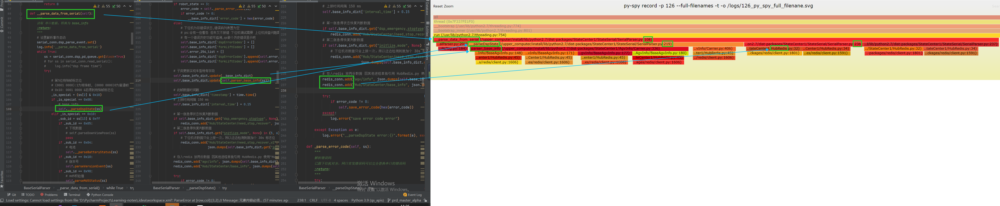

###### datetime:2023-04-25 10:46:00

###### author:nzb

## py-spy

> [GitHub](https://github.com/benfred/py-spy)

### 安装

`pip install py-spy`


### 参数

- `record`：将堆栈跟踪信息记录到火焰图、速度范围或原始文件中
- `top`：可以展示哪些函数被调用执行的次数最多（显示消耗CPU最多的函数）
- `dump`：将目标程序的堆栈跟踪转储到stdout

### record

- 命令：`py-spy record`
- 参数
    - `-p, --pid <pid>`：指定进程(线程)PID
    - `--full-filenames`：显示文件全名（包括路径）
    - `-o, --output <filename>`：输出文件
    - `-f, --format <format>`：输出文件的格式[默认: flamegraph] [其他选项: flamegraph, raw, speedscope]
    - `-d, --duration <duration>`：采样的秒数 [默认: 无限制]
    - `-r, --rate <rate>`：要采样的秒数每秒要采集的样本数 [默认: 100]
    - `-s, --subprocesses`：配置原始流程的子流程
    - `-F, --function`：按函数的第一个行号而不是当前行号聚合样本
    - `--nolineno`：不显示行号
    - `-t, --threads`：在输出中显示线程ID
    - `-g, --gil`：仅包括保留在GIL上的跟踪
    - `-i, --idle`：包括空闲线程的堆栈跟踪
    - `--nonblocking`：收集样本时不要暂停python进程。设置此选项将减少采样对性能的影响，但可能导致不准确的结果

- 示例




### top

- 命令：`py-spy top`
- 参数
    - `-p, --pid <pid>`：指定进程(线程)PID
    - `-r, --rate <rate>`：要采样的秒数每秒要采集的样本数 [默认: 100]
    - `-s, --subprocesses`：配置原始流程的子流程
    - `--full-filenames`：显示文件全名（包括路径）
    - `-g, --gil`：仅包括保留在GIL上的跟踪
    - `-i, --idle`：包括空闲线程的堆栈跟踪
    - `--nonblocking`：收集样本时不要暂停python进程。设置此选项将减少采样对性能的影响，但可能导致不准确的结果

```text
Collecting samples from 'python /upper_computer/upper_main/upper_computer_ros/script/ros_center/RosCenter_zmq.py' (python v2.7.17)
Total Samples 5183
GIL: 22.00%, Active: 2600.00%, Threads: 28

  %Own   %Total  OwnTime  TotalTime  Function (filename:line)                                                                                                                                  
1477.00% 1477.00%   766.3s    766.3s   recv_buff (rospy/impl/tcpros_base.py:104)
200.00% 200.00%   103.7s    103.7s   __clear (script/ros_center/LogUtil.py:66)
200.00% 200.00%   103.7s    103.7s   _eintr_retry (SocketServer.py:150)
100.00% 100.00%   51.83s    51.83s   compress_slam_map (script/ros_center/RosCenter_zmq.py:439)
100.00% 100.00%   51.83s    51.83s   recv_string (zmq/sugar/socket.py:592)
100.00% 100.00%   51.83s    51.83s   compress_slam_landmark (script/ros_center/RosCenter_zmq.py:376)
100.00% 100.00%   51.83s    51.83s   accept (socket.py:206)
100.00% 100.00%   51.83s    51.83s   wallsleep (rospy/rostime.py:277)
100.00% 100.00%   51.83s    51.83s   print_self_dict (script/ros_center/RosCenter_zmq.py:203)
 99.00%  99.00%   51.53s    51.53s   run (gevent/hub.py:639)
  5.00%   5.00%    2.06s     2.06s   iterencode (json/encoder.py:270)
  1.00%   1.00%    1.67s     1.91s   deserialize (sensor_msgs/msg/_PointCloud.py:194)
  3.00%   6.00%    1.08s     1.78s   deserialize (sensor_msgs/msg/_PointCloud.py:190)
  2.00%   2.00%   0.730s    0.730s   meth (socket.py:228)
  0.00% 1488.00%   0.410s    772.4s   receive_loop (rospy/impl/tcpros_base.py:797)
  2.00%   2.00%   0.370s    0.370s   deserialize (sensor_msgs/msg/_PointCloud.py:195)
  0.00%   0.00%   0.300s    0.300s   encode (json/encoder.py:210)
  0.00%   0.00%   0.260s    0.260s   send (zmq/sugar/socket.py:400)
  0.00%   0.00%   0.250s    0.250s   _retryable_call (redis/_compat.py:53)

Press Control-C to quit, or ? for help.
```
- 说明
  - ％Own（当前在该函数中花费的时间的百分比）
  - ％Total（函数及其子级中当前的时间百分比）
  - OwnTime（函数中花费的总时间）
  — TotalTime（该函数及其子项花费的总时间）


### dump

- 命令：`py-spy dump`
- 参数
    - `-p, --pid <pid>`：指定进程(线程)PID
    - `-s, --subprocesses`：配置原始流程的子流程
    - `--nonblocking`：收集样本时不要暂停python进程。设置此选项将减少采样对性能的影响，但可能导致不准确的结果
    - `--full-filenames`：显示文件全名（包括路径）
    - `-l, --locals`：显示每个帧的局部变量。多次传递（-ll）会增加冗长程度
    - `-j, --json`：JSON格式化输出              Format output as JSON

- 说明
  - Arguments：函数运行参数
  - Locals：局部变量

```text
Process 149: python /upper_computer/upper_main/upper_computer_ros/script/ros_center/RosCenter_zmq.py
Python v2.7.17 (/usr/bin/python2.7)

Thread 0x7F8F028BD0 (active)
    wallsleep (/opt/ros/melodic/lib/python2.7/dist-packages/rospy/rostime.py:277)
        Arguments:
            duration: 0.5
    spin (/opt/ros/melodic/lib/python2.7/dist-packages/rospy/client.py:129)
    <module> (/upper_computer/upper_main/upper_computer_ros/script/ros_center/RosCenter_zmq.py:92)
Thread 0x7F8D9171F0 (active)
    __clear (/upper_computer/upper_main/upper_computer_ros/script/ros_center/LogUtil.py:66)
        Arguments:
            self: <SaveLog at 0x7f8d925490>
        Locals:
            file_list: ["/logs/ros_log/ros_2023-05-09_11_34_05", "/logs/ros_log/ros_2023-05-09_01_01_36", ...]
            file_: "/logs/ros_log/ros_obstacles_timeout_2023-05-08_18_49_03"
    run (/usr/lib/python2.7/threading.py:754)
        Arguments:
            self: <Thread at 0x7f8d925690>
    __bootstrap_inner (/usr/lib/python2.7/threading.py:801)
        Arguments:
            self: <Thread at 0x7f8d925690>
    __bootstrap (/usr/lib/python2.7/threading.py:774)
        Arguments:
            self: <Thread at 0x7f8d925690>
Thread 0x7F8D1161F0 (active)
    __clear (/upper_computer/upper_main/upper_computer_ros/script/ros_center/LogUtil.py:66)
        Arguments:
            self: <SaveLog at 0x7f8d925950>
        Locals:
            file_list: ["/logs/ros_log/ros_obstacles_timeout_2023-05-08_18_49_03"]
    run (/usr/lib/python2.7/threading.py:754)
        Arguments:
            self: <Thread at 0x7f8d925a50>
    __bootstrap_inner (/usr/lib/python2.7/threading.py:801)
        Arguments:
            self: <Thread at 0x7f8d925a50>
    __bootstrap (/usr/lib/python2.7/threading.py:774)
        Arguments:
            self: <Thread at 0x7f8d925a50>
Thread 0x7F87FFF1F0 (active)
    _eintr_retry (/usr/lib/python2.7/SocketServer.py:150)
        Arguments:
            func: <builtin_function_or_method at 0x7f8df87dc0>
        Locals:
            args: ([<instance at 0x7f8c83e4b0>], [], [], 0.5)
    serve_forever (/usr/lib/python2.7/SocketServer.py:231)
        Arguments:
            self: <instance at 0x7f8c83e4b0>
            poll_interval: 0.5
        Locals:
            r: []
            w: []
            e: []
    _run (/opt/ros/melodic/lib/python2.7/dist-packages/rosgraph/xmlrpc.py:297)
        Arguments:
            self: <XmlRpcNode at 0x7f8c839ed0>
    run (/opt/ros/melodic/lib/python2.7/dist-packages/rosgraph/xmlrpc.py:225)
        Arguments:
            self: <XmlRpcNode at 0x7f8c839ed0>
Thread 0x7F877FE1F0 (idle)
    wait (/usr/lib/python2.7/threading.py:359)
        Arguments:
            self: <_Condition at 0x7f8c8392d0>
            timeout: 0.5
        Locals:
            waiter: <thread.lock at 0x7f8c7f55f0>
            saved_state: (1, 547734151664)
            endtime: 1683613820.420009
            delay: 0.05
            gotit: False
            remaining: 0.33446288108825684
    run (/opt/ros/melodic/lib/python2.7/dist-packages/rospy/impl/registration.py:298)
        Arguments:
            self: <RegManager at 0x7f8c829dd0>
        Locals:
            cond: <_Condition at 0x7f8c8392d0>
            topic: None
            uris: None
            x: ("/error_msg", ["http://192.168.111.111:43381/", "http://192.168.111.111:41241/", "http://192.168.111.111:37035/", ...])
            uri: "http://192.168.111.111:33045/"
            t: <Thread at 0x7f8c8391d0>
    start (/opt/ros/melodic/lib/python2.7/dist-packages/rospy/impl/registration.py:276)
        Arguments:
            self: <RegManager at 0x7f8c829dd0>
            uri: "http://192.168.111.111:44309/"
            master_uri: "http://192.168.111.111:11311"
        Locals:
            first: True
            tm: <_TopicManager at 0x7f8dba7b90>
            sm: <ServiceManager at 0x7f8dbea150>
            ns: "/"
            caller_id: "/UpperComputerRosCenter"
            registered: True
            master: <instance at 0x7f8c84c4b0>
            pub: []
            sub: []
            srv: []
    run (/usr/lib/python2.7/threading.py:754)
        Arguments:
            self: <Thread at 0x7f8c854390>
    __bootstrap_inner (/usr/lib/python2.7/threading.py:801)
        Arguments:
            self: <Thread at 0x7f8c854390>
    __bootstrap (/usr/lib/python2.7/threading.py:774)
        Arguments:
            self: <Thread at 0x7f8c854390>
Thread 0x7F86FFD1F0 (active)
    accept (/usr/lib/python2.7/socket.py:206)
        Arguments:
            self: <_socketobject at 0x7f8c844c20>
    run (/opt/ros/melodic/lib/python2.7/dist-packages/rospy/impl/tcpros_base.py:154)
        Arguments:
            self: <TCPServer at 0x7f8c854650>
        Locals:
            client_sock: <_socketobject at 0x7f8c7fe750>
            client_addr: ("192.168.111.111", 52982)
    run (/usr/lib/python2.7/threading.py:754)
        Arguments:
            self: <Thread at 0x7f8c854990>
    __bootstrap_inner (/usr/lib/python2.7/threading.py:801)
        Arguments:
            self: <Thread at 0x7f8c854990>
    __bootstrap (/usr/lib/python2.7/threading.py:774)
        Arguments:
            self: <Thread at 0x7f8c854990>
Thread 0x7F84FF91F0 (active)
    _eintr_retry (/usr/lib/python2.7/SocketServer.py:150)
        Arguments:
            func: <builtin_function_or_method at 0x7f8df87dc0>
        Locals:
            args: ([<instance at 0x7f8c7f65f0>], [], [], 0.5)
    serve_forever (/usr/lib/python2.7/SocketServer.py:231)
        Arguments:
            self: <instance at 0x7f8c7f65f0>
            poll_interval: 0.5
        Locals:
            r: []
            w: []
            e: []
    __init_xmlrpc_server (/upper_computer/upper_main/upper_computer_ros/script/ros_center/RosCenter_zmq.py:90)
        Arguments:
            self: <RpcRosService at 0x7f8c7f4290>
    run (/usr/lib/python2.7/threading.py:754)
        Arguments:
            self: <Thread at 0x7f8c7f42d0>
    __bootstrap_inner (/usr/lib/python2.7/threading.py:801)
        Arguments:
            self: <Thread at 0x7f8c7f42d0>
    __bootstrap (/usr/lib/python2.7/threading.py:774)
        Arguments:
            self: <Thread at 0x7f8c7f42d0>
Thread 0x7F527FC1F0 (active)
    run (/usr/local/lib/python2.7/dist-packages/gevent/hub.py:639)
        Arguments:
            self: <Hub at 0x7f8c845470>
        Locals:
            loop: <gevent.libev.corecext.loop at 0x7f8c8b8c80>
Thread 0x7F50FF91F0 (active)
    recv_string (/usr/local/lib/python2.7/dist-packages/zmq/sugar/socket.py:592)
        Arguments:
            self: <Socket at 0x7f8c7fe0c0>
            flags: 0
            encoding: "utf-8"
    __init_topic_zmq_response (/upper_computer/upper_main/upper_computer_ros/script/ros_center/RosCenter_zmq.py:294)
        Arguments:
            self: <RosCenter at 0x7f8c854b10>
        Locals:
            resp_context: <Context at 0x7f8c7fd230>
            resp_socket: <Socket at 0x7f8c7fe0c0>
    run (/usr/lib/python2.7/threading.py:754)
        Arguments:
            self: <Thread at 0x7f8c7f47d0>
    __bootstrap_inner (/usr/lib/python2.7/threading.py:801)
        Arguments:
            self: <Thread at 0x7f8c7f47d0>
    __bootstrap (/usr/lib/python2.7/threading.py:774)
        Arguments:
            self: <Thread at 0x7f8c7f47d0>
Thread 0x7F42FFD1F0 (active)
    print_self_dict (/upper_computer/upper_main/upper_computer_ros/script/ros_center/RosCenter_zmq.py:203)
        Arguments:
            self: <RosCenter at 0x7f8c854b10>
    run (/usr/lib/python2.7/threading.py:754)
        Arguments:
            self: <Thread at 0x7f8c7f4a50>
    __bootstrap_inner (/usr/lib/python2.7/threading.py:801)
        Arguments:
            self: <Thread at 0x7f8c7f4a50>
    __bootstrap (/usr/lib/python2.7/threading.py:774)
        Arguments:
            self: <Thread at 0x7f8c7f4a50>
Thread 0x7F1E7FC1F0 (active)
    compress_slam_landmark (/upper_computer/upper_main/upper_computer_ros/script/ros_center/RosCenter_zmq.py:376)
        Arguments:
            self: <RosCenter at 0x7f8c854b10>
        Locals:
            slam_mode: 1
            landmark_data: dict
    run (/usr/lib/python2.7/threading.py:754)
        Arguments:
            self: <Thread at 0x7f8c854dd0>
    __bootstrap_inner (/usr/lib/python2.7/threading.py:801)
        Arguments:
            self: <Thread at 0x7f8c854dd0>
    __bootstrap (/usr/lib/python2.7/threading.py:774)
        Arguments:
            self: <Thread at 0x7f8c854dd0>
Thread 0x7F07FFF1F0 (active)
    compress_slam_map (/upper_computer/upper_main/upper_computer_ros/script/ros_center/RosCenter_zmq.py:439)
        Arguments:
            self: <RosCenter at 0x7f8c854b10>
        Locals:
            has_compress_slam_map: True
            slam_mode: 1
            data: dict
            data2: dict
            sleep_time: 10
    run (/usr/lib/python2.7/threading.py:754)
        Arguments:
            self: <Thread at 0x7f8c7a1fd0>
    __bootstrap_inner (/usr/lib/python2.7/threading.py:801)
        Arguments:
            self: <Thread at 0x7f8c7a1fd0>
    __bootstrap (/usr/lib/python2.7/threading.py:774)
        Arguments:
            self: <Thread at 0x7f8c7a1fd0>
Thread 0x7F077FE1F0 (idle)
    wait (/usr/lib/python2.7/threading.py:340)
        Arguments:
            self: <_Condition at 0x7f8c7b7190>
            timeout: None
        Locals:
            waiter: <thread.lock at 0x7f8c7f5950>
            saved_state: None
    _run (/opt/ros/melodic/lib/python2.7/dist-packages/rospy/impl/tcpros_pubsub.py:429)
        Arguments:
            self: <QueuedConnection at 0x7f8c7b7150>
        Locals:
            queue: []
    run (/usr/lib/python2.7/threading.py:754)
        Arguments:
            self: <Thread at 0x7f8c7b7090>
    __bootstrap_inner (/usr/lib/python2.7/threading.py:801)
        Arguments:
            self: <Thread at 0x7f8c7b7090>
    __bootstrap (/usr/lib/python2.7/threading.py:774)
        Arguments:
            self: <Thread at 0x7f8c7b7090>
Thread 0x7F057FA1F0 (active)
    recv_buff (/opt/ros/melodic/lib/python2.7/dist-packages/rospy/impl/tcpros_base.py:104)
        Arguments:
            sock: <_socketobject at 0x7f8c7fe600>
            b: <cStringIO.StringO at 0x7f8c7a1530>
            buff_size: 65536
    receive_once (/opt/ros/melodic/lib/python2.7/dist-packages/rospy/impl/tcpros_base.py:737)
        Arguments:
            self: <TCPROSTransport at 0x7f8c7a1650>
        Locals:
            sock: <_socketobject at 0x7f8c7fe600>
            b: <cStringIO.StringO at 0x7f8c7a1530>
            msg_queue: []
            p: <TCPROSSub at 0x7f8c7a1590>
    receive_loop (/opt/ros/melodic/lib/python2.7/dist-packages/rospy/impl/tcpros_base.py:797)
        Arguments:
            self: <TCPROSTransport at 0x7f8c7a1650>
            msgs_callback: <instancemethod at 0x7f8c7a2be0>
        Locals:
            msgs: [<sensor_states at 0x7f8c7b76d0>]
    robust_connect_subscriber (/opt/ros/melodic/lib/python2.7/dist-packages/rospy/impl/tcpros_pubsub.py:185)
        Arguments:
            conn: <TCPROSTransport at 0x7f8c7a1650>
            dest_addr: "192.168.111.111"
            dest_port: 40779
            pub_uri: "http://192.168.111.111:33045/"
            receive_cb: <instancemethod at 0x7f8c7a2be0>
            resolved_topic_name: "/obstacle_detection_all_sensors/sensor_states"
        Locals:
            interval: 0.5
    run (/usr/lib/python2.7/threading.py:754)
        Arguments:
            self: <Thread at 0x7f8c7a14d0>
    __bootstrap_inner (/usr/lib/python2.7/threading.py:801)
        Arguments:
            self: <Thread at 0x7f8c7a14d0>
    __bootstrap (/usr/lib/python2.7/threading.py:774)
        Arguments:
            self: <Thread at 0x7f8c7a14d0>
Thread 0x7F1D7FA1F0 (active)
    recv_buff (/opt/ros/melodic/lib/python2.7/dist-packages/rospy/impl/tcpros_base.py:104)
        Arguments:
            sock: <_socketobject at 0x7f8c7fe1a0>
            b: <cStringIO.StringO at 0x7f8c807930>
            buff_size: 65536
    receive_once (/opt/ros/melodic/lib/python2.7/dist-packages/rospy/impl/tcpros_base.py:737)
        Arguments:
            self: <TCPROSTransport at 0x7f8c807910>
        Locals:
            sock: <_socketobject at 0x7f8c7fe1a0>
            b: <cStringIO.StringO at 0x7f8c807930>
            msg_queue: []
            p: <TCPROSSub at 0x7f8c854e50>
    receive_loop (/opt/ros/melodic/lib/python2.7/dist-packages/rospy/impl/tcpros_base.py:797)
        Arguments:
            self: <TCPROSTransport at 0x7f8c807910>
            msgs_callback: <instancemethod at 0x7f8c8025f0>
        Locals:
            msgs: [<PoseStampedWithConfidenceAndResetLocation at 0x7f8c783550>]
    robust_connect_subscriber (/opt/ros/melodic/lib/python2.7/dist-packages/rospy/impl/tcpros_pubsub.py:185)
        Arguments:
            conn: <TCPROSTransport at 0x7f8c807910>
            dest_addr: "192.168.111.111"
            dest_port: 46071
            pub_uri: "http://192.168.111.111:43381/"
            receive_cb: <instancemethod at 0x7f8c8025f0>
            resolved_topic_name: "/cur_pose"
        Locals:
            interval: 0.5
    run (/usr/lib/python2.7/threading.py:754)
        Arguments:
            self: <Thread at 0x7f8c807890>
    __bootstrap_inner (/usr/lib/python2.7/threading.py:801)
        Arguments:
            self: <Thread at 0x7f8c807890>
    __bootstrap (/usr/lib/python2.7/threading.py:774)
        Arguments:
            self: <Thread at 0x7f8c807890>
Thread 0x7F427FC1F0 (active)
    recv_buff (/opt/ros/melodic/lib/python2.7/dist-packages/rospy/impl/tcpros_base.py:104)
        Arguments:
            sock: <_socketobject at 0x7f8c7fe8a0>
            b: <cStringIO.StringO at 0x7f8c7ac3f0>
            buff_size: 1
    receive_once (/opt/ros/melodic/lib/python2.7/dist-packages/rospy/impl/tcpros_base.py:737)
        Arguments:
            self: <TCPROSTransport at 0x7f8c7ac290>
        Locals:
            sock: <_socketobject at 0x7f8c7fe8a0>
            b: <cStringIO.StringO at 0x7f8c7ac3f0>
            msg_queue: []
            p: <TCPROSSub at 0x7f8c854ed0>
    receive_loop (/opt/ros/melodic/lib/python2.7/dist-packages/rospy/impl/tcpros_base.py:797)
        Arguments:
            self: <TCPROSTransport at 0x7f8c7ac290>
            msgs_callback: <instancemethod at 0x7f8c7bf0f0>
        Locals:
            msgs: [<OccupancyGrid at 0x7f8c7a28c0>]
    robust_connect_subscriber (/opt/ros/melodic/lib/python2.7/dist-packages/rospy/impl/tcpros_pubsub.py:185)
        Arguments:
            conn: <TCPROSTransport at 0x7f8c7ac290>
            dest_addr: "192.168.111.111"
            dest_port: 36627
            pub_uri: "http://192.168.111.111:36281/"
            receive_cb: <instancemethod at 0x7f8c7bf0f0>
            resolved_topic_name: "/map"
        Locals:
            interval: 0.5
    run (/usr/lib/python2.7/threading.py:754)
        Arguments:
            self: <Thread at 0x7f8c7ac450>
    __bootstrap_inner (/usr/lib/python2.7/threading.py:801)
        Arguments:
            self: <Thread at 0x7f8c7ac450>
    __bootstrap (/usr/lib/python2.7/threading.py:774)
        Arguments:
            self: <Thread at 0x7f8c7ac450>
Thread 0x7F06FFD1F0 (active)
    recv_buff (/opt/ros/melodic/lib/python2.7/dist-packages/rospy/impl/tcpros_base.py:104)
        Arguments:
            sock: <_socketobject at 0x7f8c7fe4b0>
            b: <cStringIO.StringO at 0x7f8c813ef0>
            buff_size: 65536
    receive_once (/opt/ros/melodic/lib/python2.7/dist-packages/rospy/impl/tcpros_base.py:737)
        Arguments:
            self: <TCPROSTransport at 0x7f8c8135d0>
        Locals:
            sock: <_socketobject at 0x7f8c7fe4b0>
            b: <cStringIO.StringO at 0x7f8c813ef0>
            msg_queue: []
            p: <TCPROSSub at 0x7f8c813fd0>
    receive_loop (/opt/ros/melodic/lib/python2.7/dist-packages/rospy/impl/tcpros_base.py:797)
        Arguments:
            self: <TCPROSTransport at 0x7f8c8135d0>
            msgs_callback: <instancemethod at 0x7f8c79c730>
        Locals:
            msgs: [<Int32 at 0x7f8c854b90>]
    robust_connect_subscriber (/opt/ros/melodic/lib/python2.7/dist-packages/rospy/impl/tcpros_pubsub.py:185)
        Arguments:
            conn: <TCPROSTransport at 0x7f8c8135d0>
            dest_addr: "192.168.111.111"
            dest_port: 39983
            pub_uri: "http://192.168.111.111:37035/"
            receive_cb: <instancemethod at 0x7f8c79c730>
            resolved_topic_name: "/cold_start_status"
        Locals:
            interval: 0.5
    run (/usr/lib/python2.7/threading.py:754)
        Arguments:
            self: <Thread at 0x7f8c7ac590>
    __bootstrap_inner (/usr/lib/python2.7/threading.py:801)
        Arguments:
            self: <Thread at 0x7f8c7ac590>
    __bootstrap (/usr/lib/python2.7/threading.py:774)
        Arguments:
            self: <Thread at 0x7f8c7ac590>
Thread 0x7F1F7FE1F0 (active)
    recv_buff (/opt/ros/melodic/lib/python2.7/dist-packages/rospy/impl/tcpros_base.py:104)
        Arguments:
            sock: <_socketobject at 0x7f8c7fe9f0>
            b: <cStringIO.StringO at 0x7f8c854bf0>
            buff_size: 65536
    receive_once (/opt/ros/melodic/lib/python2.7/dist-packages/rospy/impl/tcpros_base.py:737)
        Arguments:
            self: <TCPROSTransport at 0x7f8c854c90>
        Locals:
            sock: <_socketobject at 0x7f8c7fe9f0>
            b: <cStringIO.StringO at 0x7f8c854bf0>
            msg_queue: []
            p: <TCPROSSub at 0x7f8c854d10>
    receive_loop (/opt/ros/melodic/lib/python2.7/dist-packages/rospy/impl/tcpros_base.py:797)
        Arguments:
            self: <TCPROSTransport at 0x7f8c854c90>
            msgs_callback: <instancemethod at 0x7f8c79c640>
        Locals:
            msgs: [<ErrorMsg at 0x7f8c769c90>]
    robust_connect_subscriber (/opt/ros/melodic/lib/python2.7/dist-packages/rospy/impl/tcpros_pubsub.py:185)
        Arguments:
            conn: <TCPROSTransport at 0x7f8c854c90>
            dest_addr: "192.168.111.111"
            dest_port: 39983
            pub_uri: "http://192.168.111.111:37035/"
            receive_cb: <instancemethod at 0x7f8c79c640>
            resolved_topic_name: "/error_msg"
        Locals:
            interval: 0.5
    run (/usr/lib/python2.7/threading.py:754)
        Arguments:
            self: <Thread at 0x7f8c854b50>
    __bootstrap_inner (/usr/lib/python2.7/threading.py:801)
        Arguments:
            self: <Thread at 0x7f8c854b50>
    __bootstrap (/usr/lib/python2.7/threading.py:774)
        Arguments:
            self: <Thread at 0x7f8c854b50>
Thread 0x7F1CFF91F0 (active)
    recv_buff (/opt/ros/melodic/lib/python2.7/dist-packages/rospy/impl/tcpros_base.py:104)
        Arguments:
            sock: <_socketobject at 0x7f8c7feb40>
            b: <cStringIO.StringO at 0x7f8c7acb70>
            buff_size: 65536
    receive_once (/opt/ros/melodic/lib/python2.7/dist-packages/rospy/impl/tcpros_base.py:737)
        Arguments:
            self: <TCPROSTransport at 0x7f8c7acb10>
        Locals:
            sock: <_socketobject at 0x7f8c7feb40>
            b: <cStringIO.StringO at 0x7f8c7acb70>
            msg_queue: []
            p: <TCPROSSub at 0x7f8c813bd0>
    receive_loop (/opt/ros/melodic/lib/python2.7/dist-packages/rospy/impl/tcpros_base.py:797)
        Arguments:
            self: <TCPROSTransport at 0x7f8c7acb10>
            msgs_callback: <instancemethod at 0x7f8c7a2dc0>
    robust_connect_subscriber (/opt/ros/melodic/lib/python2.7/dist-packages/rospy/impl/tcpros_pubsub.py:185)
        Arguments:
            conn: <TCPROSTransport at 0x7f8c7acb10>
            dest_addr: "192.168.111.111"
            dest_port: 46071
            pub_uri: "http://192.168.111.111:43381/"
            receive_cb: <instancemethod at 0x7f8c7a2dc0>
            resolved_topic_name: "/error_msg"
        Locals:
            interval: 0.5
    run (/usr/lib/python2.7/threading.py:754)
        Arguments:
            self: <Thread at 0x7f8c7aca90>
    __bootstrap_inner (/usr/lib/python2.7/threading.py:801)
        Arguments:
            self: <Thread at 0x7f8c7aca90>
    __bootstrap (/usr/lib/python2.7/threading.py:774)
        Arguments:
            self: <Thread at 0x7f8c7aca90>
Thread 0x7F1EFFD1F0 (active+gil)
    can_read (/usr/local/lib/python2.7/dist-packages/redis/connection.py:229)
        Arguments:
            self: <SocketBuffer at 0x7f8d99fed0>
            timeout: 0
    can_read (/usr/local/lib/python2.7/dist-packages/redis/connection.py:321)
        Arguments:
            self: <PythonParser at 0x7f8d99fe90>
            timeout: 0
    can_read (/usr/local/lib/python2.7/dist-packages/redis/connection.py:734)
        Arguments:
            self: <Connection at 0x7f8d9e65d0>
            timeout: 0
        Locals:
            sock: <_socketobject at 0x7f8d9fdad0>
    get_connection (/usr/local/lib/python2.7/dist-packages/redis/connection.py:1198)
        Arguments:
            self: <ConnectionPool at 0x7f8d9d9a50>
            command_name: ?
        Locals:
            keys: ()
            options: dict
            connection: <Connection at 0x7f8d9e65d0>
    execute_command (/usr/local/lib/python2.7/dist-packages/redis/client.py:898)
        Arguments:
            self: <Redis at 0x7f8da09350>
        Locals:
            args: ?
            options: dict
            pool: <ConnectionPool at 0x7f8d9d9a50>
            command_name: ?
    set (/usr/local/lib/python2.7/dist-packages/redis/client.py:1801)
        Arguments:
            self: <Redis at 0x7f8da09350>
            name: "slam/scan"
            value: ?
            ex: None
            px: None
            nx: False
            xx: False
            keepttl: False
        Locals:
            pieces: ?
    set (/upper_computer/upper_main/upper_computer_ros/script/ros_center/RedisConn.py:40)
        Arguments:
            self: <QsHubRedis at 0x7f8da01c10>
            key: "slam/scan"
            value: ?
            timeout: 3
    slam_scan_data_callback (/upper_computer/upper_main/upper_computer_ros/script/ros_center/RosCenter_zmq.py:592)
        Arguments:
            self: <RosCenter at 0x7f8c854b10>
            msg: <PointCloud at 0x7f8c7bf5f0>
    _invoke_callback (/opt/ros/melodic/lib/python2.7/dist-packages/rospy/topics.py:750)
        Arguments:
            self: <_SubscriberImpl at 0x7f8c807090>
            msg: <PointCloud at 0x7f8c7bf5f0>
            cb: <instancemethod at 0x7f8c802280>
            cb_args: None
    receive_callback (/opt/ros/melodic/lib/python2.7/dist-packages/rospy/topics.py:769)
        Arguments:
            self: <_SubscriberImpl at 0x7f8c807090>
            msgs: [<PointCloud at 0x7f8c7bf5f0>]
            connection: <TCPROSTransport at 0x7f8c807dd0>
        Locals:
            callbacks: [(<instancemethod at 0x7f8c802280>, None)]
            msg: <PointCloud at 0x7f8c7bf5f0>
            cb: <instancemethod at 0x7f8c802280>
            cb_args: None
    receive_loop (/opt/ros/melodic/lib/python2.7/dist-packages/rospy/impl/tcpros_base.py:799)
        Arguments:
            self: <TCPROSTransport at 0x7f8c807dd0>
            msgs_callback: <instancemethod at 0x7f8c80ef50>
        Locals:
            msgs: [<PointCloud at 0x7f8c7bf5f0>]
    robust_connect_subscriber (/opt/ros/melodic/lib/python2.7/dist-packages/rospy/impl/tcpros_pubsub.py:185)
        Arguments:
            conn: <TCPROSTransport at 0x7f8c807dd0>
            dest_addr: "192.168.111.111"
            dest_port: 37155
            pub_uri: "http://192.168.111.111:41241/"
            receive_cb: <instancemethod at 0x7f8c80ef50>
            resolved_topic_name: "/scan_matched_points2"
        Locals:
            interval: 0.5
    run (/usr/lib/python2.7/threading.py:754)
        Arguments:
            self: <Thread at 0x7f8c807ad0>
    __bootstrap_inner (/usr/lib/python2.7/threading.py:801)
        Arguments:
            self: <Thread at 0x7f8c807ad0>
    __bootstrap (/usr/lib/python2.7/threading.py:774)
        Arguments:
            self: <Thread at 0x7f8c807ad0>
Thread 0x7F41FFB1F0 (active)
    recv_buff (/opt/ros/melodic/lib/python2.7/dist-packages/rospy/impl/tcpros_base.py:104)
        Arguments:
            sock: <_socketobject at 0x7f8c7fed00>
            b: <cStringIO.StringO at 0x7f8c807cf0>
            buff_size: 65536
    receive_once (/opt/ros/melodic/lib/python2.7/dist-packages/rospy/impl/tcpros_base.py:737)
        Arguments:
            self: <TCPROSTransport at 0x7f8c807a90>
        Locals:
            sock: <_socketobject at 0x7f8c7fed00>
            b: <cStringIO.StringO at 0x7f8c807cf0>
            msg_queue: []
            p: <TCPROSSub at 0x7f8c7acad0>
    receive_loop (/opt/ros/melodic/lib/python2.7/dist-packages/rospy/impl/tcpros_base.py:797)
        Arguments:
            self: <TCPROSTransport at 0x7f8c807a90>
            msgs_callback: <instancemethod at 0x7f8c7aa190>
        Locals:
            msgs: [<ErrorMsg at 0x7f8c769980>]
    robust_connect_subscriber (/opt/ros/melodic/lib/python2.7/dist-packages/rospy/impl/tcpros_pubsub.py:185)
        Arguments:
            conn: <TCPROSTransport at 0x7f8c807a90>
            dest_addr: "192.168.111.111"
            dest_port: 37155
            pub_uri: "http://192.168.111.111:41241/"
            receive_cb: <instancemethod at 0x7f8c7aa190>
            resolved_topic_name: "/error_msg"
        Locals:
            interval: 0.5
    run (/usr/lib/python2.7/threading.py:754)
        Arguments:
            self: <Thread at 0x7f8c7a1f90>
    __bootstrap_inner (/usr/lib/python2.7/threading.py:801)
        Arguments:
            self: <Thread at 0x7f8c7a1f90>
    __bootstrap (/usr/lib/python2.7/threading.py:774)
        Arguments:
            self: <Thread at 0x7f8c7a1f90>
Thread 0x7F1DFFB1F0 (active)
    recv_buff (/opt/ros/melodic/lib/python2.7/dist-packages/rospy/impl/tcpros_base.py:104)
        Arguments:
            sock: <_socketobject at 0x7f8c7fede0>
            b: <cStringIO.StringO at 0x7f8c7a19b0>
            buff_size: 65536
    receive_once (/opt/ros/melodic/lib/python2.7/dist-packages/rospy/impl/tcpros_base.py:737)
        Arguments:
            self: <TCPROSTransport at 0x7f8c7a1d10>
        Locals:
            sock: <_socketobject at 0x7f8c7fede0>
            b: <cStringIO.StringO at 0x7f8c7a19b0>
            msg_queue: []
            p: <TCPROSSub at 0x7f8c7accd0>
    receive_loop (/opt/ros/melodic/lib/python2.7/dist-packages/rospy/impl/tcpros_base.py:797)
        Arguments:
            self: <TCPROSTransport at 0x7f8c7a1d10>
            msgs_callback: <instancemethod at 0x7f8c7bf9b0>
    robust_connect_subscriber (/opt/ros/melodic/lib/python2.7/dist-packages/rospy/impl/tcpros_pubsub.py:185)
        Arguments:
            conn: <TCPROSTransport at 0x7f8c7a1d10>
            dest_addr: "192.168.111.111"
            dest_port: 46071
            pub_uri: "http://192.168.111.111:43381/"
            receive_cb: <instancemethod at 0x7f8c7bf9b0>
            resolved_topic_name: "/robot_mode"
        Locals:
            interval: 0.5
    run (/usr/lib/python2.7/threading.py:754)
        Arguments:
            self: <Thread at 0x7f8c7a1ed0>
    __bootstrap_inner (/usr/lib/python2.7/threading.py:801)
        Arguments:
            self: <Thread at 0x7f8c7a1ed0>
    __bootstrap (/usr/lib/python2.7/threading.py:774)
        Arguments:
            self: <Thread at 0x7f8c7a1ed0>
Thread 0x7F067FC1F0 (active)
    recv_buff (/opt/ros/melodic/lib/python2.7/dist-packages/rospy/impl/tcpros_base.py:104)
        Arguments:
            sock: <_socketobject at 0x7f8c7fefa0>
            b: <cStringIO.StringO at 0x7f8c7accf0>
            buff_size: 65536
    receive_once (/opt/ros/melodic/lib/python2.7/dist-packages/rospy/impl/tcpros_base.py:737)
        Arguments:
            self: <TCPROSTransport at 0x7f8c7acf50>
        Locals:
            sock: <_socketobject at 0x7f8c7fefa0>
            b: <cStringIO.StringO at 0x7f8c7accf0>
            msg_queue: []
            p: <TCPROSSub at 0x7f8c7ac790>
    receive_loop (/opt/ros/melodic/lib/python2.7/dist-packages/rospy/impl/tcpros_base.py:797)
        Arguments:
            self: <TCPROSTransport at 0x7f8c7acf50>
            msgs_callback: <instancemethod at 0x7f8c7bf960>
        Locals:
            msgs: [<Int32 at 0x7f8c7b7950>]
    robust_connect_subscriber (/opt/ros/melodic/lib/python2.7/dist-packages/rospy/impl/tcpros_pubsub.py:185)
        Arguments:
            conn: <TCPROSTransport at 0x7f8c7acf50>
            dest_addr: "192.168.111.111"
            dest_port: 37155
            pub_uri: "http://192.168.111.111:41241/"
            receive_cb: <instancemethod at 0x7f8c7bf960>
            resolved_topic_name: "/robot_mode"
        Locals:
            interval: 0.5
    run (/usr/lib/python2.7/threading.py:754)
        Arguments:
            self: <Thread at 0x7f8c7b7b90>
    __bootstrap_inner (/usr/lib/python2.7/threading.py:801)
        Arguments:
            self: <Thread at 0x7f8c7b7b90>
    __bootstrap (/usr/lib/python2.7/threading.py:774)
        Arguments:
            self: <Thread at 0x7f8c7b7b90>
Thread 0x7F1FFFF1F0 (active)
    recv_buff (/opt/ros/melodic/lib/python2.7/dist-packages/rospy/impl/tcpros_base.py:104)
        Arguments:
            sock: <_socketobject at 0x7f8c7feec0>
            b: <cStringIO.StringO at 0x7f8c7b7370>
            buff_size: 65536
    receive_once (/opt/ros/melodic/lib/python2.7/dist-packages/rospy/impl/tcpros_base.py:737)
        Arguments:
            self: <TCPROSTransport at 0x7f8c7b7b10>
        Locals:
            sock: <_socketobject at 0x7f8c7feec0>
            b: <cStringIO.StringO at 0x7f8c7b7370>
            msg_queue: []
            p: <TCPROSSub at 0x7f8c7b7a90>
    receive_loop (/opt/ros/melodic/lib/python2.7/dist-packages/rospy/impl/tcpros_base.py:797)
        Arguments:
            self: <TCPROSTransport at 0x7f8c7b7b10>
            msgs_callback: <instancemethod at 0x7f8c7aafa0>
        Locals:
            msgs: [<PointCloud at 0x7f8c7aa4b0>]
    robust_connect_subscriber (/opt/ros/melodic/lib/python2.7/dist-packages/rospy/impl/tcpros_pubsub.py:185)
        Arguments:
            conn: <TCPROSTransport at 0x7f8c7b7b10>
            dest_addr: "192.168.111.111"
            dest_port: 37155
            pub_uri: "http://192.168.111.111:41241/"
            receive_cb: <instancemethod at 0x7f8c7aafa0>
            resolved_topic_name: "/map_cloud"
        Locals:
            interval: 0.5
    run (/usr/lib/python2.7/threading.py:754)
        Arguments:
            self: <Thread at 0x7f8c7b7510>
    __bootstrap_inner (/usr/lib/python2.7/threading.py:801)
        Arguments:
            self: <Thread at 0x7f8c7b7510>
    __bootstrap (/usr/lib/python2.7/threading.py:774)
        Arguments:
            self: <Thread at 0x7f8c7b7510>
Thread 0x7EE3FFF1F0 (active)
    recv_buff (/opt/ros/melodic/lib/python2.7/dist-packages/rospy/impl/tcpros_base.py:104)
        Arguments:
            sock: <_socketobject at 0x7f8c7693d0>
            b: <cStringIO.StringO at 0x7f8c76a9b0>
            buff_size: 65536
    receive_once (/opt/ros/melodic/lib/python2.7/dist-packages/rospy/impl/tcpros_base.py:737)
        Arguments:
            self: <TCPROSTransport at 0x7f8c76af10>
        Locals:
            sock: <_socketobject at 0x7f8c7693d0>
            b: <cStringIO.StringO at 0x7f8c76a9b0>
            msg_queue: []
            p: <TCPROSSub at 0x7f8c76ac50>
    receive_loop (/opt/ros/melodic/lib/python2.7/dist-packages/rospy/impl/tcpros_base.py:797)
        Arguments:
            self: <TCPROSTransport at 0x7f8c76af10>
            msgs_callback: <instancemethod at 0x7f8c79cd20>
    robust_connect_subscriber (/opt/ros/melodic/lib/python2.7/dist-packages/rospy/impl/tcpros_pubsub.py:185)
        Arguments:
            conn: <TCPROSTransport at 0x7f8c76af10>
            dest_addr: "192.168.111.111"
            dest_port: 40779
            pub_uri: "http://192.168.111.111:33045/"
            receive_cb: <instancemethod at 0x7f8c79cd20>
            resolved_topic_name: "/error_msg"
        Locals:
            interval: 0.5
    run (/usr/lib/python2.7/threading.py:754)
        Arguments:
            self: <Thread at 0x7f8c76ab10>
    __bootstrap_inner (/usr/lib/python2.7/threading.py:801)
        Arguments:
            self: <Thread at 0x7f8c76ab10>
    __bootstrap (/usr/lib/python2.7/threading.py:774)
        Arguments:
            self: <Thread at 0x7f8c76ab10>
Thread 0x7EE37FE1F0 (active)
    recv_buff (/opt/ros/melodic/lib/python2.7/dist-packages/rospy/impl/tcpros_base.py:104)
        Arguments:
            sock: <_socketobject at 0x7f8c769520>
            b: <cStringIO.StringO at 0x7f8c76aa30>
            buff_size: 65536
    receive_once (/opt/ros/melodic/lib/python2.7/dist-packages/rospy/impl/tcpros_base.py:737)
        Arguments:
            self: <TCPROSTransport at 0x7f8c76af50>
        Locals:
            sock: <_socketobject at 0x7f8c769520>
            b: <cStringIO.StringO at 0x7f8c76aa30>
            msg_queue: []
            p: <TCPROSSub at 0x7f8c76ae50>
    receive_loop (/opt/ros/melodic/lib/python2.7/dist-packages/rospy/impl/tcpros_base.py:797)
        Arguments:
            self: <TCPROSTransport at 0x7f8c76af50>
            msgs_callback: <instancemethod at 0x7f8c812320>
        Locals:
            msgs: [<barrier_result at 0x7f8c847ad0>]
    robust_connect_subscriber (/opt/ros/melodic/lib/python2.7/dist-packages/rospy/impl/tcpros_pubsub.py:185)
        Arguments:
            conn: <TCPROSTransport at 0x7f8c76af50>
            dest_addr: "192.168.111.111"
            dest_port: 40779
            pub_uri: "http://192.168.111.111:33045/"
            receive_cb: <instancemethod at 0x7f8c812320>
            resolved_topic_name: "/new_obstacles"
        Locals:
            interval: 0.5
    run (/usr/lib/python2.7/threading.py:754)
        Arguments:
            self: <Thread at 0x7f8c76aad0>
    __bootstrap_inner (/usr/lib/python2.7/threading.py:801)
        Arguments:
            self: <Thread at 0x7f8c76aad0>
    __bootstrap (/usr/lib/python2.7/threading.py:774)
        Arguments:
            self: <Thread at 0x7f8c76aad0>
Thread 0x7F867FC1F0 (active)
    recv_buff (/opt/ros/melodic/lib/python2.7/dist-packages/rospy/impl/tcpros_base.py:104)
        Arguments:
            sock: <_socketobject at 0x7f8c769210>
            b: <cStringIO.StringO at 0x7f8c8137b0>
            buff_size: 65536
    receive_once (/opt/ros/melodic/lib/python2.7/dist-packages/rospy/impl/tcpros_base.py:737)
        Arguments:
            self: <TCPROSTransport at 0x7f8c813b10>
        Locals:
            sock: <_socketobject at 0x7f8c769210>
            b: <cStringIO.StringO at 0x7f8c8137b0>
            msg_queue: []
            p: <TCPROSSub at 0x7f8c813a50>
    receive_loop (/opt/ros/melodic/lib/python2.7/dist-packages/rospy/impl/tcpros_base.py:797)
        Arguments:
            self: <TCPROSTransport at 0x7f8c813b10>
            msgs_callback: <instancemethod at 0x7f8c812eb0>
    robust_connect_subscriber (/opt/ros/melodic/lib/python2.7/dist-packages/rospy/impl/tcpros_pubsub.py:185)
        Arguments:
            conn: <TCPROSTransport at 0x7f8c813b10>
            dest_addr: "192.168.111.111"
            dest_port: 33389
            pub_uri: "http://192.168.111.111:36401/"
            receive_cb: <instancemethod at 0x7f8c812eb0>
            resolved_topic_name: "/barcode"
        Locals:
            interval: 0.5
    run (/usr/lib/python2.7/threading.py:754)
        Arguments:
            self: <Thread at 0x7f8c813690>
    __bootstrap_inner (/usr/lib/python2.7/threading.py:801)
        Arguments:
            self: <Thread at 0x7f8c813690>
    __bootstrap (/usr/lib/python2.7/threading.py:774)
        Arguments:
            self: <Thread at 0x7f8c813690>
Thread 0x7F40FF91F0 (active)
    recv_buff (/opt/ros/melodic/lib/python2.7/dist-packages/rospy/impl/tcpros_base.py:104)
        Arguments:
            sock: <_socketobject at 0x7f8c769280>
            b: <cStringIO.StringO at 0x7f8c813330>
            buff_size: 65536
    receive_once (/opt/ros/melodic/lib/python2.7/dist-packages/rospy/impl/tcpros_base.py:737)
        Arguments:
            self: <TCPROSTransport at 0x7f8c813650>
        Locals:
            sock: <_socketobject at 0x7f8c769280>
            b: <cStringIO.StringO at 0x7f8c813330>
            msg_queue: []
            p: <TCPROSSub at 0x7f8c813590>
    receive_loop (/opt/ros/melodic/lib/python2.7/dist-packages/rospy/impl/tcpros_base.py:797)
        Arguments:
            self: <TCPROSTransport at 0x7f8c813650>
            msgs_callback: <instancemethod at 0x7f8c812910>
        Locals:
            msgs: [<Odometry at 0x7f8c7fdbf0>]
    robust_connect_subscriber (/opt/ros/melodic/lib/python2.7/dist-packages/rospy/impl/tcpros_pubsub.py:185)
        Arguments:
            conn: <TCPROSTransport at 0x7f8c813650>
            dest_addr: "192.168.111.111"
            dest_port: 41197
            pub_uri: "http://192.168.111.111:35359/"
            receive_cb: <instancemethod at 0x7f8c812910>
            resolved_topic_name: "/dsp_pos"
        Locals:
            interval: 0.5
    run (/usr/lib/python2.7/threading.py:754)
        Arguments:
            self: <Thread at 0x7f8c813610>
    __bootstrap_inner (/usr/lib/python2.7/threading.py:801)
        Arguments:
            self: <Thread at 0x7f8c813610>
    __bootstrap (/usr/lib/python2.7/threading.py:774)
        Arguments:
            self: <Thread at 0x7f8c813610>
```


