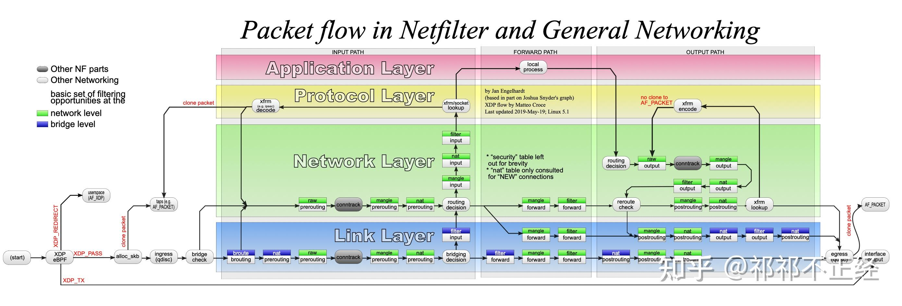
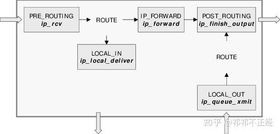
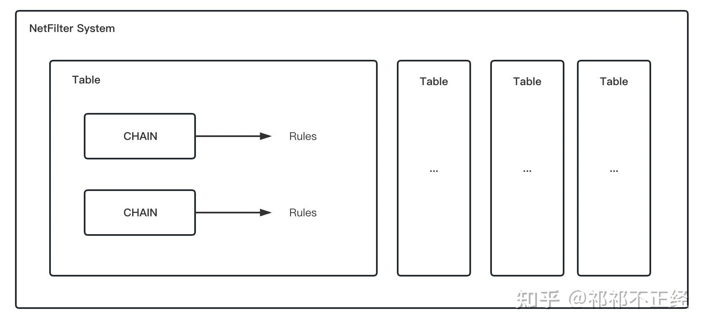
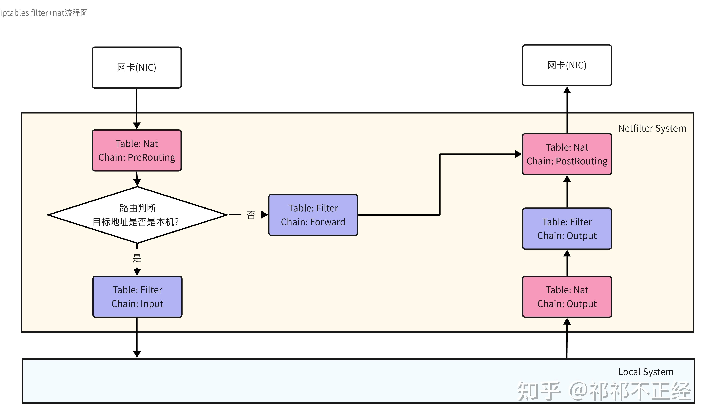
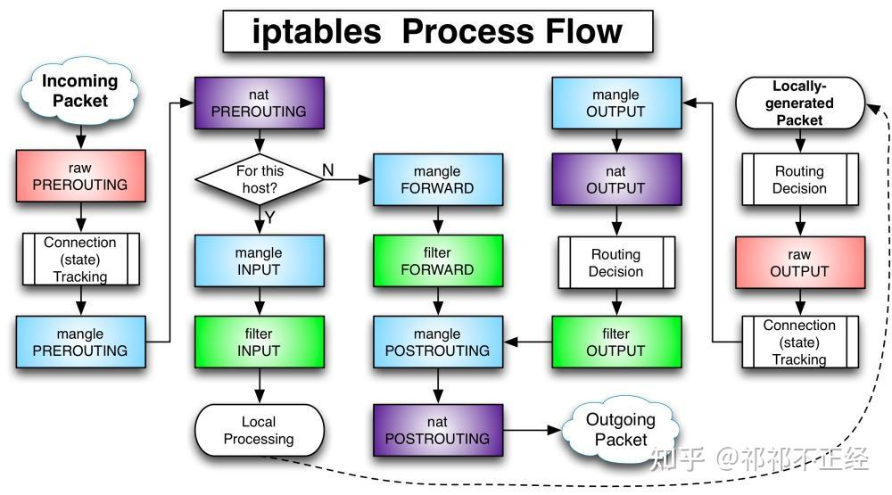

###### datetime:2024-04-23 16:49:00

###### author:nzb

[Software Defined Networking](https://tonydeng.github.io/sdn-handbook/)

## iptables



### 一、简介

`iptables`其实只是一个简称，其真正代表的是`netfilter/iptables`这个IP数据包过滤系统。为了简便，本文也将整套系统用iptables简称。
`iptables`是3.5版本的Linux内核集成的IP数据包过滤系统。当系统接入网络时，该系统有利于在Linux系统上更好地控制IP信息包和防火墙配置。此外，`iptables`还可以进行`NAT`规则的管理。
上面有提到`netfilter/iptables`这个组合，这个组合中：

- `netfilter`位于内核空间，是内核的一部分，由一些数据包过滤表组成，这些表包含内核用来控制数据包过滤处理的规则集；而`netfilter`又是由内核中若干`hook`组成的， 程序在执行到内核`hook`
  处时便会执行数据包过滤的相关逻辑。
- `iptables`位于用户空间，是一种工具。该工具可以很便捷地对`netfilter`所维护的表数据进行修改。从而可以很便捷地控制数据包的过滤规则。

### 二、相关概念

#### 2.1 包过滤防火墙

包过滤防火墙在网络层截取网络数据包的包头（`header`），针对数据包的包头，根据事先定义好的防火墙过滤规则进行对比，根据对比结果，再执行不同的动作。
包过滤防火墙一般工作在网络层，所以也称为“网络防火墙”，通过检查数据流中每一个数据包的源ip地址，目标ip地址，源端口，目标端口，协议类型（`tcp`,`udp`,`icmp`等），状态等信息来判断是否符合规则。

#### 2.2 NAT

`NAT（Network Address Translation）`
网络地址转换，常用于局域网主机想与互联网服务通信时做地址转换，因为公网IP有限，且局域网主机访问公网必须要使用公网IP才可以访问到，因此使用NAT方法对地址做转换是一个很高效的方法。
根据NAT使用场景不同可以将NAT分为`SNAT（Source Network Address Translation）`和`DNAT（Destination Network Address Translation）`。

- `SNAT`：用于局域网服务访问公网服务的场景。即将局域网发出的请求的原地址转换成NAT主机所拥有的公网IP地址，从而与公网服务进行通信；
- `DNAT`：用于公网请求访问局域网服务的场景。即将从公网接收到的请求的目的地址通过NAT规则所配置的局域网网段进行目标服务器局域网地址的转换，从而与局域网内服务通信。

举个例子，本地Web服务器A地址为`192.168.1.2`，NAT主机地址为`192.168.1.1`，公网地址为`1.1.1.1`；另一个局域网主机B地址为`172.16.1.2`，NAT主机地址为`172.16.1.1`
，公网地址为`1.1.1.2`。 此时B想要访问A的Web服务，B对应的NAT主机会将B发出的请求的源地址转换成其公网地址`1.1.1.2`从而与A对应的NAT主机进行通信，这里就是`SNAT`。
而A对应的NAT主机收到该请求后会将该请求的目的地址转换成Web服务器A在局域网内的地址，即`192.168.1.2`，从而与Web服务器A进行通信，这里就是`DNAT`。

#### 2.3 Netfilter Hooks

在上面的介绍中我们了解到，`Netfilter`其实是内核中若干个`Hook`点组成的。数据包经过内核协议栈处理程序时，处理程序会触发**内核模块注册在相关Hook点上的数据包处理函数**。 至于处理程序会触发哪个`Hook`
函数，取决于当前**数据包的方向（ingress/egress）、数据包的目的地址、数据包在上一个Hook点的状态**等等。内核中有关数据过滤的Hook点有如下几个：

- `NF_IP_PRE_ROUTING`：接收到的数据包进行协议栈后立即触发此`Hook`，在进行任何路由判断之前；
- `NF_IP_LOCAL_IN`：接收到的数据包经过了路由判断，如果目的地址是本机，将触发此`Hook`；
- `NF_IP_FORWARD`：接收到的数据包经过了路由判断，如果目的地址是其他机器，将触发此`Hook`；
- `NF_IP_LOCAL_OUT`：本机产生的准备发送的数据包，在进入协议栈之前立即执行该`Hook`；
- `NF_IP_POST_ROUTING`：本机产生的准备发送的或者转发的数据包，在经过路由判断之后，将执行该`Hook`；



> Netfilter Hook函数工作位置

内核处理模块在往这些`Hook`上注册处理函数时，**必须要提供优先级**，以便`Hook`触发时能按照**优先级高低**调用处理函数。 这就可以保证**多个内核模块（或者同一内核模块的多个实例）**可以在同一个`Hook`
点进行处理函数的注册，并且有确定的调用顺序。内核模块会被依次调用， 并且处理完成后返回一个结果给`netfilter`框架， 告诉某个数据包应该做什么操作。

#### 2.4 表（tables）、链（chains）、规则（rules）

`iptables`通过`表（tables）、链（chains）和规则（rules）`来管理数据包处理函数，结合对`netfilter`的了解可知，`iptables`会将这些数据包处理函数注册到内核提供的五个`Hook`
点上。三者相关定义如下：

- 表（`tables`）：表将处理同一类型的数据包规则聚合在一起。内核中内置有4张表，分别是`raw`、`mangle`、`nat`、`filter`。每一张表都只包含同一类型的数据包规则，比如`nat`表只包含与网络地址转换相关的规则。
- 链（`chains`）：每一张表包含若干链，其规定了相关规则在什么时候执行。内核中内置有5条链，分别对应`netfilter`提供的5个`Hook`点。链能够让管理员在数据包传输过程中的某一个点通过相关规则控制数据包的走向。
- 规则（`rules`）：`规则`存在于`链`中，每一条`链`包含若干`规则`。当`链`被调用时，数据包处理函数将按照顺序依次匹配对应链中的所有规则。每条规则都由**匹配部分+动作部分**
  组成，如果数据包满足匹配规则，则会执行相关动作对数据包进行处理。

总的来说，规则是最终对数据包进行处理的部分，而表和链则是提供规则在协议栈被触发的前后顺序。三者关系可以用下面的图来表示：



#### 2.5 规则优先级

通过上面几节的介绍，我们应该了解到：数据包在进入协议栈后，触发`Hook`点注册的相关处理函数实际上对应的是表、链、规则中的链。也就是说， 某一规则的触发优先级首先取决于**chain所在的位置**。其次通过包含了该`chain`
类型的`table`中所对应的实际的`chain`下的规则进行规则匹配和动作执行。在这段过程中，需要注意：

- `table`有优先级：由高到低排列为：**raw -> mangle -> nat -> filter；**
- 当有多个`table`包含同一类型的`chain`时，所有的`table`都会按照上面`table`优先级被遍历，执行`table`中实际的`chain`下的规则。

尝试了解一条规则被执行的条件和顺序，这对于后面理解`netfilter`在协议栈中处理数据包的全过程有很大的帮助，一通百通。

### 三、表

提到`iptables`，常常会提到**三表五链、四表五链**等的词汇。这些词汇中提到的“三表”，“四表”等其实指的就是Linux内核中内置的常见表。Linux内核内置的表其实有五个，分别为：

- raw
- mangle
- nat（最常用）
- filter（最常用）
- security

#### 3.1 Raw Table

`iptables`提供一个有状态的防火墙，基于`netfilter`上建立了连接跟踪的特性，即`connection tracking`，简称`conntrack`。`iptables`在处理数据包时都会依赖之前已经判断过的数据包。
例如一条NAT记录，在第一次处理过后就会被存储在`conntrack`的哈希表中，下次有相同的数据包，则复用处理结果。 `raw`表提供的功能很简单：提供且仅提供一个让数据包绕过连接跟踪的框架。

#### 3.2 Mangle Table

`mangle`表提供修改数据包`IP`头部的功能，例如，修改数据包的`TTL`等。此外，`mangle`表中的规则还可以对数据包打一个**仅在内核内有效的标记（mark）**，后续对于该数据包的处理可以用到这些标记。

#### 3.3 Nat Table

`nat`表顾名思义是用来做**网络地址转换**的。当数据包进入协议栈后，`nat`表中的相关规则将决定是否修改以及如何修改数据包的源/目标地址，从而改变数据包被路由的行为。 `nat`
表通常用于将数据包路由到外部网络无法直接访问到的局域网络中。

> 应用场景：
> - 企业路由或者网关主机做SNAT，实现共享上网（通过POSTROUTING链）
> - 做内部网络和外部网络的IP地址一对一映射，常用于dmz区域（通过PREROUTING链）
> - 硬件防火墙映射IP到内部服务器；
> - 可以做单个端口的映射，直接将外部的80相关端口映射到内部Web服务器非80端口上。

#### 3.4 Filter Table

`filter`表是`iptables`中最常用的表，用来**判断一个数据包是否可以通过**。在防火墙领域，`filter`表提供的功能通常被称为“过滤”包。这个表提供了防火墙的一些常见功能。
`Filter`表负责的主要是和主机自身相关的数据包处理手段，是真正负责主机防火墙功能的一张表。

> 应用场景：主机防火墙

#### 3.5 Security Table

`security`表的作用是**给数据包打上SELinux标记**。SELinux以及可以解读SELinux安全上下文的系统在处理由`security`表做了标记的数据包时，行为会相应做出改变。

### 四、链

内核中内置的链有且仅有5条。不难发现，这与前面提到的`NetFilter`提供的5个`Hook`点的数量是一致的。没错，内核中内置的5条链正是对应5个`Hook`点。即：

- `PREROUTING`: 由 `NF_IP_PRE_ROUTING` hook 触发；
- `INPUT`: 由 `NF_IP_LOCAL_IN` hook 触发；
- `FORWARD`: 由 `NF_IP_FORWARD` hook 触发；
- `OUTPUT`: 由 `NF_IP_LOCAL_OUT` hook 触发；
- `POSTROUTING`: 由 `NF_IP_POST_ROUTING` hook 触发。

前面也提到过，链是位于表中的，内核内置表与内置链之间的包含关系如下表所示：

| Tables | PREROUTING | INPUT | FORWARD | OUTPUT | POSTROUTING |
| ----- | :-----: | :-----: | :-----: | :-----: | :-----: |
| raw | ✅ |  |  | ✅ |  |
| mangle | ✅ | ✅ | ✅ | ✅ | ✅ |
| nat | ✅ |   |   | ✅ | ✅ |
| filter |  |  ✅ |  ✅ | ✅ |  |
| security |  |  ✅ |  ✅ | ✅ |  |

这里我们对最常用的两个表：`filter`和`nat`进行相关链的说明，来看看某条链在某个表中起到什么作用。

#### 4.1 Filter Table

`filter`表中有三条链：`input`、`forward`和`output`。

- `input`：用来过滤进入主机的数据包；
- `forward`：负责转发流经主机的数据包，起到转发的作用，和NAT关系很大。想要主机支持转发需要设置相关内核参数：

```shell
net.ipv4.ip_forward=1
```

- `output`：用来处理从主机发出去的数据包。

#### 4.2 Nat Table

`nat`表中有三条链：`prerouting`，`postrouting`和`output`。

- `prerouting`：在数据包到达`netfilter`系统时，在进行路由判断之前执行该链上的规则，作用是改变数据包的目的地址、目的端口等，起到`DNAT`的作用；
- `postrouting`：数据包发出时，当数据包经过了路由判断后执行该链上的规则，作用是改变数据包的源地址、源端口等，起到`SNAT`的作用；
- `output`：用来处理从主机发出去的数据包。

### 五、规则

规则是最终影响数据包的地方，一条有效的规则必须由匹配规则+动作目标组成：

- 匹配规则：提供了需要执行对应动作的目标匹配机制。通常可以匹配协议类型、目的地址、源地址、目的端口、源端口、目的网段、源网段、接收数据包的网卡、发送数据包的网卡、协议头、连接状态等。
- 动作目标：又称为`Target`。是数据包满足匹配规则时触发的相应的动作。`Target`分为两种类型：终止目标和非终止目标。

#### 5.1 终止目标

Linux内核提供如下的终止目标动作：

| 动作 | 含义 |
| ----- | ----- |
| ACCEPT | 允许数据包通过 | 
| DROP | 接丢弃数据包，不给任何回应信息，这时候客户端会感觉自己的请求没有响应，过了超时时间才会有反应。 |
| REJECT | 拒绝数据包通过，必要时会给数据发送端一个响应的信息，客户端刚请求就会收到拒绝的信息 |
| SNAT | 源地址转换，解决内网用户用同一个公网地址上网的问题 |
| MASQUERADE | 是SNAT的一种特殊形式，适用于动态的、临时会变的ip上 |
| DNAT | 目标地址转换 |
| REDIRECT | 在本机做端口映射 |
| LOG | 在`/var/log/messages`文件中记录日志信息（其实就是写入系统日志，通过`dmesg`也可以看到），然后将数据包传递给下一条规则，也就是说除了记录以外不对数据包做任何其他操作，仍然让下一条规则去匹配 |

#### 5.2 特殊的非终止目标 —— Jumping Target

我们知道，`Linux`内核内置的链只有5条，且这5条链是`netfilter hooks`触发的唯一方式。那如果我想在不影响其他链的情况下使用自己定义的链，该如何操作呢？ 这时就可以在内置链上配置一个`Jumping Target`
。实际上这里指定的就是我自定义的链的名字。例如下面的配置：

```shell
[root@localhost ~]# iptables -L
Chain INPUT (policy ACCEPT)
target     prot opt source               destination
KUBE-FIREWALL  all  --  anywhere             anywhere

Chain KUBE-FIREWALL (2 references)
target     prot opt source               destination
DROP       all  --  anywhere             anywhere             /* kubernetes firewall for dropping marked packets */ mark match 0x8000/0x8000
```

上面的配置中，`INPUT`链的`target`为一条自定义的名为`KUBE-FIREWALL`的链，这样，从`INPUT`入口进入的数据包将会沿着链到达`KUBE-FIREWALL`链，然后将所有带有`0x8000/0x8000`
标记的包丢弃。

### 六、数据包处理流程图

先通过一个简单的图示来了解各个表和链在数据包处理流程上起作用的位置和效果。如下图所示，将最常用的两张表`filter`和`nat`考虑到数据包过滤流程上。



#### 6.1 数据流入

- 当数据包流入网卡进入`netfliter`系统中时，首先对数据包进行`DNAT`，将公网地址转换成局域网地址；
- 进行路由判断；
- 如果目的地址为本机地址，则进行包过滤；
- 如果目的地址不为本机地址，则准备进行包转发，经过`filter`表中`forward`链的规则匹配后，如果允许对目的地址进行转发，则进行包转发；
- 通过`Nat`表中`PostRouting`链的规则查看当前数据包的转发是否要做`SNAT`，处理完成后发出数据包。 值得注意的是，当数据包流入后， 经过路由选择发现不是发给`Local`的包，则会通过`FORWARD`
  链直接到达`POSTROUTING`链，而不会再走`OUTPUT`链。

#### 6.2 数据流出

- 当数据包从本机准备发出时，会先经过`Nat`表的`output`链进行规则检查；
- 随后，会经过`Filter`表的`output`链进行规则检查；
- 最后根据`Nat`表中`PostRouting`链的规则查看当前数据包的发出是否要做`SNAT`，处理完成后发出数据包。

#### 6.3 完整图示



### 七、常用iptables命令使用

iptables命令的大致语法如下，详细使用[参见manual手册](https://man7.org/linux/man-pages/man8/iptables.8.html)

```shell
iptables [-t TABLE] [COMMAND] [OPTIONS]
```

#### 7.1 基础篇

- 查看`iptables`命令使用方式

  ```shell
  # 查看iptables使用手册
  man iptables
  
  # 查看iptables详细参数使用手册
  man iptables-extensions
  ```

- 查看`Filter`表中所有链以及规则

  ```shell
  iptables -nL --line-numbers
  ```
    - `-n`：将主机信息（IP地址，端口等）以数字的形式打印出来。默认会以`hostname`等方式打印出来；
    - `-L`：显示规则链中已有的条目；
    - `--line-numbers`：显示条目序号。

- 只看`INPUT`表中所有链以及规则
  
  ```shell
  iptables -nL INPUT
  ```

- 向`filter`表的`INPUT`链中新增拒绝所有来自`192.168.1.1`的数据包并指定其序号为`2`

  ```shell
  iptables -I INPUT 2 -s 192.168.1.1/32 -j DROP
  ```
    - `-I`：表示insert，即向链中插入一条规则，`INPUT`为链名，`2`为规则的序号；
    - `-s`: 代表匹配源地址；
    - `-j`：规则目标（`Target`），`DROP`代表丢弃所有包。

- 删除`filter`表的`INPUT`链中拒绝所有来自`192.168.1.1`的数据包的规则
  ```shell
  iptables -D INPUT -s 192.168.1.1/32
  ```
    - `-D`：表示`delete`，即从链中删除相关规则。

- 删除`filter`表的`INPUT`链中序号为`2`的规则
  ```shell
  iptables -D INPUT 2
  ```
    - `-D`：表示`delete`，即从链中删除相关规则，链名后面可以接数字，表示删除某个序号。序号怎么获取可以在查看链规则时使用`--line-numbers`选项。

- 向`filter`表的`INPUT`链中追加一条拒绝所有发送到`192.168.1.1`的数据包
  ```shell
  iptables -A INPUT -d 192.168.1.1/32 -j DROP
  ```
    - `-A`：表示`append`，即向链末尾追加一条规则；
    - `-d`：代表匹配目的地址。

- 在`nat`表的`PREROUTING`链中新增一条序号为`1`的`LOG`规则
  ```shell
  # LOG目标通常放在对数据包过滤和处理前，可以用来分析数据包流向。
  iptables -I PREROUTING -t nat -j LOG --log-prefix "[NAT_PREROUTING_LOG]"
  ```
    - `-I`：表示`insert`，即向链中插入一条规则，`PREROUTING`为链名，没有指定序号默认为`1`，即顶部插入；
    - `-j`：规则目标（`Target`），`LOG`代表获取数据包并打印日志；
    - `--log-prefix`：日志信息的前缀，只能在`-j LOG`的情况下使用。可以通过`man iptables-extensions`查看其他针对某个`Target`的配置使用方式。

- 保存当前系统`iptables`规则

  ```shell
  iptables-save > $HOME/iptables-save.bak
  ```

- 在`filter`表的`INPUT`链上对所有经过路由选择后判定为发给本机的数据包做跳转至`KUBE-NODE-PORT`链的操作

  ```shell
  iptables -I INPUT -m addrtype --dst-type LOCAL -j KUBE-NODE-PORT
  ```

    - `-m`：表示`match`，这里涉及到`iptables`
      扩展的用法，即包[匹配扩展模块](https://link.zhihu.com/?target=https%3A//man7.org/linux/man-pages/man8/iptables-extensions.8.html)
      （`extended packet matching modules`）。 这里使用的`addrtype`
      意思是通过选项指定的地址类型进行匹配，结合`--dst-type`不难得知：当数据包的目的地址类型是本机时，则该包匹配该规则。

#### 7.2 实战篇

- 禁止源地址`192.168.1.1`访问服务器的`22，53，80`端口：

  ```shell
  iptables -I INPUT -s 192.168.1.1/32 -p tcp --dport 22,53,80 -j DROP
  ```

    - `-s`：`source address`，匹配源地址
    - `-p`：`protocol`，匹配协议
    - `--dport`：`destination port`，匹配目的端口。逗号分隔多个端口。

- 对于访问量比较大的服务器，例如`192.168.1.1`，可以通过`raw`表配置绕过连接跟踪：

  ```shell
  iptables -t raw -A PREROUTING -d 192.168.1.1/32 -p tcp --dport 80 -j NOTRACK
  ```

- 将访问`192.168.1.1:80`的请求转到`192.168.1.2:9000`上

  ```shell
  iptables -t nat -A PREROUTING -d 192.168.1.1 -p tcp --dport 80 -j DNAT --to-destination 192.168.1.2:9000
  ```

- 实现所有`192.168.1.0/24`的地址通过`123.123.123.123`公网地址访问公网

  ```shell
  iptables -t nat -A POSTROUTING -s 192.168.1.0/24 -j SNAT --to-source 123.123.123.123
  ```

- 拒绝一分钟内新建超过4次`SSH`连接的`IP`再次连接

  ```shell
  iptables -A INPUT -p tcp -m tcp --dport 22 -m state --state NEW -m recent --set --name SSH --rsource
  iptables -A INPUT -p tcp -m tcp --dport 22 -m state --state NEW -m recent --update --seconds 60 --hitcount 4 --name SSH --rsource -j DROP
  ```

- 模拟丢包率：

```shell
# 模拟80端口10%的丢包率
iptables -A INPUT -p tcp --dport 80 -m statistic --mode random --probability 0.1 -j DROP

# 删除80端口10%的丢包率
iptables -D INPUT -p tcp --dport 80 -m statistic --mode random --probability 0.1 -j DROP

# 模拟50%的丢包率
iptables -I INPUT -p icmp -m statistic --mode random --probability 0.5 -j DROP

# 删除50%的丢包率
iptables -D INPUT -p icmp -m statistic --mode random --probability 0.5 -j DROP

# 模拟精确的33%丢包率：每3个包丢掉1个
iptables -I INPUT  -p icmp -m statistic --mode nth --every 3 --packet 0 -j DROP

# 删除精确的33%丢包率：每3个包丢掉1个
iptables -D INPUT  -p icmp -m statistic --mode nth --every 3 --packet 0 -j DROP

# 模拟精确的66%丢包率：每3个包丢掉2个，在每3个包丢1个的基础上再每2个包丢1个，实现每3个丢2个
iptables -I INPUT  -p icmp -m statistic --mode nth --every 3 --packet 0 -j DROP
iptables -I INPUT  -p icmp -m statistic --mode nth --every 2 --packet 0 -j DROP

# 删除精确的66%丢包率：每3个包丢掉2个，在每3个包丢1个的基础上再每2个包丢1个，实现每3个丢2个
iptables -D INPUT  -p icmp -m statistic --mode nth --every 3 --packet 0 -j DROP
iptables -D INPUT  -p icmp -m statistic --mode nth --every 2 --packet 0 -j DROP
```