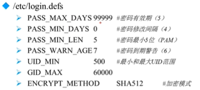
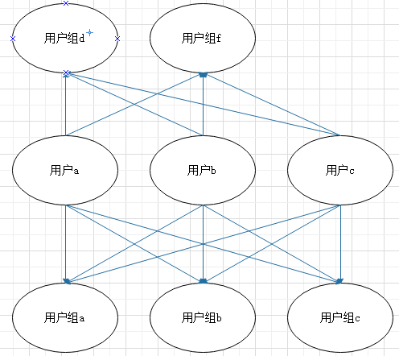

###### datetime:2022-01-08 14:34:00

###### author:nzb

## Linux中的用户管理

### 用户配置文件

* 越是安全性要求高的服务器越需要对用户权限等级制度和服务器操作规范有很高的要求，linux中主要通过用户配置文件来查看和修改用户信息

* 主要有四个配置文件：/etc/passwd，/etc/shadow，/etc/group，/etc/gshadow

* `/etc/passwd`：用户信息文件

    * 格式（7个字段）

        * 用户名称；

        * 密码标志；

        * UID：`用户ID`

            * 0：超级用户

            * 1—499：系统用户:不能登录，不能删除

            * 500—65535：普通用户

        * GID：`组ID：这里是初始组ID不是附加组ID`

        * 用户说明：`备注`

        * 家目录；

            * 普通用户：/home/用户名/

            * 超级用户：/root/

        * Shell

          `命令解释器类型，默认是bash`

* `/etc/shadow`：影子文件
  `是passwd的影子，默认权限：000`

    * 格式（9个字段）

        * 用户名称；

        * 加密密码；

            * SHA512加密，可以暴力破解

            * 如果密码是：“!!”和 “*”，表示没有密码，不能登录

        * 密码最后一此修改时间；`时间戳表示：使用1970年1月一日作为标准时间，每过一天时间戳加1`

        * 两次密码修改间隔（天）；

        * 密码时效天数（-1永不失效）；

        * 密码修改到期前的警告天数；

        * 密码到期后的宽限天数；

        * 账号失效时间；`时间戳表示`

        * 保留字段

    * 时间戳换算：

        * 时间戳—>日期：date -d "1970-01-01 16066 days"

        * 日期—>时间戳：echo$(($(date --date="2014/01/06" +%s)/86400+1))

* `/etc/group&/etc/gshadow`：组信息文件&组密码文件

    * `/etc/group`格式（4个字段）

        * 组名，

        * 组密码标志，

        * GID，

        * 组中附加用户

    * `/etc/gshadow`格式（4个字段）

        * 组名，

        * 组密码(默认没有，也不推荐使用)，

        * 组管理员用户名，

        * 组中附加用户

        * Linux中查看用户的初始组的方法：查询etc/passwd和/etc/group，两两对照查看

### 用户管理相关文件

* 用户的家目录：（会自动生成）

    * 普通用户：/home/用户名/：权限700

    * 超级用户：/root/：权限550

* 用户的邮箱：

    * /var/spool/mail/用户名/

* 用户模板目录：就是母板，新建用户会默认创建在用户家目录下

  `把/etc/skel/目录下的文件复制到用户家目录下`

    * /etc/skel/

### 用户管理命令

* useradd

  `创建用户：useradd [选项] 用户名`

    * 新建一个用户实际上就是在上述六个地方生成了默认信息，所以手工修改上述六个地方就可以手工添加用户

    * useradd -u UID：指定自定义UID

    * useradd -d 家目录：指定自定义家目录

    * useradd -c 用户说明：指定自定义用户说明

    * useradd -g 组名：指定自定义初始组组名
      `不建议修改`

    * useradd -G 组名1,组名2：指定自定义附加组组名

    * useradd -s shell：指定自定义登录shell，默认是/bin/bash

    * 用户默认值配置文件：/etc/default/useradd 和 /etc/login.defs

        
      

* passwd

  `修改用户密码：passwd [选项] 用户名`

    * 超级用户可以改任意用户密码

    * 普通用户只能给自己设密码`passwd`

    * whoami：查看当前用户

    * passwd -S 用户名 ：查看密码状态，就是shadow里面的信息，仅root用户可用

    * passwd -l 用户名 ：锁定用户，实际是在shadow中的密码前面加了“!”，仅root用户可用

    * passwd -u 用户名 ：解锁用户

    * passwd --stdin 用户名 ：使用字符串作为用户密码

        - 例如：echo "123" | passwd --stdin 用户名，shell编程添加多个用户时使用

* usermod

  `修改用户信息：usermod [选项] 用户名`

    * usermod -u UID：修改UID

    * usermod -c 用户说明：修改用户说明

    * usermod -G 组名1,组名2：修改附加组

    * usermod -g 组名：修改初始组（不推荐）

    * usermod -L：锁定用户（Lock）

    * usermod -U：解锁用户（Unlock）

* chage

  `修改用户密码状态：chage [选项] 用户名`

    * chage -l：查询密码详细状态

    * chage -d 日期：修改密码最后一次更改日期

    * chage -m 天数：修改两次密码修改间隔

    * chage -M 天数：修改密码有效期

    * chage -W 天数：修改密码过期前警告天数

    * chage -I 天数：修改宽限天数

    * chage -E 日期：修改账号失效时间

    * 注意：实际是对shadow文件里面的信息进行修改，chage -d 0 用户名 使用最多，把用户的修改密码时间归零，强制用户第一次登陆系统必须修改密码

* userdel

  `删除用户：userdel [选项] 用户名`

    * userdel -r 用户名：删除用户的同时删掉家目录

    * 不推荐手工创建用户，但是可以手工删除用户的相关信息：

        * etc/passwd

        * etc/shadow

        * etc/group

        * etc/gshadow

        * var/spool/mail/用户名

        * /home/用户名/

        * 手工把上面6个位置和要删除的用户的相关信息删除就可以了

* id

  `查询用户uid，gid和附加组：id 用户名`

* su

  `用户切换：su [选项] 用户名`

    * su - 用户名 ：连带用户的环境变量一起切换，中间减号绝对不能省去，省去就不会切换环境变量

    * su - root -c 命令名：不切换root，只是执行root权限才能执行的命令

### 用户组管理命令

* groupadd

  `添加用户组：groupadd [选项] 组名`

    * groupadd -g（GID）组名：指定组ID

* groupmod

    * groupmod -g 新组id 旧组id

    * groupmod -n 新组名 旧组名
      `尽量不修改`

* groupdel

    * groupdel 组名：要想删除一个组，这个组中不允许有初始用户存在

* gpasswd

  `把用户添入组或者从组中删除：gpasswd [选项] 组名`

    * gpasswd -a 用户名：把用户加入组

      `gpasswd -a 用户名 组名`

    * gpasswd -d 用户名：把用户从组中删除

      `gpasswd -d 用户名 组名`

    * 注：也可以直接在/etc/group文件里添加附加组(不推荐改初始组)

### 总结：

* Linux中用户和用户组的关系是：

