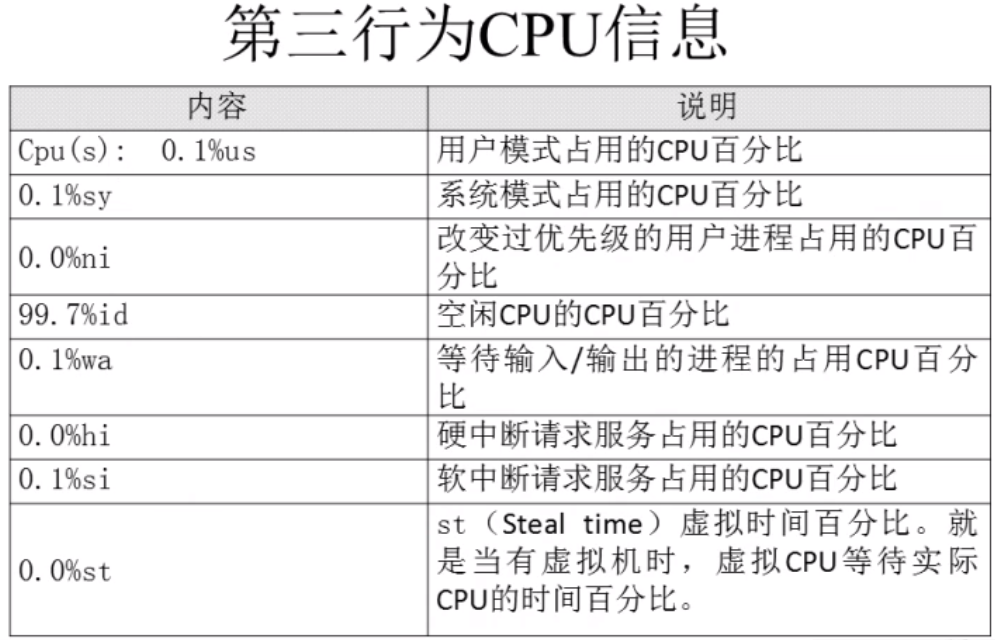
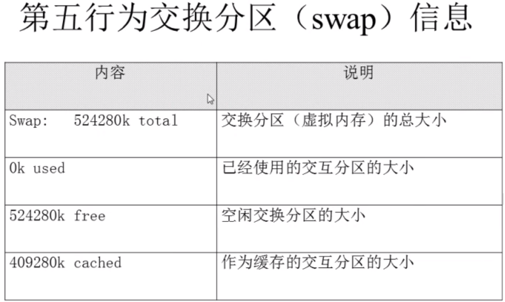
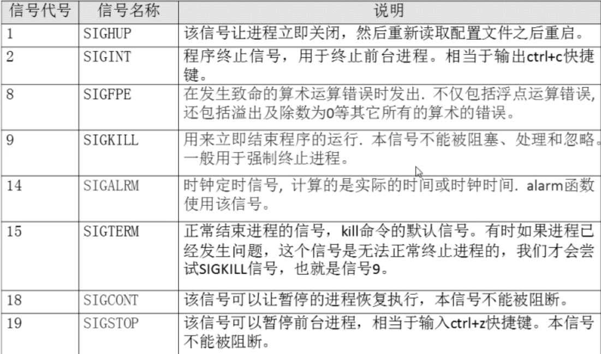
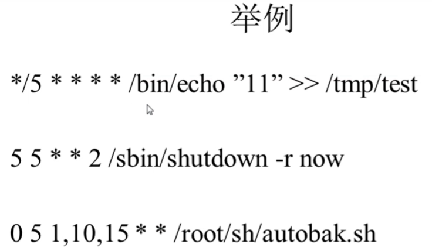

###### datetime:2022-01-08 14:34:00

###### author:nzb

## Linux系统管理

### 进程管理

* 进程管理的作用：（下面优先级由高到低）

    * 判断服务器的健康状态（CPU、内存的占用情况）

      `常用命令：top`

    * 查看系统中的所有进程

      `命令：ps aux 和 ps -el 和 pstree`

    * 杀死进程

      `不常用，尽可能正常操作结束服务，不能正常关闭时再用`

* 进程查看

    * ps aux

      `查看系统中所有进程，查看BSD操作系统格式`
    
    * ps -xH 
    
      `列出所有线程`

    * ps -le

      `查看系统中所有进程，Linux格式`

    * 输出格式的作用

        * ps aux

            * 

    * top

      `查看系统健康状态：top [选项] 需要的时候使用，top命令比较耗资源`

        * -d 秒数：默认每3秒更新一次，可指定

        * ？或h：显示交互模式的帮助

        * P：以CPU使用率排序，默认选项

        * M：以内存使用率排序

        * N：以PID排序

        * q：退出top

        * top命令的显示

          
            * 重点关注最后一个平均负载(除以 Cpu 核数，如果大于 1.5，表示超出负荷，小于 1.5 基本正常)

                * 
                  
            * 重点关注第4个CPU的空闲率

              
            * 重点关注第3个内存的空闲率

                * 
                  

    * pstree

      `查看进程树：pstree [选项]`

        * -p：显示进程的PID

        * -u：显示进程的所属用户

* 进程终止

  `正常命令不能终止服务时才使用`

    * kill

      `kill [信号] PID`

        * -l：查看kill支持的信号

          `小写l`

          

        * -1 PID：重启进程

        * -9 PID：终止进程

    * killall

      `按照进程名杀死，选项和kill通用：killall [选项] [信号] 进程名`

        * -i：有询问

        * -I：忽略进程名的大小写
          `大写的i`

    * pkill

      `按照进程名杀死，选项和kill通用：pkill [选项] [信号] 进程名`

        * 也可以加t选项跟终端号：pkill -t 终端号：按照终端号踢出用户，用 w 命令查询系统中登录的用户，然后用终端号来踢

### 工作管理

`类似Windows的最小化`

* 把进程放入后台

    * 命令后面加&：后台继续运行

    * 在命令执行过程中，按下ctrl+z快捷键：放入后台即暂停

* jobs

  `查看后台的工作：jobs [-l]`

    * -l：显示工作的PID

    * 注意：“+”号代表最近一个放入后台的工作，也是工作恢复时，默认恢复的工作；“-”号代表倒数第二个放入后台的工作。

  

* fg

  `恢复后台暂停的工作恢复到前台运行：fg %工作号`

    * %工作号：%号可以省略，但是注意工作号和PID的区别

* bg

  `恢复后台暂停的工作恢复到后台运行：bg %工作号`

    * %工作号：%号可以省略，但是注意工作号和PID的区别

    * 但是不能恢复和前台有交互的命令比如top命令和vim命令，因为就是给用户展示，后台运行没意义

* **注意：工作号≠PID**

### 系统资源查看

* vmstat

  `监视系统资源使用情况： vmstat [刷新延时(s) 刷新次数] 和top内容差不多，但更简洁`

* dmesg

  `开机时内核检测，一般结合grep使用`

* free

  `查看内存使用情况：free [选项]`

    * -b：以字节为单位显示

    * -k：以KB为单位显示（默认就是）

    * -m：以MB为单位显示

    * -g：以GB为单位显示

  

* 查看CPU信息：

    * cat /proc/cupinfo：每次开机都会更新

    * dmesg | grep CPU

    * uptime：实际就是top命令第一行，跟w看到的一样

* uname

  `查看系统与内核相关信息：uname [选项]`

    * -a：查看系统所有相关信息

    * -r：查看内核版本

    * -s：查看内核名称

* file /bin/ls

  `判断当前系统的位数（通过系统外部命令的位数来推测）`

* lsb_release -a

  `查询Linux系统的发行版本`

* lsof

  `列出进程打开或使用的文件信息：lsof [选项]`

    * -s 字符串：只列出以字符串开头的进程打开的文件

    * -u 用户名：只列出某个用户的进程打开的文件

    * -p pid：列出某个PID进程打开的文件

### 系统定时任务

* 前提：必须启动crond服务：service crond restart，并且chkconfig crond on，Linux系统都是默认启动和自启动的

* crontab

  `设置系统定时任务：crontab [选项]`

    * -e：编辑crontab定时任务

        * 打开文件编辑的格式是：* * * * * command或执行脚本

            * 第一个*：分钟（0-59）

            * 第二个*：小时（0-23）

            * 第三个*：天（1-31）

            * 第四个*：月（1-12）

            * 第五个*：星期（0-7，0和7都代表星期日）

        * 特殊符号：

          

        * 示例

          
          
        * 定期脚本里面的日期输出需要加“\”转义符，原本：date +%y%m%d，定时任务里的脚本：date +\%y\%m\%d

    * -l：查询crontab任务

    * -r：删除当前用户所有的crontab任务

      `删一个任务，进去编辑删除需要删除的任务（vim操作）`