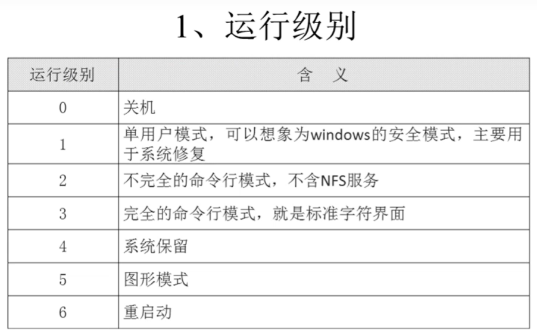
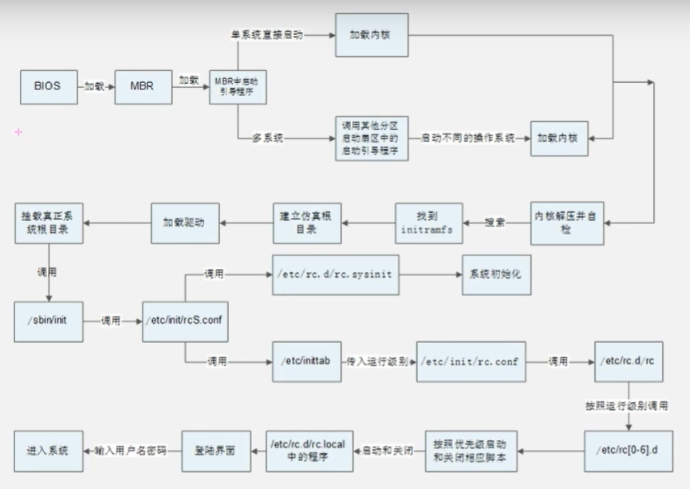
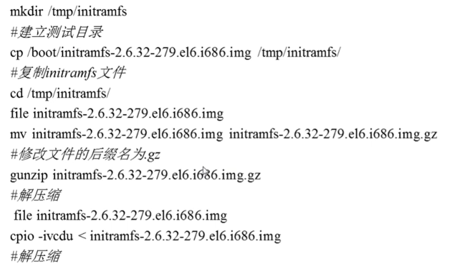
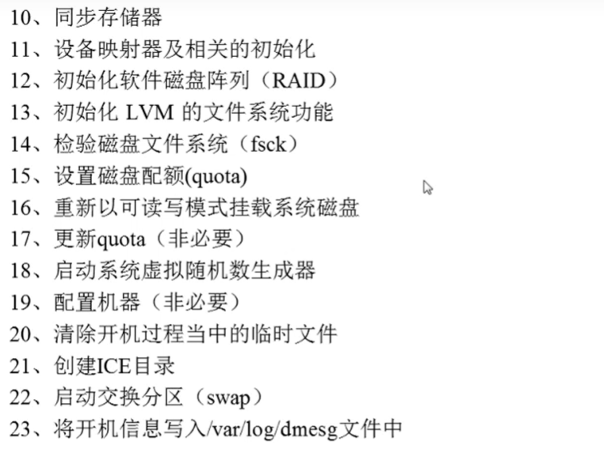
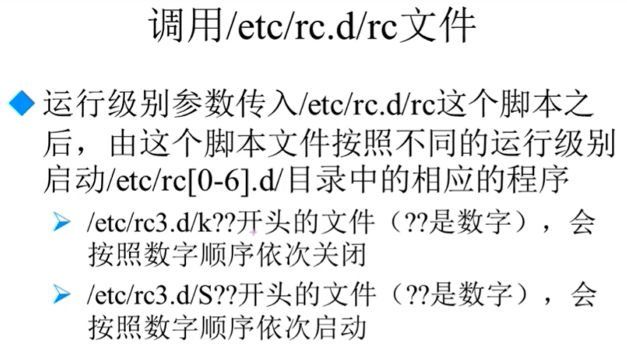
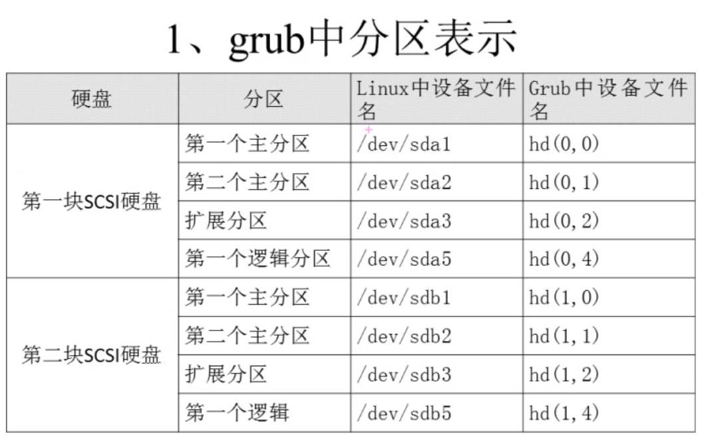
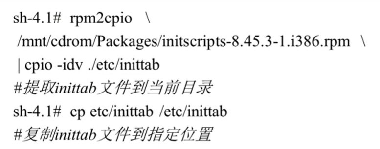

###### datetime:2022-01-08 14:34:00

###### author:nzb

## Linux启动管理

* CentOS 6.x的启动管理

    * 运行级别：7个级别

      
        * runlevel：查看运行级别

        * init 运行级别：改变当前运行级别

        * vim /etc/inittab：永久修改系统默认运行级别，写上id:3:initdefault

        * 不要把0和6设为默认级别

    * CentOS6系统启动过程：[针对MBR模式](https://www.bilibili.com/video/av18156598/?p=103)

      
      
        * initramfs内存文件系统

            * CentOS 6.x中使用initramfs内存文件系统去嗲了Centos5.x中的initrd RAM
              Disk。他们的作用类似，可以通过启动引导程序加载到内存中，然后加载启动过程中所需要的的内核模块，比如USB、SATA、SCSI硬盘的驱动和LVM、PAID文件系统的驱动

            * 查看

                * 不能在boot目录下做操作

                  

        * 调用/etc/init/rcS.conf配置文件

            * 主要功能是两个

                * 先调用/etc/rc.d/rc.sysinit，然后又/etc/rc.d/rc.sysinit配置文件进行Linux系统初始化

                  
                  

                * 然后再调用/etc/inittab，然后由/etc/inittab配置文件确定系统的默认运行级别

        * 调用/etc/rc.d/rc文件

          

* 启动引导程序grub

  
    * Grub配置文件：/boot/grub/grub.conf

    * 格式：

        * default=0： 默认启动第一个系统

        * timeout=5： 等待时间，默认是5秒

        * splashimage=(hd0,0)/grub/splash.xpm.gz：指定grub启动时的背景图像文件的保存位置

        * hiddenmenu： 隐藏菜单

        * title CentOS(2.6.32-279.el6.i686)： 标题

        * root (hd0,0)： 指启动程序的保存分区

        * kernel /vmlinuz-2.6.32-279.el6.i686 ro： 定义了内核加载时的选项

        * initrd /initramfs-2.6.32-279.el6.i686.img： initramfs内存文件系统镜像文件的所在位置

* 系统修复模式

    * 单用户模式常见的错误修复

        * 遗忘root密码

        * 修改系统默认运行级别

    * 光盘修复模式

      
      

* 这些是后门，说的Linux针对的是网络安全

  