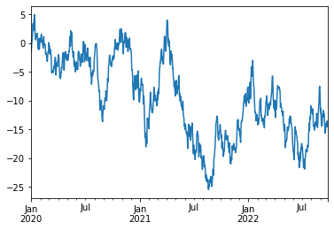

# Pandas

[中文文档](https://www.pypandas.cn/)
[英文文档](https://pandas.pydata.org/)

## Pandas概览

Pandas 是 Python 的核心数据分析支持库，提供了快速、灵活、明确的数据结构，旨在简单、直观地处理关系型、标记型数据。Pandas 的目标是成为 Python
数据分析实践与实战的必备高级工具，其长远目标是成为最强大、最灵活、可以支持任何语言的开源数据分析工具。经过多年不懈的努力，Pandas 离这个目标已经越来越近了。

Pandas 适用于处理以下类型的数据：

- 与 SQL 或 Excel 表类似的，含异构列的表格数据;
- 有序和无序（非固定频率）的时间序列数据;
- 带行列标签的矩阵数据，包括同构或异构型数据;
- 任意其它形式的观测、统计数据集, 数据转入 Pandas 数据结构时不必事先标记。

Pandas
的主要数据结构是 [Series](https://pandas.pydata.org/pandas-docs/stable/reference/api/pandas.Series.html#pandas.Series)（一维数据）与 [DataFrame](https://pandas.pydata.org/pandas-docs/stable/reference/api/pandas.DataFrame.html#pandas.DataFrame)（二维数据），这两种数据结构足以处理金融、统计、-
社会科学、工程等领域里的大多数典型用例。对于 R 用户，DataFrame 提供了比 R 语言 data.frame 更丰富的功能。Pandas 基于 [NumPy](https://www.numpy.org/)
开发，可以与其它第三方科学计算支持库完美集成。

Pandas 就像一把万能瑞士军刀，下面仅列出了它的部分优势 ：

- 处理浮点与非浮点数据里的**缺失数据**，表示为 NaN；
- 大小可变：**插入或删除** DataFrame 等多维对象的列；
- 自动、显式**数据对齐**：显式地将对象与一组标签对齐，也可以忽略标签，在 Series、DataFrame 计算时自动与数据对齐；
- 强大、灵活的**分组**（group by）功能：**拆分-应用-组合**数据集，**聚合、转换**数据；
- 把 Python 和 NumPy 数据结构里不规则、不同索引的数据轻松地转换为 DataFrame 对象；
- 基于智能标签，对大型数据集进行**切片、花式索引、子集分解**等操作；
- 直观地**合并（merge）、连接（join）**数据集；
- 灵活地**重塑（reshape）、透视（pivot）**数据集；
- **轴**支持结构化标签：一个刻度支持多个标签；
- 成熟的 IO 工具：读取**文本文件**（CSV 等支持分隔符的文件）、Excel 文件、数据库等来源的数据，利用超快的 HDF5 格式保存 / 加载数据；
- **时间序列**：支持日期范围生成、频率转换、移动窗口统计、移动窗口线性回归、日期位移等时间序列功能。

这些功能主要是为了解决其它编程语言、科研环境的痛点。处理数据一般分为几个阶段：数据整理与清洗、数据分析与建模、数据可视化与制表，Pandas 是处理数据的理想工具。

其它说明：

- Pandas 速度很快。Pandas 的很多底层算法都用 Cython 优化过。然而，为了保持通用性，必然要牺牲一些性能，如果专注某一功能，完全可以开发出比 Pandas 更快的专用工具。
- Pandas 是 statsmodels 的依赖项，因此，Pandas 也是 Python 中统计计算生态系统的重要组成部分。
- Pandas 已广泛应用于金融领域。

## 数据结构

| 维数  | 名称  |     描述       |
|---------------------|------------------|------------------|
|  1   | Series|  带标签的一维同构数组|
|  2   | DataFrame| 带标签的，大小可变的，二维异构表格|

### 为什么有多个数据结构？

Pandas 数据结构就像是低维数据的容器。比如，DataFrame 是 Series 的容器，Series 则是标量的容器。使用这种方式，可以在容器中以字典的形式插入或删除对象。

此外，通用 API 函数的默认操作要顾及时间序列与截面数据集的方向。多维数组存储二维或三维数据时，编写函数要注意数据集的方向，这对用户来说是一种负担；如果不考虑 C 或 Fortran
中连续性对性能的影响，一般情况下，不同的轴在程序里其实没有什么区别。Pandas 里，轴的概念主要是为了给数据赋予更直观的语义，即用“更恰当”的方式表示数据集的方向。这样做可以让用户编写数据转换函数时，少费点脑子。

处理 DataFrame 等表格数据时，index（行）或 columns（列）比 axis 0 和 axis 1 更直观。用这种方式迭代 DataFrame 的列，代码更易读易懂：

```python
for col in df.columns:
    series = df[col]
    # do something with series
```

## 大小可变与数据复制

Pandas 所有数据结构的值都是可变的，但数据结构的大小并非都是可变的，比如，Series 的长度不可改变，但 DataFrame 里就可以插入列。

Pandas 里，绝大多数方法都不改变原始的输入数据，而是复制数据，生成新的对象。 一般来说，原始输入数据**不变**更稳妥。

## 十分钟入门Pandas

本节是帮助 Pandas 新手快速上手的简介。[烹饪指南](https://www.pypandas.cn/docs/user_guide/cookbook.html)里介绍了更多实用案例。

本节以下列方式导入 Pandas 与 NumPy：

```python
import numpy as np
import pandas as pd
```

### 生成对象

详见[数据结构](https://www.pypandas.cn/docs/getting_started/dsintro.html#dsintro)简介文档。

用值列表生成 [Series](https://pandas.pydata.org/pandas-docs/stable/reference/api/pandas.Series.html#pandas.Series) 时，Pandas
默认自动生成整数索引：

```python
s = pd.Series([1, 2, 3, 4, 5, np.nan, 6, 8])
s
```

    0    1.0
    1    2.0
    2    3.0
    3    4.0
    4    5.0
    5    NaN
    6    6.0
    7    8.0
    dtype: float64

用含日期时间索引与标签的Numpy数组生成[DataFrame](https://pandas.pydata.org/pandas-docs/stable/reference/api/pandas.DataFrame.html#pandas.DataFrame)

```python
df1 = pd.date_range(start='20150101', periods=6)
df1
```

    DatetimeIndex(['2015-01-01', '2015-01-02', '2015-01-03', '2015-01-04',
                   '2015-01-05', '2015-01-06'],
                  dtype='datetime64[ns]', freq='D')

```python
df2 = pd.DataFrame(np.random.randn(6, 4), index=df1, columns=list('ABCD'))
df2
```

<div>
<style scoped>
    .dataframe tbody tr th:only-of-type {
        vertical-align: middle;
    }

    .dataframe tbody tr th {
        vertical-align: top;
    }

    .dataframe thead th {
        text-align: right;
    }

</style>
<table border="1" class="dataframe">
  <thead>
    <tr style="text-align: right;">
      <th></th>
      <th>A</th>
      <th>B</th>
      <th>C</th>
      <th>D</th>
    </tr>
  </thead>
  <tbody>
    <tr>
      <td>2015-01-01</td>
      <td>0.495777</td>
      <td>-0.524296</td>
      <td>-0.089971</td>
      <td>1.640044</td>
    </tr>
    <tr>
      <td>2015-01-02</td>
      <td>2.014452</td>
      <td>-0.422936</td>
      <td>0.991045</td>
      <td>-0.281331</td>
    </tr>
    <tr>
      <td>2015-01-03</td>
      <td>0.883596</td>
      <td>-1.794803</td>
      <td>0.575979</td>
      <td>-1.856528</td>
    </tr>
    <tr>
      <td>2015-01-04</td>
      <td>0.565125</td>
      <td>0.858778</td>
      <td>0.138376</td>
      <td>0.201316</td>
    </tr>
    <tr>
      <td>2015-01-05</td>
      <td>-1.854077</td>
      <td>0.368956</td>
      <td>-1.267826</td>
      <td>-2.464888</td>
    </tr>
    <tr>
      <td>2015-01-06</td>
      <td>-0.224993</td>
      <td>-1.253118</td>
      <td>-0.195717</td>
      <td>-0.623797</td>
    </tr>
  </tbody>
</table>
</div>


用Series字典对象生成DataFrame

```python
df3 = pd.DataFrame({
    'A': 1.,
    'B': pd.Timestamp('20150101'),
    'C': pd.Series(1, index=list(range(4)), dtype='float32'),
    'D': np.array([3] * 4, dtype='int32'),
    'E': pd.Categorical(['test', 'train', 'test', 'train']),
    'F': 'foo'
})
df3
```

<div>
<style scoped>
    .dataframe tbody tr th:only-of-type {
        vertical-align: middle;
    }

    .dataframe tbody tr th {
        vertical-align: top;
    }

    .dataframe thead th {
        text-align: right;
    }

</style>
<table border="1" class="dataframe">
  <thead>
    <tr style="text-align: right;">
      <th></th>
      <th>A</th>
      <th>B</th>
      <th>C</th>
      <th>D</th>
      <th>E</th>
      <th>F</th>
    </tr>
  </thead>
  <tbody>
    <tr>
      <td>0</td>
      <td>1.0</td>
      <td>2015-01-01</td>
      <td>1.0</td>
      <td>3</td>
      <td>test</td>
      <td>foo</td>
    </tr>
    <tr>
      <td>1</td>
      <td>1.0</td>
      <td>2015-01-01</td>
      <td>1.0</td>
      <td>3</td>
      <td>train</td>
      <td>foo</td>
    </tr>
    <tr>
      <td>2</td>
      <td>1.0</td>
      <td>2015-01-01</td>
      <td>1.0</td>
      <td>3</td>
      <td>test</td>
      <td>foo</td>
    </tr>
    <tr>
      <td>3</td>
      <td>1.0</td>
      <td>2015-01-01</td>
      <td>1.0</td>
      <td>3</td>
      <td>train</td>
      <td>foo</td>
    </tr>
  </tbody>
</table>
</div>


DataFrame 的列有不同[数据类型](https://pandas.pydata.org/pandas-docs/stable/getting_started/basics.html#basics-dtypes)。

```python
df3.dtypes
```

    A           float64
    B    datetime64[ns]
    C           float32
    D             int32
    E          category
    F            object
    dtype: object

IPython支持 tab 键自动补全列名与公共属性。下面是部分可自动补全的属性：

```python
df3. < TAB >
# df2.A                  df2.bool
# df2.abs                df2.boxplot
# df2.add                df2.C
# df2.add_prefix         df2.clip
# df2.add_suffix         df2.clip_lower
# df2.align              df2.clip_upper
# df2.all                df2.columns
# df2.any                df2.combine
# df2.append             df2.combine_first
# df2.apply              df2.compound
# df2.applymap           df2.consolidate
# df2.D
# 列 A、B、C、D 和 E 都可以自动补全；为简洁起见，此处只显示了部分属性。
```

      File "<ipython-input-16-fe6086829f7d>", line 1
        df3.<TAB>
            ^
    SyntaxError: invalid syntax

### 查看数据

详见[基础用法](https://pandas.pydata.org/pandas-docs/stable/getting_started/basics.html#basics)文档。

下列代码说明如何查看 DataFrame 头部和尾部数据：

```python
df2.head()
```

<div>
<style scoped>
    .dataframe tbody tr th:only-of-type {
        vertical-align: middle;
    }

    .dataframe tbody tr th {
        vertical-align: top;
    }

    .dataframe thead th {
        text-align: right;
    }

</style>
<table border="1" class="dataframe">
  <thead>
    <tr style="text-align: right;">
      <th></th>
      <th>A</th>
      <th>B</th>
      <th>C</th>
      <th>D</th>
    </tr>
  </thead>
  <tbody>
    <tr>
      <td>2015-01-01</td>
      <td>0.495777</td>
      <td>-0.524296</td>
      <td>-0.089971</td>
      <td>1.640044</td>
    </tr>
    <tr>
      <td>2015-01-02</td>
      <td>2.014452</td>
      <td>-0.422936</td>
      <td>0.991045</td>
      <td>-0.281331</td>
    </tr>
    <tr>
      <td>2015-01-03</td>
      <td>0.883596</td>
      <td>-1.794803</td>
      <td>0.575979</td>
      <td>-1.856528</td>
    </tr>
    <tr>
      <td>2015-01-04</td>
      <td>0.565125</td>
      <td>0.858778</td>
      <td>0.138376</td>
      <td>0.201316</td>
    </tr>
    <tr>
      <td>2015-01-05</td>
      <td>-1.854077</td>
      <td>0.368956</td>
      <td>-1.267826</td>
      <td>-2.464888</td>
    </tr>
  </tbody>
</table>
</div>

```python
df2.tail(3)
```

<div>
<style scoped>
    .dataframe tbody tr th:only-of-type {
        vertical-align: middle;
    }

    .dataframe tbody tr th {
        vertical-align: top;
    }

    .dataframe thead th {
        text-align: right;
    }

</style>
<table border="1" class="dataframe">
  <thead>
    <tr style="text-align: right;">
      <th></th>
      <th>A</th>
      <th>B</th>
      <th>C</th>
      <th>D</th>
    </tr>
  </thead>
  <tbody>
    <tr>
      <td>2015-01-04</td>
      <td>0.565125</td>
      <td>0.858778</td>
      <td>0.138376</td>
      <td>0.201316</td>
    </tr>
    <tr>
      <td>2015-01-05</td>
      <td>-1.854077</td>
      <td>0.368956</td>
      <td>-1.267826</td>
      <td>-2.464888</td>
    </tr>
    <tr>
      <td>2015-01-06</td>
      <td>-0.224993</td>
      <td>-1.253118</td>
      <td>-0.195717</td>
      <td>-0.623797</td>
    </tr>
  </tbody>
</table>
</div>


显示索引与列名

```python
df2.index
```

    DatetimeIndex(['2015-01-01', '2015-01-02', '2015-01-03', '2015-01-04',
                   '2015-01-05', '2015-01-06'],
                  dtype='datetime64[ns]', freq='D')

```python
df2.columns
```

    Index(['A', 'B', 'C', 'D'], dtype='object')

[DataFrame.to_numpy()](https://pandas.pydata.org/pandas-docs/stable/reference/api/pandas.DataFrame.to_numpy.html#pandas.DataFrame.to_numpy)
输出底层数据的 NumPy 对象。注意，DataFrame 的列由多种数据类型组成时，该操作耗费系统资源较大，这也是 Pandas 和 NumPy 的本质区别：**NumPy 数组只有一种数据类型，DataFrame
每列的数据类型各不相同**。调用 DataFrame.to_numpy() 时，Pandas 查找支持 DataFrame 里所有数据类型的 NumPy 数据类型。还有一种数据类型是 `object`，可以把 DataFrame
列里的值强制转换为 Python 对象。

下面的 `df2` 这个 DataFrame 里的值都是浮点数，DataFrame.to_numpy() 的操作会很快，而且不复制数据。

```python
df2.to_numpy()
```

    array([[ 0.49577653, -0.5242963 , -0.08997072,  1.64004361],
           [ 2.01445165, -0.42293604,  0.99104484, -0.28133103],
           [ 0.88359618, -1.79480302,  0.57597891, -1.85652831],
           [ 0.56512531,  0.85877834,  0.13837606,  0.20131605],
           [-1.85407664,  0.36895609, -1.26782639, -2.46488774],
           [-0.22499319, -1.25311828, -0.19571662, -0.62379678]])

`df3` 这个 DataFrame 包含了多种类型，DataFrame.to_numpy() 操作就会耗费较多资源。

```python
df3.to_numpy()
```

    array([[1.0, Timestamp('2015-01-01 00:00:00'), 1.0, 3, 'test', 'foo'],
           [1.0, Timestamp('2015-01-01 00:00:00'), 1.0, 3, 'train', 'foo'],
           [1.0, Timestamp('2015-01-01 00:00:00'), 1.0, 3, 'test', 'foo'],
           [1.0, Timestamp('2015-01-01 00:00:00'), 1.0, 3, 'train', 'foo']],
          dtype=object)

**提醒**： DataFrame.to_numpy() 的输出不包含行索引和列标签。

[describe()](https://pandas.pydata.org/pandas-docs/stable/reference/api/pandas.DataFrame.describe.html#pandas.DataFrame.describe)
可以快速查看数据的统计摘要：

```python
df2.describe()
```

<div>
<style scoped>
    .dataframe tbody tr th:only-of-type {
        vertical-align: middle;
    }

    .dataframe tbody tr th {
        vertical-align: top;
    }

    .dataframe thead th {
        text-align: right;
    }

</style>
<table border="1" class="dataframe">
  <thead>
    <tr style="text-align: right;">
      <th></th>
      <th>A</th>
      <th>B</th>
      <th>C</th>
      <th>D</th>
    </tr>
  </thead>
  <tbody>
    <tr>
      <td>count</td>
      <td>6.000000</td>
      <td>6.000000</td>
      <td>6.000000</td>
      <td>6.000000</td>
    </tr>
    <tr>
      <td>mean</td>
      <td>0.313313</td>
      <td>-0.461237</td>
      <td>0.025314</td>
      <td>-0.564197</td>
    </tr>
    <tr>
      <td>std</td>
      <td>1.288654</td>
      <td>0.984132</td>
      <td>0.772400</td>
      <td>1.470442</td>
    </tr>
    <tr>
      <td>min</td>
      <td>-1.854077</td>
      <td>-1.794803</td>
      <td>-1.267826</td>
      <td>-2.464888</td>
    </tr>
    <tr>
      <td>25%</td>
      <td>-0.044801</td>
      <td>-1.070913</td>
      <td>-0.169280</td>
      <td>-1.548345</td>
    </tr>
    <tr>
      <td>50%</td>
      <td>0.530451</td>
      <td>-0.473616</td>
      <td>0.024203</td>
      <td>-0.452564</td>
    </tr>
    <tr>
      <td>75%</td>
      <td>0.803978</td>
      <td>0.170983</td>
      <td>0.466578</td>
      <td>0.080654</td>
    </tr>
    <tr>
      <td>max</td>
      <td>2.014452</td>
      <td>0.858778</td>
      <td>0.991045</td>
      <td>1.640044</td>
    </tr>
  </tbody>
</table>
</div>


转置数据：

```python
print(df2)
print("\n-------------------转置后-------------------------")
df2.T
```

                       A         B         C         D
    2015-01-01  0.495777 -0.524296 -0.089971  1.640044
    2015-01-02  2.014452 -0.422936  0.991045 -0.281331
    2015-01-03  0.883596 -1.794803  0.575979 -1.856528
    2015-01-04  0.565125  0.858778  0.138376  0.201316
    2015-01-05 -1.854077  0.368956 -1.267826 -2.464888
    2015-01-06 -0.224993 -1.253118 -0.195717 -0.623797
    
    -------------------转置后-------------------------

<div>
<style scoped>
    .dataframe tbody tr th:only-of-type {
        vertical-align: middle;
    }

    .dataframe tbody tr th {
        vertical-align: top;
    }

    .dataframe thead th {
        text-align: right;
    }

</style>
<table border="1" class="dataframe">
  <thead>
    <tr style="text-align: right;">
      <th></th>
      <th>2015-01-01</th>
      <th>2015-01-02</th>
      <th>2015-01-03</th>
      <th>2015-01-04</th>
      <th>2015-01-05</th>
      <th>2015-01-06</th>
    </tr>
  </thead>
  <tbody>
    <tr>
      <td>A</td>
      <td>0.495777</td>
      <td>2.014452</td>
      <td>0.883596</td>
      <td>0.565125</td>
      <td>-1.854077</td>
      <td>-0.224993</td>
    </tr>
    <tr>
      <td>B</td>
      <td>-0.524296</td>
      <td>-0.422936</td>
      <td>-1.794803</td>
      <td>0.858778</td>
      <td>0.368956</td>
      <td>-1.253118</td>
    </tr>
    <tr>
      <td>C</td>
      <td>-0.089971</td>
      <td>0.991045</td>
      <td>0.575979</td>
      <td>0.138376</td>
      <td>-1.267826</td>
      <td>-0.195717</td>
    </tr>
    <tr>
      <td>D</td>
      <td>1.640044</td>
      <td>-0.281331</td>
      <td>-1.856528</td>
      <td>0.201316</td>
      <td>-2.464888</td>
      <td>-0.623797</td>
    </tr>
  </tbody>
</table>
</div>


按轴排序：

```python
df2.sort_index(axis=1, ascending=False)
```

<div>
<style scoped>
    .dataframe tbody tr th:only-of-type {
        vertical-align: middle;
    }

    .dataframe tbody tr th {
        vertical-align: top;
    }

    .dataframe thead th {
        text-align: right;
    }

</style>
<table border="1" class="dataframe">
  <thead>
    <tr style="text-align: right;">
      <th></th>
      <th>D</th>
      <th>C</th>
      <th>B</th>
      <th>A</th>
    </tr>
  </thead>
  <tbody>
    <tr>
      <td>2015-01-01</td>
      <td>1.640044</td>
      <td>-0.089971</td>
      <td>-0.524296</td>
      <td>0.495777</td>
    </tr>
    <tr>
      <td>2015-01-02</td>
      <td>-0.281331</td>
      <td>0.991045</td>
      <td>-0.422936</td>
      <td>2.014452</td>
    </tr>
    <tr>
      <td>2015-01-03</td>
      <td>-1.856528</td>
      <td>0.575979</td>
      <td>-1.794803</td>
      <td>0.883596</td>
    </tr>
    <tr>
      <td>2015-01-04</td>
      <td>0.201316</td>
      <td>0.138376</td>
      <td>0.858778</td>
      <td>0.565125</td>
    </tr>
    <tr>
      <td>2015-01-05</td>
      <td>-2.464888</td>
      <td>-1.267826</td>
      <td>0.368956</td>
      <td>-1.854077</td>
    </tr>
    <tr>
      <td>2015-01-06</td>
      <td>-0.623797</td>
      <td>-0.195717</td>
      <td>-1.253118</td>
      <td>-0.224993</td>
    </tr>
  </tbody>
</table>
</div>


按值排序：

```python
df2.sort_values(by='B')
```

<div>
<style scoped>
    .dataframe tbody tr th:only-of-type {
        vertical-align: middle;
    }

    .dataframe tbody tr th {
        vertical-align: top;
    }

    .dataframe thead th {
        text-align: right;
    }

</style>
<table border="1" class="dataframe">
  <thead>
    <tr style="text-align: right;">
      <th></th>
      <th>A</th>
      <th>B</th>
      <th>C</th>
      <th>D</th>
    </tr>
  </thead>
  <tbody>
    <tr>
      <td>2015-01-03</td>
      <td>0.883596</td>
      <td>-1.794803</td>
      <td>0.575979</td>
      <td>-1.856528</td>
    </tr>
    <tr>
      <td>2015-01-06</td>
      <td>-0.224993</td>
      <td>-1.253118</td>
      <td>-0.195717</td>
      <td>-0.623797</td>
    </tr>
    <tr>
      <td>2015-01-01</td>
      <td>0.495777</td>
      <td>-0.524296</td>
      <td>-0.089971</td>
      <td>1.640044</td>
    </tr>
    <tr>
      <td>2015-01-02</td>
      <td>2.014452</td>
      <td>-0.422936</td>
      <td>0.991045</td>
      <td>-0.281331</td>
    </tr>
    <tr>
      <td>2015-01-05</td>
      <td>-1.854077</td>
      <td>0.368956</td>
      <td>-1.267826</td>
      <td>-2.464888</td>
    </tr>
    <tr>
      <td>2015-01-04</td>
      <td>0.565125</td>
      <td>0.858778</td>
      <td>0.138376</td>
      <td>0.201316</td>
    </tr>
  </tbody>
</table>
</div>

### 选择

**提醒**：

选择、设置标准 Python / Numpy 的表达式已经非常直观，交互也很方便，但对于生产代码，我们还是推荐优化过的 Pandas 数据访问方法：`.at`、`.iat`、`.loc` 和 `.iloc`。

详见[索引与选择数据](https://pandas.pydata.org/pandas-docs/stable/user_guide/indexing.html#indexing)、[多层索引与高级索引](https://pandas.pydata.org/pandas-docs/stable/user_guide/advanced.html#advanced)文档。

#### 获取数据

选择单列，产生`Series`，与`df2.A`等效：

```python
df2['A']
```

    2015-01-01    0.495777
    2015-01-02    2.014452
    2015-01-03    0.883596
    2015-01-04    0.565125
    2015-01-05   -1.854077
    2015-01-06   -0.224993
    Freq: D, Name: A, dtype: float64

用`[]`切片行：

```python
df2[0:3]
```

<div>
<style scoped>
    .dataframe tbody tr th:only-of-type {
        vertical-align: middle;
    }

    .dataframe tbody tr th {
        vertical-align: top;
    }

    .dataframe thead th {
        text-align: right;
    }

</style>
<table border="1" class="dataframe">
  <thead>
    <tr style="text-align: right;">
      <th></th>
      <th>A</th>
      <th>B</th>
      <th>C</th>
      <th>D</th>
    </tr>
  </thead>
  <tbody>
    <tr>
      <td>2015-01-01</td>
      <td>0.495777</td>
      <td>-0.524296</td>
      <td>-0.089971</td>
      <td>1.640044</td>
    </tr>
    <tr>
      <td>2015-01-02</td>
      <td>2.014452</td>
      <td>-0.422936</td>
      <td>0.991045</td>
      <td>-0.281331</td>
    </tr>
    <tr>
      <td>2015-01-03</td>
      <td>0.883596</td>
      <td>-1.794803</td>
      <td>0.575979</td>
      <td>-1.856528</td>
    </tr>
  </tbody>
</table>
</div>

```python
df2['20150102': '20150103']
```

<div>
<style scoped>
    .dataframe tbody tr th:only-of-type {
        vertical-align: middle;
    }

    .dataframe tbody tr th {
        vertical-align: top;
    }

    .dataframe thead th {
        text-align: right;
    }

</style>
<table border="1" class="dataframe">
  <thead>
    <tr style="text-align: right;">
      <th></th>
      <th>A</th>
      <th>B</th>
      <th>C</th>
      <th>D</th>
    </tr>
  </thead>
  <tbody>
    <tr>
      <td>2015-01-02</td>
      <td>2.014452</td>
      <td>-0.422936</td>
      <td>0.991045</td>
      <td>-0.281331</td>
    </tr>
    <tr>
      <td>2015-01-03</td>
      <td>0.883596</td>
      <td>-1.794803</td>
      <td>0.575979</td>
      <td>-1.856528</td>
    </tr>
  </tbody>
</table>
</div>

#### 按标签选择

详见[按标签选择](https://pandas.pydata.org/pandas-docs/stable/user_guide/indexing.html#indexing-label)

用标签提取一行数据：

```python
df2.loc[df1[0]]
```

    A    0.495777
    B   -0.524296
    C   -0.089971
    D    1.640044
    Name: 2015-01-01 00:00:00, dtype: float64

用标签选择多列数据：

```python
df2.loc[:, ['A', 'B']]
```

<div>
<style scoped>
    .dataframe tbody tr th:only-of-type {
        vertical-align: middle;
    }

    .dataframe tbody tr th {
        vertical-align: top;
    }

    .dataframe thead th {
        text-align: right;
    }

</style>
<table border="1" class="dataframe">
  <thead>
    <tr style="text-align: right;">
      <th></th>
      <th>A</th>
      <th>B</th>
    </tr>
  </thead>
  <tbody>
    <tr>
      <td>2015-01-01</td>
      <td>0.495777</td>
      <td>-0.524296</td>
    </tr>
    <tr>
      <td>2015-01-02</td>
      <td>2.014452</td>
      <td>-0.422936</td>
    </tr>
    <tr>
      <td>2015-01-03</td>
      <td>0.883596</td>
      <td>-1.794803</td>
    </tr>
    <tr>
      <td>2015-01-04</td>
      <td>0.565125</td>
      <td>0.858778</td>
    </tr>
    <tr>
      <td>2015-01-05</td>
      <td>-1.854077</td>
      <td>0.368956</td>
    </tr>
    <tr>
      <td>2015-01-06</td>
      <td>-0.224993</td>
      <td>-1.253118</td>
    </tr>
  </tbody>
</table>
</div>


用标签切片，包含行与列结束点：

```python
df2.loc['20150102': '20150104', ['A', 'B']]
```

<div>
<style scoped>
    .dataframe tbody tr th:only-of-type {
        vertical-align: middle;
    }

    .dataframe tbody tr th {
        vertical-align: top;
    }

    .dataframe thead th {
        text-align: right;
    }

</style>
<table border="1" class="dataframe">
  <thead>
    <tr style="text-align: right;">
      <th></th>
      <th>A</th>
      <th>B</th>
    </tr>
  </thead>
  <tbody>
    <tr>
      <td>2015-01-02</td>
      <td>2.014452</td>
      <td>-0.422936</td>
    </tr>
    <tr>
      <td>2015-01-03</td>
      <td>0.883596</td>
      <td>-1.794803</td>
    </tr>
    <tr>
      <td>2015-01-04</td>
      <td>0.565125</td>
      <td>0.858778</td>
    </tr>
  </tbody>
</table>
</div>


返回对象降维：

```python
df2.loc['20150102', ['A', 'B']]
```

    A    2.014452
    B   -0.422936
    Name: 2015-01-02 00:00:00, dtype: float64

提取标量值：

```python
df2.loc[df1[0], 'A']
```

    0.4957765303321702

快速访问标量，与上述方法等效

```python
df2.at[df1[0], 'A']
```

    0.4957765303321702

#### 按位置选择

详见按[位置选择](http://pandas.pydata.org/Pandas-docs/stable/indexing.html#indexing-integer)

用整数位置选择：

```python
df2.iloc[3]
```

    A    0.565125
    B    0.858778
    C    0.138376
    D    0.201316
    Name: 2015-01-04 00:00:00, dtype: float64

类似Numpy/Python，用整数切片

```python
df2.iloc[3:5, 0:2]
```

<div>
<style scoped>
    .dataframe tbody tr th:only-of-type {
        vertical-align: middle;
    }

    .dataframe tbody tr th {
        vertical-align: top;
    }

    .dataframe thead th {
        text-align: right;
    }

</style>
<table border="1" class="dataframe">
  <thead>
    <tr style="text-align: right;">
      <th></th>
      <th>A</th>
      <th>B</th>
    </tr>
  </thead>
  <tbody>
    <tr>
      <td>2015-01-04</td>
      <td>0.565125</td>
      <td>0.858778</td>
    </tr>
    <tr>
      <td>2015-01-05</td>
      <td>-1.854077</td>
      <td>0.368956</td>
    </tr>
  </tbody>
</table>
</div>


类型Numpy/Python，用整数列表按位置切片：

```python
df2.iloc[[1, 2, 4], [0, 2]]
```

<div>
<style scoped>
    .dataframe tbody tr th:only-of-type {
        vertical-align: middle;
    }

    .dataframe tbody tr th {
        vertical-align: top;
    }

    .dataframe thead th {
        text-align: right;
    }

</style>
<table border="1" class="dataframe">
  <thead>
    <tr style="text-align: right;">
      <th></th>
      <th>A</th>
      <th>C</th>
    </tr>
  </thead>
  <tbody>
    <tr>
      <td>2015-01-02</td>
      <td>2.014452</td>
      <td>0.991045</td>
    </tr>
    <tr>
      <td>2015-01-03</td>
      <td>0.883596</td>
      <td>0.575979</td>
    </tr>
    <tr>
      <td>2015-01-05</td>
      <td>-1.854077</td>
      <td>-1.267826</td>
    </tr>
  </tbody>
</table>
</div>


显式整行切片

```python
df2.iloc[1:3, :]
```

<div>
<style scoped>
    .dataframe tbody tr th:only-of-type {
        vertical-align: middle;
    }

    .dataframe tbody tr th {
        vertical-align: top;
    }

    .dataframe thead th {
        text-align: right;
    }

</style>
<table border="1" class="dataframe">
  <thead>
    <tr style="text-align: right;">
      <th></th>
      <th>A</th>
      <th>B</th>
      <th>C</th>
      <th>D</th>
    </tr>
  </thead>
  <tbody>
    <tr>
      <td>2015-01-02</td>
      <td>2.014452</td>
      <td>-0.422936</td>
      <td>0.991045</td>
      <td>-0.281331</td>
    </tr>
    <tr>
      <td>2015-01-03</td>
      <td>0.883596</td>
      <td>-1.794803</td>
      <td>0.575979</td>
      <td>-1.856528</td>
    </tr>
  </tbody>
</table>
</div>


显式整列切片：

```python
df2.iloc[:, 1:3]
```

<div>
<style scoped>
    .dataframe tbody tr th:only-of-type {
        vertical-align: middle;
    }

    .dataframe tbody tr th {
        vertical-align: top;
    }

    .dataframe thead th {
        text-align: right;
    }

</style>
<table border="1" class="dataframe">
  <thead>
    <tr style="text-align: right;">
      <th></th>
      <th>B</th>
      <th>C</th>
    </tr>
  </thead>
  <tbody>
    <tr>
      <td>2015-01-01</td>
      <td>-0.524296</td>
      <td>-0.089971</td>
    </tr>
    <tr>
      <td>2015-01-02</td>
      <td>-0.422936</td>
      <td>0.991045</td>
    </tr>
    <tr>
      <td>2015-01-03</td>
      <td>-1.794803</td>
      <td>0.575979</td>
    </tr>
    <tr>
      <td>2015-01-04</td>
      <td>0.858778</td>
      <td>0.138376</td>
    </tr>
    <tr>
      <td>2015-01-05</td>
      <td>0.368956</td>
      <td>-1.267826</td>
    </tr>
    <tr>
      <td>2015-01-06</td>
      <td>-1.253118</td>
      <td>-0.195717</td>
    </tr>
  </tbody>
</table>
</div>


显式提取值：

```python
df2.iloc[1, 1]
```

    -0.4229360414145462

快速访问标量，与上述方法等效：

```python
df2.iat[1, 1]
```

    -0.4229360414145462

#### 布尔索引

用单列的值选择数据：

```python
df2[df2.A > 0]
```

<div>
<style scoped>
    .dataframe tbody tr th:only-of-type {
        vertical-align: middle;
    }

    .dataframe tbody tr th {
        vertical-align: top;
    }

    .dataframe thead th {
        text-align: right;
    }

</style>
<table border="1" class="dataframe">
  <thead>
    <tr style="text-align: right;">
      <th></th>
      <th>A</th>
      <th>B</th>
      <th>C</th>
      <th>D</th>
    </tr>
  </thead>
  <tbody>
    <tr>
      <td>2015-01-01</td>
      <td>0.495777</td>
      <td>-0.524296</td>
      <td>-0.089971</td>
      <td>1.640044</td>
    </tr>
    <tr>
      <td>2015-01-02</td>
      <td>2.014452</td>
      <td>-0.422936</td>
      <td>0.991045</td>
      <td>-0.281331</td>
    </tr>
    <tr>
      <td>2015-01-03</td>
      <td>0.883596</td>
      <td>-1.794803</td>
      <td>0.575979</td>
      <td>-1.856528</td>
    </tr>
    <tr>
      <td>2015-01-04</td>
      <td>0.565125</td>
      <td>0.858778</td>
      <td>0.138376</td>
      <td>0.201316</td>
    </tr>
  </tbody>
</table>
</div>


选择DataFrame里满足条件的值：

```python
df2[df2 > 0]
```

<div>
<style scoped>
    .dataframe tbody tr th:only-of-type {
        vertical-align: middle;
    }

    .dataframe tbody tr th {
        vertical-align: top;
    }

    .dataframe thead th {
        text-align: right;
    }

</style>
<table border="1" class="dataframe">
  <thead>
    <tr style="text-align: right;">
      <th></th>
      <th>A</th>
      <th>B</th>
      <th>C</th>
      <th>D</th>
    </tr>
  </thead>
  <tbody>
    <tr>
      <td>2015-01-01</td>
      <td>0.495777</td>
      <td>NaN</td>
      <td>NaN</td>
      <td>1.640044</td>
    </tr>
    <tr>
      <td>2015-01-02</td>
      <td>2.014452</td>
      <td>NaN</td>
      <td>0.991045</td>
      <td>NaN</td>
    </tr>
    <tr>
      <td>2015-01-03</td>
      <td>0.883596</td>
      <td>NaN</td>
      <td>0.575979</td>
      <td>NaN</td>
    </tr>
    <tr>
      <td>2015-01-04</td>
      <td>0.565125</td>
      <td>0.858778</td>
      <td>0.138376</td>
      <td>0.201316</td>
    </tr>
    <tr>
      <td>2015-01-05</td>
      <td>NaN</td>
      <td>0.368956</td>
      <td>NaN</td>
      <td>NaN</td>
    </tr>
    <tr>
      <td>2015-01-06</td>
      <td>NaN</td>
      <td>NaN</td>
      <td>NaN</td>
      <td>NaN</td>
    </tr>
  </tbody>
</table>
</div>


用[isin()](https://pandas.pydata.org/pandas-docs/stable/reference/api/pandas.Series.isin.html#pandas.Series.isin)筛选：

```python
df4 = df2.copy()
df4['E'] = ['one', 'two', 'three', 'four', 'three', 'one']
df4
```

<div>
<style scoped>
    .dataframe tbody tr th:only-of-type {
        vertical-align: middle;
    }

    .dataframe tbody tr th {
        vertical-align: top;
    }

    .dataframe thead th {
        text-align: right;
    }

</style>
<table border="1" class="dataframe">
  <thead>
    <tr style="text-align: right;">
      <th></th>
      <th>A</th>
      <th>B</th>
      <th>C</th>
      <th>D</th>
      <th>E</th>
    </tr>
  </thead>
  <tbody>
    <tr>
      <td>2015-01-01</td>
      <td>0.495777</td>
      <td>-0.524296</td>
      <td>-0.089971</td>
      <td>1.640044</td>
      <td>one</td>
    </tr>
    <tr>
      <td>2015-01-02</td>
      <td>2.014452</td>
      <td>-0.422936</td>
      <td>0.991045</td>
      <td>-0.281331</td>
      <td>two</td>
    </tr>
    <tr>
      <td>2015-01-03</td>
      <td>0.883596</td>
      <td>-1.794803</td>
      <td>0.575979</td>
      <td>-1.856528</td>
      <td>three</td>
    </tr>
    <tr>
      <td>2015-01-04</td>
      <td>0.565125</td>
      <td>0.858778</td>
      <td>0.138376</td>
      <td>0.201316</td>
      <td>four</td>
    </tr>
    <tr>
      <td>2015-01-05</td>
      <td>-1.854077</td>
      <td>0.368956</td>
      <td>-1.267826</td>
      <td>-2.464888</td>
      <td>three</td>
    </tr>
    <tr>
      <td>2015-01-06</td>
      <td>-0.224993</td>
      <td>-1.253118</td>
      <td>-0.195717</td>
      <td>-0.623797</td>
      <td>one</td>
    </tr>
  </tbody>
</table>
</div>

```python
df4[df4['E'].isin(['two', 'four'])]
```

<div>
<style scoped>
    .dataframe tbody tr th:only-of-type {
        vertical-align: middle;
    }

    .dataframe tbody tr th {
        vertical-align: top;
    }

    .dataframe thead th {
        text-align: right;
    }

</style>
<table border="1" class="dataframe">
  <thead>
    <tr style="text-align: right;">
      <th></th>
      <th>A</th>
      <th>B</th>
      <th>C</th>
      <th>D</th>
      <th>E</th>
    </tr>
  </thead>
  <tbody>
    <tr>
      <td>2015-01-02</td>
      <td>2.014452</td>
      <td>-0.422936</td>
      <td>0.991045</td>
      <td>-0.281331</td>
      <td>two</td>
    </tr>
    <tr>
      <td>2015-01-04</td>
      <td>0.565125</td>
      <td>0.858778</td>
      <td>0.138376</td>
      <td>0.201316</td>
      <td>four</td>
    </tr>
  </tbody>
</table>
</div>

### 赋值

用索引自动对齐新增列的数据：

```python
s1 = pd.Series([1, 2, 3, 4, 5, 6], index=pd.date_range('20150101', periods=6))
df2['F'] = s1
print(df2)
```

                       A         B         C         D  F
    2015-01-01  0.495777 -0.524296 -0.089971  1.640044  1
    2015-01-02  2.014452 -0.422936  0.991045 -0.281331  2
    2015-01-03  0.883596 -1.794803  0.575979 -1.856528  3
    2015-01-04  0.565125  0.858778  0.138376  0.201316  4
    2015-01-05 -1.854077  0.368956 -1.267826 -2.464888  5
    2015-01-06 -0.224993 -1.253118 -0.195717 -0.623797  6

按标签赋值：

```python
df2.at[df1[0], 'A'] = 0
df2
```

<div>
<style scoped>
    .dataframe tbody tr th:only-of-type {
        vertical-align: middle;
    }

    .dataframe tbody tr th {
        vertical-align: top;
    }

    .dataframe thead th {
        text-align: right;
    }

</style>
<table border="1" class="dataframe">
  <thead>
    <tr style="text-align: right;">
      <th></th>
      <th>A</th>
      <th>B</th>
      <th>C</th>
      <th>D</th>
      <th>F</th>
    </tr>
  </thead>
  <tbody>
    <tr>
      <td>2015-01-01</td>
      <td>0.000000</td>
      <td>-0.524296</td>
      <td>-0.089971</td>
      <td>1.640044</td>
      <td>1</td>
    </tr>
    <tr>
      <td>2015-01-02</td>
      <td>2.014452</td>
      <td>-0.422936</td>
      <td>0.991045</td>
      <td>-0.281331</td>
      <td>2</td>
    </tr>
    <tr>
      <td>2015-01-03</td>
      <td>0.883596</td>
      <td>-1.794803</td>
      <td>0.575979</td>
      <td>-1.856528</td>
      <td>3</td>
    </tr>
    <tr>
      <td>2015-01-04</td>
      <td>0.565125</td>
      <td>0.858778</td>
      <td>0.138376</td>
      <td>0.201316</td>
      <td>4</td>
    </tr>
    <tr>
      <td>2015-01-05</td>
      <td>-1.854077</td>
      <td>0.368956</td>
      <td>-1.267826</td>
      <td>-2.464888</td>
      <td>5</td>
    </tr>
    <tr>
      <td>2015-01-06</td>
      <td>-0.224993</td>
      <td>-1.253118</td>
      <td>-0.195717</td>
      <td>-0.623797</td>
      <td>6</td>
    </tr>
  </tbody>
</table>
</div>


按位置赋值：

```python
df2.iat[0, 1] = 0
df2
```

<div>
<style scoped>
    .dataframe tbody tr th:only-of-type {
        vertical-align: middle;
    }

    .dataframe tbody tr th {
        vertical-align: top;
    }

    .dataframe thead th {
        text-align: right;
    }

</style>
<table border="1" class="dataframe">
  <thead>
    <tr style="text-align: right;">
      <th></th>
      <th>A</th>
      <th>B</th>
      <th>C</th>
      <th>D</th>
      <th>F</th>
    </tr>
  </thead>
  <tbody>
    <tr>
      <td>2015-01-01</td>
      <td>0.000000</td>
      <td>0.000000</td>
      <td>-0.089971</td>
      <td>1.640044</td>
      <td>1</td>
    </tr>
    <tr>
      <td>2015-01-02</td>
      <td>2.014452</td>
      <td>-0.422936</td>
      <td>0.991045</td>
      <td>-0.281331</td>
      <td>2</td>
    </tr>
    <tr>
      <td>2015-01-03</td>
      <td>0.883596</td>
      <td>-1.794803</td>
      <td>0.575979</td>
      <td>-1.856528</td>
      <td>3</td>
    </tr>
    <tr>
      <td>2015-01-04</td>
      <td>0.565125</td>
      <td>0.858778</td>
      <td>0.138376</td>
      <td>0.201316</td>
      <td>4</td>
    </tr>
    <tr>
      <td>2015-01-05</td>
      <td>-1.854077</td>
      <td>0.368956</td>
      <td>-1.267826</td>
      <td>-2.464888</td>
      <td>5</td>
    </tr>
    <tr>
      <td>2015-01-06</td>
      <td>-0.224993</td>
      <td>-1.253118</td>
      <td>-0.195717</td>
      <td>-0.623797</td>
      <td>6</td>
    </tr>
  </tbody>
</table>
</div>


按Numpy数组赋值：

```python
df2.loc[:, "D"] = np.array([5] * len(df2))
df2
```

<div>
<style scoped>
    .dataframe tbody tr th:only-of-type {
        vertical-align: middle;
    }

    .dataframe tbody tr th {
        vertical-align: top;
    }

    .dataframe thead th {
        text-align: right;
    }

</style>
<table border="1" class="dataframe">
  <thead>
    <tr style="text-align: right;">
      <th></th>
      <th>A</th>
      <th>B</th>
      <th>C</th>
      <th>D</th>
      <th>F</th>
    </tr>
  </thead>
  <tbody>
    <tr>
      <td>2015-01-01</td>
      <td>0.000000</td>
      <td>0.000000</td>
      <td>-0.089971</td>
      <td>5</td>
      <td>1</td>
    </tr>
    <tr>
      <td>2015-01-02</td>
      <td>2.014452</td>
      <td>-0.422936</td>
      <td>0.991045</td>
      <td>5</td>
      <td>2</td>
    </tr>
    <tr>
      <td>2015-01-03</td>
      <td>0.883596</td>
      <td>-1.794803</td>
      <td>0.575979</td>
      <td>5</td>
      <td>3</td>
    </tr>
    <tr>
      <td>2015-01-04</td>
      <td>0.565125</td>
      <td>0.858778</td>
      <td>0.138376</td>
      <td>5</td>
      <td>4</td>
    </tr>
    <tr>
      <td>2015-01-05</td>
      <td>-1.854077</td>
      <td>0.368956</td>
      <td>-1.267826</td>
      <td>5</td>
      <td>5</td>
    </tr>
    <tr>
      <td>2015-01-06</td>
      <td>-0.224993</td>
      <td>-1.253118</td>
      <td>-0.195717</td>
      <td>5</td>
      <td>6</td>
    </tr>
  </tbody>
</table>
</div>


用`where`条件赋值：

- 签名`DataFrame.where()`不同于`numpy.where()`。大致相当于。`df1.where(m, df2)``````np.where(m, df1, df2)`

```python
df5 = df2.copy()
df5[df5 > 0] = -df5
df5
```

<div>
<style scoped>
    .dataframe tbody tr th:only-of-type {
        vertical-align: middle;
    }

    .dataframe tbody tr th {
        vertical-align: top;
    }

    .dataframe thead th {
        text-align: right;
    }

</style>
<table border="1" class="dataframe">
  <thead>
    <tr style="text-align: right;">
      <th></th>
      <th>A</th>
      <th>B</th>
      <th>C</th>
      <th>D</th>
      <th>F</th>
    </tr>
  </thead>
  <tbody>
    <tr>
      <td>2015-01-01</td>
      <td>0.000000</td>
      <td>0.000000</td>
      <td>-0.089971</td>
      <td>-5</td>
      <td>-1</td>
    </tr>
    <tr>
      <td>2015-01-02</td>
      <td>-2.014452</td>
      <td>-0.422936</td>
      <td>-0.991045</td>
      <td>-5</td>
      <td>-2</td>
    </tr>
    <tr>
      <td>2015-01-03</td>
      <td>-0.883596</td>
      <td>-1.794803</td>
      <td>-0.575979</td>
      <td>-5</td>
      <td>-3</td>
    </tr>
    <tr>
      <td>2015-01-04</td>
      <td>-0.565125</td>
      <td>-0.858778</td>
      <td>-0.138376</td>
      <td>-5</td>
      <td>-4</td>
    </tr>
    <tr>
      <td>2015-01-05</td>
      <td>-1.854077</td>
      <td>-0.368956</td>
      <td>-1.267826</td>
      <td>-5</td>
      <td>-5</td>
    </tr>
    <tr>
      <td>2015-01-06</td>
      <td>-0.224993</td>
      <td>-1.253118</td>
      <td>-0.195717</td>
      <td>-5</td>
      <td>-6</td>
    </tr>
  </tbody>
</table>
</div>

### 缺失值

Pandas 主要用 `np.nan` 表示缺失数据。
计算时，默认不包含空值。详见[缺失数据](https://pandas.pydata.org/pandas-docs/stable/user_guide/missing_data.html#missing-data)。

重建索引（reindex）可以更改、添加、删除指定轴的索引，并返回数据副本，即不更改原数据。

```python
df6 = df2.reindex(index=df1[0:4], columns=list(df2.columns) + ['E'])
df6.loc[df1[0]:df1[1], 'E'] = 1
df6
```

<div>
<style scoped>
    .dataframe tbody tr th:only-of-type {
        vertical-align: middle;
    }

    .dataframe tbody tr th {
        vertical-align: top;
    }

    .dataframe thead th {
        text-align: right;
    }

</style>
<table border="1" class="dataframe">
  <thead>
    <tr style="text-align: right;">
      <th></th>
      <th>A</th>
      <th>B</th>
      <th>C</th>
      <th>D</th>
      <th>F</th>
      <th>E</th>
    </tr>
  </thead>
  <tbody>
    <tr>
      <td>2015-01-01</td>
      <td>0.000000</td>
      <td>0.000000</td>
      <td>-0.089971</td>
      <td>5</td>
      <td>1</td>
      <td>1.0</td>
    </tr>
    <tr>
      <td>2015-01-02</td>
      <td>2.014452</td>
      <td>-0.422936</td>
      <td>0.991045</td>
      <td>5</td>
      <td>2</td>
      <td>1.0</td>
    </tr>
    <tr>
      <td>2015-01-03</td>
      <td>0.883596</td>
      <td>-1.794803</td>
      <td>0.575979</td>
      <td>5</td>
      <td>3</td>
      <td>NaN</td>
    </tr>
    <tr>
      <td>2015-01-04</td>
      <td>0.565125</td>
      <td>0.858778</td>
      <td>0.138376</td>
      <td>5</td>
      <td>4</td>
      <td>NaN</td>
    </tr>
  </tbody>
</table>
</div>


删除所有含缺失值得行：

```python
df6.dropna(how='any')
```

<div>
<style scoped>
    .dataframe tbody tr th:only-of-type {
        vertical-align: middle;
    }

    .dataframe tbody tr th {
        vertical-align: top;
    }

    .dataframe thead th {
        text-align: right;
    }

</style>
<table border="1" class="dataframe">
  <thead>
    <tr style="text-align: right;">
      <th></th>
      <th>A</th>
      <th>B</th>
      <th>C</th>
      <th>D</th>
      <th>F</th>
      <th>E</th>
    </tr>
  </thead>
  <tbody>
    <tr>
      <td>2015-01-01</td>
      <td>0.000000</td>
      <td>0.000000</td>
      <td>-0.089971</td>
      <td>5</td>
      <td>1</td>
      <td>1.0</td>
    </tr>
    <tr>
      <td>2015-01-02</td>
      <td>2.014452</td>
      <td>-0.422936</td>
      <td>0.991045</td>
      <td>5</td>
      <td>2</td>
      <td>1.0</td>
    </tr>
  </tbody>
</table>
</div>


填充缺失值：

```python
df6.fillna(value=4)
```

<div>
<style scoped>
    .dataframe tbody tr th:only-of-type {
        vertical-align: middle;
    }

    .dataframe tbody tr th {
        vertical-align: top;
    }

    .dataframe thead th {
        text-align: right;
    }

</style>
<table border="1" class="dataframe">
  <thead>
    <tr style="text-align: right;">
      <th></th>
      <th>A</th>
      <th>B</th>
      <th>C</th>
      <th>D</th>
      <th>F</th>
      <th>E</th>
    </tr>
  </thead>
  <tbody>
    <tr>
      <td>2015-01-01</td>
      <td>0.000000</td>
      <td>0.000000</td>
      <td>-0.089971</td>
      <td>5</td>
      <td>1</td>
      <td>1.0</td>
    </tr>
    <tr>
      <td>2015-01-02</td>
      <td>2.014452</td>
      <td>-0.422936</td>
      <td>0.991045</td>
      <td>5</td>
      <td>2</td>
      <td>1.0</td>
    </tr>
    <tr>
      <td>2015-01-03</td>
      <td>0.883596</td>
      <td>-1.794803</td>
      <td>0.575979</td>
      <td>5</td>
      <td>3</td>
      <td>4.0</td>
    </tr>
    <tr>
      <td>2015-01-04</td>
      <td>0.565125</td>
      <td>0.858778</td>
      <td>0.138376</td>
      <td>5</td>
      <td>4</td>
      <td>4.0</td>
    </tr>
  </tbody>
</table>
</div>


提取`nan`值得布尔掩码：

```python
pd.isna(df6)
```

<div>
<style scoped>
    .dataframe tbody tr th:only-of-type {
        vertical-align: middle;
    }

    .dataframe tbody tr th {
        vertical-align: top;
    }

    .dataframe thead th {
        text-align: right;
    }

</style>
<table border="1" class="dataframe">
  <thead>
    <tr style="text-align: right;">
      <th></th>
      <th>A</th>
      <th>B</th>
      <th>C</th>
      <th>D</th>
      <th>F</th>
      <th>E</th>
    </tr>
  </thead>
  <tbody>
    <tr>
      <td>2015-01-01</td>
      <td>False</td>
      <td>False</td>
      <td>False</td>
      <td>False</td>
      <td>False</td>
      <td>False</td>
    </tr>
    <tr>
      <td>2015-01-02</td>
      <td>False</td>
      <td>False</td>
      <td>False</td>
      <td>False</td>
      <td>False</td>
      <td>False</td>
    </tr>
    <tr>
      <td>2015-01-03</td>
      <td>False</td>
      <td>False</td>
      <td>False</td>
      <td>False</td>
      <td>False</td>
      <td>True</td>
    </tr>
    <tr>
      <td>2015-01-04</td>
      <td>False</td>
      <td>False</td>
      <td>False</td>
      <td>False</td>
      <td>False</td>
      <td>True</td>
    </tr>
  </tbody>
</table>
</div>

### 运算

详见[二进制操作](https://pandas.pydata.org/pandas-docs/stable/getting_started/basics.html#basics-binop)

#### 统计

一般情况下，运算时排除缺失值。

描述性统计：

```python
df2.mean()
```

    A    0.230684
    B   -0.373854
    C    0.025314
    D    5.000000
    F    3.500000
    dtype: float64

在另一个轴(即,行)上执行同样的操作：

```python
df2.mean(1)
```

    2015-01-01    1.182006
    2015-01-02    1.916512
    2015-01-03    1.532954
    2015-01-04    2.112456
    2015-01-05    1.449411
    2015-01-06    1.865234
    Freq: D, dtype: float64

不同维度对象运算时，要先对齐。此外，Pandas自动沿指定维度广播。

```python
s2 = pd.Series([1, 3, 5, np.nan, 6, 8], index=df1).shift(2)
s2
```

    2015-01-01    NaN
    2015-01-02    NaN
    2015-01-03    1.0
    2015-01-04    3.0
    2015-01-05    5.0
    2015-01-06    NaN
    Freq: D, dtype: float64

```python
df2.sub(s2, axis='index')
```

<div>
<style scoped>
    .dataframe tbody tr th:only-of-type {
        vertical-align: middle;
    }

    .dataframe tbody tr th {
        vertical-align: top;
    }

    .dataframe thead th {
        text-align: right;
    }

</style>
<table border="1" class="dataframe">
  <thead>
    <tr style="text-align: right;">
      <th></th>
      <th>A</th>
      <th>B</th>
      <th>C</th>
      <th>D</th>
      <th>F</th>
    </tr>
  </thead>
  <tbody>
    <tr>
      <td>2015-01-01</td>
      <td>NaN</td>
      <td>NaN</td>
      <td>NaN</td>
      <td>NaN</td>
      <td>NaN</td>
    </tr>
    <tr>
      <td>2015-01-02</td>
      <td>NaN</td>
      <td>NaN</td>
      <td>NaN</td>
      <td>NaN</td>
      <td>NaN</td>
    </tr>
    <tr>
      <td>2015-01-03</td>
      <td>-0.116404</td>
      <td>-2.794803</td>
      <td>-0.424021</td>
      <td>4.0</td>
      <td>2.0</td>
    </tr>
    <tr>
      <td>2015-01-04</td>
      <td>-2.434875</td>
      <td>-2.141222</td>
      <td>-2.861624</td>
      <td>2.0</td>
      <td>1.0</td>
    </tr>
    <tr>
      <td>2015-01-05</td>
      <td>-6.854077</td>
      <td>-4.631044</td>
      <td>-6.267826</td>
      <td>0.0</td>
      <td>0.0</td>
    </tr>
    <tr>
      <td>2015-01-06</td>
      <td>NaN</td>
      <td>NaN</td>
      <td>NaN</td>
      <td>NaN</td>
      <td>NaN</td>
    </tr>
  </tbody>
</table>
</div>

#### Apply函数

Apply函数处理数据

```python
df2.apply(np.cumsum)
```

<div>
<style scoped>
    .dataframe tbody tr th:only-of-type {
        vertical-align: middle;
    }

    .dataframe tbody tr th {
        vertical-align: top;
    }

    .dataframe thead th {
        text-align: right;
    }

</style>
<table border="1" class="dataframe">
  <thead>
    <tr style="text-align: right;">
      <th></th>
      <th>A</th>
      <th>B</th>
      <th>C</th>
      <th>D</th>
      <th>F</th>
    </tr>
  </thead>
  <tbody>
    <tr>
      <td>2015-01-01</td>
      <td>0.000000</td>
      <td>0.000000</td>
      <td>-0.089971</td>
      <td>5</td>
      <td>1</td>
    </tr>
    <tr>
      <td>2015-01-02</td>
      <td>2.014452</td>
      <td>-0.422936</td>
      <td>0.901074</td>
      <td>10</td>
      <td>3</td>
    </tr>
    <tr>
      <td>2015-01-03</td>
      <td>2.898048</td>
      <td>-2.217739</td>
      <td>1.477053</td>
      <td>15</td>
      <td>6</td>
    </tr>
    <tr>
      <td>2015-01-04</td>
      <td>3.463173</td>
      <td>-1.358961</td>
      <td>1.615429</td>
      <td>20</td>
      <td>10</td>
    </tr>
    <tr>
      <td>2015-01-05</td>
      <td>1.609096</td>
      <td>-0.990005</td>
      <td>0.347603</td>
      <td>25</td>
      <td>15</td>
    </tr>
    <tr>
      <td>2015-01-06</td>
      <td>1.384103</td>
      <td>-2.243123</td>
      <td>0.151886</td>
      <td>30</td>
      <td>21</td>
    </tr>
  </tbody>
</table>
</div>

```python
df2.apply(lambda x: x.max() - x.min())
```

    A    3.868528
    B    2.653581
    C    2.258871
    D    0.000000
    F    5.000000
    dtype: float64

#### 直方图

详见[直方图与离散化](https://pandas.pydata.org/pandas-docs/stable/getting_started/basics.html#basics-discretization)。

```python
s3 = pd.Series(np.random.randint(0, 7, size=10))
s3
```

    0    6
    1    3
    2    4
    3    0
    4    2
    5    3
    6    1
    7    6
    8    4
    9    3
    dtype: int32

```python
s3.value_counts()
```

    3    3
    6    2
    4    2
    2    1
    1    1
    0    1
    dtype: int64

#### 字符串方法

Series 的 `str` 属性包含一组字符串处理功能，如下列代码所示。注意，`str`
的模式匹配默认使用[正则表达式](https://docs.python.org/3/library/re.html)。详见[矢量字符串方法](https://pandas.pydata.org/pandas-docs/stable/user_guide/text.html#text-string-methods)。

```python
s4 = pd.Series(['A', 'B', 'C', 'Aaba', 'Baca', np.nan, 'CABA', 'dog', 'cat'])
s4.str.lower()
```

    0       a
    1       b
    2       c
    3    aaba
    4    baca
    5     NaN
    6    caba
    7     dog
    8     cat
    dtype: object

### 合并（Merge）

#### 结合（Concat）

Pandas 提供了多种将 Series、DataFrame 对象组合在一起的功能，用索引与关联代数功能的多种设置逻辑可执行连接（join）与合并（merge）操作。

详见[合并](https://pandas.pydata.org/pandas-docs/stable/user_guide/merging.html#merging)。

`concat()` 用于连接 Pandas 对象：

```python
df7 = pd.DataFrame(np.random.randn(10, 4))
df7
```

<div>
<style scoped>
    .dataframe tbody tr th:only-of-type {
        vertical-align: middle;
    }

    .dataframe tbody tr th {
        vertical-align: top;
    }

    .dataframe thead th {
        text-align: right;
    }

</style>
<table border="1" class="dataframe">
  <thead>
    <tr style="text-align: right;">
      <th></th>
      <th>0</th>
      <th>1</th>
      <th>2</th>
      <th>3</th>
    </tr>
  </thead>
  <tbody>
    <tr>
      <td>0</td>
      <td>0.510118</td>
      <td>1.297539</td>
      <td>-0.226940</td>
      <td>-1.298777</td>
    </tr>
    <tr>
      <td>1</td>
      <td>-0.156357</td>
      <td>-0.501054</td>
      <td>-0.884452</td>
      <td>-0.642022</td>
    </tr>
    <tr>
      <td>2</td>
      <td>-0.084234</td>
      <td>0.522088</td>
      <td>0.559494</td>
      <td>0.614627</td>
    </tr>
    <tr>
      <td>3</td>
      <td>-1.877422</td>
      <td>1.173498</td>
      <td>-0.590322</td>
      <td>1.283285</td>
    </tr>
    <tr>
      <td>4</td>
      <td>0.599235</td>
      <td>-0.459644</td>
      <td>-0.991115</td>
      <td>0.602145</td>
    </tr>
    <tr>
      <td>5</td>
      <td>-0.918474</td>
      <td>1.273175</td>
      <td>0.391105</td>
      <td>1.760057</td>
    </tr>
    <tr>
      <td>6</td>
      <td>1.454607</td>
      <td>0.301366</td>
      <td>0.569512</td>
      <td>-0.853014</td>
    </tr>
    <tr>
      <td>7</td>
      <td>0.533967</td>
      <td>2.432820</td>
      <td>-0.116690</td>
      <td>-1.042676</td>
    </tr>
    <tr>
      <td>8</td>
      <td>0.788732</td>
      <td>0.988278</td>
      <td>-0.317310</td>
      <td>-0.555627</td>
    </tr>
    <tr>
      <td>9</td>
      <td>0.717240</td>
      <td>-0.003718</td>
      <td>2.191069</td>
      <td>1.661000</td>
    </tr>
  </tbody>
</table>
</div>

```python
# 分解为多组
pieces = [df7[:3], df7[3:7], df7[7:]]
pd.concat(pieces)
```

<div>
<style scoped>
    .dataframe tbody tr th:only-of-type {
        vertical-align: middle;
    }

    .dataframe tbody tr th {
        vertical-align: top;
    }

    .dataframe thead th {
        text-align: right;
    }

</style>
<table border="1" class="dataframe">
  <thead>
    <tr style="text-align: right;">
      <th></th>
      <th>0</th>
      <th>1</th>
      <th>2</th>
      <th>3</th>
    </tr>
  </thead>
  <tbody>
    <tr>
      <td>0</td>
      <td>0.510118</td>
      <td>1.297539</td>
      <td>-0.226940</td>
      <td>-1.298777</td>
    </tr>
    <tr>
      <td>1</td>
      <td>-0.156357</td>
      <td>-0.501054</td>
      <td>-0.884452</td>
      <td>-0.642022</td>
    </tr>
    <tr>
      <td>2</td>
      <td>-0.084234</td>
      <td>0.522088</td>
      <td>0.559494</td>
      <td>0.614627</td>
    </tr>
    <tr>
      <td>3</td>
      <td>-1.877422</td>
      <td>1.173498</td>
      <td>-0.590322</td>
      <td>1.283285</td>
    </tr>
    <tr>
      <td>4</td>
      <td>0.599235</td>
      <td>-0.459644</td>
      <td>-0.991115</td>
      <td>0.602145</td>
    </tr>
    <tr>
      <td>5</td>
      <td>-0.918474</td>
      <td>1.273175</td>
      <td>0.391105</td>
      <td>1.760057</td>
    </tr>
    <tr>
      <td>6</td>
      <td>1.454607</td>
      <td>0.301366</td>
      <td>0.569512</td>
      <td>-0.853014</td>
    </tr>
    <tr>
      <td>7</td>
      <td>0.533967</td>
      <td>2.432820</td>
      <td>-0.116690</td>
      <td>-1.042676</td>
    </tr>
    <tr>
      <td>8</td>
      <td>0.788732</td>
      <td>0.988278</td>
      <td>-0.317310</td>
      <td>-0.555627</td>
    </tr>
    <tr>
      <td>9</td>
      <td>0.717240</td>
      <td>-0.003718</td>
      <td>2.191069</td>
      <td>1.661000</td>
    </tr>
  </tbody>
</table>
</div>

#### 连接（join）

SQL 风格的合并。 详见[数据库风格连接](https://pandas.pydata.org/pandas-docs/stable/user_guide/merging.html#merging-join)。

```python
left = pd.DataFrame({'key': ['foo', 'foo'], 'lval': [1, 2]})
right = pd.DataFrame({'key': ['foo', 'foo'], 'rval': [4, 5]})
print(left)
print('-------------------')
print(right)
```

       key  lval
    0  foo     1
    1  foo     2
    -------------------
       key  rval
    0  foo     4
    1  foo     5

```python
pd.merge(left, right, on='key')
```

<div>
<style scoped>
    .dataframe tbody tr th:only-of-type {
        vertical-align: middle;
    }

    .dataframe tbody tr th {
        vertical-align: top;
    }

    .dataframe thead th {
        text-align: right;
    }

</style>
<table border="1" class="dataframe">
  <thead>
    <tr style="text-align: right;">
      <th></th>
      <th>key</th>
      <th>lval</th>
      <th>rval</th>
    </tr>
  </thead>
  <tbody>
    <tr>
      <td>0</td>
      <td>foo</td>
      <td>1</td>
      <td>4</td>
    </tr>
    <tr>
      <td>1</td>
      <td>foo</td>
      <td>1</td>
      <td>5</td>
    </tr>
    <tr>
      <td>2</td>
      <td>foo</td>
      <td>2</td>
      <td>4</td>
    </tr>
    <tr>
      <td>3</td>
      <td>foo</td>
      <td>2</td>
      <td>5</td>
    </tr>
  </tbody>
</table>
</div>


还有一个例子：

```python
left = pd.DataFrame({'key': ['foo', 'bar'], 'lval': [1, 2]})
right = pd.DataFrame({'key': ['foo', 'bar'], 'rval': [4, 5]})
print(left)
print('-------------------')
print(right)
```

       key  lval
    0  foo     1
    1  bar     2
    -------------------
       key  rval
    0  foo     4
    1  bar     5

```python
pd.merge(left, right, on='key')
```

<div>
<style scoped>
    .dataframe tbody tr th:only-of-type {
        vertical-align: middle;
    }

    .dataframe tbody tr th {
        vertical-align: top;
    }

    .dataframe thead th {
        text-align: right;
    }

</style>
<table border="1" class="dataframe">
  <thead>
    <tr style="text-align: right;">
      <th></th>
      <th>key</th>
      <th>lval</th>
      <th>rval</th>
    </tr>
  </thead>
  <tbody>
    <tr>
      <td>0</td>
      <td>foo</td>
      <td>1</td>
      <td>4</td>
    </tr>
    <tr>
      <td>1</td>
      <td>bar</td>
      <td>2</td>
      <td>5</td>
    </tr>
  </tbody>
</table>
</div>

#### 追加（Append）

为 DataFrame 追加行。详见[追加](https://pandas.pydata.org/pandas-docs/stable/user_guide/merging.html#merging-concatenation)文档。

```python
df = pd.DataFrame(np.random.randn(8, 4), columns=['A', 'B', 'C', 'D'])
df
```

<div>
<style scoped>
    .dataframe tbody tr th:only-of-type {
        vertical-align: middle;
    }

    .dataframe tbody tr th {
        vertical-align: top;
    }

    .dataframe thead th {
        text-align: right;
    }

</style>
<table border="1" class="dataframe">
  <thead>
    <tr style="text-align: right;">
      <th></th>
      <th>A</th>
      <th>B</th>
      <th>C</th>
      <th>D</th>
    </tr>
  </thead>
  <tbody>
    <tr>
      <td>0</td>
      <td>0.288486</td>
      <td>0.071832</td>
      <td>-0.573014</td>
      <td>-0.740909</td>
    </tr>
    <tr>
      <td>1</td>
      <td>-0.437346</td>
      <td>-0.341157</td>
      <td>0.652473</td>
      <td>1.647469</td>
    </tr>
    <tr>
      <td>2</td>
      <td>-0.041598</td>
      <td>1.400381</td>
      <td>0.034764</td>
      <td>0.030222</td>
    </tr>
    <tr>
      <td>3</td>
      <td>0.269048</td>
      <td>0.363632</td>
      <td>1.939811</td>
      <td>0.371858</td>
    </tr>
    <tr>
      <td>4</td>
      <td>1.135352</td>
      <td>-1.729701</td>
      <td>1.319469</td>
      <td>0.695883</td>
    </tr>
    <tr>
      <td>5</td>
      <td>0.024442</td>
      <td>0.259727</td>
      <td>-0.255833</td>
      <td>-1.128733</td>
    </tr>
    <tr>
      <td>6</td>
      <td>1.310012</td>
      <td>1.068041</td>
      <td>-0.961124</td>
      <td>0.513195</td>
    </tr>
    <tr>
      <td>7</td>
      <td>-0.811828</td>
      <td>2.385519</td>
      <td>-0.211693</td>
      <td>-1.799050</td>
    </tr>
  </tbody>
</table>
</div>

```python
s = df.iloc[3]
df.append(s, ignore_index=True)
```

<div>
<style scoped>
    .dataframe tbody tr th:only-of-type {
        vertical-align: middle;
    }

    .dataframe tbody tr th {
        vertical-align: top;
    }

    .dataframe thead th {
        text-align: right;
    }

</style>
<table border="1" class="dataframe">
  <thead>
    <tr style="text-align: right;">
      <th></th>
      <th>A</th>
      <th>B</th>
      <th>C</th>
      <th>D</th>
    </tr>
  </thead>
  <tbody>
    <tr>
      <td>0</td>
      <td>0.288486</td>
      <td>0.071832</td>
      <td>-0.573014</td>
      <td>-0.740909</td>
    </tr>
    <tr>
      <td>1</td>
      <td>-0.437346</td>
      <td>-0.341157</td>
      <td>0.652473</td>
      <td>1.647469</td>
    </tr>
    <tr>
      <td>2</td>
      <td>-0.041598</td>
      <td>1.400381</td>
      <td>0.034764</td>
      <td>0.030222</td>
    </tr>
    <tr>
      <td>3</td>
      <td>0.269048</td>
      <td>0.363632</td>
      <td>1.939811</td>
      <td>0.371858</td>
    </tr>
    <tr>
      <td>4</td>
      <td>1.135352</td>
      <td>-1.729701</td>
      <td>1.319469</td>
      <td>0.695883</td>
    </tr>
    <tr>
      <td>5</td>
      <td>0.024442</td>
      <td>0.259727</td>
      <td>-0.255833</td>
      <td>-1.128733</td>
    </tr>
    <tr>
      <td>6</td>
      <td>1.310012</td>
      <td>1.068041</td>
      <td>-0.961124</td>
      <td>0.513195</td>
    </tr>
    <tr>
      <td>7</td>
      <td>-0.811828</td>
      <td>2.385519</td>
      <td>-0.211693</td>
      <td>-1.799050</td>
    </tr>
    <tr>
      <td>8</td>
      <td>0.269048</td>
      <td>0.363632</td>
      <td>1.939811</td>
      <td>0.371858</td>
    </tr>
  </tbody>
</table>
</div>

### 分组（Grouping）

“group by” 指的是涵盖下列一项或多项步骤的处理流程：

- 分割：按条件把数据分割成多组；
- 应用：为每组单独应用函数；
- 组合：将处理结果组合成一个数据结构。

详见[中文文档](https://www.pypandas.cn/docs/getting_started/10min.html#%E5%88%86%E7%BB%84%EF%BC%88grouping%EF%BC%89)
[官方](https://pandas.pydata.org/pandas-docs/stable/user_guide/groupby.html#groupby)

```python
df = pd.DataFrame({'A': ['foo', 'bar', 'foo', 'bar', 'foo', 'bar', 'foo', 'foo'],
                   'B': ['one', 'one', 'two', 'three', 'two', 'two', 'one', 'three'],
                   'C': np.random.randn(8), 'D': np.random.randn(8)})
df
```

<div>
<style scoped>
    .dataframe tbody tr th:only-of-type {
        vertical-align: middle;
    }

    .dataframe tbody tr th {
        vertical-align: top;
    }

    .dataframe thead th {
        text-align: right;
    }

</style>
<table border="1" class="dataframe">
  <thead>
    <tr style="text-align: right;">
      <th></th>
      <th>A</th>
      <th>B</th>
      <th>C</th>
      <th>D</th>
    </tr>
  </thead>
  <tbody>
    <tr>
      <td>0</td>
      <td>foo</td>
      <td>one</td>
      <td>1.039872</td>
      <td>0.388262</td>
    </tr>
    <tr>
      <td>1</td>
      <td>bar</td>
      <td>one</td>
      <td>-0.512593</td>
      <td>1.288747</td>
    </tr>
    <tr>
      <td>2</td>
      <td>foo</td>
      <td>two</td>
      <td>2.751863</td>
      <td>-0.549265</td>
    </tr>
    <tr>
      <td>3</td>
      <td>bar</td>
      <td>three</td>
      <td>1.826074</td>
      <td>-0.152341</td>
    </tr>
    <tr>
      <td>4</td>
      <td>foo</td>
      <td>two</td>
      <td>0.565190</td>
      <td>1.234779</td>
    </tr>
    <tr>
      <td>5</td>
      <td>bar</td>
      <td>two</td>
      <td>-0.544772</td>
      <td>-1.006594</td>
    </tr>
    <tr>
      <td>6</td>
      <td>foo</td>
      <td>one</td>
      <td>-0.232166</td>
      <td>0.317457</td>
    </tr>
    <tr>
      <td>7</td>
      <td>foo</td>
      <td>three</td>
      <td>1.150941</td>
      <td>0.672226</td>
    </tr>
  </tbody>
</table>
</div>

##### 先分组，再用`sum`函数计算每组的汇总数据

```python
df.groupby('A').sum()
```

<div>
<style scoped>
    .dataframe tbody tr th:only-of-type {
        vertical-align: middle;
    }

    .dataframe tbody tr th {
        vertical-align: top;
    }

    .dataframe thead th {
        text-align: right;
    }

</style>
<table border="1" class="dataframe">
  <thead>
    <tr style="text-align: right;">
      <th></th>
      <th>C</th>
      <th>D</th>
    </tr>
    <tr>
      <th>A</th>
      <th></th>
      <th></th>
    </tr>
  </thead>
  <tbody>
    <tr>
      <td>bar</td>
      <td>0.768709</td>
      <td>0.129812</td>
    </tr>
    <tr>
      <td>foo</td>
      <td>5.275699</td>
      <td>2.063459</td>
    </tr>
  </tbody>
</table>
</div>

##### 多列分组后，生成多层索引，也可以应用 sum 函数：

```python
df.groupby(['A', 'B']).sum()
```

<div>
<style scoped>
    .dataframe tbody tr th:only-of-type {
        vertical-align: middle;
    }

    .dataframe tbody tr th {
        vertical-align: top;
    }

    .dataframe thead th {
        text-align: right;
    }

</style>
<table border="1" class="dataframe">
  <thead>
    <tr style="text-align: right;">
      <th></th>
      <th></th>
      <th>C</th>
      <th>D</th>
    </tr>
    <tr>
      <th>A</th>
      <th>B</th>
      <th></th>
      <th></th>
    </tr>
  </thead>
  <tbody>
    <tr>
      <td rowspan="3" valign="top">bar</td>
      <td>one</td>
      <td>-0.512593</td>
      <td>1.288747</td>
    </tr>
    <tr>
      <td>three</td>
      <td>1.826074</td>
      <td>-0.152341</td>
    </tr>
    <tr>
      <td>two</td>
      <td>-0.544772</td>
      <td>-1.006594</td>
    </tr>
    <tr>
      <td rowspan="3" valign="top">foo</td>
      <td>one</td>
      <td>0.807705</td>
      <td>0.705719</td>
    </tr>
    <tr>
      <td>three</td>
      <td>1.150941</td>
      <td>0.672226</td>
    </tr>
    <tr>
      <td>two</td>
      <td>3.317053</td>
      <td>0.685514</td>
    </tr>
  </tbody>
</table>
</div>

### 重塑（Reshaping）

详见[多层索引](https://pandas.pydata.org/pandas-docs/stable/user_guide/advanced.html#advanced-hierarchical)与[重塑](https://pandas.pydata.org/pandas-docs/stable/user_guide/reshaping.html#reshaping-stacking)。

#### 堆叠（Stack）

```python
tuples = list(zip(*[['bar', 'bar', 'baz', 'baz', 'foo', 'foo', 'qux', 'qux'],
                    ....:            ['one', 'two', 'one', 'two', 'one', 'two', 'one', 'two']]))
index = pd.MultiIndex.from_tuples(tuples, names=['first', 'second'])
df = pd.DataFrame(np.random.randn(8, 2), index=index, columns=['A', 'B'])
df2 = df[:4]
```

```python
print(df, df2, sep='\n' * 3)
```

                         A         B
    first second                    
    bar   one     1.192086 -1.617945
          two    -0.541903 -0.763716
    baz   one     0.002802 -0.073066
          two     1.086178  0.505617
    foo   one     0.495192 -1.072288
          two     0.447279 -1.292418
    qux   one    -0.317342 -0.857073
          two     0.452839  0.217488
    
    
                         A         B
    first second                    
    bar   one     1.192086 -1.617945
          two    -0.541903 -0.763716
    baz   one     0.002802 -0.073066
          two     1.086178  0.505617

```python
# stack()方法把 DataFrame 列压缩至一层
stacked = df2.stack()
stacked
```

    first  second   
    bar    one     A    1.192086
                   B   -1.617945
           two     A   -0.541903
                   B   -0.763716
    baz    one     A    0.002802
                   B   -0.073066
           two     A    1.086178
                   B    0.505617
    dtype: float64

```python
# 压缩后的 DataFrame 或 Series 具有多层索引， stack() 的逆操作是 unstack()，默认为拆叠最后一层：
stacked.unstack()
```

<div>
<style scoped>
    .dataframe tbody tr th:only-of-type {
        vertical-align: middle;
    }

    .dataframe tbody tr th {
        vertical-align: top;
    }

    .dataframe thead th {
        text-align: right;
    }

</style>
<table border="1" class="dataframe">
  <thead>
    <tr style="text-align: right;">
      <th></th>
      <th></th>
      <th>A</th>
      <th>B</th>
    </tr>
    <tr>
      <th>first</th>
      <th>second</th>
      <th></th>
      <th></th>
    </tr>
  </thead>
  <tbody>
    <tr>
      <td rowspan="2" valign="top">bar</td>
      <td>one</td>
      <td>1.192086</td>
      <td>-1.617945</td>
    </tr>
    <tr>
      <td>two</td>
      <td>-0.541903</td>
      <td>-0.763716</td>
    </tr>
    <tr>
      <td rowspan="2" valign="top">baz</td>
      <td>one</td>
      <td>0.002802</td>
      <td>-0.073066</td>
    </tr>
    <tr>
      <td>two</td>
      <td>1.086178</td>
      <td>0.505617</td>
    </tr>
  </tbody>
</table>
</div>

```python
stacked.unstack(1)
```

<div>
<style scoped>
    .dataframe tbody tr th:only-of-type {
        vertical-align: middle;
    }

    .dataframe tbody tr th {
        vertical-align: top;
    }

    .dataframe thead th {
        text-align: right;
    }

</style>
<table border="1" class="dataframe">
  <thead>
    <tr style="text-align: right;">
      <th></th>
      <th>second</th>
      <th>one</th>
      <th>two</th>
    </tr>
    <tr>
      <th>first</th>
      <th></th>
      <th></th>
      <th></th>
    </tr>
  </thead>
  <tbody>
    <tr>
      <td rowspan="2" valign="top">bar</td>
      <td>A</td>
      <td>1.192086</td>
      <td>-0.541903</td>
    </tr>
    <tr>
      <td>B</td>
      <td>-1.617945</td>
      <td>-0.763716</td>
    </tr>
    <tr>
      <td rowspan="2" valign="top">baz</td>
      <td>A</td>
      <td>0.002802</td>
      <td>1.086178</td>
    </tr>
    <tr>
      <td>B</td>
      <td>-0.073066</td>
      <td>0.505617</td>
    </tr>
  </tbody>
</table>
</div>

```python
stacked.unstack(0)
```

<div>
<style scoped>
    .dataframe tbody tr th:only-of-type {
        vertical-align: middle;
    }

    .dataframe tbody tr th {
        vertical-align: top;
    }

    .dataframe thead th {
        text-align: right;
    }

</style>
<table border="1" class="dataframe">
  <thead>
    <tr style="text-align: right;">
      <th></th>
      <th>first</th>
      <th>bar</th>
      <th>baz</th>
    </tr>
    <tr>
      <th>second</th>
      <th></th>
      <th></th>
      <th></th>
    </tr>
  </thead>
  <tbody>
    <tr>
      <td rowspan="2" valign="top">one</td>
      <td>A</td>
      <td>1.192086</td>
      <td>0.002802</td>
    </tr>
    <tr>
      <td>B</td>
      <td>-1.617945</td>
      <td>-0.073066</td>
    </tr>
    <tr>
      <td rowspan="2" valign="top">two</td>
      <td>A</td>
      <td>-0.541903</td>
      <td>1.086178</td>
    </tr>
    <tr>
      <td>B</td>
      <td>-0.763716</td>
      <td>0.505617</td>
    </tr>
  </tbody>
</table>
</div>

### 数据透视表（Pivot Tables）

详见[数据透视表](https://pandas.pydata.org/pandas-docs/stable/user_guide/reshaping.html#reshaping-pivot)。

```python
df = pd.DataFrame({'A': ['one', 'one', 'two', 'three'] * 3,
                   .....: 'B': ['A', 'B', 'C'] * 4,
                               .....: 'C': ['foo', 'foo', 'foo', 'bar', 'bar', 'bar'] * 2,
                                           .....: 'D': np.random.randn(12),
                                                       .....: 'E': np.random.randn(12)})
df
```

<div>
<style scoped>
    .dataframe tbody tr th:only-of-type {
        vertical-align: middle;
    }

    .dataframe tbody tr th {
        vertical-align: top;
    }

    .dataframe thead th {
        text-align: right;
    }

</style>
<table border="1" class="dataframe">
  <thead>
    <tr style="text-align: right;">
      <th></th>
      <th>A</th>
      <th>B</th>
      <th>C</th>
      <th>D</th>
      <th>E</th>
    </tr>
  </thead>
  <tbody>
    <tr>
      <td>0</td>
      <td>one</td>
      <td>A</td>
      <td>foo</td>
      <td>0.310437</td>
      <td>0.596380</td>
    </tr>
    <tr>
      <td>1</td>
      <td>one</td>
      <td>B</td>
      <td>foo</td>
      <td>1.015415</td>
      <td>-0.658475</td>
    </tr>
    <tr>
      <td>2</td>
      <td>two</td>
      <td>C</td>
      <td>foo</td>
      <td>0.526326</td>
      <td>1.851567</td>
    </tr>
    <tr>
      <td>3</td>
      <td>three</td>
      <td>A</td>
      <td>bar</td>
      <td>1.502380</td>
      <td>-1.316516</td>
    </tr>
    <tr>
      <td>4</td>
      <td>one</td>
      <td>B</td>
      <td>bar</td>
      <td>-1.752622</td>
      <td>0.461646</td>
    </tr>
    <tr>
      <td>5</td>
      <td>one</td>
      <td>C</td>
      <td>bar</td>
      <td>0.888497</td>
      <td>0.703693</td>
    </tr>
    <tr>
      <td>6</td>
      <td>two</td>
      <td>A</td>
      <td>foo</td>
      <td>-0.629228</td>
      <td>0.718748</td>
    </tr>
    <tr>
      <td>7</td>
      <td>three</td>
      <td>B</td>
      <td>foo</td>
      <td>2.389784</td>
      <td>0.049419</td>
    </tr>
    <tr>
      <td>8</td>
      <td>one</td>
      <td>C</td>
      <td>foo</td>
      <td>-0.890217</td>
      <td>0.858487</td>
    </tr>
    <tr>
      <td>9</td>
      <td>one</td>
      <td>A</td>
      <td>bar</td>
      <td>-0.261845</td>
      <td>-1.190759</td>
    </tr>
    <tr>
      <td>10</td>
      <td>two</td>
      <td>B</td>
      <td>bar</td>
      <td>-0.040979</td>
      <td>-0.877174</td>
    </tr>
    <tr>
      <td>11</td>
      <td>three</td>
      <td>C</td>
      <td>bar</td>
      <td>-0.216170</td>
      <td>-0.865147</td>
    </tr>
  </tbody>
</table>
</div>

```python
pd.pivot_table(df, values='D', index=['A', 'B'], columns=['C'])
```

<div>
<style scoped>
    .dataframe tbody tr th:only-of-type {
        vertical-align: middle;
    }

    .dataframe tbody tr th {
        vertical-align: top;
    }

    .dataframe thead th {
        text-align: right;
    }

</style>
<table border="1" class="dataframe">
  <thead>
    <tr style="text-align: right;">
      <th></th>
      <th>C</th>
      <th>bar</th>
      <th>foo</th>
    </tr>
    <tr>
      <th>A</th>
      <th>B</th>
      <th></th>
      <th></th>
    </tr>
  </thead>
  <tbody>
    <tr>
      <td rowspan="3" valign="top">one</td>
      <td>A</td>
      <td>-0.261845</td>
      <td>0.310437</td>
    </tr>
    <tr>
      <td>B</td>
      <td>-1.752622</td>
      <td>1.015415</td>
    </tr>
    <tr>
      <td>C</td>
      <td>0.888497</td>
      <td>-0.890217</td>
    </tr>
    <tr>
      <td rowspan="3" valign="top">three</td>
      <td>A</td>
      <td>1.502380</td>
      <td>NaN</td>
    </tr>
    <tr>
      <td>B</td>
      <td>NaN</td>
      <td>2.389784</td>
    </tr>
    <tr>
      <td>C</td>
      <td>-0.216170</td>
      <td>NaN</td>
    </tr>
    <tr>
      <td rowspan="3" valign="top">two</td>
      <td>A</td>
      <td>NaN</td>
      <td>-0.629228</td>
    </tr>
    <tr>
      <td>B</td>
      <td>-0.040979</td>
      <td>NaN</td>
    </tr>
    <tr>
      <td>C</td>
      <td>NaN</td>
      <td>0.526326</td>
    </tr>
  </tbody>
</table>
</div>

### 时间序列(TimeSeries)

Pandas 为频率转换时重采样提供了虽然简单易用，但强大高效的功能， 如，将秒级的数据转换为 5
分钟为频率的数据。这种操作常见于财务应用程序，但又不仅限于此。详见[时间序列](https://pandas.pydata.org/pandas-docs/stable/user_guide/timeseries.html#timeseries)。

```python
rng = pd.date_range('1/1/2020', periods=10, freq='S')
ts = pd.Series(np.random.randint(0, 20, len(rng)), index=rng)
```

```python
print(rng, ts, sep='\n' * 2)
```

    DatetimeIndex(['2020-01-01 00:00:00', '2020-01-01 00:00:01',
                   '2020-01-01 00:00:02', '2020-01-01 00:00:03',
                   '2020-01-01 00:00:04', '2020-01-01 00:00:05',
                   '2020-01-01 00:00:06', '2020-01-01 00:00:07',
                   '2020-01-01 00:00:08', '2020-01-01 00:00:09'],
                  dtype='datetime64[ns]', freq='S')
    
    2020-01-01 00:00:00    17
    2020-01-01 00:00:01     0
    2020-01-01 00:00:02     7
    2020-01-01 00:00:03    12
    2020-01-01 00:00:04     1
    2020-01-01 00:00:05    15
    2020-01-01 00:00:06     0
    2020-01-01 00:00:07    10
    2020-01-01 00:00:08    14
    2020-01-01 00:00:09     8
    Freq: S, dtype: int32

```python
ts.resample('5Min').sum()
```

    2020-01-01    84
    Freq: 5T, dtype: int32

```python
# 时区表示
rng = pd.date_range('2020/8/1', periods=5, freq='D')
ts = pd.Series(np.random.randn(len(rng)), rng)
ts_UTC = ts.tz_localize('UTC')
print(ts, ts_UTC, sep='\n' * 3)
```

    2020-08-01   -0.938967
    2020-08-02    0.056395
    2020-08-03   -1.249805
    2020-08-04   -0.300962
    2020-08-05   -1.635329
    Freq: D, dtype: float64
    
    
    2020-08-01 00:00:00+00:00   -0.938967
    2020-08-02 00:00:00+00:00    0.056395
    2020-08-03 00:00:00+00:00   -1.249805
    2020-08-04 00:00:00+00:00   -0.300962
    2020-08-05 00:00:00+00:00   -1.635329
    Freq: D, dtype: float64

```python
# 转换成其他时区
ts_UTC.tz_convert('US/Eastern')
```

    2020-07-31 20:00:00-04:00   -0.938967
    2020-08-01 20:00:00-04:00    0.056395
    2020-08-02 20:00:00-04:00   -1.249805
    2020-08-03 20:00:00-04:00   -0.300962
    2020-08-04 20:00:00-04:00   -1.635329
    Freq: D, dtype: float64

```python
# 转换时间段
rng = pd.date_range('2020/8/1', periods=5, freq='M')
ts = pd.Series(np.random.randn(len(rng)), rng)
ps = ts.to_period()
pts = ps.to_timestamp()
print(ts, ps, pts, sep='\n' * 3)
```

    2020-08-31    2.606606
    2020-09-30    1.631934
    2020-10-31    1.167378
    2020-11-30   -0.376675
    2020-12-31   -0.196782
    Freq: M, dtype: float64
    
    
    2020-08    2.606606
    2020-09    1.631934
    2020-10    1.167378
    2020-11   -0.376675
    2020-12   -0.196782
    Freq: M, dtype: float64
    
    
    2020-08-01    2.606606
    2020-09-01    1.631934
    2020-10-01    1.167378
    2020-11-01   -0.376675
    2020-12-01   -0.196782
    Freq: MS, dtype: float64

### 可视化

详见[可视化文档](https://pandas.pydata.org/pandas-docs/stable/user_guide/visualization.html#visualization)。

```python
ts = pd.Series(np.random.randn(1000), index=pd.date_range('2020/1/1', periods=1000))
ts = ts.cumsum()
ts.plot()
```

    <matplotlib.axes._subplots.AxesSubplot at 0x1ef3b4d7d08>



##### DataFrame 的 [plot() ](https://pandas.pydata.org/pandas-docs/stable/user_guide/visualization.html#visualization)方法可以快速绘制所有带标签的列：

```python
import matplotlib.pyplot as plt

df = pd.DataFrame(np.random.randn(1000, 4), index=ts.index, columns=['A', 'B', 'C', 'D'])
df = df.cumsum()
plt.figure(figsize=(30, 10), dpi=80)
df.plot()
plt.legend(loc='best')
```

    <matplotlib.legend.Legend at 0x1ef3ae58408>


    <Figure size 2400x800 with 0 Axes>


```python

```
