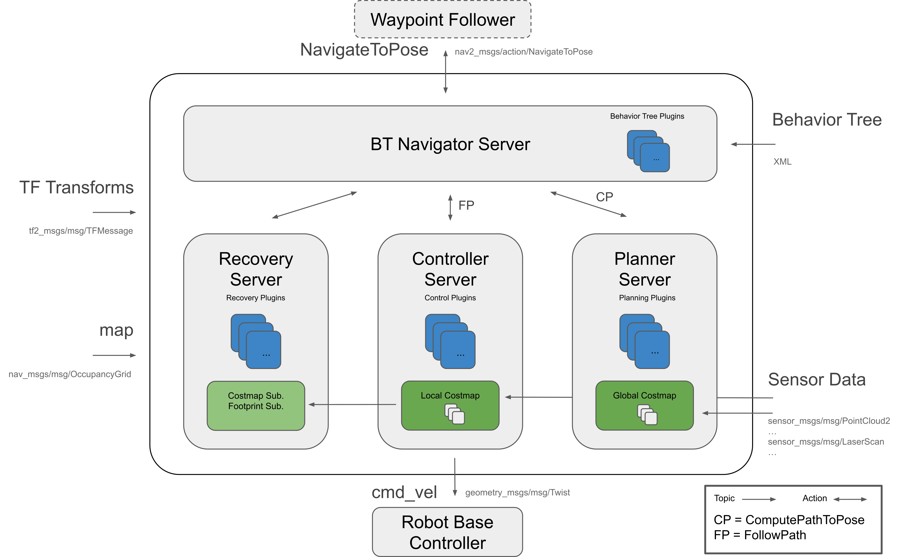

###### datetime:2024/01/10 18:18

###### author:nzb

# 导航

> https://github.com/ros-planning/navigation2.git
>
> 分支：humble
>
> 节点：3ed4c2d

# 行为树节点及其定义

- nav2_behavior_tree | 行为树服务器及节点插件定义
- nav2_bt_navigator | 导航行为树，单点和路点导航器，以及树xml文件
- nav2_behaviors | 导航行为，包括旋转，后退，等待等行为

## nav2_behavior_tree

### 基类或模板类

- **BehaviorTreeEngine**：行为树引擎（行为树执行器）
    - `BehaviorTreeEngine`：构造函数，入参插件列表，注册插件`factory_.registerFromPlugin`
    - `run`：以一个特定的频率执行行为树，参数有：行为树指针，循环函数，取消函数，和循环时间
        - 如果`cancelRequested()` -> `tree->rootNode()->halt()`
        - `tree->tickRoot()`
        - `onLoop()`
    - `createTreeFromText`：根据字符串创建树
    - `createTreeFromFile`：根据文件创建树
    - `haltAllActions`：停止所有树节点，为了重新运行行为树，我们必须能够将所有节点重置为初始状态
- **BtActionServer**：行为树动作服务器模板类，使用行为树执行动作的动作服务器
    - `BtActionServer`：构造函数，主要参数
        - `plugin_lib_names_`：插件列表
        - `on_goal_received_callback_`：用户提供的目标收到回调
        - `on_loop_callback_`：用户提供的循环中的回调
        - `on_preempt_callback_`：用户提供的抢占回调
        - `on_completion_callback_`：用户提供的动作完成回调
        - 初始化节点参数
    - `on_configure`：配置函数
        - 初始化节点`client_node_ = std::make_shared<rclcpp::Node>`
        - 初始化节点参数`global_frame -> map`
        - 初始化节点参数`robot_base_frame -> base_link`
        - 初始化节点参数`transform_tolerance -> 0.1`
        - 初始化服务`action_server_ = std::make_shared<nav2_util::SimpleActionServer<ActionT>>`，绑定回调函数`executeCallback`
        - 获取参数`bt_loop_duration`、`default_server_timeout`
        - 初始化行为树引擎`bt_ = std::make_unique<nav2_behavior_tree::BehaviorTreeEngine>(plugin_lib_names_)`
        - 创建黑板，设置黑板值
    - `on_activate`：激活函数，调用`action_server_->activate()`
    - `on_deactivate`：取消激活函数，调用`action_server_->deactivate()`
    - `on_cleanup`：清理函数，指针重置，黑板重置， 树停止`bt_->haltAllActions`
    - `loadBehaviorTree`：加载行为树
        - 读取xml内容
        - 创建树`bt_->createTreeFromText`，递归树黑板，设置黑板相关值
        - 创建树状态发布`topic_logger_ = std::make_unique<RosTopicLogger>`
    - `getBlackboard`：获取黑板指针
    - `getCurrentBTFilename`：获取当前行为树名称
    - `getDefaultBTFilename`：获取默认行为树名称
    - `acceptPendingGoal`：接收待定任务包装，调用`action_server_->accept_pending_goal()`
    - `terminatePendingGoal`：结束待定任务包装，调用`action_server_->terminate_pending_goal()`
    - `getCurrentGoal`：获取当前任务包装，调用`action_server_->get_current_goal()`
    - `getPendingGoal`：获取待定任务包装，调用`action_server_->get_pending_goal()`
    - `publishFeedback`：发布反馈包装，调用`action_server_->publish_feedback()`
    - `getTree`：获取树指针
    - `haltTree`：停止树
    - `executeCallback`：服务回调的执行函数
        - 执行`on_goal_received_callback_`，校验任务
        - 创建取消匿名回调`on_loop`和循环匿名回调`is_canceling`，**行为树执行**`bt_->run(&tree_, on_loop, is_canceling, bt_loop_duration_)`
        - 行为树执行结束，调用`bt_->haltAllActions(tree_.rootNode())`，确保树不在执行了
        - 执行`on_completion_callback_`
- **BtActionNode**：封装行为树`Action`的模板类
    - `ActionNodeBase`：构造函数
        - 获取参数`bt_loop_duration`、`server_timeout`
        - 创建客户端，调用`createActionClient`，`server_name`为入参或节点端口配置
    - `createActionClient`：创建ros动作客户端`action_client_`，调用`wait_for_action_server`失败抛异常
    - `providedBasicPorts`：基础端口，子类必须在`providedPorts`里面调用该方法，该方法里面提供`server_name`和`server_timeout`端口
    - `providedPorts`：子类可重写提供的端口函数，调用`providedBasicPorts`
    - `on_tick`：虚函数，用户重写，钩子函数
    - `on_wait_for_result`：虚函数，用户重写，钩子函数，执行中等待的时候，可能收到新的任务
    - `on_success`：虚函数，用户重写，钩子函数
    - `on_aborted`：虚函数，用户重写，钩子函数
    - `on_cancelled`：虚函数，用户重写，钩子函数
    - `tick`：
        - 空闲调用`on_tick`、`send_new_goal`
        - 运行中调用`is_future_goal_handle_complete`，小于`server_timeout`返回执行中，否则失败
        - 运行中调用`on_wait_for_result`，如果收到新的任务，调用`send_new_goal`和`is_future_goal_handle_complete`
        - 最后根据状态调用，`on_success`、`on_aborted`、`on_cancelled`、
    - `halt`：结束，调用`should_cancel_goal`和`action_client_->async_cancel_goal`
    - `should_cancel_goal`：是否需要取消任务
    - `send_new_goal`：发送任务
        - 调用`action_client_->async_send_goal(goal_, send_goal_options)`，其中的`send_goal_options`设置了`result_callback`
          和`feedback_callback`，都是匿名函数修改结果和反馈
    - `is_future_goal_handle_complete`：任务是否完成
    - `increment_recovery_count`：递增黑板中的重试值
- **BtCancelActionNode**：行为树取消`Action`节点模板类
    - `BtCancelActionNode`：构造函数
        - 获取参数`bt_loop_duration`、`server_timeout`
        - 创建客户端，调用`createActionClient`，`server_name`为入参或节点端口配置
    - `createActionClient`：创建ros动作客户端`action_client_`，调用`wait_for_action_server`失败抛异常
    - `providedBasicPorts`：基础端口，子类必须在`providedPorts`里面调用该方法，该方法里面提供`server_name`和`server_timeout`端口
    - `providedPorts`：子类可重写提供的端口函数，调用`providedBasicPorts`
    - `halt`：结束
    - `tick`：执行，调用`action_client_->async_cancel_goals_before`，取消当前时间10ms之前指定的所有目标，避免异步通信错误
- **BtServiceNode**：封装行为树`Action`的模板类，应该是`BtActionNode`的初版或早期版本，简化了很多
- **RosTopicLogger**：行为树节点状态变更发布器
    - `callback`：当节点状态变更时的回调
    - `flush`：状态数据发布

### 应用(节点插件)

## nav2_bt_navigator

### 基类或模板类

- **BtNavigator**：行为树导航类，继承于`nav2_util::LifecycleNode`，一个动作服务器，使用行为树将机器人导航到它的目标位置。重写`on_configure`、`on_activate`
  、`on_deactivate`、`on_cleanup`、`on_shutdown`方法
    - `BtNavigator`：构造函数，初始化声明`declare_parameter_if_not_declared`参数，`plugin_lib_names`，`transform_tolerance`
      、`global_frame`、`robot_base_frame`、`odom_topic`，`plugin_libs`来源于`nav2_behavior_tree`
    - `on_configure`
        - 初始化`tf2_ros::TransformListener`，以便节点中可以使用`tf`转换
        - 初始化单点导航`pose_navigator_ = nav2_bt_navigator::NavigateToPoseNavigator`
        - 初始化多点导航`poses_navigator_ = nav2_bt_navigator::NavigateThroughPosesNavigator`
        - 初始化里程计平滑器`nav2_util::OdomSmoother`，用于获取当前速度
        - 调用`pose_navigator_`和`poses_navigator_`的`on_configure`
    - `on_activate`
        - 调用`pose_navigator_`和`poses_navigator_`的`on_activate`
        - 调用`createBond`
    - `on_deactivate`
        - 调用`pose_navigator_`和`poses_navigator_`的`on_deactivate`
        - 调用`destroyBond`
    - `on_cleanup`
        - 调用`pose_navigator_`和`poses_navigator_`的`on_cleanup`
        - `pose_navigator_`和`poses_navigator_`重置
    - `on_shutdown`
    - 代码末尾`RCLCPP_COMPONENTS_REGISTER_NODE(nav2_bt_navigator::BtNavigator)`
        - 注册组件，这充当一种入口点，允许组件的库被发现并加载到正在运行的进程中。
- **NavigatorMuxer**：导航复用器类，一次只允许处理一个插件来控制 BT 导航器的状态。
    - `isNavigating`：是否有一个导航任务在处理
    - `startNavigating`：使用给定的导航器开始导航
    - `stopNavigating`：停止给定的导航器
- **Navigator**：导航器接口模板类，充当所有基于导航器操作插件的基类
    - `on_configure`：设置导航器行为树和操作配置
        - 设置属性：`NavigatorMuxer`的实例`plugin_muxer_`
        - 调用`getDefaultBTFilepath`
        - 实例化`bt_action_server_=nav2_behavior_tree::BtActionServer`，绑定`onGoalReceived`、`onLoop`、`onPreempt`
          、`onCompletion`，注意区分，是`nav2_behavior_tree::BtActionServer`不是`BtNavigator`
        - 调用`bt_action_server_->on_configure()`方法
        - 调用`bt_action_server_->getBlackboard()`方法获取黑板，设置一些参数
        - 调用`configure`方法
    - `on_activate`：激活
        - 调用`bt_action_server_->on_activate()`
        - 调用`activate()`
    - `on_deactivate`
        - 调用`bt_action_server_->on_deactivate()`
        - 调用`deactivate()`
    - `on_cleanup`
        - 调用`bt_action_server_->on_cleanup()`
        - 调用`cleanup()`
    - `configure`：虚函数
    - `cleanup`：虚函数
    - `activate`：虚函数
    - `deactivate`：虚函数
    - `getName()`：纯虚函数
    - `getDefaultBTFilepath()`：纯虚函数
    - `goalReceived()`：纯虚函数，动作服务器收到新目标时调用的回调，可用于检查目标是否有效并赋值
    - `onLoop()`：纯虚函数，定义在 BT 的一次迭代中发生的执行的回调，可用于发布行动反馈
    - `onPreempt()`：纯虚函数，请求抢占时调用的回调
    - `goalCompleted()`：纯虚函数，行动完成时的回调
    - `getActionServer()`：获取`action_server`的指针
    - `onGoalReceived()`：多路复用器导航器的中间目标接收功能
        - 调用`goalReceived`
        - 调用`plugin_muxer_->startNavigating`
    - `onCompletion`
        - 调用`plugin_muxer_->stopNavigating`
        - 调用`goalCompleted`

### 实现或应用

- **NavigateToPoseNavigator**：单点导航器，继承于`nav2_bt_navigator::Navigator`
    - `configure`
        - 初始化节点参数及黑板键`goals_blackboard_id -> goal`
        - 初始化节点参数及黑板键`path_blackboard_id -> path`
        - 创建`navigate_to_pose`动作客户端，`self_client_ = rclcpp_action::create_client`
        - 订阅`goal_pose`话题，回调`onGoalPoseReceived`
    - `getDefaultBTFilepath`：获取当前导航器默认的行为树配置
    - `cleanup`：清理，指针重置
    - `goalReceived`：动作服务器收到新目标时调用的回调，可用于检查目标是否有效并赋值
        - 调用`bt_action_server_->loadBehaviorTree`
        - 调用`initializeGoalPose`
    - `onLoop()`：定义在 BT 的一次迭代中发生的执行的回调，可用于发布行动反馈
        - 计算当前剩余距离：根据当前位置，在全局路径上找到最近的点的索引`nav2_util::geometry_utils::euclidean_distance`
          ，计算剩余路径长`nav2_util::geometry_utils::calculate_path_length`
        - 计算预估剩余时间：如果当前速度大于1cm/s并且还剩10cm，则计算预估剩余时间
        - 调用`bt_action_server_->publishFeedback`发布反馈
    - `onPreempt()`：请求抢占时调用的回调
        - 调用`initializeGoalPose(bt_action_server_->acceptPendingGoal());`条件
            - 如果挂起的目标请求与当前目标相同，则接受挂起的目标
            - 如果挂起的目标有一个空的behavior_tree字段，并且当前目标是正在运行默认 BT 文件，则接受待处理的目标
        - 否则调用`bt_action_server_->terminatePendingGoal();`
            - 请求的目标跟当前执行的不一样的xml文件，需要取消上一个目标，再发起新的目标请求
    - `goalCompleted()`：行动完成时的回调
    - `onGoalPoseReceived`：用于处理来自`rviz`发布的基于主题的目标的订阅和回调
        - `self_client_->async_send_goal`发送目标
    - `getName`：导航器名称，`navigate_to_pose`
    - `initializeGoalPose`：更新行为树黑板上的目标位姿
- **NavigateThroughPosesNavigator**：路点导航器，用于导航到一堆中间姿势的导航器，跟单点导航大差不差，继承于`nav2_bt_navigator::Navigator`
    - `configure`
        - 初始化节点参数及黑板键`goals_blackboard_id -> goals`
        - 初始化节点参数及黑板键`path_blackboard_id -> path`
    - `getName`：导航器名称，`navigate_through_poses`
    - `getDefaultBTFilepath`：获取当前导航器默认的行为树配置
    - `goalReceived`：动作服务器收到新目标时调用的回调，可用于检查目标是否有效并赋值
        - 调用`bt_action_server_->loadBehaviorTree`
        - 调用`initializeGoalPose`
    - `onLoop()`：定义在 BT 的一次迭代中发生的执行的回调，可用于发布行动反馈
        - 计算当前剩余距离：根据当前位置，在全局路径上找到最近的点的索引`nav2_util::geometry_utils::euclidean_distance`
          ，计算剩余路径长`nav2_util::geometry_utils::calculate_path_length`
        - 计算预估剩余时间：如果当前速度大于1cm/s并且还剩10cm，则计算预估剩余时间
        - 调用`bt_action_server_->publishFeedback`发布反馈
    - `onPreempt()`：请求抢占时调用的回调
        - 调用`initializeGoalPose(bt_action_server_->acceptPendingGoal());`条件
            - 如果挂起的目标请求与当前目标相同，则接受挂起的目标
            - 如果挂起的目标有一个空的behavior_tree字段，并且当前目标是正在运行默认 BT 文件，则接受待处理的目标
        - 否则调用`bt_action_server_->terminatePendingGoal();`
            - 请求的目标跟当前执行的不一样的xml文件，需要取消上一个目标，再发起新的目标请求
    - `goalCompleted`：行动完成时的回调
    - `initializeGoalPose`：更新行为树黑板上的目标位姿数组

## nav2_behaviors

### 基类或模板类

- **BehaviorServer**：托管行为插件的服务器，继承于`nav2_util::LifecycleNode`
    - `BehaviorServer`：构造函数
        - 声明节点参数
            - `costmap_topic`->`local_costmap/costmap_raw`
            - `footprint_topic`->`local_costmap/published_footprint`
            - `cycle_frequency`->`10.0`
            - `behavior_plugins`->`"spin", "backup", "drive_on_heading", "wait"`
            - 设置上面4个插件信息，例如：`spin.plugin`->`nav2_behaviors/Spin`
            - `global_frame`->`odom`
            - `robot_base_frame`->`base_link`
            - `transform_tolerance`->`0.1`
    - `on_configure`
        - 初始化`transform_listener_`
        - 实例化订阅服务实例
            - 初始化代价地图话题`nav2_costmap_2d::CostmapSubscriber`订阅`/local_costmap/costmap_raw`
            - 初始化小车位姿话题`nav2_costmap_2d::FootprintSubscriber`订阅`/local_costmap/published_footprint`：基于`odom`
              多边形的多边形数据，用于碰撞检测
        - 初始化碰撞检测`nav2_costmap_2d::CostmapTopicCollisionChecker`实例，需要上面2个订阅服务实例
        - 调用`loadBehaviorPlugins`加载创建插件`nav2_core::Behavior`实例并调用插件的`configure`方法
    - `on_activate`
        - 遍历插件并调用插件的`activate`方法
        - 调用`createBond()`，创建 `bond` 连接，用于发布节点的健康状态
    - `on_deactivate`
        - 遍历插件并调用插件的`deactivate`方法
        - 调用`destroyBond`，销毁 `bond` 连接
    - `on_cleanup`
        - 遍历插件并调用插件的`cleanup`方法
        - 资源释放
    - `on_shutdown`

- **TimedBehavior**模板类，继承于`nav2_core::Behavior`，定时行为, 是一种行为模式，用于定义在特定时间间隔内执行的行为。它是基于行为树（Behavior
  Tree）框架的一部分，用于控制机器人或系统的行为
    - `onRun`：纯虚函数，进入主循环时会被调一次，可以用于检查等
    - `onCycleUpdate`：纯虚函数，当返回`RUNNING`时，`execute`会循环调用
    - `onConfigure`：虚函数
    - `onCleanup`：虚函数
    - `onActionCompletion`：虚函数
    - `configure`：`BehaviorServer`的`on_configure`的时候调用
        - 创建对应的动作服务`nav2_util::SimpleActionServer`，绑定`execute`
        - 创建`cmd_vel`话题发布者
        - 调用`onConfigure`
    - `cleanup`：资源释放，调用`onCleanup`
    - `activate`
        - `vel_pub_->on_activate();`
        - `action_server_->activate();`
    - `deactivate`
        - `vel_pub_->on_deactivate();`
        - `action_server_->deactivate();`
    - `execute`：`nav2_util::SimpleActionServer`回调
        - 调用`onRun`、`onCycleUpdate`、`onActionCompletion`等函数
    - `stopRobot`：停车，`vel_pub`发布速度置为0

### 实现和插件

- `Spin`：旋转到目标角度插件类，继承于`TimedBehavior`
    - `onConfigure`：初始化旋转参数
        - `simulate_ahead_time` -> `2.0`
        - `max_rotational_vel` -> `1.0`
        - `min_rotational_vel` -> `0.4`
        - `rotational_acc_lim` -> `3.2`
    - `onRun`：校验是否能拿到当前坐标和旋转的所花时间
    - `onCycleUpdate`：
        - 是否旋转超时
        - 更新发布已经旋转过的角度
        - 计算旋转速度，并调用`isCollisionFree`模拟旋转检测是否无碰撞，最后通过`vel_pub_`发布速度
    - `isCollisionFree`：模拟小车旋转碰撞检测，调用`collision_checker_`的`isCollisionFree`检测是否碰撞
- `DriveOnHeading`：插件类，继承于`TimedBehavior`，是使机器人以当前的航向方向行驶前进和后退。
    - `onRun`：校验速度方向和要走的距离是否相同以及是否能拿到当前坐标和执行所花时间
    - `onCycleUpdate`：
        - 是否执行超时
        - 更新发布已经走过的距离
        - 计算剩余距离，并调用`isCollisionFree`模拟执行，检测是否无碰撞，最后通过`vel_pub_`发布速度
    - `isCollisionFree`：模拟小车旋转碰撞检测，调用`collision_checker_`的`isCollisionFree`检测是否碰撞
        - `cycle_frequency_`：循环频率，单位hz
        - `simulate_ahead_time_`：模拟时间，单位s
        - `cycle_count / this->cycle_frequency_`：时间，单位s
    - `onConfigure`：初始化旋转参数
        - `simulate_ahead_time` -> `2.0`
- `BackUp`：插件类，继承于`DriveOnHeading`，用于处理机器人在导航过程中遇到障碍物或无法到达目标位置的情况。当机器人无法按照规划的路径前进时，`BackUp`
  模块会尝试执行倒车操作，即使机器人后退一段距离，然后尝试重新规划路径以绕过障碍物或重新计算到达目标的路径。
    - `onRun`：校验是否能拿到当前坐标和执行所花时间，前置把距离和速度置为负
- `Wait`：等待插件类，继承于`TimedBehavior`，持续反馈剩余时间，到了给定时间，返回`SUCCEEDED`，否则返回`RUNNING`，其余啥也不做，可以用于等待外设或其他交互