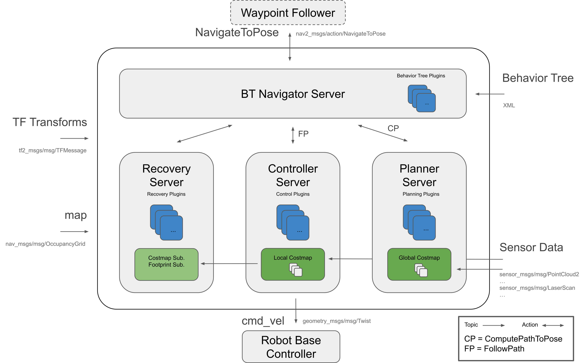
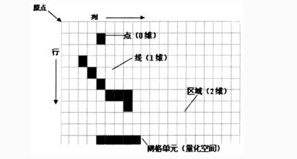

###### datetime:2024/01/10 18:18

###### author:nzb

# 导航

> https://github.com/ros-planning/navigation2.git
>
> 分支：humble
>
> 节点：3ed4c2d



# 地图和定位

- `nav2_map_server` ｜ 地图服务器
- `nav2_costmap_2d` ｜ 2D代价地图
- `nav2_voxel_grid` | 实现体素栅格的类
- `nav2_amcl` | 自适应蒙特卡洛定位。 状态估计，输入地图、激光、里程计数据，输出机器人map和odom之间的位姿关系。

## nav2_map_server

### 工具

- `loadMapYaml`：加载和解析给定的地图yaml文件参数，包括地图文件名，分辨率，地图原点，空闲阈值，占据阈值，模式，
- `loadMapFromFile`：从地图文件加载地图图像以及生成占用网格
- `loadMapFromYaml`：加载地图 YAML、地图文件中的图像以及生成占用网格`nav_msgs::msg::OccupancyGrid`返回
    - 调用`loadMapYaml`
    - 调用`loadMapFromFile`
- `saveMapToFile`：保存占据地图到文件
    - 调用`checkSaveParameters`
    - 调用`tryWriteMapToFile`
- `checkSaveParameters`：检查地图保存参数
- `tryWriteMapToFile`：分类型把地图写入文件，包括`Trinary`、`Scale`和`Raw`

```text
for (size_t y = 0; y < map.info.height; y++) {
  for (size_t x = 0; x < map.info.width; x++) {
    int8_t map_cell = map.data[map.info.width * (map.info.height - y - 1) + x];
    
nav_msgs::msg::OccupancyGrid 的data的是一维数组，其结构为

            |——————————————————————————————————> x(width)
            | (0,0) (0,1) (0,2) (0,3) ...  (0, w)
            | (1,0) (1,1)     ...
            |                 ...
            |                 ...
            | (h,0)           ...          (h, w)
  y(height) v
    
    data的数据排序为：[(0,0) ... (0,w) ... (h,0) ... (h, w)]
    
    比如width * height =5 * 4的20个元素，下图是索引表
  
 
  y(height) ^
            | 0   1   2   3   4 
            | 5   6   7   8   9
            | 10  11  12  13  14
            | 15  16  17  18  19
            |————————————————————> x(width)
    
    idx = width * (height - y - 1) + x
    y(height) = 0
        x(width) = 0, idx = 5 * (4 - 0 -1 ) + 0 = 15 
        x = 1, idx = 5 * (4 - 0 -1 ) + 1 = 16 
        x = 2, idx = 5 * (4 - 0 -1 ) + 2 = 17 
        x = 3, idx = 5 * (4 - 0 -1 ) + 3 = 18 
        x = 4, idx = 5 * (4 - 0 -1 ) + 4 = 19 
    y(height) = 1
        x(width) = 0, idx = 5 * (4 - 1 -1 ) + 0 = 10
        x = 1, idx = 5 * (4 - 1 -1 ) + 1 = 11 
        x = 2, idx = 5 * (4 - 1 -1 ) + 2 = 12 
        x = 3, idx = 5 * (4 - 1 -1 ) + 3 = 13 
        x = 4, idx = 5 * (4 - 1 -1 ) + 4 = 14 
    
    ... 
    
    y(height) = 3
        x(width) = 0, idx = 5 * (4 - 3 -1 ) + 0 = 0
        x = 1, idx = 5 * (4 - 3 -1 ) + 1 = 1
        x = 2, idx = 5 * (4 - 3 -1 ) + 2 = 2 
        x = 3, idx = 5 * (4 - 3 -1 ) + 3 = 3 
        x = 4, idx = 5 * (4 - 3 -1 ) + 4 = 4 
```

### 主要的类

- **MapServer**：解析地图yaml文件以及提供一个服务和一个话题发布占据网格地图，继承于`nav2_util::LifecycleNode`
    - `MapServer`：
        - 初始化节点`map_server`
        - 声明节点参数
            - `yaml_filename` -> `rclcpp::PARAMETER_STRING`
            - `topic_name` -> `map`
            - `frame_id` -> `map`
        - 创建一个`occ_service_`的`节点名称/map`的服务，绑定`getMapCallback`
        - 创建一个`occ_pub_`的`map`的发布话题
        - 创建一个`load_map_service_`的`节点名称/load_map`的服务，绑定`loadMapCallback`
    - `on_configure`：
        - 调用`loadMapResponseFromYaml`
        - 调用`updateMsgHeader`
    - `on_activate`：
        - `occ_pub_->on_activate()`
        - `occ_pub_->publish()`
        - `createBond()`
    - `on_deactivate`：
        - `occ_pub_->on_deactivate()`
        - `destroyBond()`
    - `on_cleanup`：属性重置
    - `on_shutdown`：
    - `loadMapResponseFromYaml`：加载地图yaml和图像，以及生成包含 `OccupancyGrid` 的输出响应。
    - `updateMsgHeader`：更新`msg`头信息，更新加载时间和帧id
    - `getMapCallback`：获取地图服务`map`的回调，返回最新的地图
    - `loadMapCallback`：更新加载地图服务`load_map`的回调
        - 调用`loadMapResponseFromYaml`，重新加载地图
        - 话题发布最新地图

- **MapSaver**：提供地图保存方法和服务的类，继承于`nav2_util::LifecycleNode`
    - `MapSaver`：
        - 初始化节点`map_saver`
        - 声明节点参数
            - `save_map_timeout` -> `2.0`
            - `free_thresh_default` -> `0.25`
            - `occupied_thresh_default` -> `0.65`
            - `map_subscribe_transient_local` -> `true`
    - `saveMapTopicToFile`：从地图话题读取信息并且保存到一个文件
        - 参数校验
        - 创建`map`(默认)名称的地图话题订阅
        - 调用`saveMapToFile`
    - `on_configure`：
        - 获取上述节点参数
        - 创建`save_map_service_`保存地图服务`节点名称/save_map`，绑定`saveMapCallback`
    - `on_activate`：调用`createBond()`
    - `on_deactivate`：调用`destroyBond()`
    - `on_cleanup`：属性重置
    - `on_shutdown`：
    - `saveMapCallback`：地图保存服务回调
        - 初始化保存地图参数
        - 调用`saveMapTopicToFile`

- **map_saver_cli**：可执行文件用于保存地图文件
    - `parse_arguments`：解析命令行参数
    - `main`：主函数
        - 调用`parse_arguments`
        - 实例化`map_saver = std::make_shared<nav2_map_server::MapSaver>()`
        - 调用`map_saver->on_configure`启动`map_saver`节点
        - 调用`map_saver->saveMapTopicToFile`保存地图文件

- **CostmapFilterInfoServer**：代价地图过滤器信息服务器，继承于`nav2_util::LifecycleNode`
    - `CostmapFilterInfoServer`
        - 初始化节点`costmap_filter_info_server`
        - 声明节点参数
            - `filter_info_topic` -> `costmap_filter_info`
            - `type` -> `0`
            - `mask_topic` -> `filter_mask`
            - `base` -> `0.0`
            - `multiplier` -> `1.0`
    - `on_configure`
        - 创建`costmap_filter_info`话题`publisher_ = this->create_publisher`，发布代价地图过滤器信息
    - `on_activate`
        - 调用`publisher_->on_activate()`
        - 调用`publisher_->publish`
        - 调用`createBond()`
    - `on_deactivate`
        - 调用`publisher_->on_deactivate()`
        - 调用`destroyBond()`
    - `on_cleanup`
    - `on_shutdown`

## nav2_voxel_grid

> TODO，先了解工作流以及有哪些功能，具体实现需要再深入，比较难懂

### 什么是体素(Voxel)?


题图中是3D数据的不同表示类型:

- a)、点云（Point clouds）；点云是三维空间(xyz坐标)点的集合。
- b)、体素网格(Voxel grids)；体素是3D空间的像素。量化的，大小固定的点云。每个单元都是固定大小和离散坐标。
- c) 多边形网格(Polygon meshes)；mesh是面片的集合。
- d) 多视图表示(Multi-view representations)；多视图表示是从不同模拟视点渲染的2D图像集合。

为了解释体素网格(Voxel grid),首先我们要了解占据栅格地图（Occupancy Grid Map）



画一个二维网格，每个网格单元里有实体的话就为占据状态（1），空的话就为（0）。很好理解。

而体素就是固定分辨率的三维栅格地图。


体素网格是固定分辨率的，与之对应可变分辨率的网格叫八叉树地图(Octomap)。


图左是八叉树地图(Octomap)，图右是八叉树(Octotree)。

总结：

- 体素网格是用固定大小的立方块作为最小单元，来表示三维物体的一种数据结构。
- 体素可以看成粗略版的点云。

### 主要的类

- **VoxelGrid**
    - `VoxelGrid`：仅支持z<=16
        - ` ~((uint32_t)0) >> 16` 表示32位二进制中所有位都为1的数，然后通过右移16位操作 (>> 16) 来将高16位设置为1，低16位设置为0
            - `~0`：得到全1
            - 等于`python`的`unknown_col = 0xFFFFFFFF >> 16`
            - 结果：`0b00000000000000001111111111111111`
    - `resize`：调整体素网格的尺寸
    - `reset`：重置体素网格
    - `getData`：返回指向表示体素网格的数据数组的指针
    - `markVoxel`：操作单个体素。它们检查边界并执行标记或检查阈值等操作
        - `full_mask = ((uint32_t)1 << z << 16) | (1 << z);`：注意：`z<=16`
        - `data_[y * size_x_ + x] |= full_mask`：标记或清错
    - `markVoxelInMap`：操作单个体素。它们检查边界并执行标记或检查阈值等操作
        - `marked_bits = (*col |= full_mask) >> 16`，然后调用`bitsBelowThreshold`
    - `clearVoxel`：操作单个体素。它们检查边界并执行清除或检查阈值等操作，`data_[y * size_x_ + x] &= ~(full_mask);`
    - `clearVoxelInMap`：检查边界并执行清除或检查阈值等操作，并**重置代价地图**
        - `*col &= ~(full_mask);`
        - `unknown_bits = uint16_t(*col >> 16) ^ uint16_t(*col);`
        - `marked_bits = *col >> 16`
        - `bitsBelowThreshold(unknown_bits, 1) && bitsBelowThreshold(marked_bits, 1)` -> `costmap[index] = 0;`
    - `clearVoxelColumn`：清除指定索引的体素
    - `bitsBelowThreshold`：查看位数是否低于阈值
    - `numBits`：计算一个数有多少个bit位是1，使用了一种称为`Brian Kernighan's Algorithm`的方法，它通过反复清除 `n` 中的最低位的1来计算1的个数。
      算法的思路是每次清除最低位的1，然后计数器增加1，直到 `n` 变成0。最终，函数返回整数 `n` 中位为1的个数。这个算法的优势在于它只需要循环次数等于 `n` 中位为1的个数，而不是整个32位。
    - `getVoxel`：获取指定坐标处的体素状态（静态方法）
        - `result = data[y * size_x + x] & full_mask;`
        - `bits = numBits(result)`
        - `known marked: 11 = 2 bits, unknown: 01 = 1 bit, known free: 00 = 0 bits`
    - `markVoxelLine`：用于在网格中标记或清除一条体素线的函数
        - 实例化函数对象`MarkVoxel`
        - 调用`raytraceLine`
    - `clearVoxelLine`：用于在网格中标记或清除一条体素线的函数，实例化函数对象`MarkVoxel`，调用`raytraceLine`
    - `clearVoxelLineInMap`：用于在网格中标记或清除一条体素线的函数
        - 如果没有代价地图，调用`clearVoxelLine`
        - 否则实例化函数对象`ClearVoxelInMap`
        - 调用`raytraceLine`
    - `getVoxel`：获取指定坐标处的体素状态（非静态方法）
    - `getVoxelColumn`：用于获取指定 `(x, y)` 上的体素状态
    - `printVoxelGrid`：用于调试的打印体素网格或网格列的函数
    - `printColumnGrid`：用于调试的打印体素网格或网格列的函数
    - `sizeX`：返回体素网格的尺寸
    - `sizeY`：返回体素网格的尺寸
    - `sizeZ`：返回体素网格的尺寸
    - `raytraceLine`：模板函数，在体素网格中执行射线跟踪，沿着线标记或清除体素
        - 实例化`GridOffset`、`ZOffset`
        - 根据数据状况调用`bresenham3D`
    - `bresenham3D`：`Bresenham` 算法在三维空间中的实现，最后调用`MarkVoxel`实例函数更新体素状态
    - `sign`：签名，大于0，返回1，否则返回-1
    - `max`：最大值
    - 函数对象(类，实现可调用的方法`()`)
        - `MarkVoxel`：标记：`data_[offset] |= z_mask;`
        - `ClearVoxel`：清除：`data_[offset] &= ~(z_mask)`
        - `ClearVoxelInMap`：清除并**重置代价地图**：类似上面的`clearVoxelInMap`
        - `GridOffset`：更新偏移量
        - `ZOffset`：如果 `offset_val` 大于0，则执行左移操作 `z_mask_ <<= 1`；否则，执行右移操作 `z_mask_ >>= 1`

用于标记、清除和更新偏移量的函数对象。

## nav2_costmap_2d

### 主要的类和节点

- **Layer**：抽象类，用于分层成本图插件实现的抽象类
    - `initialize`：
        - 在`startup`初始化处理代价地图，关键参数`LayeredCostmap * parent`父类指针
        - 初始化相关属性
        - 调用`onInitialize`
    - `deactivate`：虚函数，停止发布
    - `activate`：虚函数，如果停止了，重新发布
    - `reset`：纯虚函数，重置代价地图
    - `isClearable`：纯虚函数，是否应在该层进行清除操作
    - `updateBounds`：纯虚函数，被`LayeredCostmap`调用，轮询看有多少代价地图需要更新边界
    - `updateCosts`：纯虚函数，实际更新底层成本图，仅在 `UpdateBounds()` 期间计算的范围内
    - `matchSize`：虚函数，实现这个以使该层与父代价地图的大小匹配
    - `onFootprintChanged`：虚函数，当`footprint`改变时`LayeredCostmap`调用，由`LayeredCostmap::setFootprint()`触发，重写这个以便通知`footprint`
      改变
    - `getName`：获取代价地图名称
    - `isCurrent`：检查以确保图层中的所有数据都是最新的。
    - `isEnabled`：返回代价地图是否启用
    - `getFootprint`：便捷函数`layered_costmap_->getFootprint()`
    - `declareParameter`：`ROS`参数的便捷函数
    - `hasParameter`：`ROS`参数的便捷函数
    - `getFullName`：`ROS`参数的便捷函数，`std::string(name_ + "." + param_name);`
    - `onInitialize`：虚函数，`initialize`结尾调用，子类可以重写该函数，初始化相关操作

- **LayeredCostmap**：实例化不同层插件并将它们聚合成一个分数
    - 主要属性
        - `Costmap2D primary_costmap_, combined_costmap_`
            - `primary_costmap_`：是启用`costmap`过滤器时插件使用的底部`costmap`。
            - `combined_costmap_`：是最终成本图，其中插件和过滤器（如果有）产生的所有结果的合并
            - 分离的目的是避免插件和过滤器之间工作的干扰
            - `primay_costmap_`和`combined_costmap_`具有相同的大小、原点和默认值。
        - 代价地图插件数组`std::vector<std::shared_ptr<Layer>> plugins_;`
        - 地图过滤器数组`std::vector<std::shared_ptr<Layer>> filters_;`
    - `updateMap`：更新地图，如果你想在循环外更新，你可以调用该函数随时更新地图
        - 如果配置了代价地图跟随移动，则调用`primary_costmap_.updateOrigin`和`combined_costmap_.updateOrigin`
        - 如果没有插件和地图过滤器返回
        - 否则遍历插件和过滤器，调用对应的`updateBounds`
        - 调用`combined_costmap_.worldToMapEnforceBounds`确定代价地图边界大小
        - 有没有代价地图过滤器插件
            - 没有：调用`combined_costmap_.resetMap`，遍历地图插件，调用插件的`updateCosts(combined_costmap_, x0, y0, xn, yn)`
            - 有
                - 调用`primary_costmap_.resetMap`，遍历地图插件，调用插件的`updateCosts(primary_costmap_, x0, y0, xn, yn)`
                - 调用`combined_costmap_.copyWindow(primary_costmap_, x0, y0, xn, yn, x0, y0)`
                    - 将处理后的代价图窗口复制到最终代价图，`primary_costmap_`是启用`costmap`过滤器时插件使用的底部`costmap`。
                    - `primary_costmap_` 保持不变，以供插件进一步使用
                - 遍历地图过滤器插件，调用`updateCosts(combined_costmap_, x0, y0, xn, yn)`，在插件上应用过滤器，以便插件在下次 `updateMap()`
                  调用时不考虑过滤器的工作
    - `getGlobalFrameID`：获取地图帧ID
    - `resizeMap`：重新设置地图的原点，大小和分辨率
        - 调用`primary_costmap_.resizeMap`
        - 调用`combined_costmap_.resizeMap`
        - 遍历代价地图和地图过滤器数组，调用其`matchSize`方法
    - `getUpdatedBounds`：获取更新的地图边界大小
    - `isCurrent`：是否所有地图都是最新数据，迭代地图插件和过滤器插件，调用`current_ && ((*plugin)->isCurrent() || !(*plugin)->isEnabled())`
    - `getCostmap`：获取主地图`combined_costmap_`指针
    - `isRolling`：成本图是否应该与机器人一起移动
    - `isTrackingUnknown`：成本图是否追踪未知区域
    - `getPlugins`：获取代价地图插件数组指针
    - `getFilters`：获取代价地图过滤器插件数组指针
    - `addPlugin`：添加代价地图插件到对应数组
    - `addFilter`：添加代价地图过滤器插件到对应数组
    - `isSizeLocked`：返回代价地图是否锁了
    - `getBounds`：获取代价地图边界
    - `isInitialized`：代价地图是否初始化完成
    - `setFootprint`：更新足迹`footprint`，更新外接的和内切半径
        - 调用`nav2_costmap_2d::calculateMinAndMaxDistances`获取内径和外径
        - 调用代价地图和地图过滤器插件`Layer`的`onFootprintChanged()`
    - `getFootprint`：返回最后一个`footprint`
    - `getCircumscribedRadius`：获取外径圆，在`setFootprint`内更新值
    - `getInscribedRadius`：获取内径圆，在`setFootprint`内更新值
    - `isOutofBounds`：机器人是否超出边界，`!combined_costmap_.worldToMap(robot_x, robot_y, mx, my)`

- **Costmap2D**：2D代价地图，提供世界坐标系上的点及其对应的代价映射
    - `Costmap2D`：构造函数，根据参数创建，调用`initMaps`和`resetMaps`
    - `Costmap2D`：拷贝构造函数，根据已有地图拷贝创建
    - `Costmap2D`：构造函数，根据占据网格数据创建
    - `copyCostmapWindow`：把传入的代价地图拷贝一份指定窗口大小的副本
    - `copyWindow`：传入的代价地图指定窗口大小，然后覆盖到当前代价地图的指定位置（大小）
    - `getCost`：指定`x，y`返回代价地图对应的值
    - `getCost`：指定索引返回代价地图对应的值
    - `setCost`：设置指定`x，y`的代价
    - `mapToWorld`：代价地图坐标转换世界坐标
    - `worldToMap`：世界坐标转换代价地图坐标
    - `worldToMapNoBounds`：世界坐标转换代价地图坐标，不校验边界
    - `worldToMapEnforceBounds`：世界坐标转换代价地图坐标，校验边界
    - `getIndex`：指定`x，y`返回索引，`my * size_x_ + mx`
    - `indexToCells`：索引返回`x，y`, `my = index / size_x_; mx = index - (my * size_x_);`
    - `getCharMap`：返回代价地图指针
    - `getSizeInCellsX`：返回`x`的单元大小
    - `getSizeInCellsY`：返回`y`的单元大小
    - `getSizeInMetersX`：返回`x`方向的长度，单位m，`(size_x_ - 1 + 0.5) * resolution_;`
    - `getSizeInMetersY`：返回`x`方向的长度，单位m
    - `getOriginX`：返回地图原点`x`
    - `getOriginY`：返回地图原点`y`
    - `getResolution`：返回分辨率
    - `setDefaultValue`：设置代价地图的默认值
    - `getDefaultValue`：获取代价地图的默认值
    - `setConvexPolygonCost`：设置指定凸边形中的代价值
    - `polygonOutlineCells`：获取构成多边形轮廓的地图单元格
    - `convexFillCells`：获取填充凸多边形填充的单元格
    - `updateOrigin`：虚函数，将成本图的原点移动到新位置
    - `saveMap`：保存代价地图到pgm文件
    - `resizeMap`：重置代价地图，调用`initMaps`和`resetMaps`
    - `resetMap`：重置代价地图边界，调用`resetMapToValue`
    - `resetMapToValue`：重置代价地图代价值
    - `cellDistance`：给定世界坐标系的距离长度，返回代价地图中的距离长度
    - `getMutex`：获取可重入锁
    - `copyMapRegion`：模板函数，将源地图的区域复制到目标地图
    - `deleteMaps`：虚函数，删除地图，包括代价地图，静态地图和markers数据结构
    - `resetMaps`：虚函数，重置代价地图和静态地图到默认值
    - `initMaps`：虚函数，初始化代价地图，静态地图和markers数据结构
    - `raytraceLine`：模板函数，在体素网格中执行射线跟踪
    - `bresenham2D`：模板函数，2D`Bresenham` 算法
    - `sign`：`x > 0 ? 1.0 : -1.0`
    - 函数对象(类，实现可调用的方法`()`)
        - `MarkCell`：代价地图赋值
        - `PolygonOutlineCells`：多边形数组，根据索引返回多边形的单元格坐标数组

- **CostmapLayer**：代价地图插件层的基类，继承于`Layer`、`Costmap2D`
    - `CostmapLayer`
    - `isDiscretized`：代价地图是否是离散的
    - `matchSize`：虚函数，匹配(适配)主成本图的大小，调用`Costmap2D.resizeMap`传入主代价地图的相关参数
    - `clearArea`：虚函数，清除代价图中给定维度的区域，如果反转，则清除给定维度之外的所有内容
    - `addExtraBounds`：如果外部源更改了代价地图中的值，则应调用此方法，以确保代价地图也包含该区域。
    - `updateWithTrueOverwrite`：把当前代价地图的给定区域的值，更新到主代价地图`master_grid`上，所有值都更新
    - `updateWithOverwrite`：把当前代价地图的给定区域的值，更新到主代价地图`master_grid`上，除了`NO_INFORMATION`，其他值都更新
    - `updateWithMax`：把当前代价地图的给定区域的值，更新到主代价地图`master_grid`上，如果当前代价地图是`NO_INFORMATION`跳过，如果主代价地图为`NO_INFORMATION`
      或主代价地图的值小于当前代价地图的值，则更新
    - `updateWithAddition`：把当前代价地图的给定区域的值，更新到主代价地图`master_grid`上，如果当前代价地图是`NO_INFORMATION`跳过，如果主代价地图为`NO_INFORMATION`
      更新为当前代价地图的值，如果主代价地图的值加当前代价地图的值大于大于`nav2_costmap_2d::INSCRIBED_INFLATED_OBSTACLE`
      ，则更新为`nav2_costmap_2d::INSCRIBED_INFLATED_OBSTACLE - 1`，否则更新为两者的和
    - `touch`：更新参数中指定的边界框以包含位置 `(x,y)`
    - `useExtraBounds`：更新参数中指定的边界框，包含来自调用的`addExtraBounds`边界值，如果未调用`addExtraBounds`则该函数啥也不做，该函数应该在`updateBounds`刚开始的时候调用

- **FootprintCollisionChecker**：碰撞检测模板类，模板参数是`nav2_costmap_2d::Costmap2D`，在代价地图上碰撞检测检测
    - `FootprintCollisionChecker`：
    - `footprintCost`：返回代价值
        - 先检测第一个点，调用`worldToMap`，转换失败直接返回`LETHAL_OBSTACLE`
        - 遍历`footprint`，调用`worldToMap`，转换失败直接返回`LETHAL_OBSTACLE`，然后调用`lineCost`检测线段所在的代价
        - 如果检测到`LETHAL_OBSTACLE`直接返回，最后还需要闭环到第一个点直线检测，然后返回代价值
    - `footprintCostAtPose`：返回给定当前位姿的代价值
        - 生成给定坐标的`footprint`
        - 调用`footprintCost`获取代价值
    - `lineCost`：获取这条线的代价
        - 根据给定的2个点，调用`nav2_util::LineIterator`迭代线上的点
            - 调用`pointCost`获取对应点的代价，如果值为`LETHAL_OBSTACLE`直接返回
            - 否则更新相关点代价和线代价
    - `worldToMap`：世界坐标转代价地图坐标，调用对应的代价地图的`worldToMap`
    - `pointCost`：返回给的坐标的代价，调用对应的代价地图的`getCost`
    - `setCostmap`：设置当前代价地图用于碰撞检测，设置代价地图
    - `getCostmap`：获取当前代价地图

- **Costmap2DPublisher**：2D代价地图发布器
    - `Costmap2DPublisher`：
        - 初始化属性，其中包括`Costmap2D * costmap_`指针
        - 创建代价地图发布话题
            - `costmap_pub_ = node->create_publisher<nav_msgs::msg::OccupancyGrid>(topic_name, custom_qos);`
            - `costmap_raw_pub_ = node->create_publisher<nav2_msgs::msg::Costmap>(topic_name + "_raw", custom_qos);`
            - `costmap_update_pub_ = node->create_publisher<map_msgs::msg::OccupancyGridUpdate>(topic_name + "_updates", custom_qos);`
        - 创建获取代价地图服务，`costmap_service_ = node->create_service<nav2_msgs::srv::GetCostmap>("get_costmap",...)`
          绑定`costmap_service_callback`
    - `on_configure`：
    - `on_activate`：
        - `costmap_pub_->on_activate();`
        - `costmap_update_pub_->on_activate();`
        - `costmap_raw_pub_->on_activate();`
    - `on_deactivate`：
        - `costmap_pub_->on_deactivate();`
        - `costmap_update_pub_->on_deactivate();`
        - `costmap_raw_pub_->on_deactivate();`
    - `on_cleanup`：
    - `updateBounds`：更新地图边界
    - `publishCostmap`：发布话题数据
        - `costmap_raw_pub_`
            - 如果`costmap_raw_pub`有订阅者，调用`prepareCostmap`，然后发布`costmap_raw_pub_->publish`
        - `costmap_pub_`和`costmap_update_pub_`
            - 如果设置了永远发布完整代价地图或分辨率，网格高宽或原点坐标发生变化，并且`costmap_pub_`有订阅者，调用`prepareGrid`，然后发布`costmap_pub_->publish`
            - 或者`x0_ < xn_`，并且`costmap_update_pub__`有订阅者，更新相关地图信息，然后发布`costmap_update_pub__->publish`
    - `active`：
    - `prepareGrid`：组装`nav_msgs::msg::OccupancyGrid`网格数据，通过`Costmap2D * costmap_`指针获取相关数据组装
    - `prepareCostmap`：组装`nav2_msgs::msg::Costmap`代价地图数据
    - `costmap_service_callback`：通过`Costmap2D * costmap_`指针获取相关数据组装返回

- **CostmapSubscriber**：2D代价地图订阅器
    - `CostmapSubscriber`：构造函数，创建给定话题的代价地图订阅`costmap_sub_ = node->create_subscription`
    - `getCostmap`：调用`toCostmap2D()`组装
    - `toCostmap2D`：将网格消息转换为`costmap`对象
        - 如果`Costmap2D costmap_`为空赋值，不为空，看属性是否更改，如有更改，调用`costmap_->resizeMap`
        - 更新代价地图的值到最新订阅到的代价地图数据
    - `costmapCallback`：订阅回调

- **ClearCostmapService**：ROS服务用于清除代价地图
    - `ClearCostmapService`：构造函数
        - 主要属性
            - `Costmap2DROS & costmap_;`
        - 获取节点参数`clearable_layers`
        -
      创建服务`clear_except_service_ = node->create_service<ClearExceptRegion>("clear_except_" + costmap_.getName(),...)`
      绑定`clearExceptRegionCallback`
        - 创建服务`clear_around_service_ = node->create_service<ClearAroundRobot>("clear_around_" + costmap.getName(),...)`
          绑定`clearAroundRobotCallback`
        - 创建服务`clear_entire_service_ = node->create_service<ClearEntirely>("clear_entirely_" + costmap_.getName(),,...)`
          绑定`clearEntireCallback`
    - `clearRegion`：清除用户指定区域之外(如果`invert`参数为`true`)的区域，恢复到静态地图
        - 调用`getPosition`失败返回
        - 获取所有的代价地图层`layers = costmap_.getLayeredCostmap()->getPlugins()`
        - 遍历所有层调用`layer->isClearable()`，可清除的话，调用`clearLayerRegion`，传入当前机器人坐标和需要清除的距离
    - `clearEntirely`：清除所有的代价地图层，调用`costmap_.resetLayers()`
    - `clearExceptRegionCallback`：清除给定区域之外的成本图回调，调用`clearRegion`，`invert`参数为`true`
    - `clearAroundRobotCallback`：清除给定区域的成本图回调，调用`clearRegion`，`invert`参数为`false`
    - `clearEntireCallback`：清除全部成本图回调，调用`clearEntirely`
    - `clearLayerRegion`：清除给定层的代价地图
        - 调用对应地图层的`costmap->worldToMapEnforceBounds`
        - 调用对应地图层的`costmap->clearArea`
        - 调用对应地图层的`costmap->addExtraBounds`
    - `getPosition`：使用主成本图获取机器人在成本图中的位置

- **Costmap2DROS**：`costmap`节点，`2D Costmap`的ROS包装器类，处理各种代价地图插件。 处理订阅`PointCloud`或`LaserScan`
  提供障碍等相关消息。继承于`nav2_util::LifecycleNode`
    - `Costmap2DROS`：构造函数
        - 初始化参数：
            - `default_plugins_`->`{"static_layer", "obstacle_layer", "inflation_layer"}`，依次为静态层，避障层，膨胀层
            - 对应的插件`default_types__`
              ->`{"nav2_costmap_2d::StaticLayer", "nav2_costmap_2d::ObstacleLayer", "nav2_costmap_2d::InflationLayer"}`
            - `clearable_layers`->`{"obstacle_layer", "voxel_layer", "range_layer"}`，可清除的层，包括避障层、体素层、测距层
            -
          | 参数 | 默认值 | 说明 |
                                                                                                                                                                          |--- | ---| --- |
          | `always_send_full_costmap` | `false` |  |
          | `footprint_padding` | `0.01` | 足迹补偿值 |
          | `footprint` | `"[]"` |  |
          | `global_frame` | `map` |  |
          | `height` | `5` |  |
          | `width` | `5` |  |
          | `lethal_cost_threshold` | `100` | 障碍物阈值 |
          | `map_topic` | `/map` |  |
          | `observation_sources` |  |  |
          | `origin_x` |  |  |
          | `origin_y` |  |  |
          | `plugins` | `default_plugins` |  |
          | `filters` |  |  |
          | `publish_frequency` | `1.0` |  |
          | `resolution` | `0.1` |  |
          | `robot_base_frame` | `base_link` |  |
          | `robot_radius` | `0.1` |  |
          | `rolling_window` | `false` |  |
          | `track_unknown_space` | `false` |  |
          | `transform_tolerance` | `0.3` |  |
          | `trinary_costmap` | `true` |  |
          | `unknown_cost_value` | `0xff` |  |
          | `update_frequency` | `5.0` |  |
          | `use_maximum` | `false` |  |
          | `clearable_layers` | 上面的`clearable_layers` |  |
    - `on_configure`：配置
        - 调用`getParameters`
        - 创建主代价地图层`layered_costmap_ = std::make_unique<LayeredCostmap>`
        - 初始化`tf_buffer_`
        - 加载配置的`plugin_names_`插件
            - 创建插件实例`plugin = std::shared_ptr<Layer>`
            - 插件实例添加到主代价地图层`layered_costmap_->addPlugin(plugin)`
            - 插件初始化`plugin->initialize()`
        - 加载配置的`filter_names_`过滤插件
            - 创建插件实例`filter = std::shared_ptr<Layer>`
            - 插件实例添加到主代价地图层`layered_costmap_->addFilter(filter)`
            - 插件初始化`filter->initialize()`
        - 创建话题发布和订阅
            - 创建`footprint_sub_`订阅机器人足迹`footprint`：绑定`setRobotFootprintPolygon`
            - 创建`footprint_pub_`发布机器人足迹`published_footprint`
            - 创建`costmap_publisher_ = std::make_unique<Costmap2DPublisher>`发布代价地图`costmap`，话题名`costmap`，`frame_id`
              ->`map`
        - 设置`footprint`
            - 圆：`setRobotFootprint(makeFootprintFromRadius(robot_radius_));`
            - 多边形：
                - 调用`makeFootprintFromString(footprint_, new_footprint);`
                - 调用`setRobotFootprint(new_footprint);`
        - 初始化清除代价地图服务`clear_costmap_service_ = std::make_unique<ClearCostmapService>`
    - `on_activate`：
        - 调用`costmap_publisher_->on_activate()`
        - 调用`footprint_pub_->on_activate()`
        - 检验`tf`是否正常运转
        - 开线程更新地图，绑定`mapUpdateLoop`
        - 调用`start()`
        - 添加参数变更回调`dynamicParametersCallback`
    - `on_deactivate`：
        - 调用`stop()`
        - 地图更新线程停掉，`map_update_thread_->join()`
        - 调用`costmap_publisher_->on_deactivate()`
        - 调用`footprint_pub_->on_deactivate()`
    - `on_cleanup`：属性指针重置
    - `on_shutdown`：
    - `start`：调用了代价地图的`stop`和`pause`之后可以调用该函数，订阅话题更新代价地图
        - 获取默认插件和过滤插件`layered_costmap_->getPlugins()和getFilters()`，依次调用插件的`->activate()`，然后等待初始化完成
    - `stop`：停止代价地图更新并且停止话题订阅，依次调用插件的`deactivate`，并且相关属性切换
    - `pause`：暂停地图更新，但话题数据还是会传输
    - `resume`：恢复地图更新，知道初始化完成
    - `updateMap`：更新分层代价地图/插件地图
        - 调用`getRobotPose`
        - 调用`layered_costmap_->updateMap`
        - 调用`transformFootprint`更新最新的`footprint`
        - 调用`footprint_pub_->publish`发布`footprint`
    - `resetLayers`：重置地图
        - 重置主地图`layered_costmap_->getCostmap()->resetMap`
        - 重置所有插件地图`->reset()`
    - `isCurrent`：是否当前层地图
    - `getRobotPose`：获取小车位姿，调用`nav2_util::getCurrentPose`
    - `transformPoseToGlobalFrame`：代价地图坐标转换成全局坐标，帧ID相等直接返回，否则调用`nav2_util::transformPoseInTargetFrame`
    - `getName`：获取代价地图名称
    - `getTransformTolerance`：获取tf转换容差（单位秒）
    - `getCostmap`：返回指向“主”成本地图的指针，该成本图接收来自所有层的更新。
    - `getGlobalFrameID`：返回主成本地图的帧ID
    - `getBaseFrameID`：返回本地成本地图的帧ID
    - `getLayeredCostmap`：获取单层代价地图指针
    - `getRobotFootprintPolygon`：获取机器人`footprint`的多边形`msg`，`std::vector<geometry_msgs::msg::Point>`
      ->`geometry_msgs::msg::Polygon`
    - `getRobotFootprint`：获取机器人`footprint`的配置，增补后的，可以通过配置重写或发布`footprint`话题修改
    - `getUnpaddedRobotFootprint`：获取机器人`footprint`的配置，未增补的，可以通过配置重写或发布`footprint`话题修改
    - `getOrientedFootprint`：获取有方向的足迹，调用`getRobotPose`和`transformFootprint`
    - `setRobotFootprint`：设置机器人的足迹
        - 调用`padFootprint`
        - 调用`layered_costmap_->setFootprint(padded_footprint_)`
    - `setRobotFootprintPolygon`：设置机器人足迹多边形，调用`setRobotFootprint(toPointVector(footprint))`
    - `getTfBuffer`：返回`tf`指针
    - `getUseRadius`：获取`use_radius_`参数，机器人足迹是否使用圆
    - `getRobotRadius`：获取`robot_radius_`，如果`use_radius_ == true`则有值
    - `mapUpdateLoop`：地图更新循环
        - `start()`调用后所有的插件激活，调用`updateMap()`
        - 调用获取地图边界`layered_costmap_->getBounds()`
        - 更新地图边界`costmap_publisher_->updateBounds()`
        - 发布代价地图`costmap_publisher_->publishCostmap()`
    - `getParameters`：获取节点参数
        - 获取构造函数里面那些节点参数及`filters`地图过滤插件
        - 设置插件信息到节点参数里面，例如：`static_layer.plugin`->`nav2_costmap_2d::StaticLayer`
        - 获取地图过滤插件
        - 参数校验
        - 如果设置了`footprint`，调用`makeFootprintFromString`生成机器人足迹，否则使用圆
    - `dynamicParametersCallback`：参数变更回调函数，根据变更的参数做对应的操作

- **FootprintSubscriber**：调用`footprint`话题，获取当前机器人的足迹，用于碰撞检测
    - `FootprintSubscriber`：构造函数
        - 初始化参数，默认`robot_base_frame = "base_link"`
        - 创建话题订阅`footprint_sub_ = node->create_subscription`，绑定回调`footprint_callback`
    - `getFootprintRaw`：获取最新的`footprint`无方向性原始数据
        - 调用`toPointVector`
    - `getFootprintInRobotFrame`：获取最新的`footprint`有方向性数据
        - 调用`getFootprintRaw`
        - 调用`nav2_util::getCurrentPose`获取机器人当前位姿
        - 调用`transformFootprint`
    - `footprint_callback`：订阅回调

- **CostmapTopicCollisionChecker**：通过订阅代价地图话题碰撞检测
    - `CostmapTopicCollisionChecker`：构造函数
        - 关键参数
            - 代价地图订阅者：`CostmapSubscriber & costmap_sub_;`
            - 足迹订阅者：`FootprintSubscriber & footprint_sub_;`
            - 足迹碰撞检测：`FootprintCollisionChecker<std::shared_ptr<Costmap2D>> collision_checker_;`
    - `scorePose`：
        - `fetch_costmap_and_footprint=true`：调用`collision_checker_.setCostmap(costmap_sub_.getCostmap())`
        - 调用`collision_checker_.worldToMap(pose.x, pose.y, cell_x, cell_y)`转换坐标
        - 碰撞检测调用`collision_checker_.footprintCost(getFootprint(pose, fetch_costmap_and_footprint))`
    - `isCollisionFree`：是否无碰撞，调用`scorePose(pose, fetch_costmap_and_footprint) >= LETHAL_OBSTACLE`，返回`false`
    - `getFootprint`：
        - `fetch_latest_footprint=true`：调用`footprint_sub_.getFootprintInRobotFrame(footprint_, header)`
        - 调用`transformFootprint(pose.x, pose.y, pose.theta, footprint_, footprint)`返回小车所在位置的`footprint`

- **costmap_2d_cloud**节点
    - 创建`pub_marked`发布`voxel_marked_cloud`话题
    - 创建`pub_unknown`发布`voxel_unknown_cloud`话题
    - 订阅体素网格`voxel_grid`话题，回调`voxelCallback`
    - `voxelCallback`：体素网格回调
        - 调用`nav2_voxel_grid::VoxelGrid::getVoxel`获取体素状态，然后调用`mapToWorld3D`转成世界坐标系，最后加入对应状态数组
        - 调用`pointCloud2Helper`，然后调用`pub_marked->publish`，发布`voxel_marked_cloud`
        - 调用`pointCloud2Helper`，然后调用`pub_unknown->publish`，发布`voxel_unknown_cloud`
    - `pointCloud2Helper`：用于话题数据填充 `voxel_grid` 中标记点和未知点的 `pointcloud2` 的辅助函数

- **costmap_2d_marker**节点
    - 创建发布`visualization_marker`话题
    - 订阅体素网格`voxel_grid`话题，回调`voxelCallback`
    - `voxelCallback`：体素网格回调，调用`nav2_voxel_grid::VoxelGrid::getVoxel`获取体素状态，然后转成世界坐标系，最后加入数组，发布出来

- **Observation**：以点云和源的原点形式存储观察结果数据结构类
    - `Observation`：默认无参构造
    - `operator=`：重写赋值运算符
    - `Observation`： 根据原始点和点云创建
    - `Observation`： 拷贝构造
    - `Observation`： 根据点云创建

- **ObservationBuffer**：从传感器获取点云，将其转换为所需的帧并存储
    - `bufferCloud`：转换点云并存储起来，最后调用`purgeStaleObservations`
    - `getObservations`：获取所有`Observation`数据的数组，先调用`purgeStaleObservations`
    - `isCurrent`：数据是否是最新的
    - `lock`：
    - `unlock`：
    - `resetLastUpdated`：设置最新的更新时间
    - `purgeStaleObservations`：从缓存列表中清除过时的观察数据

### 代价地图插件

- **StaticLayer**：静态层，继承于`CostmapLayer`，接收slam生成的地图，然后把代价添加到代价地图中
    - `onInitialize`：重写函数，在`Layer`的`Initialize`最后调用
        - 调用`getParameters`
        - 创建代价地图订阅`map_sub_ = node->create_subscription`，绑定`incomingMap`
        - 如果`subscribe_to_updates=true`
          ，则创建地图更新订阅`map_update_sub_ = node->create_subscription<map_msgs::msg::OccupancyGridUpdate>(
          map_topic_ + "_updates",...)`，绑定`incomingUpdate`
    - `activate`：
    - `deactivate`：调用`dyn_params_handler_.reset()`
    - `reset`：
    - `isClearable`：是否可清除，静态地图不可清除，`return false`
    - `updateBounds`：更新地图边界，通过该层的更新维度更新主成本图的边界
    - `updateCosts`：更新主代价地图中指定窗口的代价值
    - `matchSize`：适配主代价地图大小
    - `getParameters`：获取参数
        - 调用`declareParameter`，声明设置参数，该函数会补全参数名称，类似`name_ + "." + param_name`
            - `enabled` -> `true`
            - `subscribe_to_updates` -> `false`
            - `map_subscribe_transient_local` -> `true`
            - `transform_tolerance` -> `0.0`
            - `map_topic` -> `""`
            - 等等
        - 添加参数变更函数回调`dynamicParametersCallback`
    - `processMap`：处理来自话题的新地图数据
        - `layered_costmap_->getCostmap()`获取主代价地图
            - 如果大小、分辨率和地图原点不匹配，直接重置，更新所有层代价地图`layered_costmap_->resizeMap`
            - 或者只更新当前层代价地图`resizeMap`
        - 调用`interpretValue`初始化静态地图数据
    - `incomingMap`：`map_server`的回调，用于更新代价地图
        - 第一次接收，调用`processMap`，后面直接更新`map_buffer_ = new_map;`
    - `incomingUpdate`：`map_server`的回调，用于更新代价地图从`map_server`（或`SLAM`）更新代价地图的回调，地图特定区域的更新
        - 调用`interpretValue`转换修改代价值
    - `interpretValue`：将主题中给出的静态映射中的值解释为转换为成本图以供使用
    - `dynamicParametersCallback`：节点参数变更回调

- **ObstacleLayer**：避障层，继承于`CostmapLayer`，接收激光和点云数据以填充到 2D 成本图中
    - `onInitialize`：重写的虚函数，在`Layer`的`Initialize`最后调用
        - 调用`declareParameter`，声明设置参数，该函数会补全参数名称，类似`name_ + "." + param_name`
            - `name_ + "." + enabled` -> `true`
            - `name_ + "." + footprint_clearing_enabled` -> `true`
            - `name_ + "." + min_obstacle_height` -> `0.0`
            - `name_ + "." + max_obstacle_height` -> `2.0`
            - `name_ + "." + combination_method` -> `1`
            - `name_ + "." + observation_sources` -> `""`
        - 获取参数：`track_unknown_space`, `transform_tolerance`
        - 添加参数变更回调`dynamicParametersCallback`
        - 调用`CostmapLayer::matchSize()`
        - 分割`topics_string`
            - 设置和获取对应参数
            - 创建观察者缓存，`observation_buffers_.push_back(std::shared_ptr<ObservationBuffer>)`
            - `marking == true` -> `marking_buffers_.push_back(observation_buffers_.back())`
            - `clearing == true` -> `clearing_buffers__.push_back(observation_buffers_.back())`
            - `data_type == "LaserScan"`
                - `sub = std::make_shared<message_filters::Subscriber<sensor_msgs::msg::LaserScan, rclcpp_lifecycle::LifecycleNode>>(...)`
                - `filter = std::make_shared<tf2_ros::MessageFilter<sensor_msgs::msg::LaserScan>>(...)`
                - `inf_is_valid==true`, `filter`绑定`laserScanValidInfCallback`, 否则绑定`laserScanCallback`
                - `observation_subscribers_.push_back(sub);`
                - `observation_notifiers_.push_back(filter);`
            - `data_type == "PointCloud2"`
                - `sub = std::make_shared<message_filters::Subscriber<sensor_msgs::msg::PointCloud2, rclcpp_lifecycle::LifecycleNode>>(...)`
                - `filter = std::make_shared<tf2_ros::MessageFilter<sensor_msgs::msg::PointCloud2>>(...)`，`filter`
                  绑定`pointCloud2Callback`
                - `observation_subscribers_.push_back(sub);`
                - `observation_notifiers_.push_back(filter);`
    - `updateBounds`：重写的虚函数，更新代价地图边界
        - `rolling_window_ == true` -> `updateOrigin`
        - 调用`useExtraBounds`
        - 调用`getMarkingObservations`
        - 调用`getClearingObservations`
        - 遍历`clearing_observations`，调用`raytraceFreespace`
        - 遍历`observations`，障碍物高大于设置的最大值或小于设置的最小值或距离大于设置的最大值或小于设置的最小值，都跳过，
          否则更新代价值`index = getIndex(mx, my);costmap_[index] = LETHAL_OBSTACLE`
        - 调用`updateFootprint`
    - `updateCosts`：重写的虚函数，更新主代价地图中指定窗口的代价值
        - `combination_method == 0`调用`updateWithOverwrite`
        - `combination_method == 1`调用`updateWithMax`
    - `deactivate`：- 遍历`observation_subscribers_`, 调用`unsubscribe()`
    - `activate`：激活
        - 遍历`observation_notifiers_`, 调用`clear()`
        - 遍历`observation_subscribers_`, 调用`subscribe()`
        - 调用`resetBuffersLastUpdated`
    - `reset`：调用`resetMaps()`, `resetBuffersLastUpdated()`
    - `isClearable`：`return true`
    - `dynamicParametersCallback`：参数变更回调
    - `resetBuffersLastUpdated`：触发观察缓冲区的更新, 遍历`observation_buffers_`, 调用`resetLastUpdated`
    - `laserScanCallback`：`laserscan`话题回调
        - 调用`transformLaserScanToPointCloud`把`scan`转换为`point cloud`
        - 调用`ObservationBuffer->bufferCloud`
    - `laserScanValidInfCallback`：`laserscan`话题回调，同`laserScanCallback`, 只是该消息需要过滤以将 `Inf` 值转换为 `range_max`
    - `pointCloud2Callback`：`PointCloud2`话题回调，调用`ObservationBuffer->bufferCloud`
    - `addStaticObservation`：单元测试使用的方法
    - `clearStaticObservations`：单元测试使用的方法
    - `getMarkingObservations`：获取用于标记空间的观察结果, 遍历`marking_buffers_`, 调用对象的`getObservations`
    - `getClearingObservations`：获取用于清理空间的观察结果, 遍历`clearing_buffers_`, 调用对象的`getObservations`
    - `raytraceFreespace`：实现了一种光线追踪算法，用于在地图中清除障碍物，以便机器人能够在自由空间中移动。它遍历传感器的点云数据，并对每个点执行光线追踪操作，以消除障碍物并更新地图。
    - `updateRaytraceBounds`：使用光线跟踪窗口边界来处理更新代价图
    - `updateFootprint`：更新机器人足迹

- **VoxelLayer**：体素层，继承于`ObstacleLayer`，采用激光和点云数据来填充环境的 3D 体素表示
    - `onInitialize`：重写虚函数，重写的虚函数，在`Layer`的`Initialize`最后调用
        - 调用`declareParameter`，声明设置参数，该函数会补全参数名称，类似`name_ + "." + param_name`
            - `enabled` -> `true`
            - `footprint_clearing_enabled` -> `true`
            - `max_obstacle_height` -> `2.0`
            - `z_voxels` -> `10`
            - `origin_z` -> `0`
            - `z_resolution` -> `0.2`
            - `unknown_threshold` -> `15`
            - `mark_threshold` -> `0`
            - `combination_method` -> `1`
            - `publish_voxel_map` -> `false`
        - `publish_voxel_map == true`
          ，创建体素层发布话题，`voxel_pub_ = node->create_publisher<nav2_msgs::msg::VoxelGrid>("voxel_grid",...)`
          ，`voxel_pub_->on_activate()`
        - 创建`clearing_endpoints`发布话题，`node->create_publisher<sensor_msgs::msg::PointCloud2>("clearing_endpoints",...)`
          ，`clearing_endpoints_pub_->on_activate()`
        - 调用`matchSize()`
        - 绑定参数变更回调`dynamicParametersCallback`
    - `updateBounds`：重写虚函数，更新边界，跟父类的类似，可参考
    - `updateOrigin`：更新地图原点
        - 调用`copyMapRegion`临时保存指定区域的地图信息(`costmap_`,`voxel_map`)
        - 调用`resetMaps();`
        - 调用`copyMapRegion`把临时保存指定区域的地图信息拷贝回去(`costmap_`,`voxel_map`)
    - `isDiscretized`：层是否是离散填充的, `return true`
    - `matchSize`：重写虚函数
        - 调用`ObstacleLayer::matchSize()`
        - `(nav2_voxel_grid::VoxelGrid)voxel_grid_.resize`
    - `reset`：重写虚函数
        - 调用`ObstacleLayer::reset()`
        - 调用`resetMaps()`
    - `isClearable`：重写虚函数，`return true`
    - `resetMaps`：重写虚函数
        - 调用`ObstacleLayer::resetMaps()`, 父类`ObstacleLayer`以及再往上都没实现`resetMaps`，一直到`Costmap2D`才有
        - 调用`voxel_grid_.reset()`
    - `raytraceFreespace`：重写虚函数，跟父类的方法有一些不一样，转换了坐标，最后把发布的需要清除的点`clearing_endpoints_pub_->publish`
    - `worldToMap3DFloat`：世界坐标转代价地图坐标
    - `worldToMap3D`：世界坐标转代价地图坐标
    - `mapToWorld3D`：代价地图坐标转世界坐标，`+0.5`是取的单元格中心位置
    - `dist`：3D中2点距离
    - `getSizeInMetersZ`：获取体素尺寸的高度（以米为单位）
    - `dynamicParametersCallback`：参数变更回调

- **InflationLayer**：膨胀层，继承于`Layer`，通过机器人的半径或足迹对成本图进行卷积的层，以防止碰撞和很大程度上简单的碰撞检查
    - `onInitialize`：重写函数，在`Layer`的`Initialize`最后调用
        - 调用`declareParameter`，声明设置参数，该函数会补全参数名称，类似`name_ + "." + param_name`
            - `enabled` -> `true`
            - `inflation_radius` -> `0.55`
            - `cost_scaling_factor` -> `10.0`
            - `inflate_unknown` -> `false`
            - `inflate_around_unknown` -> `false`
        - 添加绑定参数变更回调`dynamicParametersCallback`
        - 调用`matchSize()`
    - `updateBounds`：重写函数，更新边界
    - `updateCosts`：重写函数，更新代价
    - `matchSize`：重写函数, `*getMutex()`->`Costmap2D * costmap = (LayeredCostmap *)layered_costmap_->getCostmap()`
        - 获取代价地图分辨率`resolution_ = costmap->getResolution()`
        - 获取单元格膨胀半径`cell_inflation_radius_ = cellDistance(inflation_radius_)`
        - 调用`computeCaches()`
    - `isClearable`：`return false`
    - `reset`：重写函数，调用`matchSize()`
    - `computeCost`：给一个距离计算代价值
        - 距离为0->`LETHAL_OBSTACLE`
        - `distance * resolution_ <= inscribed_radius_(内切半径)` -> `INSCRIBED_INFLATED_OBSTACLE`
        - 否则算出一个缩放因子，计算代价值，`(INSCRIBED_INFLATED_OBSTACLE - 1) * factor`
    - `getMutex`：返回可重入锁
    - `onFootprintChanged`：重写函数，足迹改变后的处理，`*getMutex()`->`(LayeredCostmap *)layered_costmap_->getInscribedRadius()`
      ->`cellDistance(inflation_radius_)`->`computeCaches()`
    - `distanceLookup`：查找预先计算的距离
    - `costLookup`：查找预先计算的代价值
    - `computeCaches`：计算距离缓存，基于膨胀半径计算距离和代价缓存
        - 缓存距离，计算每个点到原点的距离，`cached_distances_[i * cache_length_ + j] = hypot(i, j)`
        - 缓存代价值，`cached_costs_[i * cache_length_ + j] = computeCost(cached_distances_[i * cache_length_ + j]);`
        - 调用`generateIntegerDistances`
    - `generateIntegerDistances`：计算距离缓存
    - `cellDistance`：计算距离缓存，`(LayeredCostmap *)layered_costmap_->getCostmap()->cellDistance(world_dist)`
    - `enqueue`：在缓存距离里更新搜索加入新单元
    - `dynamicParametersCallback`：参数变更回调

- **RangeSensorLayer**：传感器层，继承于`CostmapLayer`，接收红外/声纳/相似点测量传感器并填充到成本图中
    - `onInitialize`：重写的虚函数，在`Layer`的`Initialize`最后调用
        - 调用`to_cost(0.5)`, `CostmapLayer::matchSize()`, `resetRange()`
        - 调用`declareParameter`，声明设置参数，该函数会补全参数名称，类似`name_ + "." + param_name`
        - 遍历所有话题数组
            - 如果`input_sensor_type == InputSensorType::VARIABLE`
              ->`processRangeMessageFunc_ = &RangeSensorLayer::processVariableRangeMsg`
            - 如果`input_sensor_type == InputSensorType::FIXED`
              ->`processRangeMessageFunc_ = &RangeSensorLayer::processFixedRangeMsg`
            - 如果`input_sensor_type == InputSensorType::ALL`
              ->`processRangeMessageFunc_ = &RangeSensorLayer::processRangeMsg`
            - 依次创建订阅，`range_subs_.push_back(node->create_subscription<sensor_msgs::msg::Range>(topic_name,...)`
              ，绑定`bufferIncomingRangeMsg`
    - `updateBounds`：重写的虚函数，更新代价地图边界
        - `layered_costmap_->isRolling()` -> `updateOrigin`
        - 调用`updateCostmap()`
        - 调用`resetRange()`
    - `updateCosts`：重写的虚函数，更新主代价地图中指定窗口的代价值
    - `reset`：调用`deactivate()`, `resetMaps()`, `activate()`
    - `deactivate`：`range_msgs_buffer_.clear()`
    - `activate`：`range_msgs_buffer_.clear()`
    - `isClearable`：`return true`
    - `bufferIncomingRangeMsg`：传感器话题回调，`range_msgs_buffer_.push_back(*range_message)`
    - `updateCostmap()`：将所有传感器处理到从回调缓冲的成本图中，备份传感器数据，然后清除，遍历备份的传感器数据，调用`processRangeMessageFunc_`处理
    - `updateCostmap(sensor_msgs::msg::Range & range_message, bool clear_sensor_cone);`：使用处理后的值更新实际成本图
        - 调用获取当前位姿`tf_->transform(in, out, global_frame_, transform_tolerance_)`，传感器坐标转全局坐标
        - 调用获取目标位姿`in.point.x = range_message.range;tf_->transform(in, out, global_frame_, transform_tolerance_)`
          ，传感器坐标转全局坐标
        - 调用`worldToMapNoBounds(ox, oy, Ox, Oy)`
        - 调用`touch(ox, oy, &min_x_, &min_y_, &max_x_, &max_y_)`
        - 调用`worldToMap(tx, ty, aa, ab)`
            - 调用`setCost(aa, ab, 233)`
            - 调用`touch(tx, ty, &min_x_, &min_y_, &max_x_, &max_y_)`
        - 更新声呐锥左右边
        - 更新单元格，除非 `inflate_cone`_ 设置为 `100 %`，否则我们仅更新范围内的单元格（部分膨胀）传感器锥体，在代价地图上投影为三角形。
            - 调用`orient2d`, `area`
            - 需要更新，调用`mapToWorld`, `update_cell`
    - `processRangeMsg`：
        - `range_message.min_range == range_message.max_range`, 调用`processFixedRangeMsg`
        - 否则调用`processVariableRangeMsg`
    - `processFixedRangeMsg`：处理固定范围传入的范围传感器数据, 调用`updateCostmap(range_message, clear_sensor_cone)`
    - `processVariableRangeMsg`：处理可变范围的传感器数据
        - 调用`updateCostmap(range_message, clear_sensor_cone)`
    - `resetRange`：重置`x,y`的最大值和最小值
    - `gamma`：函数计算了一个与角度 `theta` 相关的权重因子。如果输入的角度 `theta` 超过了 `max_angle_`，则返回 `0.0`，否则返回一个与 `theta` 相关的值
    - `delta`： 函数计算了一个与角度 `phi` 相关的权重因子
    - `sensor_model`：传感器模型函数
    - `get_deltas`：用于计算在给定角度下，x 和 y 方向上的步进距离。其计算方式根据角度的正切值来确定，如果正切值为0，则 x 方向的步进距离为0， 否则计算出步进距离，并通过 `copysign`
      函数根据角度的余弦值确定方向。
    - `update_cell`：更新单元格，调用`worldToMap`, `sensor_model`, `to_prob(getCost(x, y))`, `to_cost`, `setCost`
    - `to_prob`：代价避障值转百分比
    - `to_cost`：求概率的成本值，`入参p * nav2_costmap_2d::LETHAL_OBSTACLE`
    - `area`：计算三角形面积
    - `orient2d`：求 3 个向量 A、B、C 的叉积

- **DenoiseLayer**：去噪层，继承于`Layer`，层过滤噪声引起的独立障碍物（白色成本图像素）或小障碍团体

### 代价地图过滤器

- **CostmapFilter**：代价地图过滤插件基类，继承于`Layer`
    - `onInitialize`：重写函数，在`Layer`的`Initialize`最后调用
        - 调用`declareParameter`，声明设置参数，该函数会补全参数名称，类似`name_ + "." + param_name`
            - `enabled` -> `true`
            - `filter_info_topic` -> `true`
            - `transform_tolerance` -> `0.1`
        - 创建插件开启关闭服务，`enable_service_ = node->create_service<std_srvs::srv::SetBool>(name_ + "/toggle_filter",...)`
          ，绑定`enableCallback`
    - `getMutex`：返回可重入锁
    - `updateBounds`：更新最后的机器人位姿
    - `updateCosts`：调用`process`
    - `activate`：调用`initializeFilter(filter_info_topic_)`
    - `deactivate`：调用`resetFilter()`
    - `reset`：调用`resetFilter()`和`initializeFilter(filter_info_topic_)`
    - `isClearable`：`return false`
    - `initializeFilter`：纯虚函数，初始化代价图过滤器。 创建对过滤器相关主题的订阅
    - `process`：纯虚函数，一个如何使用地图数据的算法，用于计算数据填充 `Costmap2D` 并根据处理后的数据执行操作
    - `resetFilter`：纯虚函数，重置代价地图过滤，停掉所有的订阅
    - `enableCallback`：地图过滤开启关闭回调函数，修改标志位
    - `transformPose`：将机器人姿态从当前层转换为掩模帧，如果当前帧（掩码帧）不是`global_frame`则，把`global_frame`全局坐标转换为掩码坐标，否则直接赋值`global_pose`
    - `worldToMask`：世界坐标转换为掩码坐标。与 `Costmap2D::worldToMap()` 方法类似，但直接与 `OccupancyGrid-s` 一起使用。
    - `getMaskData`：获取过滤器掩码中某个单元格的数据

- **SpeedFilter**：速度过滤器，继承于`CostmapFilter`
    - `initializeFilter`：初始化过滤以及订阅相关话题
        - 调用`declareParameter`，声明设置参数，该函数会补全参数名称，类似`name_ + "." + param_name`
            - `speed_limit_topic`->`speed_limit`
        - 创建订阅者，`filter_info_sub_ = node->create_subscription<nav2_msgs::msg::CostmapFilterInfo>(filter_info_topic_)`
          绑定`filterInfoCallback`
        - 创建限速发布话题，`speed_limit_pub_ = node->create_publisher<nav2_msgs::msg::SpeedLimit>(speed_limit_topic,...)`
    - `process`：过滤处理
        - 调用`transformPose`
        - 调用`worldToMask`
        - 调用`getMaskData`
        - 发布限速话题`speed_limit_pub_->publish(std::move(msg))`
    - `resetFilter`：重置过滤相关信息，相关话题`on_deactivate`或数据`reset`
    - `isActive`：该层过滤`filter_mask_`是否有数据
    - `filterInfoCallback`：过滤话题回调
        - 设置是否使用绝对速度还是使用百分比
        - 创建掩码订阅，`  mask_sub_ = node->create_subscription<nav_msgs::msg::OccupancyGrid>(msg->filter_mask_topic_,...)`
          ，绑定`maskCallback`
    - `maskCallback`：掩码话题回调，更新数据`filter_mask_`
- **KeepoutFilter**：禁区过滤器，继承于`CostmapFilter`，读取禁区掩码并在地图中标记禁区区域，防止限制区域内的规划或控制
    - `initializeFilter`
        - 创建订阅者，`filter_info_sub_ = node->create_subscription<nav2_msgs::msg::CostmapFilterInfo>(filter_info_topic_)`
          绑定`filterInfoCallback`
    - `process`：坐标转换等，处理更新代价地图，详情看源码
    - `resetFilter`：重置过滤相关信息，相关数据`reset`
    - `isActive`：该层过滤`mask_costmap_`是否有数据
    - `filterInfoCallback`：过滤话题回调
        - 创建掩码订阅，`  mask_sub_ = node->create_subscription<nav_msgs::msg::OccupancyGrid>(msg->filter_mask_topic_,...)`
          ，绑定`maskCallback`
    - `maskCallback`：掩码回调，创建限制区域代价地图`mask_costmap_ = std::make_unique<Costmap2D>(*msg);`

### 工具

- `array_parser.hpp`
    - **parseVVF**函数，解析二维数组字符串
        - 解析字符串二维数组，例如`[[1.0, 2.0], [3.3, 4.4, 5.5], ...]`
        - `input_ss.peek()`：获取下一个字符，但不消费
        - `input_ss.get()`：用于从流中获取字符
        - 碰到`[`，深度增加1，
        - 碰到`]`深度减一，如果深度为1，内层数组已结束
        - 碰到`,`、`\t`和空字符串，跳过`get()`跳过
        - 其他则是数字，`peek()`一直移，一直`input_ss >> value`，添加到当前层数组，直到碰到上面情况，`get()`出去

- `footprint.hpp`
    - **calculateMinAndMaxDistances**函数：计算`(0,0)`点到足迹的最大最小距离，遍历足迹数组，调用`distance`计算到点和`distanceToLine`计算到线，比较获取到最大和最小距离
    - **makeFootprintFromString**函数：根据字符串生成足迹`footprint`，调用`parseVVF()`
    - **makeFootprintFromRadius**函数：根据半径生成，16个点的园
    - **padFootprint**函数：足迹增补
    - **transformFootprint**函数：转换机器人足迹，更新到机器人最新位置
    - **toPointVector**函数：转换多边形到点，`geometry_msgs::msg::Polygon`->`std::vector<geometry_msgs::msg::Point>`

- `costmap_math.hpp`
    - **sign**函数：`x < 0.0 ? -1.0 : 1.0;`
    - **sign0**函数：`x < 0.0 ? -1.0 : (x > 0.0 ? 1.0 : 0.0);`
    - **distance**函数：` hypot(x1 - x0, y1 - y0)`
    - **distanceToLine**函数：点到直线距离

- **常量**
    - `NO_INFORMATION = 255;`：未知
    - `LETHAL_OBSTACLE = 254;`致命障碍物
    - `INSCRIBED_INFLATED_OBSTACLE = 253;`：膨胀层障碍物
    - `MAX_NON_OBSTACLE = 252;`：无障碍物的阈值上限，只要低于该值都不算障碍物
    - `FREE_SPACE = 0;`：无障碍物

## nav2_amcl

> TODO，先了解工作流以及有哪些功能，具体实现需要再深入，比较难懂