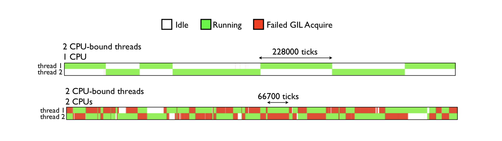
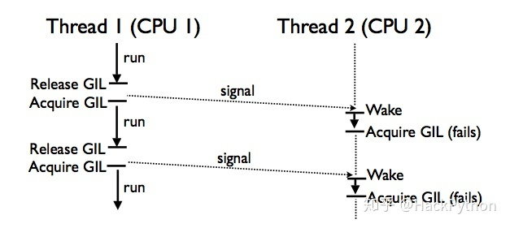
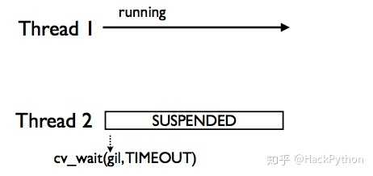
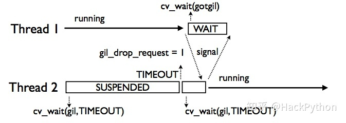
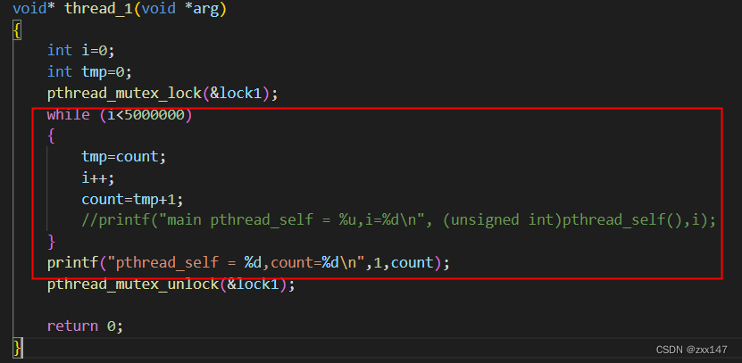

###### datetime:2022/09/29 10:14

###### author:nzb

## GIL全局解释器锁

### GIL的定义

CPython（标准python实现，C语言实现的Python解释器）有一种称为GIL（全局解释器锁）的东西；**GIL仅允许一个线程在同一时刻在一个CPU上执行**，因为多个线程之间竞争GIL的控制权，
只有取得GIL的线程才能获得CPU运行的时间。因此即使在具有多个CPU内核的多线程体系结构中，GIL也因Python的“臭名昭著"。
**当遇到I/O等待或者已到CPU轮询时，系统内核会强制CPU切换**，将CPU时间分配到其他任意一个线程，当然获得CPU运行时间的线程也竞逐得到GIL，
并且CPU切换同样存在时间开销。**对于CPU密集型的程序来说，线程在执行计算时不存在I/O等待，但CPU只要到达轮询时，OS内核仍然会强制CPU执行切换到另外一个线程，
原先执行计算的线程只能等待下一次CPU调度才能继续执行，这种CPU切换操作无时无刻伴随着线程之间的GIL占用与释放，意味着每次CPU切换操作，
其他没有得到GIL的线程都会被强制等待(或阻塞)**。这是同样的CPU密集型算法在CPython中使用多线程执行，比使用单线程还要慢的原因所在。

因为Python线程使用了操作系统的原生线程，这导致了多个线程同时执行容易出现竞争状态等问题，为了方便Python语言层面开发者的开发，就使用了GIL(Global Interpreter Lock)这个大锁，一口气锁住，这样开发起来就方便了，但也造成了当下Python运行速度慢的问题。

有人感觉GIL锁其实就是一个互斥锁(Mutex lock)，其实不然，GIL的目的是让多个线程按照一定的顺序并发执行，而不是简单的保证当下时刻只有一个线程运行，这点CPython中也有相应的注释，而且就是在GIL定义之上，具体如下：

源码路径：`Python/thread_pthread.h`

```text
/* A pthread mutex isn't sufficient to model the Python lock type
* because, according to Draft 5 of the docs (P1003.4a/D5), both of the
* following are undefined:
* -> a thread tries to lock a mutex it already has locked
* -> a thread tries to unlock a mutex locked by a different thread
* pthread mutexes are designed for serializing threads over short pieces
* of code anyway, so wouldn't be an appropriate implementation of
* Python's locks regardless.
*
* The pthread_lock struct implements a Python lock as a "locked?" bit
* and a <condition, mutex> pair. In general, if the bit can be acquired
* instantly, it is, else the pair is used to block the thread until the
* bit is cleared. 9 May 1994 tim@ksr.com
*/
# GIL的定义
typedef struct {
	char locked; /* 0=unlocked, 1=locked */
	/* a <cond, mutex> pair to handle an acquire of a locked lock */
	pthread_cond_t	lock_released;
	pthread_mutex_t mut;
} pthread_lock;
```

从GIL的定义中可知，GIL本质是一个条件互斥组，其使用条件变量lock_released与互斥锁mut来保护locked的状态，locked为0时表示未上锁，为1时表示线程上锁，而条件变量的引用让GIL可以实现多个线程按一定条件并发执行的目的。

条件变量(condition variable)是利用线程间共享的全局变量来控制多个线程同步的一种机制，其主要包含两个动作：

- 1.一个线程等待「条件变量的条件成立」而挂起 
- 2.另一个线程则是「条件成功」(即发出条件成立的信号)

在很多系统中，条件变量通常与互斥锁一同使用，目的是确保多个操作的原子性从而避免死锁的发生。

### GIL的获取与释放

从GIL的定义结构可以看出，线程对 GIL 的操作其实就是修过GIL结构中的 locked 变量的状态来达到获取或释放GIL的目的，
在`Python/threadpthread.h`中以及提供了`PyThreadacquirelock()`与`PyThreadrelease_lock()`方法来实现线程对锁的获取与释放，先来看一下获取，代码如下：

```text
PyLockStatus PyThread_acquire_lock_timed( PyThread_type_lock lock, PY_TIMEOUT_T microseconds, int intr_flag ){
    PyLockStatus success = PY_LOCK_FAILURE;
    /* GIL */
    pthread_lock *thelock = (pthread_lock *) lock;
    int	status, error = 0;
    dprintf( ("PyThread_acquire_lock_timed(%p, %lld, %d) called\n", lock, microseconds, intr_flag) );
    if ( microseconds == 0 ){
        /* 非阻塞式获取互斥锁，从而让当前线程获得操作locked变量的权限 */
        status = pthread_mutex_trylock( &thelock->mut );
        if ( status != EBUSY )
            CHECK_STATUS_PTHREAD( "pthread_mutex_trylock[1]" );
    }else  {
        /* 阻塞式获取互斥锁，从而让当前线程获得操作locked变量的权限 */
        status = pthread_mutex_lock( &thelock->mut );
        CHECK_STATUS_PTHREAD( "pthread_mutex_lock[1]" );
    }
    if ( status == 0 ){
        if ( thelock->locked == 0 ){
            /* 获得锁 */
            success = PY_LOCK_ACQUIRED;
        }
        else if( microseconds != 0 ){
            struct timespec ts; /* 时间 */
            if ( microseconds > 0 )
                /* 等待事件 */
                MICROSECONDS_TO_TIMESPEC( microseconds, ts );
                /* 继续尝试，直到我们获得锁定
                * mut(互斥锁) 必须被当前线程锁定
                * 获得互斥锁失败，则一直尝试 */
            while ( success == PY_LOCK_FAILURE ){
                if ( microseconds > 0 ){
                    /* 计时等待持有锁的线程释放锁 */
                    status = pthread_cond_timedwait(&thelock->lock_released, &thelock->mut, &ts );
                    if ( status == ETIMEDOUT )
                        break;
                    CHECK_STATUS_PTHREAD( "pthread_cond_timed_wait" );
                }else  {
                    /* 无条件等待持有锁的线程释放锁 */
                    status = pthread_cond_wait(&thelock->lock_released, &thelock->mut );
                    CHECK_STATUS_PTHREAD( "pthread_cond_wait" );
                }
                if ( intr_flag && status == 0 && thelock->locked ){
                    /* 被唤醒了，但没有锁，则设置状态为PY_LOCK_INTR 当做异常状态来处理 */
                    success = PY_LOCK_INTR;
                    break;
                }
                else if( status == 0 && !thelock->locked ){
                    success = PY_LOCK_ACQUIRED;
                }
            }
        }
        /* 获得锁，则当前线程上锁 */
        if ( success == PY_LOCK_ACQUIRED )
            thelock->locked = 1;
        /* 释放互斥锁，让其他线上有机会竞争获得锁 */
        status = pthread_mutex_unlock( &thelock->mut );
        CHECK_STATUS_PTHREAD( "pthread_mutex_unlock[1]" );
    }
    if ( error )
        success = PY_LOCK_FAILURE;
    dprintf( ("PyThread_acquire_lock_timed(%p, %lld, %d) -> %d\n", lock, microseconds, intr_flag, success) );
    return(success);
}


int PyThread_acquire_lock( PyThread_type_lock lock, int waitflag )
{
	return PyThread_acquire_lock_timed( lock, waitflag ? -1 : 0, /*intr_flag=*/ 0 );
}
```

上述代码中使用了下面3个方法来操作互斥锁

```text
// 获得互斥锁(阻塞)
pthread_mutex_lock(pthread_mutex_t*mutex);
// 获得互斥锁(非阻塞)
pthread_mutex_trylock(pthread_mutex_t*mutex);
// 释放互斥锁
pthread_mutex_unlock(pthread_mutex_t*mutex);
```

> 这些方法会操作POSIX线程(POSIX thread，简称Pthread)去操作锁，在Linux、MacOS等类Unix操作系统中都会使用Pthread作为操作系统的线程。区别见文章末尾。

从上诉代码中可以看出，获取GIL锁的逻辑主要在`PyThread_acquire_lock_timed()`方法中，其主要的逻辑为，如果没有获得锁，就等待，具体分为计算等待与无条件等待，与Python2不同，Python3通过计时的方式来触发「检查间隔」(check interval)机制，直到成功获取GIL，具体逻辑可以看代码中注释。

接着来看是否GIL锁的逻辑，即`PyThread_release_lock()`方法，代码如下：

```text
void PyThread_release_lock( PyThread_type_lock lock ){
    pthread_lock *thelock = (pthread_lock *) lock;
    int	status, error = 0;
    (void) error; /* silence unused-but-set-variable warning */
    dprintf( ("PyThread_release_lock(%p) called\n", lock) );
    /* 获取互斥锁，从而让当前线程操作locked变量的权限 */
    status = pthread_mutex_lock( &thelock->mut );
    CHECK_STATUS_PTHREAD( "pthread_mutex_lock[3]" );
    /* 释放GIL，将locked置为0 */
    thelock->locked = 0;
    /* wake up someone (anyone, if any) waiting on the lock */
    /* 通知其他线程当前线程已经释放GIL */
    status = pthread_cond_signal( &thelock->lock_released );
    CHECK_STATUS_PTHREAD( "pthread_cond_signal" );
    /* 释放互斥锁 */
    status = pthread_mutex_unlock( &thelock->mut );
    CHECK_STATUS_PTHREAD( "pthread_mutex_unlock[3]" );
}
```

`PyThread_release_lock()`方法的逻辑相对简洁，首先获取互斥锁，从而拥有操作locked的权限，然后就将locked置为0，表示释放GIL，
接着通过`pthread_cond_signal()`方法通知其他线程「当前线程已经释放GIL」，让其他线程去获取GIL，
其他线程其实就是在调用`pthread_cond_timedwait()`方法或`pthread_cond_wait()`方法等待的线程。

### GIL的改进

#### python3.2 之前-基于opcode数量的调度方式

在python3.2版本之前，定义了一个tick计数器，表示当前线程在释放gil之前连续执行的多少个字节码(实际上有部分执行较快的字节码并不会被计入计数器)。
如果当前的线程正在执行一个 CPU 密集型的任务, 它会在 tick 计数器到达 100 之后就释放 gil, 给其他线程一个获得 gil 的机会。


图片来自 [Understanding the Python GIL(youtube)](https://www.youtube.com/watch?v=Obt-vMVdM8s)

以opcode个数为基准来计数，如果有些opcode代码复杂耗时较长，一些耗时较短，会导致同样的100个tick，一些线程的执行时间总是执行的比另一些长。是不公平的调度策略。


图片来自 [Understanding-the-python-gil](https://speakerdeck.com/dabeaz/understanding-the-python-gil?slide=2)

如果当前的线程正在执行一个 **IO密集型的** 的任务, 你执行` sleep/recv/send(...etc)` 这些会阻塞的系统调用时, 
即使 **tick** 计数器的值还没到 100, **gil** 也会被主动地释放。至于下次该执行哪一个线程这个是操作系统层面的，线程调度算法优先级调度，开发者没办法控制。

在多核机器上, 如果两个线程都在执行 **CPU 密集型**的任务, 操作系统有可能让这两个线程在不同的核心上运行, 也许会出现以下的情况, 
当一个拥有了 gil 的线程在一个核心上执行 100 次 tick 的过程中, 在另一个核心上运行的线程频繁的进行抢占 gil, 抢占失败的循环, 
导致 CPU 瞎忙影响性能。 如下图：绿色部分表示该线程在运行，且在执行有用的计算，红色部分为线程被调度唤醒，
但是无法获取GIL导致无法进行有效运算等待的时间。



由图可见，GIL的存在导致多线程无法很好的利用多核CPU的并发处理能力。

究其原因，是因为旧GIL基于ticker来决定是否释放GIL(ticker默认为100)，并且释放完后，释放的线程依旧会参与GIL争夺，这就使得某线程一释放GIL就立刻去获得它，而其他CPU核下的线程相当于白白被唤醒，没有抢到GIL后，继续挂起等待，这就造成了资源的浪费，形象如下图：



#### python3.2 之后-基于时间片的切换

由于在多核机器下可能导致性能下降， gil的实现在python3.2之后做了一些优化 。python在初始化解释器的时候就会初始化一个gil，并设置一个`DEFAULT_INTERVAL=5000, 单位是微妙，即0.005秒(在 C 里面是用 微秒 为单位存储, 在 python 解释器中以秒来表示)`这个间隔就是GIL切换的标志。

```text
// Pythonceval_gil.h
#define DEFAULT_INTERVAL 5000

static void _gil_initialize(struct _gil_runtime_state *gil)
{
    _Py_atomic_int uninitialized = {-1};
    gil->locked = uninitialized;
    gil->interval = DEFAULT_INTERVAL;
}
```

python中查看gil切换的时间

```python
In [7]: import sys
In [8]: sys.getswitchinterval()
Out[8]: 0.005
```

改进后的GIL不再使用ticker，而改为使用时间，可以通过 `sys.getswitchinterval()`来查看GIL释放的时间，默认为5毫秒，此外虽然说新GIL使用了时间，
但决定线程是否释放GIL并不取决于时间，而是取决于**gil_drop_request**这一全局变量，如果**gil_drop_request=0**，则线程会在解释器中一直运行，
直到**gil_drop_request=1**，此时线程才会释放GIL，下面同样以两个线程来解释新GIL在其中发挥的具体作用。

首先存在两个线程，Thread 1是正在运行的状态，Thread 2是挂起状态。



Thread 2之所以挂起，是因为Thread 2没有获得GIL，它会执行`cv_wait(gil,TIMEOUT)`定时等待方法，等待一段时间(默认5毫秒)，
直到Thread 1主动释放GIL(比如Thread 1 执行I/O操作时会进入休眠状态，此时它会主动释放GIL)。


当Thread 2收到signal信号后，就知道Thread 1要休眠了，此时它就可以去获取GIL从而执行自身的逻辑。

另外一种情况就是，Thread 1一直在执行，执行的时间超过了Thread 2 `cvwait(gil,TIMEOUT)`方法等待的时间，
此时Thread 2就会去修改全局变量**gil_drop_request**，将其设置为1，然后自己再次调用`cvwait(gil,TIMEOUT)`挂起等待。


Thread 1 发现 **gil_drop_request=1** 会主动释放GIL，并通过signal通知Thread 2，让其获取GIL去运行。


其中需要注意的细节如下图。当Thread 1因为**gil_drop_request=1**要主动释放GIL后，会调用`cv_wait(gotgil)`方法进入等待状态，
该状态下的Thread 1会等待Thread 2返回的signal信号，从而得知另一个线程Thread 2成功获得了GIL并在执行状态，这就避免了多个线程争夺GIL的情况，从而避免了额外资源的消耗。



如果当前有不止一个线程, 当前等待 **gil** 的线程在超过一定时间的等待后, 会把全局变量 **gil_drop_request** 的值设置为 1, 之后继续等待相同的时间, 
这时拥有 **gil** 的线程看到了 **gil_drop_request** 变为 1, 就会主动释放 **gil** 并通过 `condition variable` 通知到在等待中的线程,
第一个被唤醒的等待中的线程会抢到 **gil** 并执行相应的任务, 将**gil_drop_request**设置为1的线程不一定能抢到gil, 相同的过程会重复的发生，直到线程执行结束


如果存在多个线程(大于2个线程)，此时多个线程出现等待时间超时，此时会不会发生多个线程争夺GIL的情况呢？答案是不会，如下图：


当Thread 1执行时，Thread 2等待超时了，会设置**gil_drop_request = 1**，从而让Thread 2获得运行权限，如果此时Thread 3或Thread 4一会后也超时了，此时是不会让Thread 2将获得的GIL立即释放的，Thread 3/4 会继续在挂起状态等待一段时间。

还需要注意的一点是，设置**gil_drop_request = 1**的线程并不一定会是下一个要执行的线程，下一个要执行那个线程，这取决于操作系统，直观理解如下图：


图中，Thread 2到了超时时间，将**gil_drop_request**设置为了1，但Thread 1发送signal信号的线程是Thread 3，这造成Thread 2继续挂起等待，而Thread 3获得GIL执行自身逻辑。

### condition variable相关字段

- **locked** ： locked 的类型是`_Py_atomic_int`， 值-1表示还未初始化，0表示当前的gil处于释放状态，1表示某个线程已经占用了gil，这个值的类型设置为原子类型之后在 `ceval.c` 就可以不加锁的对这个值进行读取。
- **interval**：是线程在设置`gil_drop_request`这个变量之前需要等待的时长，默认是5000毫秒
- **last_holder**：存放了最后一个持有 **gil** 的线程的 C 中对应的 PyThreadState 结构的指针地址, 通过这个值我们可以知道当前线程释放了 **gil** 后, 是否有其他线程获得了 **gil**(可以采取措施避免被自己重新获得)
- **switch_number**： 是一个计数器, 表示从解释器运行到现在, **gil** 总共被释放获得多少次
- **mutex**：是一把互斥锁, 用来保护 `locked`, `last_holder`, `switch_number` 还有 `_gil_runtime_state` 中的其他变量
- **cond**：是一个 `condition variable` 和 `mutex` 结合起来一起使用, 当前线程释放 `gil` 时用来给其他等待中的线程发送信号
- **switch_cond and switch_mutex**

`switch_cond` 是另一个 `condition variable` 和 `switch_mutex` 结合起来可以用来保证释放后重新获得 **gil** 的线程不是同一个前面释放 **gil** 的线程, 避免 **gil** 切换时线程未切换浪费 cpu 时间

这个功能如果编译时未定义 FORCE_SWITCHING 则不开启

```text
static void drop_gil(struct _ceval_runtime_state *ceval, PyThreadState *tstate){
    ...
    #ifdef FORCE_SWITCHING
    if (_Py_atomic_load_relaxed(&ceval->gil_drop_request) && tstate != NULL) {
        MUTEX_LOCK(gil->switch_mutex);
        /* Not switched yet => wait */
        if (((PyThreadState*)_Py_atomic_load_relaxed(&gil->last_holder)) == tstate){
            /* 如果 last_holder 是当前线程, 释放 switch_mutex 这把互斥锁, 等待 switch_cond 这个条件变量的信号 */
            RESET_GIL_DROP_REQUEST(ceval);
            /* NOTE: if COND_WAIT does not atomically start waiting when
            releasing the mutex, another thread can run through, take
            the GIL and drop it again, and reset the condition
            before we even had a chance to wait for it. */
            /* 注意, 如果 COND_WAIT 不在互斥锁释放后原子的启动,
            另一个线程有可能会在这中间拿到 gil 并释放,
            ‘并且重置这个条件变量, 这个过程发生在了 COND_WAIT 之前 */
            COND_WAIT(gil->switch_cond, gil->switch_mutex);
        }
        MUTEX_UNLOCK(gil->switch_mutex);
        }
    #endif
}
```

### gil在main_loop中的体现

```text
/*  */
main_loop:
for (;; ){
    /* 如果 gil_drop_request 被其他线程设置为 1 */
    /* 给其他线程一个获得 gil 的机会 */
    if ( _Py_atomic_load_relaxed( &ceval->gil_drop_request ) ){
        /* Give another thread a chance */
        if ( _PyThreadState_Swap( &runtime->gilstate, NULL ) != tstate ){
            Py_FatalError( "ceval: tstate mix-up" );
        }
        drop_gil( ceval, tstate );

        /* Other threads may run now */

        take_gil( ceval, tstate );

        /* Check if we should make a quick exit. */
        exit_thread_if_finalizing( runtime, tstate );

        if ( _PyThreadState_Swap( &runtime->gilstate, tstate ) != NULL ){
            Py_FatalError( "ceval: orphan tstate" );
        }
    }
    /* Check for asynchronous exceptions. */
    /* 忽略 */
fast_next_opcode:
    switch ( opcode ){
    case TARGET( NOP ): {
        FAST_DISPATCH();
    }
    /* 忽略 */
    case TARGET( UNARY_POSITIVE ): {
        PyObject	*value	= TOP();
        PyObject	*res	= PyNumber_Positive( value );
        Py_DECREF( value );
        SET_TOP( res );
        if ( res == NULL )
            goto error;
        DISPATCH();
    }
        /* 忽略 */
    }
    /* 忽略 */
}
```

这个很大的 `for loop` 会按顺序逐个的加载 opcode, 并委派给中间很大的 `switch statement` 去进行执行, `switch statement` 会根据不同的 `opcode` 跳转到不同的位置执行

`for loop`在开始位置会检查 `gil_drop_request` 变量, 必要的时候会释放 `gil`

不是所有的 `opcode` 执行之前都会检查 `gil_drop_request` 的, 有一些 opcode 结束时的代码为 `FAST_DISPATCH()`, 这部分 `opcode` 会直接跳转到下一个 `opcode` 对应的代码的部分进行执行

而另一些 `DISPATCH()` 结尾的作用和 `continue` 类似, 会跳转到 `for loop` 顶端, 重新检测 `gil_drop_request`, 必要时释放 `gil` 。

## 如何解决GIL

GIL只会对CPU密集型的程序产生影响，规避GIL限制主要有两种常用策略：一是使用多进程，二是使用C语言扩展，把计算密集型的任务转移到C语言中，
使其独立于Python，在C代码中释放GIL。当然也可以使用其他语言编译的解释器如 `Jpython`、`PyPy`。

### 总结
- Python语言和GIL没有半毛钱关系，仅仅是由于历史原因在CPython解释器中难以移除GIL
- GIL：全局解释器锁，每个线程在执行的过程都需要先获取GIL，确保同一时刻仅有一个线程执行代码，所以python的线程无法利用多核。
- 线程在I/O操作等可能引起阻塞的system call之前，可以暂时释放GIL，执行完毕后重新获取GIL，python3.2以后使用时间片来切换线程，时间阈值是0.005秒，而python3.2之前是使用opcode执行的数量(tick=100)来切换的。
- Python的多线程在多核CPU上，只对于IO密集型计算产生正面效果；而当有至少有一个CPU密集型线程存在，那么多线程效率会由于GIL而大幅下降

> 参考
> 
> [Cpython-gil讲解-zpoint](https://github.com/zpoint/CPython-Internals/blob/master/Interpreter/gil/gil_cn.md)
> 
> [Python的GIL是什么鬼-卢钧轶(cenalulu)](http://cenalulu.github.io/python/gil-in-python/)
> 
> [Youtube-Understanding the Python GIL](https://www.youtube.com/watch?v=Obt-vMVdM8s)

### 关于`pthread_mutex_lock`和`trylock`的区别

pthread_mutex_lock会阻塞，pthread_mutex_trylock是非阻塞的。

- 举例：lock

当A线程去lock一个锁时，如果该锁已被其他线程锁住，则A线程会被挂起，等待该锁被释放后，再进行lock。



图中如果线程1在获取lock1时，发现该锁已被占用，则线程1会被挂起，不再执行后面的程序直到抢占到lock1。

- 举例：trylock

当线程A去trylock一个锁时，如果该锁被占用，则线程A继续执行下面的程序，不会被挂起。


图中线程1去trylock一下lock1时，如果锁被占用，则继续执行下面的程序

**总结**：人如其名，trylock就是尝试锁一下，锁不到就拉倒，不会影响自己进行下一步操作。lock就比较犟，锁不到的话，我就等着，等到我能锁了，再进行一下步操作。


