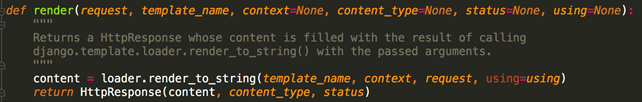

###### datetime:2019/6/11 11:10
###### author:nzb

## Django的View(视图)


一个视图函数（类），简称视图，是一个简单的Python 函数（类），它接受Web请求并且返回Web响应。

响应可以是一张网页的HTML内容，一个重定向，一个404错误，一个XML文档，或者一张图片。

无论视图本身包含什么逻辑，都要返回响应。代码写在哪里也无所谓，只要它在你当前项目目录下面。
除此之外没有更多的要求了——可以说“没有什么神奇的地方”。为了将代码放在某处，大家约定成俗将视图放置在项目（project）或应用程序（app）目录中的名为views.py的文件中。


### 一个简单的视图

```python
# 下面是一个以HTML文档的形式返回当前日期和时间的视图：

        from django.http import HttpResponse
        import datetime
        
        def current_datetime(request):
            now = datetime.datetime.now()
            html = "<html><body>It is now %s.</body></html>" % now
            return HttpResponse(html)
```

让我们来逐行解释下上面的代码：

- 首先，我们从 django.http模块导入了HttpResponse类，以及Python的datetime库。

- 接着，我们定义了current_datetime函数。它就是视图函数。每个视图函数都使用HttpRequest对象作为第一个参数，并且通常称之为request。

注意，视图函数的名称并不重要；不需要用一个统一的命名方式来命名，以便让Django识别它。我们将其命名为current_datetime，是因为这个名称能够比较准确地反映出它实现的功能。

- 这个视图会返回一个HttpResponse对象，其中包含生成的响应。每个视图函数都负责返回一个HttpResponse对象。

Django使用请求和响应对象来通过系统传递状态。

当浏览器向服务端请求一个页面时，Django创建一个HttpRequest对象，该对象包含关于请求的元数据。然后，Django加载相应的视图，将这个HttpRequest对象作为第一个参数传递给视图函数。

每个视图负责返回一个HttpResponse对象。


### CBV和FBV

我们之前写过的都是基于函数的view，就叫FBV。还可以把view写成基于类的。

就拿我们之前写过的添加班级为例：

#### FBV版

```python
    # FBV版添加班级
        def add_class(request):
            if request.method == "POST":
                class_name = request.POST.get("class_name")
                models.Classes.objects.create(name=class_name)
                return redirect("/class_list/")
            return render(request, "add_class.html")
```

#### CBV版

```python
    # CBV版添加班级
        from django.views import View
        
        class AddClass(View):
        
            def get(self, request):
                return render(request, "add_class.html")
        
            def post(self, request):
                class_name = request.POST.get("class_name")
                models.Classes.objects.create(name=class_name)
                return redirect("/class_list/")
                
    # 注意：
    # 使用CBV时，urls.py中也做对应的修改：
    # urls.py中
        url(r'^add_class/$', views.AddClass.as_view()),
```

### 给视图加装饰器

#### 使用装饰器装饰FBV

```python
# FBV本身就是一个函数，所以和给普通的函数加装饰器无差：
    
    def wrapper(func):
        def inner(*args, **kwargs):
            start_time = time.time()
            ret = func(*args, **kwargs)
            end_time = time.time()
            print("used:", end_time-start_time)
            return ret
        return inner
    
    
    # FBV版添加班级
    @wrapper
    def add_class(request):
        if request.method == "POST":
            class_name = request.POST.get("class_name")
            models.Classes.objects.create(name=class_name)
            return redirect("/class_list/")
        return render(request, "add_class.html")
```

#### 使用装饰器装饰CBV

```python
# 类中的方法与独立函数不完全相同，因此不能直接将函数装饰器应用于类中的方法 ，我们需要先将其转换为方法装饰器。
# Django中提供了method_decorator装饰器用于将函数装饰器转换为方法装饰器。


    # CBV版添加班级
    from django.views import View
    from django.utils.decorators import method_decorator
    
    class AddClass(View):
    
        @method_decorator(wrapper)
        def get(self, request):
            return render(request, "add_class.html")
    
        def post(self, request):
            class_name = request.POST.get("class_name")
            models.Classes.objects.create(name=class_name)
            return redirect("/class_list/")
```
```python
# 使用CBV时要注意，请求过来后会先执行dispatch()这个方法，如果需要批量对具体的请求处理方法，如get，post等做一些操作的时候，这里我们可以手动改写dispatch方法，这个dispatch方法就和在FBV上加装饰器的效果一样。

    class Login(View):
         
        def dispatch(self, request, *args, **kwargs):
            print('before')
            obj = super(Login,self).dispatch(request, *args, **kwargs)
            print('after')
            return obj
     
        def get(self,request):
            return render(request,'login.html')
     
        def post(self,request):
            print(request.POST.get('user'))
            return HttpResponse('Login.post')
```

### Request对象和Response对象

#### request对象

当一个页面被请求时，Django就会创建一个包含本次请求原信息的HttpRequest对象。

Django会将这个对象自动传递给响应的视图函数，一般视图函数约定俗成地使用 request 参数承接这个对象。

[官方文档](https://docs.djangoproject.com/en/1.11/ref/request-response/)

##### 请求相关的常用值

- path_info     返回用户访问url，不包括域名

- method        请求中使用的HTTP方法的字符串表示，全大写表示。

- GET              包含所有HTTP  GET参数的类字典对象
 
- POST           包含所有HTTP POST参数的类字典对象
 
- body            请求体，byte类型 request.POST的数据就是从body里面提取到的

##### 属性

所有的属性应该被认为是只读的，除非另有说明。

```text
属性：

　　django将请求报文中的请求行、头部信息、内容主体封装成 HttpRequest 类中的属性。
   除了特殊说明的之外，其他均为只读的。


0. HttpRequest.scheme
   表示请求方案的字符串（通常为http或https）

1. HttpRequest.body

　　一个字符串，代表请求报文的主体。在处理非 HTTP 形式的报文时非常有用，例如：二进制图片、XML,Json等。

　　但是，如果要处理表单数据的时候，推荐还是使用 HttpRequest.POST 。

　　另外，我们还可以用 python 的类文件方法去操作它，详情参考 HttpRequest.read() 。

 

2. HttpRequest.path

　　一个字符串，表示请求的路径组件（不含域名）。

　　例如："/music/bands/the_beatles/"


3. HttpRequest.method

　　一个字符串，表示请求使用的HTTP 方法。必须使用大写。

　　例如："GET"、"POST"

 

4. HttpRequest.encoding

　　一个字符串，表示提交的数据的编码方式（如果为 None 则表示使用 DEFAULT_CHARSET 的设置，默认为 'utf-8'）。
   这个属性是可写的，你可以修改它来修改访问表单数据使用的编码。
   接下来对属性的任何访问（例如从 GET 或 POST 中读取数据）将使用新的 encoding 值。
   如果你知道表单数据的编码不是 DEFAULT_CHARSET ，则使用它。

 

5. HttpRequest.GET 

　　一个类似于字典的对象，包含 HTTP GET 的所有参数。详情请参考 QueryDict 对象。

 

6. HttpRequest.POST

　　一个类似于字典的对象，如果请求中包含表单数据，则将这些数据封装成 QueryDict 对象。

　　POST 请求可以带有空的 POST 字典 —— 如果通过 HTTP POST 方法发送一个表单，但是表单中没有任何的数据，QueryDict 对象依然会被创建。
   因此，不应该使用 if request.POST  来检查使用的是否是POST 方法；应该使用 if request.method == "POST" 

　　另外：如果使用 POST 上传文件的话，文件信息将包含在 FILES 属性中。

7. HttpRequest.COOKIES

　　一个标准的Python 字典，包含所有的cookie。键和值都为字符串。

 

8. HttpRequest.FILES

　　一个类似于字典的对象，包含所有的上传文件信息。
   FILES 中的每个键为<input type="file" name="" /> 中的name，值则为对应的数据。

　　注意，FILES 只有在请求的方法为POST 且提交的<form> 带有enctype="multipart/form-data" 的情况下才会
   包含数据。否则，FILES 将为一个空的类似于字典的对象。

 

9. HttpRequest.META

 　　一个标准的Python 字典，包含所有的HTTP 首部。具体的头部信息取决于客户端和服务器，下面是一些示例：

    CONTENT_LENGTH —— 请求的正文的长度（是一个字符串）。
    CONTENT_TYPE —— 请求的正文的MIME 类型。
    HTTP_ACCEPT —— 响应可接收的Content-Type。
    HTTP_ACCEPT_ENCODING —— 响应可接收的编码。
    HTTP_ACCEPT_LANGUAGE —— 响应可接收的语言。
    HTTP_HOST —— 客服端发送的HTTP Host 头部。
    HTTP_REFERER —— Referring 页面。
    HTTP_USER_AGENT —— 客户端的user-agent 字符串。
    QUERY_STRING —— 单个字符串形式的查询字符串（未解析过的形式）。
    REMOTE_ADDR —— 客户端的IP 地址。
    REMOTE_HOST —— 客户端的主机名。
    REMOTE_USER —— 服务器认证后的用户。
    REQUEST_METHOD —— 一个字符串，例如"GET" 或"POST"。
    SERVER_NAME —— 服务器的主机名。
    SERVER_PORT —— 服务器的端口（是一个字符串）。
 　　从上面可以看到，除 CONTENT_LENGTH 和 CONTENT_TYPE 之外，请求中的任何 HTTP 首部转换为 META 的键时，
    都会将所有字母大写并将连接符替换为下划线最后加上 HTTP_  前缀。
    所以，一个叫做 X-Bender 的头部将转换成 META 中的 HTTP_X_BENDER 键。

 
10. HttpRequest.user

　　一个 AUTH_USER_MODEL 类型的对象，表示当前登录的用户。

　　如果用户当前没有登录，user 将设置为 django.contrib.auth.models.AnonymousUser 的一个实例。你可以通过 is_authenticated() 区分它们。

    例如：

    if request.user.is_authenticated():
        # Do something for logged-in users.
    else:
        # Do something for anonymous users.
     

     　　user 只有当Django 启用 AuthenticationMiddleware 中间件时才可用。

     -------------------------------------------------------------------------------------

    匿名用户
    class models.AnonymousUser

    django.contrib.auth.models.AnonymousUser 类实现了django.contrib.auth.models.User 接口，但具有下面几个不同点：

    id 永远为None。
    username 永远为空字符串。
    get_username() 永远返回空字符串。
    is_staff 和 is_superuser 永远为False。
    is_active 永远为 False。
    groups 和 user_permissions 永远为空。
    is_anonymous() 返回True 而不是False。
    is_authenticated() 返回False 而不是True。
    set_password()、check_password()、save() 和delete() 引发 NotImplementedError。
    New in Django 1.8:
    新增 AnonymousUser.get_username() 以更好地模拟 django.contrib.auth.models.User。

 

11. HttpRequest.session

 　　一个既可读又可写的类似于字典的对象，表示当前的会话。只有当Django 启用会话的支持时才可用。
    完整的细节参见会话的文档。

request属性相关
```

上传文件示例

```python
    def upload(request):
        """
        保存上传文件前，数据需要存放在某个位置。默认当上传文件小于2.5M时，django会将上传文件的全部内容读进内存。从内存读取一次，写磁盘一次。
        但当上传文件很大时，django会把上传文件写到临时文件中，然后存放到系统临时文件夹中。
        :param request: 
        :return: 
        """
        if request.method == "POST":
            # 从请求的FILES中获取上传文件的文件名，file为页面上type=files类型input的name属性值
            filename = request.FILES["file"].name
            # 在项目目录下新建一个文件
            with open(filename, "wb") as f:
                # 从上传的文件对象中一点一点读
                for chunk in request.FILES["file"].chunks():
                    # 写入本地文件
                    f.write(chunk)
            return HttpResponse("上传OK")
```

##### 方法

```text
1.HttpRequest.get_host()

　　根据从HTTP_X_FORWARDED_HOST（如果打开 USE_X_FORWARDED_HOST，默认为False）和 HTTP_HOST 头部信息返回请求的原始主机。
   如果这两个头部没有提供相应的值，则使用SERVER_NAME 和SERVER_PORT，在PEP 3333 中有详细描述。

　　USE_X_FORWARDED_HOST：一个布尔值，用于指定是否优先使用 X-Forwarded-Host 首部，仅在代理设置了该首部的情况下，才可以被使用。

　　例如："127.0.0.1:8000"

　　注意：当主机位于多个代理后面时，get_host() 方法将会失败。除非使用中间件重写代理的首部。

 

2.HttpRequest.get_full_path()

　　返回 path，如果可以将加上查询字符串。

　　例如："/music/bands/the_beatles/?print=true"

 

3.HttpRequest.get_signed_cookie(key, default=RAISE_ERROR, salt='', max_age=None)

　　返回签名过的Cookie 对应的值，如果签名不再合法则返回django.core.signing.BadSignature。

　　如果提供 default 参数，将不会引发异常并返回 default 的值。

　　可选参数salt 可以用来对安全密钥强力攻击提供额外的保护。max_age 参数用于检查Cookie 对应的时间戳以确保Cookie 的时间不会超过max_age 秒。

        复制代码
        >>> request.get_signed_cookie('name')
        'Tony'
        >>> request.get_signed_cookie('name', salt='name-salt')
        'Tony' # 假设在设置cookie的时候使用的是相同的salt
        >>> request.get_signed_cookie('non-existing-cookie')
        ...
        KeyError: 'non-existing-cookie'    # 没有相应的键时触发异常
        >>> request.get_signed_cookie('non-existing-cookie', False)
        False
        >>> request.get_signed_cookie('cookie-that-was-tampered-with')
        ...
        BadSignature: ...    
        >>> request.get_signed_cookie('name', max_age=60)
        ...
        SignatureExpired: Signature age 1677.3839159 > 60 seconds
        >>> request.get_signed_cookie('name', False, max_age=60)
        False
        复制代码
         


4.HttpRequest.is_secure()

　　如果请求时是安全的，则返回True；即请求通是过 HTTPS 发起的。

 

5.HttpRequest.is_ajax()

　　如果请求是通过XMLHttpRequest 发起的，则返回True，方法是检查 HTTP_X_REQUESTED_WITH 相应的首部是否是字符串'XMLHttpRequest'。

　　大部分现代的 JavaScript 库都会发送这个头部。如果你编写自己的 XMLHttpRequest 调用（在浏览器端），你必须手工设置这个值来让 is_ajax() 可以工作。

　　如果一个响应需要根据请求是否是通过AJAX 发起的，并且你正在使用某种形式的缓存例如Django 的 cache middleware， 
   你应该使用 vary_on_headers('HTTP_X_REQUESTED_WITH') 装饰你的视图以让响应能够正确地缓存。
```

注意：键值对的值是多个的时候,比如checkbox类型的input标签，select标签，需要用：

request.POST.getlist("hobby")

#### Response对象

与由Django自动创建的HttpRequest对象相比，HttpResponse对象是我们的职责范围了。我们写的每个视图都需要实例化，填充和返回一个HttpResponse。

HttpResponse类位于django.http模块中。

##### 使用

传递字符串
```python
    from django.http import HttpResponse
    response = HttpResponse("Here's the text of the Web page.")
    response = HttpResponse("Text only, please.", content_type="text/plain")
```
设置或删除响应头信息
```python
    response = HttpResponse()
    response['Content-Type'] = 'text/html; charset=UTF-8'
    del response['Content-Type']
```

##### 属性

HttpResponse.content：响应内容

HttpResponse.charset：响应内容的编码

HttpResponse.status_code：响应的状态码

#### JsonResponse对象

JsonResponse是HttpResponse的子类，专门用来生成JSON编码的响应。
```python
    from django.http import JsonResponse
    
    response = JsonResponse({'foo': 'bar'})
    print(response.content)
    
    b'{"foo": "bar"}'
```
默认只能传递字典类型，如果要传递非字典类型需要设置一下safe关键字参数。
```python
    response = JsonResponse([1, 2, 3], safe=False)
```

#### Django shortcut functions

[官方文档](https://docs.djangoproject.com/en/1.11/topics/http/shortcuts/)

##### render()



结合一个给定的模板和一个给定的上下文字典，并返回一个渲染后的 HttpResponse 对象。

参数：

     request： 用于生成响应的请求对象。

     template_name：要使用的模板的完整名称，可选的参数

     context：添加到模板上下文的一个字典。默认是一个空字典。如果字典中的某个值是可调用的，视图将在渲染模板之前调用它。

     content_type：生成的文档要使用的MIME类型。默认为 DEFAULT_CONTENT_TYPE 设置的值。默认为'text/html'

     status：响应的状态码。默认为200。

　　　useing: 用于加载模板的模板引擎的名称。

一个简单的例子：
```python
    from django.shortcuts import render
    
    def my_view(request):
        # 视图的代码写在这里
        return render(request, 'myapp/index.html', {'foo': 'bar'})
```
上面的代码等于：
```python
    from django.http import HttpResponse
    from django.template import loader
    
    def my_view(request):
        # 视图代码写在这里
        t = loader.get_template('myapp/index.html')
        c = {'foo': 'bar'}
        return HttpResponse(t.render(c, request))
```

##### redirect()

参数可以是：

- 一个模型：将调用模型的get_absolute_url() 函数
- 一个视图，可以带有参数：将使用urlresolvers.reverse 来反向解析名称
- 一个绝对的或相对的URL，将原封不动的作为重定向的位置。
默认返回一个临时的重定向；传递permanent=True 可以返回一个永久的重定向。

示例:

你可以用多种方式使用redirect() 函数。

**传递一个具体的ORM对象（了解即可）**
将调用具体ORM对象的get_absolute_url() 方法来获取重定向的URL：
```python
    from django.shortcuts import redirect
     
    def my_view(request):
        ...
        object = MyModel.objects.get(...)
        return redirect(object)
```

**传递一个视图的名称**
```python
    def my_view(request):
        ...
        return redirect('some-view-name', foo='bar')
```

**传递要重定向到的一个具体的网址**
```python
    def my_view(request):
        ...
        return redirect('/some/url/')
```

**当然也可以是一个完整的网址**
```python
    def my_view(request):
        ...
        return redirect('http://example.com/')
```

默认情况下，redirect() 返回一个临时重定向。以上所有的形式都接收一个permanent 参数；如果设置为True，将返回一个永久的重定向：
```python
    def my_view(request):
        ...
        object = MyModel.objects.get(...)
        return redirect(object, permanent=True)　　
```

**扩展阅读：** 

临时重定向（响应状态码：302）和永久重定向（响应状态码：301）对普通用户来说是没什么区别的，它主要面向的是搜索引擎的机器人。

A页面临时重定向到B页面，那搜索引擎收录的就是A页面。

A页面永久重定向到B页面，那搜索引擎收录的就是B页面。


