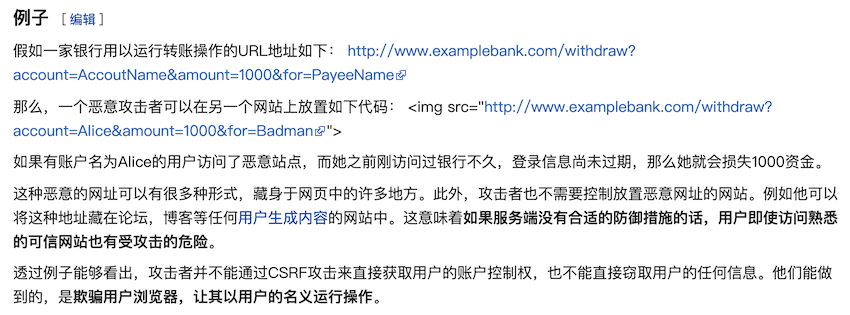

###### datetime:2019/6/27 10:07
###### author:nzb

## Form和ModelForm组件

### Form介绍

我们之前在HTML页面中利用form表单向后端提交数据时，都会写一些获取用户输入的标签并且用form标签把它们包起来。

与此同时我们在好多场景下都需要对用户的输入做校验，比如校验用户是否输入，输入的长度和格式等正不正确。如果用户输入的内容有错误就需要在页面上相应的位置显示对应的错误信息.。

Django form组件就实现了上面所述的功能。

总结一下，其实form组件的主要功能如下:

- 生成页面可用的HTML标签
- 对用户提交的数据进行校验
- 保留上次输入内容

#### 普通方式手写注册功能

##### views.py

```python
    # 注册
    def register(request):
        error_msg = ""
        if request.method == "POST":
            username = request.POST.get("name")
            pwd = request.POST.get("pwd")
            # 对注册信息做校验
            if len(username) < 6:
                # 用户长度小于6位
                error_msg = "用户名长度不能小于6位"
            else:
                # 将用户名和密码存到数据库
                return HttpResponse("注册成功")
        return render(request, "register.html", {"error_msg": error_msg})
```

##### login.html

```python
    <!DOCTYPE html>
    <html lang="en">
    <head>
        <meta charset="UTF-8">
        <title>注册页面</title>
    </head>
    <body>
    <form action="/reg/" method="post">
        { % csrf_token % }
        <p>
            用户名:
            <input type="text" name="name">
        </p>
        <p>
            密码：
            <input type="password" name="pwd">
        </p>
        <p>
            <input type="submit" value="注册">
            <p style="color: red">{ { error_msg } }</p>
        </p>
    </form>
    </body>
    </html>
```

#### 使用form组件实现注册功能

##### views.py

先定义好一个RegForm类：
```python
    from django import forms
    
    # 按照Django form组件的要求自己写一个类
    class RegForm(forms.Form):
        name = forms.CharField(label="用户名")
        pwd = forms.CharField(label="密码")
```

再写一个视图函数：
```python
    # 使用form组件实现注册方式
    def register2(request):
        form_obj = RegForm()
        if request.method == "POST":
            # 实例化form对象的时候，把post提交过来的数据直接传进去
            form_obj = RegForm(request.POST)
            # 调用form_obj校验数据的方法
            if form_obj.is_valid():
                return HttpResponse("注册成功")
        return render(request, "register2.html", {"form_obj": form_obj})
```

##### login2.html

```python
    <!DOCTYPE html>
    <html lang="en">
    <head>
        <meta charset="UTF-8">
        <title>注册2</title>
    </head>
    <body>
        <form action="/reg2/" method="post" novalidate autocomplete="off">
            { % csrf_token % }
            <div>
                <label for="{ { form_obj.name.id_for_label } }">{ { form_obj.name.label } }</label>
                { { form_obj.name } } { { form_obj.name.errors.0 } }
            </div>
            <div>
                <label for="{ { form_obj.pwd.id_for_label } }">{ { form_obj.pwd.label } }</label>
                { { form_obj.pwd } } { { form_obj.pwd.errors.0 } }
            </div>
            <div>
                <input type="submit" class="btn btn-success" value="注册">
            </div>
        </form>
    </body>
    </html>
```

看网页效果发现 也验证了form的功能：
- 前端页面是form类的对象生成的                                       -->生成HTML标签功能
- 当用户名和密码输入为空或输错之后 页面都会提示                        -->用户提交校验功能
- 当用户输错之后 再次输入 上次的内容还保留在input框                    -->保留上次输入内容

### Form那些事

#### 常用字段与插件

创建Form类时，主要涉及到 【字段】 和 【插件】，字段用于对用户请求数据的验证，插件用于自动生成HTML;

##### initial

初始值，input框里面的初始值。
```python
    class LoginForm(forms.Form):
        username = forms.CharField(
            min_length=8,
            label="用户名",
            initial="张三"  **# 设置默认值**
        )
        pwd = forms.CharField(min_length=6, label="密码")
```

##### error_messages

重写错误信息。
```python
    class LoginForm(forms.Form):
        username = forms.CharField(
            min_length=8,
            label="用户名",
            initial="张三",
            error_messages={
                "required": "不能为空",
                "invalid": "格式错误",
                "min_length": "用户名最短8位"
            },
            widget=forms.widgets.TextInput(attrs={'class': 'c1'}, render_value=True)
        )
        pwd = forms.CharField(min_length=6, label="密码")
```

##### password

```python
    class LoginForm(forms.Form):
        ...
        pwd = forms.CharField(
            min_length=6,
            label="密码",
            widget=forms.widgets.PasswordInput(
                            attrs={'class': 'c1'},  # **标签属性**
                            render_value=True)      # **表单值是否返回**
        )
```

##### radioSelect

单radio值为字符串
```python
    class LoginForm(forms.Form):
        username = forms.CharField(
            min_length=8,
            label="用户名",
            initial="张三",
            error_messages={
                "required": "不能为空",
                "invalid": "格式错误",
                "min_length": "用户名最短8位"
            }
        )
        pwd = forms.CharField(min_length=6, label="密码")
        gender = forms.ChoiceField(
            choices=((1, "男"), (2, "女"), (3, "保密")),
            label="性别",
            initial=3,
            widget=forms.widgets.RadioSelect()
        )
```

##### 单选Select

```python
    class LoginForm(forms.Form):
        ...
        hobby = forms.ChoiceField(
            choices=((1, "篮球"), (2, "足球"), (3, "双色球"), ),
            label="爱好",
            initial=3,
            widget=forms.widgets.Select()
        )
```

##### 多选Select

```python
    class LoginForm(forms.Form):
        ...
        hobby = forms.MultipleChoiceField(
            choices=((1, "篮球"), (2, "足球"), (3, "双色球"), ),
            label="爱好",
            initial=[1, 3],
            widget=forms.widgets.SelectMultiple()
        )
```

##### 单选checkbox

```python
    class LoginForm(forms.Form):
        ...
        keep = forms.ChoiceField(
            label="是否记住密码",
            initial="checked",
            widget=forms.widgets.CheckboxInput()
        )
```

##### 多选checkbox

```python
    class LoginForm(forms.Form):
        ...
        hobby = forms.MultipleChoiceField(
            choices=((1, "篮球"), (2, "足球"), (3, "双色球"),),
            label="爱好",
            initial=[1, 3],
            widget=forms.widgets.CheckboxSelectMultiple()
        )
```

##### choice字段注意事项

在使用选择标签时，需要注意choices的选项可以配置从数据库中获取，但是由于是静态字段**获取的值无法实时更新**，需要重写构造方法从而实现choice实时更新。

方式一：
```python
    from django.forms import Form
    from django.forms import widgets
    from django.forms import fields
    
     
    class MyForm(Form):
     
        user = fields.ChoiceField(
            # choices=((1, '上海'), (2, '北京'),),
            initial=2,
            widget=widgets.Select
        )
     
        def __init__(self, *args, **kwargs):
            super(MyForm,self).__init__(*args, **kwargs)
            # self.fields['user'].choices = ((1, '上海'), (2, '北京'),)
            # 或
            self.fields['user'].choices = models.Classes.objects.all().values_list('id','caption')
```

方式二：
```python
    from django import forms
    from django.forms import fields
    from django.forms import models as form_model
    
     
    class FInfo(forms.Form):
        authors = form_model.ModelMultipleChoiceField(queryset=models.NNewType.objects.all())  # 多选
        # authors = form_model.ModelChoiceField(queryset=models.NNewType.objects.all())  # 单选
```

#### Django Form所有内置字段

    Field
        required=True,               是否允许为空
        widget=None,                 HTML插件
        label=None,                  用于生成Label标签或显示内容
        initial=None,                初始值
        help_text='',                帮助信息(在标签旁边显示)
        error_messages=None,         错误信息 {'required': '不能为空', 'invalid': '格式错误'}
        validators=[],               自定义验证规则
        localize=False,              是否支持本地化
        disabled=False,              是否可以编辑
        label_suffix=None            Label内容后缀
     
     
    CharField(Field)
        max_length=None,             最大长度
        min_length=None,             最小长度
        strip=True                   是否移除用户输入空白
     
    IntegerField(Field)
        max_value=None,              最大值
        min_value=None,              最小值
     
    FloatField(IntegerField)
        ...
     
    DecimalField(IntegerField)
        max_value=None,              最大值
        min_value=None,              最小值
        max_digits=None,             总长度
        decimal_places=None,         小数位长度
     
    BaseTemporalField(Field)
        input_formats=None          时间格式化   
     
    DateField(BaseTemporalField)    格式：2015-09-01
    TimeField(BaseTemporalField)    格式：11:12
    DateTimeField(BaseTemporalField)格式：2015-09-01 11:12
     
    DurationField(Field)            时间间隔：%d %H:%M:%S.%f
        ...
     
    RegexField(CharField)
        regex,                      自定制正则表达式
        max_length=None,            最大长度
        min_length=None,            最小长度
        error_message=None,         忽略，错误信息使用 error_messages={'invalid': '...'}
     
    EmailField(CharField)      
        ...
     
    FileField(Field)
        allow_empty_file=False     是否允许空文件
     
    ImageField(FileField)      
        ...
        注：需要PIL模块，pip3 install Pillow
        以上两个字典使用时，需要注意两点：
            - form表单中 enctype="multipart/form-data"
            - view函数中 obj = MyForm(request.POST, request.FILES)
     
    URLField(Field)
        ...
     
     
    BooleanField(Field)  
        ...
     
    NullBooleanField(BooleanField)
        ...
     
    ChoiceField(Field)
        ...
        choices=(),                选项，如：choices = ((0,'上海'),(1,'北京'),)
        required=True,             是否必填
        widget=None,               插件，默认select插件
        label=None,                Label内容
        initial=None,              初始值
        help_text='',              帮助提示
     
     
    ModelChoiceField(ChoiceField)
        ...                        django.forms.models.ModelChoiceField
        queryset,                  # 查询数据库中的数据
        empty_label="---------",   # 默认空显示内容
        to_field_name=None,        # HTML中value的值对应的字段
        limit_choices_to=None      # ModelForm中对queryset二次筛选
         
    ModelMultipleChoiceField(ModelChoiceField)
        ...                        django.forms.models.ModelMultipleChoiceField
     
     
         
    TypedChoiceField(ChoiceField)
        coerce = lambda val: val   对选中的值进行一次转换
        empty_value= ''            空值的默认值
     
    MultipleChoiceField(ChoiceField)
        ...
     
    TypedMultipleChoiceField(MultipleChoiceField)
        coerce = lambda val: val   对选中的每一个值进行一次转换
        empty_value= ''            空值的默认值
     
    ComboField(Field)
        fields=()                  使用多个验证，如下：即验证最大长度20，又验证邮箱格式
                                   fields.ComboField(fields=[fields.CharField(max_length=20), fields.EmailField(),])
     
    MultiValueField(Field)
        PS: 抽象类，子类中可以实现聚合多个字典去匹配一个值，要配合MultiWidget使用
     
    SplitDateTimeField(MultiValueField)
        input_date_formats=None,   格式列表：['%Y--%m--%d', '%m%d/%Y', '%m/%d/%y']
        input_time_formats=None    格式列表：['%H:%M:%S', '%H:%M:%S.%f', '%H:%M']
     
    FilePathField(ChoiceField)     文件选项，目录下文件显示在页面中
        path,                      文件夹路径
        match=None,                正则匹配
        recursive=False,           递归下面的文件夹
        allow_files=True,          允许文件
        allow_folders=False,       允许文件夹
        required=True,
        widget=None,
        label=None,
        initial=None,
        help_text=''
     
    GenericIPAddressField
        protocol='both',           both,ipv4,ipv6支持的IP格式
        unpack_ipv4=False          解析ipv4地址，如果是::ffff:192.0.2.1时候，可解析为192.0.2.1， PS：protocol必须为both才能启用
     
    SlugField(CharField)           数字，字母，下划线，减号（连字符）
        ...
     
    UUIDField(CharField)           uuid类型

#### 字段校验

##### RegexValidator验证器

```python
    from django.forms import Form
    from django.forms import widgets
    from django.forms import fields
    from django.core.validators import RegexValidator
     
    class MyForm(Form):
        user = fields.CharField(
            validators=[RegexValidator(r'^[0-9]+$', '请输入数字'), RegexValidator(r'^159[0-9]+$', '数字必须以159开头')],
        )
```

##### 自定义验证函数

```python
    import re
    from django.forms import Form
    from django.forms import widgets
    from django.forms import fields
    from django.core.exceptions import ValidationError
     
     
    # 自定义验证规则
    def mobile_validate(value):
        mobile_re = re.compile(r'^(13[0-9]|15[012356789]|17[678]|18[0-9]|14[57])[0-9]{8}$')
        if not mobile_re.match(value):
            raise ValidationError('手机号码格式错误')
     
     
    class PublishForm(Form):
     
     
        title = fields.CharField(max_length=20,
                                min_length=5,
                                error_messages={'required': '标题不能为空',
                                                'min_length': '标题最少为5个字符',
                                                'max_length': '标题最多为20个字符'},
                                widget=widgets.TextInput(attrs={'class': "form-control",
                                                              'placeholder': '标题5-20个字符'}))
     
     
        # 使用自定义验证规则
        phone = fields.CharField(validators=[mobile_validate, ],
                                error_messages={'required': '手机不能为空'},
                                widget=widgets.TextInput(attrs={'class': "form-control",
                                                              'placeholder': u'手机号码'}))
     
        email = fields.EmailField(required=False,
                                error_messages={'required': u'邮箱不能为空','invalid': u'邮箱格式错误'},
                                widget=widgets.TextInput(attrs={'class': "form-control", 'placeholder': u'邮箱'}))
```

#### Hook方法

除了上面两种方式，我们还可以在Form类中定义钩子函数，来实现自定义的验证功能。

##### 局部钩子

我们在Fom类中定义 clean_字段名() 方法，就能够实现对特定字段进行校验。

举个例子：
```python
    class LoginForm(forms.Form):
        username = forms.CharField(
            min_length=8,
            label="用户名",
            initial="张三",
            error_messages={
                "required": "不能为空",
                "invalid": "格式错误",
                "min_length": "用户名最短8位"
            },
            widget=forms.widgets.TextInput(attrs={"class": "form-control"})
        )
        ...
        # 定义局部钩子，用来校验username字段
        def clean_username(self):
            value = self.cleaned_data.get("username")
            if "666" in value:
                raise ValidationError("光喊666是不行的")
            else:
                return value
```

##### 全局钩子

我们在Fom类中定义 clean() 方法，就能够实现对字段进行全局校验。
```python
    class LoginForm(forms.Form):
        ...
        password = forms.CharField(
            min_length=6,
            label="密码",
            widget=forms.widgets.PasswordInput(attrs={'class': 'form-control'}, render_value=True)
        )
        re_password = forms.CharField(
            min_length=6,
            label="确认密码",
            widget=forms.widgets.PasswordInput(attrs={'class': 'form-control'}, render_value=True)
        )
        ...
        # 定义全局的钩子，用来校验密码和确认密码字段是否相同
        def clean(self):
            password_value = self.cleaned_data.get('password')
            re_password_value = self.cleaned_data.get('re_password')
            if password_value == re_password_value:
                return self.cleaned_data
            else:
                self.add_error('re_password', '两次密码不一致')
                raise ValidationError('两次密码不一致')
```

#### 补充进阶

##### 应用Bootstrap样式

```html
    <!DOCTYPE html>
    <html lang="en">
    <head>
      <meta charset="UTF-8">
      <meta http-equiv="x-ua-compatible" content="IE=edge">
      <meta name="viewport" content="width=device-width, initial-scale=1">
      <link rel="stylesheet" href="/static/bootstrap/css/bootstrap.min.css">
      <title>login</title>
    </head>
    <body>
    <div class="container">
      <div class="row">
        <form action="/login2/" method="post" novalidate class="form-horizontal">
          { % csrf_token % }
          <div class="form-group">
            <label for="{ { form_obj.username.id_for_label } }"
                   class="col-md-2 control-label">{ { form_obj.username.label } }</label>
            <div class="col-md-10">
              { { form_obj.username } }
              <span class="help-block">{ { form_obj.username.errors.0 } }</span>
            </div>
          </div>
          <div class="form-group">
            <label for="{ { form_obj.pwd.id_for_label } }" class="col-md-2 control-label">{ { form_obj.pwd.label } }</label>
            <div class="col-md-10">
              { { form_obj.pwd } }
              <span class="help-block">{ { form_obj.pwd.errors.0 } }</span>
            </div>
          </div>
          <div class="form-group">
          <label class="col-md-2 control-label">{ { form_obj.gender.label } }</label>
            <div class="col-md-10">
              <div class="radio">
                { % for radio in form_obj.gender % }
                  <label for="{ { radio.id_for_label } }">
                    { { radio.tag } }{ { radio.choice_label } }
                  </label>
                { % endfor % }
              </div>
            </div>
          </div>
          <div class="form-group">
            <div class="col-md-offset-2 col-md-10">
              <button type="submit" class="btn btn-default">注册</button>
            </div>
          </div>
        </form>
      </div>
    </div>
    
    <script src="/static/jquery-3.2.1.min.js"></script>
    <script src="/static/bootstrap/js/bootstrap.min.js"></script>
    </body>
    </html>
```

##### 批量添加样式

```python
    class LoginForm(forms.Form):
        username = forms.CharField(
            min_length=8,
            label="用户名",
            initial="张三",
            error_messages={
                "required": "不能为空",
                "invalid": "格式错误",
                "min_length": "用户名最短8位"
            }
        ...
    
        def __init__(self, *args, **kwargs):
            super(LoginForm, self).__init__(*args, **kwargs)
            for field in iter(self.fields):
                self.fields[field].widget.attrs.update({
                    'class': 'form-control'
                })
```

### ModelForm

通常在Django项目中，我们编写的大部分都是与Django 的模型紧密映射的表单。 举个例子，你也许会有个Book 模型，并且你还想创建一个form表单用来添加和编辑书籍信息到这个模型中。 在这种情况下，在form表单中定义字段将是冗余的，因为我们已经在模型中定义了那些字段。

基于这个原因，Django 提供一个辅助类来让我们可以从Django 的模型创建Form，这就是ModelForm。

#### ModelForm定义

form与model的终极结合。
```python
    class BookForm(forms.ModelForm):
    
        class Meta:
            model = models.Book
            fields = "__all__"
            labels = {
                "title": "书名",
                "price": "价格"
            }
            widgets = {
                "password": forms.widgets.PasswordInput(attrs={"class": "c1"}),
            }
```

##### class Meta下常用参数

```python
    model = models.Book  # 对应的Model中的类
    fields = "__all__"  # 字段，如果是__all__,就是表示列出所有的字段
    exclude = None  # 排除的字段
    labels = None  # 提示信息
    help_texts = None  # 帮助提示信息
    widgets = None  # 自定义插件
    error_messages = None  # 自定义错误信息
```

##### ModelForm的验证

与普通的Form表单验证类型类似，ModelForm表单的验证在调用is_valid() 或访问errors 属性时隐式调用。

我们可以像使用Form类一样自定义局部钩子方法和全局钩子方法来实现自定义的校验规则。

如果我们不重写具体字段并设置validators属性的话，ModelForm是按照模型中字段的validators来校验的。

##### save()方法

每个ModelForm还具有一个save()方法。 这个方法根据表单绑定的数据创建并保存数据库对象。 
ModelForm的子类可以接受现有的模型实例作为关键字参数instance；如果提供此功能，则save()将更新该实例。 
如果没有提供，save() 将创建模型的一个新实例：

    >>> from myapp.models import Book
    >>> from myapp.forms import BookForm
    
    # 根据POST数据创建一个新的form对象
    >>> form_obj = BookForm(request.POST)
    
    # 创建书籍对象
    >>> new_ book = form_obj.save()
    
    # 基于一个书籍对象创建form对象
    >>> edit_obj = Book.objects.get(id=1)
    # 使用POST提交的数据更新书籍对象
    >>> form_obj = BookForm(request.POST, instance=edit_obj)
    >>> form_obj.save()
    

## 表单的应用(100天)

我们继续来完成上一章节中的项目，实现“用户注册”和“用户登录”的功能，并限制只有登录的用户才能为老师投票。Django框架中提供了对表单的封装，而且提供了多种不同的使用方式。

首先添加用户模型。

```Python
class User(models.Model):
    """用户"""
    no = models.AutoField(primary_key=True, verbose_name='编号')
    username = models.CharField(max_length=20, unique=True, verbose_name='用户名')
    password = models.CharField(max_length=32, verbose_name='密码')
    regdate = models.DateTimeField(auto_now_add=True, verbose_name='注册时间')

    class Meta:
        db_table = 'tb_user'
        verbose_name_plural = '用户'
```

通过生成迁移和执行迁移操作，在数据库中创建对应的用户表。

```Shell
(venv)$ python manage.py makemigrations vote
...
(venv)$ python manage.py migrate
...
```

定制一个非常简单的注册模板页面。

```HTML
<!DOCTYPE html>
<html lang="en">
<head>
    <meta charset="UTF-8">
    <title>用户注册</title>
    <style>/* 此处省略层叠样式表选择器 */</style>
</head>
<body>
    <h1>用户注册</h1>
    <hr>
    <p class="hint">{ { hint } }</p>
    <form action="/register/" method="post">
        { % csrf_token % }
        <div class="input">
            <label for="username">用户名：</label>
            <input type="text" id="username" name="username">
        </div>
        <div class="input">
            <label for="password">密码：</label>
            <input type="password" id="password" name="password">
        </div>
        <div class="input">
            <label for="repassword">确认密码：</label>
            <input type="password" id="repassword" name="repassword">
        </div>
        <div class="input">
            <input type="submit" value="注册">
            <input type="reset" value="重置">
        </div>
    </form>
    <a href="/login">返回登录</a>
</body>
</html>
```

注意，在上面的表单中，我们使用了模板指令`{ % csrf_token % }`为表单添加一个隐藏域（type属性值为hidden的input标签），它的作用是在表单中生成一个随机令牌（token）来防范[跨站请求伪造](<https://zh.wikipedia.org/wiki/%E8%B7%A8%E7%AB%99%E8%AF%B7%E6%B1%82%E4%BC%AA%E9%80%A0>)（通常简称为CSRF），这也是Django在提交表单时的硬性要求，除非我们设置了免除CSRF令牌。下图是一个关于CSRF简单生动的例子，它来自于[维基百科](<https://zh.wikipedia.org/wiki/Wikipedia:%E9%A6%96%E9%A1%B5>)。



用户在提交注册表单时，我们还需要对用户的输入进行验证，例如我们的网站要求用户名必须由字母、数字、下划线构成且长度在4-20个字符之间，密码的长度为8-20个字符，确认密码必须跟密码保持一致。这些验证操作首先可以通过浏览器中的JavaScript代码来完成，但是即便如此，在服务器端仍然要对用户输入再次进行验证来避免将无效的数据库交给数据库，因为用户可能会禁用浏览器的JavaScript功能，也有可能绕过浏览器的输入检查将注册数据提交给服务器，所以服务器端的用户输入检查仍然是必要的。

我们可以利用Django框架封装的表单功能来对用户输入的有效性进行检查，虽然Django封装的表单还能帮助我们定制出页面上的表单元素，但这显然是一种灵活性很差的设计，这样的功能在实际开发中基本不考虑，所以表单主要的作用就在于数据验证，具体的做法如下所示。

```Python
USERNAME_PATTERN = re.compile(r'\w{4,20}')

class RegisterForm(forms.ModelForm):
    repassword = forms.CharField(min_length=8, max_length=20)
    
    def clean_username(self):
        username = self.cleaned_data['username']
        if not USERNAME_PATTERN.fullmatch(username):
            raise ValidationError('用户名由字母、数字和下划线构成且长度为4-20个字符')
        return username
        
    def clean_password(self):
        password = self.cleaned_data['password']
        if len(password) < 8 or len(password) > 20:
            raise ValidationError('无效的密码，密码长度为8-20个字符')
        return to_md5_hex(self.cleaned_data['password'])

    def clean_repassword(self):
        repassword = to_md5_hex(self.cleaned_data['repassword'])
        if repassword != self.cleaned_data['password']:
            raise ValidationError('密码和确认密码不一致')
        return repassword

    class Meta:
        model = User
        exclude = ('no', 'regdate')
```

上面，我们定义了一个与User模型绑定的表单（继承自ModelForm），我们排除了用户编号（no）和注册日期（regdate）这两个属性，并添加了一个repassword属性用来接收从用户表单传给服务器的确认密码。我们在定义User模型时已经对用户名的最大长度进行了限制，上面我们又对确认密码的最小和最大长度进行了限制，但是这些都不足以完成我们对用户输入的验证。上面以`clean_`打头的方法就是我们自定义的验证规则。很明显，`clean_username`是对用户名的检查，而`clean_password`是对密码的检查。由于数据库二维表中不应该保存密码的原文，所以对密码做了一个简单的MD5摘要处理，实际开发中如果只做出这样的处理还不太够，因为即便使用了摘要，仍然有利用彩虹表反向查询破解用户密码的风险，如何做得更好我们会在后续的内容中讲到。为字符串生成MD5摘要的代码如下所示。

```Python
def to_md5_hex(message):
    return hashlib.md5(message.encode()).hexdigest()
```

新增一个视图函数实现用户注册的功能。

```Python
def register(request):
    page, hint = 'register.html', ''
    if request.method == 'POST':
        form = RegisterForm(request.POST)
        if form.is_valid():
            form.save()
            page = 'login.html'
            hint = '注册成功，请登录'
        else:
            hint = '请输入有效的注册信息'
    return render(request, page, {'hint': hint})
```

如果用户发起GET请求，将直接跳转到注册的页面；如果用户以POST方式提交注册表单，则创建自定义的注册表单对象并获取用户输入。可以通过表单对象的`is_valid`方法对表单进行验证，如果用户输入没有问题，该方法返回True，否则返回False；由于我们定义的RegisterForm继承自ModelForm，因此也可以直接使用表单对象的`save`方法来保存模型。下面是注册请求的URL配置。

```Python
from django.contrib import admin
from django.urls import path

from vote import views

urlpatterns = [
	# 此处省略上面的代码
    path('register/', views.register, name='register'),
    # 此处省略下面的代码
]
```

> 说明：`path`函数可以通过name参数给URL绑定一个逆向解析的名字，也就是说，如果需要可以从后面给的名字逆向解析出对应的URL。

我们再来定制一个非常简单的登录页。

```HTML
<!DOCTYPE html>
<html lang="en">
<head>
    <meta charset="UTF-8">
    <title>用户登录</title>
    <style>/* 此处省略层叠样式表选择器 */</style>
</head>
<body>
    <h1>用户登录</h1>
    <hr>
    <p class="hint">{ { hint } }</p>
    <form action="/login/" method="post">
        { % csrf_token % }
        <div class="input">
            <label for="username">用户名：</label>
            <input type="text" id="username" name="username">
        </div>
        <div class="input">
            <label for="password">密码：</label>
            <input type="password" id="password" name="password">
        </div>
        <div class="input captcha">
            <label for="captcha">验证码：</label>
            <input type="text" id="captcha" name="captcha">
            
        </div>
        <div class="input">
            <input type="submit" value="登录">
            <input type="reset" value="重置">
        </div>
    </form>
    <a href="/register">注册新用户</a>
</body>
</html>
```

上面的登录页中，我们要求用户提供验证码，验证码全称是**全自动区分计算机和人类的公开图灵测试**，它是一种用来区分系统的使用者是计算机还是人类的程序。简单的说就是程序出一个只有人类能够回答的问题，由系统使用者来解答，由于计算机理论上无法解答程序提出的问题，所以回答出问题的用户就可以被认为是人类。大多数的网站都使用了不同类型的验证码技术来防范用程序自动注册用户或模拟用户登录（暴力破解用户密码），因为验证码具有一次消费性，而没有通过图灵测试的程序是不能够完成注册或登录的。

在Python程序中生成验证码并不算特别复杂，但需要三方库Pillow的支持（PIL的分支），因为要对验证码图片进行旋转、扭曲、拉伸以及加入干扰信息来防范那些用OCR（光学文字识别）破解验证码的程序。下面的代码封装了生成验证码图片的功能，大家可以直接用这些代码来生成图片验证码，不要“重复发明轮子”。

```Python
"""
图片验证码
"""
import os
import random

from io import BytesIO

from PIL import Image
from PIL import ImageFilter
from PIL.ImageDraw import Draw
from PIL.ImageFont import truetype


class Bezier(object):
    """贝塞尔曲线"""

    def __init__(self):
        self.tsequence = tuple([t / 20.0 for t in range(21)])
        self.beziers = {}

    def make_bezier(self, n):
        """绘制贝塞尔曲线"""
        try:
            return self.beziers[n]
        except KeyError:
            combinations = pascal_row(n - 1)
            result = []
            for t in self.tsequence:
                tpowers = (t ** i for i in range(n))
                upowers = ((1 - t) ** i for i in range(n - 1, -1, -1))
                coefs = [c * a * b for c, a, b in zip(combinations,
                                                      tpowers, upowers)]
                result.append(coefs)
            self.beziers[n] = result
            return result


class Captcha(object):
    """验证码"""

    def __init__(self, width, height, fonts=None, color=None):
        self._image = None
        self._fonts = fonts if fonts else \
            [os.path.join(os.path.dirname(__file__), 'fonts', font)
             for font in ['ArialRB.ttf', 'ArialNI.ttf', 'Georgia.ttf', 'Kongxin.ttf']]
        self._color = color if color else random_color(0, 200, random.randint(220, 255))
        self._width, self._height = width, height

    @classmethod
    def instance(cls, width=200, height=75):
        prop_name = f'_instance_{width}_{height}'
        if not hasattr(cls, prop_name):
            setattr(cls, prop_name, cls(width, height))
        return getattr(cls, prop_name)

    def background(self):
        """绘制背景"""
        Draw(self._image).rectangle([(0, 0), self._image.size],
                                    fill=random_color(230, 255))

    def smooth(self):
        """平滑图像"""
        return self._image.filter(ImageFilter.SMOOTH)

    def curve(self, width=4, number=6, color=None):
        """绘制曲线"""
        dx, height = self._image.size
        dx /= number
        path = [(dx * i, random.randint(0, height))
                for i in range(1, number)]
        bcoefs = Bezier().make_bezier(number - 1)
        points = []
        for coefs in bcoefs:
            points.append(tuple(sum([coef * p for coef, p in zip(coefs, ps)])
                                for ps in zip(*path)))
        Draw(self._image).line(points, fill=color if color else self._color, width=width)

    def noise(self, number=50, level=2, color=None):
        """绘制扰码"""
        width, height = self._image.size
        dx, dy = width / 10, height / 10
        width, height = width - dx, height - dy
        draw = Draw(self._image)
        for i in range(number):
            x = int(random.uniform(dx, width))
            y = int(random.uniform(dy, height))
            draw.line(((x, y), (x + level, y)),
                      fill=color if color else self._color, width=level)

    def text(self, captcha_text, fonts, font_sizes=None, drawings=None, squeeze_factor=0.75, color=None):
        """绘制文本"""
        color = color if color else self._color
        fonts = tuple([truetype(name, size)
                       for name in fonts
                       for size in font_sizes or (65, 70, 75)])
        draw = Draw(self._image)
        char_images = []
        for c in captcha_text:
            font = random.choice(fonts)
            c_width, c_height = draw.textsize(c, font=font)
            char_image = Image.new('RGB', (c_width, c_height), (0, 0, 0))
            char_draw = Draw(char_image)
            char_draw.text((0, 0), c, font=font, fill=color)
            char_image = char_image.crop(char_image.getbbox())
            for drawing in drawings:
                d = getattr(self, drawing)
                char_image = d(char_image)
            char_images.append(char_image)
        width, height = self._image.size
        offset = int((width - sum(int(i.size[0] * squeeze_factor)
                                  for i in char_images[:-1]) -
                      char_images[-1].size[0]) / 2)
        for char_image in char_images:
            c_width, c_height = char_image.size
            mask = char_image.convert('L').point(lambda i: i * 1.97)
            self._image.paste(char_image,
                        (offset, int((height - c_height) / 2)),
                        mask)
            offset += int(c_width * squeeze_factor)

    @staticmethod
    def warp(image, dx_factor=0.3, dy_factor=0.3):
        """图像扭曲"""
        width, height = image.size
        dx = width * dx_factor
        dy = height * dy_factor
        x1 = int(random.uniform(-dx, dx))
        y1 = int(random.uniform(-dy, dy))
        x2 = int(random.uniform(-dx, dx))
        y2 = int(random.uniform(-dy, dy))
        warp_image = Image.new(
            'RGB',
            (width + abs(x1) + abs(x2), height + abs(y1) + abs(y2)))
        warp_image.paste(image, (abs(x1), abs(y1)))
        width2, height2 = warp_image.size
        return warp_image.transform(
            (width, height),
            Image.QUAD,
            (x1, y1, -x1, height2 - y2, width2 + x2, height2 + y2, width2 - x2, -y1))

    @staticmethod
    def offset(image, dx_factor=0.1, dy_factor=0.2):
        """图像偏移"""
        width, height = image.size
        dx = int(random.random() * width * dx_factor)
        dy = int(random.random() * height * dy_factor)
        offset_image = Image.new('RGB', (width + dx, height + dy))
        offset_image.paste(image, (dx, dy))
        return offset_image

    @staticmethod
    def rotate(image, angle=25):
        """图像旋转"""
        return image.rotate(random.uniform(-angle, angle),
                            Image.BILINEAR, expand=1)

    def generate(self, captcha_text='', fmt='PNG'):
        """生成验证码(文字和图片)"""
        self._image = Image.new('RGB', (self._width, self._height), (255, 255, 255))
        self.background()
        self.text(captcha_text, self._fonts,
                  drawings=['warp', 'rotate', 'offset'])
        self.curve()
        self.noise()
        self.smooth()
        image_bytes = BytesIO()
        self._image.save(image_bytes, format=fmt)
        return image_bytes.getvalue()


def pascal_row(n=0):
    """生成Pascal三角第n行"""
    result = [1]
    x, numerator = 1, n
    for denominator in range(1, n // 2 + 1):
        x *= numerator
        x /= denominator
        result.append(x)
        numerator -= 1
    if n & 1 == 0:
        result.extend(reversed(result[:-1]))
    else:
        result.extend(reversed(result))
    return result


def random_color(start=0, end=255, opacity=255):
    """获得随机颜色"""
    red = random.randint(start, end)
    green = random.randint(start, end)
    blue = random.randint(start, end)
    if opacity is None:
        return red, green, blue
    return red, green, blue, opacity
```

> 说明：上面的代码在生成验证码图片时用到了三种字体文件，使用上面的代码时需要添加字体文件到应用目录下的fonts目录中。

下面的视图函数用来生成验证码并通过HttpResponse对象输出到用户浏览器中。

```Python
ALL_CHARS = '0123456789abcdefghijklmnopqrstuvwxyzABCDEFGHIJKLMNOPQRSTUVWXYZ'


def get_captcha_text(length=4):
    selected_chars = random.choices(ALL_CHARS, k=length)
    return ''.join(selected_chars)


def get_captcha(request):
    """获得验证码"""
    captcha_text = get_captcha_text()
    image = Captcha.instance().generate(captcha_text)
    return HttpResponse(image, content_type='image/png')
```

生成的验证码如下图所示。


为了验证用户提交的登录表单，我们再定义个表单类。

```Python
class LoginForm(forms.Form):
    username = forms.CharField(min_length=4, max_length=20)
    password = forms.CharField(min_length=8, max_length=20)
    captcha = forms.CharField(min_length=4, max_length=4)

    def clean_username(self):
        username = self.cleaned_data['username']
        if not USERNAME_PATTERN.fullmatch(username):
            raise ValidationError('无效的用户名')
        return username

    def clean_password(self):
        return to_md5_hex(self.cleaned_data['password'])
```

跟之前我们定义的注册表单类略有区别，登录表单类直接继承自Form没有跟模型绑定，定义了三个字段分别对应登录表单中的用户名、密码和验证码。接下来是处理用户登录的视图函数。

```Python
def login(request):
    hint = ''
    if request.method == 'POST':
        form = LoginForm(request.POST)
        if form.is_valid():
            username = form.cleaned_data['username']
            password = form.cleaned_data['password']
            user = User.objects.filter(username=username, password=password).first()
            if user:
                return redirect('/')
            else:
                hint = '用户名或密码错误'
        else:
            hint = '请输入有效的登录信息'
    return render(request, 'login.html', {'hint': hint})
```

映射URL。

```Python
from django.contrib import admin
from django.urls import path

from vote import views

urlpatterns = [
	# 此处省略上面的代码
    path('login/', views.login, name='login'),
    # 此处省略下面的代码
]
```

需要指出，上面我们设定用户登录成功时直接返回首页，而且在用户登录时并没有验证用户输入的验证码是否正确，这些我们留到下一个单元再为大家讲解。另外，如果要在Django自带的管理后台中进行表单验证，可以在admin.py的模型管理类中指定`form`属性为自定义的表单即可，例如：

```Python
class UserForm(forms.ModelForm):
    password = forms.CharField(min_length=8, max_length=20,
                               widget=forms.PasswordInput, label='密码')

    def clean_username(self):
        username = self.cleaned_data['username']
        if not USERNAME_PATTERN.fullmatch(username):
            raise ValidationError('用户名由字母、数字和下划线构成且长度为4-20个字符')
        return username
        
    def clean_password(self):
        password = self.cleaned_data['password']
        return to_md5_hex(self.cleaned_data['password'])

    class Meta:
        model = User
        exclude = ('no', )


class UserAdmin(admin.ModelAdmin):
    list_display = ('no', 'username', 'password', 'email', 'tel')
    ordering = ('no', )
    form = UserForm
    list_per_page = 10


admin.site.register(User, UserAdmin)
```