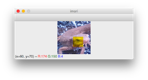

###### datetime:2022/04/11 15:07

###### author:nzb

# 图像基本操作

## 数据读取

* 图像

    * 读取图像使用`imread()`函数

      - img = cv2.imread("test.jpg")
      - opencv读取的格式是：`BGR`

    * `img.shape`：获得图像的大小，返回的元组（tuple）中的三个数依次表示高度、宽度和通道数（蓝通道、绿通道、红通道）。

    * `img.dtype`：获得图片的类型。uint8是一个 8 位无符号整数。图像的RGB分量通常用 0 到 255 的 256 个灰度表示。例如，红色像素为 (R,G,B)=(255,0,0) ，白色是 (R,G,B)=(
      255,255,255) 。如果图像不以这个类型保存的话，图像会变得很奇怪。

    * `cv2.imshow()`：来显示图像。cv2.imshow()的第一个参数是窗口的名字（不写也没有关系），第二个参数是要显示的图像的名称，一定要写。

        ```python
            cv2.imshow('image', img)
            cv2.waitKey(0)
            cv2.destroyAllWindows()
        ```

    * `img.astype(np.float32)`：让img的类型变更为float32的话，可以使用astype()。

        * 如果用这种类型显示图片，就会变成得很奇怪。所以当你想要操作图像时：

            * 使用cv2.imread读取图像；

            * 将图像的类型变为浮点型np.float32；

            * 操作图像；

            * 像素值不满 0 的将值设置为 0 ，像素值超过 255 的将值设置为 255 （超重要）；

              `img = np.clip（img, 0 , 255） 或者 img.clip（0，255）`

            * 将图像类型变更为np.uint8并保存；

              `astype(np.uint8)`

    * img2 = img.copy()：拷贝图像

    * `cv2.imwrite()`：保存图像

      `cv2.imwrite("sample.jpg", img2)：例如之前的被保存为名称为的图像，如果返回值为的话，这就说明该图像被保存在同一个文件夹中，文件名为。`

* 视频

    * cv2.VideoCapture可以捕获摄像头，用数字来控制不同的设备，例如0,1。

      `vc = cv2.VideoCapture("../img/test.mp4")`

    * 如果是视频文件，直接指定好路径即可。

    * 

## 操作像素

* 例如，操作 x=30,y=20 的像素值时，进行以下的操作。像素值是按 BGR 的顺序排列的。array() 表示这个图像是 NumPy 格式。也就是说，OpenCV 是 NumPy 的高层封装。

  `img[20,30]`

* 更进一步，要得到 x=30,y=20 处的 G 分量，可以使用以下代码

  `img[20,30,1]`

* 切片

    * 例如要查看 y=20, x=[30, 32] 这个范围之内（的像素）时，如果设置为30:33可以得到一个矩阵。如果设置a:b，可以获得在 a < v < b 范围内的值。顺便说一下，如果设置为:30可以获得 [0, 30]
      范围内的像素；如果设置为30:的话，可以获得 [30,最后] 像素的值。

      `img[20, 30:33]`

    * 例如将图片左上角（ x=[0, 50], y = [0, 50] ）设置为黑色，是照下面这样做。copy()这个函数在后面介绍。

      `img2[:50, :50] = 0`

        * 

* 获取颜色通道

  `b,g,r = cv2.split(img)`

* 合并颜色通道

  `cv2.merge((b,g,r)) # 合并`

* 之前有提到：像素的值小于 0 的时候设置为 0，超过 255 的时候修改为 255。

    * 例如，图像的类型为float32，将一部分的B分量改为 260。uint8类型的整数范围只能取 [0,255] ，如果变成uint8型的话蝾螈的颜色一部分就会变成黄色的。

    * 这是因为，如果将 260 变为uint8型的话，因为 260-256，所以会让B的值为 4。经常会由于这个原因让像素的值变得不正确。所以上面的第四步的操作（限定值的范围在[0,255]之间）是必要的。

    * 

## 边界填充

* cv2.copyMakeBorder（）

* 选项

    * `BORDER_REPLICATE`：复制法，也就是复制最边缘像素。

    * `BORDER_REFLECT`：反射法，对感兴趣的图像中的像素在两边进行复制

      `例如：fedcba|abcdefgh|hgfedcb`

    * `BORDER_REFLECT_101`：反射法，也就是以最边缘像素为轴，对称

      `gfedcb|abcdefgh|gfedcba`

    * `BORDER_WRAP`：外包装法

      `cdefgh|abcdefgh|abcdefg`

    * `BORDER_CONSTANT`：常量法，常数值填充。

* 

## 图像缩放

* cv2.resize(src， dsize[， dst[， fx[， fy[，interpolation]]]])

    * 选项

        * src：必须，原图像

        * dsize：必须，输出图像所需大小

        * fx：可选，沿水平轴的比例因子

        * fy：可选，沿垂直轴的比例因子

        * interpolation：可选，插值方式

          `通常的，缩小使用cv.INTER_AREA，放缩使用cv.INTER_CUBIC(较慢)和cv.INTER_LINEAR(较快效果也不错)。默认情况下，所有的放缩都使用cv.INTER_LINEAR。`

            * cv2.INTER_NEAREST：最近邻插值

            * cv2.INTER_LINEAR：双线性插值

            * cv2.INTER_CUBIC：双线性插值

            * cv2.INTER_AREA：使用像素区域关系重新采样。它可能是图像抽取的首选方法，因为它可以提供无莫尔条纹的结果。但是当图像被缩放时，它类似于INTER_NEAREST方法。

* 示例

    * cv2.resize（img，（0，0），fx=5，fy=5）：按不同比例缩放

    * cv2.resize（img，（400，500））：缩放成高400，宽500的大小

## 图像融合

`两张图片维度需要一样`

* cv2.addWeighted()

    * cv2.addWeighted（img_cat， 0.4，img_dog， 0.6，0）

      `R = αx + βy + b；其中α和β是对应的权重，哪个值大就更明显，b是亮度级上提亮`

## 图片拼接展示

`需要注意的是图片维度需要一样`

* 水平拼接

    ```python
        res = np.hstack((blur1,gussian,median)) # 水平拼接
        cv2.imshow('median vs gussian vs median', res)
        cv2.waitKey(0)
        cv2.destroyAllWindows()
    ```

* 

* 垂直拼接

    ```python
        res = np.vstack((blur1,gussian,median)) # 水平拼接
    ```

## x, y, w, h作为参数的时候获取图像

* 操作像素：img [ y ：y + h， x：x + w ]

* 作为参数传递函数时：（x，y）或者（x + w，y + h）

