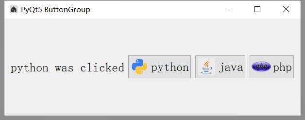

###### datetime:2019/5/20 16:28
###### author:nzb

## 按钮组



```python
import sys
from PyQt5.QtWidgets import QWidget, QApplication, QLabel, QGroupBox, QCheckBox, QHBoxLayout, QPushButton, QButtonGroup
from PyQt5 import QtGui, QtCore


class UI_demo(QWidget):
    """用户界面"""
    def __init__(self):
        super().__init__()

        # 窗口信息
        self.title = 'PyQt5 ButtonGroup'
        self.left = 600
        self.top = 200
        self.width = 500
        self.height = 200
        self.iconName = '../img/home.ico'

        self.initWindow()

    def initWindow(self):

        # 窗口信息
        self.setWindowIcon(QtGui.QIcon(self.iconName))  # 图标设置
        self.setGeometry(self.left, self.top, self.width, self.height)  # 大小位置设置
        self.setWindowTitle(self.title)  # 窗口标题

        # 按钮组
        hbox = QHBoxLayout()

        self.label = QLabel(self)
        self.label.setFont(QtGui.QFont('Sanserif', 15))
        hbox.addWidget(self.label)

        self.buttongroup = QButtonGroup()  # 创建按钮组
        self.buttongroup.buttonClicked[int].connect(self.on_button_clicked)  # 绑定事件

        button = QPushButton('python')
        button.setFont(QtGui.QFont('Sanserif', 15))
        button.setIcon(QtGui.QIcon('../img/python.ico'))
        button.setIconSize(QtCore.QSize(40, 40))
        self.buttongroup.addButton(button, 1)   # 添加按钮
        hbox.addWidget(button)

        button = QPushButton('java')
        button.setFont(QtGui.QFont('Sanserif', 15))
        button.setIcon(QtGui.QIcon('../img/java.ico'))
        button.setIconSize(QtCore.QSize(40, 40))
        self.buttongroup.addButton(button, 2)
        hbox.addWidget(button)

        button = QPushButton('php')
        button.setFont(QtGui.QFont('Sanserif', 15))
        button.setIcon(QtGui.QIcon('../img/php.ico'))
        button.setIconSize(QtCore.QSize(40, 40))
        self.buttongroup.addButton(button, 3)
        hbox.addWidget(button)

        self.setLayout(hbox)

        # 展示窗口
        self.show()

    def on_button_clicked(self, id):
        """按钮事件"""
        for button in self.buttongroup.buttons():
            if button is self.buttongroup.button(id):
                self.label.setText(button.text() + " was clicked")


if __name__ == "__main__":
    app = QApplication(sys.argv)
    ex = UI_demo()
    sys.exit(app.exec_())
```