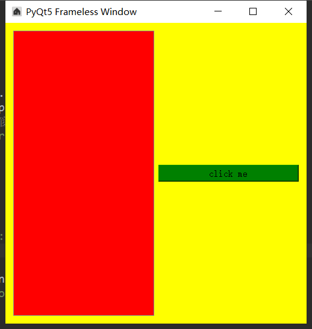

###### datetime:2019/5/21 15:13
###### author:nzb

## 创建框架qframe



```python
import sys
from PyQt5.QtWidgets import QWidget, QApplication, QLabel, QGroupBox, QCheckBox, QHBoxLayout, QPushButton, QButtonGroup, \
    QSizeGrip, QFrame
from PyQt5.QtWidgets import QVBoxLayout, QRadioButton
from PyQt5 import QtGui, QtCore


class UI_demo(QWidget):
    """用户界面"""
    def __init__(self):
        super().__init__()

        # 窗口信息
        self.title = 'PyQt5 Qframe'
        self.left = 600
        self.top = 200
        self.width = 500
        self.height = 500
        self.iconName = '../img/home.ico'

        self.initWindow()

    def initWindow(self):

        # 窗口信息
        self.setWindowIcon(QtGui.QIcon(self.iconName))  # 图标设置
        self.setGeometry(self.left, self.top, self.width, self.height)  # 大小位置设置
        self.setWindowTitle(self.title)  # 窗口标题
        self.setStyleSheet('background-color:yellow')  # 设置背景颜色

        # 框架qframe
        hbox = QHBoxLayout()

        btn = QPushButton('click me')
        btn.setStyleSheet('color:white')
        btn.setStyleSheet('background-color:green')

        frame = QFrame()
        frame.setFrameShape(QFrame.StyledPanel)
        frame.setStyleSheet('background-color:red')

        hbox.addWidget(frame)
        hbox.addWidget(btn)

        self.setLayout(hbox)

        # 展示窗口
        self.show()


if __name__ == "__main__":
    app = QApplication(sys.argv)
    ex = UI_demo()
    sys.exit(app.exec_())
```
