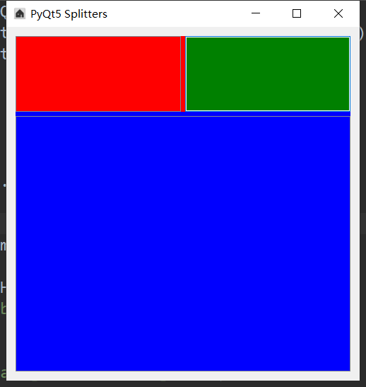

###### datetime:2019/5/21 15:16
###### author:nzb


## 创建分离器



```python
import sys
from PyQt5.QtWidgets import QWidget, QApplication, QLabel, QGroupBox, QCheckBox, \
    QHBoxLayout, QPushButton, QButtonGroup, QSizeGrip, QFrame
from PyQt5.QtWidgets import QVBoxLayout, QRadioButton, QSplitter, QLineEdit
from PyQt5 import QtGui, QtCore
from PyQt5.QtCore import Qt


class UI_demo(QWidget):
    """用户界面"""
    def __init__(self):
        super().__init__()

        # 窗口信息
        self.title = 'PyQt5 Splitters'
        self.left = 600
        self.top = 200
        self.width = 500
        self.height = 500
        self.iconName = '../img/home.ico'

        self.initWindow()

    def initWindow(self):

        # 窗口信息
        self.setWindowIcon(QtGui.QIcon(self.iconName))  # 图标设置
        self.setGeometry(self.left, self.top, self.width, self.height)  # 大小位置设置
        self.setWindowTitle(self.title)  # 窗口标题

        # 分离器
        hbox = QHBoxLayout()

        left = QFrame()
        left.setFrameShape(QFrame.StyledPanel)

        bottom = QFrame()
        bottom.setFrameShape(QFrame.StyledPanel)

        splitter1 = QSplitter(Qt.Horizontal)  # 水平分离（默认）
        splitter1.setStyleSheet('background-color:red')

        lineedit = QLineEdit()
        lineedit.setStyleSheet('background-color:green')

        splitter1.addWidget(left)
        splitter1.addWidget(lineedit)
        splitter1.setSizes([200, 200])

        splitter2 = QSplitter(Qt.Vertical)  # 垂直分离
        splitter2.addWidget(splitter1)
        splitter2.addWidget(bottom)
        splitter2.setStyleSheet('background-color:blue')

        hbox.addWidget(splitter2)

        self.setLayout(hbox)

        # 展示窗口
        self.show()


if __name__ == "__main__":
    app = QApplication(sys.argv)
    ex = UI_demo()
    sys.exit(app.exec_())
```