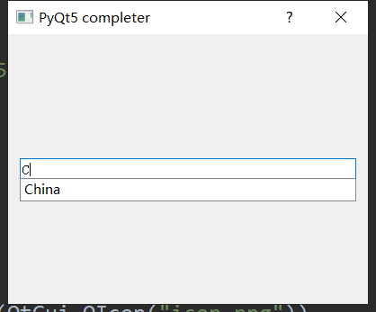

###### datetime:2019/5/23 14:14
###### author:nzb

## 首字符模糊填充（查询）



```python
from PyQt5 import QtGui
from PyQt5.QtWidgets import QApplication,QLabel, QComboBox, QVBoxLayout,  QDialog, QMainWindow, QCalendarWidget, QVBoxLayout, QLabel
import sys
from PyQt5.QtWidgets import QCompleter, QLineEdit


class Window(QDialog):
    """模糊查询"""
    def __init__(self):
        super().__init__()

        self.title = "PyQt5 completer"
        self.top = 200
        self.left = 500
        self.width = 400
        self.height = 300

        self.InitWindow()

    def InitWindow(self):
        self.setWindowIcon(QtGui.QIcon("icon.png"))
        self.setWindowTitle(self.title)
        self.setGeometry(self.left, self.top, self.width, self.height)

        self.InitUI()
        self.show()

    def InitUI(self):

        vbox = QVBoxLayout()
        names = ['China', 'USA', 'Pakistan', 'Japan', 'India', 'American', '测试中文']
        completer = QCompleter(names)

        self.lineedit = QLineEdit()
        self.lineedit.setCompleter(completer)
        vbox.addWidget(self.lineedit)

        self.setLayout(vbox)


App = QApplication(sys.argv)
window = Window()
sys.exit(App.exec())
```