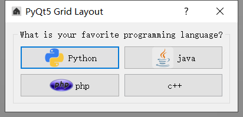
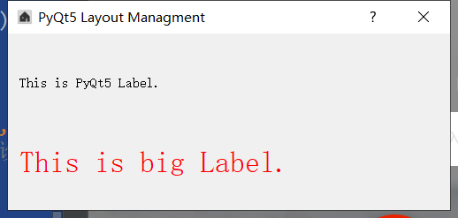
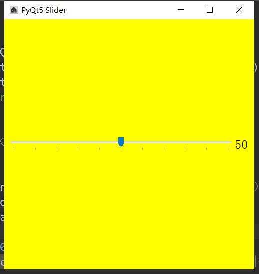
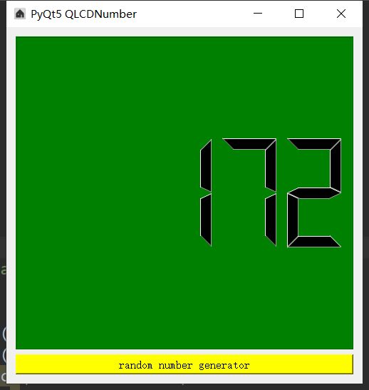
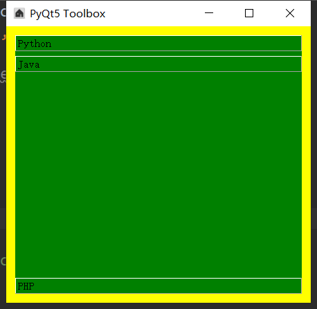
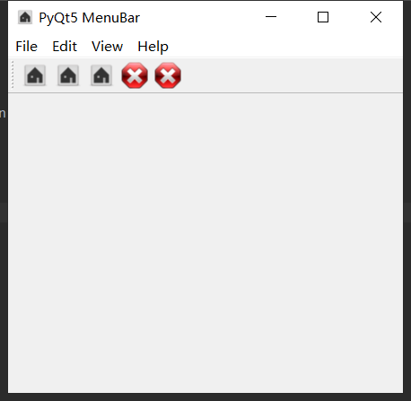
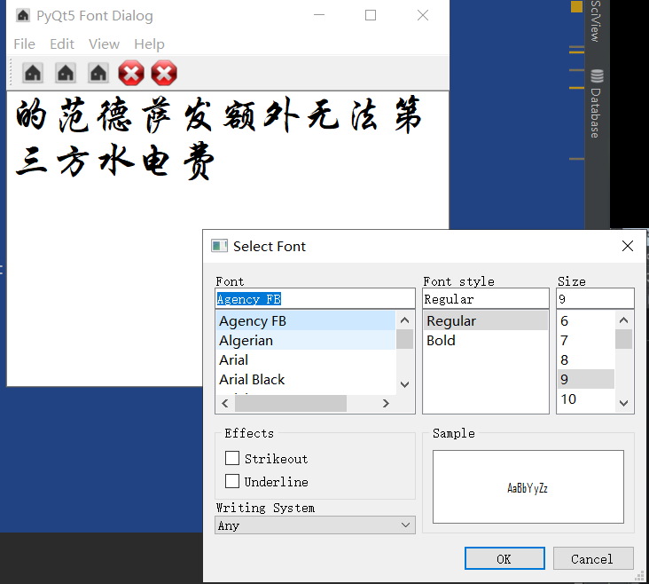
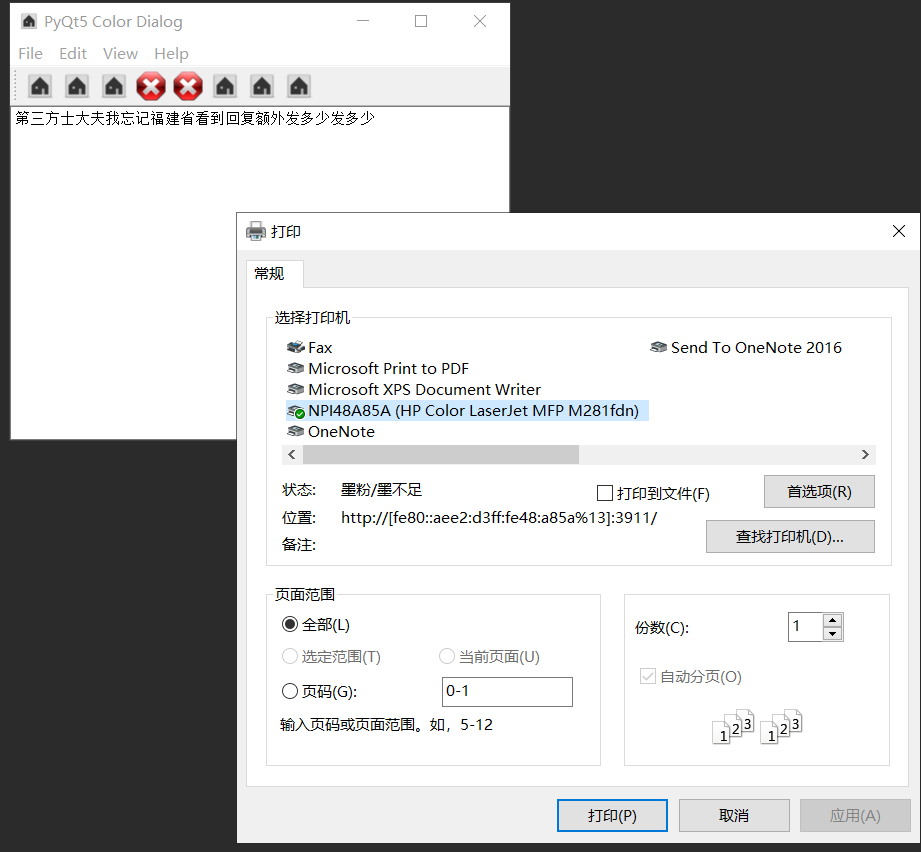

###### datetime:2019/5/23 15:28
###### author:nzb

##PyQt5关系图

## [创建窗口](./01-窗口.md)

## [创建按钮](./02-按钮.md)

## [垂直布局和水平布局](./03-垂直布局和水平布局.md)

## [栅格布局](./04-栅格布局.md)

## [布局添加标签](./05-布局添加标签Label.md)

## [布局添加背景图](./06-布局添加背景图.md)

## [单选按钮](./07-单选框.md)

## [复选框](./08-复选框.md)

## [创建提示](./09-键盘提示.md)

## [行编辑](./10-行编辑lineedit.md)

## [按钮组](./11-按钮组.md)

## [布局组](./12-布局组.md)

## [无边框窗口](./13-无边框窗口.md)

## [创建框架qframe](./14-框架qframe.md)

## [创建分离器](./15-分离器.md)

## [创建滑动条](./16-滑动条.md)

## [创建滚动条](./17-滚动条.md)

## [创建刻度盘](./18-刻度盘.md)

## [spinbox](./19-spinbox.md)

## [生成随机数](./20-生成随机数.md)

## [进度条](./21-进度条.md)

## [工具框](./22-工具框.md)

## [菜单栏和工具栏](./23-菜单栏工具栏.md)

## [文档编辑框](./24-文档编辑框.mdd)

## [文本框字体的选择](./25-字体文本框.md)

## [字体颜色](./26-颜色文本框.md)

## [打印](./27-打印（文本框）.md)

## [打印预览](./28-打印预览.md)

## [打印PDF](./29-打印PDF.md)

## [（带选择的）消息框提示框](./30-消息框提示框（带选择的）.md)

## [右键菜单](./31-右键菜单.md)

## [选项卡（单选下拉框和多选）](./32-选项卡（单选下拉框和多选）.md)

## [stack(堆叠小部件)](./33-stack(堆叠)小部件.md)

## [可停靠的窗口小部件](./34-可停靠的窗口小部件.md)

## [日历](./35-日历.md)

## [单选下拉框](./36-单选下拉框.md)

## [首字符模糊填充（查询）](./37-首字符模糊填充（查询）.md)

## [打开更多的窗口](./38-打开更多的窗口.md)

## [时间编辑](./39-时间编辑.md)

## [列表部件](./40-列表部件.md)

## [列表部件小示例](./41-列表部件小示例.md)

