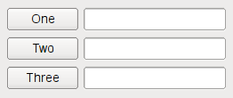
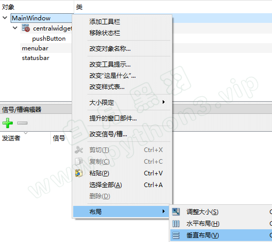

## 界面设计师 Qt Designer

### Qt Designer 简介

QT程序界面的 一个个窗口、控件，就是像上面那样用相应的代码创建出来的。

但是，把你的脑海里的界面，用代码直接写出来，是有些困难的。

很多时候，运行时呈现的样子，不是我们要的。我们经常还要修改代码调整界面上控件的位置，再运行预览。反复多次这样操作。

可是这样，真的…太麻烦了。

其实，我们可以用QT界面生成器 Qt Designer ，拖拖拽拽就可以直观的创建出程序大体的界面。

怎么运行这个工具呢？

Windows下，运行 Python安装目录下 `Scripts\pyside2-designer.exe` 这个可执行文件

如果你安装的是pyqt5， 运行 Python安装目录下 `Scripts\pyqt5designer.exe` 这个可执行文件

通过 Qt Designer 设计的界面，最终是保存在一个ui文件中的。

大家可以打开这个ui文件看看，就是一个XML格式的界面定义。

### 动态加载UI文件

有了界面定义文件，我们的Python程序就可以从文件中加载UI定义，并且动态创建一个相应的窗口对象。

如下：

```python
from PySide2.QtWidgets import QApplication, QMessageBox
from PySide2.QtUiTools import QUiLoader


class Stats:

    def __init__(self):
        # 从文件中加载UI定义

        # 从 UI 定义中动态 创建一个相应的窗口对象
        # 注意：里面的控件对象也成为窗口对象的属性了
        # 比如 self.ui.button , self.ui.textEdit
        self.ui = QUiLoader().load('main.ui')

        self.ui.button.clicked.connect(self.handleCalc)

    def handleCalc(self):
        info = self.ui.textEdit.toPlainText()

        salary_above_20k = ''
        salary_below_20k = ''
        for line in info.splitlines():
            if not line.strip():
                continue
            parts = line.split(' ')

            parts = [p for p in parts if p]
            name, salary, age = parts
            if int(salary) >= 20000:
                salary_above_20k += name + '\n'
            else:
                salary_below_20k += name + '\n'

        QMessageBox.about(self.ui,
                          '统计结果',
                          f'''薪资20000 以上的有：\n{salary_above_20k}
                    \n薪资20000 以下的有：\n{salary_below_20k}'''
                          )


app = QApplication([])
stats = Stats()
stats.ui.show()
app.exec_()
```

如果你使用的是PyQt5 而不是 PySide2，加载UI文件的代码如下

```python
from PyQt5 import uic


class Stats:

    def __init__(self):
        # 从文件中加载UI定义
        self.ui = uic.loadUi("main.ui")
```

### 转化 UI文件为 Python 代码

还有一种使用 UI 文件的方式：先把UI文件直接转化为包含界面定义的 Python 代码文件，然后在你的程序中使用定义界面的类

执行如下的命令把 UI 文件直接转化为包含界面定义的 Python 代码文件
`pyside2-uic main.ui > ui_main.py`

如果你安装的是PyQt5，执行如下格式的命令转化
`pyuic5 main.ui > ui_main.py`

然后在你的代码文件中这样使用定义界面的类

```python
from PySide2.QtWidgets import QApplication, QMainWindow
from ui_main import Ui_MainWindow


class MainWindow(QMainWindow):

    def __init__(self):
        super().__init__()
        # 使用ui文件导入定义界面类
        self.ui = Ui_MainWindow()
        # 初始化界面
        self.ui.setupUi(self)

        # 使用界面定义的控件，也是从ui里面访问
        self.ui.webview.load('http://www.baidu.com')


app = QApplication([])
mainw = MainWindow()
mainw.show()
app.exec_()
```

那么我们该使用哪种方式比较好呢？动态加载还是转化为Python代码？

**建议**：通常采用动态加载比较方便，因为改动界面后，不需要转化，直接运行，特别方便。

但是，如果你的程序里面有非qt designer提供的控件， 这时候，需要在代码里面加上一些额外的声明，而且可能还会有奇怪的问题。往往就要采用转化Python代码的方法。

### 界面布局 Layout

我们前面写的界面程序有个问题，如果你用鼠标拖拽主窗口边框右下角，进行缩放，就会发现里面的控件一直保持原有大小不变。这样会很难看。

我们通常希望，随着主窗口的缩放， 界面里面的控件、控件之间的距离也相应的进行缩放。

Qt是通过界面布局 Layout 类来实现这种功能的。

我们最常用的 Layout布局 有4种，分别是

- QHBoxLayout 水平布局：把控件从左到右 水平横着摆放，如下所示
  
- QVBoxLayout 垂直布局：把控件从上到下竖着摆放，如下所示
  
- QGridLayout 表格布局：把多个控件 格子状摆放，有的控件可以 占据多个格子，如下所示
  
- QFormLayout 表单布局：表单就像一个只有两列的表格，非常适合填写注册表单这种类型的界面，如下所示
  

### MainWindow 的 Layout

如果我们选择的主窗口是MainWindow类型，要给MainWindow整体设定Layout，`必须先添加一个控件到 centralwidget 下面` ，如下


然后才能右键点击 MainWindow，选择布局，如下



### 调整控件位置和大小

- 调整 layout 中控件的大小比例  
  可以通过设定控件的 sizePolicy 给不同的值来调整。

- 调整控件间距  
  要调整控件上下间距，可以给控件添加layout，然后通过设定layout的上下的padding 和 margin 来调整间距。  
  要调整控件的左右间距，可以通过添加 horizontal spacer （弹簧）进行控制，也可以通过layout的左右margin。

- 调整控件次序  
  有的时候 我们需要调整一个layout里面，控件的上下显示次序，或者左右显示次序，该怎么做呢？  
  如果是简单的两个控件在 layout里面，通常直接拖动就行了。

### 界面布局步骤建议

先不使用任何 Layout，把所有控件按位置摆放在界面上

然后先从 最内层开始 进行控件的 Layout 设定

逐步拓展到外层 进行控件的 Layout设定

最后调整 layout中控件的大小比例， 优先使用 Layout的 layoutStrentch 属性来控制

### 从一个窗口跳转到另外一个窗口

程序开始的时候显示一个窗口（比如登录窗口），操作后进入到另外一个窗口，怎么做。

方法很简单，主要就是 实例化另外一个窗口，显示新窗口，关闭老窗口。

如下代码所示

```python
from PySide2 import QtWidgets
import sys


class Window2(QtWidgets.QMainWindow):

    def __init__(self):
        super().__init__()
        self.setWindowTitle('窗口2')

        centralWidget = QtWidgets.QWidget()
        self.setCentralWidget(centralWidget)

        button = QtWidgets.QPushButton('按钮2')

        grid = QtWidgets.QGridLayout(centralWidget)
        grid.addWidget(button)


class MainWindow(QtWidgets.QMainWindow):
    def __init__(self):
        super().__init__()
        self.setWindowTitle('窗口1')

        centralWidget = QtWidgets.QWidget()
        self.setCentralWidget(centralWidget)

        button = QtWidgets.QPushButton('打开新窗口')
        button.clicked.connect(self.open_new_window)

        grid = QtWidgets.QGridLayout(centralWidget)
        grid.addWidget(button)

    def open_new_window(self):
        # 实例化另外一个窗口
        self.window2 = Window2()
        # 显示新窗口
        self.window2.show()
        # 关闭自己
        self.close()


if __name__ == '__main__':
    app = QtWidgets.QApplication(sys.argv)
    window = MainWindow()
    window.show()
    sys.exit(app.exec_())
```

如果经常要在两个窗口来回跳转，可以使用 hide() 方法 隐藏窗口， 而不是 closes() 方法关闭窗口。 这样还有一个好处：被隐藏的窗口再次显示时，原来的操作内容还保存着，不会消失。

### 弹出模式对话框

有的时候，我们需要弹出一个模式对话框输入一些数据，然后回到 原窗口。

所谓模式对话框，就是弹出此对话框后， 原窗口就处于不可操作的状态，只有当模式对话框关闭才能继续。

参考如下代码

```python
from PySide2 import QtWidgets
import sys


class MyDialog(QtWidgets.QDialog):
    def __init__(self):
        super().__init__()
        self.setWindowTitle('模式对话框')

        self.resize(500, 400)
        self.textEdit = QtWidgets.QPlainTextEdit(self)
        self.textEdit.setPlaceholderText("请输入薪资表")
        self.textEdit.move(10, 25)
        self.textEdit.resize(300, 350)

        self.button = QtWidgets.QPushButton('统计', self)
        self.button.move(380, 80)


class MainWindow(QtWidgets.QMainWindow):
    def __init__(self):
        super().__init__()
        self.setWindowTitle('主窗口')

        centralWidget = QtWidgets.QWidget()
        self.setCentralWidget(centralWidget)

        button = QtWidgets.QPushButton('打开模式对话框')
        button.clicked.connect(self.open_new_window)

        grid = QtWidgets.QGridLayout(centralWidget)
        grid.addWidget(button)

    def open_new_window(self):
        # 实例化一个对话框类
        self.dlg = MyDialog()
        # 显示对话框，代码阻塞在这里，
        # 等待对话框关闭后，才能继续往后执行
        self.dlg.exec_()


if __name__ == '__main__':
    app = QtWidgets.QApplication(sys.argv)
    window = MainWindow()
    window.show()
    sys.exit(app.exec_())
```


