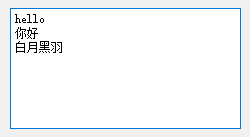
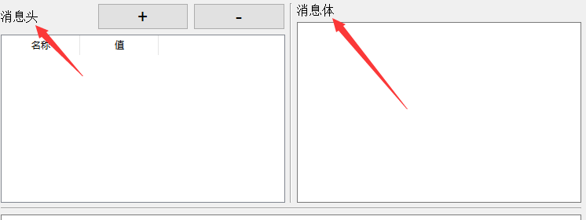
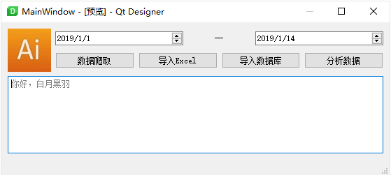

## 常用控件 1

### 按钮

`QPushButton` 就是常见的按钮  


- 信号：被点击 当按钮被点击就会发出 `clicked` 信号，可以这样指定处理该信号的函数
  `button.clicked.connect(handleCalc)`
- 方法：改变文本 代码中可以使用 `setText` 方法来改变按钮文本，比如
  `button.setText(text)`
- 方法：禁用、启用  
  所有控件（继承自`QWidget`类）都支持 禁用和启用方法。 禁用后，该控件不再处理用户操作
    - 禁用
      `button.setEnabled(False)`
    - 启用
      `button.setEnabled(True)`

### 单行文本框

`QLineEdit` 是只能单行编辑的文本框。  


- 信号：文本被修改  
  当文本框中的内容被键盘编辑，被点击就会发出 `textChanged` 信号，可以这样指定处理该信号的函数  
  `edit.textChanged.connect(handleTextChange)`        
  Qt在调用这个信号处理函数时，传入的参数就是 文本框目前的内容字符串。
- 信号：按下回车键  
  当用户在文本框中任何时候按下回车键，就会发出 `returnPressed` 信号。  
  有时我们需要处理这种情况，比如登录界面，用户输完密码直接按回车键就进行登录处理，比再用鼠标点击登录按钮快捷的多。 可以指定处理 `returnPressed` 信号，如下所示  
  `passwordEdit.returnPressed.connect(onLogin)`
- 方法：获取文本  
  通过 `text` 方法获取编辑框内的文本内容，比如  
  `text = edit.text()`
- 方法：设置提示  
  通过 `setPlaceholderText` 方法可以设置提示文本内容，比如  
  `edit.setPlaceholderText('请在这里输入URL')`
- 方法：设置文本  
  通过 `setText` 方法设置编辑框内的文本内容为参数里面的文本字符串，比如  
  `edit.setText('你好，白月黑羽')`  
  原来的所有内容会被清除
- 方法：清除所有文本  
  `clear` 方法可以清除编辑框内所有的文本内容，比如  
  `edit.clear()`
- 方法：拷贝文本到剪贴板
  `copy` 方法可以拷贝当前选中文本到剪贴板，比如  
  `edit.copy()`
- 方法：粘贴剪贴板文本 `paste` 方法可以把剪贴板内容，拷贝到编辑框当前光标所在处，比如
  `edit.paste()`

### 多行纯文本框

`QPlainTextEdit` 是可以多行的纯文本编辑框。  


**注意**：在苹果MacOS上，有 更新文本框内容后，需要鼠标滑过才能更新显示的bug，[参考这里](https://bugreports.qt.io/browse/PYSIDE-871)

- 信号：文本被修改   
  当文本框中的内容被键盘编辑，被点击就会发出 `textChanged` 信号，可以这样指定处理该信号的函数  
  `edit.textChanged.connect(handleTextChange)`
  **注意**： Qt在调用这个信号处理函数时，**不会传入**文本框目前的内容字符串，作为参数。  
  这个行为 和 单行文本框不同。

- 信号：光标位置改变   
  当文本框中的光标位置变动，就会发出 `cursorPositionChanged` 信号，可以这样指定处理该信号的函数
  `edit.cursorPositionChanged.connect(handleChanged)`

- 方法：获取文本  
  通过 `toPlainText` 方法获取编辑框内的文本内容，比如  
  `text = edit.toPlainText()`

- 方法：获取选中文本
  ```python
  # 获取 QTextCursor 对象
  textCursor = edit.textCursor()
  selection = textCursor.selectedText()
  ```

- 方法：设置提示  
  通过 `setPlaceholderText` 方法可以设置提示文本内容，比如  
  `edit.setPlaceholderText('请在这里输入薪资表')`
- 方法：设置文本  
  通过 `setPlainText` 方法设置编辑框内的文本内容 为参数里面的文本字符串，比如  
  `edit.setPlainText('''你好，白月黑羽 hello byhy''')`  
  原来的所有内容会被清除

- 方法：在末尾添加文本  
  通过 `appendPlainText` 方法在编辑框末尾添加文本内容，比如
  `edit.appendPlainText('你好，白月黑羽')`  
  **注意**：这种方法会在添加文本后 自动换行

- 方法：在光标处插入文本  
  通过 `insertPlainText` 方法在编辑框末尾添加文本内容，比如     
  `edit.insertPlainText('你好，白月黑羽')`  
  **注意**：这种方法 不会 在添加文本后自动换行

- 方法：清除所有文本
  `clear` 方法可以清除编辑框内所有的文本内容，比如  
  `edit.clear()`

- 方法：拷贝文本到剪贴板
  `copy` 方法可以拷贝当前选中文本到剪贴板，比如  
  `edit.copy()`

- 方法：粘贴剪贴板文本
  `paste` 方法可以把剪贴板内容，拷贝到编辑框当前光标所在处，比如  
  `edit.paste()`

### 文本浏览框

`QTextBrowser` 是只能查看文本控件。  
通常用来显示一些操作日志信息、或者不需要用户编辑的大段文本内容。  
该控件 获取文本、设置文本、清除文本、剪贴板复制粘贴 等等， 都和上面介绍的 多行纯文本框是一样的。

- 方法：在末尾添加文本  
  通过 `append` 方法在编辑框末尾添加文本内容，比如  
  `textBrowser.append('你好，白月黑羽')`  
  有时，浏览框里面的内容长度超出了可见范围，我们在末尾添加了内容，往往希望控件自动翻滚到当前添加的这行， 可以通过 ensureCursorVisible 方法来实现
  ```python
  textBrowser.append('你好，白月黑羽')
  textBrowser.ensureCursorVisible()
  ```
  **注意**：这种方法会在添加文本后 自动换行

- 方法：在光标处插入文本  
  通过 `insertPlainText` 方法在编辑框末尾添加文本内容，比如  
  `edit.insertPlainText('你好，白月黑羽')`
  **注意**：这种方法不会在添加文本后自动换行

### 标签

`QLabel` 就是常见的标签，可以用来显示文字（包括纯文本和富文本）、图片 甚至动画。  


- 方法：改变文本  
  代码中可以使用 `setText` 方法来改变标签文本内容，比如
  `button.setText(text)`
- 显示图片  
  `QLabel` 可以用来显示图片，有时一个图片可以让界面好看很多，如下图所示  
  
  怎么用 `QLabel` 显示图片呢？  
  可以在 `Qt Designer` 上 属性编辑器 `QLabel` 栏 的 `pixmap` 属性设置中选择图片文件指定。


