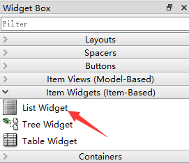

## 常用控件2

### 组合选择框

`QComboBox` 是组合选择框，如下图所示  


- 信号：选项改变  
  如果用户操作修改了`QComboBox`中的选项就会发出 `currentIndexChanged` 信号，可以这样指定处理该信号的函数  
  `cbox.currentIndexChanged.connect(handleSelectionChange)`
- 方法：添加一个选项  
  代码中可以使用 `addItem` 方法来添加一个选项到 末尾 ，参数就是选项文本  
  `cbox.addItem('byhy')`
- 方法：添加多个选项  
  代码中可以使用 `addItems` 方法来添加多个选项到 末尾，参数是包含了多个选项文本的列表  
  `cbox.addItems(['byhy','白月黑羽','python教程'])`
- 方法：清空选项  
  代码中可以使用 `clear` 方法来清空选项，也就是删除选择框内所有的选项  
  `cbox.clear()`
- 方法：获取当前选项文本  
  代码中可以使用 `currentText` 方法来获取当前 选中的选项 的文本，比如  
  `method = cbox.currentText()`

### 列表

`QListWidget` 是列表控件，如下图所示  
  
`Qt Designer `如下图 选择：  


- 方法：添加一个选项  
  代码中可以使用 `addItem` 方法来添加一个选项到 末尾 ，参数就是选项文本    
  `listWidget.addItem('byhy')`
- 方法：添加多个选项  
  代码中可以使用 addItems 方法来添加多个选项到 末尾，参数是包含了多个选项文本的列表  
  `listWidget.addItems(['byhy','白月黑羽','python教程'])`
- 方法：删除一个选项  
  代码中可以使用 `takeItem` 方法来删除1个选项，参数是该选项所在行    
  `listWidget.takeItem(1)`  
  就会删除第二行选项
- 方法：清空选项  
  代码中可以使用 `clear` 方法来清空选项，也就是删除选择框内所有的选项  
  `listWidget.clear()`
- 方法：获取当前选项文本   
  `currentItem` 方法可以得到列表当前选中项对象（`QListWidgetItem`） ，再调用这个对象的 text 方法，就可以获取文本内容，比如  
  `listWidget.currentItem().text()`   
  就获取了 第1行，第1列 的单元格里面的文本。  
  `listWidget.currentItem().text()`

### 表格

`QTableWidget` 是表格控件，如下图所示  
  
`Qt Designer` 如下图 选择：  


- 创建列和标题栏 我们可以通过 `Qt designer` 为一个表格创建列和对应的标题栏。  
  只需要双击 `Qt designer` 设计的窗体中的 表格控件， 就会出现这样的对话框。
    
  在列标签栏中，点击左下角的加号，就可以为 添加一个列，并且设置标题栏名称。  
  
- 方法：插入一行、删除一行
  `insertRow` 方法可以在指定位置插入一行，比如  
  `table.insertRow(0)`  
  就插入一行到第 1 行这个位置， 表格原来第1行（包括原来的第1行）以后的内容，全部往下移动一行。  
  `table.insertRow(2)`  
  就插入一行到第 3 行这个位置， 表格原来第3行（包括原来的第3行）以后的内容，全部往下移动一行。  
  `removeRow` 方法可以删除指定位置的一行，比如  
  `table.removeRow(0)`
  就删除第 1 行， 表格原来第1行以后的内容，全部往上移动一行。  
  `table.removeRow(2)`  
  就删除第 3 行， 表格原来第3行以后的内容，全部往上移动一行。
- 方法：设置单元格文本内容  
  qt表格的单元格内的内容对象 是一个 单元格对象 `QTableWidgetItem` 实例 如果单元格 没有被设置过 内容，可以这样
    ```python
    from PySide2.QtWidgets import QTableWidgetItem
    
    item = QTableWidgetItem()
    item.setText('白月黑羽')
    table.setItem(row, 0, item)
    ```
  也可以简写为
    ```python
    from PySide2.QtWidgets import QTableWidgetItem
    
    table.setItem(row, 0, QTableWidgetItem('白月黑羽'))
    ```
  如果单元格 已经被设置过 文本内容，  
  item 方法可以获取指定位置的 `QTableWidgetItem` ，再调用这个对象的 `setText` 方法，就可以设置单元格文本内容，比如  
  `table.item(0,0).setText('白月黑羽-江老师')`  
  就设置了 第1行，第1列 的单元格里面的文本。  
  `table.item(2,4).setText('白月黑羽-江老师')`  
  就设置了 第3行，第5列 的单元格里面的文本。  
  如果希望某个单元格为 只读，不允许修改，可以使用`QTableWidgetIte`m对象的 `setFlags` 方法，像这样
    ```python
    from PySide2.QtWidgets import QTableWidgetItem
    from PySide2.QtCore import Qt
    
    item = QTableWidgetItem('白月黑羽')
    item.setFlags(Qt.ItemIsEnabled) # 参数名字段不允许修改
    table.setItem(row, 0, item)
    ```
  如果想文本内容 居中对齐，每个当对应的`QTableWidgetItem` 调用 `setTextAlignment`，如下
    ```python
    from PySide2.QtWidgets import QTableWidgetItem
    from PySide2.QtCore import Qt
    
    item = QTableWidgetItem()
    item.setText('白月黑羽')
    # 文本居中
    item.setTextAlignment(Qt.AlignHCenter) 
    table.setItem(row, 0, item)
    ```
- 方法：获取单元格文本的内容  
  `item` 方法可以指定位置的单元格对象（`QTableWidgetItem`） ，再调用这个对象的 `text` 方法，就可以获取文本内容，比如  
  `table.item(0,0).text()`  
  就获取了 第1行，第1列 的单元格里面的文本。  
  `table.item(2,4).text()`
  就获取了 第3行，第5列 的单元格里面的文本。
- 方法：获取所有行数、列数  
  代码中可以使用 `rowCount` 方法来获取表格所有的 行数 ，比如  
  `rowcount = table.rowCount()`  
  可以使用 `columnCount` 方法来获取表格所有的 列数 ，比如  
  `rowcount = table.columnCount()`
- 方法：获取当前选中是第几行  
  代码中可以使用 currentRow 方法来获取当前选中是第几行，比如  
  `currentrow = table.currentRow()`  
  注意：行数是从0开始的， 第一行的行数是 0
- 方法：设置表格行数、列数  
  代码中可以使用 setRowCount 方法来设置表格 行数 ，比如  
  `table.setRowCount(10)`  
  代码中可以使用 setColumnCount 方法来设置表格 列数 ，比如  
  `table.setColumnCount(10)`
- 方法：清除/删除所有内容  
  `clearContents` 方法可以清除表格所有的内容，比如  
  `table.clearContents()`  
  清除后，仍然会留下表格栏  
  如果连表格栏都要删除，可以使用 `setRowCount(0)`，像这样  
  `table.setRowCount(0)`
- 方法：设定列宽、宽度自动缩放  
  Qt Designer 上目前没法拖拽设定 每个列的宽度，只能在代码中指定。  
  如下所示
    ```python
    # 设定第1列的宽度为 180像素
    table.setColumnWidth(0, 180)
    
    # 设定第2列的宽度为 100像素
    table.setColumnWidth(1, 100)
    ```
  如想让 表格控件宽度 随着父窗口的缩放自动缩放，可以 在 属性编辑器 中 勾选 `HorizontalHeaderStretchLastSection`  
  或者使用下面代码  
  `table.horizontalHeader().setStretchLastSection(True)`
- 信号：单元格内容改动  
  当用户修改了一个单元格的内容，会发出 `cellChanged` 信号，并且携带参数指明该单元格的行号和列号。 我们的代码可以对该信号进行相应的处理。  
  示例代码如下
  ```python
    def __init__(self):
      # 指定单元格改动信号处理函数
      self.ui.table.cellChanged.connect(self.cfgItemChanged)
    def cfgItemChanged(self, row, column):
        # 获取更改内容
        cfgName = self.ui.table.item(row, 0).text()  # 首列为配置名称
        cfgValue = self.ui.table.item(row, column).text()
  ```


