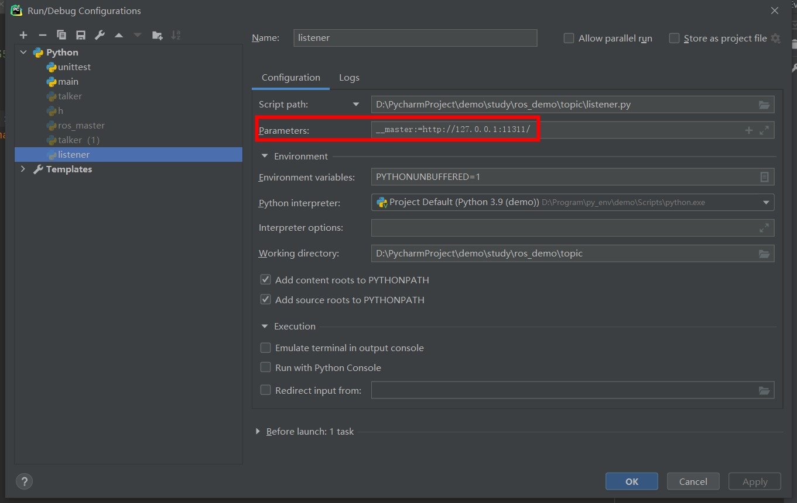

###### datetime:2023/02/06 16:30

###### author:nzb

# Windows安装rospy

ros 相关包下载链接，[官方链接](https://rospypi.github.io/simple/) ，采用轮子方法安装

## 安装依赖顺序

```text
1、catkin
2、roslib
3、genmsg（roscpp依赖）
4、genpy（roscpp依赖）
5、roscpp（rospy依赖）
6、std_msgs（rospy依赖）
7、rosgraph_msgs（rospy依赖）
8、rosgraph（rospy依赖）
9、rospy
10、rosmaster
```

## 设置系统环境变量

- `ROS_LOG_DIR`=`C:\Users\lenovo\.ros\log`          # 日志路径
- `ROS_MASTER_URI`=`http://172.31.242.34:11311/`    # master uri
- `ROS_ROOT`=`C:\Users\lenovo\.ros`                 # ros 根目录

> 修改环境变量后需要重启IDE

- 不改环境变量也可跑，需要配置执行参数

- `master.py`

```python
import rosmaster

if __name__ == '__main__':
    rosmaster.rosmaster_main(["--core"])
```

配置运行参数，该处未配置才会取系统环境变量的



## 日志配置

目录：`ROS_ROOT`目录下建立`config`目录，里面新建`python_logging.conf`
配置文件，配置文件配置说明[官方链接](https://docs.python.org/zh-cn/2.7/library/logging.config.html#configuration-file-format)

```ini
# -*- encoding: utf8 -*-
[loggers]
keys = root, fileLogger, rotatingFileLogger

[handlers]
keys = consoleHandler, fileHandler, rotatingFileHandler

[formatters]
keys = simpleFormatter

[logger_root]
level = DEBUG
handlers = consoleHandler, fileHandler

[logger_fileLogger]
level = DEBUG
handlers = fileHandler
qualname = fileLogger
propagate = 0

[logger_rotatingFileLogger]
level = DEBUG
handlers = consoleHandler, rotatingFileHandler
qualname = rotatingFileLogger
propagate = 0

[handler_consoleHandler]
class = StreamHandler
level = DEBUG
formatter = simpleFormatter
args = (sys.stdout, )

[handler_fileHandler]
class = FileHandler
level = DEBUG
formatter = simpleFormatter
args = ('C:/Users/lenovo/.ros/log/logging.log', 'a')

[handler_rotatingFileHandler]
class = handlers.RotatingFileHandler
level = WARNING
formatter = simpleFormatter
args = ("C:/Users/lenovo/.ros/log/rotating_logging.log", "a", 1*1024*1024, 5)

[formatter_simpleFormatter]
#format=%(asctime)s - %(name)s - %(levelname)s - %(message)s
format = %(asctime)s - %(module)s - %(thread)d - %(levelname)s:%(message)s
datefmt = %Y-%m-%d %H:%M:%S
```
