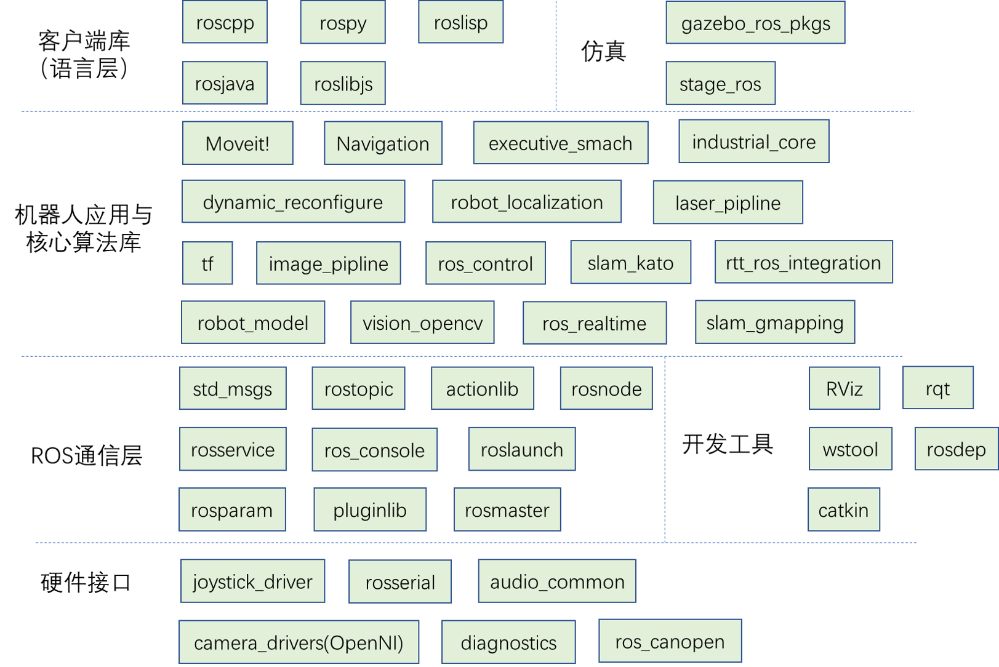
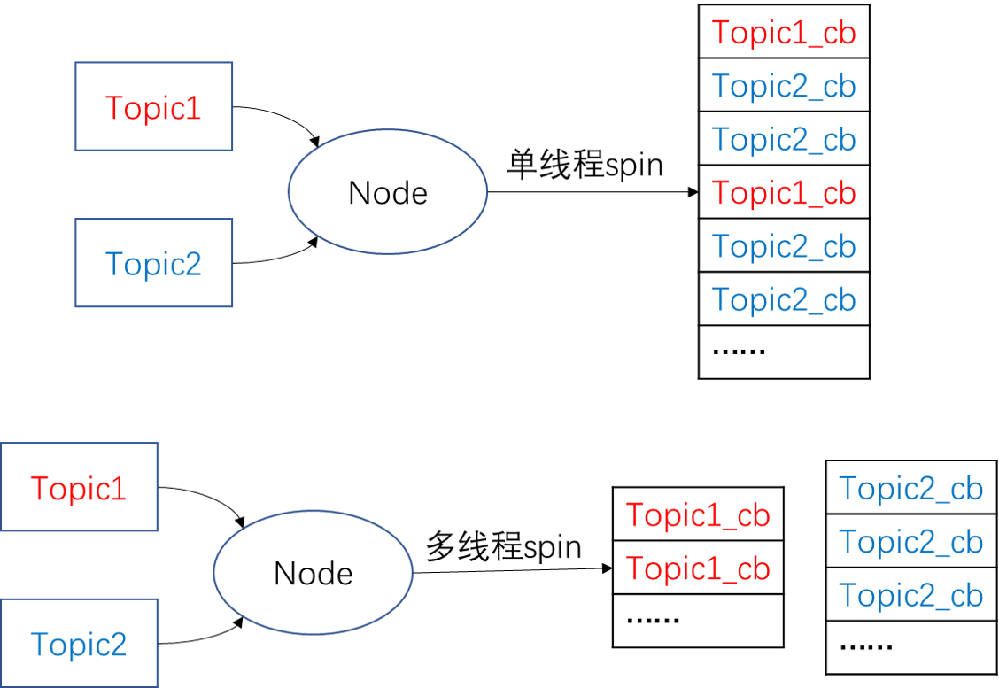

###### datetime:2022/04/25 10:51

###### author:nzb

# Client Library与roscpp

## Client Library简介

ROS为机器人开发者们提供了不同语言的编程接口，比如C++接口叫做roscpp，Python接口叫做rospy，Java接口叫做rosjava。尽管语言不通，但这些接口都可以用来创建topic、service、param，实现ROS的通信功能。Clinet
Lirary有点类似开发中的Helper Class，把一些常用的基本功能做了封装。

目前ROS支持的Clinet Library包括：

| Client Library | 介绍 |
| ----- | ----- |
| roscpp | ROS的C++库，是目前最广泛应用的ROS客户端库，执行效率高 |
| rospy | ROS的Python库，开发效率高，通常用在对运行时间没有太大要求的场合，例如配置、初始化等操作 |
| roslisp | ROS的LISP库 |
| roscs | Mono/.NET.库，可用任何Mono/.NET语言，包括C#，Iron Python， Iron Ruby等 |
| rosgo | ROS Go语言库 |
| rosjava | ROS Java语言库 |
| rosnodejs | Javascript客户端库 |
| ... | ... |

目前最常用的只有roscpp和rospy，而其余的语言版本基本都还是测试版。

从开发客户端库的角度看，一个客户端库，至少需要能够包括master注册、名称管理、消息收发等功能。这样才能给开发者提供对ROS通信架构进行配置的方法。

整个ROS包括的packages如下，你可以看到roscpp、rospy处于什么位置。


## roscpp

roscpp位于/opt/ros/kinetic之下，用C++实现了ROS通信。在ROS中，C++的代码是通过catkin这个编译系统（扩展的CMake）来进行编译构建的。所以简单地理解，你也可以把roscpp就当作为一个C++的库，我们创建一个CMake工程，在其中include了roscpp等ROS的libraries，这样就可以在工程中使用ROS提供的函数了。

通常我们要调用ROS的C++接口，首先就需要#include <ros/ros.h>。

roscpp的主要部分包括：

- ros::init() : 解析传入的ROS参数，创建node第一步需要用到的函数
- ros::NodeHandle : 和topic、service、param等交互的公共接口
- ros::master : 包含从master查询信息的函数
- ros::this_node：包含查询这个进程(node)的函数
- ros::service：包含查询服务的函数
- ros::param：包含查询参数服务器的函数，而不需要用到NodeHandle
- ros::names：包含处理ROS图资源名称的函数 具体可见：http://docs.ros.org/api/roscpp/html/index.html

以上功能可以分为以下几类：

- Initialization and Shutdown 初始与关闭
- Topics 话题
- Services 服务
- Parameter Server 参数服务器
- Timers 定时器
- NodeHandles 节点句柄
- Callbacks and Spinning 回调和自旋（或者翻译叫轮询？）
- Logging 日志
- Names and Node Information 名称管理
- Time 时钟
- Exception 异常

看到这么多接口，千万别觉得复杂，我们日常开发并不会用到所有的功能，你只需对要有一些印象，掌握几个比较常见和重要的用法就足够了。下面我们来介绍关键的用法。

# 节点初始、关闭以及NodeHandle

当执行一个ROS程序，就被加载到了内存中，就成为了一个进程，在ROS里叫做节点。每一个ROS的节点尽管功能不同，但都有必不可少的一些步骤，比如初始化、销毁，需要通行的场景通常都还需要节点的句柄。 这一节我们来学习Node最基本的一些操作。

## 初始化节点

对于一个C++写的ROS程序，之所以它区别于普通C++程序，是因为代码中做了两层工作：

- 调用了`ros::init()`函数，从而初始化节点的名称和其他信息，一般我们ROS程序一开始都会以这种方式开始。
- 创建`ros::NodeHandle`对象，也就是节点的句柄，它可以用来创建Publisher、Subscriber以及做其他事情。

句柄(Handle)
这个概念可以理解为一个“把手”，你握住了门把手，就可以很容易把整扇门拉开，而不必关心门是什么样子。NodeHandle就是对节点资源的描述，有了它你就可以操作这个节点了，比如为程序提供服务、监听某个topic上的消息、访问和修改param等等。

## 关闭节点

通常我们要关闭一个节点可以直接在终端上按Ctrl+C，系统会自动触发SIGINT句柄来关闭这个进程。 你也可以通过调用`ros::shutdown()`来手动关闭节点，但通常我们很少这样做。

以下是一个节点初始化、关闭的例子。

```text
#include<ros/ros.h>
int main(int argc, char** argv)
{
    ros::init(argc, argv, "your_node_name"); 
    ros::NodeHandle nh;
    //....节点功能
    //....
    ros::spin();//用于触发topic、service的响应队列
    return 0;
}
```

这段代码是最常见的一个ROS程序的执行步骤，通常要启动节点，获取句柄，而关闭的工作系统自动帮我们完成，如果有特殊需要你也可以自定义。你可能很关心句柄可以用来做些什么，接下来我们来看看NodeHandle常用的成员函数。

## NodeHandle常用成员函数

NodeHandle是Node的句柄，用来对当前节点进行各种操作。在ROS中，NodeHandle是一个定义好的类，通过`include<ros/ros.h>`，我们可以创建这个类，以及使用它的成员函数。

NodeHandle常用成员函数包括：

```text
//创建话题的publisher 
ros::Publisher advertise(const string &topic, uint32_t queue_size, bool latch=false); 
//第一个参数为发布话题的名称
//第二个是消息队列的最大长度，如果发布的消息超过这个长度而没有被接收，那么就的消息就会出队。通常设为一个较小的数即可。
//第三个参数是是否锁存。某些话题并不是会以某个频率发布，比如/map这个topic，只有在初次订阅或者地图更新这两种情况下，/map才会发布消息。这里就用到了锁存。

//创建话题的subscriber
ros::Subscriber subscribe(const string &topic, uint32_t queue_size, void(*)(M));
//第一个参数是订阅话题的名称
//第二个参数是订阅队列的长度，如果受到的消息都没来得及处理，那么新消息入队，就消息就会出队
//第三个参数是回调函数指针，指向回调函数来处理接收到的消息

//创建服务的server，提供服务
ros::ServiceServer advertiseService(const string &service, bool(*srv_func)(Mreq &, Mres &)); 
//第一个参数是service名称
//第二个参数是服务函数的指针，指向服务函数。指向的函数应该有两个参数，分别接受请求和响应。

//创建服务的client
ros::ServiceClient serviceClient(const string &service_name, bool persistent=false); 
//第一个函数式service名称
//第二个参数用于设置服务的连接是否持续，如果为true，client将会保持与远程主机的连接，这样后续的请求会快一些。通常我们设为flase

//查询某个参数的值
bool getParam(const string &key, std::string &s); 
bool getParam (const std::string &key, double &d) const；
bool getParam (const std::string &key, int &i) const；
//从参数服务器上获取key对应的值，已重载了多个类型

//给参数赋值
void setParam (const std::string &key, const std::string &s) const；
void setParam (const std::string &key, const char *s) const;
void setParam (const std::string &key, int i) const;
//给key对应的val赋值，重载了多个类型的val
```

可以看出，NodeHandle对象在ROS C++程序里非常重要，各种类型的通信都需要用NodeHandle来创建完成。 下面我们具体来看topic、service和param这三种基本通信方式的写法。

# topic in roscpp

## Topic通信

Topic是ROS里一种异步通信的模型，一般是节点间分工明确，有的只负责发送，有的只负责接收处理。对于绝大多数的机器人应用场景，比如传感器数据收发，速度控制指令的收发，Topic模型是最适合的通信方式。

为了讲明白topic通信的编程思路，我们首先来看topic_demo中的代码,这个程序是一个消息收发的例子：**
自定义一个类型为gps的消息（包括位置x，y和工作状态state信息），一个node以一定频率发布模拟的gps消息，另一个node接收并处理，算出到原点的距离。**
源代码见ROS-Academy-for-Beginners/topic_demo

## 创建gps消息

在代码中，我们会用到自定义类型的gps消息，因此就需要来自定义gps消息，在msg路径下创建`gps.msg`： 见`topic_demo/msg/gps.msg`

```text
string state   #工作状态
float32 x      #x坐标
float32 y      #y坐标
```

以上就定义了一个gps类型的消息，你可以把它理解成一个C语言中的结构体，类似于

```text
struct gps
{
    string state;
    float32 x;
    float32 y;
}
```

在程序中对一个gps消息进行创建修改的方法和对结构体的操作一样。

当你创建完了msg文件，记得修改`CMakeLists.txt`和`package.xml`，从而让系统能够编译自定义消息。 在`CMakeLists.txt`中需要改动

```text
find_package(catkin REQUIRED COMPONENTS
roscpp
std_msgs
message_generation   #需要添加的地方
)

add_message_files(FILES gps.msg)  
#catkin在cmake之上新增的命令，指定从哪个消息文件生成

generate_messages(DEPENDENCIES std_msgs) 
#catkin新增的命令，用于生成消息
#DEPENDENCIES后面指定生成msg需要依赖其他什么消息，由于gps.msg用到了flaot32这种ROS标准消息，因此需要再把std_msgs作为依赖
```

`package.xml`中需要的改动

```yaml
<build_depend>message_generation</build_depend>
<run_depend>message_runtime</run_depend>
```

当你完成了以上所有工作，就可以回到工作空间，然后编译了。编译完成之后会在`devel`路径下生成`gps.msg`对应的头文件，头文件按照C++的语法规则定义了`topic_demo::gps`类型的数据。

要在代码中使用自定义消息类型，只要`#include <topic_demo/gps.h>`，然后声明，按照对结构体操作的方式修改内容即可。

```text
topic_demo::gps mygpsmsg;
mygpsmsg.x = 1.6;
mygpsmsg.y = 5.5;
mygpsmsg.state = "working";
```

## 消息发布节点

定义完了消息，就可以开始写ROS代码了。通常我们会把消息收发的两端分成两个节点来写，一个节点就是一个完整的C++程序。

见`topic_demo/src/talker.cpp`

```text
#include <ros/ros.h>   
#include <topic_demo/gps.h>  //自定义msg产生的头文件

int main(int argc, char **argv)
{
  ros::init(argc, argv, "talker");  //用于解析ROS参数，第三个参数为本节点名
  ros::NodeHandle nh;    //实例化句柄，初始化node

  topic_demo::gps msg;  //自定义gps消息并初始化 
   ...

  ros::Publisher pub = nh.advertise<topic_demo::gps>("gps_info", 1); //创建publisher，往"gps_info"话题上发布消息
  ros::Rate loop_rate(1.0);   //定义发布的频率，1HZ 
  while (ros::ok())   //循环发布msg
  {
    ...   //处理msg
    pub.publish(msg);//以1Hz的频率发布msg
    loop_rate.sleep();//根据前面的定义的loop_rate,设置1s的暂停
  }
  return 0;
}
```

机器人上几乎所有的传感器，几乎都是按照固定频率发布消息这种通信方式来传输数据，只是发布频率和数据类型的区别。

## 消息接收节点

见`topic_demo/src/listener.cpp`

```text
#include <ros/ros.h>
#include <topic_demo/gps.h>
#include <std_msgs/Float32.h>

void gpsCallback(const topic_demo::gps::ConstPtr &msg)
{  
    std_msgs::Float32 distance;  //计算离原点(0,0)的距离
    distance.data = sqrt(pow(msg->x,2)+pow(msg->y,2));
    ROS_INFO("Listener: Distance to origin = %f, state: %s",distance.data,msg->state.c_str()); //输出
}

int main(int argc, char **argv)
{
  ros::init(argc, argv, "listener");
  ros::NodeHandle n;
  ros::Subscriber sub = n.subscribe("gps_info", 1, gpsCallback);  //设置回调函数gpsCallback
  ros::spin(); //ros::spin()用于调用所有可触发的回调函数，将进入循环，不会返回，类似于在循环里反复调用spinOnce() 
  //而ros::spinOnce()只会去触发一次
  return 0;
}
```

在topic接收方，有一个比较重要的概念，就是**回调(CallBack)**，在本例中，回调就是预先给`gps_info`
话题传来的消息准备一个回调函数，你事先定义好回调函数的操作，本例中是计算到原点的距离。只有当有消息来时，回调函数才会被触发执行。具体去触发的命令就是`ros::spin()`，它会反复的查看有没有消息来，如果有就会让回调函数去处理。

因此千万不要认为，只要指定了回调函数，系统就回去自动触发，你必须`ros::spin()`或者`ros::spinOnce()`才能真正使回调函数生效。

## CMakeLists.txt文件修改

在`CMakeLists.txt`添加以下内容，生成可执行文件

```text
add_executable(talker src/talker.cpp) #生成可执行文件talker
add_dependencies(talker topic_demo_generate_messages_cpp)
#表明在编译talker前，必须先生编译完成自定义消息
#必须添加add_dependencies，否则找不到自定义的msg产生的头文件
#表明在编译talker前，必须先生编译完成自定义消息
target_link_libraries(talker ${catkin_LIBRARIES}) #链接

add_executable(listener src/listener.cpp ) #声称可执行文件listener
add_dependencies(listener topic_demo_generate_messages_cpp)
target_link_libraries(listener ${catkin_LIBRARIES})#链接
```

以上cmake语句告诉catkin编译系统如何去编译生成我们的程序。这些命令都是标准的cmake命令，如果不理解，请查阅cmake教程。

之后经过`catkin_make`，一个自定义消息+发布接收的基本模型就完成了。

## 扩展：回调函数与spin()方法

回调函数在编程中是一种重要的方法，在维基百科上的解释是：

```text
In computer programming, a callback is any executable code that is passed as an argument to other code, which is expected to call back (execute) the argument at a given time.
```

回调函数作为参数被传入到了另一个函数中（在本例中传递的是函数指针），在未来某个时刻（当有新的message到达），就会立即执行。Subscriber接收到消息，实际上是先把消息放到一个**队列**
中去，如图所示。队列的长度在Subscriber构建的时候设置好了。当有spin函数执行，就会去处理消息队列中队首的消息。


spin具体处理的方法又可分为阻塞/非阻塞,单线程/多线程，在ROS函数接口层面我们有4种spin的方式：

| spin方法 | 阻塞 | 线程 |
| ----- | ----- | ----- |
| ros::spin() | 阻塞 | 单线程 |
| ros::spinOnce() | 非阻塞 | 单线程 |
| ros::MultiThreadedSpin() | 阻塞 | 多线程 |
| ros::AsyncMultiThreadedSpin() | 非阻塞 | 多线程 |

阻塞与非阻塞的区别我们已经讲了，下面来看看单线程与多线程的区别：



我们常用的`spin()`、`spinOnce()`是单个线程逐个处理回调队列里的数据。有些场合需要用到多线程分别处理，则可以用到`MultiThreadedSpin()`、`AsyncMultiThreadedSpin()`。

# service in roscpp

## Service通信

Service是一种请求-反馈的通信机制。请求的一方通常被称为客户端，提供服务的一方叫做服务器端。Service机制相比于Topic的不同之处在于：

- 消息的传输是双向的，有反馈的，而不是单一的流向。
- 消息往往不会以固定频率传输，不连续，而是在需要时才会向服务器发起请求。

在ROS中如何请求或者提供一个服务，我们来看service_demo的代码：**一个节点发出服务请求（姓名，年龄），另一个节点进行服务响应，答复请求。**

## 创建Greeting服务

创建`service_demo/Greeting.srv`文件，内容包括：

```text
string name        #短横线上边部分是服务请求的数据
int32 age          
---                #短横线下面是服务回传的内容。
string feedback
```

srv格式的文件创建后，也需要修改`CMakeLissts.txt`,在其中加入

```text
add_service_files(FILES Greeting.srv)
```

其余与添加msg的改动一样。然后进行`catkin_make`，系统就会生成在代码中可用的Greeting类型。在代码中使用,只需要`#include <service_demo/Greeting.h>`，然后即可创建该类型的srv。

```text
service_demo::Greeting grt;  //grt分为grt.request和grt.response两部分
grt.request.name = "HAN"; //不能用grt.name或者grt.age来访问  
grt.request.age = "20";
...
```

新生成的Greeting类型的服务，其结构体的风格更为明显，可以这么理解，一个Greeting服务结构体中嵌套了两个结构体，分别是请求和响应：

```text
struct Greeting
{
    struct Request
    {
        string name;
        int age;
    }request;
    struct Response
    {
        string feedback;
    }response;
}
```

## 创建提供服务节点(server)

`service_demo/srv/server.cpp`内容如下：

```text
#include <ros/ros.h>
#include <service_demo/Greeting.h>

bool handle_function(service_demo::Greeting::Request &req, service_demo::Greeting::Response &res){
    //显示请求信息
    ROS_INFO(“Request from %s with age %d”, req.name.c_str(), req.age);
    //处理请求，结果写入response
    res.feedback = “Hi ” + req.name + “. I’m server!”;
    //返回true，正确处理了请求
    return true;
}

int main(int argc, char** argv){
    ros::init(argc, argv, “greetings_server”);        //解析参数，命名节点
    ros::NodeHandle nh;                       //创建句柄，实例化node
    ros::ServiceServer service = nh.advertiseService(“greetings”, handle_function);  //写明服务的处理函数
    ros::spin();
    return 0;
}
```

在以上代码中，服务的处理操作都写在`handle_function()`
中，它的输入参数就是Greeting的Request和Response两部分，而非整个Greeting对象。通常在处理函数中，我们对Requst数据进行需要的操作，将结果写入到Response中。在roscpp中，处理函数返回值是bool型，也就是服务是否成功执行。不要理解成输入Request，返回Response，在rospy中是这样的。

## 创建服务请求节点(client)

`service_demo/srv/client.cpp`内容如下：

```text
# include "ros/ros.h"
# include "service_demo/Greeting.h"

int main(int argc, char **argv)
{
    ros::init(argc, argv, "greetings_client");// 初始化，节点命名为"greetings_client"
    ros::NodeHandle nh;
    ros::ServiceClient client = nh.serviceClient<service_demo::Greeting>("greetings");
    // 定义service客户端，service名字为“greetings”，service类型为Service_demo

    // 实例化srv，设置其request消息的内容，这里request包含两个变量，name和age，见Greeting.srv
    service_demo::Greeting srv;
    srv.request.name = "HAN";
    srv.request.age = 20;

    if (client.call(srv))
    {
        // 注意我们的response部分中的内容只包含一个变量response，另，注意将其转变成字符串
        ROS_INFO("Response from server: %s", srv.response.feedback.c_str());
    }
    else
    {
        ROS_ERROR("Failed to call service Service_demo");
        return 1;
    }
    return 0;
}
```

以上代码比较关键的地方有两处，一个是建立一个ServiceClient，另一个是开始调用服务。建立client需要用`nh.serviceClient<service_demo::Greeting>("greetings")`
，指明服务的类型和服务的名称。而调用时可以直接用`client.call(srv)`，返回结果不是response，而是是否成功调用远程服务。

`CMakeLists.txt`和`pacakge.xml`修改方法和`topic_demo`修改方法类似，不再赘述。

# param in roscpp

## Parameter Server

严格来说，param并不能称作一种通信方式，因为它往往只是用来存储一些静态的设置，而不是动态变化的。所以关于param的操作非常轻巧，非常简单。
关于param的API，roscpp为我们提供了两套，一套是放在`ros::paramnamespace`下，另一套是在`ros::NodeHandle`下，这两套API的操作完全一样，用哪一个取决于你的习惯。

## param_demo

我们来看看在C++中如何进行param_demo的操作，`param_demo/param.cpp`文件，内容包括：

```text
#include<ros/ros.h>
int main(int argc, char **argv){
    ros::init(argc, argv, "param_demo");
    ros::NodeHandle nh;
    int parameter1, parameter2, parameter3, parameter4, parameter5;

    //Get Param的三种方法
    //① ros::param::get()获取参数“param1”的value，写入到parameter1上
    bool ifget1 = ros::param::get("param1", parameter1);
    //② ros::NodeHandle::getParam()获取参数，与①作用相同
    bool ifget2 = nh.getParam("param2",parameter2);
    //③ ros::NodeHandle::param()类似于①和②
    //但如果get不到指定的param，它可以给param指定一个默认值(如33333)
        nh.param("param3", parameter3, 33333);

    if(ifget1) //param是否取得
        ...

        //Set Param
    //① ros::param::set()设置参数
    parameter4 = 4;
    ros::param::set("param4", parameter4);
    //② ros::NodeHandle::setParam()设置参数
    parameter5 = 5;
    nh.setParam("param5",parameter5);

    //Check Param
    //① ros::NodeHandle::hasParam()
    bool ifparam5 = nh.hasParam("param5");
    //② ros::param::has()
    bool ifparam6 = ros::param::has("param6");

    //Delete Param
    //① ros::NodeHandle::deleteParam()
    bool ifdeleted5 = nh.deleteParam("param5");
    //② ros::param::del()
    bool ifdeleted6 = ros::param::del("param6");
    ...
}
```

以上是roscpp中对param进行增删改查所有操作的方法，非常直观。

## param_demo中的launch文件

实际项目中我们对参数进行设置，尤其是添加参数，一般都不是在程序中，而是在launch文件中。因为launch文件可以方便的修改参数，而写成代码之后，修改参数必须重新编译。
因此我们会在launch文件中将param都定义好，比如这个demo正确的打开方式应该是`roslaunch param_demo param_demo_cpp.launch`

`param_demo/launch/param_demo_cpp.launch`内容为：

```text
<launch>
    <!--param参数配置-->
    <param name="param1" value="1" />
    <param name="param2" value="2" />

    <!--rosparam参数配置-->
    <rosparam>   
        param3: 3
        param4: 4
        param5: 5
       </rosparam>
    <!--以上写法将参数转成YAML文件加载，注意param前面必须为空格，不能用Tab，否则YAML解析错误-->
    <!--rosparam file="$(find robot_sim_demo)/config/xbot2_control.yaml" command="load" /-->
    <node pkg="param_demo" type="param_demo" name="param_demo" output="screen" />
</launch>
```

通过和两个标签我们设置好了5个param，从而在之前的代码中进行增删改查的操作。

## 命名空间对param的影响

在实际的项目中，实例化句柄时，经常会看到两种不同的写法 ros::NodeHandle n; ros::NodeHandle nh("~");`
这两种写法有什么不同呢？以本教学报的name_demo为例。在本节launch文件夹的demo.launch定义两个参数，一个全局serial 他的数值是5,一个是局部的serial，他的数值是10.

```text
<launch>
  <!--全局参数serial-->
  <param name="serial" value="5" />
  <node name="name_demo" pkg="name_demo" type="name_demo"
   output="screen">
    <!--局部参数serial-->
    <param name="serial" value="10" />
  </node>
</launch>
```

在name_demo.cpp中，我们分别尝试了，利用全局命名空间句柄提取全局的param和局部的param，以及在局部命名空间下的句柄提取全局的param和局部的param，详细的代码如下：

```text
#include <ros/ros.h>
int main(int argc, char* argv[])
{
    int serial_number = -1;//serial_number初始化
    ros::init(argc, argv, "name_demo");//node初始化
    /*创建命名空间*/
    //n 是全局命名空间
    ros::NodeHandle n;
    //nh 是局部命名空间
    ros::NodeHandle nh("~");
    /*全局命名空间下的Param*/
    ROS_INFO("global namespace");
    //提取全局命名空间下的参数serial
    n.getParam("serial", serial_number);
    ROS_INFO("global_Serial was %d", serial_number);
    //提取局部命名空间下的参数serial
    n.getParam("name_demo/serial", serial_number);//在全局命名空间下，要提取局部命名空间下的参数，需要添加node name
    ROS_INFO("global_to_local_Serial was %d", serial_number);
    /*局部命名空间下的Param*/
    ROS_INFO("local namespace");
    //提取局部命名空间下的参数serial
    nh.getParam("serial", serial_number);
    ROS_INFO("local_Serial was %d", serial_number);
    //提取全局命名空间下的参数serial
    nh.getParam("/serial", serial_number);//在局部命名空间下，要提取全局命名空间下的参数，需要添加“/”
    ROS_INFO("local_to_global_Serial was %d", serial_number);
    ros::spin();
    return 0;
}
```

最后的结果

```text
[ INFO] [1525095241.802257811]: global namespace
[ INFO] [1525095241.803512501]: global_Serial was 5
[ INFO] [1525095241.804515959]: global_to_local_Serial was 10
[ INFO] [1525095241.804550167]: local namespace
[ INFO] [1525095241.805126562]: local_Serial was 10
[ INFO] [1525095241.806137701]: local_to_global_Serial was 5
```

# 时钟

## Time 与 Duration

ROS里经常用到的一个功能就是时钟，比如计算机器人移动距离、设定一些程序的等待时间、设定计时器等等。roscpp同样给我们提供了时钟方面的操作。 具体来说，roscpp里有两种时间的表示方法，一种是时刻（ros::
Time），一种是时长（ros::Duration）。无论是Time还是Duration都具有相同的表示方法：

```text
int32 sec
int32 nsec
```

Time/Duration都由秒和纳秒组成。 要使用Time和Duration，需要`#include <ros/time.h>`和`#include <ros/duration.h>`

```text
ros::Time begin = ros::Time::now(); //获取当前时间
ros::Time at_some_time1(5,20000000);  //5.2s
ros::Time at_some_time2(5.2) //同上，重载了float类型和两个uint类型的构造函数
ros::Duration one_hour(60*60,0); //1h

double secs1 = at_some_time1.toSec();//将Time转为double型时间
double secs2 = one_hour.toSec();//将Duration转为double型时间
```

Time和Duration表示的概念并不相同，Time指的是某个时刻，而Duration指的是某个时段，尽管他们的数据结构都相同，但是用在不同的场景下。 ROS为我们重载了Time、Duration类型之间的加减运算，比如:

```text
ros::Time t1 = ros::Time::now() - ros::Duration(5.5); //t1是5.5s前的时刻，Time加减Duration返回都是Time
ros::Time t2 = ros::Time::now() + ros::Duration(3.3);//t2是当前时刻往后推3.3s的时刻
ros::Duration d1 = t2 - t1;//从t1到t2的时长，两个Time相减返回Duration类型
ros::Duration d2 = d1 -ros::Duration(0,300);//两个Duration相减，还是Duration

```

以上是Time、Duration之间的加减运算，要注意没有Time+Time的做法。

## sleep

通常在机器人任务执行中可能有需要等待的场景，这时就要用到sleep功能，roscpp中提供了两种sleep的方法：

```text
ros::Duration(0.5).sleep(); //用Duration对象的sleep方法休眠

ros::Rate r(10); //10HZ
while(ros::ok())
{
    r.sleep();     
    //定义好sleep的频率，Rate对象会自动让整个循环以10hz休眠，即使有任务执行占用了时间
}
```

## Timer

Rate的功能是指定一个频率，让某些动作按照这个频率来循环执行。与之类似的是ROS中的定时器Timer，它是通过设定回调函数和触发时间来实现某些动作的反复执行，创建方法和topic中的subscriber很像。

```text
void callback1(const ros::TimerEvent&)
{
  ROS_INFO("Callback 1 triggered");
}

void callback2(const ros::TimerEvent&)
{
  ROS_INFO("Callback 2 triggered");
}

int main(int argc, char **argv)
{
  ros::init(argc, argv, "talker");
  ros::NodeHandle n;

  ros::Timer timer1 = n.createTimer(ros::Duration(0.1), callback1);  //timer1每0.1s触发一次callback1函数
  ros::Timer timer2 = n.createTimer(ros::Duration(1.0), callback2);  //timer2每1.0s触发一次callback2函数

  ros::spin();  //千万别忘了spin，只有spin了才能真正去触发回调函数

  return 0;
}
```

# 日志和异常

## Log

ROS为开发者和用户提供了一套日志记录和输出系统，这套系统的实现方式是基于topic，也就是每个节点都会把一些日志信息发到一个统一的topic上去，这个topic就是`/rosout`。 `rosout`
本身也是一个node，它专门负责进行日志的记录。我们在启动master的时候，系统就会附带启动rosout。

在roscpp中进行日志的输出，需要先`include <ros/console.h>`,这个头文件包括了五个级别的日志输出接口，分别是：

- DEBUG
- INFO
- WARN
- ERROR
- FATAL 用法非常简单：

```text
ROS_DEBUG("The velocity is %f", vel);
ROS_WARN("Warn: the use is deprecated.");
ROS_FATAL("Cannot start this node.");
...
```

当然也可以在一些特定场景，特定条件下输出，不过对于普通开发者来说可能用不到这么复杂的功能。具体可参考：http://wiki.ros.org/roscpp/Overview/Logging

## Exception

roscpp中有两种异常类型，当有以下两种错误时，就会抛出异常：

```text
ros::InvalidNodeNameException
当无效的基础名称传给ros::init(),通常是名称中有/,就会触发

ros::InvalidNameExcaption
当无效名称传给了roscpp
```


