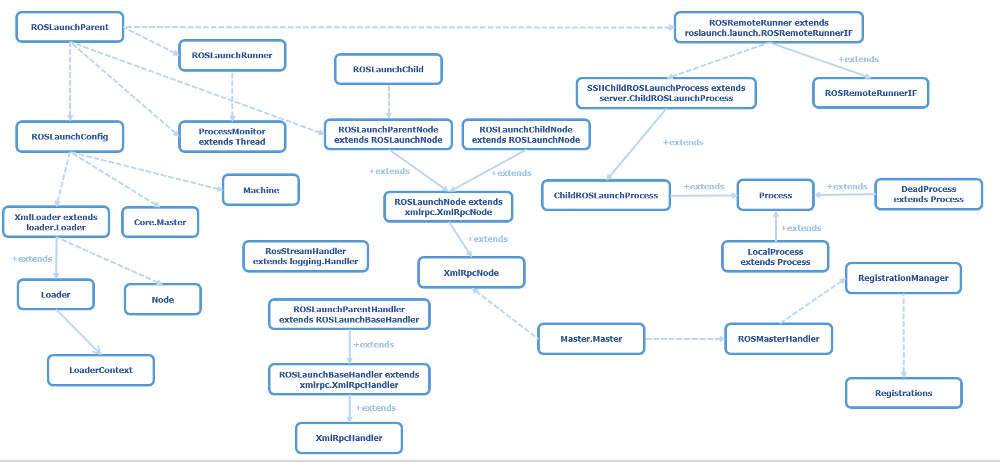
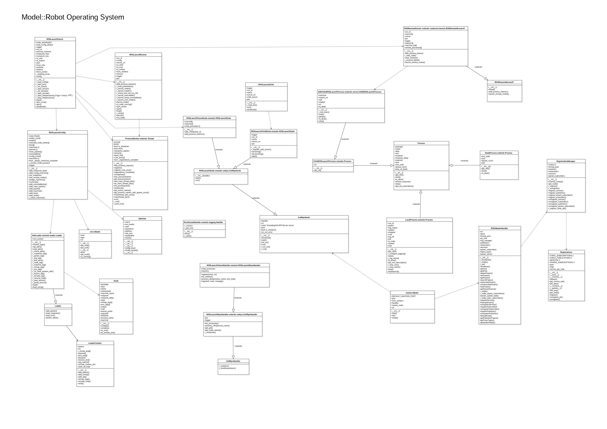

###### datetime:2023/01/16 16:30

###### author:nzb

# 1、ros 系统的启动

`roscore class map`



`roscore map`



该文章分析roslaunch是如何调用这个rosmaster脚本，将roscore，roslaunch，rosmaster联系起来的

启动脚本

```shell
#!/bin/bash
set -e

# setup ros environment
source "/opt/ros/$ROS_DISTRO/setup.bash"

nohup roscore >/logs/roscore.log 2>&1 &   # 启动master

nohup roslaunch /set_urdf.launch --wait >/logs/set_urdf.log 2>&1 &  # 启动节点

exec "$@"
```

`set_urdf.launch`文件

```text
<launch>
  <param name="robot_description" command="cat /config/robot_description.urdf" />
  <!-- 运行joint_state_publisher节点，发布机器人的关节状态  -->
  <node name="joint_state_publisher" pkg="joint_state_publisher" type="joint_state_publisher" ></node>

  <!-- 运行robot_state_publisher节点，发布tf  -->
  <node name="robot_state_publisher" pkg="robot_state_publisher" type="robot_state_publisher"  output="screen" >
      <param name="publish_frequency" type="double" value="50.0" />
  </node>
</launch>
```

已经运行了ros环境下的相关进程

```text
UID        PID  PPID  C STIME TTY          TIME CMD
root         1     0  0 09:43 pts/0    00:00:00 /bin/bash
root        31     1  0 09:43 pts/0    00:02:12 /usr/bin/python /opt/ros/melodic/bin/roscore
root        32     1  0 09:43 pts/0    00:02:12 /usr/bin/python /opt/ros/melodic/bin/roslaunch /set_urdf.launch --wait
root        48    31  0 09:43 ?        00:03:04 /usr/bin/python /opt/ros/melodic/bin/rosmaster --core -p 11311 -w 3 __log:=/root/.ros/log/769ca6bc-96d1-11ed-8514-8ec2aee29851/master.log
root        65    31  0 09:43 ?        00:01:38 /opt/ros/melodic/lib/rosout/rosout __name:=rosout __log:=/root/.ros/log/769ca6bc-96d1-11ed-8514-8ec2aee29851/rosout-1.log
root        94    32  1 09:43 ?        00:05:17 python2 /opt/ros/melodic/lib/joint_state_publisher/joint_state_publisher __name:=joint_state_publisher __log:=/root/.ros/log/769ca6bc-96d1-11ed-8514-8ec2aee29851/joint_state_publisher-1.log
root        98    32  0 09:43 ?        00:01:36 /opt/ros/melodic/lib/robot_state_publisher/robot_state_publisher __name:=robot_state_publisher __log:=/root/.ros/log/769ca6bc-96d1-11ed-8514-8ec2aee29851/robot_state_publisher-2.log
root      1713     0  0 14:46 pts/1    00:00:01 bash
root      2663  1713  0 16:09 pts/1    00:00:00 ps -ef
```

从进程可以看出

- 根据父进程ID，可以看出启动脚本执行了`roscore`和`roslaunch`两个脚本
    - `roscore`
        - 子进程启动了`rosmaster`
        - 子进程启动了`rosout`
    - `roslaunch`
        - 子进程启动了`joint_state_publisher`
        - 子进程启动了`robot_state_publisher`

## 1.1、roscore与Master启动

### 1.1.1、启动roscore(MasterNode)

执行 roscore 会启动下面三个程序:

- a ROS Master（主节点）
- a ROS Parameter Server（参数服务器）
- a rosout logging node（日志节点）

### 1.1.2、roscore 脚本

对应的可执行文件是`/opt/ros/melodic/bin/roscore`, 这是一个python脚本，主要做了2个事情：

- 解析roscore入参
- 调用`roslaunch.main(['roscore', '--core'] + sys.argv[1:])`

```python
#!/usr/bin/python
import sys
from optparse import OptionParser
from rosmaster.master_api import NUM_WORKERS

NAME = 'roscore'


def _get_optparse():
    parser = OptionParser(usage="usage: %prog [options]",
                          prog=NAME,
                          description="roscore will start up a ROS Master, a ROS Parameter Server and a rosout logging node",
                          epilog="See http://wiki.ros.org/roscore"
                          )
    parser.add_option("-p", "--port",
                      dest="port", default=None,
                      help="master port. Only valid if master is launched", metavar="PORT")
    parser.add_option("-v", action="store_true",
                      dest="verbose", default=False,
                      help="verbose printing")
    parser.add_option("-w", "--numworkers",
                      dest="num_workers", default=NUM_WORKERS, type=int,
                      help="override number of worker threads", metavar="NUM_WORKERS")
    parser.add_option("-t", "--timeout",
                      dest="timeout",
                      help="override the socket connection timeout (in seconds).", metavar="TIMEOUT")
    parser.add_option("--master-logger-level",
                      dest="master_logger_level", default=False, type=str,
                      help="set rosmaster.master logger level ('debug', 'info', 'warn', 'error', 'fatal')")
    return parser


parser = _get_optparse()
(options, args) = parser.parse_args(sys.argv[1:])

if len(args) > 0:
    parser.error("roscore does not take arguments")

import roslaunch

roslaunch.main(['roscore', '--core'] + sys.argv[1:])
```

### 1.1.3、MasterNode 启动流程

#### 1.1.3.1、 创建`ROSLaunchParent`

源码路径：`ros\melodic\lib\python2.7\dist-packages\roslaunch\__init__.py`

```python
def main(argv=sys.argv):
    # ....
    logger = logging.getLogger('roslaunch')
    # 对应日志：[roslaunch][INFO] 2023-01-18 14:57:35,627: roslaunch starting with args ['roscore', '--core']
    # args是上面roscore传进来的参数
    logger.info("roslaunch starting with args %s" % str(argv))
    # 对应日志：[roslaunch][INFO] 2023-01-18 14:57:35,628: roslaunch env is {'ROS_DISTRO': 'melodic', 
    # 'ROS_IP': '192.168.111.111', 'HOME': '/root', 'PATH': '/opt/ros/melodic/bin:/usr/local/sbin:/usr/local/bin:/usr/sbin:/usr/bin:/sbin:/bin',
    # 'ROS_PACKAGE_PATH': '/opt/ros/melodic/share', 'CMAKE_PREFIX_PATH': '/opt/ros/melodic', 'LD_LIBRARY_PATH': '/opt/ros/melodic/lib', 
    # 'LANG': 'C.UTF-8', 'TERM': 'xterm', 'SHLVL': '1', 'ROS_LOG_FILENAME': '/root/.ros/log/769ca6bc-96d1-11ed-8514-8ec2aee29851/roslaunch-quicktron-RK-1753.log',
    # 'ROS_MASTER_URI': 'http://192.168.111.111:11311', 'ROS_PYTHON_VERSION': '2', 'PYTHONPATH': '/opt/ros/melodic/lib/python2.7/dist-packages',
    # 'ROS_ROOT': '/opt/ros/melodic/share/ros', 'PKG_CONFIG_PATH': '/opt/ros/melodic/lib/pkgconfig', 'LC_ALL': 'C.UTF-8', '_': '/opt/ros/melodic/bin/roscore', 
    # 'HOSTNAME': 'quicktron-RK', 'ROSLISP_PACKAGE_DIRECTORIES': '', 'PWD': '/', 'ROS_ETC_DIR': '/opt/ros/melodic/etc/ros', 'ROS_VERSION': '1',...}
    logger.info("roslaunch env is %s" % os.environ)

    if options.child_name:
        logger.info('starting in child mode')
        # ...
    else:
        logger.info('starting in server mode')
        ...
        # This is a roslaunch parent, spin up parent server and launch processes.
        # args are the roslaunch files to load
        from . import parent as roslaunch_parent
        # force a port binding spec if we are running a core
        if options.core:
            options.port = options.port or DEFAULT_MASTER_PORT
        p = roslaunch_parent.ROSLaunchParent(uuid, args, roslaunch_strs=roslaunch_strs,
                                             is_core=options.core, port=options.port, local_only=options.local_only,
                                             verbose=options.verbose, force_screen=options.force_screen,
                                             force_log=options.force_log,
                                             num_workers=options.num_workers, timeout=options.timeout,
                                             master_logger_level=options.master_logger_level,
                                             show_summary=not options.no_summary,
                                             force_required=options.force_required)
        p.start()
        p.spin()
```

`roscore.xml` 配置文件

```xml
<!-- 
  ROS Core Stack definition

  Before making any modifications to this file, please read:
  http://ros.org/wiki/roscore
  -->
<launch>
    <group ns="/">
        <param name="rosversion" command="rosversion roslaunch"/>
        <param name="rosdistro" command="rosversion -d"/>
        <node pkg="rosout" type="rosout" name="rosout" respawn="true"/>
    </group>
</launch>
```

#### 1.1.3.2、执行`start`

源码路径：`ros\melodic\lib\python2.7\dist-packages\roslaunch\parent.py`

```python
class ROSLaunchParent(object):

    def _start_pm(self):
        # 全局函数，start_process_monitor，移到这里方便过流程，源码路径：ros\melodic\lib\python2.7\dist-packages\roslaunch\pmon.py
        _pmons = []
        _pmon_counter = 0

        def start_process_monitor():
            global _pmon_counter
            _pmon_counter += 1
            name = "ProcessMonitor-%s" % _pmon_counter
            logger.info("start_process_monitor: creating ProcessMonitor")
            process_monitor = ProcessMonitor(name)  # 继承于Thread
            try:
                _shutdown_lock.acquire()
                _pmons.append(process_monitor)
                process_monitor.start()
                logger.info("start_process_monitor: ProcessMonitor started")
            finally:
                _shutdown_lock.release()
            return process_monitor

        self.pm = start_process_monitor()

    def _start_infrastructure(self):
        # 配置文件，roscore.xml
        if self.config is None:
            self._load_config()

        # 启动进程管理
        if self.pm is None:
            self._start_pm()

        # 启动 roslaunch 运行程序和 XMLRPC 服务
        # 依赖：进程管理
        if self.server is None:
            # 1、ROSLaunchParentNode类的继承关系
            # 继承关系：xmlrpc.XmlRpcNode -> ROSLaunchNode -> ROSLaunchParentNode
            # 父类XmlRpcNode最后实例化了XMLRPC：self.server = ThreadingXMLRPCServer((bind_address, port), log_requests)
            # ROSLaunchParentNode 构造函数里面初始化了 ROSLaunchParentHandler，传给父类用于XMLRPC注册实例，供远程调用

            # 2、ROSLaunchParentHandler类的继承关系
            # 继承关系：xmlrpc.XmlRpcHandler —> ROSLaunchBaseHandler -> ROSLaunchParentHandler
            # 该handle用于XMLRPC注册实例，self.server.register_instance(self.handler)
            self.server = roslaunch.server.ROSLaunchParentNode(self.config, self.pm)
            self.server.start()

        # 启动远程基础服务，依赖：配置，进程管理和XMLRPC 服务
        # 目前还未知道该方法作用，TODO，待完善
        self._start_remote()

    def start(self, auto_terminate=True):
        # 加载配置文件，启动 XMLRPC 服务端和进程监控服务
        self._start_infrastructure()

        # 初始化实际的运行程序
        # 依赖：配置、进程管理、服务和远程运行程序
        # self._init_runner()
        self.runner = roslaunch.launch.ROSLaunchRunner(self.run_id, self.config, server_uri=self.server.uri,
                                                       pmon=self.pm, is_core=self.is_core,
                                                       remote_runner=self.remote_runner, is_rostest=self.is_rostest,
                                                       num_workers=self.num_workers, timeout=self.timeout,
                                                       master_logger_level=self.master_logger_level)

        # 开始启动核心：master + core 节点基于 core.xml配置文件
        self.runner.launch()
        # 1、master 启动流程
        # -> self._setup()
        # -> self._launch_master()  # 启动master
        # -> p = create_master_process()  # 创建启动master进程，p为LocalProcess实例，里面指定了的脚本就是 rosmaster
        # -> self.pm.register_core_proc(p) 或 self.pm.register(p) 提交给进程管理
        # -> p.start()
        # -> subprocess.Popen()  # 执行了 rosmaster 脚本

        # 2、core 启动流程（rosout 节点就是该处启动，读取配置文件roscore.xml）
        # -> self._launch_master() 启动成功后
        # -> self._launch_core_nodes()
        # -> self.launch_node(node, core=True)
        # -> p = create_node_process()  # 创建节点进程，p为LocalProcess实例
        # -> self.pm.register_core_proc(p) 或 self.pm.register(p) 提交给进程管理
        # -> p.start()
        # -> subprocess.Popen()

        # 通知进程监视器我们已完成进程注册
        if auto_terminate:
            self.pm.registrations_complete()

        if self.process_listeners:
            for l in self.process_listeners:
                self.runner.pm.add_process_listener(l)
                # Add listeners to server as well, otherwise they won't be
                # called when a node on a remote machine dies.
                self.server.add_process_listener(l)

```

## 1.2、rosmaster 脚本

对应的脚本文件路径是`/opt/ros/melodic/bin/rosmaster`, 这是一个python脚本，从上面得知是通过`subprocess.Popen()`执行的

```python
import rosmaster

rosmaster.rosmaster_main()
```

### 1.2.1、`main.py`

源码路径：`ros\melodic\lib\python2.7\dist-packages\rosmaster\main.py`

```python
# -*-: encoding: utf8 -*-
import os
import sys
import parser

import rosmaster.master


def rosmaster_main(argv=sys.argv, stdout=sys.stdout, env=os.environ):
    # ... 解析命令参数
    options, args = parser.parse_args(argv[1:])
    # only arg that zenmaster supports is __log remapping of logfilename
    for arg in args:
        if not arg.startswith('__log:='):
            parser.error("unrecognized arg: %s" % arg)
    configure_logging()
    # rosmaster进程默认监听端口       
    # DEFAULT_MASTER_PORT=11311 # default port for master's to bind to
    port = rosmaster.master.DEFAULT_MASTER_PORT
    if options.port:
        port = int(options.port)
    logger.info("Starting ROS Master Node")
    # 创建Master对象，启动XmlRpcNode
    # NUM_WORKERS = 3, 用于发送发布更新的通知的线程数
    # number of threads we use to send publisher_update notifications
    master = rosmaster.master.Master(port, options.num_workers)
    master.start()  # 开启

    import time
    while master.ok():
        time.sleep(.1)
```

### 1.2.2、`master.py`

源码路径：`ros\melodic\lib\python2.7\dist-packages\rosmaster\master.py`

```python
# -*- encoding: utf8 -*-

import logging
import time

import rosgraph.xmlrpc

import rosmaster.master_api

DEFAULT_MASTER_PORT = 11311  # default port for master's to bind to


class Master(object):

    def __init__(self, port=DEFAULT_MASTER_PORT, num_workers=rosmaster.master_api.NUM_WORKERS):
        self.port = port
        self.num_workers = num_workers

    def start(self):
        """
        Start the ROS Master.
        """
        # 创建一个class ROSMasterHandler(object)对象
        self.handler = rosmaster.master_api.ROSMasterHandler(self.num_workers)
        # 创建一个XmlRpcNode对象
        self.master_node = rosgraph.xmlrpc.XmlRpcNode(self.port, self.handler)
        # 调用XmlRpcNode的start(),其实是新启动一个线程，启动 XMLRPC 服务，端口为11311
        self.master_node.start()

        # poll for initialization
        while not self.master_node.uri:
            time.sleep(0.0001)

        self.uri = self.master_node.uri

        logging.getLogger('rosmaster.master').info("Master initialized: port[%s], uri[%s]", self.port, self.uri)
```

### 1.2.3、`master_api.py`

源码路径：`ros\melodic\lib\python2.7\dist-packages\rosmaster\master_api.py`

```python
# Master Implementation

class ROSMasterHandler(object):
    """
    XML-RPC handler for ROS master APIs.
    API routines for the ROS Master Node. The Master Node is a
    superset of the Slave Node and contains additional API methods for
    creating and monitoring a graph of slave nodes.

    By convention, ROS nodes take in caller_id as the first parameter
    of any API call.  The setting of this parameter is rarely done by
    client code as ros::msproxy::MasterProxy automatically inserts
    this parameter (see ros::client::getMaster()).
    """

    def __init__(self, num_workers=NUM_WORKERS):
        """ctor."""

        self.uri = None
        self.done = False
        # ....
```

### 1.2.4、`xmlrpc.py`

源码路径：`ros\melodic\lib\python2.7\dist-packages\rosgraph\xmlrpc.py`

```python
# -*- encoding: utf8 -*-

class XmlRpcNode(object):
    """
    Generic XML-RPC node. Handles the additional complexity of binding
    an XML-RPC server to an arbitrary port. 
    XmlRpcNode is initialized when the uri field has a value.
    """

    def __init__(self, port=0, rpc_handler=None, on_run_error=None):
        """
        XML RPC Node constructor
        :param port: port to use for starting XML-RPC API. Set to 0 or omit to bind to any available port, ``int``
        :param rpc_handler: XML-RPC API handler for node, `XmlRpcHandler`
        :param on_run_error: function to invoke if server.run() throws
          Exception. Server always terminates if run() throws, but this
          enables cleanup routines to be invoked if server goes down, as
          well as include additional debugging. ``fn(Exception)``
        """
        # 调用父类构造函数
        super(XmlRpcNode, self).__init__()

        # ① 构造函数传进来的rpc_handler
        self.handler = rpc_handler
        # ...

    def start(self):
        """
        Initiate a thread to run the XML RPC server. Uses thread.start_new_thread.
        """
        # ② 启动新线程，线程函数为run()
        _thread.start_new_thread(self.run, ())

    def run(self):
        self._run()

    def _run_init(self):
        logger = logging.getLogger('xmlrpc')
        try:
            log_requests = 0
            port = self.port or 0  # 0 = any

            bind_address = rosgraph.network.get_bind_address()
            logger.info("XML-RPC server binding to %s:%d" % (bind_address, port))

            self.server = ThreadingXMLRPCServer((bind_address, port), log_requests)
            self.port = self.server.server_address[1]  # set the port to whatever server bound to
            if not self.port:
                self.port = self.server.socket.getsockname()[1]  # Python 2.4

            assert self.port, "Unable to retrieve local address binding"

            # #528: semi-complicated logic for determining XML-RPC URI
            # - if ROS_IP/ROS_HOSTNAME is set, use that address
            # - if the hostname returns a non-localhost value, use that
            # - use whatever rosgraph.network.get_local_address() returns
            uri = None
            override = rosgraph.network.get_address_override()
            if override:
                uri = 'http://%s:%s/' % (override, self.port)
            else:
                try:
                    hostname = socket.gethostname()
                    if hostname and not hostname == 'localhost' and not hostname.startswith(
                            '127.') and hostname != '::':
                        uri = 'http://%s:%s/' % (hostname, self.port)
                except:
                    pass
            if not uri:
                uri = 'http://%s:%s/' % (rosgraph.network.get_local_address(), self.port)
            self.set_uri(uri)
            # log打印Started XML-RPC server [http://lyf:11311/]
            logger.info("Started XML-RPC server [%s]", self.uri)
            # ③这里最主要的是下面两个函数，将handler注册到xml-rpc，
            # handler是个rosmaster.master_api.ROSMasterHandler对象
            self.server.register_multicall_functions()  # 可同时调用多个注册方法
            self.server.register_instance(self.handler)  # 注册实例
            # ...

    def _run(self):
        """
        Main processing thread body.
        :raises: :exc:`socket.error` If server cannot bind

        """
        self._run_init()
        while not self.is_shutdown:
            # ④ 服务端开始监听运行
            self.server.serve_forever()
```

### 1.2.5、总结

通过上面的代码分析可以看到rosmaster的整个执行流程：

- rosmaster命令行脚本执行rosmaster_main()；

- 启动了一个新的线程来启动xml-rpc server(rosmaster)；

- xml-rpc server注册了一个类为ROSMasterHandler，定义了rpc的方法。

## 1.3、Master启动汇总

roscore脚本调用launch主方法，launch是主进程（进程名是roscore），然后启动子进程master，master启动HTTP服务。

- **launch**：是使用python编写实现的一个工具，是roscore启动的主进程；
- **master**: 是使用python编写实现的一个HTTP服务，属于launch的一个子进程；
    - **参数服务**：使用字典类型的内存对象来保存；
    - **Topic发布订阅信息**：使用字典类型的内存对象来保存；
    - **服务通讯**：使用`python`的`SimpleXMLRPCServer`启动了http服务器(默认端口号11311 )，以接受`PubNode&SubNode`的服务注册和参数服务处理，
      具体的master所有提供的功能实现在`rosmaster.master_api.ROSMasterHandler`。

> Master中的参数服务、Topic订阅和注册信息都是使用最基本的字典内存对象维护  
> self.parameters = {}  
> .## { key: [(caller_id, caller_api)] }  
> self.map = {}  
> self.service_api_map = None
