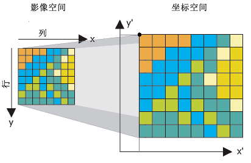

###### datetime:2023/10/09 11:03

###### author:nzb

> 该项目来源于[大佬的动手学ROS2](https://fishros.com/d2lros2)

# 1.图像常见格式及存储

在日常生活中，我们会用到各种各样的地图，比如交通轨道图、城市地图、世界地图。

## 1.地图分类

我们根据地图所表达信息的不同可以将地图分为三类：

### 1.1 尺度地图（Metric Map）

尺度地图用于表示尺寸距离，可以理解为把真实世界按比例缩小，尺度地图中每个点都可以使用一个经纬值进行表示。

> 因为尺度地图是按照真实世界按比例缩小，所以要有比例尺来表示缩小比例。

### 1.2 拓扑地图（Topological Map）

拓扑地图用于表示点与点之间的连接信息，比如地铁轨道交通图。

### 1.3 语义地图（Semantic Map）

语义地图可以理解为在上面两个地图上增加了语义，比如尺度地图中某处是红绿灯、斑马线。拓扑地图中某个点是深圳北站。

在机器人领域

- `尺度地图`常用于定位于地图构建（Mapping）、定位（Localization）和同时定位与地图构建（Simultaneous Localization And Mapping，SLAM）
- `拓扑地图`常用于路径规划（Path Planning）
- `语义地图`常用于人机交互（Human Robot Interaction）。

## 2.地图的存储

地图也是图，所以地图一般以图片的形式存储下来，常见的格式比如`png`就是可以存储ROS2中的二维地图的。

但是对于一些三维的点云图，二维的方式就不怎么好存储，就需要一些特殊格式了，因为我们后面不涉及三维空间建图，这里就不在展开了。

--------------

# 2.占据栅格地图

我们先了解下什么是栅格地图（Grid Map）。

如上图将地图数据分割为一块块的栅格来表达地图信息，就是栅格地图。

那什么是占据（Occupancy）呢？

机器人通过激光雷达等传感器来感知深度信息，但我们知道，传感器都是有噪声的（在前面的机器人仿真建模过程中，我们为了更加真实给激光雷达还添加了高斯噪声），所以机器人前方的某个位置到底有没有物体（障碍物）是不确定的。

我们可以采用概率来解决这一问题，认为确实有物体的栅格的占据率为100%，确定没有物体的栅格占据率为0%，不确定的栅格就用（确认占据概率/确认非占据概率）值表示占据率。

由此我们知道**占据栅格地图就是一张写满占据率的格子组成的地图**。

> 我们在做机器人的路径规划的时候，需要确定一个格子是有障碍物？没障碍物？还是未知呢？所以我们一般会设定两个阈值：
>
> - 占据阈值（occupied_thresh），比如0.65，则表示栅格占据率大于0.65的认为是有障碍物。
> - 空闲阈值（free_thresh），比如0.25，则表示栅格占据率小于0.25的认为没有障碍物。
>
> 那在free_thresh和occupied_thresh之间的则认为是未知区域（未探索）。

--------------

