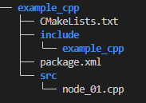
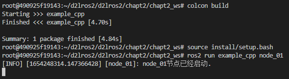
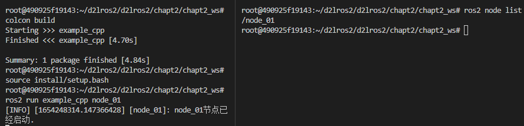
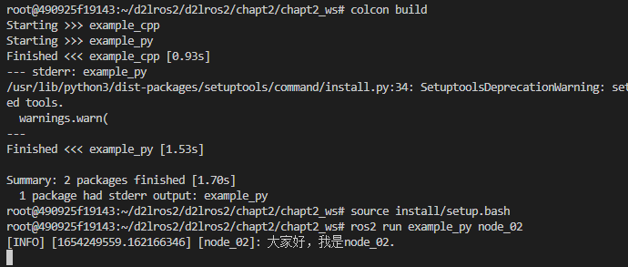
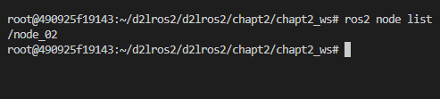

###### datetime:2023/09/13 09:36

###### author:nzb

> 该项目来源于[大佬的动手学ROS2](https://fishros.com/d2lros2)

# 4.使用RCLCPP编写节点

节点需要存在于功能包当中、功能包需要存在于工作空间当中。所以我们要想创建节点，就要先创建一个工作空间，再创建功能包。

## 1.创建工作空间和功能包

### 1.1 工作空间

工作空间就是文件夹，所以很简单。

```
cd d2lros2/chapt2/
mkdir -p chapt2_ws/src/
```

### 1.2 创建example_cpp功能包

创建example_cpp功能包，使用ament-cmake作为编译类型，并为其添加rclcpp依赖。

```
cd chapt2_ws/src
ros2 pkg create example_cpp --build-type ament_cmake --dependencies rclcpp
```

大家可以手写一下这个代码，感受一下。现在来讲一讲这条命令的含义和参数。

- `pkg create` 是创建包的意思
- `--build-type` 用来指定该包的编译类型，一共有三个可选项`ament_python`、`ament_cmake`、`cmake`
- `--dependencies` 指的是这个功能包的依赖，这里给了一个ros2的C++客户端接口`rclcpp`

打开终端，进入`chapt2_ws/src`运行上面的指令，创建完成后的目录结构如下：

```
.
└── src
    └── example_cpp
        ├── CMakeLists.txt
        ├── include
        │   └── example_cpp
        ├── package.xml
        └── src

5 directories, 2 files
```

## 2.创建节点

接着我们在`example_cpp/src`下创建一个`node_01.cpp`文件，创建完成后的目录结构如下：



## 3.编写代码

### 3.1 编写代码

继续跟着一起输入代码，输入的时候可以边输边理解。

```cpp
#include "rclcpp/rclcpp.hpp"


int main(int argc, char **argv)
{
    /* 初始化rclcpp  */
    rclcpp::init(argc, argv);
    /*产生一个node_01的节点*/
    auto node = std::make_shared<rclcpp::Node>("node_01");
    // 打印一句自我介绍
    RCLCPP_INFO(node->get_logger(), "node_01节点已经启动.");
    /* 运行节点，并检测退出信号 Ctrl+C*/
    rclcpp::spin(node);
    /* 停止运行 */
    rclcpp::shutdown();
    return 0;
}
```

### 3.2 修改CmakeLists

在`node_01.cpp`中输入上面的内容后，还需要修改一下CMakeLists.txt。将其添加为可执行文件，并使用`install`指令将其安装到`install`目录。

在CmakeLists.txt最后一行加入下面两行代码。

```
add_executable(node_01 src/node_01.cpp)
ament_target_dependencies(node_01 rclcpp)
```

添加这两行代码的目的是让编译器编译node_01这个文件，接着在上面两行代码下面添加下面的代码。

```shell
install(TARGETS
  node_01
  DESTINATION lib/${PROJECT_NAME}
)
```

## 2.编译运行节点

在`chapt2_ws`下依次输入下面的命令

### 2.1 编译节点

```
colcon build
```

### 2.2 source环境

```
source install/setup.bash
```

### 2.3 运行节点

```
ros2 run example_cpp node_01
```

不出意外，你可以看到



## 3.测试

当节点运行起来后，可以再尝试使用`ros2 node list `指令来查看现有的节点。这个时候你应该能看到：



## 4.总结

至此，相信你已经掌握了如何编写一个C++版本的ros2节点了，但是这仅仅是编写ROS2节点方式之一，相比之下，更推荐你使用面向对象的方式编写节点，在进阶篇将会向你展示其写法。

--------------

# 5.使用RCLPY编写节点

## 1.创建Python功能包

创建一个名字叫做`example_py` python版本的功能包。

```
cd chapt2/chapt2_ws/src/
ros2 pkg create example_py  --build-type ament_python --dependencies rclpy
```

创建完成后的目录结构

```
.
├── example_py
│   └── __init__.py
├── package.xml
├── resource
│   └── example_py
├── setup.cfg
├── setup.py
└── test
    ├── test_copyright.py
    ├── test_flake8.py
    └── test_pep257.py

3 directories, 8 files
```

## 2.编写程序

编写ROS2节点的一般步骤

```
1. 导入库文件
2. 初始化客户端库
3. 新建节点
4. spin循环节点
5. 关闭客户端库
```

在`example_py/example_py`下创建`node_02.py`接着我们开始编写代码。跟着一起边理解输入下面的代码，注释不用输。

```
import rclpy
from rclpy.node import Node

def main(args=None):
    """
    ros2运行该节点的入口函数
    编写ROS2节点的一般步骤
    1. 导入库文件
    2. 初始化客户端库
    3. 新建节点对象
    4. spin循环节点
    5. 关闭客户端库
    """
    rclpy.init(args=args) # 初始化rclpy
    node = Node("node_02")  # 新建一个节点
    node.get_logger().info("大家好，我是node_02.")
    rclpy.spin(node) # 保持节点运行，检测是否收到退出指令（Ctrl+C）
    rclpy.shutdown() # 关闭rclpy
```

代码编写完成用Crtl+S进行保存。接着修改`setup.py`。

```
    entry_points={
        'console_scripts': [
            "node_02 = example_py.node_02:main"
        ],
    },
)
```

`setup.py`这段配置是声明一个ROS2的节点，声明后使用`colcon build`才能检测到，从而将其添加到`install`目录下。

完成上面的工作后，就可以编译运行了。

## 3.编译运行节点

打开vscode终端，进入`chapt2/chapt2_ws/`

### 3.1 编译节点

```
cd chapt2/chapt2_ws/
colcon build
```

> ```
> --- stderr: example_py                   
> /usr/lib/python3/dist-packages/setuptools/command/install.py:34: SetuptoolsDeprecationWarning: setup.py install is deprecated. Use build and pip and other standards-based tools.
>   warnings.warn(
> ---
> ```
>
> 如果在编译中看到上述错误没关系，不影响使用，ros2官方正在修复。
> 错误原因是setuptools版本太高造成，使用下面的指令可以进行版本的回退。
> ```
> sudo pip install setuptools==58.2.0 --upgrade
> ```

### 3.2 source环境

```
source install/setup.bash
```

### 3.3 运行节点

```
ros2 run example_py node_02
```

运行结果



## 4.测试

当节点运行起来后，可以再尝试使用`ros2 node list `指令来查看现有的节点。这个时候你应该能看到：



这说明你的节点已经运行起来了。

## 5.总结

本节我们学习了使用Python在工作空间的功能包里编写一个节点，代码是相同的，但是多了一些配置。

当然除了使用这种方法编写一个节点，还有其他方式，将其放到了进阶篇来讲。

--------------