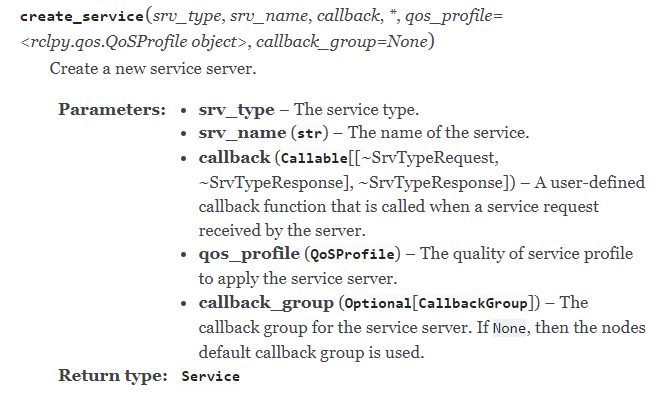

###### datetime:2023/09/13 16:38

###### author:nzb

> 该项目来源于[大佬的动手学ROS2](https://fishros.com/d2lros2)

# 6.服务之RCLPY实现

## 1.创建功能包和节点

事到如今，也不藏着掖着了，创建功能包其实还可以加上一些参数，让这个过程变得更简单。

先上指令再说

```
cd chapt3/chapt3_ws/src
ros2 pkg create example_service_rclpy --build-type ament_python --dependencies rclpy example_interfaces  --node-name service_server_02
```

接着你会惊奇的发现，依赖，setup.py中的安装配置，ROS2都帮你加好了。

这是因为 `--node-name service_server_02`会帮你创建好节点文件和添加执行文件。

但是也有一些限制，比如只支持一个节点文件，所以我们还需要手动创建一个。

```
cd example_service_rclpy/example_service_rclpy/
touch service_client_02.py
```

修改下setup.py

```
    entry_points={
        'console_scripts': [
            "service_client_02 = example_service_rclpy.service_client_02:main",
            "service_server_02 = example_service_rclpy.service_server_02:main"
        ],
    },
```

接着面向对象来一筐，将两个节点的内容补充一下

service_server_02

```
#!/usr/bin/env python3
import rclpy
from rclpy.node import Node

class ServiceServer02(Node):
    def __init__(self,name):
        super().__init__(name)
        self.get_logger().info("节点已启动：%s!" % name)
        
def main(args=None):
    rclpy.init(args=args) # 初始化rclpy
    node = ServiceServer02("service_server_02")  # 新建一个节点
    rclpy.spin(node) # 保持节点运行，检测是否收到退出指令（Ctrl+C）
    rclpy.shutdown() # 关闭rclpy

```

service_client_02

```
#!/usr/bin/env python3
import rclpy
from rclpy.node import Node
from example_interfaces.srv import AddTwoInts

class ServiceClient02(Node):
    def __init__(self,name):
        super().__init__(name)
        self.get_logger().info("节点已启动：%s!" % name)

def main(args=None):
    rclpy.init(args=args) # 初始化rclpy
    node = ServiceClient02("service_client_02")  # 新建一个节点
    node.send_request(3,4)
    rclpy.spin(node) # 保持节点运行，检测是否收到退出指令（Ctrl+C）
    rclpy.shutdown() # 关闭rclpy
```

## 2.服务端实现

### 2.1 看 API

地址放这里，大家自行看下即可

- [Node — rclpy 0.6.1 documentation (ros2.org)](https://docs.ros2.org/latest/api/rclpy/api/node.html)



### 2.2 写代码

```
# 导入接口
from example_interfaces.srv import AddTwoInts


class ServiceServer02(Node):
    def __init__(self,name):
        super().__init__(name)
        self.get_logger().info("节点已启动：%s!" % name)
        self.add_ints_server_ = self.create_service(AddTwoInts,"add_two_ints_srv", self.handle_add_two_ints) 

    def handle_add_two_ints(self,request, response):
        self.get_logger().info(f"收到请求，计算{request.a} + {request.b}")
        response.sum = request.a + request.b
        return response
```

### 2.3 测试

```
colcon build --packages-select example_service_rclpy
source install/setup.bash
ros2 run example_service_rclpy service_server_02
```

打开新终端

```
ros2 service call /add_two_ints_srv example_interfaces/srv/AddTwoInts "{a: 5,b: 10}"
```


## 3.客户端实现

### 2.1 API

- [Node — rclpy 0.6.1 documentation (ros2.org)](https://docs.ros2.org/latest/api/rclpy/api/node.html)

### 2.2 写代码

```
from example_interfaces.srv import AddTwoInts

class ServiceClient02(Node):
    def __init__(self,name):
        super().__init__(name)
        self.get_logger().info("节点已启动：%s!" % name)
        self.client_ = self.create_client(AddTwoInts,"add_two_ints_srv") 

    def result_callback_(self, result_future):
        response = result_future.result()
        self.get_logger().info(f"收到返回结果：{response.sum}")
    
    def send_request(self, a, b):
        while rclpy.ok() and self.client_.wait_for_service(1)==False:
            self.get_logger().info(f"等待服务端上线....")
            
        request = AddTwoInts.Request()
        request.a = a
        request.b = b
        self.client_.call_async(request).add_done_callback(self.result_callback_)
        
def main(args=None):
    rclpy.init(args=args) # 初始化rclpy
    node = ServiceClient02("service_client_02")  # 新建一个节点
    # 调用函数发送请求
    node.send_request(3,4)
    rclpy.spin(node) # 保持节点运行，检测是否收到退出指令（Ctrl+C）
    rclpy.shutdown() # 关闭rclpy
```

同样是异步请求，rclpy客户端库定义的是`call_async`并且使用`add_done_callback`添加回调函数。

### 2.3 测试

编译启动客户端

```
colcon build --packages-select example_service_rclpy
source install/setup.bash
ros2 run example_service_rclpy service_client_02
```

启动服务端

```
source install/setup.bash
ros2 run example_service_rclpy service_server_02
```


## 4.总结

本节我们通过rclpy库实现了节点之间的服务通信。但是我们都是用别人的接口，下一节我们学习自定义接口并在代码中使用。

下面两节含实战内容，一定要跟着动手写哦。

--------------
