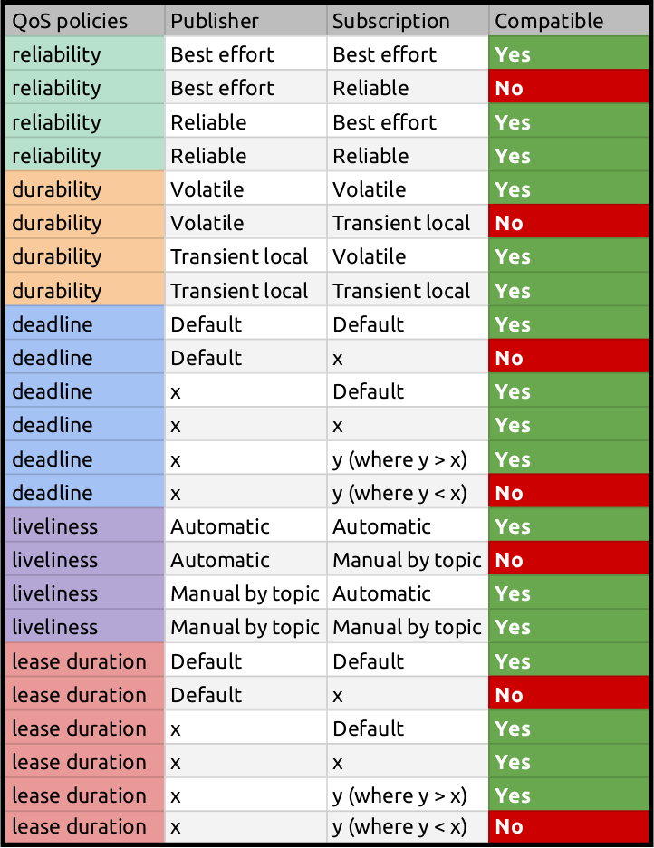

###### datetime:2023/09/15 16:38

###### author:nzb

> 该项目来源于[大佬的动手学ROS2](https://fishros.com/d2lros2)

# Rviz显示不出数据了！一文搞懂Qos

ROS2的通信中间件换成了DDS。这让我们可以精准地控制节点间的通信质量。通信效率也迎来了一次大的提升。

但是...

但是...

一个不小心，看到了类似这样的报错信息：

```text
[WARN] [1644578813.965216245] [subscriber_qos_obj]: New publisher discovered on topic '/qos_test', offering incompatible QoS. No messages will be received from it. Last incompatible policy: RELIABILITY
```

本来好好的`Rviz`也显示不了雷达数据了。

这就是`incompatible QoS`搞的鬼！

**两个节点的Qos设置不兼容将没法通信**

## 那什么是Qos（Quality of Service）

在ROS1中，节点间的通信是基于TCP的。因为TCP的失败重传机制，在一些网络不稳定的场景，通信会出现延时严重的问题。这大大限制了ROS1的使用场景。

在ROS2中，采用DDS作为通信中间件。ROS2的DDS中间件是可以配置成不同厂家提供的。这些不同的DDS各自有不同的侧重点，可根据项目的不同需求来选择。`ROS2 Galactic和Rolling`
默认采用`rmw_cyclonedds_cpp`。`rmw_cyclonedds_cpp`在进程间和多主机间通信的场景下，主要是使用UDP做为通信媒介。

通过正确的服务质量策略配置，ROS2可以像TCP一样可靠，也可以像UDP那样尽力而为。在不稳定的网络环境下，“尽力而为”策略将更合适。在实时性要求高的场景下，设定数据的有效性将是必须的。

针对节点特定的工作负载和使用场景，有倾向地配置Qos将可以使通信质量达到最佳。

我们可以为发布器、订阅器、提供服务的服务器和客户端配置QoS。

因为每个节点的Qos是可以单独配置的，所以如果配置的Qos互相不兼容，节点间的通信将无法建立。

## Qos（Quality of Service）有哪些配置项

### 配置项目

- History
    - Keep last: 只缓存最新的N个数据，N可通过Depth的Queue size配置。
    - Keep all: 缓存所有的数据，但是受限于DDS底层的资源限制。

- Depth
    - Queue size: 当History设置为Keep last时有效。

  ```text
  QoS &
  QoS::keep_last(size_t depth)
  {
    rmw_qos_profile_.history = RMW_QOS_POLICY_HISTORY_KEEP_LAST;
    rmw_qos_profile_.depth = depth;
    return *this;
  }
  ```

- Reliability
    - Best effort: 尽力传送数据，但是网络不稳定可能会丢弃一些数据。
    - Reliable: 确保数据被传送到，可能会重传多次，导致数据延时严重。

- Durability
    - Transient local: 为后订阅话题的订阅者保留数据，比如map_server发布map的Qos策略。
    - Volatile: 不为后订阅话题的订阅者保留数据，比如订阅传感器数据的节点。

  ```text
    // Create a publisher using the QoS settings to emulate a ROS1 latched topic
    occ_pub_ = create_publisher<nav_msgs::msg::OccupancyGrid>(
      topic_name,
      rclcpp::QoS(rclcpp::KeepLast(1)).transient_local().reliable());
  ```

- Deadline
    - Duration: 设置数据被发布的间隔时间。比如：像cmd_vel等控制命令就希望是固定间隔时间下发的。
- Lifespan
    - Duration: 设置数据从发布到被接收的最大间隔时间。超过该时间将被认为是过时的数据，直接丢弃了。这对于传感器数据来说是很重要的。因为过时的传感器数据毫无用处。
- Liveliness
    - Automatic: 一个节点可能有多个发布器。只要有一个发布器发布了数据，系统将认为该节点的所有发布器在接下来的lease duration时间段内是活跃的。
    - Manual by topic: 如果手动确认发布器仍然是活跃的，系统将认为该发布器在接下来的lease duration时间段内是活跃的。
- Lease Duration
    - Duration: 在这个时间段内，发布器需发布数据，不然会被系统认为是停止工作了。该参数与Liveliness配合使用。

### 不兼容的Qos策略

知道了所有的Qos的配置项目后，哪些跟哪些配置是不兼容的呢？

这里有一张对比表帮助我们避免不兼容的Qos策略设置。



表中的`x`表示人为设定了某个值，`Default`值根据不同的`DDS`有不同的设定。通常是下面两种：

```text
/// Constant representing an infinite duration. Use rmw_time_equal for comparisons.
/**
  * Different RMW implementations have different representations for infinite durations.
  * This value is reported for QoS policy durations that are left unspecified.
  * Do not directly compare `sec == sec && nsec == nsec`, because we don't want to be sensitive
  * to non-normalized values (nsec > 1 second) - use rmw_time_equal instead.
  * This value is INT64_MAX nanoseconds = 0x7FFF FFFF FFFF FFFF = d 9 223 372 036 854 775 807
  *
  * Note: these constants cannot be `static const rmw_time_t` because in C that can't be used
  * as a compile-time initializer
  */
#define RMW_DURATION_INFINITE {9223372036LL, 854775807LL}
#define RMW_DURATION_UNSPECIFIED {0LL, 0LL}
```

### 查询话题的Qos策略

用下面的命令查询

```shell
ros2 topic info /scan --verbose
```

输出示例

```text
Type: sensor_msgs/msg/LaserScan

Publisher count: 1

Node name: laserscan
Node namespace: /
Topic type: sensor_msgs/msg/LaserScan
Endpoint type: PUBLISHER
GID: 71.03.10.01.8b.5b.f9.27.8e.9d.a4.4e.00.00.6c.03.00.00.00.00.00.00.00.00
QoS profile:
  Reliability: BEST_EFFORT
  Durability: VOLATILE
  Lifespan: 9223372036854775807 nanoseconds
  Deadline: 9223372036854775807 nanoseconds
  Liveliness: AUTOMATIC
  Liveliness lease duration: 9223372036854775807 nanoseconds

Subscription count: 0
```

分析一下:

- `Reliability = BEST_EFFORT`. 这是在传感器节点中的标准设置方式。因为我们感兴趣的是获得大量的数据，如果丢失一两个信息，其实并不重要。
- `Durability = Volatile`. 这也是传感器节点的标准方式，特别是具有高数据量的传感器。我们并不需要为晚加入的节点保存旧的信息。因为旧信息对它根本没有意义了。
- `Liveliness = Automatic`. 这是默认的设置，特别是对于传感器。我们认为在lease duration时间段内，节点发布了任何话题，代表节点是活跃的。
- `Deadline = "9223372036.854775807" seconds ( INFINITE VALUE )`. 这意味着 **没有Deadline限制**.
- `Lifespan = "9223372036.854775807" seconds( INFINITE VALUE )`. 这意味着 **没有数据有效性限制**.
  不管数据延时多久被接受到都认为其是有效。这是从gazebo中发出的数据。仿真环境下这么设置应该没啥关系。但在实际场景下则需要根据需求设置一下。

### 系统层预设的Qos

这里以`rclcpp`为例。

Qos配置的相关接口维护在`rclcpp`模块中的`qos.cpp`和`qos.hpp`文件中。`/opt/ros/galactic/include/rmw/qos_profiles.h`中维护了预设的`Qos`结构数据。

这里放置两个瞧瞧。

```cpp
/**
 * Sensor Data QoS class
 *    - History: Keep last,
 *    - Depth: 5,
 *    - Reliability: Best effort,
 *    - Durability: Volatile,
 *    - Deadline: Default,
 *    - Lifespan: Default,
 *    - Liveliness: System default,
 *    - Liveliness lease duration: default,
 *    - avoid ros namespace conventions: false
 */
static const rmw_qos_profile_t rmw_qos_profile_sensor_data =
{
  RMW_QOS_POLICY_HISTORY_KEEP_LAST,
  5,
  RMW_QOS_POLICY_RELIABILITY_BEST_EFFORT,
  RMW_QOS_POLICY_DURABILITY_VOLATILE,
  RMW_QOS_DEADLINE_DEFAULT,
  RMW_QOS_LIFESPAN_DEFAULT,
  RMW_QOS_POLICY_LIVELINESS_SYSTEM_DEFAULT,
  RMW_QOS_LIVELINESS_LEASE_DURATION_DEFAULT,
  false
};

/**
 * Parameters QoS class
 *    - History: Keep last,
 *    - Depth: 1000,
 *    - Reliability: Reliable,
 *    - Durability: Volatile,
 *    - Deadline: Default,
 *    - Lifespan: Default,
 *    - Liveliness: System default,
 *    - Liveliness lease duration: default,
 *    - Avoid ros namespace conventions: false
 */
static const rmw_qos_profile_t rmw_qos_profile_parameters =
{
  RMW_QOS_POLICY_HISTORY_KEEP_LAST,
  1000,
  RMW_QOS_POLICY_RELIABILITY_RELIABLE,
  RMW_QOS_POLICY_DURABILITY_VOLATILE,
  RMW_QOS_DEADLINE_DEFAULT,
  RMW_QOS_LIFESPAN_DEFAULT,
  RMW_QOS_POLICY_LIVELINESS_SYSTEM_DEFAULT,
  RMW_QOS_LIVELINESS_LEASE_DURATION_DEFAULT,
  false
};

```

#### 测试Qos的示例代码

这里简单说明一种`Qos`不兼容的情况。

先看订阅器的示例代码

```python
import rclpy
from rclpy.node import Node
from std_msgs.msg import String

# import Quality of Service library, to set the correct profile and reliability.
from rclpy.qos import ReliabilityPolicy, QoSProfile


class SubscriberQoS(Node):

    def __init__(self):
        super().__init__('subscriber_qos_obj')

        # create the subscriber object
        self.subscriber = self.create_subscription(
            String,
            '/qos_test',
            self.listener_callback,
            QoSProfile(depth=10, reliability=ReliabilityPolicy.RELIABLE))

    def listener_callback(self, msg):
        self.get_logger().info("Data Received =" + str(msg.data))


def main(args=None):
    rclpy.init(args=args)
    sub_qos_obj = SubscriberQoS()
    rclpy.spin(sub_qos_obj)
    sub_qos_obj.destroy_node()
    rclpy.shutdown()


if __name__ == '__main__':
    main()

```

再看看发布器的代码

```python
import argparse
import rclpy
from rclpy.node import Node
from std_msgs.msg import String
from rclpy.qos_event import PublisherEventCallbacks
from rclpy.duration import Duration
from rclpy.qos import QoSProfile
from rclpy.qos import QoSDurabilityPolicy
from rclpy.qos import QoSLivelinessPolicy
from rclpy.qos import QoSReliabilityPolicy


class PublisherQoS(Node):

    def __init__(self, qos_profile, node_name="publisher_qos_obj"):
        super().__init__(node_name)
        # create the publisher object
        #  create_publisher(msg_type, topic, qos_profile, *, callback_group=None, event_callbacks=None)
        # INFO: https://docs.ros2.org/foxy/api/rclpy/api/node.html

        rclpy.logging.set_logger_level(
            node_name, rclpy.logging.LoggingSeverity.INFO)

        event_callbacks = PublisherEventCallbacks(
            incompatible_qos=self.incompatible_qos_clb)

        self.publisher_ = self.create_publisher(msg_type=String,
                                                topic='/qos_test',
                                                qos_profile=qos_profile,
                                                event_callbacks=event_callbacks)

        # This is the Unique id for each of the messages that will be sent
        self.msgs_id = 0
        # self.current_time = self.get_clock().now()
        self.current_time_s = 0
        self.current_time_ns = 0
        # define the timer period for 0.5 seconds
        timer_period = 0.5
        # create a timer sending two parameters:
        # - the duration between 2 callbacks (0.5 seeconds)
        # - the timer function (timer_callback)
        self.timer = self.create_timer(timer_period, self.timer_callback)

    def incompatible_qos_clb(self, event):
        """
        This is the callback that will be executed when the Event of **Incompatible QoS** is
        triggered.
        """
        self.get_logger().error("A subscriber is asking for an INCOMPATIBLE QoS Triggered!!")
        self.get_logger().error(str(event.last_policy_kind))
        self.get_logger().error("############################")

    def timer_callback(self):
        # Here we have the callback method
        msg = String()
        test_time = self.get_clock().now()
        self.current_time_s, self.current_time_ns = test_time.seconds_nanoseconds()
        time_str = str(self.current_time_s) + "," + str(self.current_time_ns)
        dds_msg_str = str(self.msgs_id) + ":" + time_str
        msg.data = dds_msg_str
        # Publish the message to the topic
        self.publisher_.publish(msg)
        # Display the message on the console
        self.get_logger().info('Publishing: "%s"' % msg)

        self.msgs_id += 1


def get_parser():
    parser = argparse.ArgumentParser()
    parser.add_argument(
        '-reliability',
        type=str,
        choices=['best_effort', 'reliable'],
        help='Select Policy for reliability, use ros2 run dds_tests_pkg publisher_dds_custom_qos_exe -reliability best_effort|reliable')
    return parser


def main(args=None):
    # Lets parse the arguments
    parser = get_parser()
    parsed_args = parser.parse_args()

    # Configuration variables
    reliability = parsed_args.reliability
    print(reliability)
    qos_profile_publisher = QoSProfile(depth=10)

    # Options  QoSDurabilityPolicy.VOLATILE, QoSDurabilityPolicy.TRANSIENT_LOCAL,
    qos_profile_publisher.durability = QoSDurabilityPolicy.VOLATILE

    qos_profile_publisher.deadline = Duration(seconds=2)

    # Options QoSLivelinessPolicy.MANUAL_BY_TOPIC, QoSLivelinessPolicy.AUTOMATIC
    qos_profile_publisher.liveliness = QoSLivelinessPolicy.AUTOMATIC

    qos_profile_publisher.liveliness_lease_duration = Duration(seconds=2)

    # Options: QoSReliabilityPolicy.RELIABLE, QoSReliabilityPolicy.BEST_EFFORT
    if reliability == "reliable":
        qos_profile_publisher.reliability = QoSReliabilityPolicy.RELIABLE
    else:
        qos_profile_publisher.reliability = QoSReliabilityPolicy.BEST_EFFORT

    # initialize the ROS communication
    rclpy.init(args=args)
    # declare the node constructor
    pub_qos_obj = PublisherQoS(qos_profile_publisher)
    # pause the program execution, waits for a request to kill the node (ctrl+c)
    rclpy.spin(pub_qos_obj)
    # Explicity destroy the node
    pub_qos_obj.destroy_node()
    # shutdown the ROS communication
    rclpy.shutdown()


if __name__ == '__main__':
    main()
```

按照下面的方式启动能正常收发

```shell
export RMW_IMPLEMENTATION=rmw_cyclonedds_cpp  #指定中间通信件
ros2 run qos_tests_pkg publisher_custom_minimal_qos_exe -reliability reliable
```

```shell
export RMW_IMPLEMENTATION=rmw_cyclonedds_cpp  #指定中间通信件
ros2 run qos_tests_pkg subscriber_custom_minimal_qos_exe
```

两边命令窗口的打印均正常

发布命令窗口

```text
reliable
[INFO] [1644578723.014033825] [publisher_qos_obj]: Publishing: "std_msgs.msg.String(data='0:1644578722,985456932')"
[INFO] [1644578723.486186513] [publisher_qos_obj]: Publishing: "std_msgs.msg.String(data='1:1644578723,485332074')"
[INFO] [1644578723.986142873] [publisher_qos_obj]: Publishing: "std_msgs.msg.String(data='2:1644578723,985345254')"
[INFO] [1644578724.486645546] [publisher_qos_obj]: Publishing: "std_msgs.msg.String(data='3:1644578724,485467771')"
[INFO] [1644578724.986427990] [publisher_qos_obj]: Publishing: "std_msgs.msg.String(data='4:1644578724,985333069')"
[INFO] [1644578725.486563859] [publisher_qos_obj]: Publishing: "std_msgs.msg.String(data='5:1644578725,485435341')"
[INFO] [1644578725.986608071] [publisher_qos_obj]: Publishing: "std_msgs.msg.String(data='6:1644578725,985460097')"
[INFO] [1644578726.486474454] [publisher_qos_obj]: Publishing: "std_msgs.msg.String(data='7:1644578726,485332301')"
[INFO] [1644578726.986147983] [publisher_qos_obj]: Publishing: "std_msgs.msg.String(data='8:1644578726,985357784')"
```

接收命令窗口

```text
[INFO] [1644578723.015739998] [subscriber_qos_obj]: Data Received =0:1644578722,985456932
[INFO] [1644578723.486751033] [subscriber_qos_obj]: Data Received =1:1644578723,485332074
[INFO] [1644578723.986497548] [subscriber_qos_obj]: Data Received =2:1644578723,985345254
[INFO] [1644578724.486954816] [subscriber_qos_obj]: Data Received =3:1644578724,485467771
[INFO] [1644578724.986790852] [subscriber_qos_obj]: Data Received =4:1644578724,985333069
[INFO] [1644578725.486864984] [subscriber_qos_obj]: Data Received =5:1644578725,485435341
[INFO] [1644578725.986921274] [subscriber_qos_obj]: Data Received =6:1644578725,985460097
[INFO] [1644578726.486804679] [subscriber_qos_obj]: Data Received =7:1644578726,485332301
[INFO] [1644578726.986422874] [subscriber_qos_obj]: Data Received =8:1644578726,985357784
```

按Qos不兼容的方式启动

```shell
export RMW_IMPLEMENTATION=rmw_cyclonedds_cpp  #指定中间通信件
ros2 run qos_tests_pkg publisher_custom_minimal_qos_exe -reliability best_effort
```

```shell
export RMW_IMPLEMENTATION=rmw_cyclonedds_cpp  #指定中间通信件
ros2 run qos_tests_pkg subscriber_custom_minimal_qos_exe
```

这时两边的命令窗口都将出现`incompatible QoS`等字符。

发布命令窗口

```text
best_effort
[ERROR] [1644578813.964901713] [publisher_qos_obj]: A subscriber is asking for an INCOMPATIBLE QoS Triggered!!
[ERROR] [1644578813.965861273] [publisher_qos_obj]: rmw_qos_policy_kind_t.RMW_QOS_POLICY_RELIABILITY
[ERROR] [1644578813.966438368] [publisher_qos_obj]: ############################
[INFO] [1644578814.439657635] [publisher_qos_obj]: Publishing: "std_msgs.msg.String(data='0:1644578814,438408983')"
[INFO] [1644578814.939157191] [publisher_qos_obj]: Publishing: "std_msgs.msg.String(data='1:1644578814,938248853')"
[INFO] [1644578815.439442102] [publisher_qos_obj]: Publishing: "std_msgs.msg.String(data='2:1644578815,438273310')"
[INFO] [1644578815.939210872] [publisher_qos_obj]: Publishing: "std_msgs.msg.String(data='3:1644578815,938319227')"
[INFO] [1644578816.439078646] [publisher_qos_obj]: Publishing: "std_msgs.msg.String(data='4:1644578816,438258510')"
[INFO] [1644578816.939358849] [publisher_qos_obj]: Publishing: "std_msgs.msg.String(data='5:1644578816,938258582')"
[INFO] [1644578817.439420153] [publisher_qos_obj]: Publishing: "std_msgs.msg.String(data='6:1644578817,438366411')"
[INFO] [1644578817.939196207] [publisher_qos_obj]: Publishing: "std_msgs.msg.String(data='7:1644578817,938358924')"
```

接收命令窗口

```text
[WARN] [1644578813.965216245] [subscriber_qos_obj]: New publisher discovered on topic '/qos_test', offering incompatible QoS. No messages will be received from it. Last incompatible policy: RELIABILITY
```

原因是发布器和订阅器的Qos配置不兼容。

发布器：`QoS Reliability=Best_Effort`

订阅器：`QoS Reliability=Reliable`
