###### datetime:2023/10/18 09:55

###### author:nzb

> 该项目来源于[大佬的动手学ROS2](https://fishros.com/d2lros2)

# 1.点灯基础-看懂LED驱动电路

上一节我们学习了单片机的开发流程，接下来我们就尝试通过代码来控制LED灯的开关，但是在正式写代码前，你需要先学会如何看电路图。

提示：

在学习下面的内容前，需要你了解基础的电路基础知识（电流、电压和电阻，比如串联分压，并联分流），简单复习下初中物理知识即可。

## 一、LED介绍

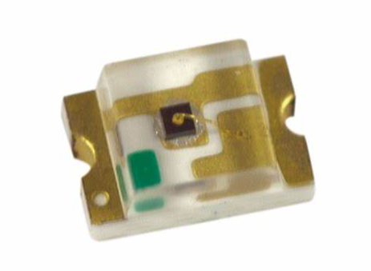

LED（Light Emitting
Diode），发光二极管，是一种能够将电能转化为可见光的固态的半导体器件，它可以直接把电转化为光。LED的心脏是一个半导体的晶片，晶片的一端附在一个支架上，一端是负极，另一端连接电源的正极，使整个晶片被环氧树脂封装起来。

既然是二极管，就一个非常重要的特性，就是**单向导电性**。所以它的一端要接正极，一端是负极。并且不能反接。

## 二、点灯电路原理

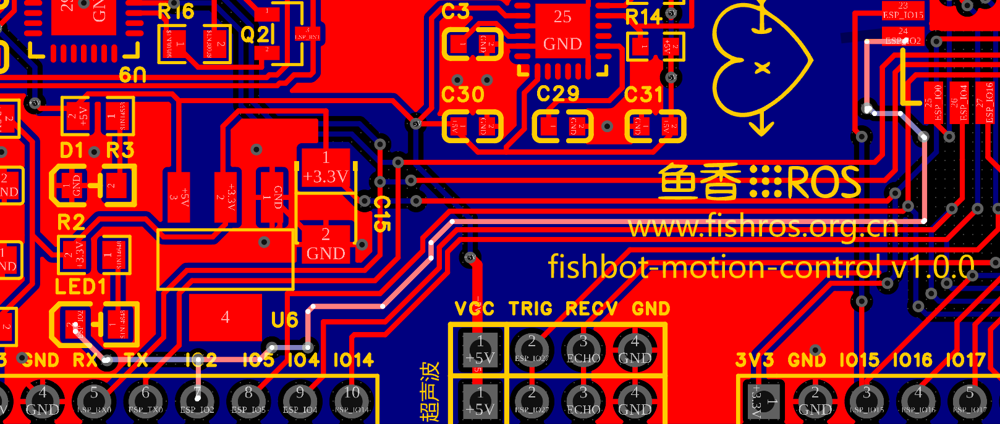

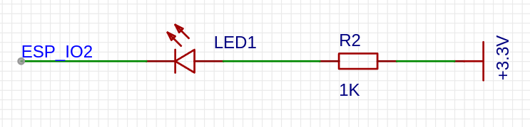

上面这张图是`MicroROS`学习板的蓝色LED电路图和实际电路，`R2`是一个`1K`欧姆的电阻，`LED1`是一个蓝色的`LED`灯，右侧是`3.3V`的电压源，左侧`ESP_IO2`是单片机的引脚。

**电流是从电压高的地方流向电压低的地方**，如果我们将`ESP_IO2`的电压设成`3.3V`时，此时电路两端电压相同，没有电流经过，此时LED1不工作。

如果我们将`ESP_IO2`设置成`0V`时，此时右侧电压高，左侧电压低，电流从右侧流过`LED1`到`ESP_IO2`，此时LED1开始工作。

所以我们可以通过`ESP_IO2`的电压高低来控制`LED1`灯的亮灭，这个就是点灯电路的原理。

# 2.完成点灯-GPIO控制

上一节了解了MicroROS学习板的LED电路原理，最后得到结论是通过控制ESP_IO2的电平就可以控制电压，接下来我们就尝试利用Arduino的ESP_IO2对IO进行控制。

## 一、GPIO控制介绍

### 1.1 什么是GPIO

首先我们了解下GPIO（General-purpose input/output），中文名通用型之输入输出的简称。

- 输出模式，指GPIO是可以通过程序**控制其电压高低**，普通的GPIO只能输出低电平（0V）和高电平（3.3V，有的单片机是5V）。
- 输入模式，指GPIO可以**读取其上的电压**，普通的GPIO只能读取低电平和高电平两种。比如当我们想测试一个按键是否被按下，就可以GPIO的输入功能。

### 1.2 GPIO控制API

Arduino提供了简单易用的API来控制IO的输入和输出。

#### 1.2.1 引脚模式设置-`pinMode`

该函数用于定义特定引脚的 GPIO 操作模式。

```c++
void pinMode(uint8_t pin, uint8_t mode);
```

- `pin`定义 GPIO 引脚编号。
- `mode`设置操作模式。

基本输入和输出支持以下模式：

- **INPUT**将 GPIO 设置为不带上拉或下拉（高阻抗）的输入。
- **OUTPUT**将 GPIO 设置为输出/读取模式。
- **INPUT_PULLDOWN** 将 GPIO 设置为具有内部下拉列表的输入。
- **INPUT_PULLUP** 将 GPIO 设置为带有内部上拉的输入。

#### 1.2.2 数字输出-`digitalWrite`

`digitalWrite`用于设置被配置为`OUTPUT`模式的引脚电平为`HIGH` 或 `LOW`。

```c++
void digitalWrite(uint8_t pin, uint8_t val);
```

- `pin`所设置的GPIO编号。
- `val`将输出数字状态设置为`HIGH` 或`LOW` 。

#### 1.2.3 数字输入-`digitalRead`

`digitalRead`用于读取配置为`INPUT`模式的给定引脚的状态。

```c++
int digitalRead(uint8_t pin);
```

- `pin` 所设置的GPIO编号。

此函数将返回所选引脚的逻辑状态为 `HIGH`或`LOW。`

有了上面三个函数，我们就可以编写代码了。

## 二、编写LED闪烁代码

新建`example02_led`工程，接着输入下面的代码。

```c++
/**
 * @file main.cpp
 * @author fishros@foxmail.com
 * @brief 使LED灯亮1s关闭1s,持续闪烁
 * @version 0.1
 * @date 2022-12-19
 *
 * @copyright Copyright (c) 2022
 *
 */
#include <Arduino.h>

void setup()
{
  // put your setup code here, to run once:
  pinMode(2, OUTPUT); // 设置2号引脚模式为OUTPUT模式
}

void loop()
{
  // put your main code here, to run repeatedly:
  digitalWrite(2, LOW);  // 低电平，打开LED灯
  delay(1000);           // 休眠1000ms
  digitalWrite(2, HIGH); // 高电平，关闭LED灯
  delay(1000);           // 休眠1000ms
}
```

这里我们让LED亮1s关闭1s，持续闪烁，代码很简单，不再讲解。

编译下载代码到开发板，接着观察现象，你会发现蓝色LED灯在不断闪烁。

## 三、通过串口控制LED

我们继续更新下工程代码，实现通过串口指令来控制LED的亮灭。

```c++
#include <Arduino.h>

void setup()
{
  Serial.begin(115200);
  pinMode(2, OUTPUT); // 设置2号引脚模式为OUTPUT模式
}

void loop()
{
  // LED串口控制代码
  if (Serial.available())
  {
    String command = Serial.readString();
    if (command == "on")
    {
      digitalWrite(2, LOW); // 低电平，打开LED灯
    }
    else if (command == "off")
    {

      digitalWrite(2, HIGH); // 高电平，关闭LED灯
    }
  }

  /* // LED闪烁代码
    digitalWrite(2, LOW);  // 低电平，打开LED灯
    delay(1000);           // 休眠1000ms
    digitalWrite(2, HIGH); // 高电平，关闭LED灯
    delay(1000);           // 休眠1000ms
  */
}
```

通过串口读取指令，收到on则打开LED，收到off关闭LED。

将代码下载到开发板，接着打开串口监视器，输入指令进行测试。

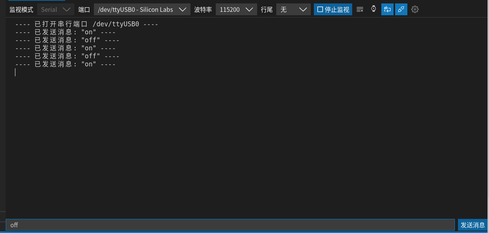

# 3.学会使用按键-GPIO输入

## 一、 按键检测原理

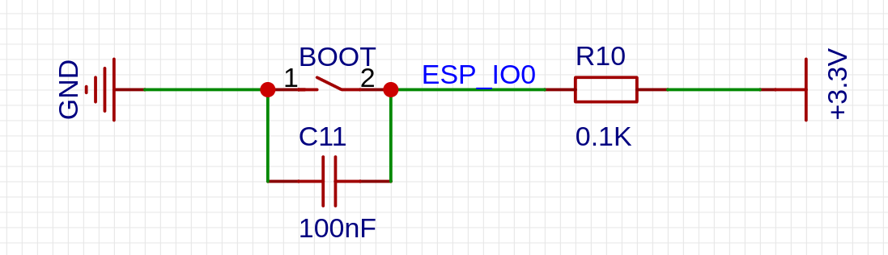

上面的原理图就是我们MicroROS开发板的BOOT按键的原理图，该按键的位置在板子的左下角。

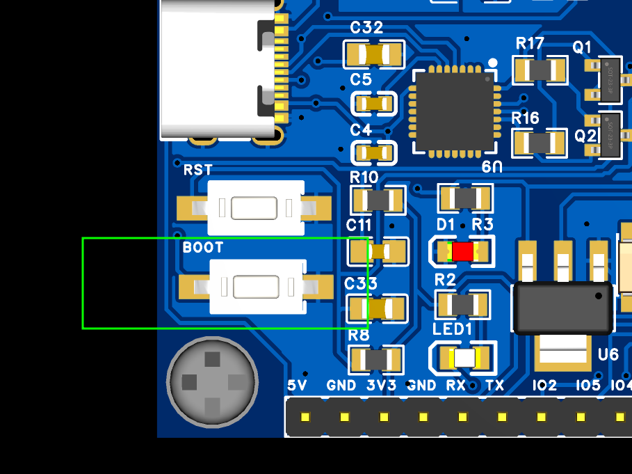

简单的看下原理图可知

- 当`BOOT`按下时，1,2就被联通了，此时`ESP_IO2`就连接到了`GND`上，也就是连接到`GND`，`ESP_IO2`的电平被拉低了。
- 当`BOOT`没有按下时，`ESP_IO0`通过`R10`连接到了`3.3V`，`ESP_IO2`引脚上的电压就被拉高了。

## 二、 使用按键控制LED灯（按着开松开关）

新建`example03_key`工程，在`main.cpp`输入代码。

```c++
/**
 * @file main.cpp
 * @author fishros@foxmail.com
 * @brief 使用按键控制LED灯,按着开，松开关
 * @version 0.1
 * @date 2022-12-19
 *
 * @copyright Copyright (c) 2022
 *
 */
#include <Arduino.h>

void setup()
{
  Serial.begin(115200);
  pinMode(0, INPUT);  // 设置0号引脚模式为INPUT模式
  pinMode(2, OUTPUT); // 设置2号引脚模式为OUTPUT模式
}

void loop()
{
  
  if (digitalRead(0) == LOW)
  {
    Serial.println("LED ON");
    digitalWrite(2, LOW); // 低电平，打开LED灯
  }
  else
  {

    Serial.println("LED OFF");
    digitalWrite(2, HIGH); // 高电平，关闭LED灯
  }
}
```

接着将代码编译烧录到开发板上，按下按键，查看LED灯。

## 三、使用按键控制LED（自锁开关）

所谓自锁，就是按下开，再按一下关，看一下代码实现

```c++
/**
 * @file main.cpp
 * @author fishros@foxmail.com
 * @brief 使用按键控制LED灯,按着开，松开关，自锁开关
 * @version 0.1
 * @date 2022-12-19
 *
 * @copyright Copyright (c) 2022
 *
 */
#include <Arduino.h>

bool status = false;

void setup()
{
  Serial.begin(115200);
  pinMode(0, INPUT);  // 设置0号引脚模式为INPUT模式
  pinMode(2, OUTPUT); // 设置2号引脚模式为OUTPUT模式
}

void loop()
{
  // 自锁开关
  if (digitalRead(0) == LOW)
  {
    delay(50); // 休眠50ms再次判断，防止误触
    if (digitalRead(0) == LOW)
    {
      status = !status;
      while (digitalRead(0) == LOW) // 死循环等待放开按键
        ;
    }
  }

  if (status == true)
  {
    digitalWrite(2, LOW); // 低电平，打开LED灯
  }
  else
  {

    digitalWrite(2, HIGH); // 低电平，打开LED灯
  }

  /*
  // 按着开，松开关
  if (digitalRead(0) == LOW)
  {
    Serial.println("LED ON");
    digitalWrite(2, LOW); // 低电平，打开LED灯
  }
  else
  {

    Serial.println("LED OFF");
    digitalWrite(2, HIGH); // 高电平，关闭LED灯
  }
  */
}
```

这里稍微复杂一些，当按键按下时我们需要休眠50ms，防止误触，接着反置状态，等待按键松开。

将代码下载到开发板，按下按键，测试一下。

# 4.电池电压测量-学会使用ADC

上面两节通过LED和按键学习了GPIO的输出和输入。

但这种输入和输出只有两种状态`HIGH`或者`LOW`，我们称这种为数字逻辑，这也是输入输出函数称为数字输入和数字输出的原因。

但是电池的电压是一个在一个范围内不断变化的值，明显无法通过`HIGH`和`LOW`来表示，所以本节我们学习使用ADC，将电压值这个模拟信号转换成数字信号。

## 一、ADC介绍

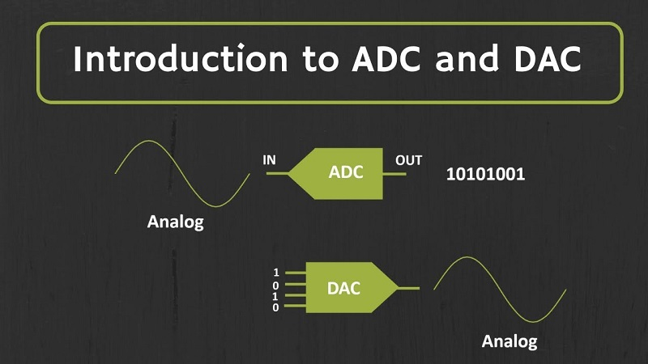

ADC（analog to digital converter）模数转换器是一种非常常见的外设，用于**将电压等模拟信号转换为数字形式**，以便微控制器可以读取和处理。

ADC在控制和监控应用中非常有用，因为大多数传感器（例如温度、压力、力）都是输出的模拟电压，所以我们需要掌握ADC。

> 与ADC相对应的DAC——用于将数字信号转换成模拟信号，比如将一段二进制的音乐文件转换成一段连续的电压信号播放出来就需要DAC。

### ADC（模数转换器）：

- **模拟信号**：ADC用于将模拟信号转换为数字信号。模拟信号是连续变化的电压或电流信号，可以来自传感器、电压源、电流源等。
- **采样**：ADC对模拟信号进行采样，即按照一定的时间间隔获取信号的离散样本值。
- **分辨率**：ADC的分辨率指的是它可以将模拟信号分成多少个离散的量化级别。通常以位数表示，例如8位、10位、12位等，分辨率越高，表示精度越高。
- **采样率**：ADC的采样率是指每秒钟进行模拟信号采样的次数，以赫兹（Hz）为单位。采样率越高，可以更准确地还原原始模拟信号。
- **参考电压**：ADC需要一个参考电压作为基准来将模拟信号转换为数字值。参考电压通常由外部提供，可以根据应用的需求选择适当的参考电压值。

### DAC（数模转换器）：

- **数字信号**：DAC用于将数字信号转换为模拟信号。数字信号是离散的、以数字形式表示的信号，可以来自于计算机、微控制器等。
- **数字量化**：DAC对数字信号进行量化，将离散的数字值转换为连续的模拟信号。量化过程中使用的分辨率决定了模拟输出的精度。
- **输出范围**：DAC的输出范围指的是它可以生成的模拟输出信号的电压或电流范围。输出范围可以根据具体的应用需求进行调整。
- **更新速率**：DAC的更新速率是指它能够按照新的数字输入值更新模拟输出的速率。更新速率越高，可以更快地响应输入信号的变化。

### ADC的例子：

- **温度测量**：使用温度传感器（例如热敏电阻或热电偶）将模拟温度信号转换为数字值，以便嵌入式系统可以读取和处理温度数据。
- **光照检测**：使用光敏电阻或光传感器将光照强度转换为数字信号，以便系统可以根据环境的亮度调整相应的控制或显示。
- **声音录制**：使用麦克风将声音信号转换为数字信号，以便进行声音的录制、处理和分析。
- **电压监测**：使用电压传感器将电压信号转换为数字值，以便监测和保护电路中的电压情况。

### DAC的例子：

- **音频输出**：将数字音频信号转换为模拟信号，以驱动扬声器或耳机，实现声音的播放和放大。
- **电机控制**：将数字控制信号转换为模拟电压或电流信号，以控制步进电机或直流电机的转速和方向。
- **波形生成**：根据数字信号生成模拟信号，用于生成各种波形（例如正弦波、方波、三角波）以及合成音频信号。
- **电源输出调节**：通过将数字控制信号转换为模拟电压信号，实现对电源输出的调节和稳定，例如用于电源管理和调整。

## 二、电池电压测量原理

在我们的开发板所使用的ESP32单片机上，自带了ADC模块，我们只需要将需要测量的模拟电压接入相应引脚，接着调用ADC相关API即可读取。

因为ADC原理是采用电压比较方式进行测量，而我们的单片机的供电电压为3.3V，所以测量的电压范围最大不能超过3.3V，但我们采用的电池电压和板子的供电电压分别是12V和5V的。

所以想要使用单片机测量电池电压，那么就要想办法将板子测量的电压按照比例缩小即可，根据初中物理知识，串联分压原理，就设计了这样的电路。

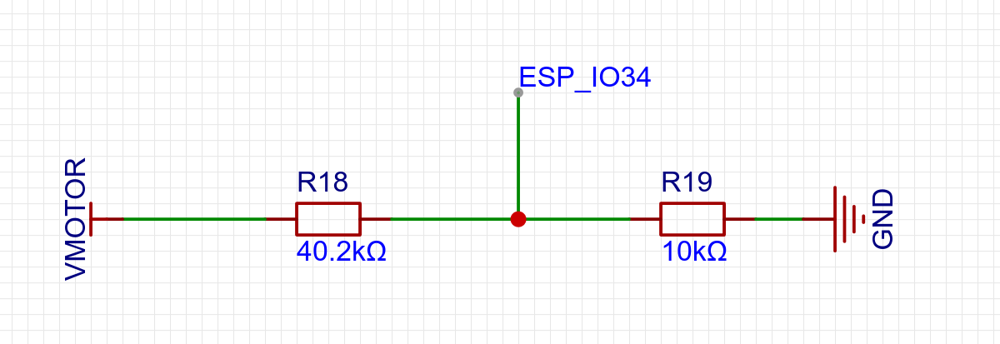

串联分压，左边接电机电压输入引脚，右侧接地，R18是40.2千欧阻值的电阻，R19是10千欧的，假如此时VMOTOR的输入电压为5V，那么ESP_IO34的电压就是 

$$ V_{ESPIO34}=V_{VMOTOR}*(10/(40.2+10))=V_{VMOTOR}/5.02 $$ 

那么如果此时通过ADC测量出 $$ V_{ESPIO34} $$ 上的电压，通过下面的等式就可以算出 $$ V_{VMOTOR} $$ 的电压值。 

$$ V_{VMOTOR} =V_{ESPIO34}*5.02 $$

## 三、Arduino ADC API

了解了原理，我们来看看Arduino为我们提供了哪些API可以直接获取到引脚上的电压。

### 3.1 设置ADC衰减系数（analogReadResolution）

这个函数用来设置ADC读取时的衰减系数。

输入到引脚的电压在输入到ADC之前可能会衰减。有 4 种可用的衰减选项，衰减越高，可测量的输入电压就越高，为了能够测量到12V以上的电压，我们采用最高的衰减比-ADC_11db。

```
typedef enum {
    ADC_0db,
    ADC_2_5db,
    ADC_6db,
    ADC_11db,
} adc_attenuation_t;
```

### 3.2 读取ADC值（analogRead）

此函数用于获取给定引脚或ADC通道的ADC原始值，默认是12位分辨率，所以这个读出来的值的范围就是0-2^12，也就是最大4096。

```
uint16_t analogRead(uint8_t pin);
```

- `pin` 要读取ADC值的GPIO 引脚

返回值：ADC原始值

### 3.3 读取电压值（analogReadMillivolts）

此函数用于获取给定引脚或ADC 通道的 ADC 值（以毫伏为单位）。

```
uint32_t analogReadMilliVolts(uint8_t pin);
```

- `pin` 要读取ADC值的GPIO 引脚

返回值：此函数将以毫伏为单位返回模拟值。

## 四、编写程序

利用上面的三个API和计算公式就可以实现电压的测量，新建`example04_adc`工程，在`main.cpp`输入代码。

```cpp
/**
 * @file main.cpp
 * @author fishros@foxmail.com
 * @brief 4.电池电压测量-学会使用ADC
 * @version 0.1
 * @date 2023-01-04
 *
 * @copyright Copyright(c) fishros.com  2023
 *
 */
#include <Arduino.h>

void setup()
{
  Serial.begin(115200);
  pinMode(34, INPUT);
  analogSetAttenuation(ADC_11db);
}

void loop()
{
  int analogValue = analogRead(34);                     // 读取原始值0-4096
  int analogVolts = analogReadMilliVolts(34);           // 读取模拟电压，单位毫伏
  float realVolts = 5.02 * ((float)analogVolts * 1e-3); // 计算实际电压值

  Serial.printf("ADC analog value = %d\n", analogValue);
  Serial.printf("ADC millivolts value = %d\n", analogVolts);
  Serial.printf("realVolts value = %f\n", realVolts);
  delay(100);
}
```

## 五、测试

根据第三节中的原理图，我们测量的是VMOTOR的电压，VMOTOR是通过一个跳线帽选择连接到5V还是12V上的，详情可以看下面的原理图。

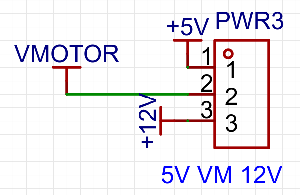

对应板子上的位置

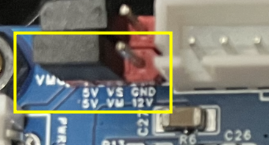

这里我们把跳线帽调整到左侧，让VMOTOR和5V连接，接着打开串口观察测量到的电压值。

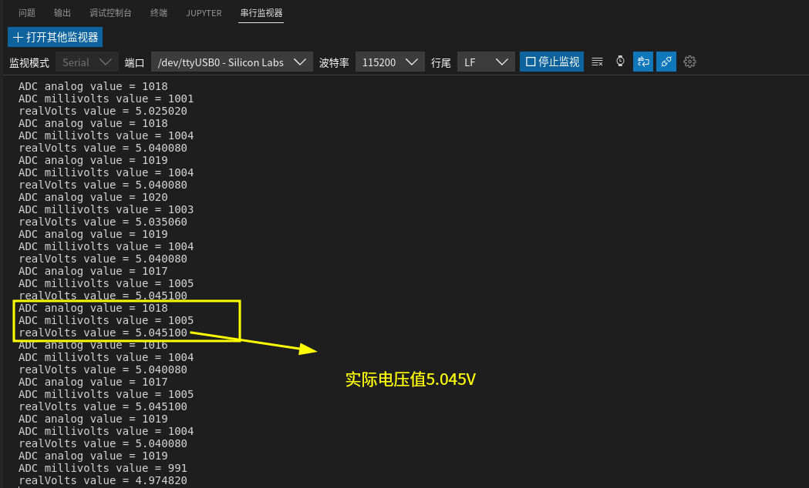

可以看到我们成功的测量到了实际的电压值为5.045V，符合正常电压值。

如果你有整台FishBot小车，可以将跳线帽调整到12V的位置，打开电池电源开关，看看是否可以正常测量到12V的电压。

## 六、总结

本节我们通过电池电压测量的例程，学习了ADC的使用，电池电压测量对我们机器人来说是非常重要的，当电压低的时候可以进行自动返回充电，然后等充电完成后再继续工作。


