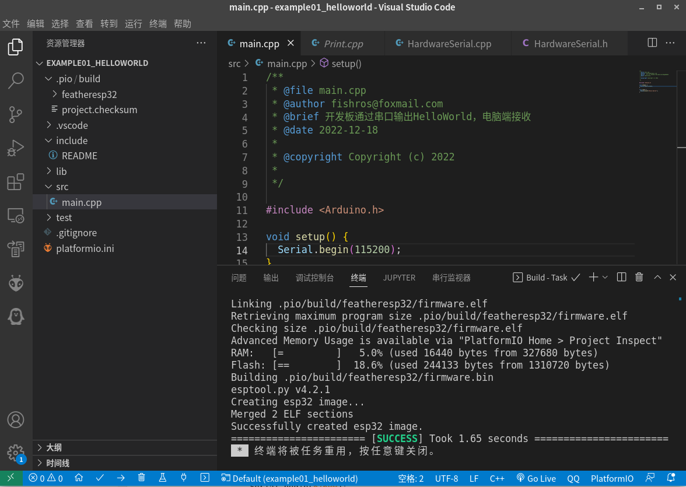
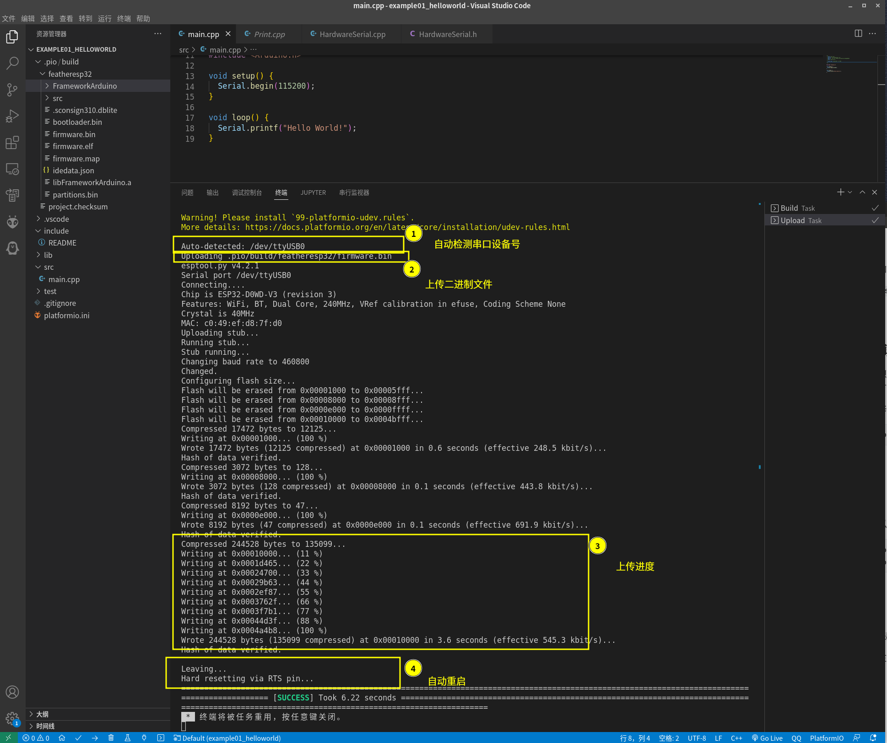
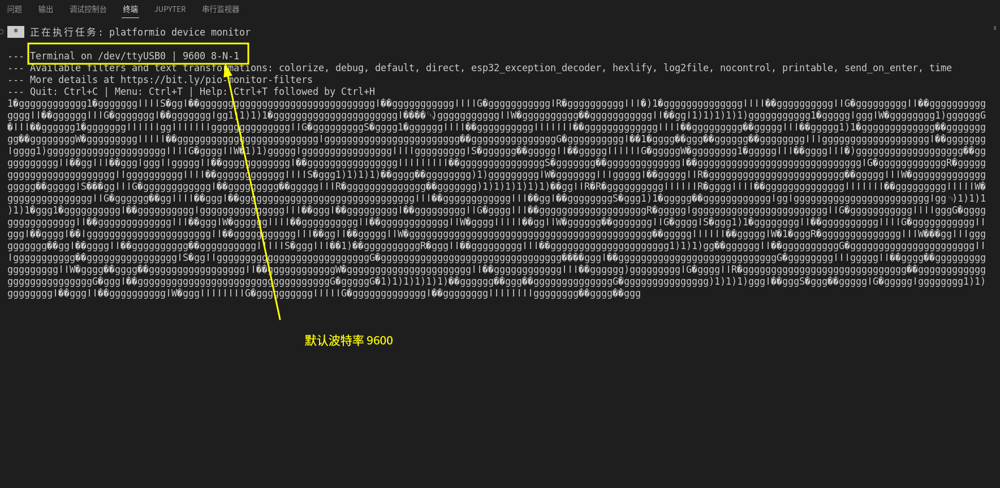
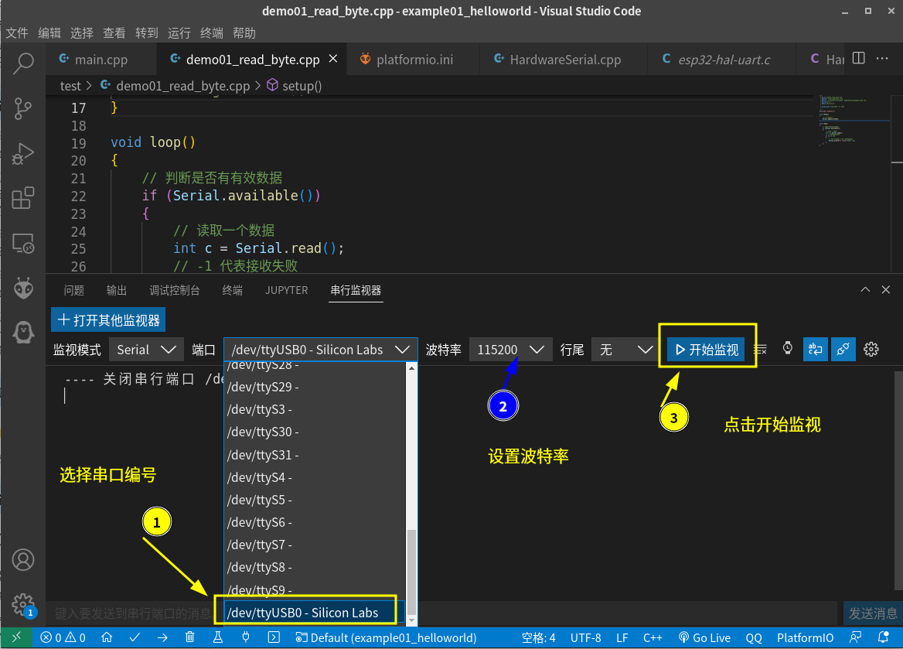
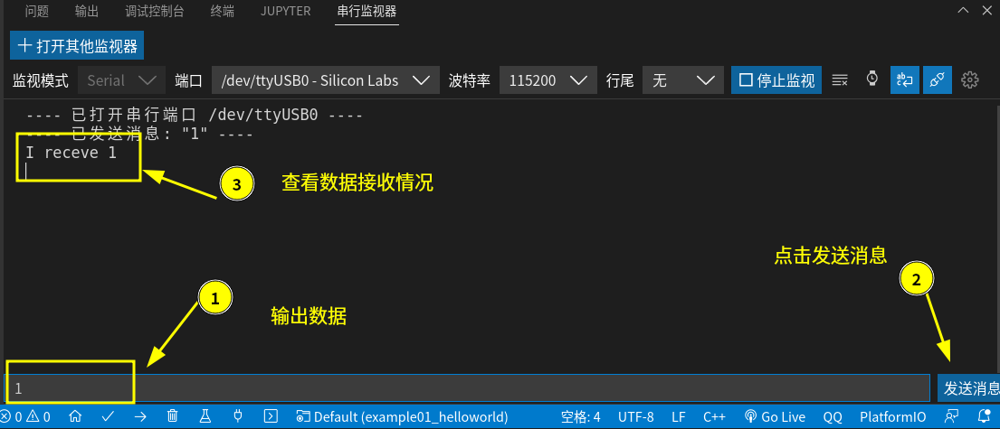
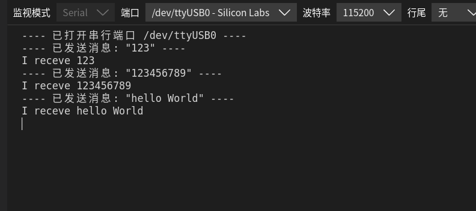

###### datetime:2023/10/17 11:03

###### author:nzb

> 该项目来源于[大佬的动手学ROS2](https://fishros.com/d2lros2)

# 5.第一个HelloWord工程

这一节我们正式编写代码，输出HelloWorld到电脑上。在正是开始编写代码前，我们先了解下开发流程。

## 一、Arduino开发流程

Arduino和其他单片机开发，一共分为四步。

1. 编写代码，根据相关的API和SDK进行代码的编写。
2. 编译工程，将工程的代码文件编译成二进制文件。
3. 烧录二进制文件，将上一步生成的二进制文件通过工具烧录到开发板中。
4. 运行测试，重启开发板，观察硬件执行情况（数据打印一般通过串口查看）

接下来就按照上面总结的几个步骤来尝试编写HelloWorld!

## 二、编写代码

### 2.1 Arduino函数介绍

前面有介绍，Ardunio平台的一大特点就是简单易用，而Ardunio使用的开发语言是C/C++，从工程生成的默认代码就可以看出来。

```C++
#include <Arduino.h>

void setup() {
  // put your setup code here, to run once:
}

void loop() {
  // put your main code here, to run repeatedly:
}
```

整个代码可以分为三个部分

1. 头文件`#include <Arduino.h>`
2. `setup()`函数，该函数只会在启动时被系统调用一次
3. `loop()`函数，该函数会被系统循环调用，直到重启或者断电

### 2.2 **为什么没有入口函数main函数？**

在学习C语言和C++时你应该学过，程序的入口文件是main函数，但在这个Arduino中却没有main函数的存在，这是为什么？

Arduino其实是有main函数的，Arduino的main函数长这样[ESP32-Arduino库有所不同，但原理一样：](https://github.com/espressif/arduino-esp32/blob/master/cores/esp32/main.cpp)

```C++
#include <Arduino.h>

// Declared weak in Arduino.h to allow user redefinitions.
int atexit(void (* /*func*/ )()) { return 0; }

// Weak empty variant initialization function.
// May be redefined by variant files.
void initVariant() __attribute__((weak));
void initVariant() { }

void setupUSB() __attribute__((weak));
void setupUSB() { }

int main(void)
{
    init();

    initVariant();

#if defined(USBCON)
    USBDevice.attach();
#endif

    setup();

    for (;;) {
        loop();
        if (serialEventRun) serialEventRun();
    }

    return 0;
}
```

核心的代码就这一段

```c++
    setup();

    for (;;) {
        loop();
        if (serialEventRun) serialEventRun();
    }
```

从这里就可以看出来，setup和loop函数之间的关系，在main函数中先调用一次setup函数，再使用for死循环调用loop函数。

### 2.3 串口输出HelloWorld

要实现将`HelloWorld!`从开发板输出到电脑上，我们需要了解一个常用的通信协议`Serial`，常称串口通信。

关于串口通信的原理可以到B站搜索相关视频，但在这里使用时你只需要了解如何使用即可。

这里我们了解三个函数，串口初始化、串口打印、串口读取。

| 函数原型                               | 参数                 | 返回值                      | 描述                                                         |
| -------------------------------------- | -------------------- | --------------------------- | ------------------------------------------------------------ |
| void  begin(unsigned long baud)        | baud：串口波特率     | void                        | 该函数用于初始化串口，主要配置串口波特率，波特率类似于频道号，串口收发双方保持相同的波特率才能进行正常通信。常见的波特率有9600，115200等，波特率其实代表每秒数据收发的频率，波特率越高，速度越快。 |
| size_t printf(const char *format, ...) | format：格式化字符串 | size_t 打印的字符数量       | 该函数和我们常见的printf函数一致，eg：`Serial.printf("Hello World!");` |
| int  read(void)                        | void                 | int 读取的字符值，ASSIC表示 | 该函数用于读取一个字节的数据，返回值就是这个字节的值，如果没有数据则返回`-1` |

基于上面的函数，我们可以这样输出HelloWorld!

```c++
#include <Arduino.h>

void setup() {
  Serial.begin(115200);
}

void loop() {
  Serial.printf("Hello World!\n");
}
```

在setup()函数里进行串口的初始化，**波特率设置成了115200**，在loop函数中不断的输出`Hello World!`。

## 三、编译代码

点击对号，或者使用快捷键`Ctrl+Alt+B`，即可编译。



看到`Building .pio/build/featheresp32/firmware.bin`和`Successfully created esp32 image.`就代表已经成功生成了二进制文件，下一步我们就开始烧录二进制文件。

## 四、烧录二进制文件

### 4.1 连接开发板到电脑

MicroROS学习板采用TypeC接口，你需要一个USB数据线将开发板连接到你的电脑。连接电脑后，Linux系统驱动会被自动搜索和加载，查看是否有正确驱动，可以使用lsusb进行测试。

```
lsusb
```

输入后，如果可以看到CP210x这个设备，就代表驱动加载成功了


驱动加载成功后在/dev目录下会多出一个ttyUSBx的设备，比如这里就是/dev/ttyUSB0

使用`ls /dev/ttyUSB*`指令可以将其列出


### 4.2 设置设备权限

我们想让开发板和电脑通过串口进行通信，电脑端只需对这个串口进行读写就行了。因为设备默认的生成目录是在/dev目录下，普通用户是没有读写权限的，所以在使用之前我们可以修改下该设备的权限。

临时修改

```
sudo chmod 666 /dev/ttyUSBx
```


也可以永久修改，将用户添加到dialout和plugdev组（重启后方生效）

```
sudo usermod -a -G dialout $USER
sudo usermod -a -G plugdev $USER
```


### 4.3 烧录二进制文件

点击左下角的上传烧录按钮，或者使用快捷键`Ctrl+Alt+U`进行烧录。



看到上面四部分打印代表烧录成功，可以看到PIO可以自动检测串口并进行连接，接着上传文件到开发板，最后自动重启。

## 五、运行测试

因为在下载完成后，下载程序帮我们自动重启了，所以这里我们不需要进行重启。接着我们使用串口Monitor打开串口看看有没有数据。

点击Serial Monitor按钮，或者使用快捷键`Ctrl+Alt+S`，如果没有出错，你将看到下面的乱码。

原因是终端的波特率不对，开发板发送给电脑数据的波特率是115200，而电脑接手的波特率是9600，不匹配就会造成乱码。



通过修改配置文件，可以修改Serial Monitor的默认波特率。

在`platformio.ini`中添加一行代码

```c++
monitor_speed = 115200
```


接着关闭刚刚的终端，再重新打开，接着我们就可以看到嗖嗖嗖的`Hello World!`


## 六、总结

本节我们成功将自己的代码上传到开发板上了，然后通过串口成功的和单片机建立了单向连接（开发板向电脑发送数据），下一节我们学习下电脑向单片机发送消息。

最后还有一个几个小作业

1.上面我们输出`Hello World!`在不断的输出，如果想要改成只输出一次，代码该怎么写？

答案：

```c++
#include <Arduino.h>

void setup() {
  Serial.begin(115200);
  Serial.printf("Hello World!\n");
}

void loop() {
}
```

2.上面我们输出`Hello World!`在快速的输出，如果想要改成每秒输出一次，代码该怎么写？

提示函数：`void delay(uint32_t ms)`延时指定ms。

答案：

```c++
#include <Arduino.h>

void setup() {
  Serial.begin(115200);
}

void loop() {
  delay(1000);
  Serial.printf("Hello World!\n");
}
```

# 6.串口通信-接收实验

上一节我们完成了第一个Hello World工程，学习使用了串口模块的初始化和发送，本节我们再来一个串口接收小实验，把串口收发数据补齐。

## 一、检测并接收单个字符

### 1.1 代码编写

```c++
/**
 * @file demo01_read_byte.cpp
 * @author fishros@foxmail.com
 * @brief 初始化串口，当有数据过来的时候读取并将数据打印出来
 * @version 0.1
 * @date 2022-12-18
 * 
 * @copyright Copyright (c) 2022
 * 
 */
#include <Arduino.h>

void setup()
{
    // 初始化串口
    Serial.begin(115200);
}

void loop()
{
    // 判断是否有有效数据，返回值是有效数据的长度
    if (Serial.available())
    {
        // 读取一个数据
        int c = Serial.read();
        // -1 代表接收失败
        if (c != -1)
        {
            // 以%c字符的格式输出接收的数据
            Serial.printf("I receve %c\n", c);
        }
    }
}
```

这里多用了一个函数`Serial.available()`，该函数代表当前串口中缓存有效数据的长度。

### 1.2 使用串口监视器发送消息

使用快捷键，编译 `Ctrl+Alt+B`、上传 `Ctrl+Alt+U`，接着准备发送数据

因为要发送消息，这里我们换一个收发分离的串口监视器来进行数据发送,在VSCODE的侧边栏中，点击“Extensions”图标，然后在搜索框中搜索“SerialMonitor”，找到并安装SerialMonitor插件。

使用`Ctrl+Alt+~`打开终端，接着在终端中你可以看到串口监视器一栏


接着打开我们板子对应的串口设备

- 选择串口编号
- 设置波特率
- 点击开始监视



发送测试

- 输入数据
- 点击发送
- 查看返回



尝试发送12


可以看到受到了两条返回，这是因为我们每次只接收一个数据，所以即使发送`12`，接收数据也是一个一个接收和打印的。

那有没有办法一次性接收多个数据呢？我们换个函数即可。

## 二、一次性接收一串数据

### 2.1 代码编写

```c++
/**
 * @file demo01_read_byte.cpp
 * @author fishros@foxmail.com
 * @brief 初始化串口，当有数据过来的时候读取并将数据打印出来
 * @version 0.1
 * @date 2022-12-18
 *
 * @copyright Copyright (c) 2022
 *
 */
#include <Arduino.h>

void setup()
{
    // 初始化串口
    Serial.begin(115200);
}

void loop()
{
    // 判断是否有有效数据
    if (Serial.available())
    {
        // 读取一个String字符串数据
        String str = Serial.readString();
        // 以%s的格式输出接收的数据
        Serial.printf("I receve %s\n", str.c_str());
    }
}
```

### 2.2 编译下载

点击按钮或者使用快捷键编译下载代码。

如果你在下载代码时遇到下面的错误，是因为刚刚的串口监视器没有关闭，

```
Auto-detected: /dev/ttyUSB0
Uploading .pio/build/featheresp32/firmware.bin
esptool.py v4.2.1
Serial port /dev/ttyUSB0
Connecting...........
serial.serialutil.SerialException: device reports readiness to read but returned no data (device disconnected or multiple access on port?)
*** [upload] Error 1
```

点击停止监视后，继续下载即可


### 2.3 测试

下载完成后，重新打开串口，接着发送一串消息



## 三、总结

本节我们通过两个串口接收数据小实验，学习了串口数据的接收和发送。