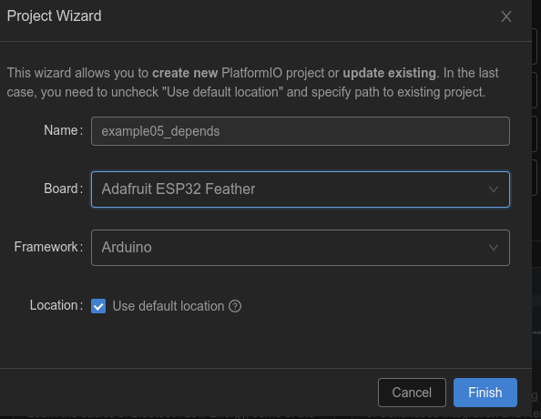
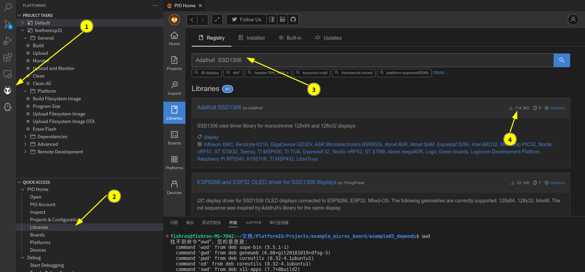
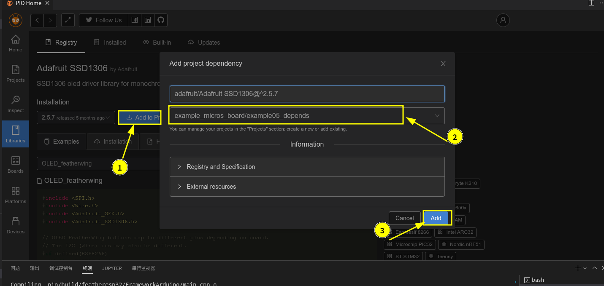
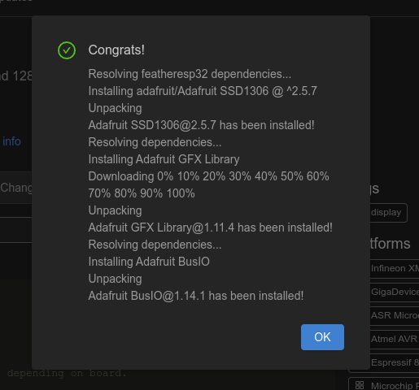
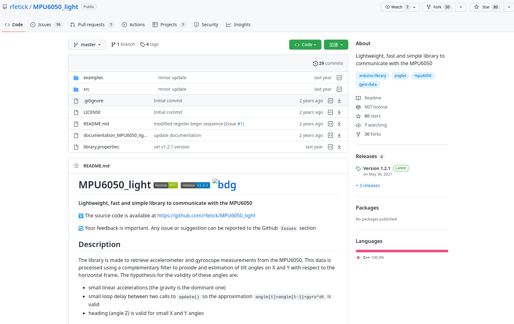
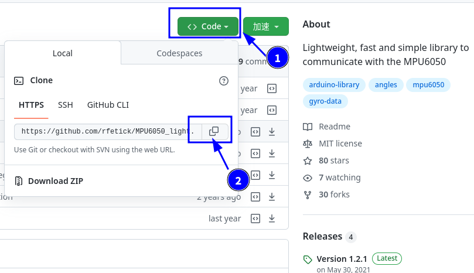
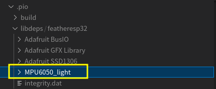
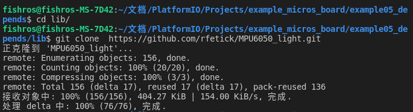

###### datetime:2023/10/18 17:03

###### author:nzb

> 该项目来源于[大佬的动手学ROS2](https://fishros.com/d2lros2)

# 1.学会安装第三方开源库

秉承着拒绝重复造轮子的ROS精神，本节我们学习如何在我们的工程里安装第三方开源库。

在我们的PIO工程中有多种方式可以添加第三方库，常用的有以下三种：

- 通过PIO搜索安装
- 通过GIT地址安装
- 手动下载安装

接下来我们以安装OLED库和IMU的驱动库为例，学习安装第三方库的方法。

开始之前先新建一个工程`example05_depends`



## 一、通过PIO搜索安装

我们以安装OLED常用的三方库`Adafruit  SSD1306`安装为例。

1. 点击PIO图标
2. 点击Libraries
3. 输入`Adafruit  SSD1306`
4. 点击下载按钮



5.点击Add to Project

6.选择要添加到的工程

7.点击Add



看到界面表示成功



此时打开`platformio.ini`你将看到

```
[env:featheresp32]
platform = espressif32
board = featheresp32
framework = arduino

lib_deps = adafruit/Adafruit SSD1306@^2.5.7
```

`lib_deps = adafruit/Adafruit SSD1306@^2.5.7`就是我们安装的库的名字。

既然安装好了那安装的文件位置在哪里呢？打开`.pio/libdeps/featheresp32`，这里就是我们安装的第三方库的代码位置。


## 二、通过GIT地址安装

我们的开发板，装载了一块MPU6050模块，通过该模块可以实现对温度、加速度、加速度、重力测量。

这里推荐一个简单易用MPU6050的三方驱动库MPU6050_light: https://github.com/rfetick/MPU6050_light



接着我们来看如何将该库添加到我们的工程中

1.复制仓库地址



2.打开`platformio.ini`，将地址复制进去即可

```ini
[env:featheresp32]
platform = espressif32
board = featheresp32
framework = arduino
lib_deps =
    adafruit/Adafruit SSD1306@^2.5.7
    https://github.com/rfetick/MPU6050_light.git
```

稍等片刻，等待PIO下载完成，接着打开`.pio/libdeps/featheresp32`可以看到`MPU6050_light`库被下载到该目录。



## 三、手动下载安装

该方式更简单，我们直接将工程克隆到工程的lib目录下即可。

```shell
cd lib
git clone https://github.com/rfetick/MPU6050_light.git
```



## 四、总结

本节我们学习了三种安装三方库的方式，下一节我们开始尝试使用三方库来驱动MPU6050和OLED。


