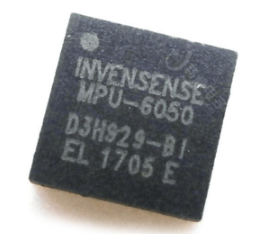
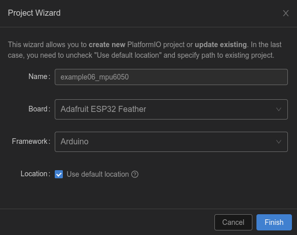
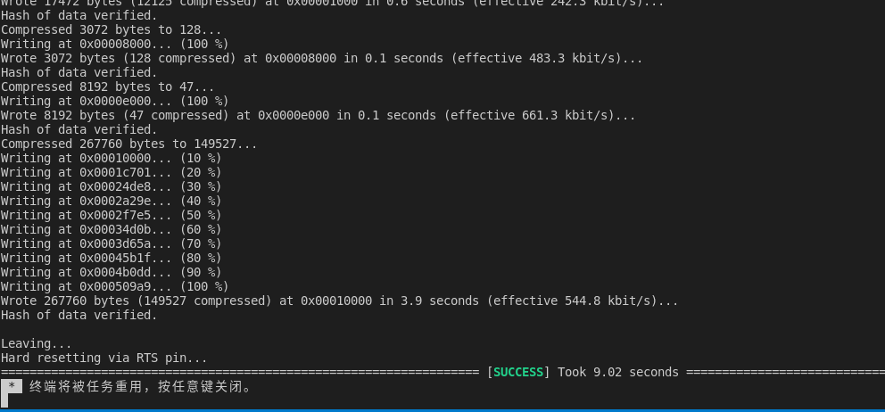

###### datetime:2023/10/18 17:03

###### author:nzb

> 该项目来源于[大佬的动手学ROS2](https://fishros.com/d2lros2)

# 2.使用开源库驱动IMU

上一节我们安装好了MPU6050的三方库，这一节我们尝试使用该库将我们板子上的IMU模块驱动起来。

## 一、MPU6050介绍

首先我们了解下MPU6050模块，从外观看，长这个样子



MPU6050 为全球首例集成六轴传感器的运动处理组件，内置了运动融合引擎，用于手持和桌面的应用程序、游戏控制器、体感遥控以及其他消费电子设备。它内置一个三轴 MEMS 陀螺仪、一个三轴 MEMS
加速度计、一个数字运动处理引擎（DMP）以及用于第三方的数字传感器接口的辅助 I2C 端口（常用于扩展磁力计）。当辅助 I2C 端口连接到一个三轴磁力计，MPU6050 能提供一个完整的九轴融合输出到其主 I2C 端口。

在我们板子上的位置是这里


## 二、调用开源库驱动

新建工程`example06_mpu6050`



### 2.1 添加依赖

修改`platformio.ini`

```ini
[env:featheresp32]
platform = espressif32
board = featheresp32
framework = arduino
lib_deps =
    https://ghproxy.com/https://github.com/rfetick/MPU6050_light.git
```

### 2.2 复制样例程序

该开源库作者提供了开源库的使用方式，将`.pio/libdeps/featheresp32/MPU6050_light/examples/GetAllData/GetAllData.ino`复制到main.cpp中。

```
/* Get all possible data from MPU6050
 * Accelerometer values are given as multiple of the gravity [1g = 9.81 m/s²]
 * Gyro values are given in deg/s
 * Angles are given in degrees
 * Note that X and Y are tilt angles and not pitch/roll.
 *
 * License: MIT
 */

#include "Wire.h"
#include <MPU6050_light.h>

MPU6050 mpu(Wire);

unsigned long timer = 0;

void setup() {
  Serial.begin(9600);
  Wire.begin();
  
  byte status = mpu.begin();
  Serial.print(F("MPU6050 status: "));
  Serial.println(status);
  while(status!=0){ } // stop everything if could not connect to MPU6050
  
  Serial.println(F("Calculating offsets, do not move MPU6050"));
  delay(1000);
  mpu.calcOffsets(true,true); // gyro and accelero
  Serial.println("Done!\n");
  
}

void loop() {
  mpu.update();

  if(millis() - timer > 1000){ // print data every second
    Serial.print(F("TEMPERATURE: "));Serial.println(mpu.getTemp());
    Serial.print(F("ACCELERO  X: "));Serial.print(mpu.getAccX());
    Serial.print("\tY: ");Serial.print(mpu.getAccY());
    Serial.print("\tZ: ");Serial.println(mpu.getAccZ());
  
    Serial.print(F("GYRO      X: "));Serial.print(mpu.getGyroX());
    Serial.print("\tY: ");Serial.print(mpu.getGyroY());
    Serial.print("\tZ: ");Serial.println(mpu.getGyroZ());
  
    Serial.print(F("ACC ANGLE X: "));Serial.print(mpu.getAccAngleX());
    Serial.print("\tY: ");Serial.println(mpu.getAccAngleY());
    
    Serial.print(F("ANGLE     X: "));Serial.print(mpu.getAngleX());
    Serial.print("\tY: ");Serial.print(mpu.getAngleY());
    Serial.print("\tZ: ");Serial.println(mpu.getAngleZ());
    Serial.println(F("=====================================================\n"));
    timer = millis();
  }

}
```

## 2.3 修改代码

1.修改波特率 `9600`->`115200`

2.修改IO地址 `Wire.begin();`->`Wire.begin(18, 19);`

修改完后代码，并附上对代码的注释讲解

```
#include "Wire.h"          // 导入I2C相关头文件
#include <MPU6050_light.h> // 导入MPU6050库

MPU6050 mpu(Wire); // 新建MPU6050对象mpu

unsigned long timer = 0;

void setup()
{
  Serial.begin(115200);
  Wire.begin(18, 19); // 初始化I2C，设置sda引脚为GPIO18,SCL引脚为GPIO19

  byte status = mpu.begin(); // 检测IMU模块状态
  Serial.print(F("MPU6050 status: "));
  Serial.println(status);
  while (status != 0)
  {
  } // stop everything if could not connect to MPU6050

  Serial.println(F("Calculating offsets, do not move MPU6050"));
  delay(1000);
  mpu.calcOffsets(true, true); // gyro and accelero 校准
  Serial.println("Done!\n");
}

void loop()
{
  mpu.update();

  if (millis() - timer > 1000)
  { // print data every second
    Serial.print(F("TEMPERATURE: "));
    Serial.println(mpu.getTemp()); // 温度
    Serial.print(F("ACCELERO  X: "));
    Serial.print(mpu.getAccX()); // X轴加速度
    Serial.print("\tY: ");
    Serial.print(mpu.getAccY()); // Y轴加速度
    Serial.print("\tZ: ");
    Serial.println(mpu.getAccZ()); // Z轴加速度

    Serial.print(F("GYRO      X: "));
    Serial.print(mpu.getGyroX()); // X轴 角速度
    Serial.print("\tY: ");
    Serial.print(mpu.getGyroY()); // Y轴 角速度
    Serial.print("\tZ: ");
    Serial.println(mpu.getGyroZ()); // Z轴 角速度

    Serial.print(F("ACC ANGLE X: "));
    Serial.print(mpu.getAccAngleX()); // X轴角加速度
    Serial.print("\tY: ");
    Serial.println(mpu.getAccAngleY()); // Y轴角加速度

    Serial.print(F("ANGLE     X: "));
    Serial.print(mpu.getAngleX()); // X角度
    Serial.print("\tY: ");
    Serial.print(mpu.getAngleY()); // Y角度
    Serial.print("\tZ: ");
    Serial.println(mpu.getAngleZ()); // Z角度
    Serial.println(F("=====================================================\n"));
    timer = millis();
  }
}
```

## 三、编译测试

保存代码，编译下载到开发板。打开串口监视器，查看结果。



结果


## 四、总结

本节我们通过调用开源库实现了对IMU传感器的的调用，如果你对该库感兴趣，可以随时到`.pio/libdeps/featheresp32/MPU6050_light/src/MPU6050_light.h`查看源码

```c++

class MPU6050{
  public:
    // INIT and BASIC FUNCTIONS
	MPU6050(TwoWire &w);
    byte begin(int gyro_config_num=1, int acc_config_num=0);
	...

  private:
	...
};

```

可以看到，这里是通过面向对象的方式将MPU6050封装成了一个类，我们使用的时候也是通过实例化后使用的，所以下一节我们将学习如何在我们的工程里使用面向对象的方式进行封装。