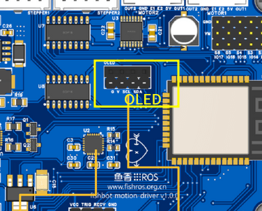
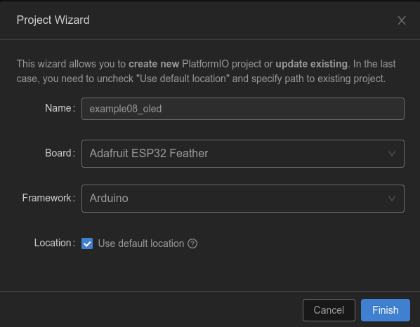
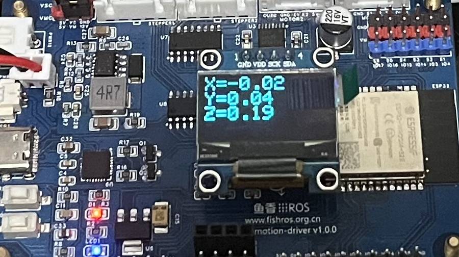

###### datetime:2023/10/24 10:23

###### author:nzb

> 该项目来源于[大佬的动手学ROS2](https://fishros.com/d2lros2)

# 4.使用开源库驱动OLED

本节我们继续尝试使用开源库，驱动OLED模块，最后的效果实现在OLED上显示当前的角度信息。

我们MicroROS开发板上的OLED位置如图所示。



## 一、OLED模块介绍


我们的OLDE模块样子如上图所示，整个屏幕有128*64个像素点，我们可以实现对每一个像素点的亮灭控制，以此实现对屏幕显示内容的控制。注意我们并不能控制屏幕上像素的颜色，所以我们OLED一般是单色的。

那我们如何控制它的亮灭呢，可以看到在OLED的上方一共有四个引脚，从左到右依次是GND、VCC、SCL、SDA，其中GND、VCC是用于OLED的供电使用，SCL和SDA是I2C通信使用。

听到I2C通信是不是觉得很熟悉，毕竟上一节驱动MPU6050时我们就是使用的I2C协议（Wrie），别着急，我们先用着，下一节我们再详细介绍I2C通信。

## 二、新建工程并安装依赖



安装依赖，可以直接修改`platformio.ini`

```ini
[env:featheresp32]
platform = espressif32
board = featheresp32
framework = arduino
lib_deps =
    https://ghproxy.com/https://github.com/rfetick/MPU6050_light.git
    adafruit/Adafruit SSD1306@^2.5.7
```

接着打开IMU的源码目录，将`.pio/libdeps/featheresp32/MPU6050_light/examples/GetAngle/GetAngle.ino`文件内容复制到main.cpp中，接着修改波特率和I2C地址。

```c++
#include "Wire.h"
#include <MPU6050_light.h>

MPU6050 mpu(Wire);
unsigned long timer = 0;

void setup()
{
  Serial.begin(115200);
  Wire.begin(18, 19);

  byte status = mpu.begin();
  Serial.print(F("MPU6050 status: "));
  Serial.println(status);
  while (status != 0)
  {
  } // stop everything if could not connect to MPU6050

  Serial.println(F("Calculating offsets, do not move MPU6050"));
  delay(1000);
  // mpu.upsideDownMounting = true; // uncomment this line if the MPU6050 is mounted upside-down
  mpu.calcOffsets(); // gyro and accelero
  Serial.println("Done!\n");
}

void loop()
{
  mpu.update();

  if ((millis() - timer) > 10)
  { // print data every 10ms
    Serial.print("X : ");
    Serial.print(mpu.getAngleX());
    Serial.print("\tY : ");
    Serial.print(mpu.getAngleY());
    Serial.print("\tZ : ");
    Serial.println(mpu.getAngleZ());
    timer = millis();
  }
}

```

## 三、使用Adafruit库驱动OLED

该库提供的驱动例程较为复杂，这里提供一个简易版本。

```c++
#include "Wire.h"
#include <Adafruit_GFX.h>     // 加载Adafruit_GFX库
#include <Adafruit_SSD1306.h> // 加载Adafruit_SSD1306库
Adafruit_SSD1306 display;     // 声明对象

void setup()
{
  Wire.begin(18, 19);
  display = Adafruit_SSD1306(128, 64, &Wire);
  display.begin(SSD1306_SWITCHCAPVCC, 0x3C); // 设置OLED的I2C地址，默认0x3C
  display.clearDisplay();                    // 清空屏幕
  display.setTextSize(2);                    // 设置字体大小，最小为1
  display.setCursor(0, 0);                   // 设置开始显示文字的坐标
  display.setTextColor(SSD1306_WHITE);       // 设置字体颜色
  display.println("hello oled!");             // 输出的字符
}

void loop()
{
  
}
```

根据上面的简易版本，修改原有的IMU代码，最后得到如下代码

```c++
/* Get tilt angles on X and Y, and rotation angle on Z
 * Angles are given in degrees
 *
 * License: MIT
 */

#include "Wire.h"
#include <MPU6050_light.h>
#include <Adafruit_GFX.h>     // 加载Adafruit_GFX库
#include <Adafruit_SSD1306.h> // 加载Adafruit_SSD1306库

Adafruit_SSD1306 display;
MPU6050 mpu(Wire);
unsigned long timer = 0;

void setup()
{
  Serial.begin(115200);
  Wire.begin(18, 19);
  /*========================OLED初始化====================================*/
  display = Adafruit_SSD1306(128, 64, &Wire);
  display.begin(SSD1306_SWITCHCAPVCC, 0x3C); // 设置OLED的I2C地址
  display.clearDisplay();                    // 清空屏幕
  display.setTextSize(2);                    // 设置字体大小
  display.setCursor(0, 0);                   // 设置开始显示文字的坐标
  display.setTextColor(SSD1306_WHITE);       // 设置字体颜色
  display.println("hello oled!");            // 输出的字符
  display.display();

  /*========================IMU初始化====================================*/
  byte status = mpu.begin();
  Serial.print(F("MPU6050 status: "));
  Serial.println(status);
  while (status != 0)
  {
  } // stop everything if could not connect to MPU6050

  Serial.println(F("Calculating offsets, do not move MPU6050"));
  delay(1000);
  // mpu.upsideDownMounting = true; // uncomment this line if the MPU6050 is mounted upside-down
  mpu.calcOffsets(); // gyro and accelero
  Serial.println("Done!\n");
}

void loop()
{
  mpu.update();

  if ((millis() - timer) > 100)
  { // print data every 100ms
    Serial.print("X : ");
    Serial.print(mpu.getAngleX());
    Serial.print("\tY : ");
    Serial.print(mpu.getAngleY());
    Serial.print("\tZ : ");
    Serial.println(mpu.getAngleZ());
    timer = millis();
    /*==========================OLED显示===========================*/
    display.clearDisplay();  // 清空屏幕
    display.setCursor(0, 0); // 设置开始显示文字的坐标
    display.print("X=");   // 输出X
    display.println(mpu.getAngleX());
    display.print("Y="); // 输出Y
    display.println(mpu.getAngleY());
    display.print("Z="); // 输出Z
    display.println(mpu.getAngleZ());
    display.display();
  }
}

```

## 四、下载测试

接上OLED，将代码编译下载到开发板上，观察OLED的显示。



## 五、总结

本节依然是很轻松的完成了OLED驱动，但你应该有个疑问，为什么OLED和MPU6050代码里都有这么一句`Wire.begin(18, 19);`，为什么都是18和19，不能是其他的数值吗？带着疑惑，下一节带你一起探秘I2C通信以及原理图。
