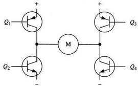
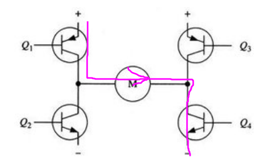
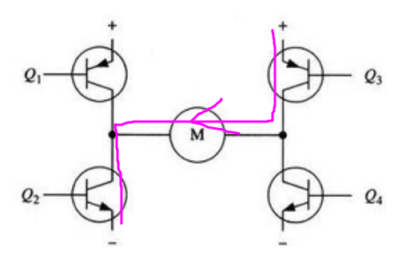
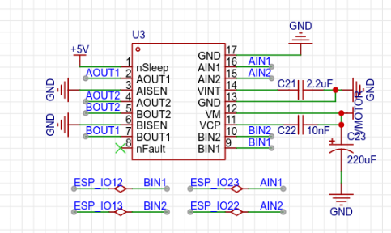

###### datetime:2023/10/31 14:20

###### author:nzb

> 该项目来源于[大佬的动手学ROS2](https://fishros.com/d2lros2)

# 2.从H桥说起-电机驱动原理介绍

## 一、电机驱动原理介绍

正式编写代码前，我们先了解下电机驱动的原理，以便于我们了解我们如何才能通过代码控制电机的转速和正反转。

### 1.1 H桥电路

让电机动起来只需要通电就行，比如我们用的额定电压为12V 130RPM的电机，当给到12V的电压时可以达到额定转速130转/分，但如果我们给8V的电压，此时电机依然可以转动，但转速就相对较低。

只是转起来还不行，要想控制机器人前进后退，左转右转，我们还需要控制轮子的转的方向，想要控制转速我们则需要控制给到电机的电压。

H桥（H-Bridge）电路可以帮我们实现上面两个功能，之所以叫H桥，因为这个电路长的像H。通过该电路可以将电源电压正向或反向地施加到电动机上，从而实现正向、反向转动和制动等功能。

该电路由四个独立开关管（MOSFET）组成，在H桥电路中，两个开关管组成一对，如上图所示。当我们接通Q1和Q4，关闭Q3和Q2时，电源电压正向施加到电动机上，使其正向转动。

我们关闭Q1和Q4，接通Q2和Q3时，电源电压反向施加到电动机上，使其反向转动。

在制动时，同时关闭四个开关管，这样电动机会在短时间内停止转动。另外，通过之前介绍的在PWM（脉宽调制）控制下，可以通过改变开关管的开关时间比例，就可以实现电动机的速度控制。

### 1.2 原理图

看完H桥电路原理，我们来讲讲在FishBot主控板上如何搭载的该电路的。在开发板上我们采用了一款H桥电路芯片DRV8833来实现电机的驱动。

该电路原理图如上图所示，我们通过AIN1（IO23）的高低电平控制H桥中Q1和Q4的开关，通过AIN2（IO22）控制Q2和Q3的开关，所以我们在程序中通过控制AIN1和AIN2的高低电平变化就可以完成对电机正反转的控制。