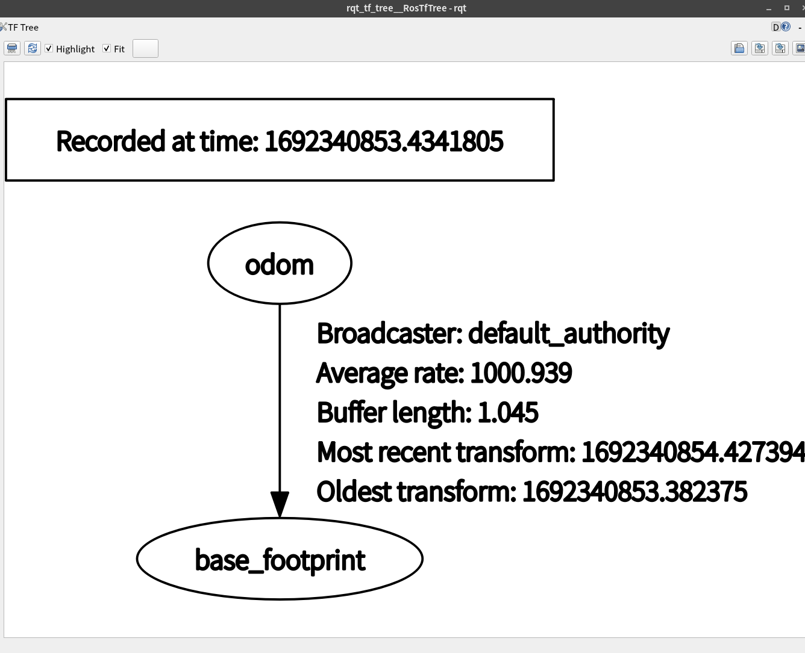

###### datetime:2023/11/08 16:27

###### author:nzb

> 该项目来源于[大佬的动手学ROS2](https://fishros.com/d2lros2)

# 3.建图前准备2-发布 Odom 的 TF

上一节我们简单了解了 ROS 中对移动机器人坐标系变换的规定如下：

```mermaid
graph LR
  O(odom) --> B(base_link)
  M(map) --> O
  E(earth) --> M
  B-->L(laser/imu...)
```

运行建图算法时，会得到 map 到 odom 之间的TF，base_link 到 雷达或者IMU 之间的坐标关系一般使用URDF进行描述，然后使用 robot_state_publisher 进行发布，也可以使用静态TF直接发布。

而 odom 到 base_link 之间的TF就需要我们从里程计中提取并发布，本节我们主要的工作就是订阅 里程计话题 发布 odom 到 base_link  之间的 TF 变换。

> 关于base_link和base_footprint 的区别
>
> 在机器人领域中，"base_link"和"base_footprint"是ROS（Robot Operating System）中两个常用的坐标系（frames）名称。它们用于表示机器人的基本参考坐标系，但在某些情况下，它们可能会有一些微妙的区别。
>
> 1. **base_link**：
>    "base_link"通常用于表示机器人的实际底盘或主体的坐标系。这个坐标系通常与机器人的物理结构直接相关，它可能位于机器人底盘的中心或者其他适当的位置。例如，对于一个移动机器人，"base_link"的原点可能位于机器人的几何中心或底盘的旋转中心，这取决于机器人的设计。
>
> 2. **base_footprint**：
>    "base_footprint"则更多地被用作机器人在地面上的一个虚拟平面的参考点，通常是机器人底盘的投影点。这个坐标系通常位于机器人底盘底部，用于表示机器人与地面的接触点。它可以被认为是机器人底部的一个虚拟标记，用来执行路径规划、避障和定位等任务。
>
> 在许多情况下，"base_link"和"base_footprint"的坐标原点可能是相同的，但它们的用途和表示方式略有不同。例如，在路径规划中，可能更常用"base_footprint"，因为它更接近机器人在地面上的实际位置，有助于避免碰撞。而在其他情况下，如控制机器人的运动，使用"base_link"可能更合适，因为它更直接地与机器人的物理结构相联系。

## 一、创建功能包

创建fishbot工作空间和功能包fishbot_bringup

```shell
mkdir -p ~/fishbot_ws/src
cd ~/fishbot_ws/src
ros2 pkg create --build-type ament_cmake fishbot_bringup
```

## 二、编写代码

在 src/fishbot_bringup/src/ 下新建 fishbot_bringup.cpp 

```
#include <rclcpp/rclcpp.hpp>
#include <nav_msgs/msg/odometry.hpp>
#include <tf2/utils.h>
#include <tf2_ros/transform_broadcaster.h>

class TopicSubscribe01 : public rclcpp::Node
{
public:
  TopicSubscribe01(std::string name) : Node(name)
  {
    // 创建一个订阅者，订阅"odom"话题的nav_msgs::msg::Odometry类型消息
    odom_subscribe_ = this->create_subscription<nav_msgs::msg::Odometry>(
      "odom", rclcpp::SensorDataQoS(),
      std::bind(&TopicSubscribe01::odom_callback, this, std::placeholders::_1));

    // 创建一个tf2_ros::TransformBroadcaster用于广播坐标变换
    tf_broadcaster_ = std::make_unique<tf2_ros::TransformBroadcaster>(this);
  }

private:
  rclcpp::Subscription<nav_msgs::msg::Odometry>::SharedPtr odom_subscribe_;
  std::unique_ptr<tf2_ros::TransformBroadcaster> tf_broadcaster_;
  nav_msgs::msg::Odometry odom_msg_;

  // 回调函数，处理接收到的odom消息
  void odom_callback(const nav_msgs::msg::Odometry::SharedPtr msg)
  {
    (void)msg;
    RCLCPP_INFO(this->get_logger(), "接收到里程计信息->底盘坐标系 tf :(%f,%f)", 
                msg->pose.pose.position.x, msg->pose.pose.position.y);

    // 更新odom_msg_的姿态信息
    odom_msg_.pose.pose.position.x = msg->pose.pose.position.x;
    odom_msg_.pose.pose.position.y = msg->pose.pose.position.y;
    odom_msg_.pose.pose.position.z = msg->pose.pose.position.z;

    odom_msg_.pose.pose.orientation.x = msg->pose.pose.orientation.x;
    odom_msg_.pose.pose.orientation.y = msg->pose.pose.orientation.y;
    odom_msg_.pose.pose.orientation.z = msg->pose.pose.orientation.z;
    odom_msg_.pose.pose.orientation.w = msg->pose.pose.orientation.w;
  };

public:
  // 发布坐标变换信息
  void publish_tf()
  {
    geometry_msgs::msg::TransformStamped transform;
    double seconds = this->now().seconds();
    transform.header.stamp = rclcpp::Time(static_cast<uint64_t>(seconds * 1e9));
    transform.header.frame_id = "odom";
    transform.child_frame_id = "base_footprint";

    transform.transform.translation.x = odom_msg_.pose.pose.position.x;
    transform.transform.translation.y = odom_msg_.pose.pose.position.y;
    transform.transform.translation.z = odom_msg_.pose.pose.position.z;
    transform.transform.rotation.x = odom_msg_.pose.pose.orientation.x;
    transform.transform.rotation.y = odom_msg_.pose.pose.orientation.y;
    transform.transform.rotation.z = odom_msg_.pose.pose.orientation.z;
    transform.transform.rotation.w = odom_msg_.pose.pose.orientation.w;

    // 广播坐标变换信息
    tf_broadcaster_->sendTransform(transform);
  }
};

int main(int argc, char **argv)
{
  // 初始化ROS节点
  rclcpp::init(argc, argv);

  // 创建一个TopicSubscribe01节点
  auto node = std::make_shared<TopicSubscribe01>("fishbot_bringup");

  // 设置循环频率
  rclcpp::WallRate loop_rate(20.0);
  while (rclcpp::ok())
  {
    // 处理回调函数
    rclcpp::spin_some(node);

    // 发布坐标变换信息
    node->publish_tf();

    // 控制循环频率
    loop_rate.sleep();
  }

  // 关闭ROS节点
  rclcpp::shutdown();
  return 0;
}

```

修改CMakeLists.txt

```
cmake_minimum_required(VERSION 3.8)
project(fishbot_bringup)

if(CMAKE_COMPILER_IS_GNUCXX OR CMAKE_CXX_COMPILER_ID MATCHES "Clang")
  add_compile_options(-Wall -Wextra -Wpedantic)
endif()

# find dependencies
find_package(ament_cmake REQUIRED)
find_package(rclcpp REQUIRED)
find_package(geometry_msgs REQUIRED)
find_package(nav_msgs REQUIRED)
find_package(tf2 REQUIRED)
find_package(tf2_ros REQUIRED)


set(dependencies
  rclcpp
  geometry_msgs
  nav_msgs
  tf2
  tf2_ros
)

# uncomment the following section in order to fill in
# further dependencies manually.
# find_package(<dependency> REQUIRED)

add_executable(fishbot_bringup src/fishbot_bringup.cpp)
target_include_directories(fishbot_bringup PUBLIC
  $<BUILD_INTERFACE:${CMAKE_CURRENT_SOURCE_DIR}/include>
  $<INSTALL_INTERFACE:include>)
target_compile_features(fishbot_bringup PUBLIC c_std_99 cxx_std_17)  # Require C99 and C++17

ament_target_dependencies(fishbot_bringup
  ${dependencies}
)
install(TARGETS fishbot_bringup
  DESTINATION lib/${PROJECT_NAME})

if(BUILD_TESTING)
  find_package(ament_lint_auto REQUIRED)
  # the following line skips the linter which checks for copyrights
  # comment the line when a copyright and license is added to all source files
  set(ament_cmake_copyright_FOUND TRUE)
  # the following line skips cpplint (only works in a git repo)
  # comment the line when this package is in a git repo and when
  # a copyright and license is added to all source files
  set(ament_cmake_cpplint_FOUND TRUE)
  ament_lint_auto_find_test_dependencies()
endif()


ament_package()

```


## 三、测试运行

编译运行节点

```shell
colcon build
source install/setup.bash
ros2 run fishbot_bringup fishbot_bringup
```

接着运行MicroROS Agent，发布 odom 话题出来

```
ros2 run fishbot_bringup fishbot_bringup
---
[INFO] [1692340618.330952225] [fishbot_bringup]: recv odom->base_footprint tf :(0.001754,0.000030)
[INFO] [1692340618.379986197] [fishbot_bringup]: recv odom->base_footprint tf :(0.001754,0.000030)
[INFO] [1692340618.434032295] [fishbot_bringup]: recv odom->base_footprint tf :(0.001754,0.000030)
[INFO] [1692340618.480949009] [fishbot_bringup]: recv odom->base_footprint tf :(0.001754,0.000030)
[INFO] [1692340618.535952833] [fishbot_bringup]: recv odom->base_footprint tf :(0.001754,0.000030)
```

接着我们来查看下TF

```
ros2 run rqt_tf_tree rqt_tf_tree
```

结果如下



## 四、总结

有了 odom 到 base_link/base_footprint 之间的变换，接下来我们来搞定 base_link 到机器人各个组件之间的变换。